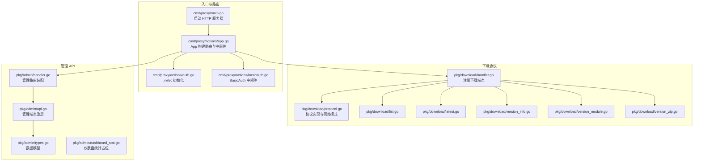
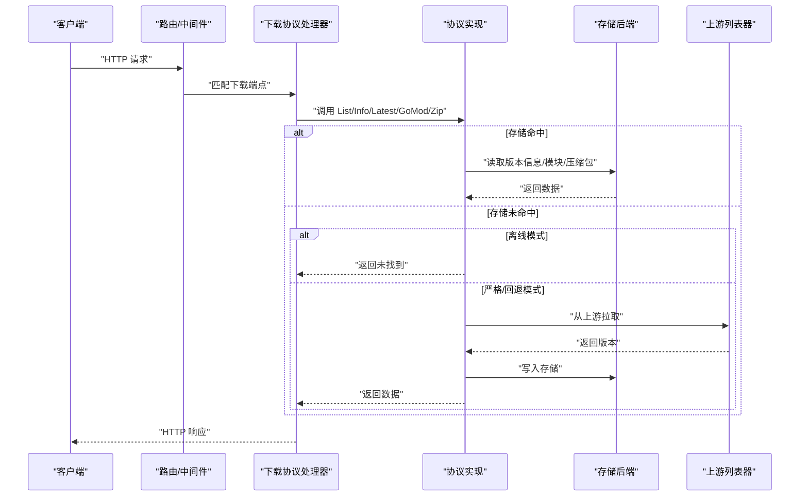
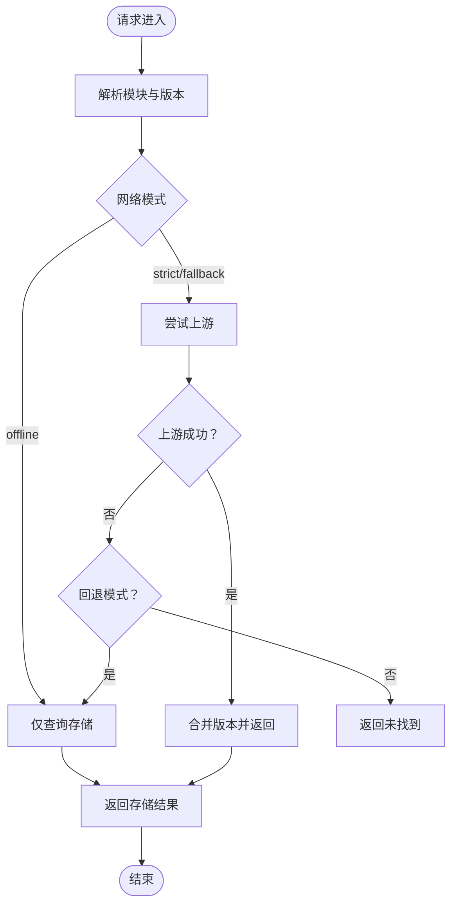
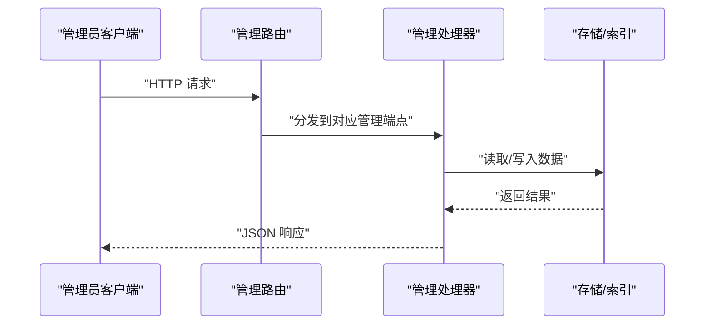
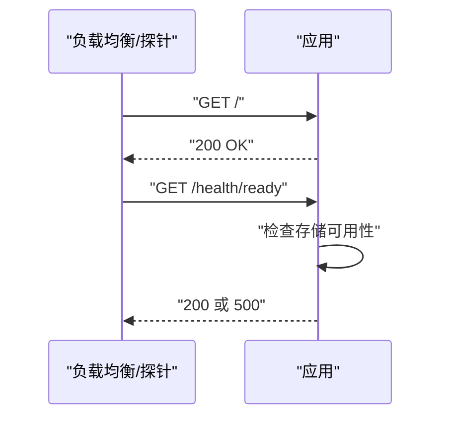
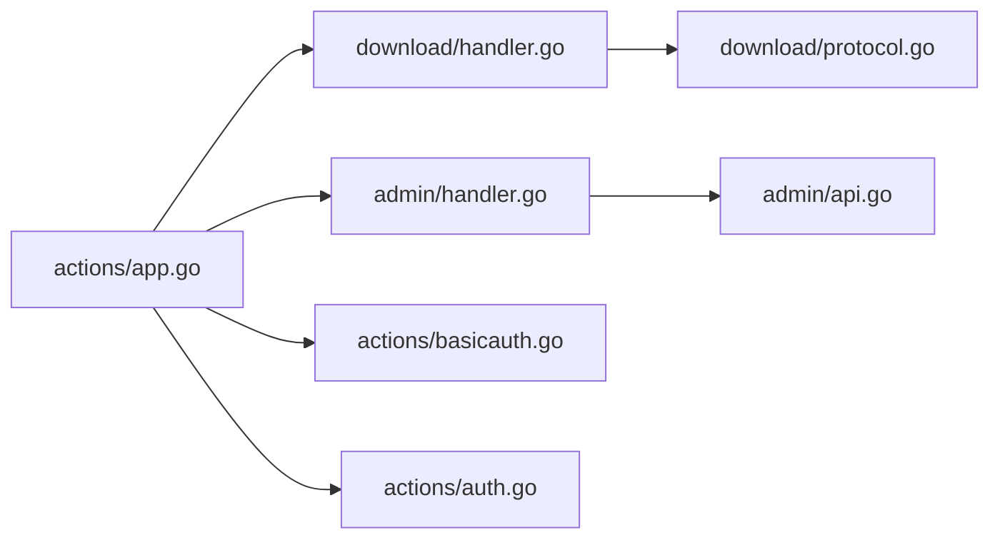

# API 参考

<cite>
**本文引用的文件**
- [cmd/proxy/main.go](file://cmd/proxy/main.go)
- [cmd/proxy/actions/app.go](file://cmd/proxy/actions/app.go)
- [cmd/proxy/actions/auth.go](file://cmd/proxy/actions/auth.go)
- [cmd/proxy/actions/basicauth.go](file://cmd/proxy/actions/basicauth.go)
- [cmd/proxy/actions/version.go](file://cmd/proxy/actions/version.go)
- [cmd/proxy/actions/health.go](file://cmd/proxy/actions/health.go)
- [cmd/proxy/actions/readiness.go](file://cmd/proxy/actions/readiness.go)
- [pkg/admin/api.go](file://pkg/admin/api.go)
- [pkg/admin/types.go](file://pkg/admin/types.go)
- [pkg/admin/handler.go](file://pkg/admin/handler.go)
- [pkg/admin/dashboard_stat.go](file://pkg/admin/dashboard_stat.go)
- [pkg/download/handler.go](file://pkg/download/handler.go)
- [pkg/download/protocol.go](file://pkg/download/protocol.go)
- [pkg/download/version_info.go](file://pkg/download/version_info.go)
- [pkg/download/version_module.go](file://pkg/download/version_module.go)
- [pkg/download/version_zip.go](file://pkg/download/version_zip.go)
- [pkg/download/list.go](file://pkg/download/list.go)
- [pkg/download/latest.go](file://pkg/download/latest.go)
- [pkg/config/config.go](file://pkg/config/config.go)
- [config.devh.toml](file://config.devh.toml)
</cite>

## 目录
1. [简介](#简介)
2. [项目结构](#项目结构)
3. [核心组件](#核心组件)
4. [架构总览](#架构总览)
5. [详细组件分析](#详细组件分析)
6. [依赖关系分析](#依赖关系分析)
7. [性能与可扩展性](#性能与可扩展性)
8. [故障排查指南](#故障排查指南)
9. [结论](#结论)
10. [附录](#附录)

## 简介
本文件为 Athens 代理服务的完整 API 参考，涵盖以下类别：
- 下载 API：面向 Go 模块下载协议的端点，与 go 命令交互。
- 管理 API：面向管理员的系统状态、仪表盘、活动、设置、仓库与上传任务等接口。
- 认证 API：健康检查与就绪检查端点，以及 BasicAuth 中间件保护策略。
- 监控 API：系统状态、版本信息、统计信息等。

文档提供每个端点的 HTTP 方法、URL 模式、请求/响应结构、认证方式、参数说明、错误码与使用示例，并给出版本管理与兼容性建议、客户端实现要点与调试技巧。

## 项目结构
- 入口与路由装配
  - 服务入口负责加载配置、初始化日志、构建 HTTP 路由与中间件，并启动 HTTP 服务器。
  - 路由装配在应用层完成，挂载下载协议处理器与管理 API 路由。
- 下载协议
  - 下载协议抽象定义了与 go 命令交互的端点集合，具体实现通过存储后端与上游列表器组合完成。
- 管理 API
  - 管理端路由统一前缀，提供系统状态、仪表盘、活动、设置、仓库与上传任务等接口。
- 认证与中间件
  - 支持 BasicAuth、过滤器、安全头、请求 ID、日志、追踪与指标导出等中间件。

图表来源
- [cmd/proxy/main.go](file://cmd/proxy/main.go#L29-L127)
- [cmd/proxy/actions/app.go](file://cmd/proxy/actions/app.go#L23-L138)
- [cmd/proxy/actions/basicauth.go](file://cmd/proxy/actions/basicauth.go#L11-L42)
- [cmd/proxy/actions/auth.go](file://cmd/proxy/actions/auth.go#L13-L67)
- [pkg/download/handler.go](file://pkg/download/handler.go#L39-L57)
- [pkg/download/protocol.go](file://pkg/download/protocol.go#L20-L73)
- [pkg/admin/handler.go](file://pkg/admin/handler.go#L13-L19)
- [pkg/admin/api.go](file://pkg/admin/api.go#L16-L48)
- [pkg/admin/types.go](file://pkg/admin/types.go#L4-L39)
- [pkg/admin/dashboard_stat.go](file://pkg/admin/dashboard_stat.go#L11-L19)

章节来源
- [cmd/proxy/main.go](file://cmd/proxy/main.go#L29-L127)
- [cmd/proxy/actions/app.go](file://cmd/proxy/actions/app.go#L23-L138)

## 核心组件
- 应用入口与服务器
  - 加载配置、初始化日志、构建 HTTP 路由与中间件、选择监听方式（TCP/Unix Socket）、可选 pprof。
- 路由与中间件
  - 请求 ID、请求日志、安全头、BasicAuth、过滤器、验证钩子、追踪与指标导出。
- 下载协议
  - 定义 List/Info/Latest/GoMod/Zip 端点；支持严格/离线/回退三种网络模式；异步/重定向下载策略。
- 管理 API
  - 系统状态、仪表盘、最近活动、系统设置、模块下载统计与热门排行、仓库管理、上传任务与导入。

章节来源
- [cmd/proxy/main.go](file://cmd/proxy/main.go#L29-L127)
- [cmd/proxy/actions/app.go](file://cmd/proxy/actions/app.go#L46-L138)
- [pkg/download/protocol.go](file://pkg/download/protocol.go#L20-L73)
- [pkg/admin/api.go](file://pkg/admin/api.go#L16-L48)

## 架构总览
下图展示请求在系统内的流转：客户端请求进入路由层，经中间件处理后分发至下载协议或管理 API；下载协议根据网络模式与存储后端决定是否从上游拉取或返回缓存。

图表来源
- [pkg/download/handler.go](file://pkg/download/handler.go#L39-L57)
- [pkg/download/protocol.go](file://pkg/download/protocol.go#L83-L166)
- [pkg/download/protocol.go](file://pkg/download/protocol.go#L253-L279)

## 详细组件分析

### 下载 API（与 go 命令交互）
- 端点注册
  - 列表：GET /{module}/@v/list
  - 最新：GET /{module}/@latest
  - 信息：GET /{module}/@v/{version}.info
  - 模块：GET /{module}/@v/{version}.mod
  - 压缩包：GET /{module}/@v/{version}.zip，支持 HEAD
- 参数与行为
  - 模块路径与版本遵循 Go 语义；伪版本过滤与合并策略保证稳定性。
  - 网络模式：
    - strict：上游失败则报错，行为稳定。
    - offline：仅返回存储版本。
    - fallback：上游失败时返回存储版本。
  - 下载策略：
    - 同步：阻塞等待下载完成。
    - 异步：后台下载，立即返回未找到。
    - 重定向：返回重定向提示。
    - 异步重定向：后台下载，返回重定向。
- 错误与状态
  - 未找到：返回相应错误码。
  - 上游不可用且严格模式：返回错误。
  - 离线模式访问最新：返回未找到。
- 示例请求/响应
  - 列表：GET /github.com/leimeng-go/athens/@v/list
  - 最新：GET /github.com/leimeng-go/athens/@latest
  - 信息：GET /github.com/leimeng-go/athens/@v/v0.1.0.info
  - 模块：GET /github.com/leimeng-go/athens/@v/v0.1.0.mod
  - 压缩包：GET /github.com/leimeng-go/athens/@v/v0.1.0.zip

图表来源
- [pkg/download/protocol.go](file://pkg/download/protocol.go#L83-L166)
- [pkg/download/protocol.go](file://pkg/download/protocol.go#L182-L197)
- [pkg/download/protocol.go](file://pkg/download/protocol.go#L199-L232)
- [pkg/download/protocol.go](file://pkg/download/protocol.go#L234-L251)

章节来源
- [pkg/download/handler.go](file://pkg/download/handler.go#L39-L57)
- [pkg/download/protocol.go](file://pkg/download/protocol.go#L20-L73)
- [pkg/download/protocol.go](file://pkg/download/protocol.go#L83-L166)
- [pkg/download/protocol.go](file://pkg/download/protocol.go#L182-L197)
- [pkg/download/protocol.go](file://pkg/download/protocol.go#L199-L232)
- [pkg/download/protocol.go](file://pkg/download/protocol.go#L234-L251)

### 管理 API
- 系统状态
  - GET /admin/api/system/status
  - 返回字段：状态、运行时长、版本、Go 版本、内存占用、CPU 占用。
- 仪表盘
  - GET /admin/api/dashboard
  - 返回字段：总模块数、总下载量、总仓库数、存储使用量、下载趋势、热门模块、最近活动。
- 最近活动
  - GET /admin/api/activities/recent?limit=N
  - 查询参数：limit（默认 10）。
- 系统设置
  - GET /admin/api/settings
  - 返回当前系统配置摘要（具体字段以实现为准）。
- 模块下载
  - GET /admin/api/download/modules
  - GET /admin/api/download/modules/{path}/versions
  - GET /admin/api/download/modules/{path}
  - GET /admin/api/download/stats
  - GET /admin/api/download/popular
  - GET /admin/api/download/recent
- 仓库
  - GET /admin/api/repositories
  - GET /admin/api/repositories/batch-delete
  - GET /admin/api/repositories/{id}
- 上传
  - POST /admin/api/upload/module
  - POST /admin/api/upload/import-url
  - GET /admin/api/upload/tasks
  - GET /admin/api/upload/tasks/{taskId}
  - GET /admin/api/upload/tasks/{taskId}/cancel

图表来源
- [pkg/admin/api.go](file://pkg/admin/api.go#L16-L48)
- [pkg/admin/types.go](file://pkg/admin/types.go#L4-L39)
- [pkg/admin/handler.go](file://pkg/admin/handler.go#L13-L19)

章节来源
- [pkg/admin/api.go](file://pkg/admin/api.go#L16-L48)
- [pkg/admin/types.go](file://pkg/admin/types.go#L4-L39)
- [pkg/admin/handler.go](file://pkg/admin/handler.go#L13-L19)

### 认证 API 与健康检查
- 健康检查
  - GET /
  - 返回 200 OK，用于负载均衡探活。
- 就绪检查
  - GET /health/ready
  - 通过存储后端探测可用性，失败返回 500。
- BasicAuth
  - 对除健康/就绪外的路径进行 BasicAuth 校验，失败返回 401。
- 配置
  - 用户名/密码来自配置；支持从 GitHub Token 自动生成 .netrc。

图表来源
- [cmd/proxy/actions/health.go](file://cmd/proxy/actions/health.go#L7-L10)
- [cmd/proxy/actions/readiness.go](file://cmd/proxy/actions/readiness.go#L9-L16)
- [cmd/proxy/actions/basicauth.go](file://cmd/proxy/actions/basicauth.go#L11-L42)
- [cmd/proxy/actions/auth.go](file://cmd/proxy/actions/auth.go#L13-L67)

章节来源
- [cmd/proxy/actions/health.go](file://cmd/proxy/actions/health.go#L7-L10)
- [cmd/proxy/actions/readiness.go](file://cmd/proxy/actions/readiness.go#L9-L16)
- [cmd/proxy/actions/basicauth.go](file://cmd/proxy/actions/basicauth.go#L11-L42)
- [cmd/proxy/actions/auth.go](file://cmd/proxy/actions/auth.go#L13-L67)

### 监控 API
- 版本信息
  - GET /version
  - 返回构建版本信息（版本号、提交、时间等）。
- 统计信息
  - GET /admin/api/stat
  - 返回索引器统计总数（具体字段以实现为准）。
- 系统状态
  - GET /admin/api/system/status
  - 返回运行时长、版本、Go 版本、内存占用、CPU 占用等。

章节来源
- [cmd/proxy/actions/version.go](file://cmd/proxy/actions/version.go#L10-L14)
- [cmd/proxy/actions/stat.go](file://cmd/proxy/actions/stat.go#L15-L31)
- [pkg/admin/api.go](file://pkg/admin/api.go#L50-L101)

## 依赖关系分析
- 组件耦合
  - 应用层通过配置驱动中间件与存储后端装配，耦合度低。
  - 下载协议通过接口抽象与存储/上游解耦，便于扩展不同存储与网络模式。
  - 管理 API 与下载协议通过路由分离，互不影响。
- 外部依赖
  - 路由：gorilla/mux
  - 安全头：unrolled/secure
  - 追踪：OpenCensus
  - 指标：可插拔导出器

图表来源
- [cmd/proxy/actions/app.go](file://cmd/proxy/actions/app.go#L46-L138)
- [pkg/download/handler.go](file://pkg/download/handler.go#L39-L57)
- [pkg/admin/handler.go](file://pkg/admin/handler.go#L13-L19)
- [pkg/download/protocol.go](file://pkg/download/protocol.go#L20-L73)
- [pkg/admin/api.go](file://pkg/admin/api.go#L16-L48)
- [cmd/proxy/actions/basicauth.go](file://cmd/proxy/actions/basicauth.go#L11-L42)
- [cmd/proxy/actions/auth.go](file://cmd/proxy/actions/auth.go#L13-L67)

章节来源
- [cmd/proxy/actions/app.go](file://cmd/proxy/actions/app.go#L46-L138)
- [pkg/download/handler.go](file://pkg/download/handler.go#L39-L57)
- [pkg/admin/handler.go](file://pkg/admin/handler.go#L13-L19)
- [pkg/download/protocol.go](file://pkg/download/protocol.go#L20-L73)
- [pkg/admin/api.go](file://pkg/admin/api.go#L16-L48)
- [cmd/proxy/actions/basicauth.go](file://cmd/proxy/actions/basicauth.go#L11-L42)
- [cmd/proxy/actions/auth.go](file://cmd/proxy/actions/auth.go#L13-L67)

## 性能与可扩展性
- 缓存控制
  - 列表与版本信息端点设置无缓存头，避免 CDN 缓存导致的陈旧版本。
- 并发与超时
  - 列表端点并发查询存储与上游，统一等待后合并结果。
  - 下载过程使用独立上下文与超时，保证请求结束后异步任务仍可继续。
- 网络模式
  - offline 模式最小化外部依赖，提升稳定性。
  - fallback 模式在上游不可用时仍可返回历史版本。
- 指标与追踪
  - 可配置追踪与指标导出器，便于性能观测与问题定位。

章节来源
- [pkg/download/handler.go](file://pkg/download/handler.go#L46-L56)
- [pkg/download/protocol.go](file://pkg/download/protocol.go#L83-L166)
- [pkg/download/protocol.go](file://pkg/download/protocol.go#L253-L279)

## 故障排查指南
- 健康/就绪检查失败
  - 检查存储后端连通性与权限；确认就绪端点返回 200。
- BasicAuth 401
  - 确认用户名/密码正确；排除健康/就绪路径不受保护。
- 下载 404
  - 检查网络模式配置；strict 模式上游失败会返回错误；offline 模式仅返回存储。
- 版本信息不一致
  - 检查伪版本过滤与版本合并逻辑；确认存储与上游版本差异。
- 调试技巧
  - 开启 pprof（需单独端口暴露）；查看日志与追踪；使用 curl 验证各端点。

章节来源
- [cmd/proxy/actions/readiness.go](file://cmd/proxy/actions/readiness.go#L9-L16)
- [cmd/proxy/actions/basicauth.go](file://cmd/proxy/actions/basicauth.go#L11-L42)
- [pkg/download/protocol.go](file://pkg/download/protocol.go#L182-L197)
- [cmd/proxy/main.go](file://cmd/proxy/main.go#L69-L77)

## 结论
本参考文档梳理了 Athens 的下载协议、管理 API、认证与监控端点，明确了请求流程、参数与响应结构、错误码与调试方法。结合网络模式与下载策略，可在稳定性与性能之间取得平衡；通过中间件与导出器，可满足可观测性与安全需求。

## 附录

### API 规范总览
- 下载协议端点
  - GET /{module}/@v/list → 返回版本列表
  - GET /{module}/@latest → 返回最新版本信息
  - GET /{module}/@v/{version}.info → 返回模块元信息
  - GET /{module}/@v/{version}.mod → 返回 go.mod 内容
  - GET /{module}/@v/{version}.zip → 返回模块压缩包（支持 HEAD）
- 管理端点
  - GET /admin/api/system/status
  - GET /admin/api/dashboard
  - GET /admin/api/activities/recent?limit=N
  - GET /admin/api/settings
  - GET /admin/api/download/modules
  - GET /admin/api/download/modules/{path}/versions
  - GET /admin/api/download/modules/{path}
  - GET /admin/api/download/stats
  - GET /admin/api/download/popular
  - GET /admin/api/download/recent
  - GET /admin/api/repositories
  - GET /admin/api/repositories/batch-delete
  - GET /admin/api/repositories/{id}
  - POST /admin/api/upload/module
  - POST /admin/api/upload/import-url
  - GET /admin/api/upload/tasks
  - GET /admin/api/upload/tasks/{taskId}
  - GET /admin/api/upload/tasks/{taskId}/cancel
- 认证与健康
  - GET /
  - GET /health/ready
  - BasicAuth 保护除健康/就绪外的路径
- 监控
  - GET /version
  - GET /admin/api/stat

章节来源
- [pkg/download/handler.go](file://pkg/download/handler.go#L39-L57)
- [pkg/admin/api.go](file://pkg/admin/api.go#L16-L48)
- [cmd/proxy/actions/health.go](file://cmd/proxy/actions/health.go#L7-L10)
- [cmd/proxy/actions/readiness.go](file://cmd/proxy/actions/readiness.go#L9-L16)
- [cmd/proxy/actions/basicauth.go](file://cmd/proxy/actions/basicauth.go#L11-L42)
- [cmd/proxy/actions/version.go](file://cmd/proxy/actions/version.go#L10-L14)

### 配置与环境
- 关键配置项（节选）
  - 端口与监听：Port、UnixSocket
  - HTTPS：TLSCertFile、TLSKeyFile
  - 基础认证：BasicAuthUser、BasicAuthPass
  - 路径前缀：PathPrefix
  - 强制 SSL：ForceSSL
  - 验证钩子：ValidatorHook
  - 全局上游：GlobalEndpoint
  - 过滤器：FilterFile
  - 日志级别与格式：LogLevel、LogFormat
  - 追踪与指标：TraceExporter、TraceExporterURL、StatsExporter
  - 关闭超时：ShutdownTimeout
  - pprof：EnablePprof、PprofPort

章节来源
- [config.devh.toml](file://config.devh.toml#L118-L184)
- [cmd/proxy/main.go](file://cmd/proxy/main.go#L24-L27)
- [cmd/proxy/actions/app.go](file://cmd/proxy/actions/app.go#L74-L94)