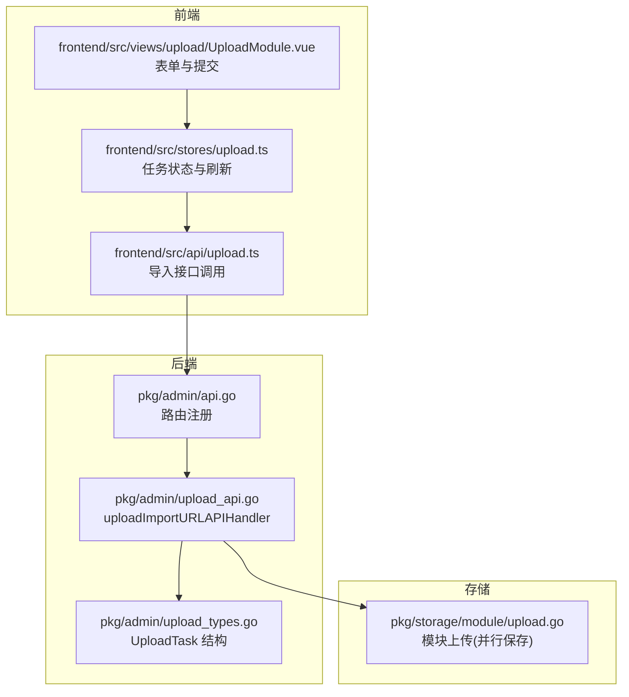
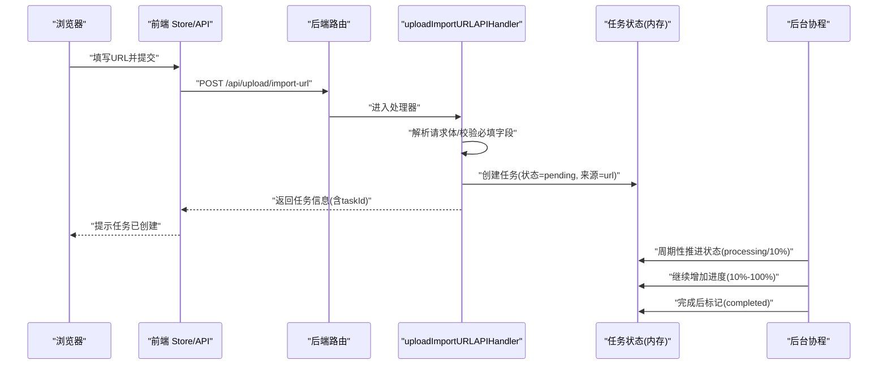
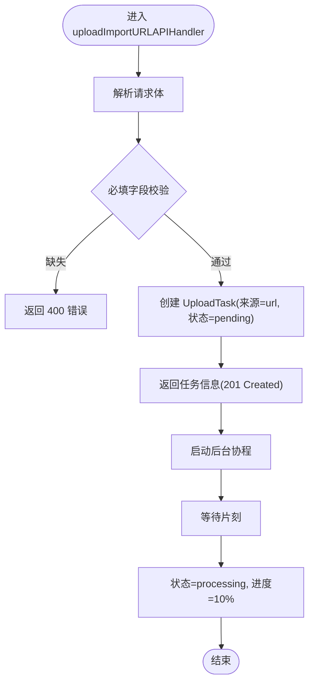
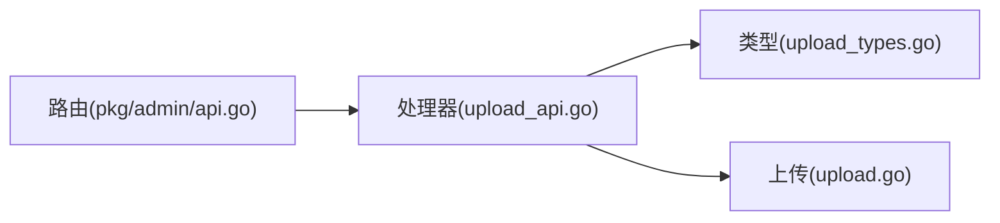

# URL 导入上传

<cite>
**本文引用的文件**
- [pkg/admin/upload_api.go](file://pkg/admin/upload_api.go)
- [pkg/admin/upload_types.go](file://pkg/admin/upload_types.go)
- [pkg/admin/api.go](file://pkg/admin/api.go)
- [frontend/src/api/upload.ts](file://frontend/src/api/upload.ts)
- [frontend/src/stores/upload.ts](file://frontend/src/stores/upload.ts)
- [frontend/src/views/upload/UploadModule.vue](file://frontend/src/views/upload/UploadModule.vue)
- [pkg/storage/module/upload.go](file://pkg/storage/module/upload.go)
- [pkg/download/protocol.go](file://pkg/download/protocol.go)
- [pkg/config/timeout.go](file://pkg/config/timeout.go)
- [pkg/middleware/validation.go](file://pkg/middleware/validation.go)
- [config.dev.toml](file://config.dev.toml)
</cite>

## 目录
1. [简介](#简介)
2. [项目结构](#项目结构)
3. [核心组件](#核心组件)
4. [架构总览](#架构总览)
5. [详细组件分析](#详细组件分析)
6. [依赖关系分析](#依赖关系分析)
7. [性能考量](#性能考量)
8. [故障排查指南](#故障排查指南)
9. [结论](#结论)
10. [附录](#附录)

## 简介
本文档围绕 /api/upload/import-url 端点，系统性说明“从远程 URL 导入模块”的实现与使用方法。内容涵盖：
- 请求参数格式与校验规则
- 完整请求示例与响应格式
- 远程下载过程的状态跟踪与进度更新
- URL 验证、网络超时处理与下载失败的重试机制
- 支持的 URL 类型、认证方式与安全注意事项

## 项目结构
该功能由后端 Admin API、前端交互层与存储上传模块共同组成：
- 后端路由与处理器：负责接收请求、创建上传任务并进行基本校验
- 前端 API 层与 Store：封装请求、响应与任务状态管理
- 存储上传模块：提供通用的模块文件上传能力（.info/.mod/.zip）

**图表来源**
- [pkg/admin/api.go](file://pkg/admin/api.go#L43-L47)
- [pkg/admin/upload_api.go](file://pkg/admin/upload_api.go#L214-L287)
- [pkg/admin/upload_types.go](file://pkg/admin/upload_types.go#L5-L17)
- [frontend/src/api/upload.ts](file://frontend/src/api/upload.ts#L20-L23)
- [frontend/src/stores/upload.ts](file://frontend/src/stores/upload.ts#L65-L77)
- [frontend/src/views/upload/UploadModule.vue](file://frontend/src/views/upload/UploadModule.vue#L256-L277)
- [pkg/storage/module/upload.go](file://pkg/storage/module/upload.go#L19-L63)

**章节来源**
- [pkg/admin/api.go](file://pkg/admin/api.go#L43-L47)
- [pkg/admin/upload_api.go](file://pkg/admin/upload_api.go#L214-L287)
- [pkg/admin/upload_types.go](file://pkg/admin/upload_types.go#L5-L17)
- [frontend/src/api/upload.ts](file://frontend/src/api/upload.ts#L20-L23)
- [frontend/src/stores/upload.ts](file://frontend/src/stores/upload.ts#L65-L77)
- [frontend/src/views/upload/UploadModule.vue](file://frontend/src/views/upload/UploadModule.vue#L256-L277)
- [pkg/storage/module/upload.go](file://pkg/storage/module/upload.go#L19-L63)

## 核心组件
- 后端处理器：解析请求体、校验必填字段、创建“URL 导入”任务并返回任务信息；随后通过后台协程推进任务状态
- 任务模型：UploadTask 包含任务 ID、模块路径、版本、来源（url）、状态、进度、错误信息、创建/完成时间与文件大小等
- 前端接口：提供 importModuleFromUrl 方法，封装 /upload/import-url 请求
- 存储上传：提供通用的模块文件上传能力，支持 info/mod/zip 三类文件的并行保存与超时控制

**章节来源**
- [pkg/admin/upload_api.go](file://pkg/admin/upload_api.go#L214-L287)
- [pkg/admin/upload_types.go](file://pkg/admin/upload_types.go#L5-L17)
- [frontend/src/api/upload.ts](file://frontend/src/api/upload.ts#L20-L23)
- [pkg/storage/module/upload.go](file://pkg/storage/module/upload.go#L19-L63)

## 架构总览
下图展示从浏览器发起导入请求到后端创建任务、推进状态的完整流程。

**图表来源**
- [frontend/src/views/upload/UploadModule.vue](file://frontend/src/views/upload/UploadModule.vue#L256-L277)
- [frontend/src/stores/upload.ts](file://frontend/src/stores/upload.ts#L65-L77)
- [frontend/src/api/upload.ts](file://frontend/src/api/upload.ts#L20-L23)
- [pkg/admin/api.go](file://pkg/admin/api.go#L43-L47)
- [pkg/admin/upload_api.go](file://pkg/admin/upload_api.go#L214-L287)

## 详细组件分析

### 后端处理器：/api/upload/import-url
- 方法与路由
  - 方法：POST
  - 路由：/api/upload/import-url
  - 注册：在 Admin 路由组下注册
- 请求体字段
  - modulePath：模块路径，必填
  - version：版本号，可选
  - url：远程 URL，必填
- 校验规则
  - 必填字段缺失时返回 400，并提示相应错误
- 任务创建
  - 生成唯一 taskId
  - 设置来源为 url，初始状态 pending，进度 0
  - 记录创建时间
- 异步处理
  - 启动后台协程，等待短暂时间后将状态推进至 processing，并设置初始进度 10%
  - 后续通过周期性任务处理器持续提升进度，直至 100% 完成

**图表来源**
- [pkg/admin/upload_api.go](file://pkg/admin/upload_api.go#L214-L287)

**章节来源**
- [pkg/admin/api.go](file://pkg/admin/api.go#L43-L47)
- [pkg/admin/upload_api.go](file://pkg/admin/upload_api.go#L214-L287)

### 任务模型：UploadTask
- 字段说明
  - id：任务唯一标识
  - modulePath：模块路径
  - version：版本号
  - source：来源，"file" 或 "url"
  - status：状态，"pending"、"processing"、"completed"、"failed"
  - progress：进度百分比(0-100)
  - error：错误信息
  - createdAt/CompletedAt：创建与完成时间
  - fileSize：文件大小(字节)
- 用途
  - 作为任务状态载体，贯穿导入流程

**章节来源**
- [pkg/admin/upload_types.go](file://pkg/admin/upload_types.go#L5-L17)

### 前端集成
- 接口封装
  - importModuleFromUrl(data)：向 /upload/import-url 发送 POST 请求
- Store 管理
  - importFromUrl(url, version?)：调用接口并提示结果，随后刷新任务列表
- 视图交互
  - 表单校验通过后触发导入，清空表单并提示任务已创建

**章节来源**
- [frontend/src/api/upload.ts](file://frontend/src/api/upload.ts#L20-L23)
- [frontend/src/stores/upload.ts](file://frontend/src/stores/upload.ts#L65-L77)
- [frontend/src/views/upload/UploadModule.vue](file://frontend/src/views/upload/UploadModule.vue#L256-L277)

### 存储上传：模块文件保存
- 功能概述
  - 并行保存 .info、.mod、.zip 三类文件
  - 使用带超时的上下文，任一文件上传超时即返回错误
- 关键点
  - 三路 goroutine 并发执行
  - 统一收集错误，最终汇总返回
  - 超时控制由外部传入

**章节来源**
- [pkg/storage/module/upload.go](file://pkg/storage/module/upload.go#L19-L63)

## 依赖关系分析
- 路由到处理器
  - /api/upload/import-url → uploadImportURLAPIHandler
- 处理器依赖
  - UploadTask 类型定义
  - 并发安全：全局互斥锁保护任务列表
  - 异步推进：周期性任务处理器
- 存储依赖
  - 模块上传模块提供通用的并行保存与超时控制能力

**图表来源**
- [pkg/admin/api.go](file://pkg/admin/api.go#L43-L47)
- [pkg/admin/upload_api.go](file://pkg/admin/upload_api.go#L214-L287)
- [pkg/admin/upload_types.go](file://pkg/admin/upload_types.go#L5-L17)
- [pkg/storage/module/upload.go](file://pkg/storage/module/upload.go#L19-L63)

**章节来源**
- [pkg/admin/api.go](file://pkg/admin/api.go#L43-L47)
- [pkg/admin/upload_api.go](file://pkg/admin/upload_api.go#L214-L287)
- [pkg/admin/upload_types.go](file://pkg/admin/upload_types.go#L5-L17)
- [pkg/storage/module/upload.go](file://pkg/storage/module/upload.go#L19-L63)

## 性能考量
- 并发与锁
  - 任务列表采用读写锁保护，避免竞态
- 异步推进
  - 使用定时器周期性推进处理中任务的进度，降低阻塞
- 上传超时
  - 上传模块使用带超时的上下文，防止长时间阻塞
- 建议
  - 对于大规模导入，建议结合任务分页与状态过滤接口，减少一次性渲染压力

**章节来源**
- [pkg/admin/upload_api.go](file://pkg/admin/upload_api.go#L108-L137)
- [pkg/storage/module/upload.go](file://pkg/storage/module/upload.go#L21-L45)

## 故障排查指南
- 常见错误与处理
  - 参数缺失：返回 400，提示必填字段
  - 任务不存在：查询任务详情返回 404
  - 无法取消已完成/失败任务：返回 400，提示不允许
- 网络与超时
  - 上传模块使用带超时的上下文，超时将导致错误返回
  - 下载流程的超时策略参考下载协议中的超时设定
- 重试机制
  - 当前实现未内置自动重试；可通过前端轮询任务状态并在失败时手动重试
- 安全与认证
  - 基本认证配置项存在于配置文件中，需按需启用
  - 验证钩子可用于模块合法性校验

**章节来源**
- [pkg/admin/upload_api.go](file://pkg/admin/upload_api.go#L232-L243)
- [pkg/admin/upload_api.go](file://pkg/admin/upload_api.go#L427-L431)
- [pkg/admin/upload_api.go](file://pkg/admin/upload_api.go#L468-L479)
- [pkg/storage/module/upload.go](file://pkg/storage/module/upload.go#L21-L45)
- [pkg/download/protocol.go](file://pkg/download/protocol.go#L253-L279)
- [pkg/middleware/validation.go](file://pkg/middleware/validation.go#L69-L100)
- [config.dev.toml](file://config.dev.toml#L145-L170)

## 结论
/api/upload/import-url 提供了从远程 URL 导入模块的能力。后端通过任务模型与异步推进机制实现了状态跟踪，前端提供了直观的提交与反馈流程。当前实现未包含内置重试与深层 URL 校验，建议结合任务状态轮询与配置层面的安全策略（如基本认证、验证钩子）共同保障导入流程的稳定性与安全性。

## 附录

### 请求与响应规范
- 端点
  - 方法：POST
  - 路径：/api/upload/import-url
- 请求体
  - modulePath：字符串，必填
  - version：字符串，可选
  - url：字符串，必填（远程模块文件地址）
- 成功响应
  - 状态码：201 Created
  - 内容：UploadTask 对象（包含 id、modulePath、version、source、status、progress、createdAt 等）
- 错误响应
  - 参数缺失：400 Bad Request
  - 任务不存在：404 Not Found
  - 无法取消已完成/失败任务：400 Bad Request

**章节来源**
- [pkg/admin/upload_api.go](file://pkg/admin/upload_api.go#L214-L287)
- [pkg/admin/upload_types.go](file://pkg/admin/upload_types.go#L5-L17)

### 远程下载与状态跟踪
- 下载流程
  - 创建任务后，后台协程将任务状态推进至 processing，并设置初始进度
  - 周期性任务处理器持续提升进度，直至完成
- 状态变更
  - pending → processing → completed（或 failed）

**章节来源**
- [pkg/admin/upload_api.go](file://pkg/admin/upload_api.go#L268-L286)
- [pkg/admin/upload_api.go](file://pkg/admin/upload_api.go#L108-L137)

### URL 类型与认证
- 支持的 URL 类型
  - 任意可访问的远程模块文件地址（具体取决于上游可用性）
- 认证方式
  - 基本认证：可在配置文件中启用
  - 验证钩子：可配置外部验证端点
- 安全建议
  - 仅在受信网络与 HTTPS 下使用
  - 合理设置超时与重试策略
  - 使用验证钩子对导入模块进行合法性检查

**章节来源**
- [config.dev.toml](file://config.dev.toml#L145-L170)
- [pkg/middleware/validation.go](file://pkg/middleware/validation.go#L69-L100)

### 超时与重试
- 超时
  - 上传模块使用带超时的上下文，超时将导致错误
  - 下载流程的超时策略参考下载协议中的超时设定
- 重试
  - 当前未内置自动重试；建议前端轮询任务状态并在失败时手动重试

**章节来源**
- [pkg/storage/module/upload.go](file://pkg/storage/module/upload.go#L21-L45)
- [pkg/download/protocol.go](file://pkg/download/protocol.go#L253-L279)