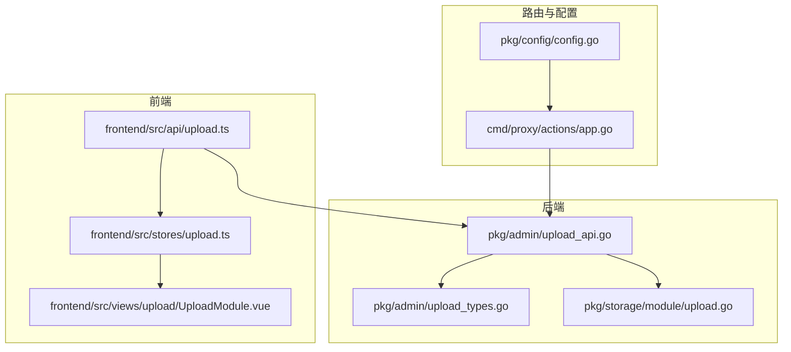
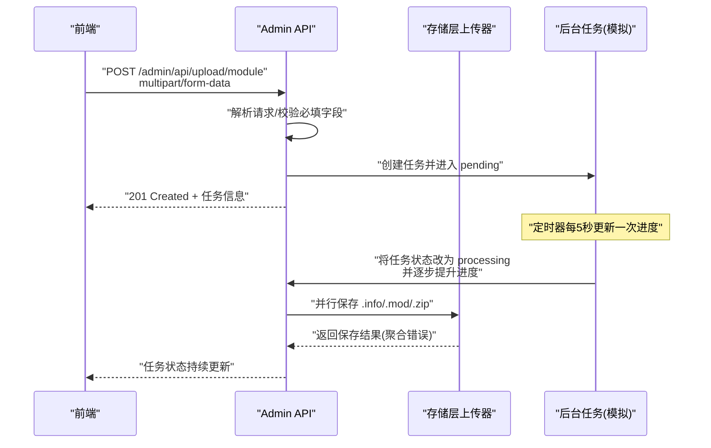
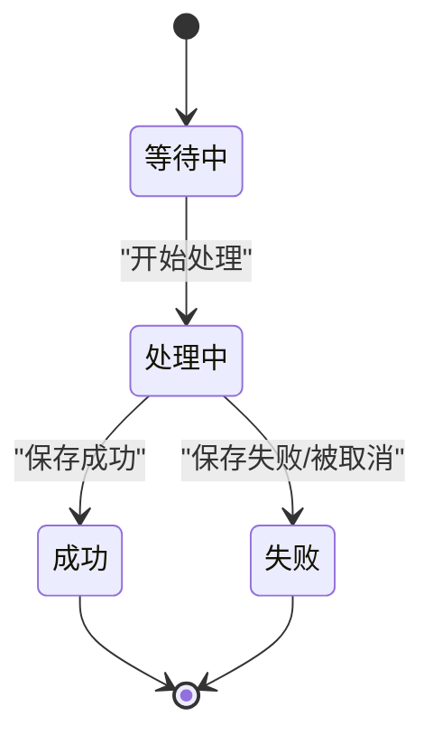
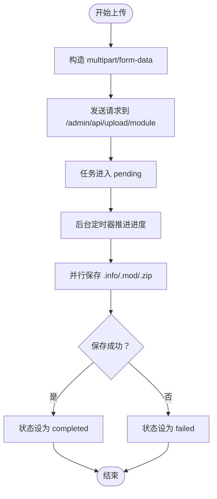
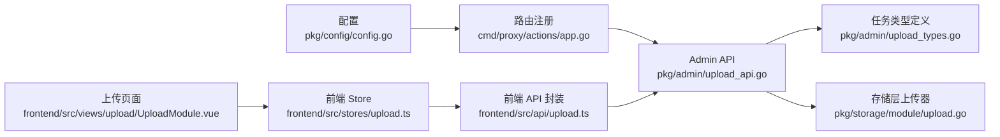

# 上传 API

<cite>
**本文引用的文件**
- [pkg/admin/upload_api.go](file://pkg/admin/upload_api.go)
- [pkg/admin/upload_types.go](file://pkg/admin/upload_types.go)
- [pkg/storage/module/upload.go](file://pkg/storage/module/upload.go)
- [pkg/storage/module/upload_test.go](file://pkg/storage/module/upload_test.go)
- [frontend/src/api/upload.ts](file://frontend/src/api/upload.ts)
- [frontend/src/stores/upload.ts](file://frontend/src/stores/upload.ts)
- [frontend/src/views/upload/UploadModule.vue](file://frontend/src/views/upload/UploadModule.vue)
- [frontend/src/types/index.ts](file://frontend/src/types/index.ts)
- [cmd/proxy/actions/app.go](file://cmd/proxy/actions/app.go)
- [pkg/config/config.go](file://pkg/config/config.go)
</cite>

## 目录
1. [简介](#简介)
2. [项目结构](#项目结构)
3. [核心组件](#核心组件)
4. [架构总览](#架构总览)
5. [详细组件分析](#详细组件分析)
6. [依赖关系分析](#依赖关系分析)
7. [性能考量](#性能考量)
8. [故障排查指南](#故障排查指南)
9. [结论](#结论)
10. [附录](#附录)

## 简介
本文件系统性梳理 Athens 项目中的“模块上传”能力，覆盖以下方面：
- 上传相关 API 端点：直接上传、URL 导入上传、任务管理等
- 上传流程、文件格式要求、版本验证与冲突处理策略
- 请求格式（multipart/form-data）、JSON 响应结构与进度跟踪机制
- 上传任务的状态管理、取消操作与错误处理
- 大文件上传最佳实践与断点续传支持说明

注意：当前后端对“直接上传”的实现采用模拟任务队列；实际生产环境的“直接上传”应由后端存储层与校验逻辑接管，本文将明确标注当前实现与建议的生产实现差异。

## 项目结构
围绕上传功能的关键代码分布在如下位置：
- 后端 Admin API：负责接收上传请求、创建任务、返回任务状态与进度
- 存储层模块上传：并行保存 .info/.mod/.zip 文件，具备超时控制与错误聚合
- 前端 API 与 Store：封装上传请求、进度回调、任务列表与取消操作
- 路由注册：将上传相关端点挂载到服务路由

图表来源
- [pkg/admin/upload_api.go](file://pkg/admin/upload_api.go#L1-L491)
- [pkg/admin/upload_types.go](file://pkg/admin/upload_types.go#L1-L17)
- [pkg/storage/module/upload.go](file://pkg/storage/module/upload.go#L1-L64)
- [frontend/src/api/upload.ts](file://frontend/src/api/upload.ts#L1-L42)
- [frontend/src/stores/upload.ts](file://frontend/src/stores/upload.ts#L1-L128)
- [frontend/src/views/upload/UploadModule.vue](file://frontend/src/views/upload/UploadModule.vue#L1-L401)
- [cmd/proxy/actions/app.go](file://cmd/proxy/actions/app.go#L1-L139)
- [pkg/config/config.go](file://pkg/config/config.go#L1-L376)

章节来源
- [pkg/admin/upload_api.go](file://pkg/admin/upload_api.go#L1-L491)
- [pkg/storage/module/upload.go](file://pkg/storage/module/upload.go#L1-L64)
- [frontend/src/api/upload.ts](file://frontend/src/api/upload.ts#L1-L42)
- [frontend/src/stores/upload.ts](file://frontend/src/stores/upload.ts#L1-L128)
- [frontend/src/views/upload/UploadModule.vue](file://frontend/src/views/upload/UploadModule.vue#L1-L401)
- [cmd/proxy/actions/app.go](file://cmd/proxy/actions/app.go#L1-L139)
- [pkg/config/config.go](file://pkg/config/config.go#L1-L376)

## 核心组件
- 上传任务模型：包含任务标识、模块路径、版本、来源、状态、进度、错误信息、创建与完成时间、文件大小等字段
- 上传 API 处理器：分别处理直接上传、URL 导入、任务列表、任务详情、任务取消
- 存储层上传器：并行保存 .info/.mod/.zip，带超时与错误聚合
- 前端上传 Store：封装上传、进度、任务列表、取消等交互

章节来源
- [pkg/admin/upload_types.go](file://pkg/admin/upload_types.go#L5-L17)
- [pkg/admin/upload_api.go](file://pkg/admin/upload_api.go#L139-L491)
- [pkg/storage/module/upload.go](file://pkg/storage/module/upload.go#L16-L64)
- [frontend/src/stores/upload.ts](file://frontend/src/stores/upload.ts#L1-L128)

## 架构总览
下图展示从前端发起上传请求到后端创建任务、模拟处理与存储层并行保存的整体流程。

图表来源
- [pkg/admin/upload_api.go](file://pkg/admin/upload_api.go#L139-L212)
- [pkg/storage/module/upload.go](file://pkg/storage/module/upload.go#L19-L64)

章节来源
- [pkg/admin/upload_api.go](file://pkg/admin/upload_api.go#L108-L137)
- [pkg/storage/module/upload.go](file://pkg/storage/module/upload.go#L19-L64)

## 详细组件分析

### 1) 端点与请求/响应规范
- 直接上传
  - 方法与路径：POST /admin/api/upload/module
  - 请求体：multipart/form-data
    - 字段：file（二进制文件，Go 模块 zip 包）
  - 成功响应：201 Created，返回任务对象（含 id、modulePath、version、status、progress、createdAt 等）
  - 错误响应：400 Bad Request（必填缺失/格式错误）、500 Internal Server Error（编码失败）

- URL 导入上传
  - 方法与路径：POST /admin/api/upload/import-url
  - 请求体：JSON
    - 字段：modulePath、version、url
  - 成功响应：201 Created，返回任务对象
  - 错误响应：400 Bad Request、500 Internal Server Error

- 上传任务列表
  - 方法与路径：GET /admin/api/upload/tasks
  - 查询参数：
    - q：按模块路径或版本模糊过滤
    - status：按状态过滤（pending/processing/completed/failed）
    - limit：分页限制，默认 20
    - offset：分页偏移，默认 0
  - 成功响应：200 OK，返回 tasks、total、limit、offset

- 上传任务详情
  - 方法与路径：GET /admin/api/upload/tasks/{taskId}
  - 成功响应：200 OK，返回任务对象
  - 错误响应：404 Not Found

- 取消上传任务
  - 方法与路径：POST /admin/api/upload/tasks/{taskId}/cancel
  - 成功响应：200 OK，返回更新后的任务对象
  - 错误响应：404 Not Found（任务不存在）、400 Bad Request（已完成/失败的任务不可取消）

章节来源
- [pkg/admin/upload_api.go](file://pkg/admin/upload_api.go#L139-L491)
- [frontend/src/api/upload.ts](file://frontend/src/api/upload.ts#L4-L42)
- [frontend/src/types/index.ts](file://frontend/src/types/index.ts#L43-L65)

### 2) 上传流程与状态机
- 状态流转
  - pending → processing → completed 或 failed
  - 已完成/失败的任务不可取消
- 进度更新
  - 后台定时器周期性提升进度（模拟），直至达到 100%
- 并行保存
  - 存储层并行保存 .info/.mod/.zip，任一失败即聚合错误返回

图表来源
- [pkg/admin/upload_api.go](file://pkg/admin/upload_api.go#L108-L137)
- [pkg/storage/module/upload.go](file://pkg/storage/module/upload.go#L19-L64)

章节来源
- [pkg/admin/upload_api.go](file://pkg/admin/upload_api.go#L108-L137)
- [pkg/storage/module/upload.go](file://pkg/storage/module/upload.go#L19-L64)

### 3) 文件格式要求与版本验证
- 文件格式
  - 直接上传：zip 格式（Go 模块包）
  - 前端上传组件对文件类型与大小进行本地校验（zip 类型、≤50MB）
- 版本验证
  - 当前后端对 modulePath 与 version 的校验为非空检查
  - 生产实现建议在存储层与校验钩子中增加：
    - 版本语义化格式校验
    - 冲突检测（同模块同版本重复上传）
    - 依赖完整性与签名校验（如启用）

章节来源
- [frontend/src/views/upload/UploadModule.vue](file://frontend/src/views/upload/UploadModule.vue#L210-L224)
- [pkg/admin/upload_api.go](file://pkg/admin/upload_api.go#L162-L167)
- [pkg/config/config.go](file://pkg/config/config.go#L22-L66)

### 4) 请求示例与响应结构

- 直接上传（multipart/form-data）
  - 请求示例（描述）
    - Content-Type: multipart/form-data
    - 字段：file（二进制 zip）
  - 响应结构（任务对象）
    - 字段：id、modulePath、version、source、status、progress、error、createdAt、completedAt、fileSize

- URL 导入（JSON）
  - 请求示例（描述）
    - Content-Type: application/json
    - 字段：modulePath、version、url
  - 响应结构：同上

- 任务列表（JSON）
  - 字段：tasks（数组，元素为任务对象）、total、limit、offset

- 任务详情（JSON）
  - 字段：任务对象 + 可选扩展字段（视前端类型定义）

章节来源
- [frontend/src/api/upload.ts](file://frontend/src/api/upload.ts#L4-L42)
- [frontend/src/types/index.ts](file://frontend/src/types/index.ts#L43-L65)
- [pkg/admin/upload_types.go](file://pkg/admin/upload_types.go#L5-L17)

### 5) 进度跟踪机制
- 前端
  - 上传进度通过 onUploadProgress 回调计算百分比并更新
  - 上传完成后刷新任务列表，轮询任务状态
- 后端
  - 定时器周期性提升任务进度（模拟），直至完成
  - 存储层并行保存，超时或错误会体现在最终状态中

图表来源
- [frontend/src/api/upload.ts](file://frontend/src/api/upload.ts#L4-L18)
- [pkg/admin/upload_api.go](file://pkg/admin/upload_api.go#L108-L137)
- [pkg/storage/module/upload.go](file://pkg/storage/module/upload.go#L19-L64)

章节来源
- [frontend/src/api/upload.ts](file://frontend/src/api/upload.ts#L4-L18)
- [frontend/src/stores/upload.ts](file://frontend/src/stores/upload.ts#L41-L63)
- [pkg/admin/upload_api.go](file://pkg/admin/upload_api.go#L108-L137)
- [pkg/storage/module/upload.go](file://pkg/storage/module/upload.go#L19-L64)

### 6) 任务管理与取消
- 列表与筛选
  - 支持按 q、status、limit、offset 查询
  - 默认按创建时间倒序
- 取消规则
  - 仅 pending/processing 状态可取消
  - 取消后状态设为 failed，并记录取消错误信息
- 前端交互
  - 上传成功后自动刷新任务列表
  - 支持分页与状态筛选

章节来源
- [pkg/admin/upload_api.go](file://pkg/admin/upload_api.go#L289-L378)
- [pkg/admin/upload_api.go](file://pkg/admin/upload_api.go#L440-L491)
- [frontend/src/stores/upload.ts](file://frontend/src/stores/upload.ts#L22-L102)
- [frontend/src/views/upload/UploadModule.vue](file://frontend/src/views/upload/UploadModule.vue#L107-L166)

### 7) 错误处理
- 常见错误
  - 400：请求体解析失败、必填字段缺失
  - 404：任务不存在
  - 405：方法不被允许
  - 400（取消）：已完成/失败的任务不可取消
  - 500：内部错误（如 JSON 编码失败）
- 存储层错误
  - 超时：context deadline exceeded
  - 其他错误：聚合返回

章节来源
- [pkg/admin/upload_api.go](file://pkg/admin/upload_api.go#L150-L167)
- [pkg/admin/upload_api.go](file://pkg/admin/upload_api.go#L440-L491)
- [pkg/storage/module/upload_test.go](file://pkg/storage/module/upload_test.go#L31-L47)

### 8) 大文件上传与断点续传
- 大文件上传最佳实践
  - 使用分片上传：将大文件切分为固定大小的片段，逐片上传并记录进度
  - 断点续传：服务端维护每个分片的上传状态，客户端断线重连后从失败分片继续
  - 并行加速：多分片并发上传，结合进度上报与合并
- 当前实现说明
  - 当前后端未实现分片/断点续传；直接上传采用单次 multipart/form-data
  - 建议在生产环境中引入分片上传协议与服务端状态持久化

章节来源
- [frontend/src/views/upload/UploadModule.vue](file://frontend/src/views/upload/UploadModule.vue#L27-L28)
- [pkg/storage/module/upload.go](file://pkg/storage/module/upload.go#L19-L64)

## 依赖关系分析
- 路由与注册
  - 路由在应用启动时挂载，Admin API 的上传端点位于 /admin/api/upload/*
- 配置
  - 配置项影响网络行为与超时，如下载/上传超时、存储类型等
- 前后端契约
  - 前端 API 与 Store 与后端响应结构保持一致（任务对象字段）

图表来源
- [cmd/proxy/actions/app.go](file://cmd/proxy/actions/app.go#L46-L66)
- [pkg/admin/upload_api.go](file://pkg/admin/upload_api.go#L1-L491)
- [pkg/admin/upload_types.go](file://pkg/admin/upload_types.go#L1-L17)
- [pkg/storage/module/upload.go](file://pkg/storage/module/upload.go#L1-L64)
- [frontend/src/api/upload.ts](file://frontend/src/api/upload.ts#L1-L42)
- [frontend/src/stores/upload.ts](file://frontend/src/stores/upload.ts#L1-L128)
- [frontend/src/views/upload/UploadModule.vue](file://frontend/src/views/upload/UploadModule.vue#L1-L401)
- [pkg/config/config.go](file://pkg/config/config.go#L1-L376)

章节来源
- [cmd/proxy/actions/app.go](file://cmd/proxy/actions/app.go#L46-L66)
- [pkg/config/config.go](file://pkg/config/config.go#L22-L66)

## 性能考量
- 并行保存
  - 存储层对 .info/.mod/.zip 并行保存，缩短整体上传时间
- 超时控制
  - 通过 context.WithTimeout 控制单个文件保存的最长耗时
- 前端优化
  - 上传进度回调避免阻塞 UI
  - 分页与筛选减少一次性渲染压力

章节来源
- [pkg/storage/module/upload.go](file://pkg/storage/module/upload.go#L19-L64)
- [frontend/src/api/upload.ts](file://frontend/src/api/upload.ts#L10-L17)

## 故障排查指南
- 上传无响应或长时间 pending
  - 检查后端定时器是否正常运行（模拟任务处理）
  - 检查存储层保存是否超时或报错
- 任务状态异常
  - 确认任务是否已被取消（已完成/失败不可取消）
  - 检查过滤参数（q、status、limit、offset）是否导致列表为空
- 前端进度不更新
  - 确认 onUploadProgress 是否正确绑定
  - 检查网络请求是否被拦截或跨域问题

章节来源
- [pkg/admin/upload_api.go](file://pkg/admin/upload_api.go#L108-L137)
- [pkg/storage/module/upload_test.go](file://pkg/storage/module/upload_test.go#L31-L47)
- [frontend/src/api/upload.ts](file://frontend/src/api/upload.ts#L10-L17)

## 结论
- 当前上传 API 提供了完整的任务生命周期管理（创建、查询、取消）与进度模拟
- 直接上传采用 multipart/form-data，URL 导入采用 JSON
- 存储层具备并行保存与超时控制，适合后续接入真实存储后端
- 建议在生产环境中补充分片/断点续传、版本验证与冲突处理、签名校验等能力

## 附录

### A. 端点一览
- POST /admin/api/upload/module
- POST /admin/api/upload/import-url
- GET /admin/api/upload/tasks
- GET /admin/api/upload/tasks/{taskId}
- POST /admin/api/upload/tasks/{taskId}/cancel

章节来源
- [pkg/admin/upload_api.go](file://pkg/admin/upload_api.go#L42-L46)

### B. 任务对象字段说明
- id：任务唯一标识
- modulePath：模块路径
- version：版本号
- source：上传来源（file/url）
- status：任务状态（pending/processing/completed/failed）
- progress：进度百分比（0-100）
- error：错误信息（可选）
- createdAt：创建时间
- completedAt：完成时间（可选）
- fileSize：文件大小（字节，可选）

章节来源
- [pkg/admin/upload_types.go](file://pkg/admin/upload_types.go#L5-L17)
- [frontend/src/types/index.ts](file://frontend/src/types/index.ts#L43-L65)