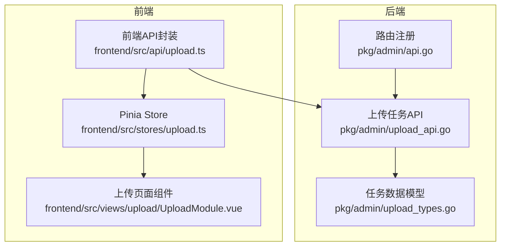
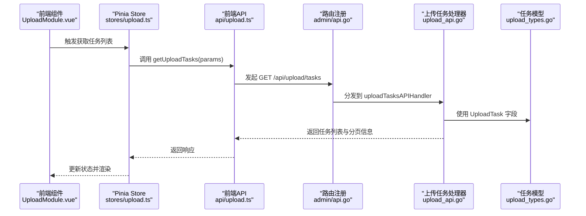
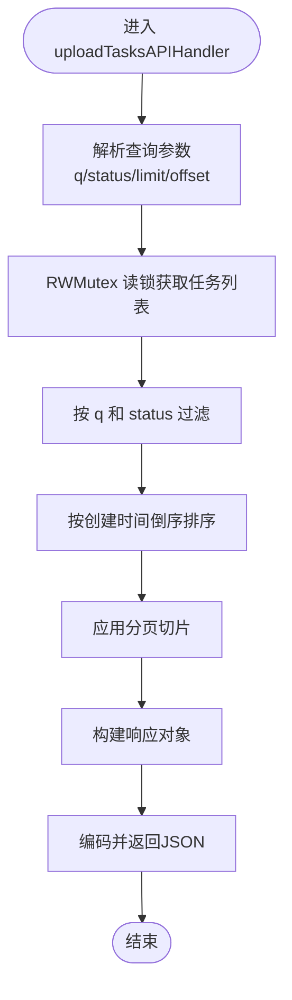
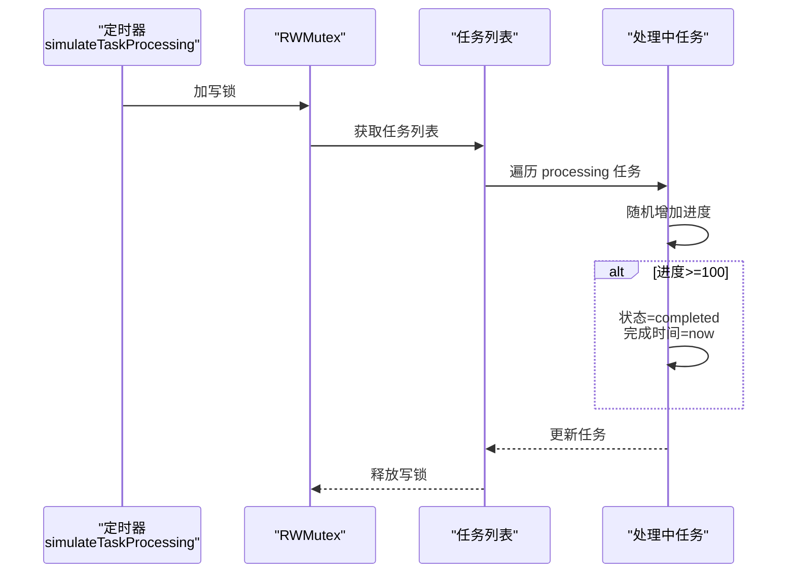
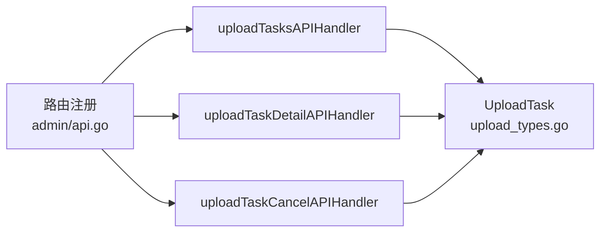

# 上传任务管理

<cite>
**本文引用的文件**
- [pkg/admin/upload_api.go](file://pkg/admin/upload_api.go)
- [pkg/admin/upload_types.go](file://pkg/admin/upload_types.go)
- [pkg/admin/api.go](file://pkg/admin/api.go)
- [frontend/src/api/upload.ts](file://frontend/src/api/upload.ts)
- [frontend/src/stores/upload.ts](file://frontend/src/stores/upload.ts)
- [frontend/src/views/upload/UploadModule.vue](file://frontend/src/views/upload/UploadModule.vue)
- [pkg/admin/download_api.go](file://pkg/admin/download_api.go)
</cite>

## 目录
1. [简介](#简介)
2. [项目结构](#项目结构)
3. [核心组件](#核心组件)
4. [架构总览](#架构总览)
5. [详细组件分析](#详细组件分析)
6. [依赖关系分析](#依赖关系分析)
7. [性能考量](#性能考量)
8. [故障排查指南](#故障排查指南)
9. [结论](#结论)
10. [附录](#附录)

## 简介
本文件面向“上传任务管理”子系统的 API 文档，聚焦于 /api/upload/tasks 端点的实现与使用，涵盖：
- 任务列表查询、状态过滤与分页机制
- GET 请求的查询参数（q、status、limit、offset）及其使用方法
- 任务状态枚举（pending、processing、completed、failed）的详细说明
- 任务详情查询、任务取消操作与进度跟踪机制
- 并发安全处理、任务生命周期管理与模拟任务处理器的工作原理

该子系统采用 Gorilla Mux 路由注册，后端通过 RWMutex 实现并发安全，前端通过 Pinia Store 管理状态并调用 API。

## 项目结构
与上传任务管理相关的核心文件分布如下：
- 后端路由注册：pkg/admin/api.go
- 上传任务 API 实现：pkg/admin/upload_api.go
- 上传任务数据模型：pkg/admin/upload_types.go
- 前端 API 封装：frontend/src/api/upload.ts
- 前端状态管理：frontend/src/stores/upload.ts
- 前端视图组件：frontend/src/views/upload/UploadModule.vue
- 其他模拟数据（供参考）：pkg/admin/download_api.go

图表来源
- [pkg/admin/api.go](file://pkg/admin/api.go#L16-L47)
- [pkg/admin/upload_api.go](file://pkg/admin/upload_api.go#L1-L200)
- [pkg/admin/upload_types.go](file://pkg/admin/upload_types.go#L1-L17)
- [frontend/src/api/upload.ts](file://frontend/src/api/upload.ts#L1-L42)
- [frontend/src/stores/upload.ts](file://frontend/src/stores/upload.ts#L1-L128)
- [frontend/src/views/upload/UploadModule.vue](file://frontend/src/views/upload/UploadModule.vue#L135-L166)

章节来源
- [pkg/admin/api.go](file://pkg/admin/api.go#L16-L47)
- [pkg/admin/upload_api.go](file://pkg/admin/upload_api.go#L1-L200)
- [pkg/admin/upload_types.go](file://pkg/admin/upload_types.go#L1-L17)
- [frontend/src/api/upload.ts](file://frontend/src/api/upload.ts#L1-L42)
- [frontend/src/stores/upload.ts](file://frontend/src/stores/upload.ts#L1-L128)
- [frontend/src/views/upload/UploadModule.vue](file://frontend/src/views/upload/UploadModule.vue#L135-L166)

## 核心组件
- 任务数据模型 UploadTask：包含任务标识、模块路径、版本、来源、状态、进度、错误信息、创建与完成时间、文件大小等字段。
- 上传任务 API 处理器：
  - 列表查询：/api/upload/tasks（GET）
  - 任务详情：/api/upload/tasks/{taskId}（GET）
  - 取消任务：/api/upload/tasks/{taskId}/cancel（POST）
- 路由注册：在 pkg/admin/api.go 中注册上述三个端点。
- 并发控制：全局 RWMutex 保护任务列表的读写。
- 模拟任务处理器：定时推进“processing”状态任务的进度，直至完成。

章节来源
- [pkg/admin/upload_types.go](file://pkg/admin/upload_types.go#L5-L17)
- [pkg/admin/upload_api.go](file://pkg/admin/upload_api.go#L290-L378)
- [pkg/admin/upload_api.go](file://pkg/admin/upload_api.go#L392-L438)
- [pkg/admin/upload_api.go](file://pkg/admin/upload_api.go#L440-L491)
- [pkg/admin/api.go](file://pkg/admin/api.go#L44-L46)

## 架构总览
后端通过 Gorilla Mux 注册路由，前端通过封装的 API 函数调用后端接口，Pinia Store 统一管理状态与分页参数，视图组件负责展示与交互。

图表来源
- [frontend/src/views/upload/UploadModule.vue](file://frontend/src/views/upload/UploadModule.vue#L135-L166)
- [frontend/src/stores/upload.ts](file://frontend/src/stores/upload.ts#L22-L39)
- [frontend/src/api/upload.ts](file://frontend/src/api/upload.ts#L25-L32)
- [pkg/admin/api.go](file://pkg/admin/api.go#L44-L46)
- [pkg/admin/upload_api.go](file://pkg/admin/upload_api.go#L289-L378)
- [pkg/admin/upload_types.go](file://pkg/admin/upload_types.go#L5-L17)

## 详细组件分析

### 1) 任务列表查询（GET /api/upload/tasks）
- 支持的查询参数
  - q：字符串，模糊匹配模块路径或版本
  - status：字符串，过滤特定状态（可选值：pending、processing、completed、failed）
  - limit：整数，每页条数，默认 20
  - offset：整数，偏移量，默认 0
- 处理流程
  - 读取查询参数并解析 limit/offset
  - 使用 RWMutex 读锁获取任务列表
  - 条件过滤：按 q 模糊匹配模块路径或版本；按 status 精确匹配状态
  - 按创建时间倒序排序
  - 应用分页切片
  - 返回响应结构：tasks、total、limit、offset
- 错误处理
  - 非 GET 方法返回 405
  - 编码失败返回 500

图表来源
- [pkg/admin/upload_api.go](file://pkg/admin/upload_api.go#L290-L378)

章节来源
- [pkg/admin/upload_api.go](file://pkg/admin/upload_api.go#L290-L378)

### 2) 任务详情查询（GET /api/upload/tasks/{taskId}）
- 功能：根据任务 ID 返回对应任务的完整信息
- 处理流程
  - 读取路径参数 taskId
  - 使用 RWMutex 读锁获取任务列表
  - 遍历查找匹配任务
  - 找到则返回任务详情，否则返回 404
- 错误处理
  - 非 GET 方法返回 405
  - 编码失败返回 500

章节来源
- [pkg/admin/upload_api.go](file://pkg/admin/upload_api.go#L392-L438)

### 3) 任务取消（POST /api/upload/tasks/{taskId}/cancel）
- 功能：将处于 pending 或 processing 状态的任务标记为 failed，并记录取消原因与完成时间
- 处理流程
  - 读取路径参数 taskId
  - 使用 RWMutex 写锁获取任务列表
  - 查找匹配任务
  - 若不存在或已完成/失败则返回 400
  - 更新状态为 failed、错误信息为“任务已取消”、完成时间为当前时间
  - 返回更新后的任务
- 错误处理
  - 非 POST 方法返回 405
  - 编码失败返回 500

章节来源
- [pkg/admin/upload_api.go](file://pkg/admin/upload_api.go#L440-L491)

### 4) 任务状态枚举与含义
- pending：等待中，尚未开始处理
- processing：处理中，进度为 0-99
- completed：已完成，进度为 100，完成时间已填充
- failed：已失败，进度可能小于 100，包含错误信息

章节来源
- [pkg/admin/upload_types.go](file://pkg/admin/upload_types.go#L11-L11)

### 5) 并发安全与任务生命周期
- 并发安全
  - 全局 RWMutex 保护任务列表的并发访问
  - 读多写少场景下使用读锁提升并发性能
- 生命周期
  - 创建：提交上传请求后创建 pending 任务
  - 异步推进：后台 goroutine 定时将 pending 推进为 processing，并逐步增加进度
  - 完成/失败：进度达到 100 自动完成；若被取消则标记失败
- 模拟任务处理器
  - 定时器每 5 秒触发一次
  - 对 processing 状态任务随机增加进度，达到 100 后自动完成

图表来源
- [pkg/admin/upload_api.go](file://pkg/admin/upload_api.go#L108-L137)

章节来源
- [pkg/admin/upload_api.go](file://pkg/admin/upload_api.go#L17-L29)
- [pkg/admin/upload_api.go](file://pkg/admin/upload_api.go#L108-L137)

### 6) 前端集成与使用
- 前端 API 封装
  - 上传模块文件：/upload/module（POST，multipart/form-data）
  - 从 URL 导入：/upload/import-url（POST）
  - 获取任务列表：/upload/tasks（GET，带 page/pageSize/status）
  - 获取任务详情：/upload/tasks/{taskId}（GET）
  - 取消任务：/upload/tasks/{taskId}/cancel（POST）
- Pinia Store
  - 管理任务列表、总数、分页参数、状态过滤器、上传进度与当前任务 ID
  - 提供刷新任务列表、上传文件、从 URL 导入、取消任务等方法
- 视图组件
  - 上传表格中提供“查看详情”和“取消任务”按钮
  - “查看详情”按钮在任务状态为 pending 时不启用
  - “取消任务”按钮仅在任务状态为 pending 或 processing 时启用
  - 分页组件支持切换页码与页大小

章节来源
- [frontend/src/api/upload.ts](file://frontend/src/api/upload.ts#L1-L42)
- [frontend/src/stores/upload.ts](file://frontend/src/stores/upload.ts#L1-L128)
- [frontend/src/views/upload/UploadModule.vue](file://frontend/src/views/upload/UploadModule.vue#L135-L166)

## 依赖关系分析
- 路由到处理器
  - /api/upload/tasks -> uploadTasksAPIHandler
  - /api/upload/tasks/{taskId} -> uploadTaskDetailAPIHandler
  - /api/upload/tasks/{taskId}/cancel -> uploadTaskCancelAPIHandler
- 数据模型
  - UploadTask 字段用于前后端一致的数据交换
- 并发依赖
  - RWMutex 依赖 gorilla/mux 路由与标准库 sync 包

图表来源
- [pkg/admin/api.go](file://pkg/admin/api.go#L44-L46)
- [pkg/admin/upload_api.go](file://pkg/admin/upload_api.go#L289-L491)
- [pkg/admin/upload_types.go](file://pkg/admin/upload_types.go#L5-L17)

章节来源
- [pkg/admin/api.go](file://pkg/admin/api.go#L44-L46)
- [pkg/admin/upload_api.go](file://pkg/admin/upload_api.go#L289-L491)
- [pkg/admin/upload_types.go](file://pkg/admin/upload_types.go#L5-L17)

## 性能考量
- 并发读写
  - 使用 RWMutex 在高并发读场景下提升吞吐
- 排序与分页
  - 当前实现对过滤后的结果进行冒泡排序，时间复杂度 O(n^2)，建议在生产环境替换为更高效的排序算法（如内置排序）
- 分页参数
  - limit 与 offset 为字符串解析，建议在生产环境增加更严格的边界检查与默认值校验
- 定时器频率
  - 模拟处理器每 5 秒推进一次，可根据业务需求调整频率

[本节为通用性能建议，不直接分析具体文件]

## 故障排查指南
- 405 Method Not Allowed
  - 现象：非 GET/POST 方法访问相应端点
  - 排查：确认请求方法与端点匹配
- 404 Not Found
  - 现象：任务详情或取消任务时找不到任务
  - 排查：确认 taskId 是否正确；检查任务是否已被删除或过期
- 400 Bad Request
  - 现象：取消已完成或已失败的任务
  - 排查：仅允许取消 pending 或 processing 状态的任务
- 500 Internal Server Error
  - 现象：响应编码失败
  - 排查：检查处理器内部错误处理与日志输出

章节来源
- [pkg/admin/upload_api.go](file://pkg/admin/upload_api.go#L294-L298)
- [pkg/admin/upload_api.go](file://pkg/admin/upload_api.go#L427-L431)
- [pkg/admin/upload_api.go](file://pkg/admin/upload_api.go#L468-L479)
- [pkg/admin/upload_api.go](file://pkg/admin/upload_api.go#L374-L377)

## 结论
上传任务管理子系统通过清晰的路由设计、并发安全的读写控制与模拟任务处理器，实现了任务列表查询、状态过滤、分页、详情查询、取消与进度跟踪的完整能力。前端通过 Store 与组件化封装，提供了良好的用户体验。建议在生产环境中优化排序算法、增强参数校验与错误处理，并考虑持久化存储替代内存模拟数据。

[本节为总结性内容，不直接分析具体文件]

## 附录

### A. 查询参数与使用示例
- q：模糊匹配模块路径或版本
- status：过滤状态（pending、processing、completed、failed）
- limit：每页条数（默认 20）
- offset：偏移量（默认 0）

章节来源
- [pkg/admin/upload_api.go](file://pkg/admin/upload_api.go#L300-L319)

### B. 任务状态枚举说明
- pending：等待中
- processing：处理中
- completed：已完成
- failed：已失败

章节来源
- [pkg/admin/upload_types.go](file://pkg/admin/upload_types.go#L11-L11)

### C. 前端 API 与 Store 关键方法
- getUploadTasks(params)：获取任务列表
- getUploadTaskDetail(taskId)：获取任务详情
- cancelUploadTask(taskId)：取消任务
- Pinia Store：fetchUploadTasks、uploadModuleFile、importFromUrl、cancelTask、updatePagination、updateStatusFilter

章节来源
- [frontend/src/api/upload.ts](file://frontend/src/api/upload.ts#L25-L42)
- [frontend/src/stores/upload.ts](file://frontend/src/stores/upload.ts#L22-L102)