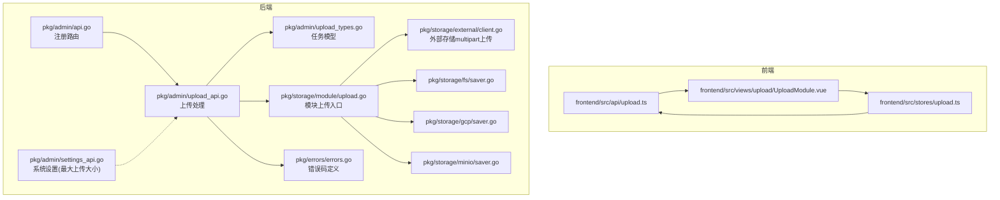
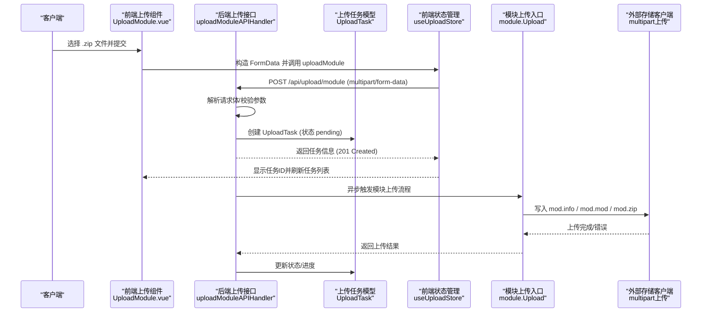
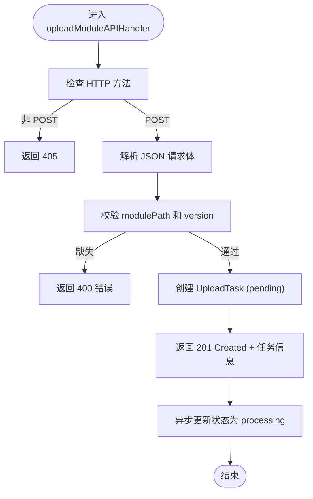
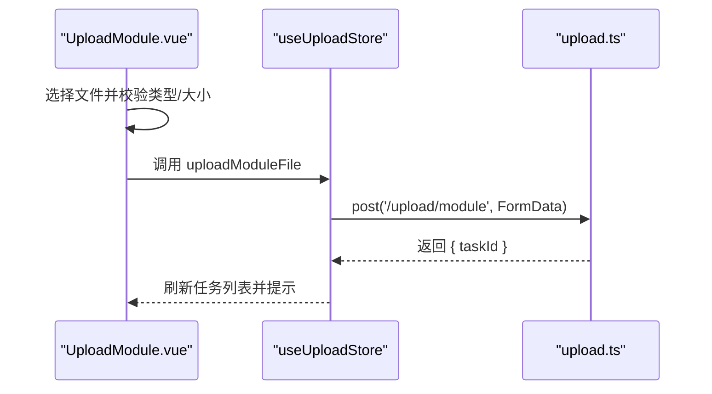
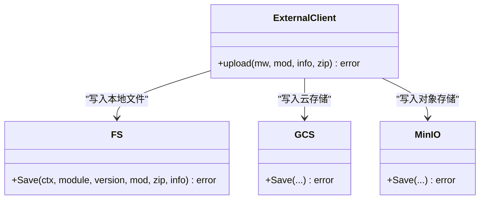
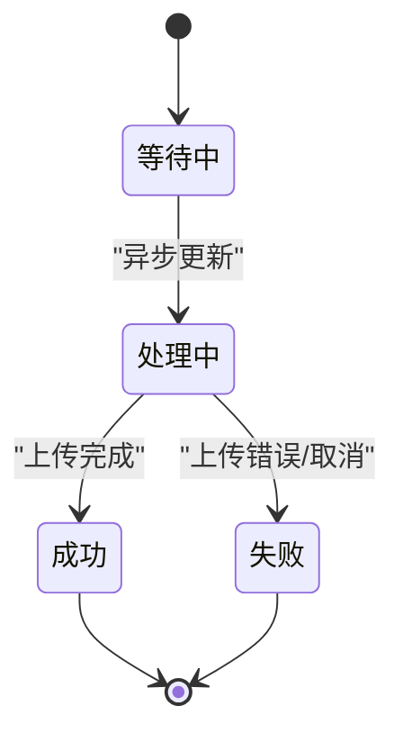
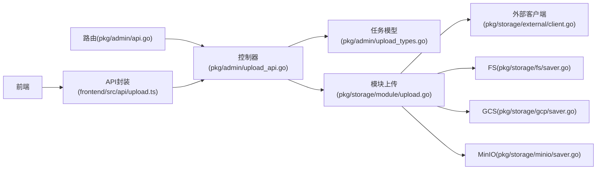

# 直接文件上传

<cite>
**本文引用的文件**
- [pkg/admin/api.go](file://pkg/admin/api.go)
- [pkg/admin/upload_api.go](file://pkg/admin/upload_api.go)
- [pkg/admin/upload_types.go](file://pkg/admin/upload_types.go)
- [pkg/storage/module/upload.go](file://pkg/storage/module/upload.go)
- [pkg/storage/external/client.go](file://pkg/storage/external/client.go)
- [frontend/src/api/upload.ts](file://frontend/src/api/upload.ts)
- [frontend/src/views/upload/UploadModule.vue](file://frontend/src/views/upload/UploadModule.vue)
- [frontend/src/stores/upload.ts](file://frontend/src/stores/upload.ts)
- [pkg/errors/errors.go](file://pkg/errors/errors.go)
- [pkg/storage/fs/saver.go](file://pkg/storage/fs/saver.go)
- [pkg/storage/gcp/saver.go](file://pkg/storage/gcp/saver.go)
- [pkg/storage/minio/saver.go](file://pkg/storage/minio/saver.go)
- [pkg/admin/settings_api.go](file://pkg/admin/settings_api.go)
</cite>

## 目录
1. [简介](#简介)
2. [项目结构](#项目结构)
3. [核心组件](#核心组件)
4. [架构总览](#架构总览)
5. [详细组件分析](#详细组件分析)
6. [依赖关系分析](#依赖关系分析)
7. [性能考量](#性能考量)
8. [故障排查指南](#故障排查指南)
9. [结论](#结论)
10. [附录](#附录)

## 简介
本文件面向直接文件上传 API 的使用者与维护者，聚焦于 /api/upload/module 端点的实现细节，包括请求结构、上传流程、验证机制、错误处理与响应格式。文档同时覆盖前端交互、任务队列模拟、存储后端适配以及系统级限制（如最大上传大小）等主题，帮助读者快速理解并正确使用该能力。

## 项目结构
与直接文件上传相关的核心位置如下：
- 后端路由注册与上传处理：pkg/admin/api.go、pkg/admin/upload_api.go
- 上传任务模型：pkg/admin/upload_types.go
- 存储模块上传入口：pkg/storage/module/upload.go
- 外部存储客户端 multipart 上传：pkg/storage/external/client.go
- 前端上传接口封装与视图：frontend/src/api/upload.ts、frontend/src/views/upload/UploadModule.vue、frontend/src/stores/upload.ts
- 错误类型与错误码：pkg/errors/errors.go
- 各存储后端保存实现：pkg/storage/fs/saver.go、pkg/storage/gcp/saver.go、pkg/storage/minio/saver.go
- 系统设置（含最大上传大小）：pkg/admin/settings_api.go

图表来源
- [pkg/admin/api.go](file://pkg/admin/api.go#L16-L48)
- [pkg/admin/upload_api.go](file://pkg/admin/upload_api.go#L139-L212)
- [pkg/admin/upload_types.go](file://pkg/admin/upload_types.go#L5-L17)
- [pkg/storage/module/upload.go](file://pkg/storage/module/upload.go#L21-L63)
- [pkg/storage/external/client.go](file://pkg/storage/external/client.go#L125-L152)
- [frontend/src/api/upload.ts](file://frontend/src/api/upload.ts#L5-L18)
- [frontend/src/views/upload/UploadModule.vue](file://frontend/src/views/upload/UploadModule.vue#L13-L30)
- [frontend/src/stores/upload.ts](file://frontend/src/stores/upload.ts#L42-L63)
- [pkg/errors/errors.go](file://pkg/errors/errors.go#L12-L22)
- [pkg/storage/fs/saver.go](file://pkg/storage/fs/saver.go#L14-L51)
- [pkg/storage/gcp/saver.go](file://pkg/storage/gcp/saver.go#L74-L111)
- [pkg/storage/minio/saver.go](file://pkg/storage/minio/saver.go#L68-L91)
- [pkg/admin/settings_api.go](file://pkg/admin/settings_api.go#L75-L91)

章节来源
- [pkg/admin/api.go](file://pkg/admin/api.go#L16-L48)
- [frontend/src/api/upload.ts](file://frontend/src/api/upload.ts#L5-L18)
- [frontend/src/views/upload/UploadModule.vue](file://frontend/src/views/upload/UploadModule.vue#L13-L30)
- [frontend/src/stores/upload.ts](file://frontend/src/stores/upload.ts#L42-L63)

## 核心组件
- 路由与控制器
  - 路由注册在 Admin 命名空间下，/api/upload/module 对应 uploadModuleAPIHandler。
  - 控制器负责解析请求、校验参数、创建上传任务并返回任务信息。
- 上传任务模型
  - UploadTask 包含任务 ID、模块路径、版本、来源（file/url）、状态、进度、错误信息、创建与完成时间、文件大小等字段。
- 存储模块上传入口
  - Upload 并行上传 .info、.mod、.zip 三类文件，支持超时控制与多错误聚合。
- 外部存储 multipart 客户端
  - 使用 multipart.Writer 将 mod.info、mod.mod、mod.zip 作为表单文件写入请求体。
- 前端交互
  - 通过 FormData 构造 multipart/form-data 请求；文件类型限制为 zip，大小限制为 50MB；支持上传进度回调。
- 错误与状态码
  - 使用统一错误类型与 HTTP 状态码映射，便于前后端一致处理。
- 系统设置
  - 系统设置接口对 MaxUploadSize 进行校验，确保上传大小限制有效。

章节来源
- [pkg/admin/api.go](file://pkg/admin/api.go#L42-L47)
- [pkg/admin/upload_api.go](file://pkg/admin/upload_api.go#L139-L212)
- [pkg/admin/upload_types.go](file://pkg/admin/upload_types.go#L5-L17)
- [pkg/storage/module/upload.go](file://pkg/storage/module/upload.go#L21-L63)
- [pkg/storage/external/client.go](file://pkg/storage/external/client.go#L125-L152)
- [frontend/src/api/upload.ts](file://frontend/src/api/upload.ts#L5-L18)
- [frontend/src/views/upload/UploadModule.vue](file://frontend/src/views/upload/UploadModule.vue#L210-L224)
- [pkg/errors/errors.go](file://pkg/errors/errors.go#L12-L22)
- [pkg/admin/settings_api.go](file://pkg/admin/settings_api.go#L75-L91)

## 架构总览
直接文件上传的端到端流程如下：

图表来源
- [frontend/src/views/upload/UploadModule.vue](file://frontend/src/views/upload/UploadModule.vue#L236-L254)
- [frontend/src/stores/upload.ts](file://frontend/src/stores/upload.ts#L42-L63)
- [pkg/admin/upload_api.go](file://pkg/admin/upload_api.go#L139-L212)
- [pkg/storage/module/upload.go](file://pkg/storage/module/upload.go#L21-L63)
- [pkg/storage/external/client.go](file://pkg/storage/external/client.go#L125-L152)

## 详细组件分析

### /api/upload/module 端点
- 方法与路径
  - POST /api/upload/module
- 请求格式
  - Content-Type: application/json
  - 请求体字段：
    - modulePath: 字符串，必填
    - version: 字符串，必填
- 响应
  - 成功：201 Created，返回 UploadTask 结构
  - 参数缺失：400 Bad Request，返回错误信息
  - 方法不支持：405 Method Not Allowed
- 业务流程
  - 校验必填字段
  - 创建 UploadTask（source=file，status=pending，progress=0）
  - 立即返回任务信息
  - 异步更新任务状态至 processing（模拟进度推进）

图表来源
- [pkg/admin/upload_api.go](file://pkg/admin/upload_api.go#L140-L212)
- [pkg/admin/upload_types.go](file://pkg/admin/upload_types.go#L5-L17)

章节来源
- [pkg/admin/api.go](file://pkg/admin/api.go#L42-L47)
- [pkg/admin/upload_api.go](file://pkg/admin/upload_api.go#L139-L212)
- [pkg/admin/upload_types.go](file://pkg/admin/upload_types.go#L5-L17)

### 请求参数与验证规则
- modulePath
  - 类型：字符串
  - 必填：是
  - 校验：非空
- version
  - 类型：字符串
  - 必填：是
  - 校验：非空
- 其他
  - 当前实现未对模块路径与版本进行额外格式校验（如语义版本、Go 模块路径规范），建议在生产环境增加相应校验。

章节来源
- [pkg/admin/upload_api.go](file://pkg/admin/upload_api.go#L150-L167)

### 前端上传流程与限制
- 前端通过 FormData 发送 multipart/form-data 请求
- 文件类型限制：仅允许 .zip
- 文件大小限制：≤ 50MB
- 上传进度：通过 onUploadProgress 回调计算百分比
- 任务列表：支持分页与状态筛选

图表来源
- [frontend/src/views/upload/UploadModule.vue](file://frontend/src/views/upload/UploadModule.vue#L210-L254)
- [frontend/src/stores/upload.ts](file://frontend/src/stores/upload.ts#L42-L63)
- [frontend/src/api/upload.ts](file://frontend/src/api/upload.ts#L5-L18)

章节来源
- [frontend/src/views/upload/UploadModule.vue](file://frontend/src/views/upload/UploadModule.vue#L210-L224)
- [frontend/src/stores/upload.ts](file://frontend/src/stores/upload.ts#L42-L63)
- [frontend/src/api/upload.ts](file://frontend/src/api/upload.ts#L5-L18)

### 存储后端与 multipart 上传
- 外部存储客户端使用 multipart.Writer 将三类文件写入请求体：
  - mod.info
  - mod.mod
  - mod.zip
- 各存储后端的保存实现（如 fs/GCS/MinIO）负责接收流式内容并持久化

图表来源
- [pkg/storage/external/client.go](file://pkg/storage/external/client.go#L125-L152)
- [pkg/storage/fs/saver.go](file://pkg/storage/fs/saver.go#L14-L51)
- [pkg/storage/gcp/saver.go](file://pkg/storage/gcp/saver.go#L74-L111)
- [pkg/storage/minio/saver.go](file://pkg/storage/minio/saver.go#L68-L91)

章节来源
- [pkg/storage/external/client.go](file://pkg/storage/external/client.go#L125-L152)
- [pkg/storage/fs/saver.go](file://pkg/storage/fs/saver.go#L14-L51)
- [pkg/storage/gcp/saver.go](file://pkg/storage/gcp/saver.go#L74-L111)
- [pkg/storage/minio/saver.go](file://pkg/storage/minio/saver.go#L68-L91)

### 上传任务生命周期与状态机
- 状态流转
  - pending → processing → completed/failed
- 进度推进
  - 模拟器周期性更新进度，上限 100%
- 取消
  - 仅允许取消 pending/processing 中的任务

图表来源
- [pkg/admin/upload_api.go](file://pkg/admin/upload_api.go#L108-L137)
- [pkg/admin/upload_api.go](file://pkg/admin/upload_api.go#L440-L491)

章节来源
- [pkg/admin/upload_api.go](file://pkg/admin/upload_api.go#L108-L137)
- [pkg/admin/upload_api.go](file://pkg/admin/upload_api.go#L440-L491)

### 错误码与响应格式
- 统一错误码
  - 400：参数错误/请求体解析失败
  - 404：任务不存在
  - 405：方法不允许
  - 409：资源已存在（特定场景）
  - 500：服务器内部错误
- 响应结构
  - 成功：UploadTask 对象
  - 失败：{ error: "..." }

章节来源
- [pkg/errors/errors.go](file://pkg/errors/errors.go#L12-L22)
- [pkg/admin/upload_api.go](file://pkg/admin/upload_api.go#L156-L167)
- [pkg/admin/upload_api.go](file://pkg/admin/upload_api.go#L427-L431)

## 依赖关系分析
- 路由层依赖控制器层，控制器层依赖任务模型与存储模块入口
- 存储模块入口依赖外部存储客户端与具体后端实现
- 前端通过 API 层与后端交互，状态通过 Pinia 管理

图表来源
- [pkg/admin/api.go](file://pkg/admin/api.go#L16-L48)
- [pkg/admin/upload_api.go](file://pkg/admin/upload_api.go#L139-L212)
- [pkg/admin/upload_types.go](file://pkg/admin/upload_types.go#L5-L17)
- [pkg/storage/module/upload.go](file://pkg/storage/module/upload.go#L21-L63)
- [pkg/storage/external/client.go](file://pkg/storage/external/client.go#L125-L152)
- [pkg/storage/fs/saver.go](file://pkg/storage/fs/saver.go#L14-L51)
- [pkg/storage/gcp/saver.go](file://pkg/storage/gcp/saver.go#L74-L111)
- [pkg/storage/minio/saver.go](file://pkg/storage/minio/saver.go#L68-L91)
- [frontend/src/api/upload.ts](file://frontend/src/api/upload.ts#L5-L18)

章节来源
- [pkg/admin/api.go](file://pkg/admin/api.go#L16-L48)
- [frontend/src/api/upload.ts](file://frontend/src/api/upload.ts#L5-L18)

## 性能考量
- 并行上传
  - 模块上传对 .info/.mod/.zip 采用并行上传策略，缩短整体耗时
- 超时控制
  - 通过上下文超时限制单个文件上传时间，避免长时间阻塞
- 分片上传（MinIO）
  - 大文件按固定分片大小写入并组合，提升稳定性与可观测性
- 前端进度
  - 基于 onUploadProgress 计算百分比，改善用户体验

章节来源
- [pkg/storage/module/upload.go](file://pkg/storage/module/upload.go#L21-L63)
- [pkg/storage/minio/saver.go](file://pkg/storage/minio/saver.go#L68-L91)
- [frontend/src/api/upload.ts](file://frontend/src/api/upload.ts#L10-L17)

## 故障排查指南
- 常见错误与定位
  - 400 错误：检查请求体是否为合法 JSON，且包含 modulePath 与 version
  - 404 错误：确认任务 ID 是否正确
  - 405 错误：确认使用了正确的 HTTP 方法（POST）
  - 500 错误：查看服务端日志，关注存储后端异常
- 上传失败排查
  - 检查文件类型与大小限制（前端已限制 .zip ≤ 50MB）
  - 关注存储后端返回的错误码（如 GCS 的 412 条件冲突）
- 取消任务
  - 仅允许取消 pending/processing 中的任务；已完成或已失败的任务不可取消

章节来源
- [pkg/admin/upload_api.go](file://pkg/admin/upload_api.go#L156-L167)
- [pkg/admin/upload_api.go](file://pkg/admin/upload_api.go#L427-L431)
- [pkg/admin/upload_api.go](file://pkg/admin/upload_api.go#L474-L479)
- [pkg/storage/gcp/saver.go](file://pkg/storage/gcp/saver.go#L102-L109)

## 结论
/api/upload/module 端点提供了基于 JSON 的直接文件上传入口，配合前端的文件校验与进度反馈，形成完整的上传体验。后端通过任务模型与异步处理实现上传状态跟踪，并通过模块上传入口与外部存储客户端完成三类文件的并行上传。生产环境中建议补充模块路径与版本的格式校验、接入系统设置中的最大上传大小限制，并完善存储后端的幂等与一致性保障。

## 附录

### 请求与响应示例（路径引用）
- 请求（application/json）
  - POST /api/upload/module
  - Body: {"modulePath":"example.com/repo","version":"v1.0.0"}
- 成功响应（201 Created）
  - Body: UploadTask 对象（包含 id、modulePath、version、source、status、progress、createdAt 等）
- 失败响应（400 Bad Request）
  - Body: {"error":"模块路径和版本为必填字段"}

章节来源
- [pkg/admin/upload_api.go](file://pkg/admin/upload_api.go#L139-L212)
- [pkg/admin/upload_types.go](file://pkg/admin/upload_types.go#L5-L17)

### 文件大小限制与格式验证
- 前端限制
  - 类型：.zip
  - 大小：≤ 50MB
- 系统设置限制
  - MaxUploadSize > 0（系统设置接口进行校验）
- 存储后端
  - GCS：若条件冲突返回 412，映射为已存在错误
  - MinIO：分片写入与组合，提升大文件稳定性
  - FS：直接写入文件系统

章节来源
- [frontend/src/views/upload/UploadModule.vue](file://frontend/src/views/upload/UploadModule.vue#L210-L224)
- [pkg/admin/settings_api.go](file://pkg/admin/settings_api.go#L75-L91)
- [pkg/storage/gcp/saver.go](file://pkg/storage/gcp/saver.go#L102-L109)
- [pkg/storage/minio/saver.go](file://pkg/storage/minio/saver.go#L68-L91)
- [pkg/storage/fs/saver.go](file://pkg/storage/fs/saver.go#L14-L51)