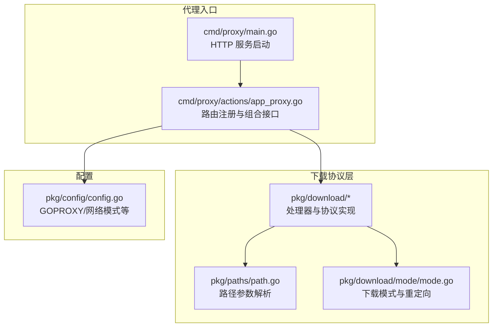
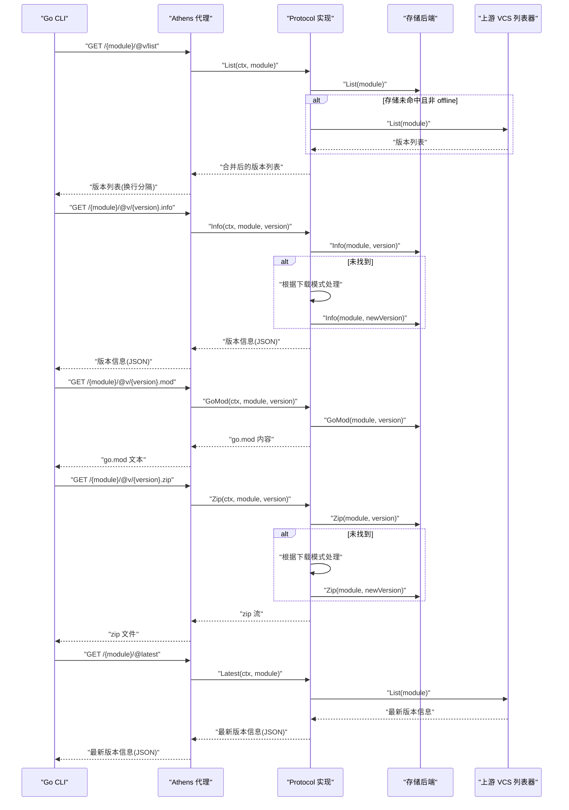
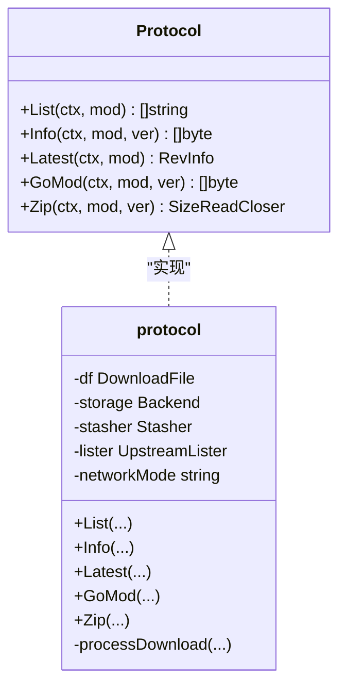
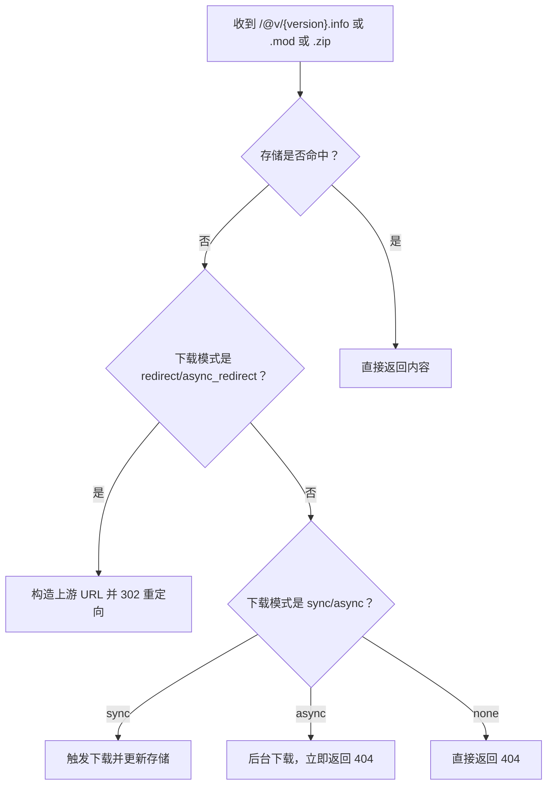
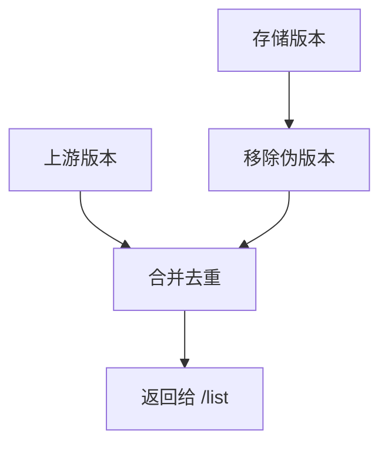
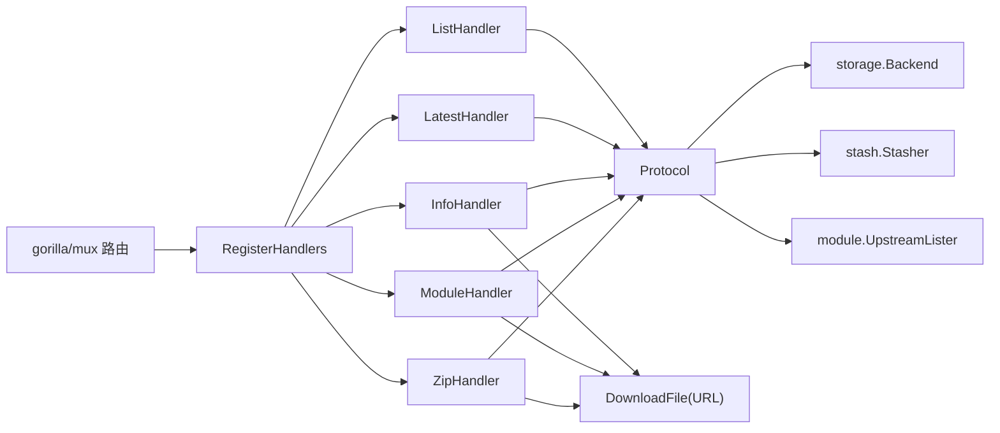

# 下载 API

<cite>
**本文引用的文件**
- [pkg/download/handler.go](file://pkg/download/handler.go)
- [pkg/download/protocol.go](file://pkg/download/protocol.go)
- [pkg/download/list.go](file://pkg/download/list.go)
- [pkg/download/latest.go](file://pkg/download/latest.go)
- [pkg/download/version_info.go](file://pkg/download/version_info.go)
- [pkg/download/version_module.go](file://pkg/download/version_module.go)
- [pkg/download/version_zip.go](file://pkg/download/version_zip.go)
- [pkg/download/get_module_params.go](file://pkg/download/get_module_params.go)
- [pkg/download/mode/mode.go](file://pkg/download/mode/mode.go)
- [pkg/paths/path.go](file://pkg/paths/path.go)
- [cmd/proxy/actions/app_proxy.go](file://cmd/proxy/actions/app_proxy.go)
- [cmd/proxy/main.go](file://cmd/proxy/main.go)
- [docs/content/intro/protocol.md](file://docs/content/intro/protocol.md)
- [pkg/config/config.go](file://pkg/config/config.go)
- [pkg/errors/kinds.go](file://pkg/errors/kinds.go)
</cite>

## 目录
1. [简介](#简介)
2. [项目结构](#项目结构)
3. [核心组件](#核心组件)
4. [架构总览](#架构总览)
5. [详细组件分析](#详细组件分析)
6. [依赖关系分析](#依赖关系分析)
7. [性能考量](#性能考量)
8. [故障排除指南](#故障排除指南)
9. [结论](#结论)
10. [附录](#附录)

## 简介
本文件为 Athens 作为 Go Modules 代理的“下载协议”完整 API 文档，聚焦于 Go CLI 通过 GOPROXY 环境变量与 Athens 的交互方式，覆盖以下下载相关端点：
- 版本列表获取：/modulename/@v/list
- 版本信息获取：/modulename/@v/{version}.info
- go.mod 文件获取：/modulename/@v/{version}.mod
- 模块压缩包下载：/modulename/@v/{version}.zip
- 最新版本查询：/modulename/@latest

同时，文档阐述 Athens 的版本解析、伪版本过滤、校验和（SumDB）验证、缓存与回源策略、以及客户端集成与故障排除建议。

## 项目结构
与下载协议直接相关的代码主要分布在以下模块：
- 路由与处理器：pkg/download
- 协议实现与下载流程：pkg/download/protocol.go
- 路径参数解析：pkg/paths/path.go
- 下载模式与重定向：pkg/download/mode/mode.go
- 代理入口与路由注册：cmd/proxy/actions/app_proxy.go
- 应用启动与监听：cmd/proxy/main.go
- 配置项（含 GOPROXY、网络模式等）：pkg/config/config.go
- 协议文档参考：docs/content/intro/protocol.md



图表来源
- [pkg/download/handler.go](file://pkg/download/handler.go#L41-L57)
- [cmd/proxy/actions/app_proxy.go](file://cmd/proxy/actions/app_proxy.go#L139-L151)
- [cmd/proxy/main.go](file://cmd/proxy/main.go#L64-L114)
- [pkg/config/config.go](file://pkg/config/config.go#L22-L66)

章节来源
- [pkg/download/handler.go](file://pkg/download/handler.go#L1-L67)
- [cmd/proxy/actions/app_proxy.go](file://cmd/proxy/actions/app_proxy.go#L30-L156)
- [cmd/proxy/main.go](file://cmd/proxy/main.go#L29-L127)

## 核心组件
- 协议接口 Protocol：定义了 List、Info、Latest、GoMod、Zip 五个核心方法，对应 Go CLI 的下载协议端点。
- 处理器 Handlers：分别为 /list、/@v/{version}.info、/@v/{version}.mod、/@v/{version}.zip、/@latest 提供 HTTP 处理逻辑。
- 路径解析：从 URL 路径中提取模块名与版本号。
- 下载模式：支持同步下载、异步下载、直接重定向、异步重定向、禁用五种模式，用于未命中缓存时的行为控制。
- 网络模式：strict/offline/fallback，影响上游 VCS 列表与错误处理行为。
- SumDB 支持：在代理路由中内置 /sumdb 前缀转发，配合 GOPROXY 使用。

章节来源
- [pkg/download/protocol.go](file://pkg/download/protocol.go#L20-L37)
- [pkg/download/list.go](file://pkg/download/list.go#L14-L42)
- [pkg/download/version_info.go](file://pkg/download/version_info.go#L11-L47)
- [pkg/download/version_module.go](file://pkg/download/version_module.go#L11-L49)
- [pkg/download/version_zip.go](file://pkg/download/version_zip.go#L13-L61)
- [pkg/download/latest.go](file://pkg/download/latest.go#L13-L43)
- [pkg/paths/path.go](file://pkg/paths/path.go#L12-L54)
- [pkg/download/mode/mode.go](file://pkg/download/mode/mode.go#L16-L82)
- [cmd/proxy/actions/app_proxy.go](file://cmd/proxy/actions/app_proxy.go#L70-L156)
- [pkg/config/config.go](file://pkg/config/config.go#L54-L62)

## 架构总览
下图展示了 Go CLI 与 Athens 的交互流程：Go CLI 通过 GOPROXY 指向 Athens，按序调用 /list → /@v/{version}.info → /@v/{version}.mod → /@v/{version}.zip；若版本不存在或缓存缺失，Athens 根据下载模式与网络模式决定回源或重定向。



图表来源
- [pkg/download/protocol.go](file://pkg/download/protocol.go#L83-L166)
- [pkg/download/protocol.go](file://pkg/download/protocol.go#L199-L251)
- [pkg/download/list.go](file://pkg/download/list.go#L17-L42)
- [pkg/download/version_info.go](file://pkg/download/version_info.go#L14-L47)
- [pkg/download/version_module.go](file://pkg/download/version_module.go#L14-L49)
- [pkg/download/version_zip.go](file://pkg/download/version_zip.go#L16-L61)
- [pkg/download/latest.go](file://pkg/download/latest.go#L17-L43)

## 详细组件分析

### 协议接口与实现
- Protocol 接口定义了五个方法，分别对应四个下载端点与一个查询端点。
- 实现中对存储未命中进行统一处理：根据下载模式选择同步/异步/重定向/异步重定向/禁用。
- 版本列表合并策略：优先上游 VCS 列表，结合存储中的语义化版本并去伪版本；在不同网络模式下对错误进行严格/降级处理。
- HEAD 方法支持：ZipHandler 对 HEAD 请求仅返回头部信息，避免传输体。



图表来源
- [pkg/download/protocol.go](file://pkg/download/protocol.go#L20-L37)
- [pkg/download/protocol.go](file://pkg/download/protocol.go#L75-L81)

章节来源
- [pkg/download/protocol.go](file://pkg/download/protocol.go#L58-L73)
- [pkg/download/protocol.go](file://pkg/download/protocol.go#L83-L166)
- [pkg/download/protocol.go](file://pkg/download/protocol.go#L199-L251)

### 路由与处理器
- 注册路由：RegisterHandlers 统一注册 /list、/@latest、/@v/{version}.info、/@v/{version}.mod、/@v/{version}.zip。
- 处理器职责：
  - ListHandler：输出换行分隔的版本列表。
  - LatestHandler：输出最新版本信息 JSON。
  - InfoHandler：输出 .info JSON，支持 302 重定向。
  - ModuleHandler：输出 .mod 文本，支持 302 重定向。
  - ZipHandler：输出 .zip 文件，支持 HEAD，设置 Content-Length。
- 日志与缓存：通过 LogEntryHandler 注入请求级日志；注册时统一设置 no-cache。

```mermaid
flowchart TD
Start(["请求进入"]) --> Parse["解析模块与版本参数"]
Parse --> Dispatch{"分派到哪个处理器？"}
Dispatch --> |/list| List["ListHandler 输出版本列表"]
Dispatch --> |/@latest| Latest["LatestHandler 输出最新版本"]
Dispatch --> |/@v/{version}.info| Info["InfoHandler 输出 .info 或重定向"]
Dispatch --> |/@v/{version}.mod| Mod["ModuleHandler 输出 .mod 或重定向"]
Dispatch --> |/@v/{version}.zip| Zip["ZipHandler 输出 .zip 或重定向"]
List --> End(["结束"])
Latest --> End
Info --> End
Mod --> End
Zip --> End
```

图表来源
- [pkg/download/handler.go](file://pkg/download/handler.go#L41-L57)
- [pkg/download/list.go](file://pkg/download/list.go#L17-L42)
- [pkg/download/latest.go](file://pkg/download/latest.go#L17-L43)
- [pkg/download/version_info.go](file://pkg/download/version_info.go#L14-L47)
- [pkg/download/version_module.go](file://pkg/download/version_module.go#L14-L49)
- [pkg/download/version_zip.go](file://pkg/download/version_zip.go#L16-L61)

章节来源
- [pkg/download/handler.go](file://pkg/download/handler.go#L39-L67)
- [pkg/download/list.go](file://pkg/download/list.go#L17-L42)
- [pkg/download/latest.go](file://pkg/download/latest.go#L17-L43)
- [pkg/download/version_info.go](file://pkg/download/version_info.go#L14-L47)
- [pkg/download/version_module.go](file://pkg/download/version_module.go#L14-L49)
- [pkg/download/version_zip.go](file://pkg/download/version_zip.go#L16-L61)

### 路径参数解析与下载模式
- 路径解析：GetModule/GetVersion 从 Gorilla Mux 变量中提取模块与版本，并进行解码。
- 下载模式：支持 sync/async/redirect/async_redirect/none；可按模块匹配模式与自定义重定向 URL。
- 重定向：当存储未命中且模式为 redirect/async_redirect 时，处理器根据 DownloadFile.URL 返回 302 到上游。



图表来源
- [pkg/download/protocol.go](file://pkg/download/protocol.go#L253-L279)
- [pkg/download/version_info.go](file://pkg/download/version_info.go#L27-L42)
- [pkg/download/version_module.go](file://pkg/download/version_module.go#L26-L44)
- [pkg/download/version_zip.go](file://pkg/download/version_zip.go#L27-L44)
- [pkg/download/mode/mode.go](file://pkg/download/mode/mode.go#L115-L141)

章节来源
- [pkg/paths/path.go](file://pkg/paths/path.go#L12-L54)
- [pkg/download/get_module_params.go](file://pkg/download/get_module_params.go#L10-L17)
- [pkg/download/mode/mode.go](file://pkg/download/mode/mode.go#L16-L82)
- [pkg/download/mode/mode.go](file://pkg/download/mode/mode.go#L115-L141)

### 版本解析、伪版本过滤与网络模式
- 版本解析：从存储与上游 VCS 同时获取版本列表，严格模式下对上游错误进行传播；fallback 模式下在上游不可用时返回存储内容；offline 模式下仅使用存储。
- 伪版本过滤：移除不符合语义化版本规则的伪版本，确保 /list 返回稳定的版本集合。
- 合并策略：将上游与存储版本合并去重，保留语义化版本为主。



图表来源
- [pkg/download/protocol.go](file://pkg/download/protocol.go#L83-L166)
- [pkg/download/protocol.go](file://pkg/download/protocol.go#L168-L180)

章节来源
- [pkg/download/protocol.go](file://pkg/download/protocol.go#L51-L56)
- [pkg/download/protocol.go](file://pkg/download/protocol.go#L168-L180)

### SumDB 集成与 GOPROXY
- SumDB 支持：代理路由中为每个配置的 SumDB 注册 /sumdb/{host}/supported 与前缀代理，确保 GOPROXY 指向 Athens 时仍能访问官方校验数据库。
- GOPROXY：Go CLI 通过 GOPROXY 指向 Athens，Athens 按协议端点提供模块元数据与源码包。

章节来源
- [cmd/proxy/actions/app_proxy.go](file://cmd/proxy/actions/app_proxy.go#L51-L68)
- [pkg/config/config.go](file://pkg/config/config.go#L24-L27)
- [docs/content/intro/protocol.md](file://docs/content/intro/protocol.md#L1-L79)

## 依赖关系分析
- 路由注册依赖：app_proxy.go 中创建 Protocol、Stasher、Storage、Indexer 等组件，并通过 download.RegisterHandlers 注册下载协议路由。
- 处理器依赖：各处理器依赖 Protocol 接口与路径解析工具，部分处理器在未命中时依赖 DownloadFile 进行重定向。
- 错误处理：统一通过 errors.Kind 映射 HTTP 状态码，Expect 用于区分严重级别。



图表来源
- [pkg/download/handler.go](file://pkg/download/handler.go#L41-L57)
- [cmd/proxy/actions/app_proxy.go](file://cmd/proxy/actions/app_proxy.go#L139-L151)

章节来源
- [pkg/download/handler.go](file://pkg/download/handler.go#L39-L67)
- [cmd/proxy/actions/app_proxy.go](file://cmd/proxy/actions/app_proxy.go#L139-L151)

## 性能考量
- 并发与限流：通过 addons.WithPool 与 stash.WithPool 控制协议与 go-get 并发度，避免资源争用。
- 单飞机制：单飞锁避免同一模块的重复下载，降低上游压力与存储抖动。
- 缓存优先：优先从存储返回数据，减少上游访问。
- 异步下载：async/async_redirect 模式可在未命中时快速返回，提升吞吐。
- HEAD 支持：ZipHandler 对 HEAD 请求仅返回头部，减少带宽占用。

章节来源
- [cmd/proxy/actions/app_proxy.go](file://cmd/proxy/actions/app_proxy.go#L128-L132)
- [pkg/download/protocol.go](file://pkg/download/protocol.go#L253-L279)
- [pkg/download/version_zip.go](file://pkg/download/version_zip.go#L52-L55)

## 故障排除指南
- 404 未找到
  - 可能原因：存储无该版本；网络模式为 offline；或模块不存在。
  - 处理建议：检查网络模式与 GOPROXY；确认模块名拼写；查看日志定位错误来源。
- 302 重定向
  - 可能原因：下载模式为 redirect/async_redirect；或模块匹配到自定义重定向 URL。
  - 处理建议：确认 DownloadFile 配置；检查上游可达性。
- 500 内部错误
  - 可能原因：存储异常、上游不可用、路径参数缺失。
  - 处理建议：查看应用日志；检查存储后端与网络连通性。
- 408/409/504 等超时/冲突
  - 可能原因：上游 VCS 限流、存储写入阻塞、单飞锁等待。
  - 处理建议：调整并发参数；优化存储性能；检查单飞配置。
- GOPROXY 不生效
  - 可能原因：环境变量未正确设置；代理未监听目标端口。
  - 处理建议：确认 GOPROXY 指向 Athens；检查端口与 TLS 配置；使用健康检查端点验证。

章节来源
- [pkg/errors/kinds.go](file://pkg/errors/kinds.go#L3-L7)
- [pkg/download/version_info.go](file://pkg/download/version_info.go#L27-L42)
- [pkg/download/version_module.go](file://pkg/download/version_module.go#L26-L44)
- [pkg/download/version_zip.go](file://pkg/download/version_zip.go#L27-L44)
- [cmd/proxy/main.go](file://cmd/proxy/main.go#L64-L114)

## 结论
Athens 通过严格的下载协议实现与灵活的下载/网络模式，为 Go CLI 提供稳定、可扩展的模块代理能力。结合 SumDB 支持与完善的错误映射，用户可在多种部署场景下安全高效地使用 GOPROXY。

## 附录

### 端点定义与规范
- 版本列表：GET {basePath}/{module}/@v/list
  - 响应：文本，每行一个版本
  - 状态码：200 成功；404 未找到；500 服务器错误
- 版本信息：GET {basePath}/{module}/@v/{version}.info
  - 响应：JSON，包含版本元信息
  - 状态码：200 成功；404 未找到；302 重定向；500 服务器错误
- go.mod：GET {basePath}/{module}/@v/{version}.mod
  - 响应：文本，go.mod 内容
  - 状态码：200 成功；404 未找到；302 重定向；500 服务器错误
- 源码包：GET {basePath}/{module}/@v/{version}.zip
  - 响应：二进制 zip 文件；HEAD 仅返回头部
  - 状态码：200 成功；404 未找到；302 重定向；500 服务器错误
- 最新版本：GET {basePath}/{module}/@latest
  - 响应：JSON，最新版本信息
  - 状态码：200 成功；404 未找到；500 服务器错误

章节来源
- [docs/content/intro/protocol.md](file://docs/content/intro/protocol.md#L17-L79)
- [pkg/download/list.go](file://pkg/download/list.go#L14-L42)
- [pkg/download/version_info.go](file://pkg/download/version_info.go#L11-L47)
- [pkg/download/version_module.go](file://pkg/download/version_module.go#L11-L49)
- [pkg/download/version_zip.go](file://pkg/download/version_zip.go#L13-L61)
- [pkg/download/latest.go](file://pkg/download/latest.go#L13-L43)

### 客户端集成示例（步骤）
- 设置 GOPROXY：将 GOPROXY 指向 Athens 代理地址。
- 验证健康状态：访问 /healthz 与 /readyz 确认代理可用。
- 触发 go get：执行 go get -v <module>@<version>，观察日志与缓存命中情况。
- 校验 SumDB：确保 GOPROXY 指向的代理可访问 /sumdb 前缀。

章节来源
- [cmd/proxy/actions/app_proxy.go](file://cmd/proxy/actions/app_proxy.go#L36-L42)
- [pkg/config/config.go](file://pkg/config/config.go#L24-L27)