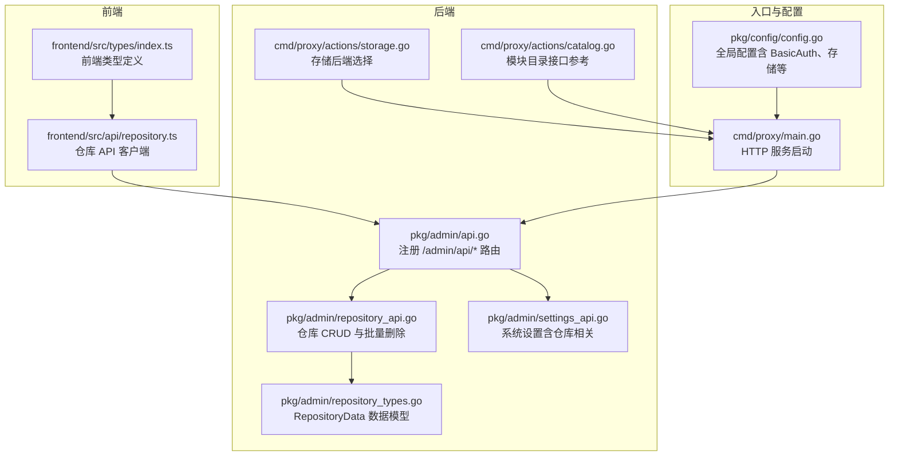
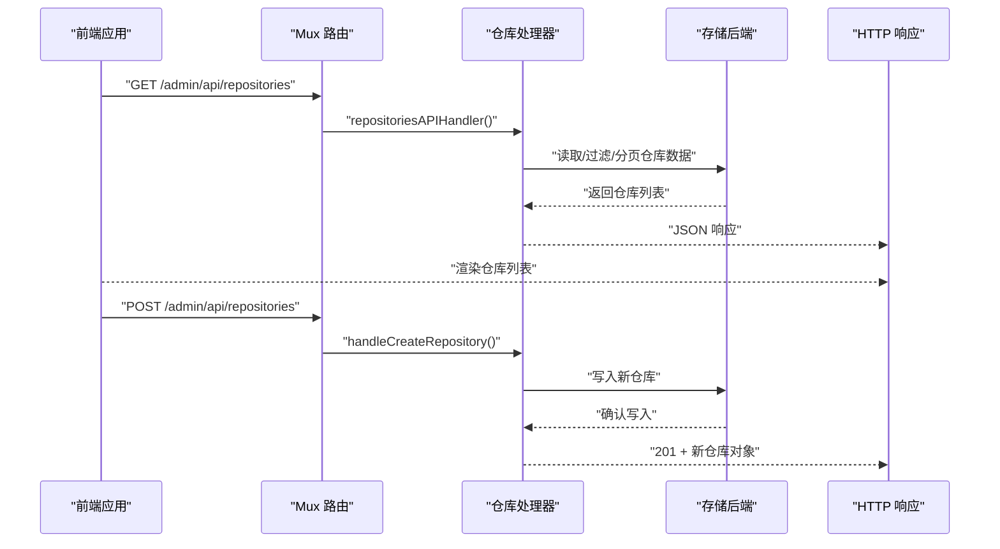
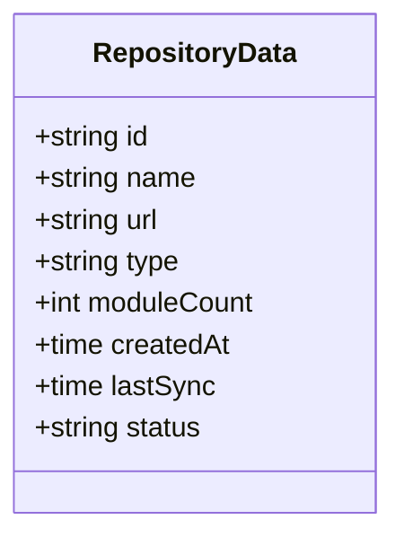
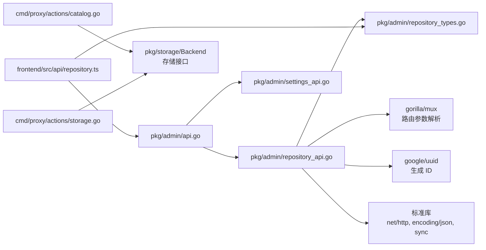

# 仓库 API

<cite>
**本文引用的文件**
- [pkg/admin/api.go](file://pkg/admin/api.go)
- [pkg/admin/repository_api.go](file://pkg/admin/repository_api.go)
- [pkg/admin/repository_types.go](file://pkg/admin/repository_types.go)
- [pkg/admin/settings_api.go](file://pkg/admin/settings_api.go)
- [cmd/proxy/actions/storage.go](file://cmd/proxy/actions/storage.go)
- [cmd/proxy/actions/catalog.go](file://cmd/proxy/actions/catalog.go)
- [frontend/src/api/repository.ts](file://frontend/src/api/repository.ts)
- [frontend/src/types/index.ts](file://frontend/src/types/index.ts)
- [cmd/proxy/main.go](file://cmd/proxy/main.go)
- [pkg/config/config.go](file://pkg/config/config.go)
- [docs/content/configuration/upstream.md](file://docs/content/configuration/upstream.md)
</cite>

## 目录
1. [简介](#简介)
2. [项目结构](#项目结构)
3. [核心组件](#核心组件)
4. [架构总览](#架构总览)
5. [详细组件分析](#详细组件分析)
6. [依赖关系分析](#依赖关系分析)
7. [性能考量](#性能考量)
8. [故障排除指南](#故障排除指南)
9. [结论](#结论)
10. [附录](#附录)

## 简介
本文件面向仓库管理 API 的使用者与维护者，系统性梳理与仓库相关的核心接口、数据模型、认证与访问控制、配置参数、状态监控与同步机制、错误诊断与最佳实践。重点覆盖以下端点：
- 仓库列表查询：/admin/api/repositories
- 仓库详情获取：/admin/api/repositories/{id}
- 批量删除：/admin/api/repositories/batch-delete
- 仓库配置参数、认证方式与访问权限
- 仓库状态监控、同步状态查询与错误诊断
- 仓库类型支持、上游配置与镜像设置
- 仓库管理最佳实践与故障排除

## 项目结构
仓库管理 API 属于后端管理子系统，位于 pkg/admin 包中，并通过路由注册挂载在 /admin 路径下；前端通过统一的 /admin 前缀进行调用。

**图表来源**
- [pkg/admin/api.go](file://pkg/admin/api.go#L15-L45)
- [pkg/admin/repository_api.go](file://pkg/admin/repository_api.go#L104-L120)
- [pkg/admin/repository_types.go](file://pkg/admin/repository_types.go#L5-L15)
- [pkg/admin/settings_api.go](file://pkg/admin/settings_api.go#L29-L44)
- [cmd/proxy/actions/storage.go](file://cmd/proxy/actions/storage.go#L24-L76)
- [cmd/proxy/actions/catalog.go](file://cmd/proxy/actions/catalog.go#L21-L55)
- [frontend/src/api/repository.ts](file://frontend/src/api/repository.ts#L4-L28)
- [frontend/src/types/index.ts](file://frontend/src/types/index.ts#L26-L41)
- [cmd/proxy/main.go](file://cmd/proxy/main.go#L29-L62)
- [pkg/config/config.go](file://pkg/config/config.go#L21-L66)

**章节来源**
- [pkg/admin/api.go](file://pkg/admin/api.go#L15-L45)
- [cmd/proxy/main.go](file://cmd/proxy/main.go#L29-L62)

## 核心组件
- 路由注册：在 /admin 路径下注册仓库相关 API，包括列表、详情、批量删除等。
- 仓库数据模型：RepositoryData 描述仓库的基本属性（ID、名称、URL、类型、模块数、创建时间、最近同步时间、状态）。
- 存储与后端：系统支持多种存储后端（内存、磁盘、S3、GCS、Azure Blob、Mongo、MinIO、External），可通过配置选择。
- 前端客户端：提供仓库列表、详情、批量删除等调用封装。
- 配置与认证：支持 BasicAuth 用户名密码、日志级别、端口、TLS、pprof 等全局配置。

**章节来源**
- [pkg/admin/repository_types.go](file://pkg/admin/repository_types.go#L5-L15)
- [cmd/proxy/actions/storage.go](file://cmd/proxy/actions/storage.go#L24-L76)
- [frontend/src/api/repository.ts](file://frontend/src/api/repository.ts#L4-L28)
- [pkg/config/config.go](file://pkg/config/config.go#L21-L66)

## 架构总览
仓库管理 API 的调用链路如下：

**图表来源**
- [pkg/admin/api.go](file://pkg/admin/api.go#L37-L40)
- [pkg/admin/repository_api.go](file://pkg/admin/repository_api.go#L104-L120)
- [cmd/proxy/actions/storage.go](file://cmd/proxy/actions/storage.go#L24-L76)

## 详细组件分析

### 仓库数据模型
RepositoryData 是仓库管理 API 的核心数据载体，包含以下字段：
- id：仓库唯一标识
- name：仓库名称
- url：仓库地址
- type：仓库类型（如 git、svn、mercurial、proxy）
- moduleCount：模块数量
- createdAt：创建时间
- lastSync：最近同步时间
- status：仓库状态（active、syncing、error、inactive）

**图表来源**
- [pkg/admin/repository_types.go](file://pkg/admin/repository_types.go#L5-L15)

**章节来源**
- [pkg/admin/repository_types.go](file://pkg/admin/repository_types.go#L5-L15)

### 仓库列表查询 API
- 路径：/admin/api/repositories
- 方法：GET
- 查询参数：
  - q：按名称或 URL 模糊搜索
  - type：按仓库类型过滤
  - status：按状态过滤
  - limit：每页数量，默认 20
  - offset：偏移量，默认 0
- 响应：
  - repositories：仓库数组
  - total：总数量
  - limit、offset：分页参数

实现要点：
- 使用读锁安全访问模拟仓库列表
- 支持多条件过滤与分页
- 统一 JSON 响应结构

**章节来源**
- [pkg/admin/api.go](file://pkg/admin/api.go#L37-L40)
- [pkg/admin/repository_api.go](file://pkg/admin/repository_api.go#L122-L205)

### 仓库详情获取 API
- 路径：/admin/api/repositories/{id}
- 方法：GET
- 参数：路径参数 id
- 响应：单个仓库对象
- 错误：未找到返回 404

实现要点：
- 通过 ID 在仓库列表中查找
- 未找到时返回 404

**章节来源**
- [pkg/admin/api.go](file://pkg/admin/api.go#L37-L40)
- [pkg/admin/repository_api.go](file://pkg/admin/repository_api.go#L243-L295)

### 仓库创建 API
- 路径：/admin/api/repositories
- 方法：POST
- 请求体：RepositoryData（校验 name、url、type 必填）
- 响应：201 + 新仓库对象
- 错误：请求体解析失败或必填字段缺失返回 400

实现要点：
- 自动生成 UUID、创建时间、最近同步时间与默认状态
- 写入时加写锁保证并发安全

**章节来源**
- [pkg/admin/api.go](file://pkg/admin/api.go#L37-L40)
- [pkg/admin/repository_api.go](file://pkg/admin/repository_api.go#L207-L241)

### 仓库更新 API
- 路径：/admin/api/repositories/{id}
- 方法：PUT
- 请求体：RepositoryData（校验 name、url、type 必填）
- 响应：更新后的仓库对象
- 错误：未找到返回 404，请求体无效返回 400

实现要点：
- 保留原始 ID 与创建时间
- 更新 lastSync 为当前时间

**章节来源**
- [pkg/admin/api.go](file://pkg/admin/api.go#L37-L40)
- [pkg/admin/repository_api.go](file://pkg/admin/repository_api.go#L297-L348)

### 仓库删除 API
- 路径：/admin/api/repositories/{id}
- 方法：DELETE
- 响应：204 No Content
- 错误：未找到返回 404

实现要点：
- 通过 ID 定位并删除
- 写入时加写锁

**章节来源**
- [pkg/admin/api.go](file://pkg/admin/api.go#L37-L40)
- [pkg/admin/repository_api.go](file://pkg/admin/repository_api.go#L350-L376)

### 批量删除 API
- 路径：/admin/api/repositories/batch-delete
- 方法：POST
- 请求体：包含 ids 数组
- 响应：204 No Content
- 错误：请求体无效或 ids 为空返回 400；找不到对应仓库时忽略

实现要点：
- 将请求中的 ID 映射为集合以快速判断是否删除
- 过滤剩余仓库并替换原列表
- 写入时加写锁

**章节来源**
- [pkg/admin/api.go](file://pkg/admin/api.go#L37-L40)
- [pkg/admin/repository_api.go](file://pkg/admin/repository_api.go#L378-L430)

### 仓库状态与同步状态
- 状态枚举：active、syncing、error、inactive
- 同步状态：lastSync 字段表示最近一次同步时间
- 列表查询支持按 status 过滤，便于筛选异常或待同步的仓库

**章节来源**
- [pkg/admin/repository_api.go](file://pkg/admin/repository_api.go#L16-L20)
- [pkg/admin/repository_api.go](file://pkg/admin/repository_api.go#L122-L205)

### 上游配置与镜像设置
- 上游配置：通过配置文件与环境变量设置 GlobalEndpoint 与 FilterFile，实现从上游 Go 模块仓库或另一个 Athens 实例拉取模块。
- 文档指引：参见“使用上游 Go 模块仓库（已弃用）”文档，当前推荐使用下载模式文件进行上游配置。

**章节来源**
- [docs/content/configuration/upstream.md](file://docs/content/configuration/upstream.md#L1-L32)
- [pkg/config/config.go](file://pkg/config/config.go#L21-L66)

### 认证方式与访问权限
- BasicAuth：可配置 BASIC_AUTH_USER 与 BASIC_AUTH_PASS，用于保护管理接口。
- 排除路径：健康检查 /healthz 与 /readyz 默认不强制认证。
- 建议：生产环境启用 BasicAuth 并结合 TLS 使用。

**章节来源**
- [pkg/config/config.go](file://pkg/config/config.go#L43-L44)
- [cmd/proxy/actions/basicauth.go](file://cmd/proxy/actions/basicauth.go#L11-L27)

### 存储后端与数据持久化
- 支持存储类型：memory、disk、s3、gcp、azureblob、mongo、minio、external
- 通过配置项 StorageType 与对应存储配置决定后端
- 仓库管理 API 当前使用内存模拟数据；若需持久化，建议结合具体存储后端实现

**章节来源**
- [cmd/proxy/actions/storage.go](file://cmd/proxy/actions/storage.go#L24-L76)
- [pkg/config/config.go](file://pkg/config/config.go#L39-L65)

### 前端集成
- 前端提供仓库 API 客户端封装，包括列表、详情、批量删除与统计接口
- 类型定义与后端响应保持一致，便于前后端协作

**章节来源**
- [frontend/src/api/repository.ts](file://frontend/src/api/repository.ts#L4-L33)
- [frontend/src/types/index.ts](file://frontend/src/types/index.ts#L26-L41)

## 依赖关系分析
仓库管理 API 的关键依赖与耦合关系如下：

**图表来源**
- [pkg/admin/repository_api.go](file://pkg/admin/repository_api.go#L3-L14)
- [pkg/admin/repository_types.go](file://pkg/admin/repository_types.go#L5-L15)
- [pkg/admin/api.go](file://pkg/admin/api.go#L15-L45)
- [cmd/proxy/actions/catalog.go](file://cmd/proxy/actions/catalog.go#L21-L55)
- [cmd/proxy/actions/storage.go](file://cmd/proxy/actions/storage.go#L24-L76)
- [frontend/src/api/repository.ts](file://frontend/src/api/repository.ts#L1-L33)

**章节来源**
- [pkg/admin/repository_api.go](file://pkg/admin/repository_api.go#L3-L14)
- [pkg/admin/api.go](file://pkg/admin/api.go#L15-L45)
- [cmd/proxy/actions/catalog.go](file://cmd/proxy/actions/catalog.go#L21-L55)
- [cmd/proxy/actions/storage.go](file://cmd/proxy/actions/storage.go#L24-L76)
- [frontend/src/api/repository.ts](file://frontend/src/api/repository.ts#L1-L33)

## 性能考量
- 并发安全：仓库列表与设置均使用互斥锁保护，避免并发读写冲突。
- 分页与过滤：列表查询支持 limit/offset 与多条件过滤，建议前端合理设置分页参数以降低单次响应体积。
- 存储选择：生产环境建议使用分布式或云存储后端，避免内存模拟数据带来的重启丢失风险。
- 日志与可观测性：通过配置项控制日志级别与格式，结合 pprof 与指标导出器进行性能分析。

[本节为通用指导，无需特定文件引用]

## 故障排除指南
- 400 Bad Request
  - 请求体解析失败或必填字段缺失（name、url、type）。请检查请求体格式与字段完整性。
- 404 Not Found
  - 仓库不存在（详情查询、更新、删除）。请确认 ID 是否正确。
- 405 Method Not Allowed
  - 使用了不支持的 HTTP 方法。请核对端点与方法。
- 401 Unauthorized
  - BasicAuth 未通过或未提供凭据。请检查 BASIC_AUTH_USER/PASS 与请求头。
- 500 Internal Server Error
  - 编码响应或内部错误。请查看服务端日志定位问题。

**章节来源**
- [pkg/admin/repository_api.go](file://pkg/admin/repository_api.go#L207-L241)
- [pkg/admin/repository_api.go](file://pkg/admin/repository_api.go#L268-L295)
- [pkg/admin/repository_api.go](file://pkg/admin/repository_api.go#L297-L348)
- [pkg/admin/repository_api.go](file://pkg/admin/repository_api.go#L350-L376)
- [pkg/admin/repository_api.go](file://pkg/admin/repository_api.go#L378-L430)
- [cmd/proxy/actions/basicauth.go](file://cmd/proxy/actions/basicauth.go#L11-L27)

## 结论
仓库管理 API 提供了完整的仓库生命周期管理能力，涵盖列表查询、详情获取、创建、更新、删除与批量删除。配合 BasicAuth、存储后端选择与配置体系，可在开发与生产环境中灵活部署。建议在生产中启用认证与 TLS，选择合适的存储后端，并通过分页与过滤优化查询性能。

[本节为总结，无需特定文件引用]

## 附录

### API 端点一览
- GET /admin/api/repositories
  - 查询参数：q、type、status、limit、offset
  - 响应：repositories、total、limit、offset
- POST /admin/api/repositories
  - 请求体：RepositoryData（name、url、type 必填）
  - 响应：201 + 新仓库对象
- GET /admin/api/repositories/{id}
  - 响应：单个仓库对象
- PUT /admin/api/repositories/{id}
  - 请求体：RepositoryData（name、url、type 必填）
  - 响应：更新后的仓库对象
- DELETE /admin/api/repositories/{id}
  - 响应：204 No Content
- POST /admin/api/repositories/batch-delete
  - 请求体：{ ids: string[] }
  - 响应：204 No Content

**章节来源**
- [pkg/admin/api.go](file://pkg/admin/api.go#L37-L40)
- [pkg/admin/repository_api.go](file://pkg/admin/repository_api.go#L104-L120)
- [pkg/admin/repository_api.go](file://pkg/admin/repository_api.go#L243-L295)
- [pkg/admin/repository_api.go](file://pkg/admin/repository_api.go#L378-L430)

### 仓库类型与状态
- 仓库类型：git、svn、mercurial、proxy
- 仓库状态：active、syncing、error、inactive

**章节来源**
- [pkg/admin/repository_api.go](file://pkg/admin/repository_api.go#L16-L20)

### 配置参数与认证
- BasicAuth：BASIC_AUTH_USER、BASIC_AUTH_PASS
- 日志：LOG_LEVEL、LOG_FORMAT、ATHENS_CLOUD_RUNTIME
- 网络：ATHENS_PORT、ATHENS_UNIX_SOCKET、TLSCERT_FILE、TLSKEY_FILE
- 存储：ATHENS_STORAGE_TYPE、各存储后端配置
- 其他：ATHENS_ENABLE_PPROF、ATHENS_PPROF_PORT、ATHENS_SHUTDOWN_TIMEOUT

**章节来源**
- [pkg/config/config.go](file://pkg/config/config.go#L21-L66)

### 上游与镜像配置
- GlobalEndpoint：上游 Go 模块仓库或另一个 Athens 实例
- FilterFile：过滤规则文件（当前推荐使用下载模式文件替代）

**章节来源**
- [docs/content/configuration/upstream.md](file://docs/content/configuration/upstream.md#L1-L32)