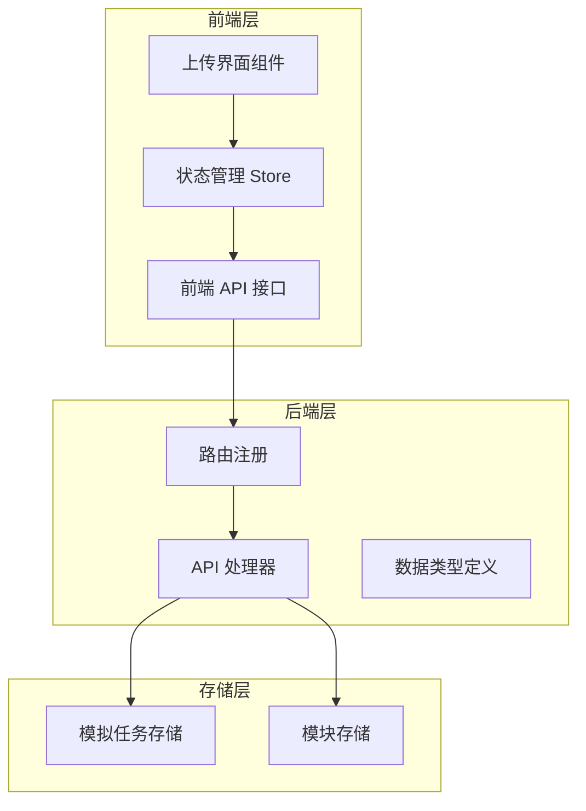
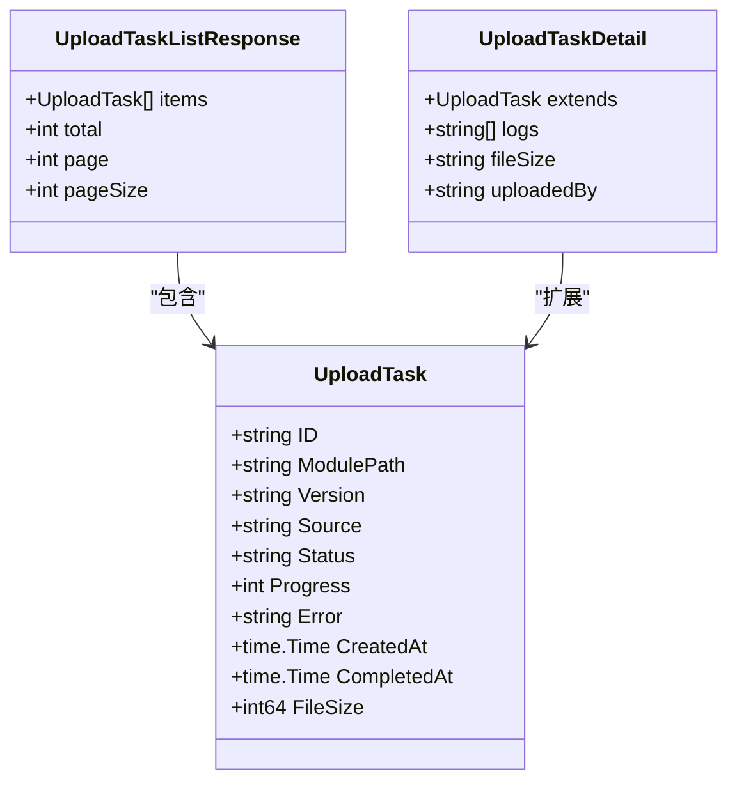
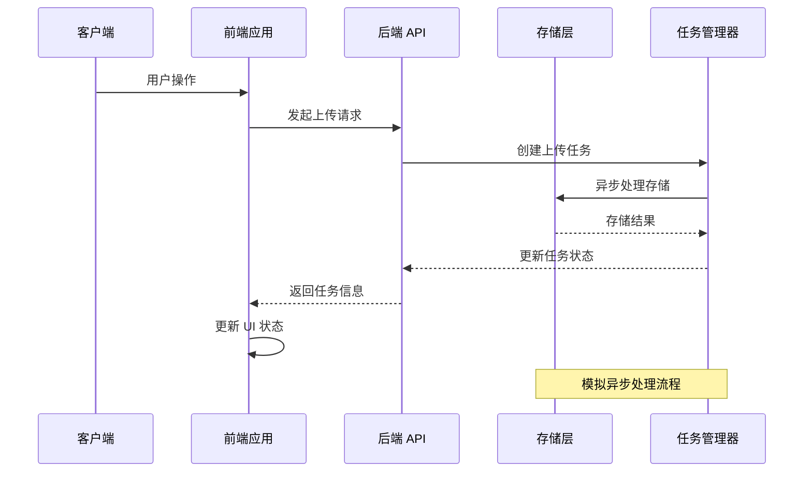
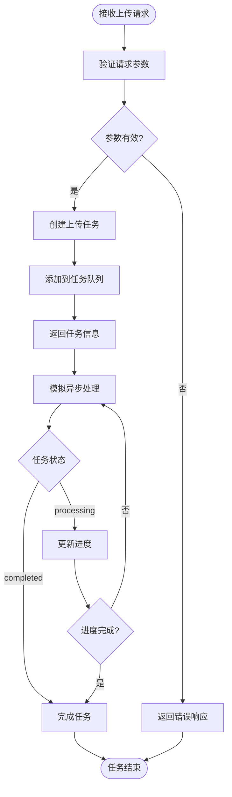
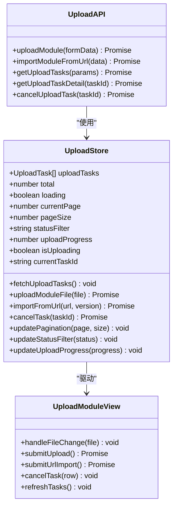
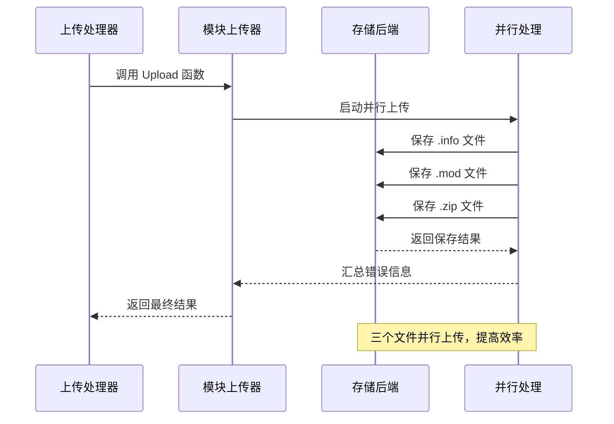
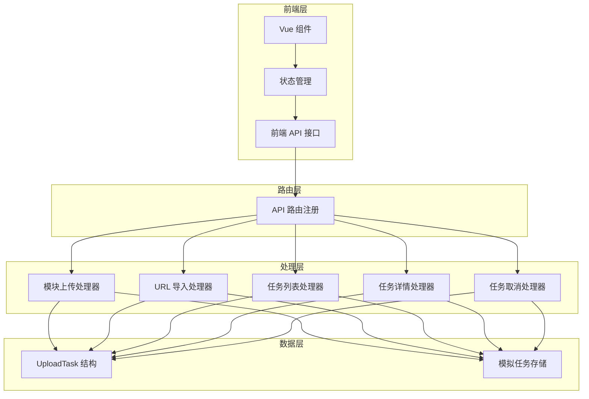

# 上传管理 API

<cite>
**本文档引用的文件**
- [pkg/admin/upload_api.go](file://pkg/admin/upload_api.go)
- [pkg/admin/upload_types.go](file://pkg/admin/upload_types.go)
- [pkg/admin/api.go](file://pkg/admin/api.go)
- [frontend/src/api/upload.ts](file://frontend/src/api/upload.ts)
- [frontend/src/stores/upload.ts](file://frontend/src/stores/upload.ts)
- [frontend/src/views/upload/UploadModule.vue](file://frontend/src/views/upload/UploadModule.vue)
- [frontend/src/types/index.ts](file://frontend/src/types/index.ts)
- [pkg/storage/module/upload.go](file://pkg/storage/module/upload.go)
</cite>

## 目录
1. [简介](#简介)
2. [项目结构](#项目结构)
3. [核心组件](#核心组件)
4. [架构概览](#架构概览)
5. [详细组件分析](#详细组件分析)
6. [依赖关系分析](#依赖关系分析)
7. [性能考虑](#性能考虑)
8. [故障排除指南](#故障排除指南)
9. [结论](#结论)

## 简介

上传管理 API 是 Athens 代理系统中的重要组成部分，负责处理 Go 模块的上传和导入操作。该 API 提供了完整的模块上传生命周期管理，包括文件上传、URL 导入、任务管理和状态跟踪等功能。

本系统采用模拟实现方式，使用内存数据结构来模拟上传任务的创建、处理和状态变化，为实际生产环境提供了清晰的架构参考和扩展基础。

## 项目结构

上传管理 API 的实现分布在多个层次中：

**图表来源**
- [pkg/admin/api.go](file://pkg/admin/api.go#L16-L48)
- [pkg/admin/upload_api.go](file://pkg/admin/upload_api.go#L1-L30)
- [frontend/src/api/upload.ts](file://frontend/src/api/upload.ts#L1-L42)

**章节来源**
- [pkg/admin/upload_api.go](file://pkg/admin/upload_api.go#L1-L491)
- [pkg/admin/api.go](file://pkg/admin/api.go#L1-L244)
- [frontend/src/api/upload.ts](file://frontend/src/api/upload.ts#L1-L42)

## 核心组件

### 数据模型

上传任务的核心数据结构定义如下：

**图表来源**
- [pkg/admin/upload_types.go](file://pkg/admin/upload_types.go#L5-L17)
- [frontend/src/types/index.ts](file://frontend/src/types/index.ts#L43-L65)

### API 端点

系统提供以下主要 API 端点：

| 端点 | 方法 | 描述 | 请求体 | 响应 |
|------|------|------|--------|------|
| `/admin/api/upload/module` | POST | 上传模块文件 | multipart/form-data | UploadTask |
| `/admin/api/upload/import-url` | POST | 从 URL 导入模块 | JSON | UploadTask |
| `/admin/api/upload/tasks` | GET | 获取上传任务列表 | 查询参数 | UploadTaskListResponse |
| `/admin/api/upload/tasks/{taskId}/cancel` | POST | 取消上传任务 | 无 | UploadTask |
| `/admin/api/upload/tasks/{taskId}` | GET | 获取任务详情 | 无 | UploadTaskDetail |

**章节来源**
- [pkg/admin/api.go](file://pkg/admin/api.go#L42-L47)
- [pkg/admin/upload_api.go](file://pkg/admin/upload_api.go#L139-L491)

## 架构概览

上传管理系统的整体架构采用分层设计，确保了良好的可维护性和扩展性：

**图表来源**
- [pkg/admin/upload_api.go](file://pkg/admin/upload_api.go#L108-L137)
- [pkg/storage/module/upload.go](file://pkg/storage/module/upload.go#L21-L63)

## 详细组件分析

### 上传任务处理器

上传任务处理器实现了完整的任务生命周期管理：

**图表来源**
- [pkg/admin/upload_api.go](file://pkg/admin/upload_api.go#L108-L137)
- [pkg/admin/upload_api.go](file://pkg/admin/upload_api.go#L139-L212)

#### 任务状态管理

系统支持四种任务状态：
- `pending`: 等待中 - 任务已创建但尚未开始处理
- `processing`: 处理中 - 任务正在进行中
- `completed`: 已完成 - 任务成功完成
- `failed`: 已失败 - 任务处理失败

#### 进度跟踪机制

进度跟踪通过以下方式实现：
1. **实时更新**: 使用定时器每 5 秒更新一次进行中的任务进度
2. **随机增量**: 每次更新增加 1-10% 的进度
3. **自动完成**: 当进度达到 100% 时自动标记为完成状态

**章节来源**
- [pkg/admin/upload_api.go](file://pkg/admin/upload_api.go#L108-L137)
- [pkg/admin/upload_api.go](file://pkg/admin/upload_api.go#L169-L212)

### 前端集成

前端应用通过专门的 API 层与后端交互：

**图表来源**
- [frontend/src/api/upload.ts](file://frontend/src/api/upload.ts#L4-L42)
- [frontend/src/stores/upload.ts](file://frontend/src/stores/upload.ts#L7-L128)
- [frontend/src/views/upload/UploadModule.vue](file://frontend/src/views/upload/UploadModule.vue#L171-L401)

**章节来源**
- [frontend/src/api/upload.ts](file://frontend/src/api/upload.ts#L1-L42)
- [frontend/src/stores/upload.ts](file://frontend/src/stores/upload.ts#L1-L128)
- [frontend/src/views/upload/UploadModule.vue](file://frontend/src/views/upload/UploadModule.vue#L1-L401)

### 存储层集成

底层存储层提供了模块上传的核心功能：

**图表来源**
- [pkg/storage/module/upload.go](file://pkg/storage/module/upload.go#L21-L63)

**章节来源**
- [pkg/storage/module/upload.go](file://pkg/storage/module/upload.go#L1-L64)

## 依赖关系分析

系统各组件之间的依赖关系如下：

**图表来源**
- [pkg/admin/api.go](file://pkg/admin/api.go#L16-L48)
- [pkg/admin/upload_api.go](file://pkg/admin/upload_api.go#L1-L30)
- [frontend/src/api/upload.ts](file://frontend/src/api/upload.ts#L1-L42)

**章节来源**
- [pkg/admin/api.go](file://pkg/admin/api.go#L1-L244)
- [pkg/admin/upload_api.go](file://pkg/admin/upload_api.go#L1-L491)

## 性能考虑

### 并发处理

系统采用了多种并发处理策略：

1. **读写分离**: 使用 RWMutex 实现读多写少场景下的高效并发
2. **异步处理**: 上传任务创建后立即返回，后续处理在后台异步进行
3. **并行存储**: 模块文件采用并行上传方式，提高整体吞吐量

### 内存优化

1. **任务池管理**: 使用固定容量切片减少内存分配开销
2. **定时清理**: 通过定时器定期更新任务状态，避免无限增长
3. **延迟初始化**: 仅在需要时创建和初始化任务数据

### 扩展性设计

1. **接口抽象**: 通过函数类型定义存储接口，便于替换不同存储后端
2. **配置化**: 支持通过配置文件调整任务处理行为
3. **监控集成**: 预留了性能监控和指标收集的扩展点

## 故障排除指南

### 常见问题及解决方案

#### 任务状态异常

**问题**: 任务状态长时间停留在 pending 或 processing

**诊断步骤**:
1. 检查后端服务日志中的任务处理定时器
2. 验证模拟任务处理器是否正常运行
3. 确认并发访问控制是否正确

**解决方案**:
- 重启后端服务以重置模拟任务状态
- 检查系统资源使用情况
- 验证数据库连接状态

#### 前端显示问题

**问题**: 上传进度不显示或显示异常

**诊断步骤**:
1. 检查浏览器开发者工具中的网络请求
2. 验证 onUploadProgress 回调是否正确执行
3. 确认进度计算公式是否正确

**解决方案**:
- 检查文件大小计算逻辑
- 验证进度百分比计算
- 确认 UI 组件的进度显示绑定

#### API 调用失败

**问题**: API 请求返回错误状态码

**诊断步骤**:
1. 检查请求参数格式和完整性
2. 验证认证和授权配置
3. 确认服务端路由注册是否正确

**解决方案**:
- 检查请求头设置
- 验证 URL 路径拼接
- 确认 CORS 配置

**章节来源**
- [pkg/admin/upload_api.go](file://pkg/admin/upload_api.go#L140-L212)
- [frontend/src/stores/upload.ts](file://frontend/src/stores/upload.ts#L42-L89)

## 结论

上传管理 API 提供了一个完整、可扩展的模块上传解决方案。通过模拟实现方式，系统展示了现代 Web 应用的典型架构模式，包括：

1. **清晰的分层架构**: 前端、后端、存储层职责明确
2. **完善的错误处理**: 全面的错误检查和用户友好的错误提示
3. **灵活的并发模型**: 支持高并发场景下的稳定运行
4. **良好的扩展性**: 为生产环境部署预留了充分的扩展空间

该系统为实际的模块上传功能提供了坚实的技术基础，开发者可以根据具体需求进行定制和扩展，以满足不同规模和复杂度的应用场景。