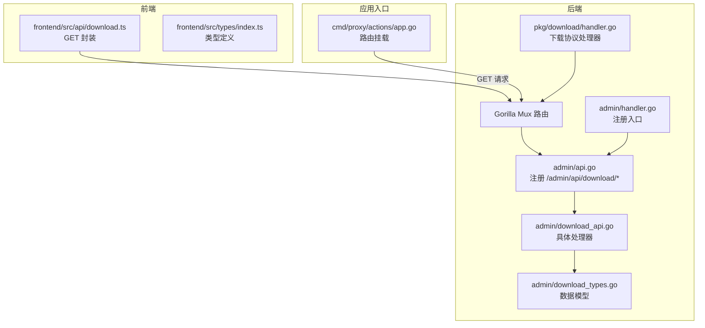
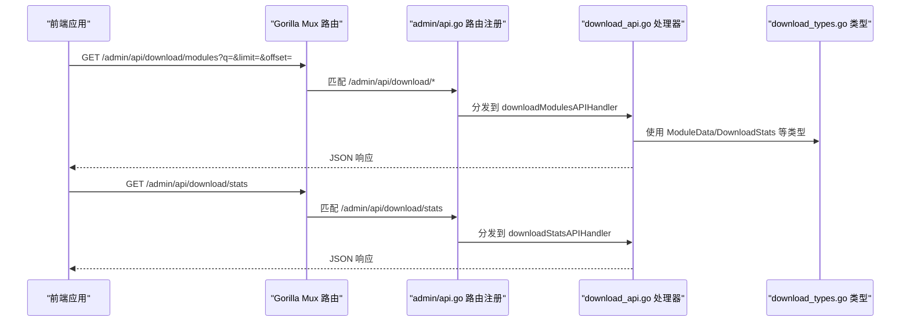
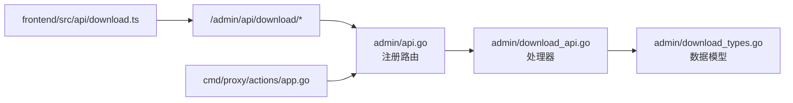

# 下载管理 API

<cite>
**本文引用的文件**
- [pkg/admin/api.go](file://pkg/admin/api.go)
- [pkg/admin/download_api.go](file://pkg/admin/download_api.go)
- [pkg/admin/download_types.go](file://pkg/admin/download_types.go)
- [pkg/admin/handler.go](file://pkg/admin/handler.go)
- [frontend/src/api/download.ts](file://frontend/src/api/download.ts)
- [frontend/src/types/index.ts](file://frontend/src/types/index.ts)
- [pkg/download/handler.go](file://pkg/download/handler.go)
- [cmd/proxy/actions/app.go](file://cmd/proxy/actions/app.go)
</cite>

## 目录
1. [简介](#简介)
2. [项目结构](#项目结构)
3. [核心组件](#核心组件)
4. [架构概览](#架构概览)
5. [详细组件分析](#详细组件分析)
6. [依赖关系分析](#依赖关系分析)
7. [性能考虑](#性能考虑)
8. [故障排除指南](#故障排除指南)
9. [结论](#结论)

## 简介
本文件为 Athens 项目的下载管理 API 综合文档，覆盖与模块下载相关的全部后端接口与前端集成方式。内容包括：
- 模块列表：/admin/api/download/modules
- 版本列表：/admin/api/download/modules/{path}/versions
- 模块详情：/admin/api/download/modules/{path}
- 下载统计：/admin/api/download/stats
- 热门模块：/admin/api/download/popular
- 最近下载：/admin/api/download/recent

文档详细说明每个端点的请求参数、响应格式与数据结构，并解释下载统计的计算逻辑、热门模块的排序算法以及性能优化建议。

## 项目结构
下载管理 API 位于后端 admin 包中，通过 Gorilla Mux 路由注册到 /admin/api/download 前缀下；前端通过统一的 GET 接口封装进行调用。

图表来源
- [pkg/admin/api.go](file://pkg/admin/api.go#L15-L48)
- [pkg/admin/download_api.go](file://pkg/admin/download_api.go#L101-L421)
- [pkg/admin/download_types.go](file://pkg/admin/download_types.go#L5-L29)
- [pkg/admin/handler.go](file://pkg/admin/handler.go#L13-L19)
- [frontend/src/api/download.ts](file://frontend/src/api/download.ts#L1-L38)
- [frontend/src/types/index.ts](file://frontend/src/types/index.ts#L67-L107)
- [pkg/download/handler.go](file://pkg/download/handler.go#L39-L57)
- [cmd/proxy/actions/app.go](file://cmd/proxy/actions/app.go#L46-L131)

章节来源
- [pkg/admin/api.go](file://pkg/admin/api.go#L15-L48)
- [pkg/admin/handler.go](file://pkg/admin/handler.go#L13-L19)
- [frontend/src/api/download.ts](file://frontend/src/api/download.ts#L1-L38)
- [frontend/src/types/index.ts](file://frontend/src/types/index.ts#L67-L107)
- [pkg/download/handler.go](file://pkg/download/handler.go#L39-L57)
- [cmd/proxy/actions/app.go](file://cmd/proxy/actions/app.go#L46-L131)

## 核心组件
- 路由注册：在 admin 包中集中注册 /admin/api/download 前缀下的所有下载相关路由。
- 处理器：提供模块列表、详情、版本列表、统计、热门模块、最近下载等接口的具体实现。
- 数据模型：定义模块数据、统计结果、最近访问记录等结构体。
- 前端封装：统一的 GET 方法封装，便于调用各下载接口并自动解析响应类型。

章节来源
- [pkg/admin/api.go](file://pkg/admin/api.go#L15-L48)
- [pkg/admin/download_api.go](file://pkg/admin/download_api.go#L101-L421)
- [pkg/admin/download_types.go](file://pkg/admin/download_types.go#L5-L29)
- [frontend/src/api/download.ts](file://frontend/src/api/download.ts#L1-L38)

## 架构概览
下载管理 API 的调用链路如下：
- 前端通过 GET 请求访问 /admin/api/download/*。
- 路由在 admin/api.go 中注册，匹配到对应处理器。
- 处理器读取查询参数或路径参数，执行业务逻辑（如过滤、分页、排序）。
- 返回 JSON 响应，前端按类型定义解析。

图表来源
- [pkg/admin/api.go](file://pkg/admin/api.go#L15-L48)
- [pkg/admin/download_api.go](file://pkg/admin/download_api.go#L101-L421)
- [pkg/admin/download_types.go](file://pkg/admin/download_types.go#L5-L29)

## 详细组件分析

### 模块列表 /admin/api/download/modules
- 功能：返回模块列表，支持关键词搜索、分页（limit/offset）。
- 请求参数
  - q：可选，关键词过滤模块路径
  - limit：可选，每页数量，默认 20
  - offset：可选，偏移量，默认 0
- 响应字段
  - modules：模块数组，元素为模块数据
  - total：过滤后的总数量
  - limit：当前分页限制
  - offset：当前偏移
- 数据结构
  - 模块数据：路径、版本、大小、下载次数、最后访问时间、描述
- 实现要点
  - 先按关键词过滤，再应用分页
  - 分页边界处理：当 offset 超出范围时，修正为末尾
  - 错误处理：编码失败返回 500

章节来源
- [pkg/admin/download_api.go](file://pkg/admin/download_api.go#L101-L169)
- [pkg/admin/download_types.go](file://pkg/admin/download_types.go#L5-L13)
- [frontend/src/api/download.ts](file://frontend/src/api/download.ts#L4-L13)
- [frontend/src/types/index.ts](file://frontend/src/types/index.ts#L77-L82)

### 模块详情 /admin/api/download/modules/{path}
- 功能：返回指定模块的详情（取首个版本）及该模块版本总数。
- 请求参数
  - 路径参数：{path} 模块路径
- 响应字段
  - module：模块详情（取第一个版本）
  - versions：该模块版本数量
- 实现要点
  - 若无匹配模块，返回 404 和错误信息
  - 返回 JSON 结构包含 module 和 versions

章节来源
- [pkg/admin/download_api.go](file://pkg/admin/download_api.go#L171-L205)
- [frontend/src/api/download.ts](file://frontend/src/api/download.ts#L15-L18)
- [frontend/src/types/index.ts](file://frontend/src/types/index.ts#L84-L95)

### 版本列表 /admin/api/download/modules/{path}/versions
- 功能：返回指定模块的所有版本列表。
- 请求参数
  - 路径参数：{path} 模块路径
- 响应字段
  - 数组：每个元素为模块的一个版本（包含路径、版本、大小、下载次数、最后访问时间、描述）
- 实现要点
  - 若无匹配模块，返回 404 和错误信息
  - 返回完整版本数组

章节来源
- [pkg/admin/download_api.go](file://pkg/admin/download_api.go#L207-L235)
- [frontend/src/api/download.ts](file://frontend/src/api/download.ts#L20-L23)
- [frontend/src/types/index.ts](file://frontend/src/types/index.ts#L84-L95)

### 下载统计 /admin/api/download/stats
- 功能：返回下载统计信息，包括总下载量、模块总数、热门模块、下载趋势、最近下载模块。
- 请求参数：无
- 响应字段
  - totalDownloads：总下载量
  - totalModules：模块总数
  - popularModules：热门模块列表（路径、下载次数）
  - downloadTrends：过去 30 天的下载趋势（日期、数量）
  - recentModules：最近下载模块（路径、版本、访问时间）
- 计算逻辑
  - 总下载量：遍历所有模块的下载次数求和
  - 热门模块：按模块路径聚合下载次数，降序排序，限制数量
  - 下载趋势：生成过去 30 天的随机趋势数据
  - 最近下载：按最后访问时间降序排序，限制数量

章节来源
- [pkg/admin/download_api.go](file://pkg/admin/download_api.go#L237-L276)
- [pkg/admin/download_api.go](file://pkg/admin/download_api.go#L252-L276)
- [pkg/admin/download_api.go](file://pkg/admin/download_api.go#L304-L330)
- [pkg/admin/download_api.go](file://pkg/admin/download_api.go#L405-L421)
- [pkg/admin/download_api.go](file://pkg/admin/download_api.go#L370-L391)
- [frontend/src/api/download.ts](file://frontend/src/api/download.ts#L25-L28)
- [frontend/src/types/index.ts](file://frontend/src/types/index.ts#L97-L107)

### 热门模块 /admin/api/download/popular
- 功能：返回热门模块列表。
- 请求参数
  - limit：可选，限制返回数量，默认 10
- 响应字段
  - 数组：每个元素为 { path, downloads }
- 排序算法
  - 先按模块路径聚合下载次数
  - 使用冒泡排序按下载次数降序排列
  - 限制返回数量

章节来源
- [pkg/admin/download_api.go](file://pkg/admin/download_api.go#L278-L302)
- [pkg/admin/download_api.go](file://pkg/admin/download_api.go#L304-L330)
- [pkg/admin/download_api.go](file://pkg/admin/download_api.go#L332-L342)
- [frontend/src/api/download.ts](file://frontend/src/api/download.ts#L30-L33)
- [frontend/src/types/index.ts](file://frontend/src/types/index.ts#L1-L24)

### 最近下载 /admin/api/download/recent
- 功能：返回最近下载的模块列表。
- 请求参数
  - limit：可选，限制返回数量，默认 10
- 响应字段
  - 数组：每个元素为 { path, version, accessTime }
- 排序算法
  - 按访问时间降序排序（较新的在前）
  - 使用冒泡排序
  - 限制返回数量

章节来源
- [pkg/admin/download_api.go](file://pkg/admin/download_api.go#L344-L368)
- [pkg/admin/download_api.go](file://pkg/admin/download_api.go#L370-L391)
- [pkg/admin/download_api.go](file://pkg/admin/download_api.go#L393-L403)
- [frontend/src/api/download.ts](file://frontend/src/api/download.ts#L35-L38)
- [frontend/src/types/index.ts](file://frontend/src/types/index.ts#L1-L24)

### 数据模型
- 模块数据（ModuleData）
  - 字段：路径、版本、大小、下载次数、最后访问时间、描述
- 下载统计（DownloadStats）
  - 字段：总下载量、模块总数、热门模块、下载趋势、最近下载模块
- 最近访问模块（RecentModuleAccess）
  - 字段：路径、版本、访问时间

章节来源
- [pkg/admin/download_types.go](file://pkg/admin/download_types.go#L5-L29)

### 前端集成
- 统一 GET 封装：前端通过 /download/* 路径封装 GET 请求，自动解析响应类型
- 类型定义：前端 types/index.ts 定义了模块列表、模块详情、下载统计等类型

章节来源
- [frontend/src/api/download.ts](file://frontend/src/api/download.ts#L1-L38)
- [frontend/src/types/index.ts](file://frontend/src/types/index.ts#L67-L107)

## 依赖关系分析
- 路由注册依赖 Gorilla Mux，在 admin/api.go 中集中注册 /admin/api/download/*。
- 处理器依赖数据模型（download_types.go），并在 download_api.go 中实现业务逻辑。
- 前端通过封装的 GET 方法调用后端接口，类型安全地解析响应。
- 应用入口在 cmd/proxy/actions/app.go 中挂载路由，确保 /admin/api/download* 可被访问。

图表来源
- [frontend/src/api/download.ts](file://frontend/src/api/download.ts#L1-L38)
- [pkg/admin/api.go](file://pkg/admin/api.go#L15-L48)
- [pkg/admin/download_api.go](file://pkg/admin/download_api.go#L101-L421)
- [pkg/admin/download_types.go](file://pkg/admin/download_types.go#L5-L29)
- [cmd/proxy/actions/app.go](file://cmd/proxy/actions/app.go#L46-L131)

章节来源
- [pkg/admin/api.go](file://pkg/admin/api.go#L15-L48)
- [pkg/admin/download_api.go](file://pkg/admin/download_api.go#L101-L421)
- [pkg/admin/download_types.go](file://pkg/admin/download_types.go#L5-L29)
- [frontend/src/api/download.ts](file://frontend/src/api/download.ts#L1-L38)
- [cmd/proxy/actions/app.go](file://cmd/proxy/actions/app.go#L46-L131)

## 性能考虑
- 当前实现为内存中的模拟数据，适合演示与本地开发；生产环境需替换为真实存储与索引。
- 热门模块与最近下载采用冒泡排序，时间复杂度 O(n^2)，在数据量较大时建议：
  - 使用更高效的排序算法（如快速排序/归并排序）
  - 引入外部缓存（如 Redis）以减少重复计算
  - 对热门模块与趋势数据进行定期预计算与缓存
- 分页与过滤：
  - 在大数据集上，建议将过滤与分页操作下沉到数据库层，避免全表扫描
  - 对常用查询建立索引（如模块路径、最后访问时间）

## 故障排除指南
- 404 未找到模块
  - 现象：模块详情或版本列表返回 404
  - 原因：路径参数不正确或模块不存在
  - 处理：确认路径参数与实际模块路径一致
- 编码失败导致 500
  - 现象：返回 500 错误
  - 原因：JSON 编码异常
  - 处理：检查响应构建与序列化逻辑
- 分页越界
  - 现象：offset 超出范围时行为异常
  - 处理：确保对 offset 边界进行修正，避免空结果或越界

章节来源
- [pkg/admin/download_api.go](file://pkg/admin/download_api.go#L188-L192)
- [pkg/admin/download_api.go](file://pkg/admin/download_api.go#L231-L234)
- [pkg/admin/download_api.go](file://pkg/admin/download_api.go#L142-L154)

## 结论
下载管理 API 提供了模块列表、详情、版本、统计、热门与最近下载等完整能力，配合前端类型安全封装，能够满足日常的模块下载与统计需求。当前实现基于内存模拟数据，建议在生产环境中接入持久化存储与高效索引，并对排序与缓存策略进行优化，以提升性能与可维护性。