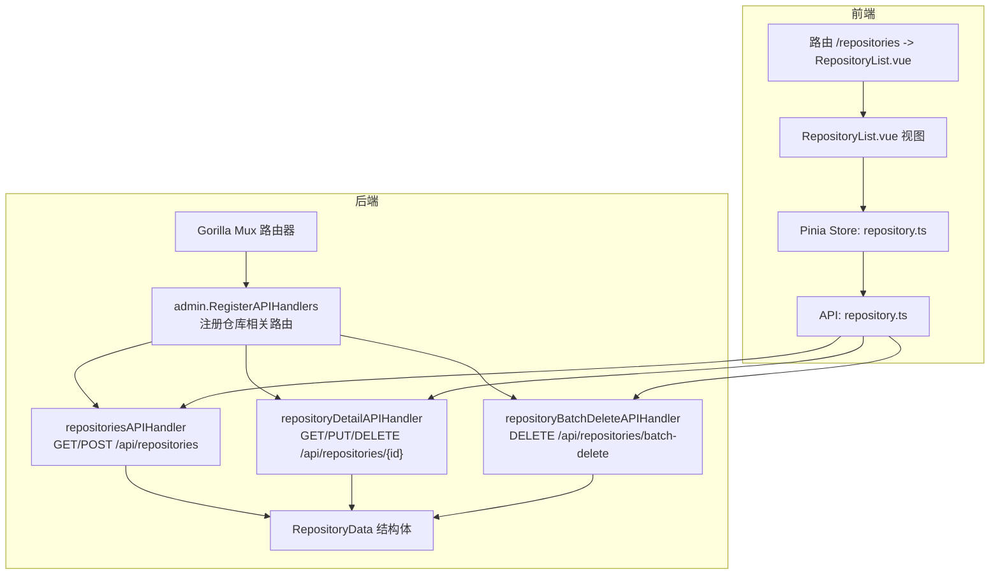
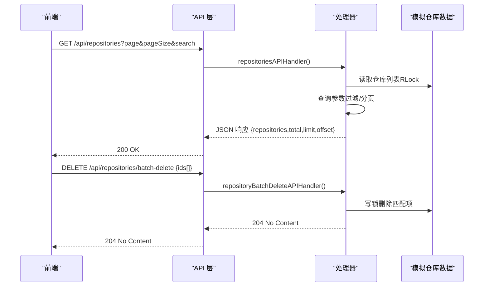
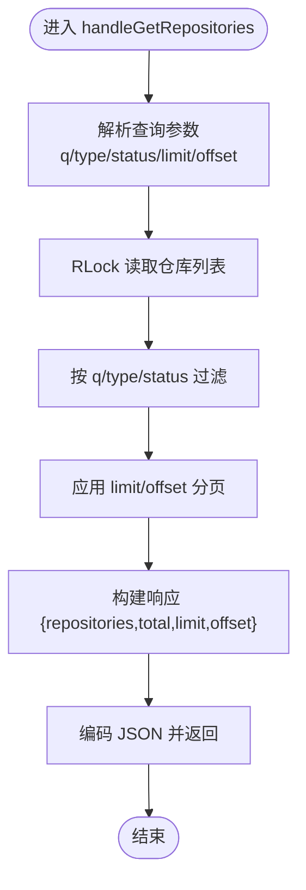
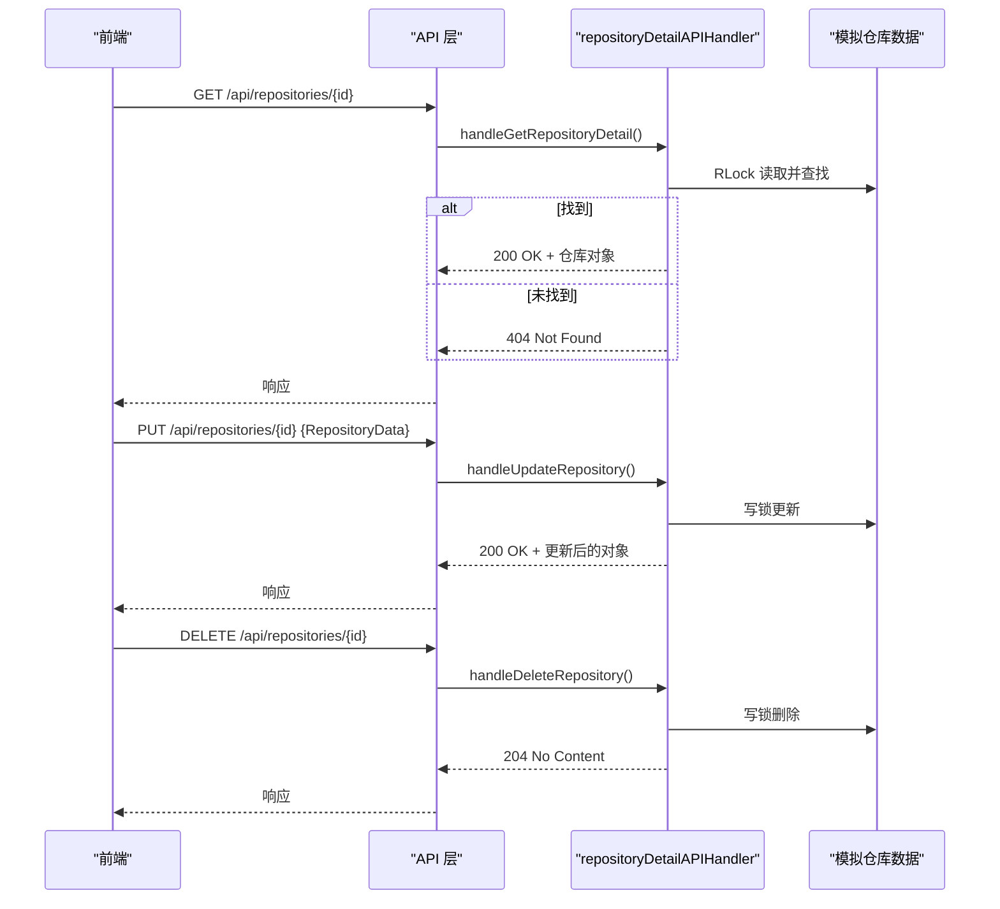
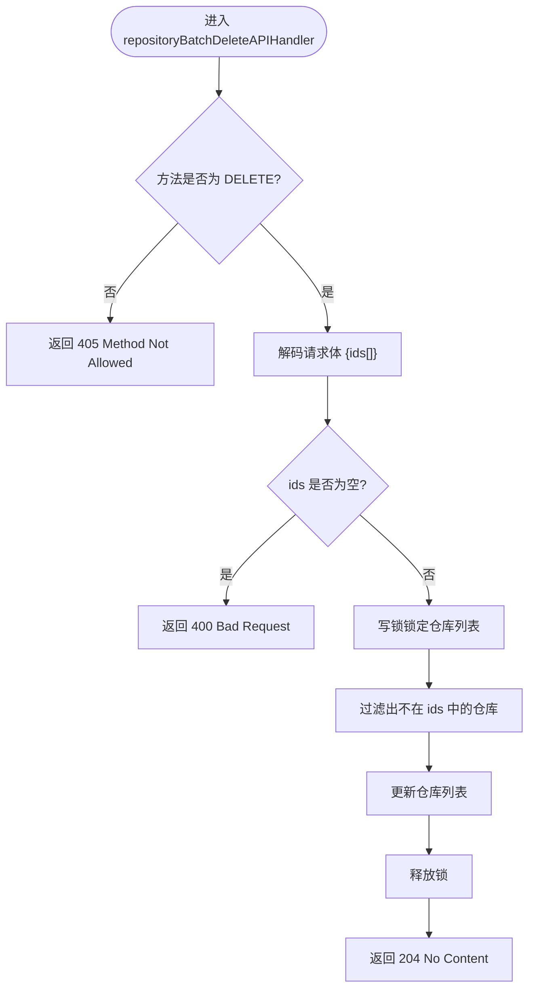
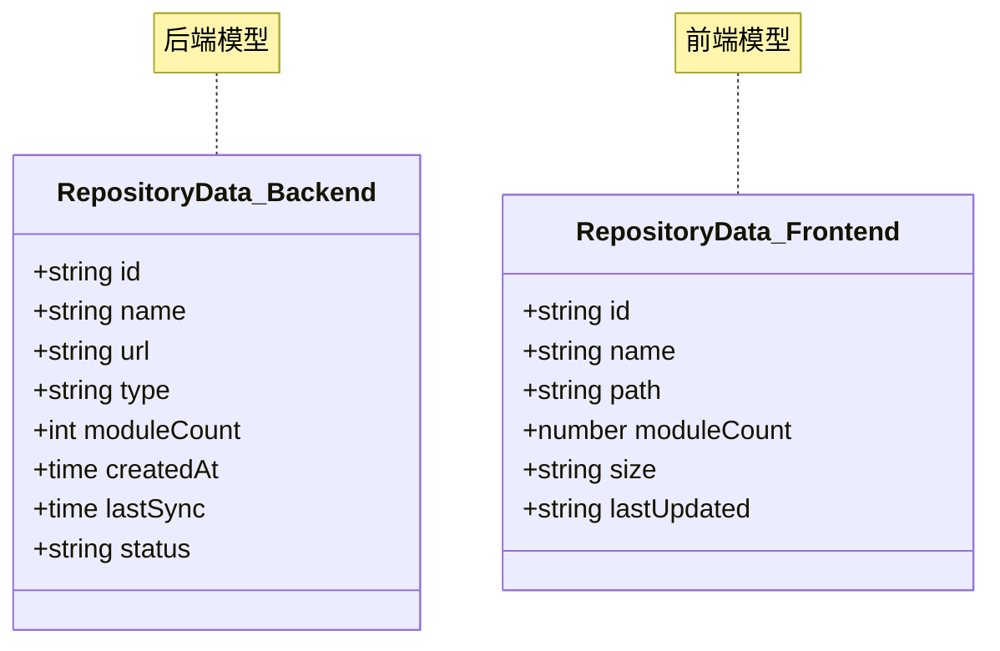
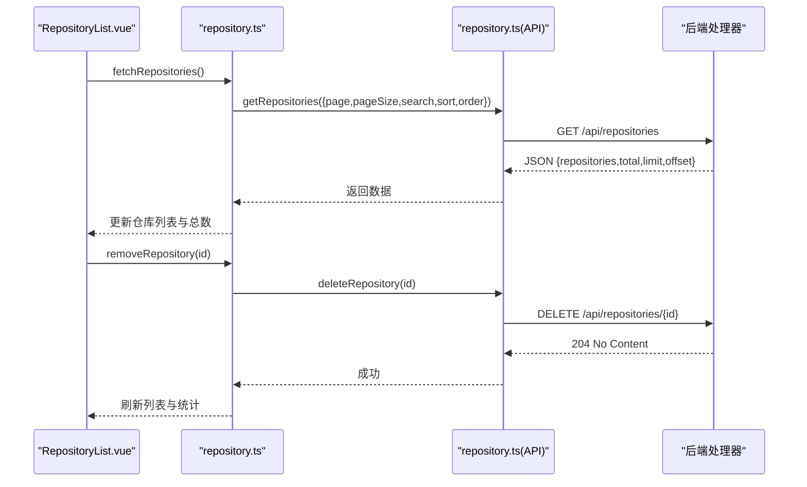
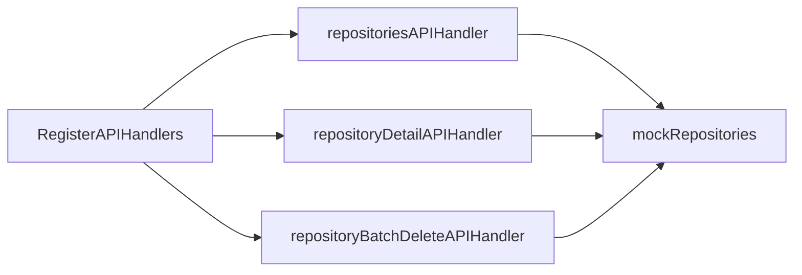

# 仓库管理 API

<cite>
**本文引用的文件**
- [repository_api.go](file://pkg/admin/repository_api.go)
- [repository_types.go](file://pkg/admin/repository_types.go)
- [api.go](file://pkg/admin/api.go)
- [repository.ts](file://frontend/src/api/repository.ts)
- [repository.ts（store）](file://frontend/src/stores/repository.ts)
- [RepositoryList.vue](file://frontend/src/views/repositories/RepositoryList.vue)
- [index.ts（types）](file://frontend/src/types/index.ts)
- [index.ts（router）](file://frontend/src/router/index.ts)
- [backend.go](file://pkg/storage/backend.go)
</cite>

## 目录
1. [简介](#简介)
2. [项目结构](#项目结构)
3. [核心组件](#核心组件)
4. [架构总览](#架构总览)
5. [详细组件分析](#详细组件分析)
6. [依赖关系分析](#依赖关系分析)
7. [性能考量](#性能考量)
8. [故障排查指南](#故障排查指南)
9. [结论](#结论)
10. [附录](#附录)

## 简介
本文件面向仓库管理 API 的使用者与维护者，系统性梳理 /api/repositories（仓库列表）、/api/repositories/batch-delete（批量删除）、/api/repositories/{id}（仓库详情）等端点的完整规范，涵盖：
- 请求与响应格式
- 字段定义与约束
- 操作流程（新增、编辑、删除、批量删除）
- 错误处理机制
- 权限验证与安全建议
- 仓库连接测试与最佳实践
- 前后端交互与状态管理

注意：当前实现采用内存模拟数据，仓库类型与状态枚举在服务端定义；前端类型与接口定义与后端保持一致，便于后续对接真实存储后端。

## 项目结构
仓库管理 API 位于后端 admin 包中，并通过 Gorilla Mux 注册路由；前端通过 Pinia Store 管理仓库列表与状态，Element Plus 组件展示数据与交互。

图表来源
- [api.go](file://pkg/admin/api.go#L15-L48)
- [repository_api.go](file://pkg/admin/repository_api.go#L104-L120)
- [repository_api.go](file://pkg/admin/repository_api.go#L243-L266)
- [repository_api.go](file://pkg/admin/repository_api.go#L378-L430)
- [repository_types.go](file://pkg/admin/repository_types.go#L5-L15)
- [index.ts（router）](file://frontend/src/router/index.ts#L28-L33)
- [repository.ts（store）](file://frontend/src/stores/repository.ts#L1-L109)
- [repository.ts](file://frontend/src/api/repository.ts#L1-L33)
- [RepositoryList.vue](file://frontend/src/views/repositories/RepositoryList.vue#L1-L281)

章节来源
- [api.go](file://pkg/admin/api.go#L15-L48)
- [repository_api.go](file://pkg/admin/repository_api.go#L104-L120)
- [repository_api.go](file://pkg/admin/repository_api.go#L243-L266)
- [repository_api.go](file://pkg/admin/repository_api.go#L378-L430)
- [repository_types.go](file://pkg/admin/repository_types.go#L5-L15)
- [index.ts（router）](file://frontend/src/router/index.ts#L28-L33)
- [repository.ts（store）](file://frontend/src/stores/repository.ts#L1-L109)
- [repository.ts](file://frontend/src/api/repository.ts#L1-L33)
- [RepositoryList.vue](file://frontend/src/views/repositories/RepositoryList.vue#L1-L281)

## 核心组件
- 路由注册：在 admin 包中集中注册仓库相关 API 路由。
- 处理器：
  - 仓库列表：GET /api/repositories
  - 仓库详情：GET/PUT/DELETE /api/repositories/{id}
  - 批量删除：DELETE /api/repositories/batch-delete
- 数据模型：RepositoryData（后端），RepositoryData（前端），二者字段需保持一致。
- 并发控制：全局互斥锁保护模拟仓库列表的读写。
- 类型与状态：仓库类型与状态枚举在服务端定义，前端类型定义与之对应。

章节来源
- [api.go](file://pkg/admin/api.go#L15-L48)
- [repository_api.go](file://pkg/admin/repository_api.go#L104-L120)
- [repository_api.go](file://pkg/admin/repository_api.go#L243-L266)
- [repository_api.go](file://pkg/admin/repository_api.go#L378-L430)
- [repository_types.go](file://pkg/admin/repository_types.go#L5-L15)

## 架构总览
后端采用 Gorilla Mux 路由，admin 包统一注册仓库 API；处理器内部进行参数解析、校验、过滤、分页与并发控制；前端通过 API 层调用后端，Store 管理状态与分页参数，视图负责渲染与用户交互。

图表来源
- [repository_api.go](file://pkg/admin/repository_api.go#L104-L120)
- [repository_api.go](file://pkg/admin/repository_api.go#L122-L205)
- [repository_api.go](file://pkg/admin/repository_api.go#L378-L430)

## 详细组件分析

### 1) 仓库列表 API（GET /api/repositories）
- 功能：获取仓库列表，支持查询、类型过滤、状态过滤、分页。
- 查询参数
  - q：按名称或 URL 模糊匹配
  - type：仓库类型过滤
  - status：仓库状态过滤
  - limit：每页数量，默认 20
  - offset：偏移量，默认 0
- 响应体
  - repositories：仓库数组（RepositoryData）
  - total：过滤后的总数
  - limit、offset：分页参数
- 并发与性能
  - 读取时使用 RLock，避免阻塞其他读请求
  - 过滤与分页在内存中完成，适合小规模模拟数据

图表来源
- [repository_api.go](file://pkg/admin/repository_api.go#L122-L205)

章节来源
- [repository_api.go](file://pkg/admin/repository_api.go#L104-L120)
- [repository_api.go](file://pkg/admin/repository_api.go#L122-L205)

### 2) 仓库详情 API（GET/PUT/DELETE /api/repositories/{id}）
- GET /api/repositories/{id}
  - 功能：获取单个仓库详情
  - 成功：200 OK + 仓库对象
  - 未找到：404 Not Found
- PUT /api/repositories/{id}
  - 功能：更新仓库信息
  - 请求体：RepositoryData（必填字段：name、url、type）
  - 成功：200 OK + 更新后的仓库对象
  - 参数错误：400 Bad Request
  - 未找到：404 Not Found
- DELETE /api/repositories/{id}
  - 功能：删除仓库
  - 成功：204 No Content
  - 未找到：404 Not Found

图表来源
- [repository_api.go](file://pkg/admin/repository_api.go#L243-L266)
- [repository_api.go](file://pkg/admin/repository_api.go#L268-L295)
- [repository_api.go](file://pkg/admin/repository_api.go#L297-L348)
- [repository_api.go](file://pkg/admin/repository_api.go#L350-L376)

章节来源
- [repository_api.go](file://pkg/admin/repository_api.go#L243-L266)
- [repository_api.go](file://pkg/admin/repository_api.go#L268-L295)
- [repository_api.go](file://pkg/admin/repository_api.go#L297-L348)
- [repository_api.go](file://pkg/admin/repository_api.go#L350-L376)

### 3) 批量删除 API（DELETE /api/repositories/batch-delete）
- 请求体：{ ids: string[] }
- 校验：ids 必须非空
- 处理：写锁下遍历仓库列表，移除 ID 在 ids 中的项
- 成功：204 No Content
- 错误：400 Bad Request（ids 为空）

图表来源
- [repository_api.go](file://pkg/admin/repository_api.go#L378-L430)

章节来源
- [repository_api.go](file://pkg/admin/repository_api.go#L378-L430)

### 4) 仓库数据模型（RepositoryData）
- 后端模型（RepositoryData）
  - 字段：id、name、url、type、moduleCount、createdAt、lastSync、status
  - 类型与状态枚举：type ∈ {"git","svn","mercurial","proxy"}；status ∈ {"active","syncing","error","inactive"}
- 前端模型（RepositoryData）
  - 字段：id、name、path、moduleCount、size、lastUpdated
  - 注意：前端类型与后端字段存在差异（如 path/lastUpdated），在实际对接真实后端时需统一

图表来源
- [repository_types.go](file://pkg/admin/repository_types.go#L5-L15)
- [index.ts（types）](file://frontend/src/types/index.ts#L26-L41)

章节来源
- [repository_types.go](file://pkg/admin/repository_types.go#L5-L15)
- [index.ts（types）](file://frontend/src/types/index.ts#L26-L41)

### 5) 前端交互与状态管理
- 路由：/repositories 对应 RepositoryList.vue
- Store（repository.ts）
  - 状态：仓库列表、总数、分页、搜索、排序、统计
  - 方法：fetchRepositories、fetchRepositoryStats、removeRepository、updatePagination、updateSearch、updateSort
- API（repository.ts）
  - 提供 getRepositories、getRepositoryDetail、deleteRepository、batchDeleteRepositories、getRepositoryStats
- 视图（RepositoryList.vue）
  - 展示统计卡片、仓库表格、分页与搜索
  - 支持刷新、排序、删除确认

图表来源
- [RepositoryList.vue](file://frontend/src/views/repositories/RepositoryList.vue#L142-L153)
- [repository.ts（store）](file://frontend/src/stores/repository.ts#L26-L45)
- [repository.ts（store）](file://frontend/src/stores/repository.ts#L56-L69)
- [repository.ts](file://frontend/src/api/repository.ts#L4-L28)
- [repository_api.go](file://pkg/admin/repository_api.go#L104-L120)
- [repository_api.go](file://pkg/admin/repository_api.go#L350-L376)

章节来源
- [index.ts（router）](file://frontend/src/router/index.ts#L28-L33)
- [RepositoryList.vue](file://frontend/src/views/repositories/RepositoryList.vue#L1-L281)
- [repository.ts（store）](file://frontend/src/stores/repository.ts#L1-L109)
- [repository.ts](file://frontend/src/api/repository.ts#L1-L33)

## 依赖关系分析
- 路由到处理器：admin.RegisterAPIHandlers 将 /api/repositories、/api/repositories/batch-delete、/api/repositories/{id} 绑定到对应处理器。
- 处理器到数据：处理器通过全局互斥锁访问模拟仓库列表，保证并发安全。
- 前端到后端：前端通过 API 层调用后端，Store 管理状态，视图负责渲染。

图表来源
- [api.go](file://pkg/admin/api.go#L15-L48)
- [repository_api.go](file://pkg/admin/repository_api.go#L23-L32)
- [repository_api.go](file://pkg/admin/repository_api.go#L146-L149)

章节来源
- [api.go](file://pkg/admin/api.go#L15-L48)
- [repository_api.go](file://pkg/admin/repository_api.go#L23-L32)
- [repository_api.go](file://pkg/admin/repository_api.go#L146-L149)

## 性能考量
- 当前实现为内存模拟数据，适合开发与演示；生产环境建议接入持久化存储（如数据库、对象存储）。
- 并发控制：读多写少场景下，使用 RWMutex 提升读性能；写操作加锁，避免竞态。
- 过滤与分页：在内存中执行，适合中小规模数据；大规模数据建议后端分页与索引优化。
- 前端分页：Store 维护分页参数，减少不必要的网络请求。

[本节为通用指导，不直接分析具体文件]

## 故障排查指南
- 400 Bad Request
  - 仓库新增/更新请求体解析失败或必填字段缺失
  - 批量删除请求体为空
- 404 Not Found
  - 仓库详情不存在
- 405 Method Not Allowed
  - 使用了不支持的 HTTP 方法
- 500 Internal Server Error
  - 编码响应失败或内部异常

建议排查步骤：
- 检查请求体格式与必填字段
- 校验仓库 ID 是否存在
- 确认路由与方法是否正确
- 查看后端日志定位异常

章节来源
- [repository_api.go](file://pkg/admin/repository_api.go#L208-L241)
- [repository_api.go](file://pkg/admin/repository_api.go#L297-L348)
- [repository_api.go](file://pkg/admin/repository_api.go#L350-L376)
- [repository_api.go](file://pkg/admin/repository_api.go#L378-L430)

## 结论
仓库管理 API 当前以模拟数据为核心，提供完整的 CRUD 与批量删除能力，并通过前端 Store 与视图实现良好的用户体验。后续可扩展为对接真实存储后端（如数据库、对象存储），并在以下方面持续改进：
- 统一前后端数据模型字段
- 引入权限验证与鉴权中间件
- 实现仓库连接测试与健康检查
- 增强错误处理与可观测性
- 优化大规模数据的分页与查询性能

[本节为总结性内容，不直接分析具体文件]

## 附录

### A. API 规范摘要
- 仓库列表
  - 方法：GET
  - 路径：/api/repositories
  - 查询参数：q、type、status、limit、offset
  - 响应：{ repositories[], total, limit, offset }
- 仓库详情
  - GET /api/repositories/{id}
  - PUT /api/repositories/{id}（请求体：RepositoryData）
  - DELETE /api/repositories/{id}
- 批量删除
  - 方法：DELETE
  - 路径：/api/repositories/batch-delete
  - 请求体：{ ids: string[] }

章节来源
- [repository_api.go](file://pkg/admin/repository_api.go#L104-L120)
- [repository_api.go](file://pkg/admin/repository_api.go#L243-L266)
- [repository_api.go](file://pkg/admin/repository_api.go#L378-L430)

### B. 字段定义与约束
- RepositoryData（后端）
  - id：唯一标识
  - name：仓库名称（必填）
  - url：仓库地址（必填）
  - type：仓库类型（必填，枚举："git"|"svn"|"mercurial"|"proxy"）
  - moduleCount：模块数量
  - createdAt：创建时间
  - lastSync：最后同步时间
  - status：状态（枚举："active"|"syncing"|"error"|"inactive"）
- RepositoryData（前端）
  - id、name、path、moduleCount、size、lastUpdated
  - 注意：字段差异需在对接真实后端时统一

章节来源
- [repository_types.go](file://pkg/admin/repository_types.go#L5-L15)
- [index.ts（types）](file://frontend/src/types/index.ts#L26-L41)

### C. 权限验证与安全建议
- 当前实现未包含鉴权逻辑；建议在网关或中间件层引入鉴权与授权策略（如基于角色的访问控制 RBAC）。
- 对外暴露的 API 应启用 HTTPS、CORS 策略与速率限制。
- 批量删除等高危操作建议二次确认与审计日志。

[本节为通用指导，不直接分析具体文件]

### D. 仓库连接测试与最佳实践
- 连接测试：在真实后端接入后，建议提供“连接测试”接口，验证仓库 URL、凭据与可达性。
- 最佳实践：
  - 严格校验输入参数与类型
  - 使用事务或幂等设计保障一致性
  - 对敏感字段（如密码）进行脱敏与加密存储
  - 定期清理无用仓库与过期数据

[本节为通用指导，不直接分析具体文件]

### E. 存储后端参考
- 存储后端接口抽象：Backend（Lister、Getter、Saver、Deleter）
- 常见存储实现：磁盘、S3、GCS、Azure Blob、MongoDB、Redis 等
- 建议：根据业务规模与合规要求选择合适存储方案，并在仓库管理 API 中抽象出统一的存储适配层

章节来源
- [backend.go](file://pkg/storage/backend.go#L3-L9)