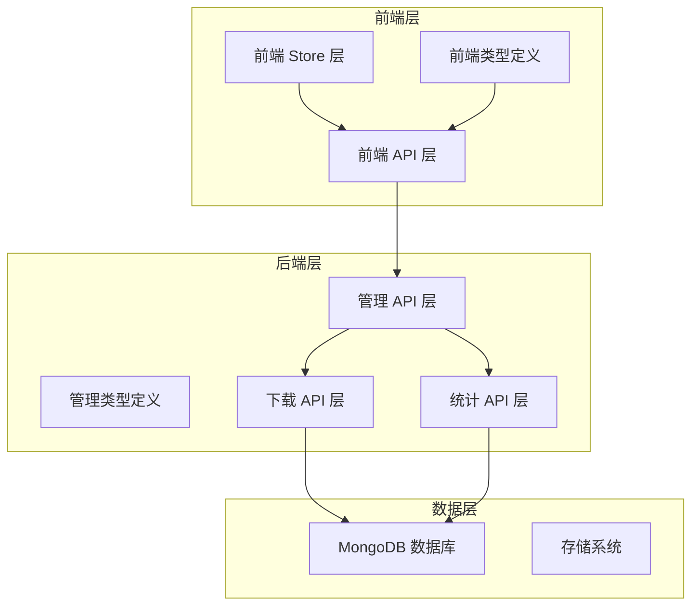
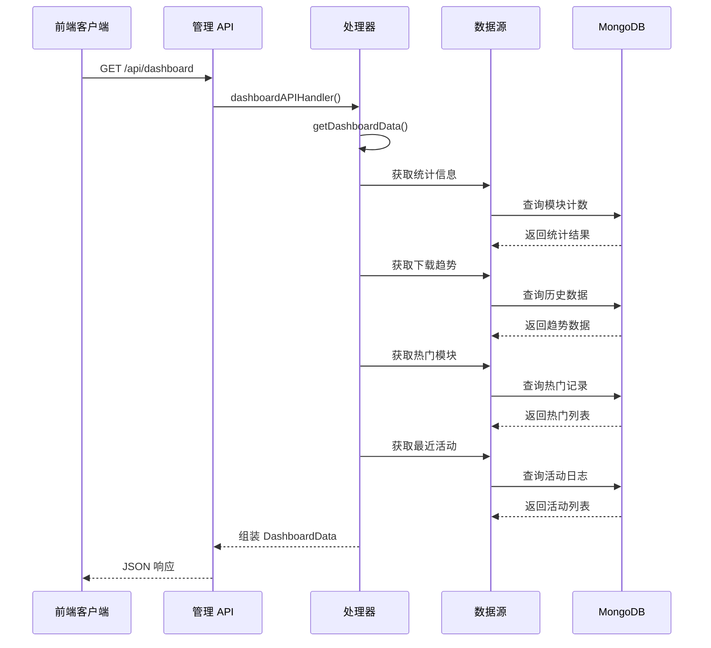
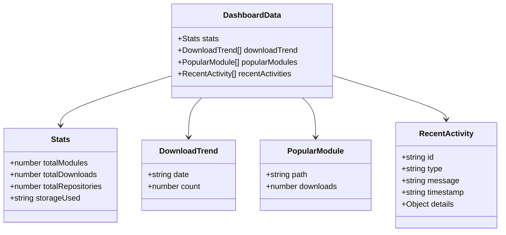
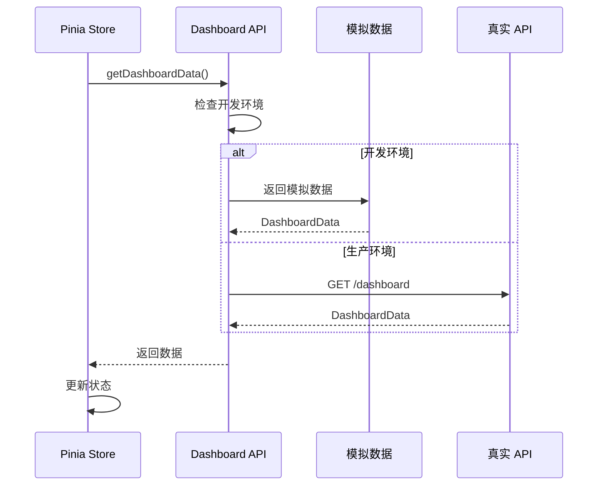
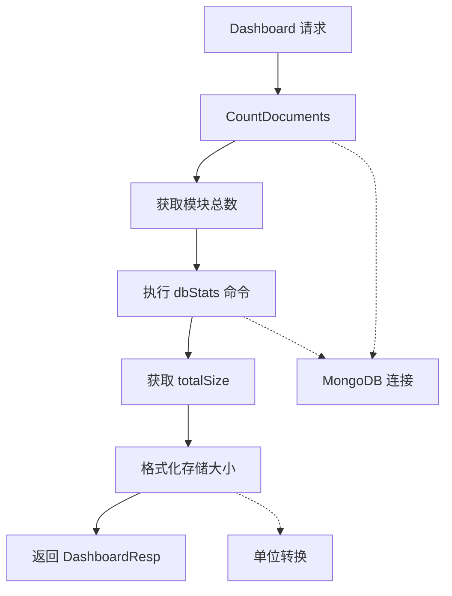
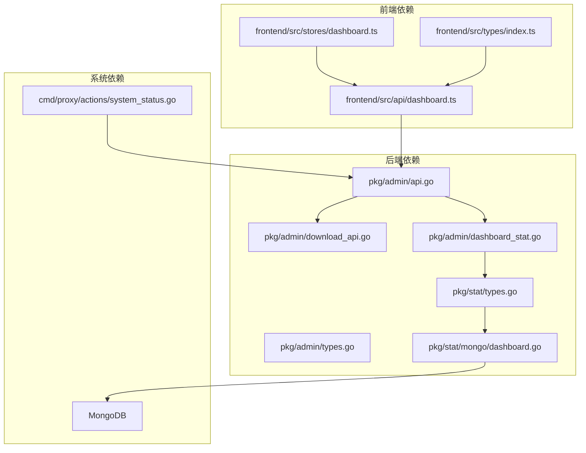

# 仪表盘数据 API

<cite>
**本文档引用的文件**
- [pkg/admin/api.go](file://pkg/admin/api.go)
- [pkg/admin/types.go](file://pkg/admin/types.go)
- [pkg/admin/download_api.go](file://pkg/admin/download_api.go)
- [pkg/admin/dashboard_stat.go](file://pkg/admin/dashboard_stat.go)
- [pkg/stat/types.go](file://pkg/stat/types.go)
- [pkg/stat/mongo/dashboard.go](file://pkg/stat/mongo/dashboard.go)
- [frontend/src/api/dashboard.ts](file://frontend/src/api/dashboard.ts)
- [frontend/src/stores/dashboard.ts](file://frontend/src/stores/dashboard.ts)
- [frontend/src/types/index.ts](file://frontend/src/types/index.ts)
- [cmd/proxy/actions/system_status.go](file://cmd/proxy/actions/system_status.go)
</cite>

## 目录
1. [简介](#简介)
2. [项目结构](#项目结构)
3. [核心组件](#核心组件)
4. [架构概览](#架构概览)
5. [详细组件分析](#详细组件分析)
6. [依赖关系分析](#依赖关系分析)
7. [性能考虑](#性能考虑)
8. [故障排除指南](#故障排除指南)
9. [结论](#结论)

## 简介

本文档详细记录了 Athens 项目的仪表盘数据 API，重点关注 `/api/dashboard` 端点的响应结构和数据模型。该 API 提供了系统关键指标的实时视图，包括统计信息、下载趋势、热门模块和最近活动等核心数据。

仪表盘 API 是 Athens 代理服务器的重要组成部分，为前端应用提供了全面的系统监控和数据分析能力。通过统一的 API 接口，管理员可以实时了解系统的运行状态、用户行为模式和资源使用情况。

## 项目结构

Athens 项目采用分层架构设计，仪表盘功能分布在多个层次中：



**图表来源**
- [pkg/admin/api.go](file://pkg/admin/api.go#L144-L157)
- [frontend/src/api/dashboard.ts](file://frontend/src/api/dashboard.ts#L47-L53)

**章节来源**
- [pkg/admin/api.go](file://pkg/admin/api.go#L1-L244)
- [frontend/src/api/dashboard.ts](file://frontend/src/api/dashboard.ts#L1-L71)

## 核心组件

### 仪表盘数据结构

仪表盘 API 返回的数据结构包含四个主要部分：

#### Stats（统计信息）
- `totalModules`: 系统中模块的总数
- `totalDownloads`: 系统累计下载次数
- `totalRepositories`: 管理的仓库数量
- `storageUsed`: 当前存储使用量（格式化字符串）

#### DownloadTrend（下载趋势）
- `date`: 日期字符串（YYYY-MM-DD 格式）
- `count`: 该日期的下载次数

#### PopularModules（热门模块）
- `path`: 模块的完整路径
- `downloads`: 该模块的下载次数

#### RecentActivities（最近活动）
- `id`: 活动唯一标识符
- `type`: 活动类型（download、upload、system）
- `message`: 活动描述消息
- `timestamp`: ISO 8601 格式的事件时间戳
- `details`: 可选的详细信息对象

**章节来源**
- [pkg/admin/types.go](file://pkg/admin/types.go#L4-L39)
- [frontend/src/types/index.ts](file://frontend/src/types/index.ts#L2-L24)

## 架构概览

仪表盘 API 的整体架构展示了从前端到后端再到数据存储的完整数据流：



**图表来源**
- [pkg/admin/api.go](file://pkg/admin/api.go#L144-L157)
- [pkg/admin/api.go](file://pkg/admin/api.go#L159-L195)

**章节来源**
- [pkg/admin/api.go](file://pkg/admin/api.go#L144-L195)

## 详细组件分析

### 后端 API 实现

#### 仪表盘处理器
仪表盘 API 的核心处理器负责协调各个数据源并组装最终的响应：

```mermaid
flowchart TD
Start([请求到达]) --> SetHeader[设置响应头]
SetHeader --> GetData[调用 getDashboardData()]
GetData --> Stats[获取统计信息]
Stats --> Trend[获取下载趋势]
Trend --> Popular[获取热门模块]
Popular --> Activities[获取最近活动]
Activities --> Encode[编码 JSON 响应]
Encode --> End([返回响应])
Stats -.-> MongoStats[查询 MongoDB 统计]
Trend -.-> MockTrend[生成模拟趋势数据]
Popular -.-> MockPopular[生成模拟热门数据]
Activities -.-> MockActivities[生成模拟活动数据]
```

**图表来源**
- [pkg/admin/api.go](file://pkg/admin/api.go#L144-L157)
- [pkg/admin/api.go](file://pkg/admin/api.go#L159-L195)

#### 数据获取策略
当前实现采用混合策略：真实数据与模拟数据相结合。真实的统计信息通过 MongoDB 查询获取，而其他数据集为了演示目的使用模拟数据生成。

**章节来源**
- [pkg/admin/api.go](file://pkg/admin/api.go#L144-L195)

### 前端集成实现

#### 类型定义
前端使用 TypeScript 定义了完整的数据结构，确保类型安全：



**图表来源**
- [frontend/src/types/index.ts](file://frontend/src/types/index.ts#L2-L24)

#### 数据获取流程
前端通过专门的 API 函数获取仪表盘数据，并在开发环境中使用模拟数据：



**图表来源**
- [frontend/src/api/dashboard.ts](file://frontend/src/api/dashboard.ts#L47-L53)
- [frontend/src/stores/dashboard.ts](file://frontend/src/stores/dashboard.ts#L32-L42)

**章节来源**
- [frontend/src/api/dashboard.ts](file://frontend/src/api/dashboard.ts#L1-L71)
- [frontend/src/stores/dashboard.ts](file://frontend/src/stores/dashboard.ts#L1-L85)

### 统计数据实现

#### MongoDB 集成
统计功能通过 MongoDB 集成实现，提供真实的系统指标：



**图表来源**
- [pkg/stat/mongo/dashboard.go](file://pkg/stat/mongo/dashboard.go#L13-L51)

#### 数据模型映射
统计响应结构与前端类型保持一致：

**章节来源**
- [pkg/stat/mongo/dashboard.go](file://pkg/stat/mongo/dashboard.go#L13-L51)
- [pkg/stat/types.go](file://pkg/stat/types.go#L19-L23)

## 依赖关系分析

### 组件依赖图



**图表来源**
- [pkg/admin/api.go](file://pkg/admin/api.go#L1-L244)
- [frontend/src/api/dashboard.ts](file://frontend/src/api/dashboard.ts#L1-L71)

### 数据流依赖

仪表盘数据的生成涉及多层依赖关系：

1. **前端层**：依赖后端 API 提供的数据格式
2. **后端层**：协调多个数据源并进行数据整合
3. **数据层**：通过 MongoDB 提供真实的统计信息
4. **系统层**：提供系统状态和资源使用信息

**章节来源**
- [pkg/admin/api.go](file://pkg/admin/api.go#L1-L244)
- [frontend/src/api/dashboard.ts](file://frontend/src/api/dashboard.ts#L1-L71)

## 性能考虑

### 缓存策略
当前实现中，热门模块和下载趋势数据使用模拟数据，这提供了良好的性能表现。对于真实的统计数据，建议考虑以下优化：

1. **查询优化**：对常用的聚合查询添加适当的索引
2. **分页处理**：对大量数据的查询实施分页机制
3. **缓存机制**：对不频繁变化的统计数据实施缓存

### 并发处理
仪表盘 API 应支持并发请求处理，避免阻塞其他操作：

1. **异步查询**：使用 goroutine 处理独立的数据查询
2. **连接池管理**：合理配置数据库连接池大小
3. **超时控制**：为长时间运行的查询设置合理的超时时间

## 故障排除指南

### 常见问题诊断

#### API 响应异常
- **症状**：前端无法获取仪表盘数据
- **排查步骤**：
  1. 检查后端服务是否正常运行
  2. 验证 MongoDB 连接状态
  3. 查看后端日志中的错误信息
  4. 确认 API 路由配置正确

#### 数据不一致
- **症状**：不同字段显示的统计数据不匹配
- **排查步骤**：
  1. 验证统计查询的准确性
  2. 检查数据更新的时间同步
  3. 确认数据格式转换的正确性

#### 前端显示问题
- **症状**：仪表盘界面显示异常或数据格式错误
- **排查步骤**：
  1. 验证 TypeScript 类型定义的完整性
  2. 检查 JSON 响应格式是否符合预期
  3. 确认前端状态管理的正确性

**章节来源**
- [frontend/src/stores/dashboard.ts](file://frontend/src/stores/dashboard.ts#L32-L65)

## 结论

Athens 仪表盘数据 API 提供了一个完整且灵活的系统监控解决方案。通过清晰的数据结构设计和模块化的架构实现，该 API 能够有效地展示系统的运行状态和关键指标。

当前实现采用了混合策略，在保证功能完整性的同时兼顾了开发效率。随着系统的演进，建议逐步替换模拟数据为真实的数据源，以提供更加准确和实时的系统监控信息。

前端集成方面，TypeScript 类型定义确保了类型安全，Pinia 状态管理提供了良好的用户体验。整体而言，该 API 设计合理，易于扩展和维护，为 Athens 项目的监控和管理功能奠定了坚实的基础。