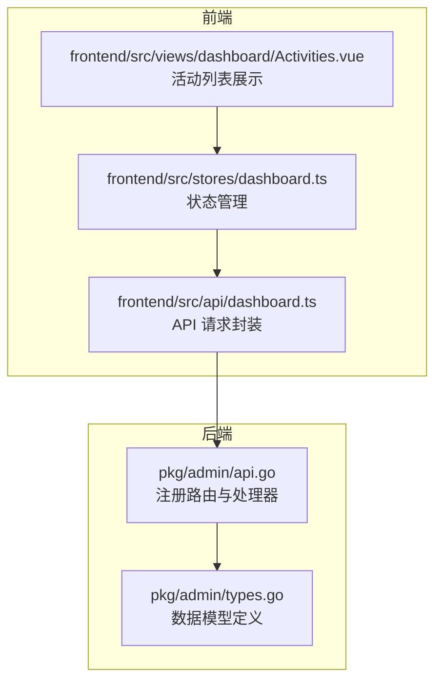
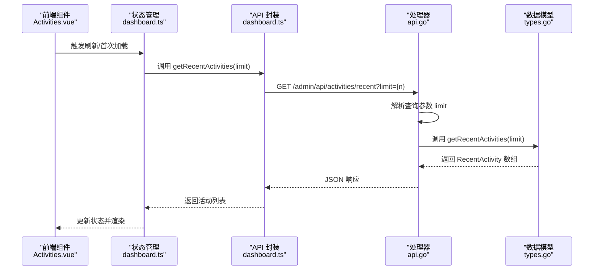
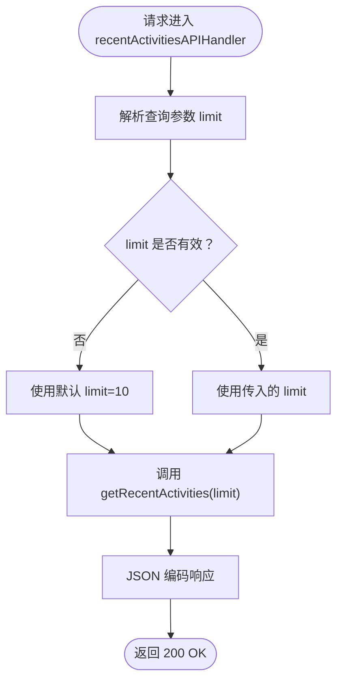
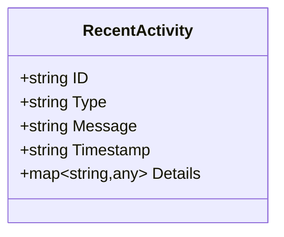
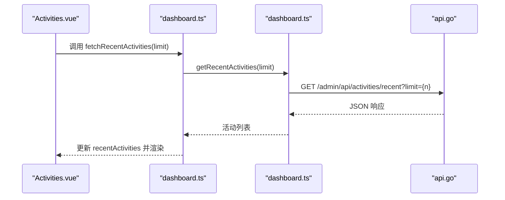
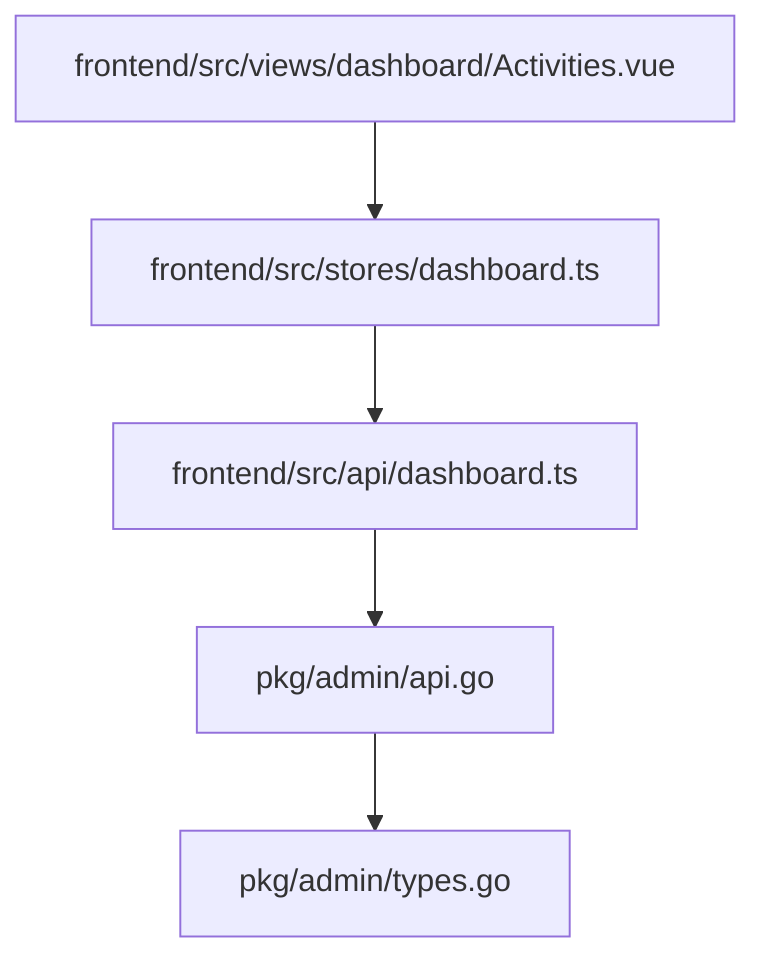

# 活动记录 API

<cite>
**本文档引用的文件**
- [pkg/admin/api.go](file://pkg/admin/api.go)
- [pkg/admin/types.go](file://pkg/admin/types.go)
- [frontend/src/api/dashboard.ts](file://frontend/src/api/dashboard.ts)
- [frontend/src/stores/dashboard.ts](file://frontend/src/stores/dashboard.ts)
- [frontend/src/views/dashboard/Activities.vue](file://frontend/src/views/dashboard/Activities.vue)
</cite>

## 目录
1. [简介](#简介)
2. [项目结构](#项目结构)
3. [核心组件](#核心组件)
4. [架构概览](#架构概览)
5. [详细组件分析](#详细组件分析)
6. [依赖关系分析](#依赖关系分析)
7. [性能考虑](#性能考虑)
8. [故障排除指南](#故障排除指南)
9. [结论](#结论)

## 简介
本文档详细说明了 Athens 项目中活动记录 API 的实现，特别是 `/api/activities/recent` 端点的功能。该端点用于获取系统的最近活动记录，支持通过查询参数 `limit` 控制返回的活动数量，默认值为 10 条。文档还详细解释了 `RecentActivity` 结构体的字段含义，并提供了分页和过滤的实现方案，以及活动记录的存储和查询优化建议。

## 项目结构
活动记录 API 的实现涉及后端 Go 代码和前端 Vue 前端应用两个部分：

- 后端：在 `pkg/admin/api.go` 中注册路由并实现处理器，在 `pkg/admin/types.go` 中定义数据模型。
- 前端：在 `frontend/src/api/dashboard.ts` 中封装 API 请求，在 `frontend/src/stores/dashboard.ts` 中管理状态，在 `frontend/src/views/dashboard/Activities.vue` 中展示活动列表。

**图表来源**
- [pkg/admin/api.go](file://pkg/admin/api.go#L15-L48)
- [pkg/admin/types.go](file://pkg/admin/types.go#L32-L39)
- [frontend/src/api/dashboard.ts](file://frontend/src/api/dashboard.ts#L64-L71)
- [frontend/src/stores/dashboard.ts](file://frontend/src/stores/dashboard.ts#L57-L65)
- [frontend/src/views/dashboard/Activities.vue](file://frontend/src/views/dashboard/Activities.vue#L1-L50)

**章节来源**
- [pkg/admin/api.go](file://pkg/admin/api.go#L15-L48)
- [pkg/admin/types.go](file://pkg/admin/types.go#L32-L39)
- [frontend/src/api/dashboard.ts](file://frontend/src/api/dashboard.ts#L64-L71)
- [frontend/src/stores/dashboard.ts](file://frontend/src/stores/dashboard.ts#L57-L65)
- [frontend/src/views/dashboard/Activities.vue](file://frontend/src/views/dashboard/Activities.vue#L1-L50)

## 核心组件
本节详细介绍活动记录 API 的核心组件，包括端点行为、查询参数处理、数据模型和前端集成。

- 端点路径与注册
  - 后端在 `pkg/admin/api.go` 中通过 `RegisterAPIHandlers` 函数注册 `/admin/api/activities/recent` 路由，并绑定 `recentActivitiesAPIHandler` 处理器。
  - 前端在 `frontend/src/api/dashboard.ts` 中通过 `getRecentActivities(limit)` 发起请求，向 `/activities/recent` 发送带 `limit` 查询参数的 GET 请求。

- 查询参数 `limit` 的使用方法与默认值
  - 默认值：当未提供 `limit` 参数或参数无效时，后端默认返回 10 条活动记录。
  - 参数解析：后端从 URL 查询字符串中提取 `limit`，尝试转换为整数；仅当转换成功且大于 0 时才生效。
  - 前端调用：前端默认以 `limit=10` 调用接口；用户可传入自定义值以控制返回数量。

- `RecentActivity` 结构体字段说明
  - ID：活动唯一标识符，字符串类型。
  - Type：活动类型，字符串，取值范围包括 `'download'`、`'upload'`、`'system'`。
  - Message：活动描述信息，字符串类型。
  - Timestamp：活动发生的时间戳，字符串类型（RFC3339 或类似格式）。
  - Details：可选的详细信息映射，用于扩展活动上下文。

- 数据流与响应格式
  - 后端处理器根据 `limit` 参数调用 `getRecentActivities(limit)` 获取活动列表，然后以 JSON 格式返回。
  - 前端接收数组形式的 `RecentActivity` 对象列表，并在视图中渲染时间线。

**章节来源**
- [pkg/admin/api.go](file://pkg/admin/api.go#L23-L24)
- [pkg/admin/api.go](file://pkg/admin/api.go#L197-L218)
- [pkg/admin/api.go](file://pkg/admin/api.go#L220-L244)
- [pkg/admin/types.go](file://pkg/admin/types.go#L32-L39)
- [frontend/src/api/dashboard.ts](file://frontend/src/api/dashboard.ts#L64-L71)

## 架构概览
下图展示了活动记录 API 的端到端流程，从前端发起请求到后端处理再到前端渲染。

**图表来源**
- [frontend/src/views/dashboard/Activities.vue](file://frontend/src/views/dashboard/Activities.vue#L70-L78)
- [frontend/src/stores/dashboard.ts](file://frontend/src/stores/dashboard.ts#L57-L65)
- [frontend/src/api/dashboard.ts](file://frontend/src/api/dashboard.ts#L64-L71)
- [pkg/admin/api.go](file://pkg/admin/api.go#L197-L218)
- [pkg/admin/types.go](file://pkg/admin/types.go#L32-L39)

## 详细组件分析

### 后端处理器与查询参数处理
- 路由注册：在 `RegisterAPIHandlers` 中注册 `/admin/api/activities/recent` 路由。
- 处理器逻辑：
  - 设置响应头为 `application/json; charset=utf-8`。
  - 从查询字符串中读取 `limit`，若为空或非正整数则忽略，保持默认值 10。
  - 调用 `getRecentActivities(limit)` 获取活动列表并编码为 JSON 返回。
- 当前实现：返回模拟数据，实际部署时应替换为从数据库或其他持久化存储中读取真实活动记录。

**图表来源**
- [pkg/admin/api.go](file://pkg/admin/api.go#L197-L218)
- [pkg/admin/api.go](file://pkg/admin/api.go#L220-L244)

**章节来源**
- [pkg/admin/api.go](file://pkg/admin/api.go#L197-L218)
- [pkg/admin/api.go](file://pkg/admin/api.go#L220-L244)

### 数据模型：RecentActivity 结构体
- 字段定义：
  - ID：字符串，唯一标识活动。
  - Type：字符串，活动类型，取值为 `'download'`、`'upload'`、`'system'`。
  - Message：字符串，人类可读的活动描述。
  - Timestamp：字符串，活动时间戳。
  - Details：可选映射，用于承载额外上下文信息。
- 前端类型定义：前端 `types/index.ts` 中对 `recentActivities` 的字段进行了类型约束，确保与后端一致。

**图表来源**
- [pkg/admin/types.go](file://pkg/admin/types.go#L32-L39)
- [frontend/src/types/index.ts](file://frontend/src/types/index.ts#L17-L24)

**章节来源**
- [pkg/admin/types.go](file://pkg/admin/types.go#L32-L39)
- [frontend/src/types/index.ts](file://frontend/src/types/index.ts#L17-L24)

### 前端集成：API 调用与状态管理
- API 封装：`frontend/src/api/dashboard.ts` 中的 `getRecentActivities(limit)` 方法负责发送请求并返回 Promise。
- 状态管理：`frontend/src/stores/dashboard.ts` 的 `fetchRecentActivities(limit)` 方法调用 API 并更新 `dashboardData.recentActivities`。
- 视图渲染：`frontend/src/views/dashboard/Activities.vue` 通过计算属性读取 `dashboardData.recentActivities`，并在模板中使用 Element Plus 的时间线组件进行展示。

**图表来源**
- [frontend/src/views/dashboard/Activities.vue](file://frontend/src/views/dashboard/Activities.vue#L67-L78)
- [frontend/src/stores/dashboard.ts](file://frontend/src/stores/dashboard.ts#L57-L65)
- [frontend/src/api/dashboard.ts](file://frontend/src/api/dashboard.ts#L64-L71)
- [pkg/admin/api.go](file://pkg/admin/api.go#L197-L218)

**章节来源**
- [frontend/src/views/dashboard/Activities.vue](file://frontend/src/views/dashboard/Activities.vue#L67-L78)
- [frontend/src/stores/dashboard.ts](file://frontend/src/stores/dashboard.ts#L57-L65)
- [frontend/src/api/dashboard.ts](file://frontend/src/api/dashboard.ts#L64-L71)

## 依赖关系分析
后端与前端之间的依赖关系如下：

**图表来源**
- [frontend/src/api/dashboard.ts](file://frontend/src/api/dashboard.ts#L64-L71)
- [frontend/src/stores/dashboard.ts](file://frontend/src/stores/dashboard.ts#L57-L65)
- [frontend/src/views/dashboard/Activities.vue](file://frontend/src/views/dashboard/Activities.vue#L67-L78)
- [pkg/admin/api.go](file://pkg/admin/api.go#L197-L218)
- [pkg/admin/types.go](file://pkg/admin/types.go#L32-L39)

**章节来源**
- [frontend/src/api/dashboard.ts](file://frontend/src/api/dashboard.ts#L64-L71)
- [frontend/src/stores/dashboard.ts](file://frontend/src/stores/dashboard.ts#L57-L65)
- [frontend/src/views/dashboard/Activities.vue](file://frontend/src/views/dashboard/Activities.vue#L67-L78)
- [pkg/admin/api.go](file://pkg/admin/api.go#L197-L218)
- [pkg/admin/types.go](file://pkg/admin/types.go#L32-L39)

## 性能考虑
- 查询参数校验与默认值
  - 后端已对 `limit` 进行有效性检查，避免无效输入导致异常。建议在生产环境保持此策略不变。
- 数据量控制
  - 当前实现返回固定数量的模拟数据。在真实场景中，应限制最大 `limit` 值以防止过大的响应体影响性能。
- 存储与查询优化
  - 建议将活动记录存储在具备索引的时间序列数据库或关系型数据库中，按时间降序存储并建立复合索引（如 `(timestamp, type)`），以便快速分页和过滤。
  - 对于高频访问，可在应用层引入缓存（如 Redis）存放最近 N 条活动，减少数据库压力。
- 分页与过滤实现方案
  - 分页：基于游标或偏移量的分页。推荐使用基于时间戳的游标分页，避免跳页问题。
  - 过滤：支持按类型（download/upload/system）和时间段（since/until）过滤，结合数据库索引提升查询效率。
- 前端渲染优化
  - 使用虚拟滚动渲染大量活动项，减少 DOM 渲染开销。
  - 对时间戳进行本地格式化，避免重复网络请求。

[本节为通用性能建议，不直接分析具体文件，因此不提供章节来源]

## 故障排除指南
- 常见错误与排查
  - 400 错误：当 `limit` 为 0 或无法解析为整数时，后端会忽略该参数并使用默认值。若前端仍收到 400，请检查请求 URL 和查询参数拼接是否正确。
  - 500 错误：当 `getRecentActivities` 内部发生错误（例如数据库连接失败）时，后端会返回 500。请检查后端日志定位具体原因。
- 日志与监控
  - 建议在处理器中增加请求日志，记录 `limit` 参数、响应状态和耗时，便于问题追踪。
  - 对数据库查询添加慢查询日志，识别潜在的性能瓶颈。
- 前端调试
  - 在浏览器开发者工具中查看网络面板，确认请求 URL 是否包含正确的 `limit` 参数。
  - 检查前端控制台是否有类型不匹配或渲染异常。

**章节来源**
- [pkg/admin/api.go](file://pkg/admin/api.go#L197-L218)

## 结论
活动记录 API 提供了简洁而实用的接口，通过 `limit` 查询参数灵活控制返回的活动数量。后端采用清晰的路由与处理器分离设计，前端通过状态管理和视图渲染实现了良好的用户体验。建议在生产环境中完善数据持久化、索引与缓存策略，并引入分页与过滤能力，以满足更大规模的数据访问需求。