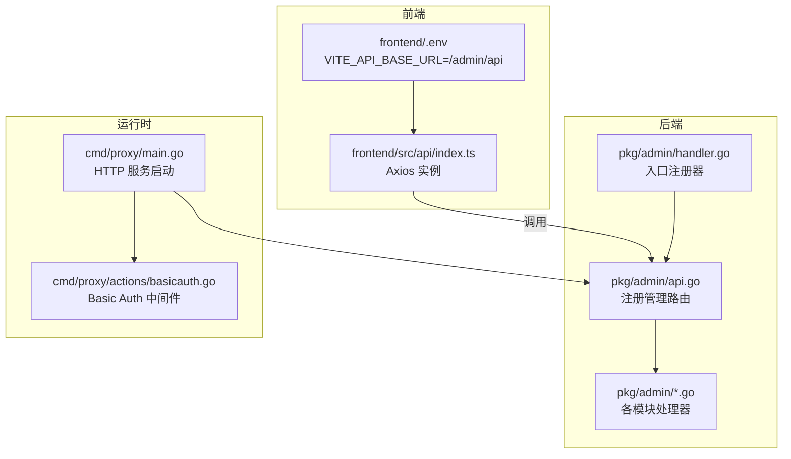
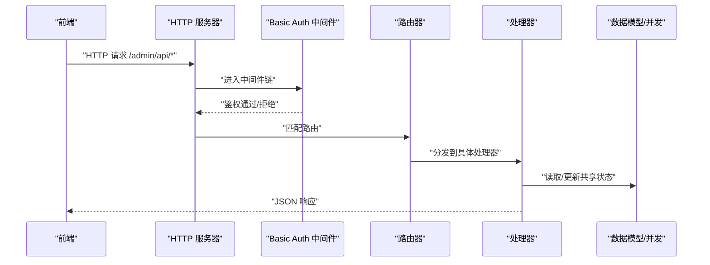
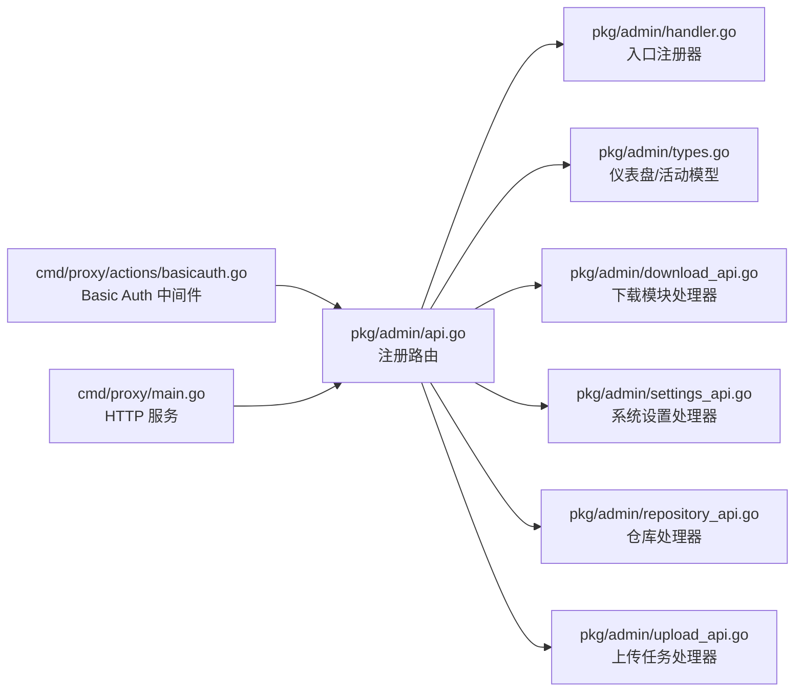

# 管理 API

<cite>
**本文档引用的文件**
- [pkg/admin/api.go](file://pkg/admin/api.go)
- [pkg/admin/handler.go](file://pkg/admin/handler.go)
- [pkg/admin/types.go](file://pkg/admin/types.go)
- [pkg/admin/download_api.go](file://pkg/admin/download_api.go)
- [pkg/admin/download_types.go](file://pkg/admin/download_types.go)
- [pkg/admin/settings_api.go](file://pkg/admin/settings_api.go)
- [pkg/admin/settings_types.go](file://pkg/admin/settings_types.go)
- [pkg/admin/repository_api.go](file://pkg/admin/repository_api.go)
- [pkg/admin/repository_types.go](file://pkg/admin/repository_types.go)
- [pkg/admin/upload_api.go](file://pkg/admin/upload_api.go)
- [pkg/admin/upload_types.go](file://pkg/admin/upload_types.go)
- [cmd/proxy/actions/basicauth.go](file://cmd/proxy/actions/basicauth.go)
- [frontend/src/api/index.ts](file://frontend/src/api/index.ts)
- [frontend/.env](file://frontend/.env)
- [cmd/proxy/main.go](file://cmd/proxy/main.go)
</cite>

## 目录
1. [简介](#简介)
2. [项目结构](#项目结构)
3. [核心组件](#核心组件)
4. [架构总览](#架构总览)
5. [详细组件分析](#详细组件分析)
6. [依赖关系分析](#依赖关系分析)
7. [性能与可扩展性](#性能与可扩展性)
8. [故障排查指南](#故障排查指南)
9. [结论](#结论)
10. [附录：API 定义与示例](#附录api-定义与示例)

## 简介
本文件面向 Athens 管理面板的后端 API，系统性梳理并说明所有管理相关的 REST 接口，覆盖系统状态查询、仪表盘聚合数据、最近活动、系统设置、模块下载统计与排行、仓库管理以及模块上传任务管理等能力。文档同时给出各接口的 HTTP 方法、URL 模式、请求参数、响应格式、错误码、认证与安全建议、速率限制策略、集成示例与最佳实践。

## 项目结构
管理 API 的后端实现集中在 pkg/admin 包中，通过 gorilla/mux 注册路由；前端通过 Vite 环境变量配置基础路径 /admin/api，统一调用管理端点。

**图表来源**
- [pkg/admin/api.go](file://pkg/admin/api.go#L15-L48)
- [pkg/admin/handler.go](file://pkg/admin/handler.go#L9-L19)
- [frontend/src/api/index.ts](file://frontend/src/api/index.ts#L4-L9)
- [frontend/.env](file://frontend/.env#L1-L1)
- [cmd/proxy/main.go](file://cmd/proxy/main.go#L64-L67)
- [cmd/proxy/actions/basicauth.go](file://cmd/proxy/actions/basicauth.go#L14-L27)

**章节来源**
- [pkg/admin/api.go](file://pkg/admin/api.go#L15-L48)
- [pkg/admin/handler.go](file://pkg/admin/handler.go#L9-L19)
- [frontend/src/api/index.ts](file://frontend/src/api/index.ts#L4-L9)
- [frontend/.env](file://frontend/.env#L1-L1)
- [cmd/proxy/main.go](file://cmd/proxy/main.go#L64-L67)

## 核心组件
- 路由注册器：负责将管理端点注册到路由器，前缀为 /admin。
- 数据模型：定义仪表盘、下载统计、仓库、上传任务等数据结构。
- 处理器：实现各端点的业务逻辑，含查询参数解析、分页、过滤、并发控制与错误处理。
- 前端适配：Axios 实例基于环境变量设置基础路径，便于统一调用。

**章节来源**
- [pkg/admin/api.go](file://pkg/admin/api.go#L15-L48)
- [pkg/admin/types.go](file://pkg/admin/types.go#L4-L39)
- [pkg/admin/download_types.go](file://pkg/admin/download_types.go#L5-L29)
- [pkg/admin/repository_types.go](file://pkg/admin/repository_types.go#L5-L15)
- [pkg/admin/upload_types.go](file://pkg/admin/upload_types.go#L5-L17)
- [frontend/src/api/index.ts](file://frontend/src/api/index.ts#L4-L9)

## 架构总览
管理 API 的调用链路如下：浏览器/前端 -> HTTP 服务器 -> Basic Auth 中间件 -> 路由器 -> 具体处理器 -> 数据模型/并发锁 -> 响应。

**图表来源**
- [cmd/proxy/main.go](file://cmd/proxy/main.go#L64-L67)
- [cmd/proxy/actions/basicauth.go](file://cmd/proxy/actions/basicauth.go#L14-L27)
- [pkg/admin/api.go](file://pkg/admin/api.go#L15-L48)
- [pkg/admin/handler.go](file://pkg/admin/handler.go#L13-L19)

## 详细组件分析

### 系统状态查询 /admin/api/system/status
- 方法与路径
  - GET /admin/api/system/status
- 功能
  - 返回系统健康状态、运行时长、版本信息、Go 版本、内存使用量等。
- 响应数据结构
  - 字段：status、uptime、version、goVersion、memoryUsage、cpuUsage
- 错误码
  - 500：编码响应失败
- 示例
  - 成功响应示例（字段示意）：{"status":"healthy","uptime":"2h 30m","version":"v1.x.y","goVersion":"go1.x.x","memoryUsage":"128.00 MB","cpuUsage":"N/A"}

**章节来源**
- [pkg/admin/api.go](file://pkg/admin/api.go#L17-L18)
- [pkg/admin/api.go](file://pkg/admin/api.go#L50-L63)
- [pkg/admin/api.go](file://pkg/admin/api.go#L68-L101)
- [pkg/admin/api.go](file://pkg/admin/api.go#L103-L142)

### 仪表盘数据 /admin/api/dashboard
- 方法与路径
  - GET /admin/api/dashboard
- 功能
  - 返回聚合统计、下载趋势、热门模块排行、最近活动等。
- 响应数据结构
  - stats.totalModules、stats.totalDownloads、stats.totalRepositories、stats.storageUsed
  - downloadTrend[].date、downloadTrend[].count
  - popularModules[].path、popularModules[].downloads
  - recentActivities[].id、type、message、timestamp、details
- 错误码
  - 500：编码响应失败
- 示例
  - 成功响应示例（字段示意）：见“附录：API 定义与示例”

**章节来源**
- [pkg/admin/api.go](file://pkg/admin/api.go#L20-L21)
- [pkg/admin/api.go](file://pkg/admin/api.go#L144-L157)
- [pkg/admin/api.go](file://pkg/admin/api.go#L159-L195)
- [pkg/admin/types.go](file://pkg/admin/types.go#L4-L39)

### 最近活动 /admin/api/activities/recent
- 方法与路径
  - GET /admin/api/activities/recent
- 查询参数
  - limit：限制返回条数，默认 10
- 功能
  - 返回按时间倒序的最近活动列表。
- 响应数据结构
  - 数组元素：id、type、message、timestamp、details
- 错误码
  - 500：编码响应失败
- 示例
  - 成功响应示例（字段示意）：见“附录：API 定义与示例”

**章节来源**
- [pkg/admin/api.go](file://pkg/admin/api.go#L23-L24)
- [pkg/admin/api.go](file://pkg/admin/api.go#L197-L218)
- [pkg/admin/api.go](file://pkg/admin/api.go#L220-L244)
- [pkg/admin/types.go](file://pkg/admin/types.go#L32-L39)

### 系统设置 /admin/api/settings
- 方法与路径
  - GET /admin/api/settings
  - PUT /admin/api/settings
- GET 行为
  - 返回当前系统设置。
- PUT 行为
  - 更新系统设置；请求体需满足字段校验。
- 请求体字段（SystemSettings）
  - storagePath、maxUploadSize、enablePrivateModules、enableDownloadLogging、proxyTimeout、cacheExpiration
- 校验规则
  - maxUploadSize、proxyTimeout、cacheExpiration 必须大于 0
- 并发控制
  - 读写使用互斥锁保护
- 错误码
  - 400：请求体无效或参数非法
  - 500：编码响应失败
- 示例
  - 成功响应示例（字段示意）：见“附录：API 定义与示例”

**章节来源**
- [pkg/admin/api.go](file://pkg/admin/api.go#L26-L27)
- [pkg/admin/settings_api.go](file://pkg/admin/settings_api.go#L29-L44)
- [pkg/admin/settings_api.go](file://pkg/admin/settings_api.go#L49-L60)
- [pkg/admin/settings_api.go](file://pkg/admin/settings_api.go#L65-L103)
- [pkg/admin/settings_types.go](file://pkg/admin/settings_types.go#L3-L11)

### 模块下载相关

#### 列表与搜索 /admin/api/download/modules
- 方法与路径
  - GET /admin/api/download/modules
- 查询参数
  - q：按模块路径模糊过滤
  - limit：分页限制，默认 20
  - offset：分页偏移，默认 0
- 响应数据结构
  - modules[]（每项为 ModuleData）、total、limit、offset
- 错误码
  - 500：编码响应失败

**章节来源**
- [pkg/admin/api.go](file://pkg/admin/api.go#L29-L30)
- [pkg/admin/download_api.go](file://pkg/admin/download_api.go#L101-L169)
- [pkg/admin/download_types.go](file://pkg/admin/download_types.go#L5-L13)

#### 版本列表 /admin/api/download/modules/{path}/versions
- 方法与路径
  - GET /admin/api/download/modules/{path}/versions
- 路径参数
  - path：模块路径
- 响应数据结构
  - 数组元素：ModuleData
- 错误码
  - 404：模块不存在
  - 500：编码响应失败

**章节来源**
- [pkg/admin/api.go](file://pkg/admin/api.go#L31-L32)
- [pkg/admin/download_api.go](file://pkg/admin/download_api.go#L207-L235)

#### 模块详情 /admin/api/download/modules/{path}
- 方法与路径
  - GET /admin/api/download/modules/{path}
- 响应数据结构
  - module：ModuleData
  - versions：该模块版本数量
- 错误码
  - 404：模块不存在
  - 500：编码响应失败

**章节来源**
- [pkg/admin/api.go](file://pkg/admin/api.go#L32-L33)
- [pkg/admin/download_api.go](file://pkg/admin/download_api.go#L171-L205)

#### 下载统计 /admin/api/download/stats
- 方法与路径
  - GET /admin/api/download/stats
- 响应数据结构
  - totalDownloads、totalModules、popularModules[]、downloadTrends[]、recentModules[]
- 错误码
  - 500：编码响应失败

**章节来源**
- [pkg/admin/api.go](file://pkg/admin/api.go#L33-L34)
- [pkg/admin/download_api.go](file://pkg/admin/download_api.go#L237-L250)
- [pkg/admin/download_api.go](file://pkg/admin/download_api.go#L252-L276)
- [pkg/admin/download_types.go](file://pkg/admin/download_types.go#L15-L22)

#### 热门模块排行 /admin/api/download/popular
- 方法与路径
  - GET /admin/api/download/popular
- 查询参数
  - limit：限制返回条数，默认 10
- 响应数据结构
  - 数组元素：PopularModule（path、downloads）
- 错误码
  - 500：编码响应失败

**章节来源**
- [pkg/admin/api.go](file://pkg/admin/api.go#L34-L35)
- [pkg/admin/download_api.go](file://pkg/admin/download_api.go#L278-L302)
- [pkg/admin/download_api.go](file://pkg/admin/download_api.go#L304-L330)
- [pkg/admin/download_types.go](file://pkg/admin/download_types.go#L15-L22)

#### 最近下载 /admin/api/download/recent
- 方法与路径
  - GET /admin/api/download/recent
- 查询参数
  - limit：限制返回条数，默认 10
- 响应数据结构
  - 数组元素：RecentModuleAccess（path、version、accessTime）
- 错误码
  - 500：编码响应失败

**章节来源**
- [pkg/admin/api.go](file://pkg/admin/api.go#L35-L36)
- [pkg/admin/download_api.go](file://pkg/admin/download_api.go#L344-L368)
- [pkg/admin/download_api.go](file://pkg/admin/download_api.go#L370-L403)
- [pkg/admin/download_types.go](file://pkg/admin/download_types.go#L24-L29)

### 仓库管理

#### 列表与搜索 /admin/api/repositories
- 方法与路径
  - GET /admin/api/repositories
  - POST /admin/api/repositories
- GET 查询参数
  - q：按名称或 URL 模糊过滤
  - type：按类型过滤
  - status：按状态过滤
  - limit/offset：分页
- POST 请求体
  - name、url、type（必填），其余字段自动生成
- 响应数据结构
  - repositories[]（RepositoryData）、total、limit、offset
- 错误码
  - 400：请求体无效或必填字段缺失
  - 500：编码响应失败
- 示例
  - POST 成功：201 Created，返回创建的仓库对象

**章节来源**
- [pkg/admin/api.go](file://pkg/admin/api.go#L37-L40)
- [pkg/admin/repository_api.go](file://pkg/admin/repository_api.go#L104-L120)
- [pkg/admin/repository_api.go](file://pkg/admin/repository_api.go#L122-L205)
- [pkg/admin/repository_api.go](file://pkg/admin/repository_api.go#L207-L241)
- [pkg/admin/repository_types.go](file://pkg/admin/repository_types.go#L5-L15)

#### 详情 /admin/api/repositories/{id}
- 方法与路径
  - GET /admin/api/repositories/{id}
  - PUT /admin/api/repositories/{id}
  - DELETE /admin/api/repositories/{id}
- 响应数据结构
  - GET：RepositoryData
  - PUT：更新后的 RepositoryData
  - DELETE：204 No Content
- 错误码
  - 404：仓库不存在
  - 400：请求体无效或必填字段缺失
  - 500：编码响应失败

**章节来源**
- [pkg/admin/api.go](file://pkg/admin/api.go#L40-L40)
- [pkg/admin/repository_api.go](file://pkg/admin/repository_api.go#L243-L266)
- [pkg/admin/repository_api.go](file://pkg/admin/repository_api.go#L268-L295)
- [pkg/admin/repository_api.go](file://pkg/admin/repository_api.go#L297-L348)
- [pkg/admin/repository_api.go](file://pkg/admin/repository_api.go#L350-L376)

#### 批量删除 /admin/api/repositories/batch-delete
- 方法与路径
  - DELETE /admin/api/repositories/batch-delete
- 请求体
  - ids[]：要删除的仓库 ID 列表
- 错误码
  - 400：请求体无效或 ID 列表为空
  - 500：编码响应失败

**章节来源**
- [pkg/admin/api.go](file://pkg/admin/api.go#L39-L39)
- [pkg/admin/repository_api.go](file://pkg/admin/repository_api.go#L378-L430)

### 模块上传任务

#### 创建上传任务（文件）/admin/api/upload/module
- 方法与路径
  - POST /admin/api/upload/module
- 请求体
  - modulePath、version（必填）
- 响应数据结构
  - UploadTask（含 progress=0、status=pending）
- 异步行为
  - 后台定时推进进度，最终完成或失败
- 错误码
  - 400：请求体无效或必填字段缺失
  - 500：编码响应失败

**章节来源**
- [pkg/admin/api.go](file://pkg/admin/api.go#L42-L43)
- [pkg/admin/upload_api.go](file://pkg/admin/upload_api.go#L139-L212)
- [pkg/admin/upload_types.go](file://pkg/admin/upload_types.go#L5-L17)

#### 从 URL 导入 /admin/api/upload/import-url
- 方法与路径
  - POST /admin/api/upload/import-url
- 请求体
  - modulePath、version、url（必填）
- 响应数据结构
  - UploadTask（status=pending）
- 错误码
  - 400：请求体无效或必填字段缺失
  - 500：编码响应失败

**章节来源**
- [pkg/admin/api.go](file://pkg/admin/api.go#L43-L44)
- [pkg/admin/upload_api.go](file://pkg/admin/upload_api.go#L214-L287)

#### 任务列表 /admin/api/upload/tasks
- 方法与路径
  - GET /admin/api/upload/tasks
- 查询参数
  - q：按模块路径或版本过滤
  - status：按状态过滤
  - limit/offset：分页
- 响应数据结构
  - tasks[]（UploadTask）、total、limit、offset
- 错误码
  - 500：编码响应失败

**章节来源**
- [pkg/admin/api.go](file://pkg/admin/api.go#L44-L45)
- [pkg/admin/upload_api.go](file://pkg/admin/upload_api.go#L289-L378)
- [pkg/admin/upload_types.go](file://pkg/admin/upload_types.go#L5-L17)

#### 任务详情 /admin/api/upload/tasks/{taskId}
- 方法与路径
  - GET /admin/api/upload/tasks/{taskId}
- 响应数据结构
  - UploadTask
- 错误码
  - 404：任务不存在
  - 500：编码响应失败

**章节来源**
- [pkg/admin/api.go](file://pkg/admin/api.go#L45-L45)
- [pkg/admin/upload_api.go](file://pkg/admin/upload_api.go#L392-L409)
- [pkg/admin/upload_api.go](file://pkg/admin/upload_api.go#L411-L438)

#### 取消任务 /admin/api/upload/tasks/{taskId}/cancel
- 方法与路径
  - POST /admin/api/upload/tasks/{taskId}/cancel
- 行为
  - 仅对 pending/processing 状态允许取消；完成后或失败的任务不可取消
- 响应数据结构
  - UploadTask（status=failed，附带取消错误信息）
- 错误码
  - 400：状态不允许取消
  - 404：任务不存在
  - 500：编码响应失败

**章节来源**
- [pkg/admin/api.go](file://pkg/admin/api.go#L46-L47)
- [pkg/admin/upload_api.go](file://pkg/admin/upload_api.go#L440-L491)

## 依赖关系分析

**图表来源**
- [pkg/admin/api.go](file://pkg/admin/api.go#L15-L48)
- [pkg/admin/handler.go](file://pkg/admin/handler.go#L13-L19)
- [pkg/admin/types.go](file://pkg/admin/types.go#L4-L39)
- [pkg/admin/download_api.go](file://pkg/admin/download_api.go#L101-L169)
- [pkg/admin/settings_api.go](file://pkg/admin/settings_api.go#L29-L44)
- [pkg/admin/repository_api.go](file://pkg/admin/repository_api.go#L104-L120)
- [pkg/admin/upload_api.go](file://pkg/admin/upload_api.go#L139-L212)
- [cmd/proxy/actions/basicauth.go](file://cmd/proxy/actions/basicauth.go#L14-L27)
- [cmd/proxy/main.go](file://cmd/proxy/main.go#L64-L67)

**章节来源**
- [pkg/admin/api.go](file://pkg/admin/api.go#L15-L48)
- [cmd/proxy/actions/basicauth.go](file://cmd/proxy/actions/basicauth.go#L14-L27)

## 性能与可扩展性
- 并发与锁
  - 系统设置、仓库、上传任务均使用互斥锁保护共享状态，避免竞态。
- 分页与过滤
  - 列表接口支持 limit/offset 与多维过滤，建议生产环境结合索引与数据库查询优化。
- 内存与 CPU
  - 系统状态接口包含内存使用统计，CPU 使用率字段为占位符，实际采集需扩展。
- 缓存与中间件
  - 可引入 Cache-Control 中间件对静态或低频读取端点设置缓存头，减少重复计算。
- 异步处理
  - 上传任务采用后台定时器推进进度，建议结合队列与持久化存储替换模拟数据。

[本节为通用建议，无需特定文件来源]

## 故障排查指南
- 常见错误码
  - 400：请求体格式错误、必填字段缺失、参数非法
  - 404：资源不存在（活动、模块、仓库、任务）
  - 405：方法不允许（如对不支持方法的端点请求）
  - 500：内部错误（序列化失败、中间件异常）
- 基础排错步骤
  - 确认请求方法与路径正确
  - 检查查询参数与请求体格式
  - 查看 Basic Auth 是否正确配置
  - 关注响应体中的错误消息字段
- 建议
  - 对外暴露的管理端点建议启用 Basic Auth 或更高阶鉴权
  - 对高频读取端点增加缓存策略
  - 对写操作增加幂等与重试机制

**章节来源**
- [pkg/admin/settings_api.go](file://pkg/admin/settings_api.go#L65-L103)
- [pkg/admin/repository_api.go](file://pkg/admin/repository_api.go#L207-L241)
- [pkg/admin/upload_api.go](file://pkg/admin/upload_api.go#L440-L491)
- [cmd/proxy/actions/basicauth.go](file://cmd/proxy/actions/basicauth.go#L14-L27)

## 结论
管理 API 提供了系统状态、仪表盘聚合、下载统计、仓库与上传任务管理等核心能力，接口设计清晰、参数与响应结构明确。建议在生产环境中完善鉴权、缓存与持久化策略，并结合监控与日志体系持续优化性能与稳定性。

[本节为总结，无需特定文件来源]

## 附录：API 定义与示例

### 认证与安全
- 认证方式
  - Basic Auth：对非 /healthz、/readyz 路径进行鉴权
- 安全建议
  - 管理端点仅在受控网络或反向代理后暴露
  - 使用 HTTPS/TLS
  - 限制 Basic Auth 用户权限范围

**章节来源**
- [cmd/proxy/actions/basicauth.go](file://cmd/proxy/actions/basicauth.go#L11-L27)

### 前端集成
- 基础路径
  - VITE_API_BASE_URL=/admin/api
- 请求封装
  - Axios 实例已设置 baseURL、超时与统一错误处理

**章节来源**
- [frontend/.env](file://frontend/.env#L1-L1)
- [frontend/src/api/index.ts](file://frontend/src/api/index.ts#L4-L9)

### 端点一览与示例

- 系统状态
  - GET /admin/api/system/status
  - 响应字段：status、uptime、version、goVersion、memoryUsage、cpuUsage
  - 示例响应（示意）：{"status":"healthy","uptime":"2h 30m","version":"v1.x.y","goVersion":"go1.x.x","memoryUsage":"128.00 MB","cpuUsage":"N/A"}

- 仪表盘
  - GET /admin/api/dashboard
  - 响应字段：stats、downloadTrend、popularModules、recentActivities
  - 示例响应（示意）：包含 totalModules、totalDownloads、totalRepositories、storageUsed、downloadTrend[]、popularModules[]、recentActivities[]

- 最近活动
  - GET /admin/api/activities/recent?limit=10
  - 响应字段：数组元素包含 id、type、message、timestamp、details

- 系统设置
  - GET /admin/api/settings
  - PUT /admin/api/settings（请求体：SystemSettings）
  - 响应字段：同请求体字段
  - 校验：maxUploadSize、proxyTimeout、cacheExpiration > 0

- 模块下载
  - GET /admin/api/download/modules?q=&limit=&offset=
  - GET /admin/api/download/modules/{path}/versions
  - GET /admin/api/download/modules/{path}
  - GET /admin/api/download/stats
  - GET /admin/api/download/popular?limit=
  - GET /admin/api/download/recent?limit=

- 仓库
  - GET /admin/api/repositories?q=&type=&status=&limit=&offset=
  - POST /admin/api/repositories
  - GET /admin/api/repositories/{id}
  - PUT /admin/api/repositories/{id}
  - DELETE /admin/api/repositories/{id}
  - DELETE /admin/api/repositories/batch-delete

- 上传任务
  - POST /admin/api/upload/module
  - POST /admin/api/upload/import-url
  - GET /admin/api/upload/tasks?q=&status=&limit=&offset=
  - GET /admin/api/upload/tasks/{taskId}
  - POST /admin/api/upload/tasks/{taskId}/cancel

**章节来源**
- [pkg/admin/api.go](file://pkg/admin/api.go#L15-L48)
- [pkg/admin/types.go](file://pkg/admin/types.go#L4-L39)
- [pkg/admin/download_types.go](file://pkg/admin/download_types.go#L5-L29)
- [pkg/admin/settings_types.go](file://pkg/admin/settings_types.go#L3-L11)
- [pkg/admin/repository_types.go](file://pkg/admin/repository_types.go#L5-L15)
- [pkg/admin/upload_types.go](file://pkg/admin/upload_types.go#L5-L17)