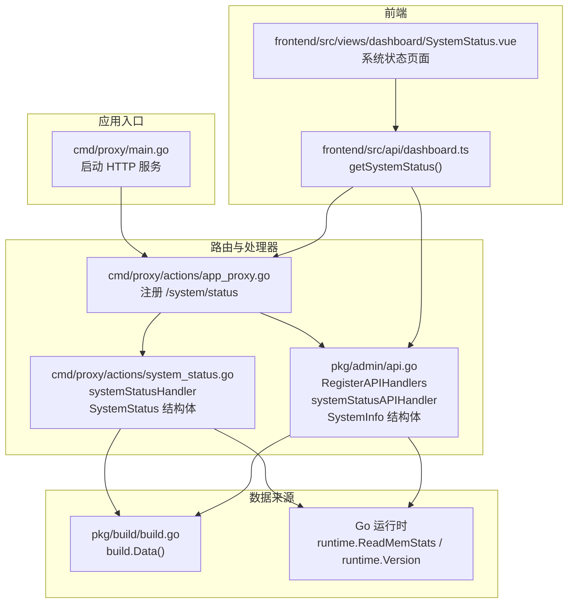
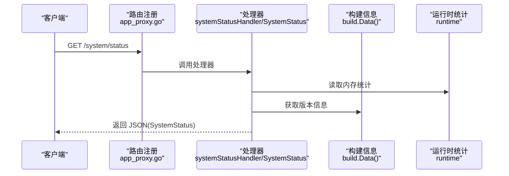
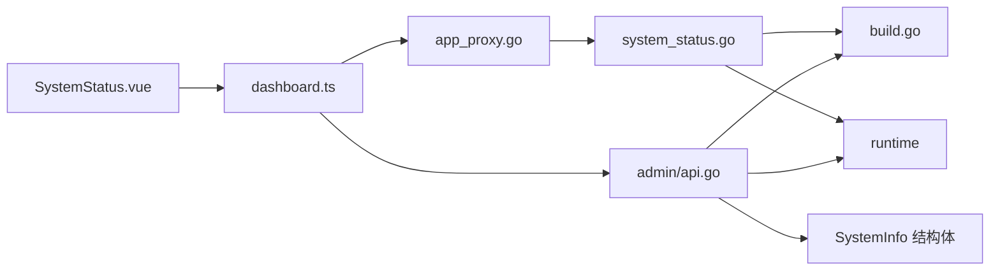

# 系统状态 API

<cite>
**本文档引用的文件**
- [cmd/proxy/actions/system_status.go](file://cmd/proxy/actions/system_status.go)
- [pkg/admin/api.go](file://pkg/admin/api.go)
- [cmd/proxy/actions/app_proxy.go](file://cmd/proxy/actions/app_proxy.go)
- [cmd/proxy/main.go](file://cmd/proxy/main.go)
- [pkg/build/build.go](file://pkg/build/build.go)
- [frontend/src/views/dashboard/SystemStatus.vue](file://frontend/src/views/dashboard/SystemStatus.vue)
- [frontend/src/api/dashboard.ts](file://frontend/src/api/dashboard.ts)
- [cmd/proxy/actions/health.go](file://cmd/proxy/actions/health.go)
- [cmd/proxy/actions/readiness.go](file://cmd/proxy/actions/readiness.go)
</cite>

## 目录
1. [简介](#简介)
2. [项目结构](#项目结构)
3. [核心组件](#核心组件)
4. [架构总览](#架构总览)
5. [详细组件分析](#详细组件分析)
6. [依赖关系分析](#依赖关系分析)
7. [性能考虑](#性能考虑)
8. [故障排除指南](#故障排除指南)
9. [结论](#结论)

## 简介
本文件面向系统状态 API 的使用者与维护者，提供 /api/system/status 端点的完整规范与实现解析。该端点用于返回当前 Athens 代理服务的运行状态信息，包括系统状态、运行时间、版本信息、Go 运行时版本、内存使用量以及 CPU 使用率占位符等关键指标。文档同时涵盖 SystemInfo 结构体各字段的语义说明、请求/响应示例、错误处理策略、健康检查最佳实践与常见问题排查方法。

## 项目结构
系统状态 API 的实现分布在多个层次：
- 路由注册层：在代理服务与管理后台两个入口分别注册 /system/status 与 /api/system/status 路由。
- 处理器层：提供独立的处理器函数与统一的 SystemInfo 结构体，分别服务于代理与管理后台。
- 数据采集层：通过运行时统计与构建信息获取系统状态数据。
- 前端展示层：仪表盘页面与 API 客户端封装，用于可视化与调用系统状态接口。

图表来源
- [cmd/proxy/main.go](file://cmd/proxy/main.go#L59-L127)
- [cmd/proxy/actions/app_proxy.go](file://cmd/proxy/actions/app_proxy.go#L30-L48)
- [cmd/proxy/actions/system_status.go](file://cmd/proxy/actions/system_status.go#L13-L64)
- [pkg/admin/api.go](file://pkg/admin/api.go#L15-L48)
- [pkg/build/build.go](file://pkg/build/build.go#L12-L38)
- [frontend/src/views/dashboard/SystemStatus.vue](file://frontend/src/views/dashboard/SystemStatus.vue#L77-L91)
- [frontend/src/api/dashboard.ts](file://frontend/src/api/dashboard.ts#L55-L62)

章节来源
- [cmd/proxy/main.go](file://cmd/proxy/main.go#L59-L127)
- [cmd/proxy/actions/app_proxy.go](file://cmd/proxy/actions/app_proxy.go#L30-L48)
- [cmd/proxy/actions/system_status.go](file://cmd/proxy/actions/system_status.go#L13-L64)
- [pkg/admin/api.go](file://pkg/admin/api.go#L15-L48)
- [pkg/build/build.go](file://pkg/build/build.go#L12-L38)
- [frontend/src/views/dashboard/SystemStatus.vue](file://frontend/src/views/dashboard/SystemStatus.vue#L77-L91)
- [frontend/src/api/dashboard.ts](file://frontend/src/api/dashboard.ts#L55-L62)

## 核心组件
- SystemStatus（代理侧）：定义了 status、uptime、version、goVersion、memoryUsage、cpuUsage 六个字段，用于描述代理实例的运行状态与资源使用概况。
- SystemInfo（管理后台侧）：与 SystemStatus 字段一致，提供统一的系统状态 JSON 输出。
- systemStatusHandler（代理侧）：处理 /system/status 请求，组装 SystemStatus 并返回 JSON。
- systemStatusAPIHandler（管理后台侧）：处理 /api/system/status 请求，组装 SystemInfo 并返回 JSON。
- 数据采集函数：formatUptime、formatMemory；运行时统计来自 runtime 包；版本信息来自 build.Data()。

章节来源
- [cmd/proxy/actions/system_status.go](file://cmd/proxy/actions/system_status.go#L13-L64)
- [pkg/admin/api.go](file://pkg/admin/api.go#L68-L101)

## 架构总览
系统状态 API 的调用链路分为两条：
- 代理侧：客户端访问 /system/status，由 actions 层处理器直接返回 SystemStatus。
- 管理后台侧：客户端访问 /api/system/status，由 admin 路由注册器注册，处理器返回 SystemInfo。

图表来源
- [cmd/proxy/actions/app_proxy.go](file://cmd/proxy/actions/app_proxy.go#L41-L42)
- [cmd/proxy/actions/system_status.go](file://cmd/proxy/actions/system_status.go#L26-L64)
- [pkg/build/build.go](file://pkg/build/build.go#L32-L38)

## 详细组件分析

### 端点规范
- 端点路径
  - 代理侧：/system/status
  - 管理后台侧：/api/system/status
- HTTP 方法：GET
- 请求参数：无
- 响应格式：JSON，包含以下字段：
  - status：字符串，系统状态（示例值："healthy"）
  - uptime：字符串，运行时长（示例格式："3d 12h 45m" 或 "12h 30m"）
  - version：字符串，构建版本号
  - goVersion：字符串，Go 运行时版本
  - memoryUsage：字符串，当前内存使用量（示例格式："1.23 GB"、"512.00 MB"、"256.00 KB"、"64.00 B"）
  - cpuUsage：字符串，CPU 使用率占位符（当前实现返回 "N/A"）

章节来源
- [cmd/proxy/actions/system_status.go](file://cmd/proxy/actions/system_status.go#L13-L21)
- [pkg/admin/api.go](file://pkg/admin/api.go#L68-L76)

### SystemInfo 结构体字段语义
- status：系统健康状态标识，当前固定返回 "healthy"
- uptime：自启动以来的累计运行时间，格式化为天/小时/分钟组合
- version：构建版本号，来源于构建信息
- goVersion：Go 运行时版本，来源于运行时
- memoryUsage：当前进程内存使用量，基于运行时统计进行单位换算与格式化
- cpuUsage：CPU 使用率占位符，当前实现返回 "N/A"

章节来源
- [cmd/proxy/actions/system_status.go](file://cmd/proxy/actions/system_status.go#L41-L64)
- [pkg/admin/api.go](file://pkg/admin/api.go#L78-L101)

### 数据采集与格式化
- 运行时间：自全局启动时间计算，格式化为人类可读字符串
- 内存使用：基于 runtime.MemStats.Alloc，按 B/KB/MB/GB 自动选择合适单位并保留两位小数
- 版本信息：通过 build.Data() 获取构建版本号
- Go 版本：通过 runtime.Version() 获取运行时版本

章节来源
- [cmd/proxy/actions/system_status.go](file://cmd/proxy/actions/system_status.go#L41-L105)
- [pkg/admin/api.go](file://pkg/admin/api.go#L78-L142)
- [pkg/build/build.go](file://pkg/build/build.go#L12-L38)

### 错误处理
- 编码失败：当 JSON 编码失败时，处理器返回 500 状态码
- 存储可用性检查：就绪探针会尝试访问存储后端，若失败则返回 500

章节来源
- [cmd/proxy/actions/system_status.go](file://cmd/proxy/actions/system_status.go#L34-L38)
- [pkg/admin/api.go](file://pkg/admin/api.go#L58-L62)
- [cmd/proxy/actions/readiness.go](file://cmd/proxy/actions/readiness.go#L9-L16)

### 请求/响应示例
- 请求
  - 方法：GET
  - 路径：/system/status 或 /api/system/status
  - 头部：Accept: application/json
- 成功响应（200 OK）
  - Content-Type: application/json; charset=utf-8
  - 示例字段值：
    - status: "healthy"
    - uptime: "3d 12h 45m"
    - version: "v0.x.y"
    - goVersion: "go1.x.y"
    - memoryUsage: "1.23 GB"
    - cpuUsage: "N/A"

章节来源
- [cmd/proxy/actions/system_status.go](file://cmd/proxy/actions/system_status.go#L26-L64)
- [pkg/admin/api.go](file://pkg/admin/api.go#L50-L101)

### 健康检查最佳实践
- Liveness 探针：建议使用 /healthz（返回 200），用于判断进程是否存活
- Readiness 探针：建议使用 /readyz（对存储后端进行可用性检查，失败返回 500），用于判断服务是否已准备好接收流量
- 系统状态 API：可用于监控面板或运维平台展示系统状态，但不作为探针使用

章节来源
- [cmd/proxy/actions/health.go](file://cmd/proxy/actions/health.go#L7-L10)
- [cmd/proxy/actions/readiness.go](file://cmd/proxy/actions/readiness.go#L9-L16)

### 前端集成
- 页面组件：SystemStatus.vue 展示系统状态卡片与刷新按钮
- API 封装：dashboard.ts 提供 getSystemStatus()，在开发模式下返回模拟数据，在生产模式下调用真实接口
- 调用时机：页面挂载时自动拉取一次系统状态

章节来源
- [frontend/src/views/dashboard/SystemStatus.vue](file://frontend/src/views/dashboard/SystemStatus.vue#L77-L91)
- [frontend/src/api/dashboard.ts](file://frontend/src/api/dashboard.ts#L55-L62)

## 依赖关系分析
- 路由注册
  - 代理侧：app_proxy.go 在根路由下注册 /system/status
  - 管理后台：admin/api.go 在 /api 前缀下注册 /api/system/status
- 处理器依赖
  - actions/system_status.go 依赖 build.Data() 与 runtime 统计
  - admin/api.go 同样依赖 build.Data() 与 runtime 统计
- 前端依赖
  - SystemStatus.vue 通过 dashboard.ts 的 getSystemStatus() 获取数据

图表来源
- [cmd/proxy/actions/app_proxy.go](file://cmd/proxy/actions/app_proxy.go#L41-L42)
- [cmd/proxy/actions/system_status.go](file://cmd/proxy/actions/system_status.go#L10-L11)
- [pkg/admin/api.go](file://pkg/admin/api.go#L11-L12)
- [frontend/src/views/dashboard/SystemStatus.vue](file://frontend/src/views/dashboard/SystemStatus.vue#L84-L86)
- [frontend/src/api/dashboard.ts](file://frontend/src/api/dashboard.ts#L55-L62)

## 性能考虑
- 系统状态 API 仅进行轻量级数据采集（内存统计与构建信息），开销极低，适合高频调用
- CPU 使用率当前为占位符，如需启用实时 CPU 监控，需引入额外的采样机制与缓存策略
- 建议在高并发场景下避免频繁轮询，可通过前端节流或后端缓存优化

## 故障排除指南
- 500 错误
  - 现象：响应状态码为 500
  - 可能原因：JSON 编码失败、存储后端不可用（就绪探针）
  - 处理建议：检查服务日志定位编码错误；确认存储配置正确且网络可达
- 404 错误
  - 现象：访问 /system/status 或 /api/system/status 返回 404
  - 可能原因：路径拼接错误、未正确注册路由
  - 处理建议：核对请求路径与服务端路由注册位置
- 前端无法显示
  - 现象：页面空白或加载态长时间存在
  - 可能原因：接口跨域、开发环境未配置代理、网络异常
  - 处理建议：检查浏览器控制台与网络面板；确认后端 CORS 配置与代理设置

章节来源
- [cmd/proxy/actions/system_status.go](file://cmd/proxy/actions/system_status.go#L34-L38)
- [pkg/admin/api.go](file://pkg/admin/api.go#L58-L62)
- [cmd/proxy/actions/readiness.go](file://cmd/proxy/actions/readiness.go#L9-L16)

## 结论
系统状态 API 提供了简洁、稳定的系统运行时信息输出，覆盖健康状态、运行时间、版本与内存使用等关键指标。通过代理侧与管理后台侧的双入口设计，满足不同场景下的访问需求。建议结合健康检查探针与前端监控面板，形成完善的可观测性体系。