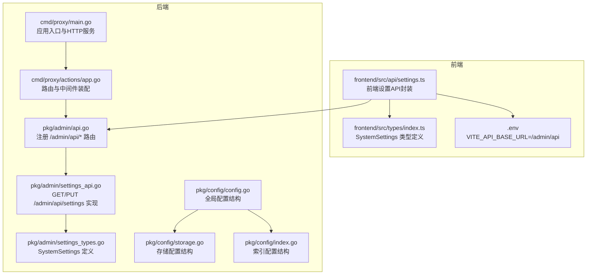
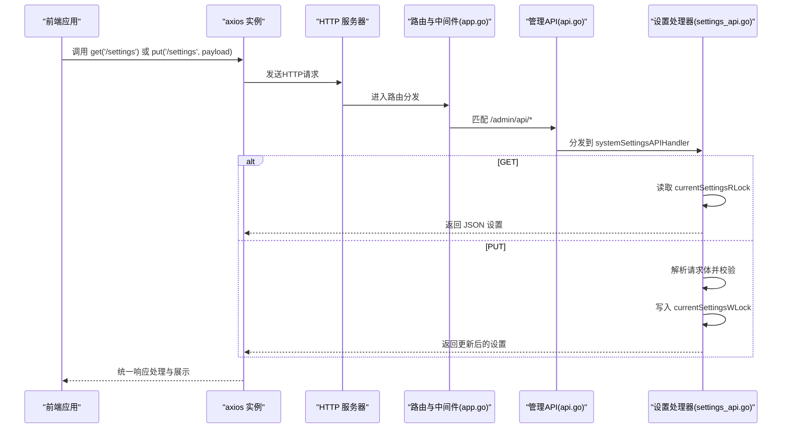
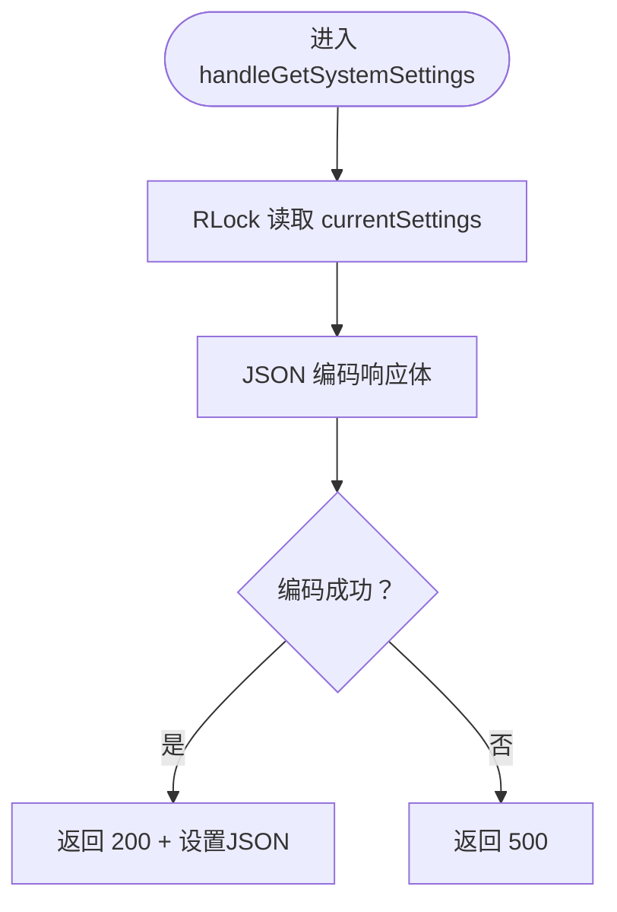
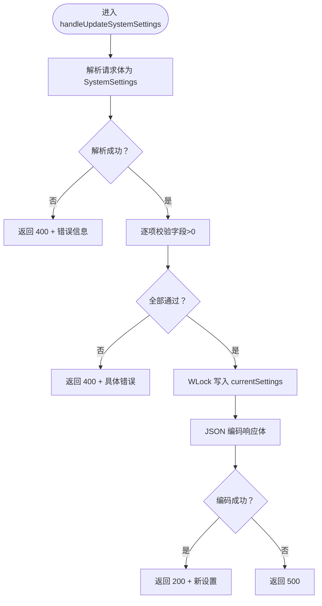
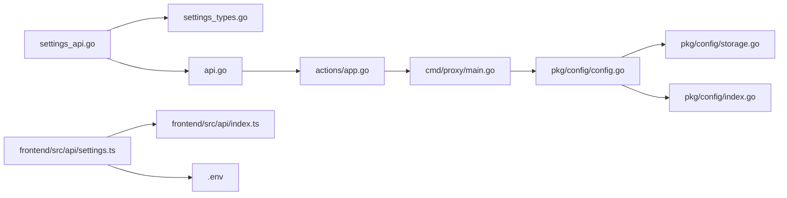

# 系统设置 API

<cite>
**本文档引用的文件**
- [pkg/admin/settings_types.go](file://pkg/admin/settings_types.go)
- [pkg/admin/settings_api.go](file://pkg/admin/settings_api.go)
- [pkg/admin/api.go](file://pkg/admin/api.go)
- [frontend/src/api/settings.ts](file://frontend/src/api/settings.ts)
- [frontend/src/api/index.ts](file://frontend/src/api/index.ts)
- [frontend/src/types/index.ts](file://frontend/src/types/index.ts)
- [cmd/proxy/actions/app.go](file://cmd/proxy/actions/app.go)
- [cmd/proxy/main.go](file://cmd/proxy/main.go)
- [pkg/config/config.go](file://pkg/config/config.go)
- [pkg/config/storage.go](file://pkg/config/storage.go)
- [pkg/config/index.go](file://pkg/config/index.go)
- [frontend/.env](file://frontend/.env)
</cite>

## 目录
1. [简介](#简介)
2. [项目结构](#项目结构)
3. [核心组件](#核心组件)
4. [架构总览](#架构总览)
5. [详细组件分析](#详细组件分析)
6. [依赖关系分析](#依赖关系分析)
7. [性能考虑](#性能考虑)
8. [故障排除指南](#故障排除指南)
9. [结论](#结论)

## 简介
本文件系统性地记录 Athens 项目中“系统设置”API 的设计与实现，覆盖 /admin/api/settings 端点的 CRUD 操作：获取当前设置、更新配置与验证设置。文档还详细说明 Settings 结构体的各项配置含义（如存储路径、上传大小限制、私有模块开关、下载日志开关、代理超时、缓存过期等），并给出验证规则、并发安全与热更新支持现状的说明。

## 项目结构
系统设置 API 属于管理后台模块的一部分，采用后端 Go 语言实现，前端通过 Vue + TypeScript 调用。整体结构如下：

**图表来源**
- [frontend/src/api/settings.ts](file://frontend/src/api/settings.ts#L1-L40)
- [frontend/src/types/index.ts](file://frontend/src/types/index.ts#L119-L127)
- [frontend/.env](file://frontend/.env#L1-L1)
- [cmd/proxy/main.go](file://cmd/proxy/main.go#L29-L128)
- [cmd/proxy/actions/app.go](file://cmd/proxy/actions/app.go#L23-L139)
- [pkg/admin/api.go](file://pkg/admin/api.go#L16-L48)
- [pkg/admin/settings_types.go](file://pkg/admin/settings_types.go#L4-L11)
- [pkg/admin/settings_api.go](file://pkg/admin/settings_api.go#L29-L103)
- [pkg/config/config.go](file://pkg/config/config.go#L22-L66)
- [pkg/config/storage.go](file://pkg/config/storage.go#L4-L12)
- [pkg/config/index.go](file://pkg/config/index.go#L4-L7)

**章节来源**
- [cmd/proxy/main.go](file://cmd/proxy/main.go#L29-L128)
- [cmd/proxy/actions/app.go](file://cmd/proxy/actions/app.go#L23-L139)
- [pkg/admin/api.go](file://pkg/admin/api.go#L16-L48)
- [pkg/admin/settings_types.go](file://pkg/admin/settings_types.go#L4-L11)
- [pkg/admin/settings_api.go](file://pkg/admin/settings_api.go#L29-L103)
- [frontend/src/api/settings.ts](file://frontend/src/api/settings.ts#L1-L40)
- [frontend/src/types/index.ts](file://frontend/src/types/index.ts#L119-L127)
- [frontend/.env](file://frontend/.env#L1-L1)

## 核心组件
- SystemSettings 结构体：定义系统可配置项，包括存储路径、最大上传大小、私有模块开关、下载日志开关、代理超时、缓存过期等。
- 后端处理器：提供 GET /admin/api/settings 获取当前设置；PUT /admin/api/settings 更新设置并进行基础校验。
- 并发控制：使用读写锁保护共享设置变量，确保多请求下的线程安全。
- 前端封装：基于 axios 的 get/put 方法，统一处理响应与错误提示，并通过环境变量配置基础 URL。

**章节来源**
- [pkg/admin/settings_types.go](file://pkg/admin/settings_types.go#L4-L11)
- [pkg/admin/settings_api.go](file://pkg/admin/settings_api.go#L9-L24)
- [pkg/admin/settings_api.go](file://pkg/admin/settings_api.go#L29-L103)
- [frontend/src/api/settings.ts](file://frontend/src/api/settings.ts#L18-L40)
- [frontend/src/api/index.ts](file://frontend/src/api/index.ts#L52-L69)

## 架构总览
系统设置 API 的调用链路如下：

**图表来源**
- [frontend/src/api/index.ts](file://frontend/src/api/index.ts#L52-L69)
- [frontend/src/api/settings.ts](file://frontend/src/api/settings.ts#L18-L40)
- [cmd/proxy/actions/app.go](file://cmd/proxy/actions/app.go#L46-L139)
- [pkg/admin/api.go](file://pkg/admin/api.go#L16-L48)
- [pkg/admin/settings_api.go](file://pkg/admin/settings_api.go#L29-L103)

## 详细组件分析

### SystemSettings 结构体与配置项说明
- storagePath：模块存储根目录路径（字符串）。用于标识模块文件存放位置。
- maxUploadSize：最大上传大小（整数，字节）。用于限制上传模块包大小。
- enablePrivateModules：是否允许私有模块（布尔）。控制对私有模块的访问策略。
- enableDownloadLogging：是否启用下载日志（布尔）。控制下载行为的日志记录。
- proxyTimeout：代理超时时间（整数，秒）。影响上游拉取模块的超时控制。
- cacheExpiration：缓存过期时间（整数，小时）。控制缓存的有效期。

上述字段在后端以结构体形式存在，并通过 JSON 序列化/反序列化在 API 中传输；前端类型定义与后端保持一致。

**章节来源**
- [pkg/admin/settings_types.go](file://pkg/admin/settings_types.go#L4-L11)
- [frontend/src/types/index.ts](file://frontend/src/types/index.ts#L120-L127)

### 后端处理器：GET /admin/api/settings
- 功能：返回当前系统设置。
- 并发：使用读锁获取 currentSettings，保证高并发读取的安全性。
- 错误：编码失败时返回 500。

**图表来源**
- [pkg/admin/settings_api.go](file://pkg/admin/settings_api.go#L49-L60)

**章节来源**
- [pkg/admin/settings_api.go](file://pkg/admin/settings_api.go#L49-L60)

### 后端处理器：PUT /admin/api/settings
- 功能：更新系统设置。
- 解析：解析请求体为 SystemSettings。
- 校验：对关键字段进行正数校验（maxUploadSize、proxyTimeout、cacheExpiration）。
- 更新：使用写锁更新 currentSettings。
- 错误：请求体解析失败返回 400；校验失败返回 400；编码失败返回 500。

**图表来源**
- [pkg/admin/settings_api.go](file://pkg/admin/settings_api.go#L65-L103)

**章节来源**
- [pkg/admin/settings_api.go](file://pkg/admin/settings_api.go#L65-L103)

### 并发与一致性
- 使用互斥锁保护 currentSettings，避免竞态条件。
- 读操作使用 RLock，写操作使用 WLock，兼顾并发读取性能与数据一致性。

**章节来源**
- [pkg/admin/settings_api.go](file://pkg/admin/settings_api.go#L9-L24)

### 前端封装与调用
- getSystemSettings：在开发模式下返回模拟数据；生产模式下调用 GET /admin/api/settings。
- updateSystemSettings：在开发模式下合并模拟数据；生产模式下调用 PUT /admin/api/settings。
- axios 实例：统一设置 baseURL（来自 VITE_API_BASE_URL）、超时与拦截器，自动处理错误消息提示。

**章节来源**
- [frontend/src/api/settings.ts](file://frontend/src/api/settings.ts#L18-L40)
- [frontend/src/api/index.ts](file://frontend/src/api/index.ts#L5-L71)
- [frontend/.env](file://frontend/.env#L1-L1)

### 路由注册与服务启动
- 路由注册：在管理模块中注册 /admin/api/settings。
- 应用装配：actions.App 构建路由树，挂载中间件与导出器。
- 服务启动：main.go 加载配置，创建 HTTP 服务器并监听端口或 Unix Socket。

**章节来源**
- [pkg/admin/api.go](file://pkg/admin/api.go#L16-L28)
- [cmd/proxy/actions/app.go](file://cmd/proxy/actions/app.go#L46-L139)
- [cmd/proxy/main.go](file://cmd/proxy/main.go#L64-L128)

## 依赖关系分析
- 设置 API 依赖 gorilla/mux 路由库与标准库 http。
- 并发控制依赖标准库 sync.RWMutex。
- 前端依赖 axios 与 Element Plus 提示组件。
- 全局配置结构（Config）与存储/索引配置（Storage/Index）位于 pkg/config，但系统设置 API 仅使用内置的默认值与当前内存设置，不直接读写持久化配置文件。

**图表来源**
- [pkg/admin/settings_api.go](file://pkg/admin/settings_api.go#L3-L7)
- [pkg/admin/settings_types.go](file://pkg/admin/settings_types.go#L1-L11)
- [pkg/admin/api.go](file://pkg/admin/api.go#L16-L28)
- [cmd/proxy/actions/app.go](file://cmd/proxy/actions/app.go#L46-L139)
- [cmd/proxy/main.go](file://cmd/proxy/main.go#L29-L128)
- [pkg/config/config.go](file://pkg/config/config.go#L22-L66)
- [pkg/config/storage.go](file://pkg/config/storage.go#L4-L12)
- [pkg/config/index.go](file://pkg/config/index.go#L4-L7)
- [frontend/src/api/settings.ts](file://frontend/src/api/settings.ts#L1-L40)
- [frontend/src/api/index.ts](file://frontend/src/api/index.ts#L5-L71)
- [frontend/.env](file://frontend/.env#L1-L1)

**章节来源**
- [pkg/admin/settings_api.go](file://pkg/admin/settings_api.go#L3-L7)
- [pkg/admin/settings_types.go](file://pkg/admin/settings_types.go#L1-L11)
- [pkg/admin/api.go](file://pkg/admin/api.go#L16-L28)
- [cmd/proxy/actions/app.go](file://cmd/proxy/actions/app.go#L46-L139)
- [cmd/proxy/main.go](file://cmd/proxy/main.go#L29-L128)
- [pkg/config/config.go](file://pkg/config/config.go#L22-L66)
- [pkg/config/storage.go](file://pkg/config/storage.go#L4-L12)
- [pkg/config/index.go](file://pkg/config/index.go#L4-L7)
- [frontend/src/api/settings.ts](file://frontend/src/api/settings.ts#L1-L40)
- [frontend/src/api/index.ts](file://frontend/src/api/index.ts#L5-L71)
- [frontend/.env](file://frontend/.env#L1-L1)

## 性能考虑
- 读多写少场景：读锁提升并发读取吞吐；写锁仅在更新时阻塞。
- JSON 编码开销：设置体量小，编码成本低；建议避免频繁更新。
- 并发安全：已通过互斥锁保障；若未来扩展为持久化配置，需评估落盘与重载的性能影响。

[本节为通用性能讨论，无需特定文件来源]

## 故障排除指南
- 400 错误（请求体解析失败或字段校验失败）
  - 检查请求体是否为合法 JSON，且字段类型匹配。
  - 确认 maxUploadSize、proxyTimeout、cacheExpiration 均大于 0。
- 500 错误（编码失败）
  - 检查响应编码流程，确认未发生异常。
- 前端调用失败
  - 确认 VITE_API_BASE_URL 已正确指向 /admin/api。
  - 检查网络连通性与代理/防火墙策略。

**章节来源**
- [pkg/admin/settings_api.go](file://pkg/admin/settings_api.go#L67-L72)
- [pkg/admin/settings_api.go](file://pkg/admin/settings_api.go#L74-L91)
- [frontend/.env](file://frontend/.env#L1-L1)
- [frontend/src/api/index.ts](file://frontend/src/api/index.ts#L24-L49)

## 结论
系统设置 API 提供了简洁的 CRUD 能力：获取当前设置与更新配置，并具备基础字段校验与并发安全保障。当前实现为内存态设置，不涉及持久化与配置热更新；如需持久化与热更新，可在现有基础上引入配置文件与重载机制，并对写入路径与回滚策略进行增强设计。