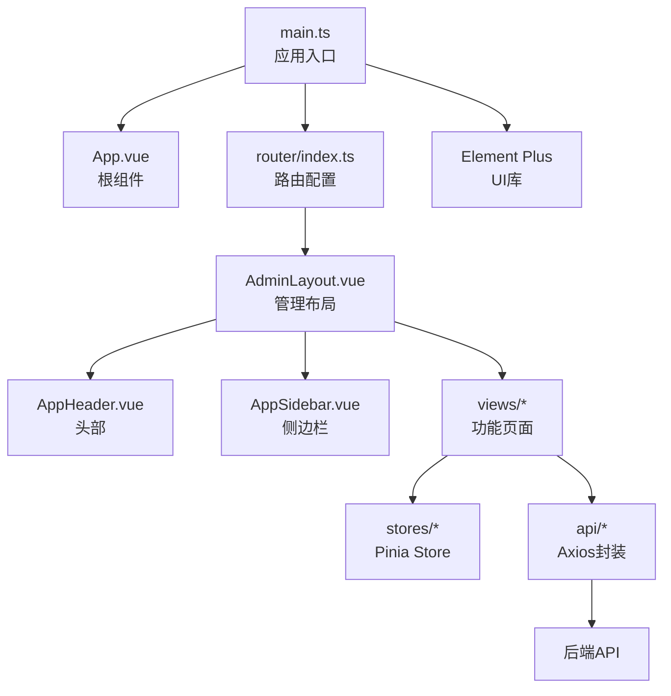
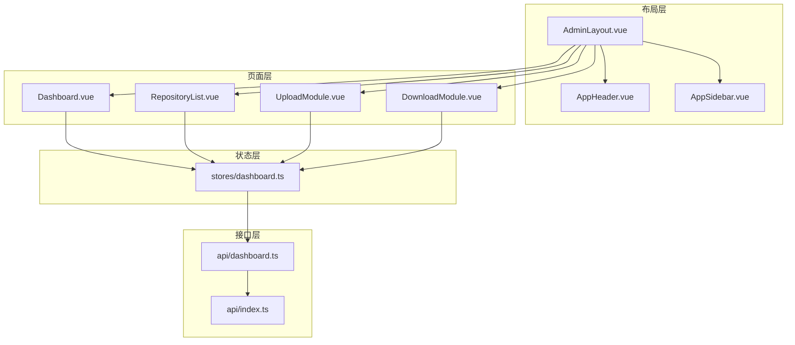
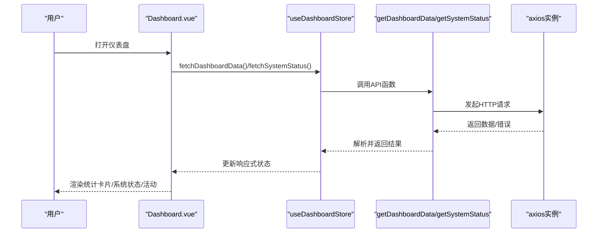
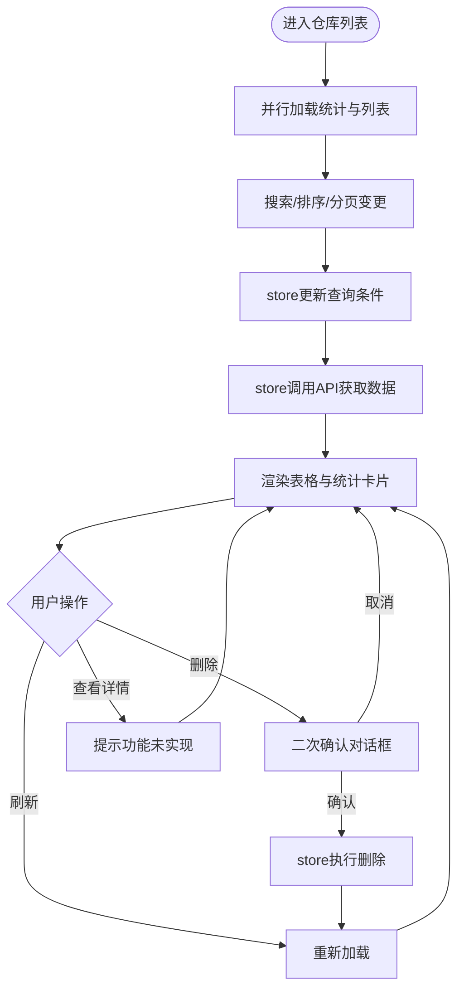
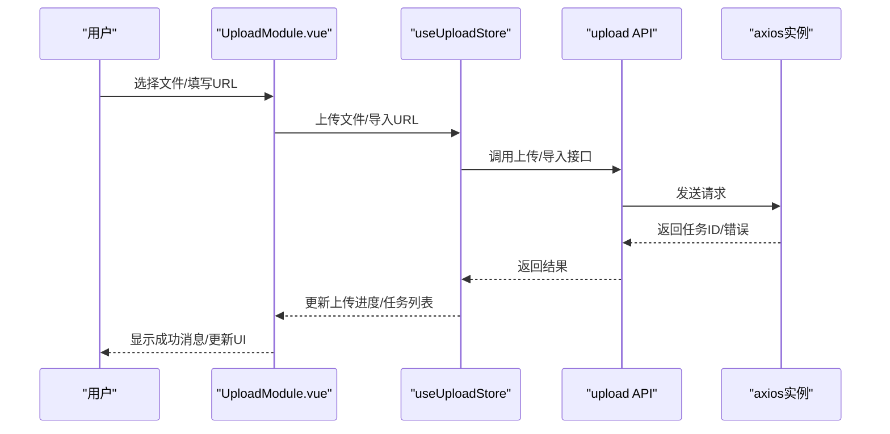
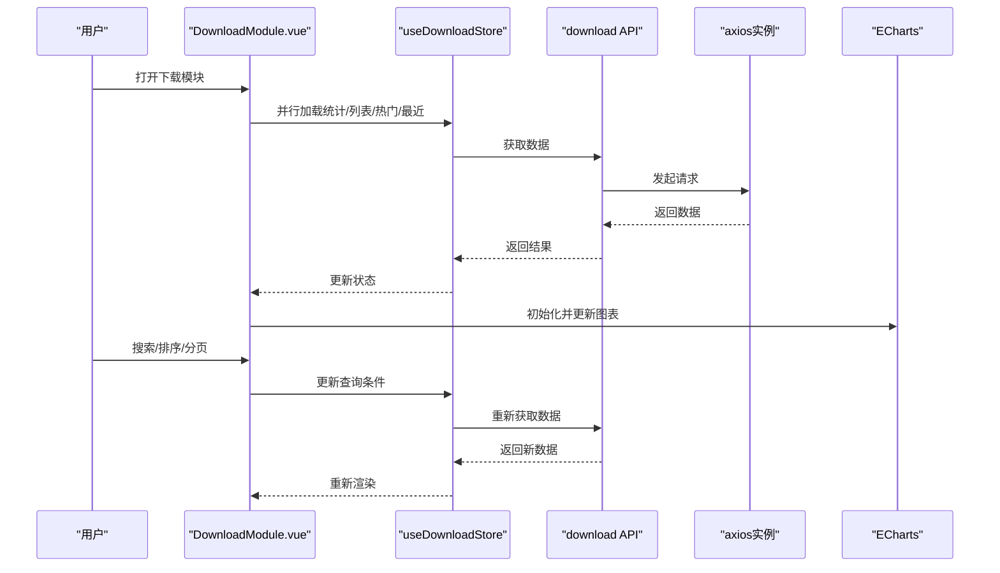
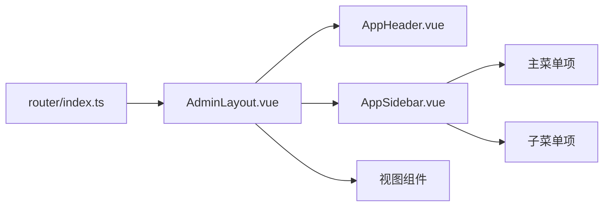
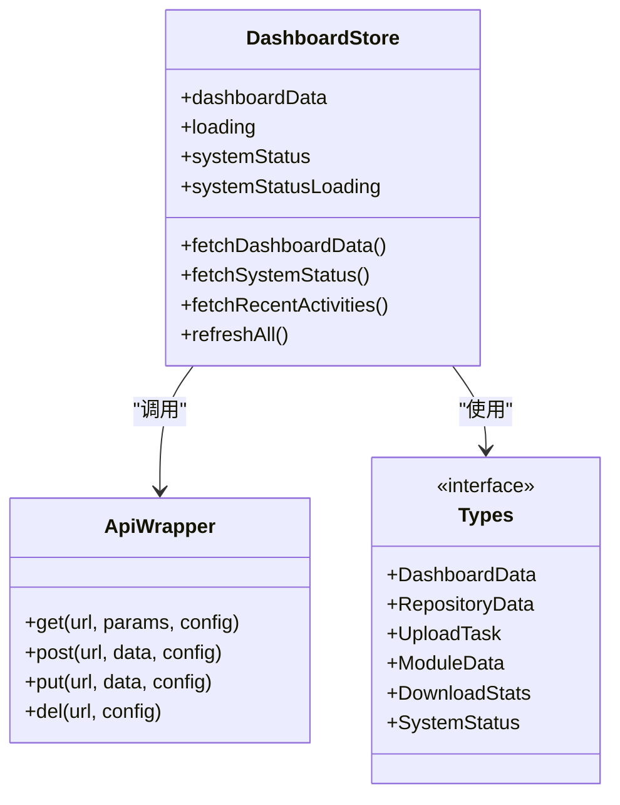
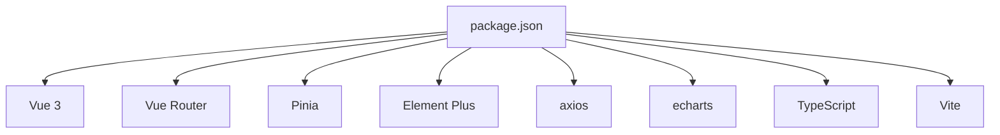

# 前端管理界面

<cite>
**本文档引用的文件**
- [frontend/package.json](file://frontend/package.json)
- [frontend/src/main.ts](file://frontend/src/main.ts)
- [frontend/src/App.vue](file://frontend/src/App.vue)
- [frontend/src/router/index.ts](file://frontend/src/router/index.ts)
- [frontend/src/layouts/AdminLayout.vue](file://frontend/src/layouts/AdminLayout.vue)
- [frontend/src/components/layout/AppHeader.vue](file://frontend/src/components/layout/AppHeader.vue)
- [frontend/src/components/layout/AppSidebar.vue](file://frontend/src/components/layout/AppSidebar.vue)
- [frontend/src/views/Dashboard.vue](file://frontend/src/views/Dashboard.vue)
- [frontend/src/views/repositories/RepositoryList.vue](file://frontend/src/views/repositories/RepositoryList.vue)
- [frontend/src/views/upload/UploadModule.vue](file://frontend/src/views/upload/UploadModule.vue)
- [frontend/src/views/download/DownloadModule.vue](file://frontend/src/views/download/DownloadModule.vue)
- [frontend/src/api/index.ts](file://frontend/src/api/index.ts)
- [frontend/src/api/dashboard.ts](file://frontend/src/api/dashboard.ts)
- [frontend/src/stores/dashboard.ts](file://frontend/src/stores/dashboard.ts)
- [frontend/src/types/index.ts](file://frontend/src/types/index.ts)
</cite>

## 目录
1. [简介](#简介)
2. [项目结构](#项目结构)
3. [核心组件](#核心组件)
4. [架构总览](#架构总览)
5. [详细组件分析](#详细组件分析)
6. [依赖关系分析](#依赖关系分析)
7. [性能考虑](#性能考虑)
8. [故障排查指南](#故障排查指南)
9. [结论](#结论)
10. [附录](#附录)

## 简介
本文件面向管理员与开发者，系统性阐述基于 Vue 3 + TypeScript + Element Plus 的前端管理界面。内容涵盖应用架构、布局与导航、功能页面职责与交互流程、API 集成与数据流、状态管理、界面定制与扩展、权限与本地化、响应式设计以及系统管理操作指南。

## 项目结构
前端位于 frontend 目录，采用 Vite 构建工具与 Vue 3 单文件组件（SFC）组织方式。核心目录与文件如下：
- 应用入口与依赖注册：main.ts、App.vue
- 路由与布局：router/index.ts、layouts/AdminLayout.vue
- 通用布局组件：components/layout/AppHeader.vue、components/layout/AppSidebar.vue
- 功能页面：views/Dashboard.vue、views/repositories/RepositoryList.vue、views/upload/UploadModule.vue、views/download/DownloadModule.vue
- API 层：api/index.ts、api/dashboard.ts
- 状态管理：stores/dashboard.ts
- 类型定义：types/index.ts
- 依赖与构建：package.json

**图表来源**
- [frontend/src/main.ts](file://frontend/src/main.ts#L1-L21)
- [frontend/src/App.vue](file://frontend/src/App.vue#L1-L7)
- [frontend/src/router/index.ts](file://frontend/src/router/index.ts#L1-L80)
- [frontend/src/layouts/AdminLayout.vue](file://frontend/src/layouts/AdminLayout.vue#L1-L56)
- [frontend/src/components/layout/AppHeader.vue](file://frontend/src/components/layout/AppHeader.vue#L1-L87)
- [frontend/src/components/layout/AppSidebar.vue](file://frontend/src/components/layout/AppSidebar.vue#L1-L248)

**章节来源**
- [frontend/src/main.ts](file://frontend/src/main.ts#L1-L21)
- [frontend/src/App.vue](file://frontend/src/App.vue#L1-L7)
- [frontend/src/router/index.ts](file://frontend/src/router/index.ts#L1-L80)
- [frontend/src/layouts/AdminLayout.vue](file://frontend/src/layouts/AdminLayout.vue#L1-L56)

## 核心组件
- 应用入口与依赖
  - 注册 Element Plus、图标、路由与 Pinia，挂载应用。
- 根组件 App.vue
  - 仅负责渲染当前路由组件，保持简洁。
- 路由与布局
  - AdminLayout 提供头部、侧边栏与内容区三段式布局；全局前置守卫统一设置页面标题。
- 导航与头部
  - AppHeader 提供用户下拉菜单；AppSidebar 基于当前路由动态展示主菜单与子菜单。
- 视图组件
  - Dashboard 仪表盘、RepositoryList 仓库管理、UploadModule 上传模块、DownloadModule 下载模块。
- API 与状态
  - axios 封装统一处理请求/响应；Pinia Store 管理各模块状态与数据获取。

**章节来源**
- [frontend/src/main.ts](file://frontend/src/main.ts#L1-L21)
- [frontend/src/App.vue](file://frontend/src/App.vue#L1-L7)
- [frontend/src/router/index.ts](file://frontend/src/router/index.ts#L1-L80)
- [frontend/src/layouts/AdminLayout.vue](file://frontend/src/layouts/AdminLayout.vue#L1-L56)
- [frontend/src/components/layout/AppHeader.vue](file://frontend/src/components/layout/AppHeader.vue#L1-L87)
- [frontend/src/components/layout/AppSidebar.vue](file://frontend/src/components/layout/AppSidebar.vue#L1-L248)

## 架构总览
前端采用“布局层-页面层-状态层-接口层”的分层架构：
- 布局层：AdminLayout + Header/Sidebar 提供一致的导航体验。
- 页面层：各功能视图组件负责业务逻辑与用户交互。
- 状态层：Pinia Store 抽象数据状态与异步数据获取。
- 接口层：Axios 实例封装请求与响应拦截，统一错误提示。

**图表来源**
- [frontend/src/layouts/AdminLayout.vue](file://frontend/src/layouts/AdminLayout.vue#L1-L56)
- [frontend/src/components/layout/AppHeader.vue](file://frontend/src/components/layout/AppHeader.vue#L1-L87)
- [frontend/src/components/layout/AppSidebar.vue](file://frontend/src/components/layout/AppSidebar.vue#L1-L248)
- [frontend/src/views/Dashboard.vue](file://frontend/src/views/Dashboard.vue#L1-L243)
- [frontend/src/views/repositories/RepositoryList.vue](file://frontend/src/views/repositories/RepositoryList.vue#L1-L281)
- [frontend/src/views/upload/UploadModule.vue](file://frontend/src/views/upload/UploadModule.vue#L1-L401)
- [frontend/src/views/download/DownloadModule.vue](file://frontend/src/views/download/DownloadModule.vue#L1-L507)
- [frontend/src/stores/dashboard.ts](file://frontend/src/stores/dashboard.ts#L1-L85)
- [frontend/src/api/index.ts](file://frontend/src/api/index.ts#L1-L71)
- [frontend/src/api/dashboard.ts](file://frontend/src/api/dashboard.ts#L1-L71)

## 详细组件分析

### 仪表盘页面（Dashboard）
- 职责
  - 展示系统概览统计、系统健康状态、热门模块与最近活动。
- 数据流
  - 组件挂载时调用 store 的数据获取方法；store 通过 API 层发起请求；响应拦截器统一处理错误。
- 交互
  - 支持手动刷新系统状态；活动类型按类型映射不同标签样式；骨架屏提升加载体验。
- 关键实现点
  - 使用 Element Plus 卡片、表格、时间线、标签与按钮等组件组合。
  - 通过 computed 与响应式 ref 管理加载状态与数据。

**图表来源**
- [frontend/src/views/Dashboard.vue](file://frontend/src/views/Dashboard.vue#L138-L174)
- [frontend/src/stores/dashboard.ts](file://frontend/src/stores/dashboard.ts#L31-L55)
- [frontend/src/api/dashboard.ts](file://frontend/src/api/dashboard.ts#L46-L62)
- [frontend/src/api/index.ts](file://frontend/src/api/index.ts#L11-L49)

**章节来源**
- [frontend/src/views/Dashboard.vue](file://frontend/src/views/Dashboard.vue#L1-L243)
- [frontend/src/stores/dashboard.ts](file://frontend/src/stores/dashboard.ts#L1-L85)
- [frontend/src/api/dashboard.ts](file://frontend/src/api/dashboard.ts#L1-L71)
- [frontend/src/api/index.ts](file://frontend/src/api/index.ts#L1-L71)

### 仓库管理页面（RepositoryList）
- 职责
  - 展示仓库统计与列表，支持搜索、排序、分页与删除操作。
- 交互
  - 输入框支持回车触发搜索；分页与排序变更通过 store 更新状态；删除前二次确认。
- 数据流
  - 统计与列表并行加载；store 调用 API 获取数据；格式化工具用于日期显示。

**图表来源**
- [frontend/src/views/repositories/RepositoryList.vue](file://frontend/src/views/repositories/RepositoryList.vue#L142-L225)
- [frontend/src/stores/repository.ts](file://frontend/src/stores/repository.ts#L1-L200)

**章节来源**
- [frontend/src/views/repositories/RepositoryList.vue](file://frontend/src/views/repositories/RepositoryList.vue#L1-L281)

### 上传模块页面（UploadModule）
- 职责
  - 支持文件上传与 URL 导入两种方式；展示上传任务列表并支持状态筛选、分页与取消任务。
- 交互
  - 文件上传限制类型与大小；URL 导入表单校验；任务状态按类型映射不同标签颜色。
- 数据流
  - 文件上传通过 store 的上传方法创建任务；URL 导入调用 store 的导入方法；任务列表与分页状态由 store 维护。

**图表来源**
- [frontend/src/views/upload/UploadModule.vue](file://frontend/src/views/upload/UploadModule.vue#L236-L277)
- [frontend/src/stores/upload.ts](file://frontend/src/stores/upload.ts#L1-L200)
- [frontend/src/api/upload.ts](file://frontend/src/api/upload.ts#L1-L200)
- [frontend/src/api/index.ts](file://frontend/src/api/index.ts#L1-L71)

**章节来源**
- [frontend/src/views/upload/UploadModule.vue](file://frontend/src/views/upload/UploadModule.vue#L1-L401)

### 下载模块页面（DownloadModule）
- 职责
  - 展示下载统计与趋势图；模块列表支持搜索、排序、分页；热门模块与最近下载展示。
- 交互
  - ECharts 图表随数据变化自动更新；下载按钮触发浏览器下载行为；分页与排序变更通过 store 更新。
- 数据流
  - 统计、模块列表、热门模块与最近下载并行加载；图表在初始化后监听数据变化更新。

**图表来源**
- [frontend/src/views/download/DownloadModule.vue](file://frontend/src/views/download/DownloadModule.vue#L256-L335)
- [frontend/src/stores/download.ts](file://frontend/src/stores/download.ts#L1-L200)
- [frontend/src/api/download.ts](file://frontend/src/api/download.ts#L1-L200)
- [frontend/src/api/index.ts](file://frontend/src/api/index.ts#L1-L71)

**章节来源**
- [frontend/src/views/download/DownloadModule.vue](file://frontend/src/views/download/DownloadModule.vue#L1-L507)

### 路由与布局
- 路由
  - 采用 history 模式，基础路径为 /admin；全局前置守卫设置页面标题；懒加载各功能视图。
- 布局
  - AdminLayout 包含 Header、Sidebar 与内容区域；过渡动画提升页面切换体验。
- 导航
  - Sidebar 基于当前路由动态显示主菜单与子菜单；支持多级菜单联动。

**图表来源**
- [frontend/src/router/index.ts](file://frontend/src/router/index.ts#L1-L80)
- [frontend/src/layouts/AdminLayout.vue](file://frontend/src/layouts/AdminLayout.vue#L1-L56)
- [frontend/src/components/layout/AppHeader.vue](file://frontend/src/components/layout/AppHeader.vue#L1-L87)
- [frontend/src/components/layout/AppSidebar.vue](file://frontend/src/components/layout/AppSidebar.vue#L1-L248)

**章节来源**
- [frontend/src/router/index.ts](file://frontend/src/router/index.ts#L1-L80)
- [frontend/src/layouts/AdminLayout.vue](file://frontend/src/layouts/AdminLayout.vue#L1-L56)
- [frontend/src/components/layout/AppHeader.vue](file://frontend/src/components/layout/AppHeader.vue#L1-L87)
- [frontend/src/components/layout/AppSidebar.vue](file://frontend/src/components/layout/AppSidebar.vue#L1-L248)

### API 集成与状态管理
- Axios 封装
  - 统一设置 base URL、超时时间；请求拦截器可扩展认证头；响应拦截器统一错误提示与状态判断。
- Store 设计
  - 使用 Pinia 定义模块化 store，集中管理状态、加载状态与异步数据获取；提供刷新与聚合加载能力。
- 类型定义
  - types/index.ts 定义仪表盘、仓库、上传任务、模块、下载统计与系统设置等数据结构，确保类型安全。

**图表来源**
- [frontend/src/api/index.ts](file://frontend/src/api/index.ts#L1-L71)
- [frontend/src/stores/dashboard.ts](file://frontend/src/stores/dashboard.ts#L1-L85)
- [frontend/src/types/index.ts](file://frontend/src/types/index.ts#L1-L127)

**章节来源**
- [frontend/src/api/index.ts](file://frontend/src/api/index.ts#L1-L71)
- [frontend/src/stores/dashboard.ts](file://frontend/src/stores/dashboard.ts#L1-L85)
- [frontend/src/types/index.ts](file://frontend/src/types/index.ts#L1-L127)

## 依赖关系分析
- 运行时依赖
  - Vue 3、Vue Router、Pinia、Element Plus、axios、echarts、marked、dompurify 等。
- 构建与开发
  - Vite、TypeScript、Sass、@vitejs/plugin-vue 等。
- 依赖注入与模块化
  - main.ts 中集中注册插件与依赖；路由与布局解耦，便于扩展新页面。

**图表来源**
- [frontend/package.json](file://frontend/package.json#L1-L30)

**章节来源**
- [frontend/package.json](file://frontend/package.json#L1-L30)

## 性能考虑
- 懒加载与路由分割
  - 路由组件懒加载减少首屏体积。
- 并行加载
  - 仪表盘与下载模块均采用 Promise.all 并行获取多个数据源，缩短首屏等待。
- 图表优化
  - ECharts 图表在数据变化时增量更新，避免重复初始化。
- 加载状态与骨架屏
  - 使用 Element Plus 骨架屏与 loading 状态，改善感知性能。
- 本地化与响应式
  - Element Plus 组件天然支持多语言；SCSS 媒体查询与栅格系统保证移动端体验。

[本节为通用建议，无需特定文件引用]

## 故障排查指南
- 请求失败
  - 检查 VITE_API_BASE_URL 环境变量是否正确；查看响应拦截器中的错误提示。
- 上传失败
  - 确认文件类型与大小限制；检查上传任务状态与错误信息。
- 图表不显示
  - 确保容器存在且有尺寸；监听窗口 resize 并及时调整图表大小。
- 页面空白或组件不生效
  - 检查 main.ts 中插件注册顺序与 Element Plus 样式引入。

**章节来源**
- [frontend/src/api/index.ts](file://frontend/src/api/index.ts#L1-L71)
- [frontend/src/views/upload/UploadModule.vue](file://frontend/src/views/upload/UploadModule.vue#L210-L224)
- [frontend/src/views/download/DownloadModule.vue](file://frontend/src/views/download/DownloadModule.vue#L270-L279)

## 结论
该前端管理界面以清晰的分层架构、完善的路由与布局、模块化的状态管理与统一的 API 封装为基础，提供了仪表盘、仓库管理、上传与下载等核心功能。通过类型定义与组件化设计，具备良好的可维护性与扩展性。建议后续完善权限控制、国际化与主题系统，并持续优化性能与用户体验。

[本节为总结，无需特定文件引用]

## 附录

### 界面定制与扩展指南
- 主题与样式
  - 在 assets/styles/main.scss 中自定义全局样式；Element Plus 主题可通过配置覆盖。
- 新增页面
  - 在 router/index.ts 中新增路由条目；在 layouts/AdminLayout.vue 中根据需要扩展侧边栏菜单。
- 新增 Store
  - 在 stores/ 目录下创建新的 store 文件，遵循现有命名与导出规范。
- 新增 API
  - 在 api/ 目录下新增模块 API 文件，复用 axios 封装；在 types/ 添加对应类型定义。

**章节来源**
- [frontend/src/router/index.ts](file://frontend/src/router/index.ts#L1-L80)
- [frontend/src/layouts/AdminLayout.vue](file://frontend/src/layouts/AdminLayout.vue#L1-L56)
- [frontend/src/assets/styles/main.scss](file://frontend/src/assets/styles/main.scss#L1-L200)

### 用户权限管理、界面本地化与响应式设计
- 权限管理
  - 当前代码未体现权限控制逻辑，建议在路由守卫或 store 中增加鉴权与角色校验。
- 本地化
  - Element Plus 支持多语言，可在应用启动时设置语言；页面文案可结合 i18n 方案扩展。
- 响应式设计
  - 使用 Element Plus 的栅格系统与断点；在 SCSS 中补充媒体查询适配移动端。

[本节为通用指导，无需特定文件引用]

### 系统管理操作指南（管理员）
- 仪表盘
  - 查看模块总数、下载总量、仓库数量与存储使用；手动刷新系统状态。
- 仓库管理
  - 列表支持搜索、排序与分页；删除仓库需二次确认；统计卡片展示总体指标。
- 上传模块
  - 支持文件上传与 URL 导入；查看任务列表并支持取消未执行任务。
- 下载模块
  - 查看下载统计与趋势图；模块列表支持搜索与排序；热门模块与最近下载展示。
- 系统设置
  - 可在路由中访问设置页面，具体字段与接口以后端 API 为准。

**章节来源**
- [frontend/src/views/Dashboard.vue](file://frontend/src/views/Dashboard.vue#L1-L243)
- [frontend/src/views/repositories/RepositoryList.vue](file://frontend/src/views/repositories/RepositoryList.vue#L1-L281)
- [frontend/src/views/upload/UploadModule.vue](file://frontend/src/views/upload/UploadModule.vue#L1-L401)
- [frontend/src/views/download/DownloadModule.vue](file://frontend/src/views/download/DownloadModule.vue#L1-L507)