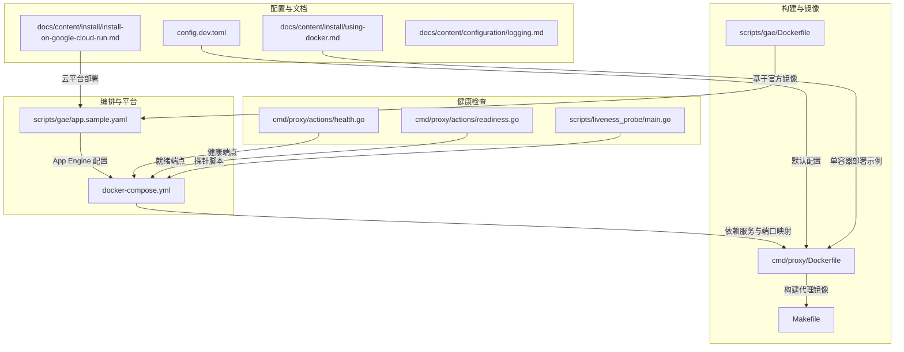
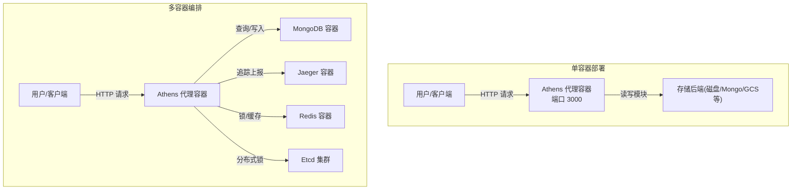
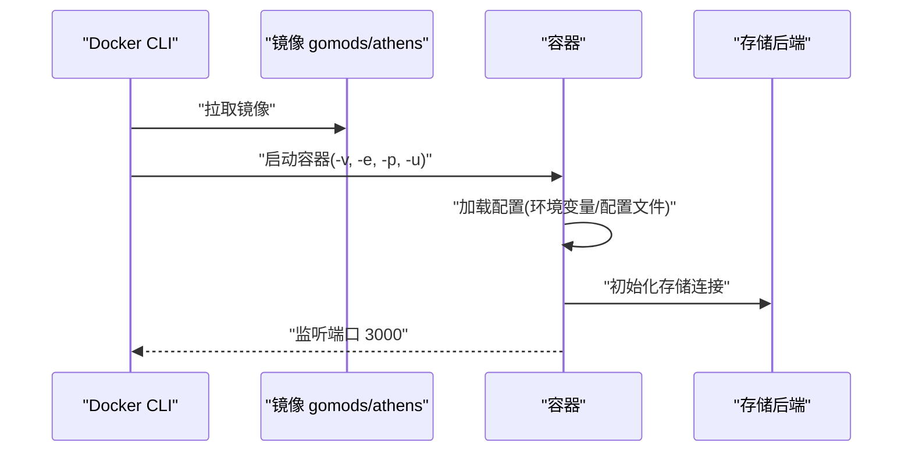
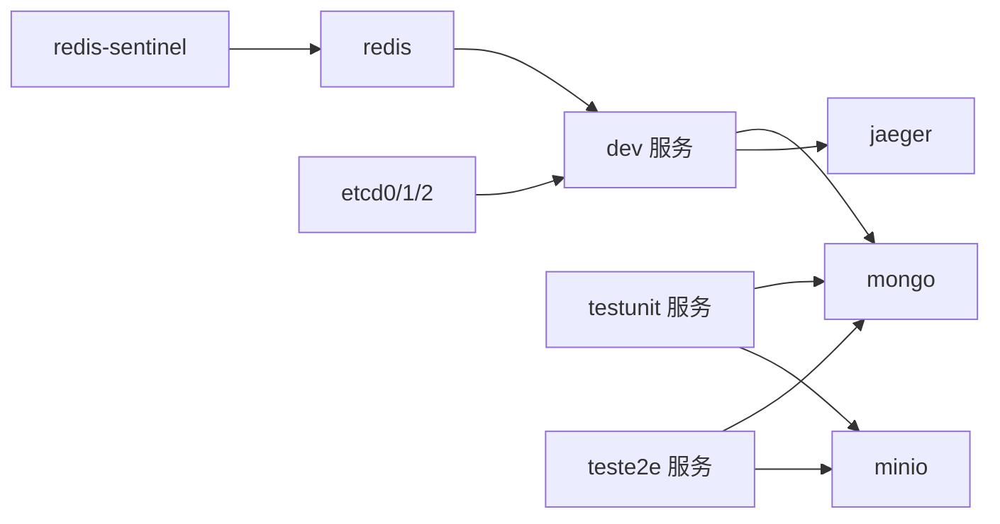
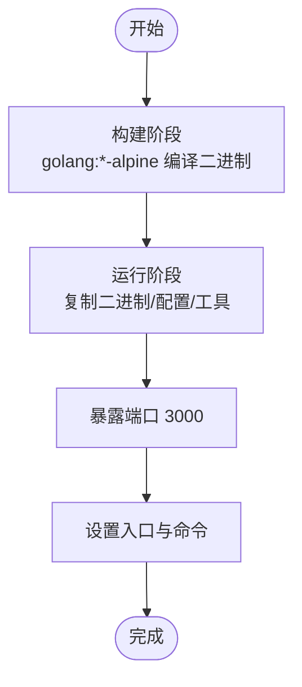
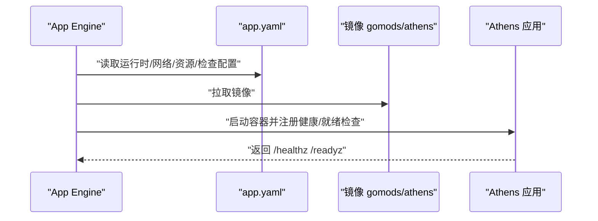
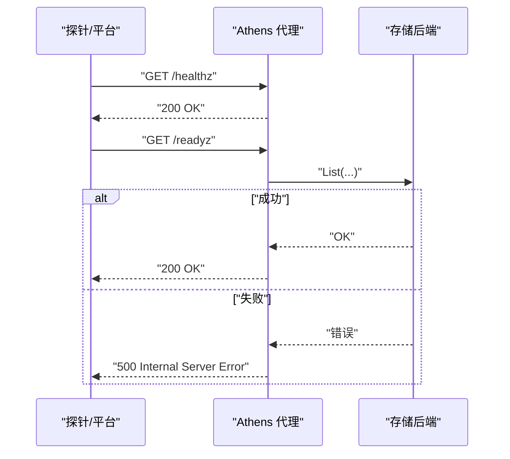
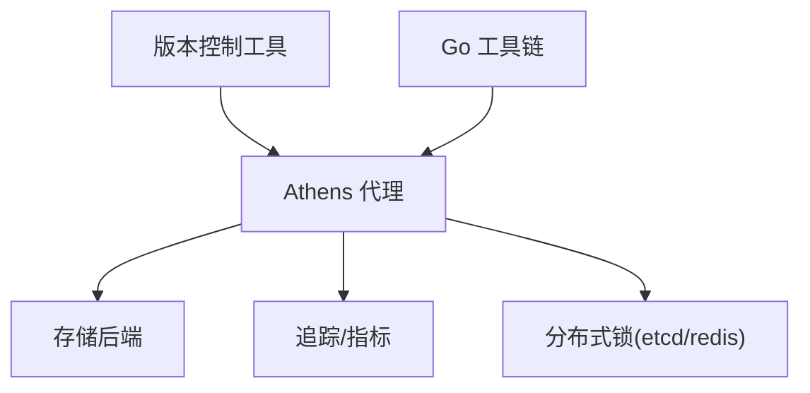

# Docker 容器化部署

<cite>
**本文引用的文件**
- [cmd/proxy/Dockerfile](file://cmd/proxy/Dockerfile)
- [docker-compose.yml](file://docker-compose.yml)
- [scripts/gae/app.sample.yaml](file://scripts/gae/app.sample.yaml)
- [scripts/gae/Dockerfile](file://scripts/gae/Dockerfile)
- [config.dev.toml](file://config.dev.toml)
- [docs/content/install/using-docker.md](file://docs/content/install/using-docker.md)
- [docs/content/install/install-on-google-cloud-run.md](file://docs/content/install/install-on-google-cloud-run.md)
- [docs/content/configuration/logging.md](file://docs/content/configuration/logging.md)
- [cmd/proxy/actions/health.go](file://cmd/proxy/actions/health.go)
- [cmd/proxy/actions/readiness.go](file://cmd/proxy/actions/readiness.go)
- [scripts/liveness_probe/main.go](file://scripts/liveness_probe/main.go)
- [Makefile](file://Makefile)
</cite>

## 目录
1. [简介](#简介)
2. [项目结构](#项目结构)
3. [核心组件](#核心组件)
4. [架构总览](#架构总览)
5. [详细组件分析](#详细组件分析)
6. [依赖关系分析](#依赖关系分析)
7. [性能考量](#性能考量)
8. [故障排查指南](#故障排查指南)
9. [结论](#结论)
10. [附录](#附录)

## 简介
本文件面向使用 Docker 进行 Athens 代理的部署与运维人员，系统性说明如何基于官方镜像进行单容器与多容器编排部署；详解 Dockerfile 构建流程、镜像标签管理策略、容器运行参数与环境变量配置；提供 docker-compose.yml 的完整示例（含存储卷、环境变量、网络与依赖服务）；覆盖 Google App Engine 的特殊配置要点；并给出健康检查、日志管理与资源限制的最佳实践，以及常见问题排查与性能优化建议。

## 项目结构
与 Docker 容器化部署直接相关的关键文件与目录如下：
- 构建与运行镜像：cmd/proxy/Dockerfile、scripts/gae/Dockerfile
- 编排与依赖：docker-compose.yml
- 平台特定配置：scripts/gae/app.sample.yaml
- 默认配置模板：config.dev.toml
- 文档与示例：docs/content/install/*.md
- 健康检查端点：cmd/proxy/actions/health.go、cmd/proxy/actions/readiness.go
- 健康探针脚本：scripts/liveness_probe/main.go
- 构建与发布：Makefile

**图表来源**
- [cmd/proxy/Dockerfile](file://cmd/proxy/Dockerfile#L1-L61)
- [scripts/gae/Dockerfile](file://scripts/gae/Dockerfile#L1-L1)
- [docker-compose.yml](file://docker-compose.yml#L1-L173)
- [scripts/gae/app.sample.yaml](file://scripts/gae/app.sample.yaml#L1-L45)
- [config.dev.toml](file://config.dev.toml#L1-L628)
- [docs/content/install/using-docker.md](file://docs/content/install/using-docker.md#L1-L88)
- [docs/content/install/install-on-google-cloud-run.md](file://docs/content/install/install-on-google-cloud-run.md#L1-L75)
- [docs/content/configuration/logging.md](file://docs/content/configuration/logging.md#L1-L18)
- [cmd/proxy/actions/health.go](file://cmd/proxy/actions/health.go#L1-L11)
- [cmd/proxy/actions/readiness.go](file://cmd/proxy/actions/readiness.go#L1-L17)
- [scripts/liveness_probe/main.go](file://scripts/liveness_probe/main.go#L1-L60)

**章节来源**
- [cmd/proxy/Dockerfile](file://cmd/proxy/Dockerfile#L1-L61)
- [docker-compose.yml](file://docker-compose.yml#L1-L173)
- [scripts/gae/app.sample.yaml](file://scripts/gae/app.sample.yaml#L1-L45)
- [config.dev.toml](file://config.dev.toml#L1-L628)
- [docs/content/install/using-docker.md](file://docs/content/install/using-docker.md#L1-L88)
- [docs/content/install/install-on-google-cloud-run.md](file://docs/content/install/install-on-google-cloud-run.md#L1-L75)
- [docs/content/configuration/logging.md](file://docs/content/configuration/logging.md#L1-L18)
- [cmd/proxy/actions/health.go](file://cmd/proxy/actions/health.go#L1-L11)
- [cmd/proxy/actions/readiness.go](file://cmd/proxy/actions/readiness.go#L1-L17)
- [scripts/liveness_probe/main.go](file://scripts/liveness_probe/main.go#L1-L60)
- [Makefile](file://Makefile#L85-L95)

## 核心组件
- 代理镜像构建：基于多阶段构建，先在 golang:*-alpine 构建二进制，再复制到精简 Alpine 基础镜像，安装版本控制客户端与 tini，暴露端口并以非 root 用户运行。
- 编排与依赖：docker-compose 提供开发与测试场景的多服务组合，包含 MongoDB、MinIO、Jaeger、Redis、Etcd 等。
- 平台配置：Google App Engine 使用自定义运行时，配置健康检查、就绪检查、自动扩缩容与环境变量。
- 配置模板：config.dev.toml 提供端口、日志、存储类型、超时等默认值与环境变量覆盖说明。
- 健康检查：内置 /healthz 与 /readyz 端点，配合 App Engine liveness/readiness 检查。
- 健康探针：独立探针脚本可对 GOPROXY 进行探测，用于 CI/CD 流水线。

**章节来源**
- [cmd/proxy/Dockerfile](file://cmd/proxy/Dockerfile#L11-L61)
- [docker-compose.yml](file://docker-compose.yml#L1-L173)
- [scripts/gae/app.sample.yaml](file://scripts/gae/app.sample.yaml#L1-L45)
- [config.dev.toml](file://config.dev.toml#L134-L143)
- [cmd/proxy/actions/health.go](file://cmd/proxy/actions/health.go#L7-L10)
- [cmd/proxy/actions/readiness.go](file://cmd/proxy/actions/readiness.go#L9-L16)
- [scripts/liveness_probe/main.go](file://scripts/liveness_probe/main.go#L15-L59)

## 架构总览
下图展示单容器与多容器两种部署形态及关键交互：

**图表来源**
- [docker-compose.yml](file://docker-compose.yml#L3-L173)
- [cmd/proxy/Dockerfile](file://cmd/proxy/Dockerfile#L56-L61)

**章节来源**
- [docker-compose.yml](file://docker-compose.yml#L1-L173)
- [cmd/proxy/Dockerfile](file://cmd/proxy/Dockerfile#L56-L61)

## 详细组件分析

### 单容器部署（官方镜像）
- 使用官方镜像 gomods/athens 或 gomods/athens-dev，按需选择标签。
- 必要环境变量：
  - 存储类型与根路径：ATHENS_STORAGE_TYPE、ATHENS_DISK_STORAGE_ROOT（或对应存储后端的连接串与凭据）
  - 端口映射：-p 3000:3000
  - 重启策略：--restart always
- 非 root 用户：镜像内置非 root 用户，可使用 -u 1000:1000 运行。
- 参考示例见文档页面“Using the Athens Docker images”。

**图表来源**
- [docs/content/install/using-docker.md](file://docs/content/install/using-docker.md#L24-L72)

**章节来源**
- [docs/content/install/using-docker.md](file://docs/content/install/using-docker.md#L11-L88)

### 多容器编排部署（docker-compose）
- 服务分层：
  - 开发服务 dev：基于 cmd/proxy/Dockerfile 构建，依赖 mongo、jaeger，暴露端口 3000。
  - 测试服务 testunit/teste2e：基于 Dockerfile.test 构建，注入依赖服务与环境变量。
  - 数据与中间件：mongo、minio、jaeger、redis、redis-sentinel、etcd0/1/2、datadog。
- 关键配置点：
  - 环境变量：ATHENS_STORAGE_TYPE、ATHENS_MONGO_STORAGE_URL、ATHENS_MINIO_ENDPOINT 等。
  - 端口映射：代理 3000:3000，数据库与对象存储端口映射。
  - 依赖顺序：depends_on 控制启动顺序。
  - 存储卷：etcd 使用命名卷持久化数据。
- 适合本地联调、集成测试与演示环境。

**图表来源**
- [docker-compose.yml](file://docker-compose.yml#L3-L173)

**章节来源**
- [docker-compose.yml](file://docker-compose.yml#L1-L173)

### Dockerfile 构建流程与镜像标签管理
- 构建阶段：
  - 多阶段构建：builder 阶段使用 golang:*-alpine 编译二进制，目标架构通过 ARG TARGETARCH 注入。
  - 运行阶段：从 Alpine 基础镜像复制二进制、go 可执行文件与默认配置，安装版本控制工具与 tini。
- 运行参数：
  - 端口：EXPOSE 3000
  - 入口：ENTRYPOINT ["/sbin/tini","--"]
  - 命令：CMD ["athens-proxy","-config_file=/config/config.toml"]
- 标签管理：
  - 发布版镜像 gomods/athens，标签与版本一致；canary 标签跟踪主分支提交。
  - 开发版镜像 gomods/athens-dev，按提交打标签。
- Makefile 提供构建命令与推送脚本，便于 CI/CD。

**图表来源**
- [cmd/proxy/Dockerfile](file://cmd/proxy/Dockerfile#L11-L61)
- [Makefile](file://Makefile#L88-L95)

**章节来源**
- [cmd/proxy/Dockerfile](file://cmd/proxy/Dockerfile#L1-L61)
- [Makefile](file://Makefile#L85-L95)

### Google App Engine 部署配置
- 运行时与环境：runtime: custom, env: flex
- 网络与端口：forwarded_ports 包含 3000/tcp
- 计算资源：CPU、内存、磁盘大小
- 健康与就绪检查：liveness_check、readiness_check 指向 /healthz 与 /readyz
- 自动扩缩容：最小/最大实例数、冷却时间、CPU 利用率阈值
- 环境变量：ATHENS_STORAGE_TYPE、GOOGLE_CLOUD_PROJECT、ATHENS_STORAGE_GCP_BUCKET
- App 引擎专用 Dockerfile：基于 gomods/athens:vX.X.X

**图表来源**
- [scripts/gae/app.sample.yaml](file://scripts/gae/app.sample.yaml#L1-L45)
- [scripts/gae/Dockerfile](file://scripts/gae/Dockerfile#L1-L1)

**章节来源**
- [scripts/gae/app.sample.yaml](file://scripts/gae/app.sample.yaml#L1-L45)
- [scripts/gae/Dockerfile](file://scripts/gae/Dockerfile#L1-L1)

### 健康检查与日志管理
- 内置端点：
  - /healthz：健康检查，返回 200
  - /readyz：就绪检查，对存储后端执行 List 操作，失败返回 500
- 日志：
  - 标准结构化日志支持 plain/json 格式与日志级别控制
  - 在 GCP 运行时下字段命名适配 GCP 日志环境
- 探针脚本：scripts/liveness_probe/main.go 对 GOPROXY 执行探测，适用于 CI/CD 流水线。

**图表来源**
- [cmd/proxy/actions/health.go](file://cmd/proxy/actions/health.go#L7-L10)
- [cmd/proxy/actions/readiness.go](file://cmd/proxy/actions/readiness.go#L9-L16)
- [scripts/liveness_probe/main.go](file://scripts/liveness_probe/main.go#L46-L59)

**章节来源**
- [cmd/proxy/actions/health.go](file://cmd/proxy/actions/health.go#L1-L11)
- [cmd/proxy/actions/readiness.go](file://cmd/proxy/actions/readiness.go#L1-L17)
- [docs/content/configuration/logging.md](file://docs/content/configuration/logging.md#L9-L18)
- [scripts/liveness_probe/main.go](file://scripts/liveness_probe/main.go#L1-L60)

### 资源限制与性能优化
- 资源限制（App Engine）：通过 resources.cpu、resources.memory_gb、resources.disk_size_gb 控制实例规格。
- 自动扩缩容：automatic_scaling.min/max_num_instances、cool_down_period_sec、cpu_utilization.target_utilization。
- 性能建议：
  - 合理设置并发下载与协议处理工作线程（参考配置模板中的 GoGetWorkers、ProtocolWorkers）。
  - 为存储后端（Mongo/MinIO/GCS）配置合适的超时与连接参数。
  - 使用外部索引（如 MySQL/Postgres）提升版本列表查询性能。
  - 在高并发场景启用分布式锁（SingleFlight）避免重复下载与写入冲突。

**章节来源**
- [scripts/gae/app.sample.yaml](file://scripts/gae/app.sample.yaml#L13-L39)
- [config.dev.toml](file://config.dev.toml#L48-L74)
- [config.dev.toml](file://config.dev.toml#L314-L387)

## 依赖关系分析
- 组件耦合：
  - 代理容器依赖存储后端（磁盘/Mongo/GCS/S3/AzureBlob/MinIO/External）。
  - 追踪与指标：可选 Jaeger、Datadog、Prometheus。
  - 分布式协调：Etcd/Redis/Redis-Sentinel 作为 SingleFlight 实现。
- 外部依赖：
  - 版本控制工具：git、git-lfs、hg、svn、fossil。
  - Go 工具链：go 可执行文件随镜像提供，便于模块下载与解析。

**图表来源**
- [cmd/proxy/Dockerfile](file://cmd/proxy/Dockerfile#L45-L49)
- [config.dev.toml](file://config.dev.toml#L314-L387)

**章节来源**
- [cmd/proxy/Dockerfile](file://cmd/proxy/Dockerfile#L44-L51)
- [config.dev.toml](file://config.dev.toml#L314-L387)

## 性能考量
- 并发与吞吐：
  - GoGetWorkers 控制并发下载数量，避免低性能实例资源耗尽。
  - ProtocolWorkers 控制协议处理并发，平衡请求响应与后台写入。
- 存储与网络：
  - 为存储后端设置合理超时与重试策略，避免上游网络抖动影响。
  - 使用就近区域的存储与对象存储，降低延迟。
- 追踪与可观测性：
  - 启用 Jaeger/Zipkin 上报，结合日志级别与格式定位瓶颈。
  - 在 GAE 下利用平台日志与监控能力。

[本节为通用指导，无需列出具体文件来源]

## 故障排查指南
- 初始化与僵尸进程：
  - 镜像内置 tini，避免僵尸进程；若出现警告，确认宿主 Docker 版本与 init 配置。
- 健康检查失败：
  - 确认 /healthz 返回 200，/readyz 能访问存储后端。
  - 检查存储连接串、认证信息与网络连通性。
- 日志与级别：
  - 使用 ATHENS_LOG_LEVEL 与 ATHENS_LOG_FORMAT 调整输出格式与级别。
  - 在 GCP 运行时下确保日志字段命名符合平台要求。
- CI/CD 探针：
  - 使用 liveness_probe 对 GOPROXY 进行探测，超时或连接被拒属预期，注意过滤无关错误。

**章节来源**
- [docs/content/install/using-docker.md](file://docs/content/install/using-docker.md#L74-L88)
- [cmd/proxy/actions/health.go](file://cmd/proxy/actions/health.go#L7-L10)
- [cmd/proxy/actions/readiness.go](file://cmd/proxy/actions/readiness.go#L9-L16)
- [docs/content/configuration/logging.md](file://docs/content/configuration/logging.md#L9-L18)
- [scripts/liveness_probe/main.go](file://scripts/liveness_probe/main.go#L26-L43)

## 结论
通过官方镜像与 docker-compose，可快速搭建单容器与多容器环境；结合 App Engine 的灵活运行时与健康检查配置，可在云平台上实现弹性伸缩与稳定运行。配合合理的资源限制、日志与可观测性配置，以及针对并发与存储的性能优化，可获得可靠的模块代理服务。

[本节为总结性内容，无需列出具体文件来源]

## 附录
- 常用命令与参考：
  - 构建代理镜像：make proxy-docker
  - 推送镜像：make docker-push
  - 运行开发环境：make run-docker
  - App Engine 部署：make deploy-gae
  - 单容器示例与非 root 用户运行参见“Using the Athens Docker images”文档页

**章节来源**
- [Makefile](file://Makefile#L88-L131)
- [docs/content/install/using-docker.md](file://docs/content/install/using-docker.md#L24-L72)