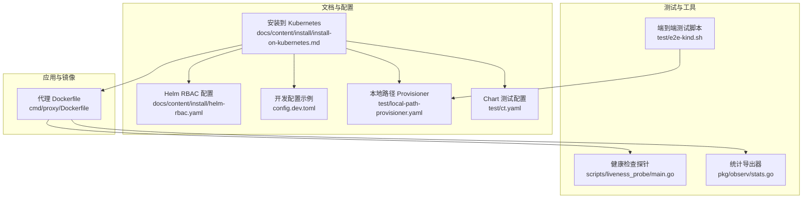
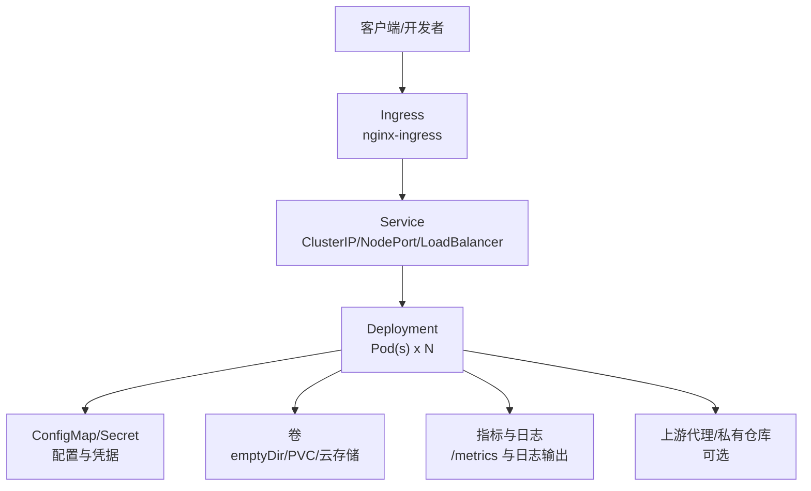
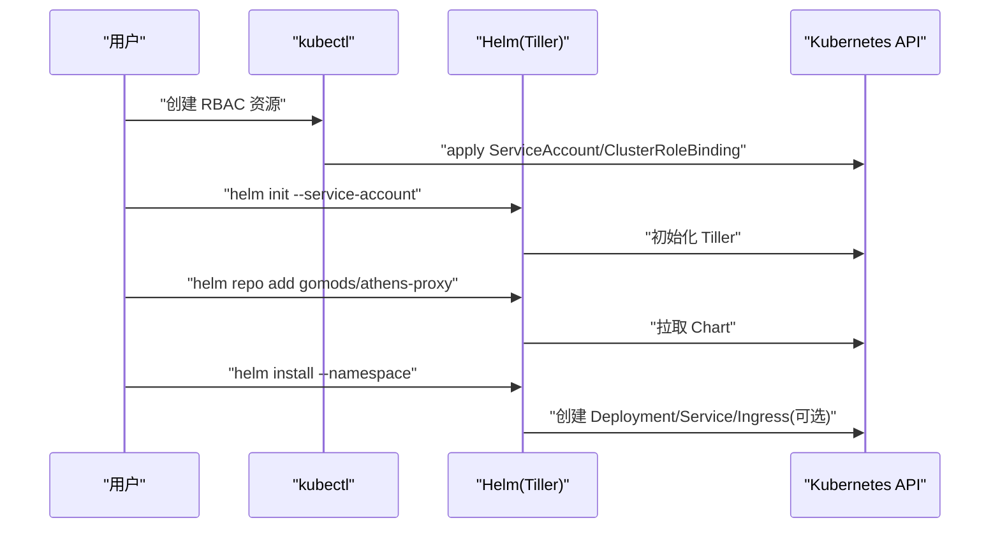
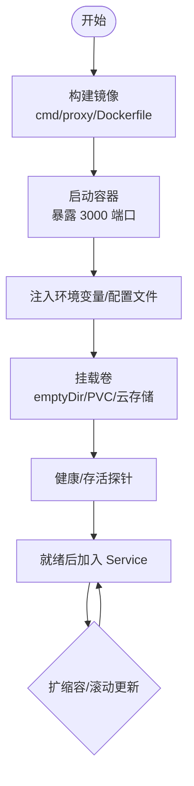
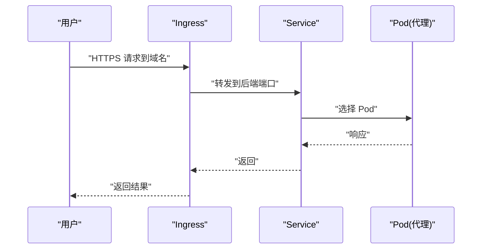
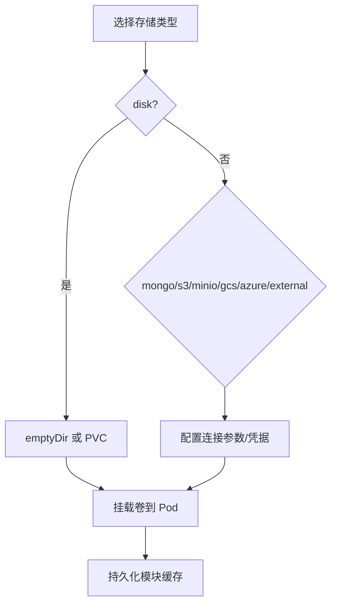
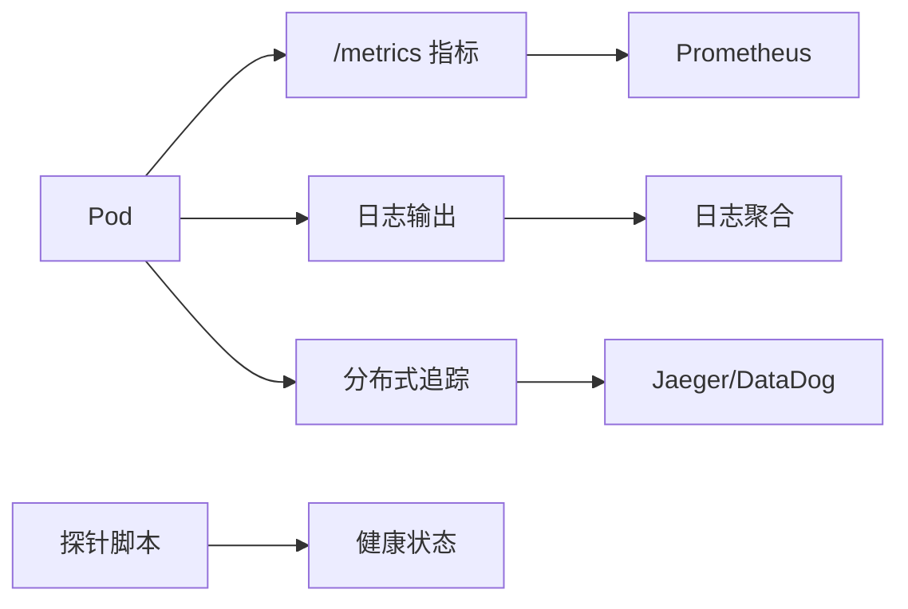
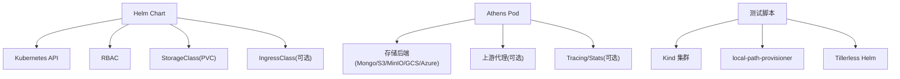

# Kubernetes 集群部署

<cite>
**本文引用的文件**
- [安装到 Kubernetes](file://docs/content/install/install-on-kubernetes.md)
- [Helm RBAC 配置](file://docs/content/install/helm-rbac.yaml)
- [Dockerfile（代理）](file://cmd/proxy/Dockerfile)
- [开发配置示例](file://config.dev.toml)
- [Compose 示例](file://docker-compose.yml)
- [本地路径 Provisioner 清单](file://test/local-path-provisioner.yaml)
- [Chart 测试配置](file://test/ct.yaml)
- [端到端测试脚本](file://test/e2e-kind.sh)
- [健康检查探针](file://scripts/liveness_probe/main.go)
- [统计导出器](file://pkg/observ/stats.go)
- [基础认证中间件](file://cmd/proxy/actions/basicauth.go)
</cite>

## 目录
1. [简介](#简介)
2. [项目结构](#项目结构)
3. [核心组件](#核心组件)
4. [架构总览](#架构总览)
5. [详细组件分析](#详细组件分析)
6. [依赖关系分析](#依赖关系分析)
7. [性能考量](#性能考量)
8. [故障排除指南](#故障排除指南)
9. [结论](#结论)
10. [附录](#附录)

## 简介
本指南面向在 Kubernetes 集群中部署 Athens 代理服务的用户，覆盖 Helm Chart 部署、Deployment、Service、ConfigMap、Ingress、TLS 证书、存储卷、资源限制、滚动更新与扩缩容、网络策略与 RBAC、以及监控与日志等主题。文档内容基于仓库中的官方安装文档、Helm RBAC 配置、Dockerfile、示例配置与测试脚本整理而成。

## 项目结构
与 Kubernetes 部署直接相关的文件主要集中在以下位置：
- 安装与 Helm 配置：docs/content/install/*
- 应用镜像构建：cmd/proxy/Dockerfile
- 运行时配置示例：config.dev.toml
- 本地存储类与测试：test/*
- 健康检查与可观测性：scripts/liveness_probe/*、pkg/observ/*

**图表来源**
- [安装到 Kubernetes](file://docs/content/install/install-on-kubernetes.md#L1-L303)
- [Helm RBAC 配置](file://docs/content/install/helm-rbac.yaml#L1-L19)
- [Dockerfile（代理）](file://cmd/proxy/Dockerfile#L1-L61)
- [开发配置示例](file://config.dev.toml#L1-L628)
- [本地路径 Provisioner 清单](file://test/local-path-provisioner.yaml#L1-L109)
- [Chart 测试配置](file://test/ct.yaml#L1-L5)
- [端到端测试脚本](file://test/e2e-kind.sh#L55-L118)
- [健康检查探针](file://scripts/liveness_probe/main.go#L1-L59)
- [统计导出器](file://pkg/observ/stats.go#L45-L90)

**章节来源**
- [安装到 Kubernetes](file://docs/content/install/install-on-kubernetes.md#L1-L303)
- [Helm RBAC 配置](file://docs/content/install/helm-rbac.yaml#L1-L19)
- [Dockerfile（代理）](file://cmd/proxy/Dockerfile#L1-L61)
- [开发配置示例](file://config.dev.toml#L1-L628)
- [本地路径 Provisioner 清单](file://test/local-path-provisioner.yaml#L1-L109)
- [Chart 测试配置](file://test/ct.yaml#L1-L5)
- [端到端测试脚本](file://test/e2e-kind.sh#L55-L118)
- [健康检查探针](file://scripts/liveness_probe/main.go#L1-L59)
- [统计导出器](file://pkg/observ/stats.go#L45-L90)

## 核心组件
- Helm Chart 与命名空间：通过 Helm 仓库添加与初始化，部署到指定命名空间，默认创建 ClusterIP 服务。
- Deployment：单实例或多副本部署，支持资源请求与限制、探针、卷挂载。
- Service：ClusterIP、NodePort 或 LoadBalancer，按需暴露。
- ConfigMap/Secret：通过 values.yaml 或外部密钥管理注入配置与凭据。
- Ingress：可选创建，结合 cert-manager 与 nginx-ingress 控制器实现 TLS 终止与域名路由。
- 存储：disk（emptyDir 或 PVC）、Mongo、S3/MinIO、GCS、Azure Blob、外部存储等。
- 可观测性：Prometheus 指标端点、日志级别与格式、Tracing 导出器配置。

**章节来源**
- [安装到 Kubernetes](file://docs/content/install/install-on-kubernetes.md#L80-L303)
- [开发配置示例](file://config.dev.toml#L122-L628)

## 架构总览
下图展示 Athens 在 Kubernetes 中的典型部署拓扑：Helm Chart 创建 Deployment、Service 与可选 Ingress；存储后端可为磁盘或云存储；Ingress 接入外部流量并通过 TLS 证书终止。

**图表来源**
- [安装到 Kubernetes](file://docs/content/install/install-on-kubernetes.md#L192-L233)
- [开发配置示例](file://config.dev.toml#L122-L241)

## 详细组件分析

### Helm 部署与 RBAC
- Helm 初始化与 RBAC：在启用了 RBAC 的集群中，先创建 ServiceAccount 与 ClusterRoleBinding，再初始化 Tiller；非 RBAC 集群可直接初始化。
- Chart 仓库与安装：添加 gomods 仓库，使用默认值安装至命名空间，或通过 --set/-f 注入自定义值。
- 命名空间与权限：建议使用独立命名空间隔离 Athens 资源。

**图表来源**
- [Helm RBAC 配置](file://docs/content/install/helm-rbac.yaml#L1-L19)
- [安装到 Kubernetes](file://docs/content/install/install-on-kubernetes.md#L49-L98)

**章节来源**
- [Helm RBAC 配置](file://docs/content/install/helm-rbac.yaml#L1-L19)
- [安装到 Kubernetes](file://docs/content/install/install-on-kubernetes.md#L49-L98)

### Deployment 与 Pod 规格
- 镜像与入口：容器镜像暴露 3000 端口，入口以 tini 启动，CMD 指向代理二进制并加载配置文件。
- 环境变量与配置：可通过环境变量覆盖配置项，如存储类型、超时、日志级别、Tracing、Stats 等。
- 探针：健康检查与存活探针可用于就绪与存活判断，配合滚动更新。
- 卷与存储：支持 emptyDir、PVC、云存储后端；生产建议 PVC 或云存储。
- 资源限制：可通过 values.yaml 设置 requests/limits，避免资源争抢。

**图表来源**
- [Dockerfile（代理）](file://cmd/proxy/Dockerfile#L30-L61)
- [开发配置示例](file://config.dev.toml#L116-L143)

**章节来源**
- [Dockerfile（代理）](file://cmd/proxy/Dockerfile#L1-L61)
- [开发配置示例](file://config.dev.toml#L116-L143)

### Service 与负载均衡
- Service 类型：默认 ClusterIP；可切换为 NodePort 或 LoadBalancer 以暴露到集群外。
- Ingress：可选启用，结合注解与 TLS Secret 实现域名路由与证书管理。
- 上游代理：可配置上游模块仓库（如 GoCenter、proxy.golang.org 或其他 Athens）。

**图表来源**
- [安装到 Kubernetes](file://docs/content/install/install-on-kubernetes.md#L192-L233)

**章节来源**
- [安装到 Kubernetes](file://docs/content/install/install-on-kubernetes.md#L192-L256)

### ConfigMap 与 Secret
- ConfigMap：存放配置文件（如 config.toml），通过挂载方式注入到容器。
- Secret：存放敏感信息（如 .netrc、gitconfig、令牌、证书等），通过挂载或环境变量注入。
- 外部密钥：可使用外部密钥管理（如 Vault、KMS）与 SecretProviderClass（CSI）集成。

**章节来源**
- [安装到 Kubernetes](file://docs/content/install/install-on-kubernetes.md#L258-L303)

### 存储后端与持久化
- Disk：默认 emptyDir；生产建议 PVC，配置 accessMode、size、storageClass。
- Mongo：提供连接串与数据库名；支持证书与不安全连接参数。
- S3/MinIO/GCS/Azure Blob：分别配置区域、桶/容器、凭据与端点。
- 外部存储：通过 URL 指定外部存储层实现。

**图表来源**
- [安装到 Kubernetes](file://docs/content/install/install-on-kubernetes.md#L126-L191)
- [开发配置示例](file://config.dev.toml#L392-L628)

**章节来源**
- [安装到 Kubernetes](file://docs/content/install/install-on-kubernetes.md#L126-L191)
- [开发配置示例](file://config.dev.toml#L392-L628)

### Ingress、TLS 与证书管理
- Ingress 启用：通过 values.yaml 启用 ingress.enabled，并配置 hosts、annotations、tls。
- 证书管理：结合 cert-manager 与 Let’s Encrypt，自动签发与续期。
- 控制器：使用 nginx-ingress controller 提供 SSL 终止与重定向。

**章节来源**
- [安装到 Kubernetes](file://docs/content/install/install-on-kubernetes.md#L200-L233)

### 滚动更新、回滚与扩缩容
- 滚动更新：通过 Deployment 的滚动策略控制最大不可用与最大超出；结合探针确保平滑替换。
- 回滚：通过 kubectl rollout undo 回退到历史版本。
- 扩缩容：通过 kubectl scale 或 HPA（CPU/内存/自定义指标）实现弹性伸缩。

**章节来源**
- [安装到 Kubernetes](file://docs/content/install/install-on-kubernetes.md#L99-L118)

### 网络策略、安全上下文与 RBAC
- 网络策略：限制入站/出站流量，仅放行必要的端口与来源。
- 安全上下文：设置非 root 用户、只读根文件系统、禁用特权提升等。
- RBAC：为 Athens ServiceAccount 授予最小权限，避免使用 cluster-admin。

**章节来源**
- [Helm RBAC 配置](file://docs/content/install/helm-rbac.yaml#L1-L19)

### 监控集成、日志与可观测性
- 指标端点：启用 Prometheus 导出器后，/metrics 暴露指标；可与 Prometheus/Grafana 集成。
- 日志：配置日志级别与格式；结合 Sidecar（如 Fluent Bit/Vector）采集。
- Tracing：配置 TraceExporter（如 Jaeger、DataDog、Stackdriver）与 Exporter URL。
- 健康检查：探针脚本可验证上游代理可达性，辅助就绪/存活判断。

**图表来源**
- [统计导出器](file://pkg/observ/stats.go#L45-L90)
- [健康检查探针](file://scripts/liveness_probe/main.go#L1-L59)

**章节来源**
- [统计导出器](file://pkg/observ/stats.go#L45-L90)
- [健康检查探针](file://scripts/liveness_probe/main.go#L1-L59)

## 依赖关系分析
- Helm Chart 依赖：Kubernetes API、RBAC、StorageClass（PVC）、IngressClass（可选）。
- 应用依赖：存储后端（Mongo/S3/MinIO/GCS/Azure）、上游代理（可选）、Tracing/Stats 导出器（可选）。
- 测试与本地环境：Kind、local-path-provisioner、Tillerless Helm 插件。

**图表来源**
- [Chart 测试配置](file://test/ct.yaml#L1-L5)
- [本地路径 Provisioner 清单](file://test/local-path-provisioner.yaml#L1-L109)
- [端到端测试脚本](file://test/e2e-kind.sh#L55-L118)
- [安装到 Kubernetes](file://docs/content/install/install-on-kubernetes.md#L126-L191)

**章节来源**
- [Chart 测试配置](file://test/ct.yaml#L1-L5)
- [本地路径 Provisioner 清单](file://test/local-path-provisioner.yaml#L1-L109)
- [端到端测试脚本](file://test/e2e-kind.sh#L55-L118)
- [安装到 Kubernetes](file://docs/content/install/install-on-kubernetes.md#L126-L191)

## 性能考量
- 资源规划：根据并发下载与协议处理能力设置 CPU/内存 requests/limits。
- 并发参数：GoGetWorkers、ProtocolWorkers 影响并发与资源占用。
- 存储性能：PVC 使用高性能 StorageClass；云存储注意延迟与吞吐。
- 缓存策略：合理设置上游代理与本地缓存命中率，减少重复下载。
- 探针与健康：健康/存活探针超时与周期应与实例规模匹配，避免误判。

[本节为通用指导，无需特定文件引用]

## 故障排除指南
- Helm 初始化失败：确认 RBAC 已创建且 Tiller 就绪；检查 kube-system 中 Pod 状态。
- PVC 无法绑定：检查 StorageClass 是否为默认类，节点卷绑定模式是否符合预期。
- Ingress 未生效：确认 IngressClass 名称与控制器已安装，证书 Secret 是否存在。
- 认证问题：确认 Basic Auth 用户名/密码或 .netrc/gitconfig Secret 是否正确挂载。
- 上游访问失败：检查 GOPROXY/Upstream URL 可达性与网络策略放行。
- 指标不可见：确认 Prometheus 导出器已启用且端点可达；检查 ServiceMonitor/Service 配置。
- 探针失败：检查探针脚本对上游代理的连通性与超时设置。

**章节来源**
- [安装到 Kubernetes](file://docs/content/install/install-on-kubernetes.md#L49-L98)
- [基础认证中间件](file://cmd/proxy/actions/basicauth.go#L1-L42)
- [健康检查探针](file://scripts/liveness_probe/main.go#L1-L59)
- [统计导出器](file://pkg/observ/stats.go#L45-L90)

## 结论
通过 Helm Chart 快速在 Kubernetes 中部署 Athens 代理，结合 ConfigMap/Secret、Ingress 与多种存储后端，可满足从开发到生产的多样化需求。建议在生产环境中启用 PVC/云存储、严格的网络策略与 RBAC、完善的监控与日志体系，并通过探针与合理的资源限制保障稳定性与性能。

[本节为总结，无需特定文件引用]

## 附录
- 常用命令参考
  - 添加 Helm 仓库并更新：helm repo add gomods https://gomods.github.io/athens-charts && helm repo update
  - 安装到命名空间：helm install athens gomods/athens-proxy --namespace athens
  - 自定义值安装：helm install athens gomods/athens-proxy -n athens --namespace athens -f override-values.yaml
  - 查看 Pod/Service/Ingress：kubectl get pods/services/ingress -n athens
  - 查看日志：kubectl logs -n athens -l app.kubernetes.io/name=athens-proxy
  - 滚动更新/回滚：kubectl set image deployment/athens ... && kubectl rollout undo deployment/athens
  - 扩缩容：kubectl scale deployment/athens --replicas=N

**章节来源**
- [安装到 Kubernetes](file://docs/content/install/install-on-kubernetes.md#L80-L118)