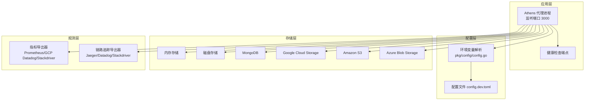
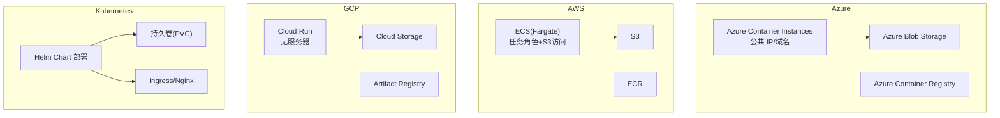
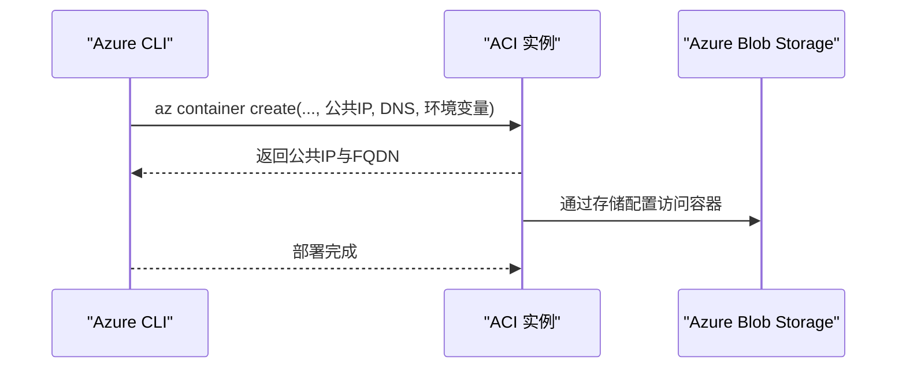
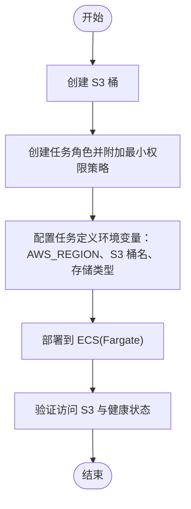
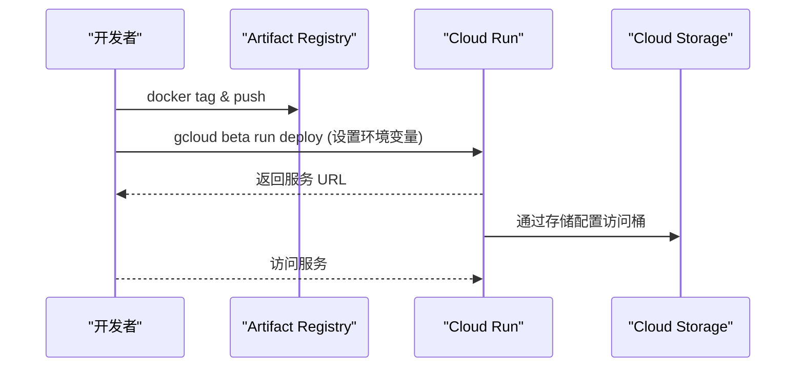
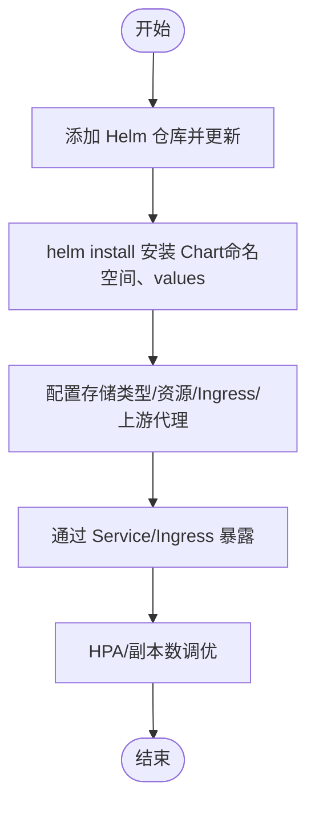
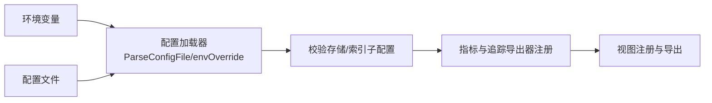
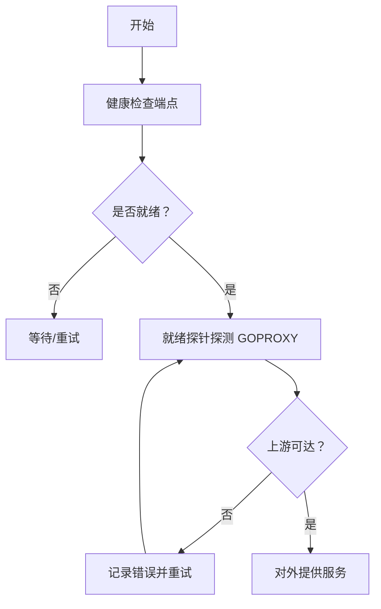

# 云平台部署

<cite>
**本文引用的文件**
- [cmd/proxy/Dockerfile](file://cmd/proxy/Dockerfile)
- [config.dev.toml](file://config.dev.toml)
- [pkg/config/config.go](file://pkg/config/config.go)
- [pkg/config/storage.go](file://pkg/config/storage.go)
- [docs/content/install/install-on-aci.md](file://docs/content/install/install-on-aci.md)
- [docs/content/install/install-on-aws-ecs-fargate.md](file://docs/content/install/install-on-aws-ecs-fargate.md)
- [docs/content/install/install-on-google-cloud-run.md](file://docs/content/install/install-on-google-cloud-run.md)
- [docs/content/install/install-on-kubernetes.md](file://docs/content/install/install-on-kubernetes.md)
- [docs/content/configuration/storage.md](file://docs/content/configuration/storage.md)
- [docs/content/configuration/logging.md](file://docs/content/configuration/logging.md)
- [pkg/observ/stats.go](file://pkg/observ/stats.go)
- [pkg/observ/observ.go](file://pkg/observ/observ.go)
- [cmd/proxy/actions/health.go](file://cmd/proxy/actions/health.go)
- [scripts/liveness_probe/main.go](file://scripts/liveness_probe/main.go)
</cite>

## 目录
1. [简介](#简介)
2. [项目结构](#项目结构)
3. [核心组件](#核心组件)
4. [架构总览](#架构总览)
5. [详细组件分析](#详细组件分析)
6. [依赖关系分析](#依赖关系分析)
7. [性能与成本优化](#性能与成本优化)
8. [故障排查指南](#故障排查指南)
9. [结论](#结论)
10. [附录](#附录)

## 简介
本文件面向在主流云平台上部署 Athens 代理（Go 模块代理）的工程实践，覆盖 Azure Container Instances、AWS ECS Fargate、Google Cloud Run 等无服务器/容器服务，以及在 Kubernetes 上的 Helm 部署。内容包括：
- 各平台部署流程、资源配置要点与成本优化策略
- 平台特定配置（IAM/权限、网络与存储访问）
- 自动扩缩容、蓝绿与金丝雀发布建议
- 云原生监控、日志聚合与告警
- 跨区域部署、灾备与数据备份策略

## 项目结构
- 应用入口与镜像构建：cmd/proxy/Dockerfile 定义了运行时环境、暴露端口与默认启动参数；config.dev.toml 提供默认配置模板。
- 配置系统：pkg/config/config.go 解析配置文件与环境变量，支持多存储后端与索引类型；pkg/config/storage.go 声明存储子配置。
- 文档与安装指南：docs/content/install 下包含各平台部署步骤与示例；docs/content/configuration 下包含存储、日志等配置说明。
- 观测性：pkg/observ/stats.go 与 pkg/observ/observ.go 提供指标导出与链路追踪注册能力。
- 健康检查：cmd/proxy/actions/health.go 提供健康端点；scripts/liveness_probe/main.go 提供就绪探针示例。

图表来源
- [cmd/proxy/Dockerfile](file://cmd/proxy/Dockerfile#L56-L61)
- [config.dev.toml](file://config.dev.toml#L122-L127)
- [pkg/config/config.go](file://pkg/config/config.go#L22-L66)
- [pkg/observ/stats.go](file://pkg/observ/stats.go#L19-L46)
- [pkg/observ/observ.go](file://pkg/observ/observ.go#L17-L31)

章节来源
- [cmd/proxy/Dockerfile](file://cmd/proxy/Dockerfile#L56-L61)
- [config.dev.toml](file://config.dev.toml#L122-L127)
- [pkg/config/config.go](file://pkg/config/config.go#L22-L66)

## 核心组件
- 配置加载与校验：支持从文件与环境变量加载，自动校验必填项与存储/索引子配置合法性。
- 存储后端：支持 memory、disk、mongo、gcp、s3、azureblob、external 等；通过环境变量或配置文件指定。
- 指标与追踪：可选 Prometheus、Datadog、Stackdriver 指标导出；可选 Jaeger、Datadog、Stackdriver 追踪导出。
- 健康检查：提供 / 200 OK 的健康端点，便于平台探针使用。
- 镜像与运行：基于 Alpine 的精简镜像，暴露 3000 端口，内置常见版本控制工具以支持模块拉取。

章节来源
- [pkg/config/config.go](file://pkg/config/config.go#L129-L144)
- [pkg/config/config.go](file://pkg/config/config.go#L299-L333)
- [pkg/config/storage.go](file://pkg/config/storage.go#L4-L12)
- [pkg/observ/stats.go](file://pkg/observ/stats.go#L19-L46)
- [pkg/observ/observ.go](file://pkg/observ/observ.go#L17-L31)
- [cmd/proxy/actions/health.go](file://cmd/proxy/actions/health.go#L7-L11)
- [cmd/proxy/Dockerfile](file://cmd/proxy/Dockerfile#L56-L61)

## 架构总览
下图展示 Athens 在不同云平台上的典型部署形态与资源交互：

图表来源
- [docs/content/install/install-on-aci.md](file://docs/content/install/install-on-aci.md#L30-L67)
- [docs/content/install/install-on-aws-ecs-fargate.md](file://docs/content/install/install-on-aws-ecs-fargate.md#L117-L131)
- [docs/content/install/install-on-google-cloud-run.md](file://docs/content/install/install-on-google-cloud-run.md#L56-L75)
- [docs/content/install/install-on-kubernetes.md](file://docs/content/install/install-on-kubernetes.md#L80-L96)

## 详细组件分析

### Azure Container Instances（ACI）
- 部署要点
  - 使用公共 IP 与 DNS 名称暴露实例；支持本地磁盘驱动与 MongoDB 驱动。
  - 环境变量包括资源组、容器名、区域、DNS 名称、存储类型与存储连接串等。
- 成本优化
  - 选择合适区域以降低公网带宽与出口费用；按需选择磁盘容量。
- 安全与网络
  - 仅暴露必要端口；结合 DNS 名称与防火墙策略限制访问。
- 参考命令与变量
  - 创建容器、设置环境变量、公开 IP 与 FQDN 输出。

图表来源
- [docs/content/install/install-on-aci.md](file://docs/content/install/install-on-aci.md#L30-L67)

章节来源
- [docs/content/install/install-on-aci.md](file://docs/content/install/install-on-aci.md#L16-L67)

### AWS ECS Fargate（ECS）
- 部署要点
  - 使用 S3 作为持久化存储；为任务角色配置最小权限策略（允许 ListBucket、GetObject、PutObject、DeleteObject 等）。
  - 通过环境变量设置 AWS 区域、S3 桶名与存储类型。
- 成本优化
  - 选择合适的 Fargate CPU/内存配额；启用压缩与缓存减少请求量。
- 安全与网络
  - 将容器置于私有子网并配置 NAT 网关访问上游；限制 IAM 角色权限。
- 参考配置
  - 任务定义中的环境变量与 IAM 策略示例。

图表来源
- [docs/content/install/install-on-aws-ecs-fargate.md](file://docs/content/install/install-on-aws-ecs-fargate.md#L25-L131)

章节来源
- [docs/content/install/install-on-aws-ecs-fargate.md](file://docs/content/install/install-on-aws-ecs-fargate.md#L17-L131)

### Google Cloud Run
- 部署要点
  - 使用 GCS 作为存储；先将镜像推送到 Artifact Registry，再通过 gcloud beta run deploy 部署。
  - 设置环境变量：存储类型、项目 ID、GCS 桶名等。
- 成本优化
  - 利用免费配额；合理设置并发与实例数上限。
- 安全与网络
  - 通过 IAM 控制对 GCS 的访问；启用未认证访问前评估安全影响。
- 参考命令
  - 推送镜像、部署服务、查询主机名。

图表来源
- [docs/content/install/install-on-google-cloud-run.md](file://docs/content/install/install-on-google-cloud-run.md#L37-L75)

章节来源
- [docs/content/install/install-on-google-cloud-run.md](file://docs/content/install/install-on-google-cloud-run.md#L14-L75)

### Kubernetes（Helm）
- 部署要点
  - 使用 Helm Chart 部署，默认 ClusterIP 服务；可通过 values 调整副本数、资源请求/限制、Ingress 与存储类型。
  - 支持 disk、mongo、s3、minio、gcp 等存储；可配置上游代理与 .netrc/gitconfig 秘钥。
- 成本优化
  - 合理设置资源配额与 HPA；使用亲和/反亲和避免热点。
- 安全与网络
  - 启用 RBAC；通过 Ingress 控制外部访问；Secret 管理敏感信息。
- 参考配置
  - Helm 安装、副本数、资源、存储类型、Ingress 与上游代理等。

图表来源
- [docs/content/install/install-on-kubernetes.md](file://docs/content/install/install-on-kubernetes.md#L80-L303)

章节来源
- [docs/content/install/install-on-kubernetes.md](file://docs/content/install/install-on-kubernetes.md#L80-L303)

## 依赖关系分析
- 配置加载链
  - 优先使用用户指定配置文件；否则回退默认值；随后由环境变量覆盖。
  - 对存储与索引子配置进行针对性校验，确保字段完整与合法。
- 存储后端选择
  - 通过 StorageType 与对应子配置决定后端行为；支持多种云厂商对象存储与数据库。
- 观测性导出
  - 指标导出器注册 /metrics 端点；追踪导出器根据环境变量选择目标系统。

图表来源
- [pkg/config/config.go](file://pkg/config/config.go#L129-L144)
- [pkg/config/config.go](file://pkg/config/config.go#L299-L333)
- [pkg/observ/stats.go](file://pkg/observ/stats.go#L19-L46)
- [pkg/observ/observ.go](file://pkg/observ/observ.go#L17-L31)

章节来源
- [pkg/config/config.go](file://pkg/config/config.go#L129-L144)
- [pkg/config/config.go](file://pkg/config/config.go#L299-L333)
- [pkg/observ/stats.go](file://pkg/observ/stats.go#L19-L46)
- [pkg/observ/observ.go](file://pkg/observ/observ.go#L17-L31)

## 性能与成本优化
- 并发与工作线程
  - GoGetWorkers 与 ProtocolWorkers 控制并发抓取与协议处理能力，需结合实例规格与存储后端吞吐调整。
- 存储后端选择
  - 云对象存储（S3/GCS/ABS）具备高可用与弹性扩展优势；数据库（Mongo）适合需要强一致性的场景。
- 指标与追踪
  - 启用 Prometheus 指标导出，结合云厂商监控服务进行告警与容量规划。
- 镜像与运行时
  - 使用精简基础镜像与静态二进制，缩短启动时间；合理设置探针超时与重试策略。

章节来源
- [config.dev.toml](file://config.dev.toml#L48-L74)
- [pkg/observ/stats.go](file://pkg/observ/stats.go#L19-L46)
- [cmd/proxy/Dockerfile](file://cmd/proxy/Dockerfile#L30-L61)

## 故障排查指南
- 健康检查
  - 使用健康端点确认服务存活；结合平台探针（如 Cloud Run/ACI/EC2）进行就绪判断。
- 就绪探针
  - 参考 liveness_probe 示例脚本，通过 GOPROXY 环境变量探测上游可达性，避免在代理未就绪时接收流量。
- 日志与运行时
  - 标准日志支持 plain/json 与级别控制；在 GCP 运行时可适配日志字段命名。
- 常见问题定位
  - 存储连接失败：核对桶/密钥/区域/权限策略；检查 IAM 角色与 VPC 出口策略。
  - 并发瓶颈：提升 GoGetWorkers/ProtocolWorkers 或增加副本数；评估存储后端延迟。

图表来源
- [cmd/proxy/actions/health.go](file://cmd/proxy/actions/health.go#L7-L11)
- [scripts/liveness_probe/main.go](file://scripts/liveness_probe/main.go#L17-L59)

章节来源
- [cmd/proxy/actions/health.go](file://cmd/proxy/actions/health.go#L7-L11)
- [scripts/liveness_probe/main.go](file://scripts/liveness_probe/main.go#L17-L59)
- [docs/content/configuration/logging.md](file://docs/content/configuration/logging.md#L9-L18)

## 结论
通过在 Azure ACI、AWS ECS Fargate、Google Cloud Run 与 Kubernetes 上采用统一的配置模型与可观测性能力，Athens 可在不同云环境中实现高可用、可扩展与低成本的 Go 模块代理服务。建议结合业务峰值与 SLA 要求，选择合适的存储后端与扩缩容策略，并完善监控、日志与告警体系。

## 附录

### 平台特定配置清单
- Azure Container Instances
  - 必要环境变量：资源组、容器名、区域、DNS 名称、存储类型与存储连接串。
  - 参考路径：[docs/content/install/install-on-aci.md](file://docs/content/install/install-on-aci.md#L16-L67)
- AWS ECS Fargate
  - 必要环境变量：AWS_REGION、S3 桶名、存储类型。
  - IAM 最小权限策略：ListBucket、GetBucketLocation、GetObject、PutObject、DeleteObject。
  - 参考路径：[docs/content/install/install-on-aws-ecs-fargate.md](file://docs/content/install/install-on-aws-ecs-fargate.md#L46-L131)
- Google Cloud Run
  - 必要环境变量：存储类型、项目 ID、GCS 桶名。
  - 参考路径：[docs/content/install/install-on-google-cloud-run.md](file://docs/content/install/install-on-google-cloud-run.md#L35-L75)
- Kubernetes（Helm）
  - 关键配置：副本数、资源请求/限制、存储类型、Ingress、上游代理。
  - 参考路径：[docs/content/install/install-on-kubernetes.md](file://docs/content/install/install-on-kubernetes.md#L97-L303)

### 存储后端与配置参考
- 支持类型：memory、disk、mongo、gcp、s3、azureblob、external。
- 配置字段与环境变量映射详见：
  - [docs/content/configuration/storage.md](file://docs/content/configuration/storage.md#L38-L530)
  - [pkg/config/storage.go](file://pkg/config/storage.go#L4-L12)
  - [pkg/config/config.go](file://pkg/config/config.go#L299-L333)

### 观测性与告警
- 指标导出器：Prometheus、Datadog、Stackdriver。
- 追踪导出器：Jaeger、Datadog、Stackdriver。
- 参考路径：
  - [pkg/observ/stats.go](file://pkg/observ/stats.go#L19-L46)
  - [pkg/observ/observ.go](file://pkg/observ/observ.go#L17-L31)