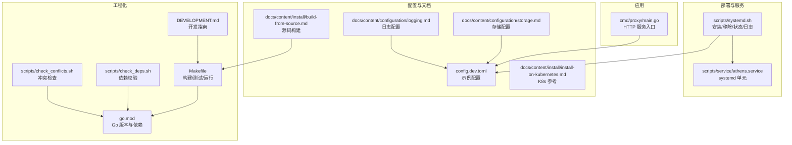
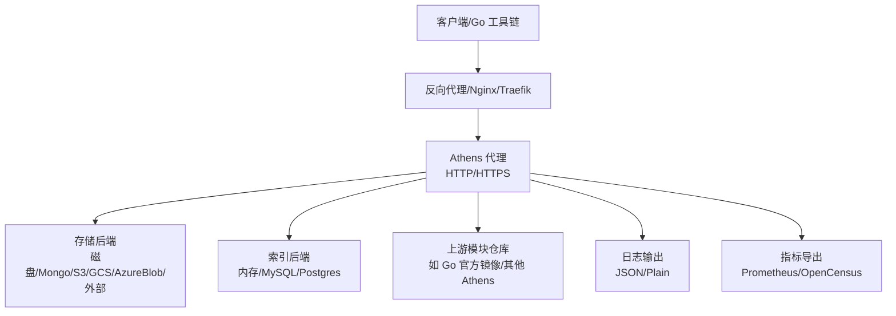
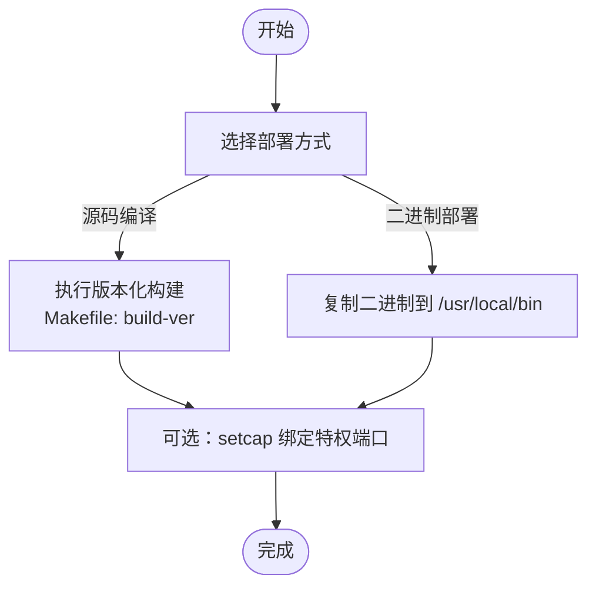
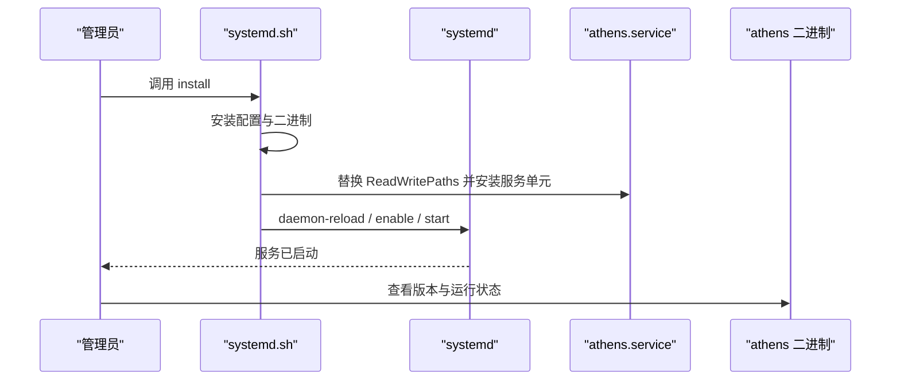
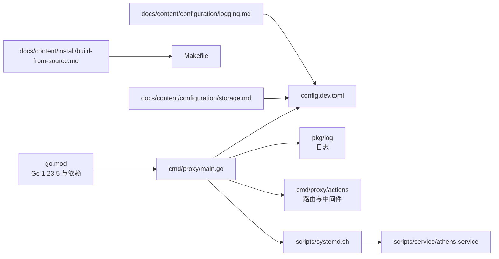

# 传统服务器部署

<cite>
**本文引用的文件**
- [cmd/proxy/main.go](file://cmd/proxy/main.go)
- [scripts/service/athens.service](file://scripts/service/athens.service)
- [scripts/systemd.sh](file://scripts/systemd.sh)
- [docs/content/install/build-from-source.md](file://docs/content/install/build-from-source.md)
- [docs/content/configuration/storage.md](file://docs/content/configuration/storage.md)
- [docs/content/configuration/logging.md](file://docs/content/configuration/logging.md)
- [docs/content/install/install-on-kubernetes.md](file://docs/content/install/install-on-kubernetes.md)
- [config.dev.toml](file://config.dev.toml)
- [Makefile](file://Makefile)
- [go.mod](file://go.mod)
- [DEVELOPMENT.md](file://DEVELOPMENT.md)
- [scripts/check_deps.sh](file://scripts/check_deps.sh)
- [scripts/check_conflicts.sh](file://scripts/check_conflicts.sh)
</cite>

## 目录
1. [简介](#简介)
2. [项目结构](#项目结构)
3. [核心组件](#核心组件)
4. [架构总览](#架构总览)
5. [详细组件分析](#详细组件分析)
6. [依赖关系分析](#依赖关系分析)
7. [性能考虑](#性能考虑)
8. [故障排除指南](#故障排除指南)
9. [结论](#结论)
10. [附录](#附录)

## 简介
本文件面向在物理服务器或虚拟机上以“传统服务器”方式部署 Athens 代理的运维与开发人员，提供从二进制部署到源码编译、systemd 服务配置与自启动、系统要求与依赖、网络与安全（防火墙、SSL 证书、反向代理）、性能调优、资源监控与日志轮转、备份与升级、以及故障排除的完整实践指南。

## 项目结构
- 应用入口位于命令行子项目，负责加载配置、初始化日志、构建 HTTP 处理器、启动 HTTP(S) 服务，并支持 pprof 性能分析端口。
- 部署脚本与服务单元位于 scripts 目录，提供 systemd 安装、移除、状态查询与日志查看等自动化能力。
- 文档目录包含构建与配置说明，涵盖存储后端、日志、以及可选的 Kubernetes 部署参考。
- Makefile 提供构建、测试、运行等常用目标；go.mod 描述 Go 版本与依赖；开发指南提供运行与调试建议。

**图示来源**
- [cmd/proxy/main.go](file://cmd/proxy/main.go#L1-L128)
- [scripts/service/athens.service](file://scripts/service/athens.service#L1-L64)
- [scripts/systemd.sh](file://scripts/systemd.sh#L1-L171)
- [docs/content/install/build-from-source.md](file://docs/content/install/build-from-source.md#L1-L36)
- [docs/content/configuration/storage.md](file://docs/content/configuration/storage.md#L1-L530)
- [docs/content/configuration/logging.md](file://docs/content/configuration/logging.md#L1-L18)
- [docs/content/install/install-on-kubernetes.md](file://docs/content/install/install-on-kubernetes.md#L1-L303)
- [config.dev.toml](file://config.dev.toml#L1-L628)
- [Makefile](file://Makefile#L1-L131)
- [go.mod](file://go.mod#L1-L194)
- [DEVELOPMENT.md](file://DEVELOPMENT.md#L1-L314)
- [scripts/check_deps.sh](file://scripts/check_deps.sh#L1-L23)
- [scripts/check_conflicts.sh](file://scripts/check_conflicts.sh#L1-L23)

**章节来源**
- [cmd/proxy/main.go](file://cmd/proxy/main.go#L1-L128)
- [scripts/service/athens.service](file://scripts/service/athens.service#L1-L64)
- [scripts/systemd.sh](file://scripts/systemd.sh#L1-L171)
- [docs/content/install/build-from-source.md](file://docs/content/install/build-from-source.md#L1-L36)
- [docs/content/configuration/storage.md](file://docs/content/configuration/storage.md#L1-L530)
- [docs/content/configuration/logging.md](file://docs/content/configuration/logging.md#L1-L18)
- [docs/content/install/install-on-kubernetes.md](file://docs/content/install/install-on-kubernetes.md#L1-L303)
- [config.dev.toml](file://config.dev.toml#L1-L628)
- [Makefile](file://Makefile#L1-L131)
- [go.mod](file://go.mod#L1-L194)
- [DEVELOPMENT.md](file://DEVELOPMENT.md#L1-L314)
- [scripts/check_deps.sh](file://scripts/check_deps.sh#L1-L23)
- [scripts/check_conflicts.sh](file://scripts/check_conflicts.sh#L1-L23)

## 核心组件
- HTTP 服务入口：解析命令行参数与配置，初始化日志，构造 HTTP 处理器，选择监听 TCP 或 Unix 套接字，按需启用 TLS，支持 pprof 端口，优雅关闭。
- systemd 服务单元：定义用户/组、工作目录、重启策略、资源限制、安全增强、日志目录、优雅停止信号与超时等。
- 配置文件：集中管理端口、日志级别与格式、存储类型与参数、上游代理、认证、索引、导出器（Prometheus/OpenCensus）等。
- 构建与运行：Makefile 提供二进制构建与版本化构建；开发指南提供本地运行与容器运行两种方式；check_* 脚本用于 CI 校验。

**章节来源**
- [cmd/proxy/main.go](file://cmd/proxy/main.go#L24-L128)
- [scripts/service/athens.service](file://scripts/service/athens.service#L7-L64)
- [config.dev.toml](file://config.dev.toml#L1-L628)
- [Makefile](file://Makefile#L10-L26)
- [DEVELOPMENT.md](file://DEVELOPMENT.md#L83-L117)
- [scripts/check_deps.sh](file://scripts/check_deps.sh#L1-L23)
- [scripts/check_conflicts.sh](file://scripts/check_conflicts.sh#L1-L23)

## 架构总览
下图展示传统服务器部署的关键交互：客户端请求经由反向代理（可选）到达 Athens，后者根据配置选择存储后端与索引后端，必要时向上游模块仓库拉取，最后返回响应。

**图示来源**
- [cmd/proxy/main.go](file://cmd/proxy/main.go#L59-L128)
- [docs/content/configuration/storage.md](file://docs/content/configuration/storage.md#L1-L530)
- [docs/content/configuration/logging.md](file://docs/content/configuration/logging.md#L1-L18)
- [config.dev.toml](file://config.dev.toml#L122-L235)

## 详细组件分析

### 二进制部署与源码编译
- 源码编译
  - 使用 Makefile 的版本化构建目标生成带版本信息的二进制，便于发布与审计。
  - 开发指南提供在宿主机直接运行与通过 Docker Compose 运行两种方式，便于快速验证。
- 二进制部署
  - 将构建产物复制到系统路径，赋予绑定特权端口的能力（非 root），并配合 systemd 自启动与管理。

**图示来源**
- [Makefile](file://Makefile#L14-L19)
- [docs/content/install/build-from-source.md](file://docs/content/install/build-from-source.md#L1-L36)
- [DEVELOPMENT.md](file://DEVELOPMENT.md#L83-L117)
- [scripts/systemd.sh](file://scripts/systemd.sh#L46-L61)

**章节来源**
- [Makefile](file://Makefile#L10-L26)
- [docs/content/install/build-from-source.md](file://docs/content/install/build-from-source.md#L1-L36)
- [DEVELOPMENT.md](file://DEVELOPMENT.md#L83-L117)
- [scripts/systemd.sh](file://scripts/systemd.sh#L46-L61)

### systemd 服务配置与进程管理
- 服务单元要点
  - 用户与组：默认 www-data，可按需修改。
  - 执行命令：指向 /etc/athens/config.toml。
  - 优雅停止：mixed 模式 + SIGINT + 超时控制。
  - 资源限制：文件描述符上限、进程数上限。
  - 安全增强：私有临时目录、最小设备节点、只读系统目录、保留写权限的运行目录。
  - 能力边界：仅允许绑定特权端口，避免提权风险。
- 安装脚本功能
  - 安装配置、复制二进制、设置能力、替换服务单元中的可读写路径、启用并启动服务。
  - 支持卸载、状态查询、日志查看。

**图示来源**
- [scripts/systemd.sh](file://scripts/systemd.sh#L34-L81)
- [scripts/service/athens.service](file://scripts/service/athens.service#L1-L64)

**章节来源**
- [scripts/service/athens.service](file://scripts/service/athens.service#L7-L64)
- [scripts/systemd.sh](file://scripts/systemd.sh#L34-L81)

### 系统要求与依赖
- Go 版本
  - 项目使用 Go 1.23.5，建议在目标服务器安装对应版本或兼容版本。
- 外部依赖
  - 存储后端可能需要数据库或对象存储服务（如 MongoDB、S3、GCS、Azure Blob）。
  - 索引后端可选 MySQL/Postgres。
  - 日志与指标导出可选 Prometheus/OpenCensus/Jaeger/Stackdriver 等。
- 依赖校验
  - 使用脚本在 CI 中对 go.mod/go.sum 变更进行校验，避免版本冲突。
  - 使用脚本检测合并冲突标记，防止提交冲突文件。

**章节来源**
- [go.mod](file://go.mod#L1-L194)
- [docs/content/configuration/storage.md](file://docs/content/configuration/storage.md#L1-L530)
- [scripts/check_deps.sh](file://scripts/check_deps.sh#L1-L23)
- [scripts/check_conflicts.sh](file://scripts/check_conflicts.sh#L1-L23)

### 环境配置与网络
- 监听方式
  - 默认监听 TCP 端口；也可配置 Unix 域套接字（优先于 TCP）。
  - TLS 证书与密钥同时配置时启用 HTTPS。
- pprof 性能分析
  - 可在独立端口暴露 pprof，注意仅限内网访问，避免暴露给公网。
- 日志
  - 支持 plain/json 格式与多级日志级别；在非云运行时可直接使用 Logrus 输出。

**章节来源**
- [cmd/proxy/main.go](file://cmd/proxy/main.go#L64-L109)
- [config.dev.toml](file://config.dev.toml#L76-L98)
- [docs/content/configuration/logging.md](file://docs/content/configuration/logging.md#L1-L18)

### 防火墙与 SSL 证书
- 防火墙
  - 开放 Athens 监听端口（TCP 或 Unix 套接字所在路径）。
  - 如启用 pprof，仅开放内网访问。
- SSL 证书
  - 在配置中提供证书与密钥路径以启用 HTTPS。
  - 推荐通过反向代理统一管理证书与 TLS 终止，Athens 内部使用 HTTP 或本地 HTTPS。

**章节来源**
- [cmd/proxy/main.go](file://cmd/proxy/main.go#L105-L109)
- [config.dev.toml](file://config.dev.toml#L128-L133)

### 反向代理设置（Nginx/Traefik）
- 反向代理建议
  - 将域名解析到反向代理，由其统一处理证书与 TLS 终止，再将请求转发至 Athens。
  - 可在反向代理层配置健康检查、速率限制、缓存策略等。
- 参考
  - 文档提供了 Kubernetes Ingress 的示例，可类比到传统服务器的反向代理配置。

**章节来源**
- [docs/content/install/install-on-kubernetes.md](file://docs/content/install/install-on-kubernetes.md#L200-L233)

### 存储与索引配置
- 存储类型
  - 支持 memory、disk、mongo、gcp、minio、s3、azureblob、external 等。
  - 可通过配置文件或环境变量覆盖。
- 索引类型
  - 支持 none、memory、mysql、postgres。
- 分布式锁（Single Flight）
  - 当多实例共享同一存储时，可使用 etcd、redis、redis-sentinel、gcp、azureblob 等机制保证并发一致性。

**章节来源**
- [docs/content/configuration/storage.md](file://docs/content/configuration/storage.md#L1-L530)
- [config.dev.toml](file://config.dev.toml#L122-L321)

### 性能调优参数
- 并发与工作线程
  - GoGetWorkers：并发下载工作线程数，影响低性能实例的稳定性。
  - ProtocolWorkers：协议处理并发度。
- 超时与关闭
  - Timeout：外部网络调用超时。
  - ShutdownTimeout：优雅关闭等待超时。
- pprof
  - EnablePprof 与 PprofPort：仅在诊断时开启，避免长期暴露。

**章节来源**
- [config.dev.toml](file://config.dev.toml#L48-L120)
- [config.dev.toml](file://config.dev.toml#L323-L327)
- [config.dev.toml](file://config.dev.toml#L91-L98)

### 资源监控与日志轮转
- 指标导出
  - 支持 Prometheus 等导出器，便于集成监控系统。
- 日志
  - 支持 JSON/Plain 格式与多级日志级别；结合 systemd journal 与日志轮转工具（如 journald、logrotate）实现长期留存与压缩。
- 参考
  - 日志配置文档说明了标准结构化日志与云运行时差异。

**章节来源**
- [config.dev.toml](file://config.dev.toml#L232-L235)
- [docs/content/configuration/logging.md](file://docs/content/configuration/logging.md#L1-L18)

### 备份策略
- 存储后端
  - 对应各存储后端的备份策略：磁盘文件系统快照、对象存储版本控制与生命周期策略、数据库备份与恢复演练。
- 配置与证书
  - 备份 /etc/athens 下的配置文件与证书，确保可快速回滚与重建。

**章节来源**
- [docs/content/configuration/storage.md](file://docs/content/configuration/storage.md#L1-L530)
- [scripts/systemd.sh](file://scripts/systemd.sh#L83-L102)

### 升级流程与维护
- 升级步骤
  - 停止服务 → 备份配置与数据 → 部署新二进制 → 启动服务 → 健康检查。
- 维护
  - 定期检查日志、指标与存储容量；按需调整并发与超时参数；更新证书与上游配置。

**章节来源**
- [scripts/systemd.sh](file://scripts/systemd.sh#L83-L102)
- [DEVELOPMENT.md](file://DEVELOPMENT.md#L83-L117)

## 依赖关系分析

**图示来源**
- [go.mod](file://go.mod#L1-L194)
- [cmd/proxy/main.go](file://cmd/proxy/main.go#L1-L22)
- [config.dev.toml](file://config.dev.toml#L1-L628)
- [scripts/systemd.sh](file://scripts/systemd.sh#L1-L171)
- [scripts/service/athens.service](file://scripts/service/athens.service#L1-L64)
- [docs/content/install/build-from-source.md](file://docs/content/install/build-from-source.md#L1-L36)
- [docs/content/configuration/storage.md](file://docs/content/configuration/storage.md#L1-L530)
- [docs/content/configuration/logging.md](file://docs/content/configuration/logging.md#L1-L18)
- [Makefile](file://Makefile#L1-L131)

**章节来源**
- [go.mod](file://go.mod#L1-L194)
- [cmd/proxy/main.go](file://cmd/proxy/main.go#L1-L22)
- [scripts/systemd.sh](file://scripts/systemd.sh#L1-L171)

## 性能考虑
- 并发与资源
  - 合理设置 GoGetWorkers 与 ProtocolWorkers，避免在低配机器上耗尽内存或磁盘。
  - 为 systemd 服务配置合理的 LimitNOFILE/LimitNPROC，避免 FD/进程数成为瓶颈。
- 网络与存储
  - 优化 Timeout 与上游代理配置，减少慢请求拖累整体吞吐。
  - 对高并发场景选择强一致的分布式锁（Single Flight）机制。
- 监控与诊断
  - 启用 Prometheus 导出器，结合 pprof（仅诊断时）定位热点与阻塞点。

[本节为通用指导，无需特定文件分析]

## 故障排除指南
- 无法启动或端口占用
  - 检查端口是否被占用，确认配置文件中的 Port/UnixSocket 设置。
- 权限与能力
  - 若需要绑定 80/443，请确认已赋予 setcap 能力。
- 日志与状态
  - 使用 systemd 状态与日志命令查看服务状态与错误堆栈。
- 配置变更
  - 使用依赖校验与冲突检查脚本在 CI 中拦截问题。
- 升级回滚
  - 升级前备份配置与数据，失败时快速回滚。

**章节来源**
- [scripts/systemd.sh](file://scripts/systemd.sh#L104-L128)
- [scripts/systemd.sh](file://scripts/systemd.sh#L130-L150)
- [scripts/check_deps.sh](file://scripts/check_deps.sh#L1-L23)
- [scripts/check_conflicts.sh](file://scripts/check_conflicts.sh#L1-L23)

## 结论
通过上述步骤，可在传统服务器上稳定地部署与运维 Athens 代理。建议优先采用 systemd 管理服务，结合反向代理与统一证书管理，按需配置存储与索引后端，并建立完善的监控、日志轮转与备份策略，以保障生产环境的可用性与可维护性。

[本节为总结性内容，无需特定文件分析]

## 附录
- 快速对照表
  - 构建：使用 Makefile 的版本化构建目标。
  - 安装：使用 systemd.sh 安装配置、二进制与服务单元。
  - 运行：systemd 管理，journalctl 查看日志。
  - 监控：启用 Prometheus 导出器；按需启用 pprof。
  - 备份：备份配置、证书与存储后端数据。

**章节来源**
- [Makefile](file://Makefile#L14-L19)
- [scripts/systemd.sh](file://scripts/systemd.sh#L75-L81)
- [DEVELOPMENT.md](file://DEVELOPMENT.md#L111-L117)
- [config.dev.toml](file://config.dev.toml#L232-L235)