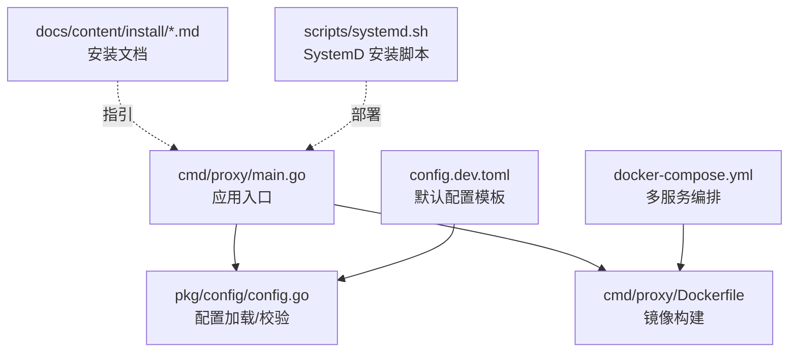
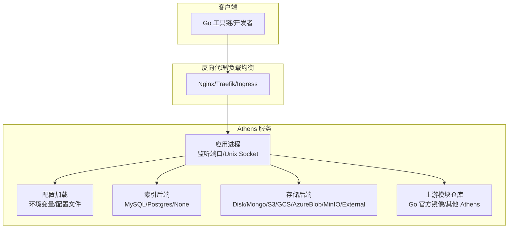
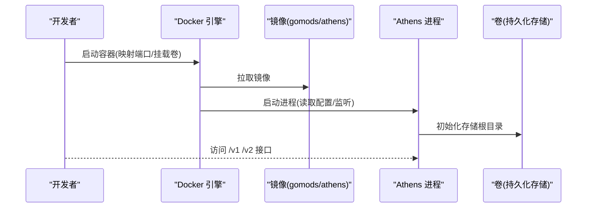
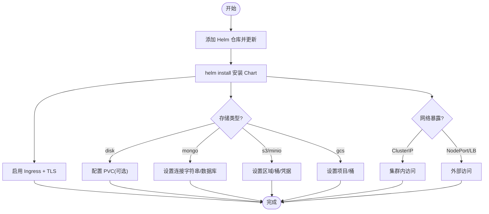
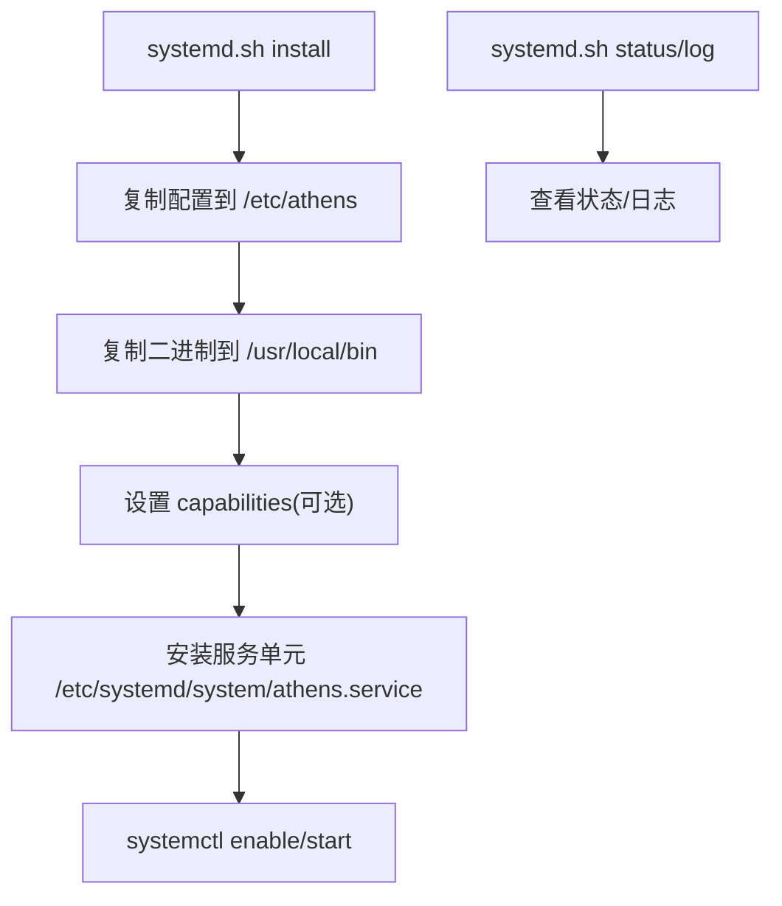
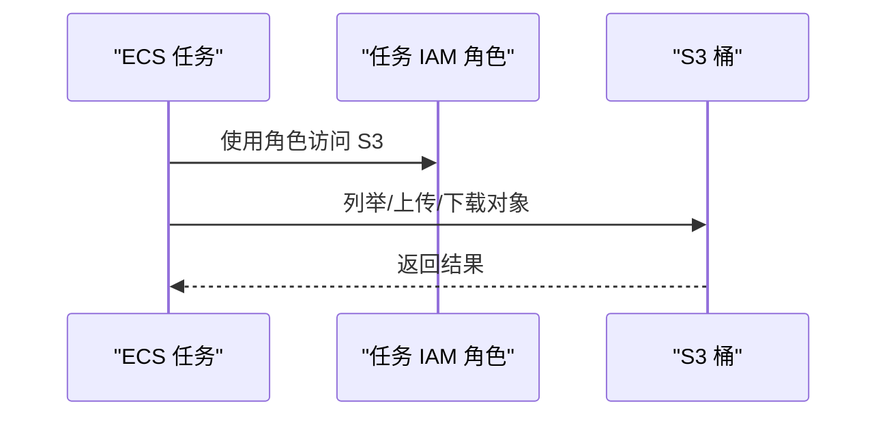
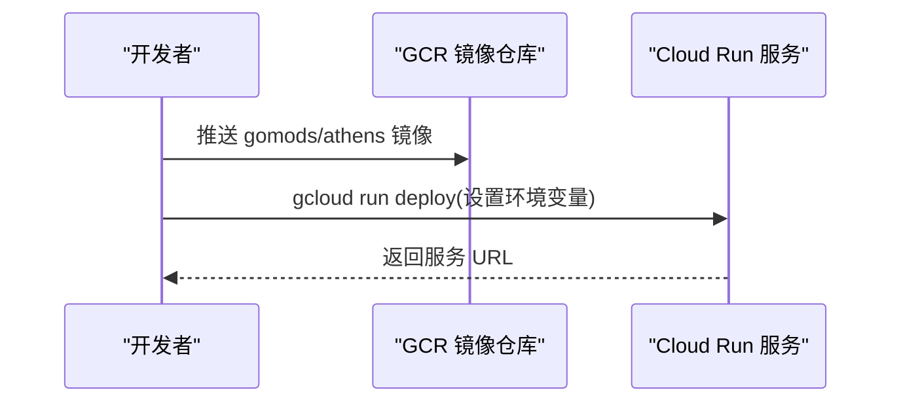
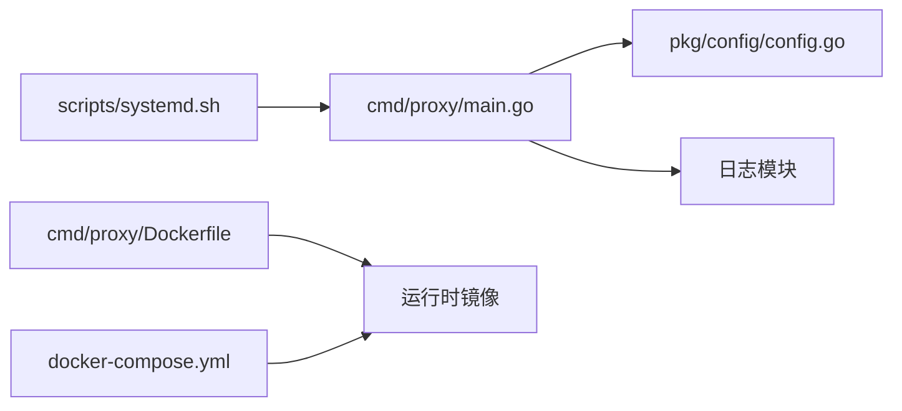

# 安装与部署

<cite>
**本文引用的文件**
- [cmd/proxy/main.go](file://cmd/proxy/main.go)
- [cmd/proxy/Dockerfile](file://cmd/proxy/Dockerfile)
- [docker-compose.yml](file://docker-compose.yml)
- [config.dev.toml](file://config.dev.toml)
- [pkg/config/config.go](file://pkg/config/config.go)
- [docs/content/install/_index.md](file://docs/content/install/_index.md)
- [docs/content/install/install-on-kubernetes.md](file://docs/content/install/install-on-kubernetes.md)
- [docs/content/install/using-docker.md](file://docs/content/install/using-docker.md)
- [docs/content/install/install-on-aws-ecs-fargate.md](file://docs/content/install/install-on-aws-ecs-fargate.md)
- [docs/content/install/install-on-google-cloud-run.md](file://docs/content/install/install-on-google-cloud-run.md)
- [docs/content/install/install-on-aci.md](file://docs/content/install/install-on-aci.md)
- [scripts/systemd.sh](file://scripts/systemd.sh)
</cite>

## 目录
1. [简介](#简介)
2. [项目结构](#项目结构)
3. [核心组件](#核心组件)
4. [架构总览](#架构总览)
5. [详细组件分析](#详细组件分析)
6. [依赖关系分析](#依赖关系分析)
7. [性能考量](#性能考量)
8. [故障排查指南](#故障排查指南)
9. [结论](#结论)
10. [附录](#附录)

## 简介
本文件面向不同技术背景的用户，提供 Athens 的完整安装与部署指南，覆盖以下场景：
- Docker 容器化部署（单机与编排）
- Kubernetes 集群部署（Helm Chart）
- 传统服务器部署（SystemD）
- 云平台部署（AWS ECS Fargate、Google Cloud Run、Azure Container Instances）

内容涵盖前置条件、配置步骤、最佳实践、安全与高可用建议、配置示例、环境变量、网络拓扑、部署后验证、监控与维护等。

## 项目结构
与安装部署直接相关的目录与文件：
- 可执行入口与容器镜像：cmd/proxy/main.go、cmd/proxy/Dockerfile
- 编排与集成测试：docker-compose.yml
- 默认配置模板：config.dev.toml
- 配置加载与校验：pkg/config/config.go
- 文档与安装指引：docs/content/install/*.md
- 传统系统服务管理：scripts/systemd.sh

**图示来源**
- [cmd/proxy/main.go](file://cmd/proxy/main.go#L29-L127)
- [pkg/config/config.go](file://pkg/config/config.go#L127-L144)
- [cmd/proxy/Dockerfile](file://cmd/proxy/Dockerfile#L1-L61)
- [docker-compose.yml](file://docker-compose.yml#L1-L173)
- [config.dev.toml](file://config.dev.toml#L1-L628)
- [docs/content/install/install-on-kubernetes.md](file://docs/content/install/install-on-kubernetes.md#L1-L303)
- [scripts/systemd.sh](file://scripts/systemd.sh#L1-L171)

**章节来源**
- [cmd/proxy/main.go](file://cmd/proxy/main.go#L29-L127)
- [cmd/proxy/Dockerfile](file://cmd/proxy/Dockerfile#L1-L61)
- [docker-compose.yml](file://docker-compose.yml#L1-L173)
- [config.dev.toml](file://config.dev.toml#L1-L628)
- [pkg/config/config.go](file://pkg/config/config.go#L127-L144)
- [docs/content/install/_index.md](file://docs/content/install/_index.md#L1-L50)
- [scripts/systemd.sh](file://scripts/systemd.sh#L1-L171)

## 核心组件
- 应用入口与启动流程
  - 解析命令行参数（版本查询、配置文件路径）
  - 加载配置并初始化日志
  - 构建 HTTP 处理器与服务器
  - 支持 Unix Socket 或 TCP 监听
  - 可选启用 pprof 性能分析端口
  - 平滑关闭与信号处理
- 配置系统
  - 支持从 TOML 文件与环境变量加载
  - 内置默认值与字段校验
  - 关键项：存储类型、日志级别、端口、单飞机制、索引类型、超时等
- 容器镜像
  - 基于 Alpine 的精简运行时
  - 预装 Git、Mercurial、Subversion、Fossil 等 VCS 工具
  - 提供非 root 用户与 tini 进程管理
- 编排与测试
  - docker-compose 提供开发与测试依赖（Mongo、MinIO、Jaeger、Datadog、Redis、etcd 等）
- 传统系统服务
  - SystemD/SysV 脚本支持安装、启停、状态与日志查看

**章节来源**
- [cmd/proxy/main.go](file://cmd/proxy/main.go#L24-L127)
- [pkg/config/config.go](file://pkg/config/config.go#L21-L66)
- [cmd/proxy/Dockerfile](file://cmd/proxy/Dockerfile#L30-L61)
- [docker-compose.yml](file://docker-compose.yml#L1-L173)
- [scripts/systemd.sh](file://scripts/systemd.sh#L1-L171)

## 架构总览
下图展示从客户端到 Athens 的典型请求链路，以及可选的上游模块仓库与存储后端：

**图示来源**
- [cmd/proxy/main.go](file://cmd/proxy/main.go#L59-L114)
- [pkg/config/config.go](file://pkg/config/config.go#L21-L66)
- [config.dev.toml](file://config.dev.toml#L392-L627)
- [docs/content/install/install-on-kubernetes.md](file://docs/content/install/install-on-kubernetes.md#L126-L178)

## 详细组件分析

### Docker 容器化部署
- 使用官方镜像或自建镜像
- 单机运行要点
  - 挂载持久化存储根目录
  - 设置存储类型与根路径
  - 映射端口或使用 Unix Socket
  - 非 root 用户运行（UID/GID）
- 编排与测试
  - docker-compose 提供 MongoDB、MinIO、Jaeger、Datadog、Redis、etcd 等依赖
  - 开发与测试服务通过环境变量与依赖声明进行连接

**图示来源**
- [docs/content/install/using-docker.md](file://docs/content/install/using-docker.md#L20-L72)
- [docker-compose.yml](file://docker-compose.yml#L1-L173)
- [cmd/proxy/Dockerfile](file://cmd/proxy/Dockerfile#L30-L61)

**章节来源**
- [docs/content/install/using-docker.md](file://docs/content/install/using-docker.md#L1-L88)
- [docker-compose.yml](file://docker-compose.yml#L1-L173)
- [cmd/proxy/Dockerfile](file://cmd/proxy/Dockerfile#L1-L61)

### Kubernetes 集群部署（Helm）
- Helm 仓库与初始化
  - 添加 gomods 仓库并更新
  - 在命名空间中安装默认 Chart
- 高可用与伸缩
  - 通过副本数实现横向扩展
  - 资源请求/限制按需配置
- 存储后端选择
  - disk：空盘或 PVC（推荐生产）
  - mongo：连接字符串与数据库名
  - s3/minio：区域、桶、凭据
  - gcs：项目与桶
- 网络暴露
  - ClusterIP/NodePort/LoadBalancer
  - Ingress + cert-manager + Let’s Encrypt
- 上游模块仓库
  - 指向上游（如 Go 官方镜像或其他 Athens）
- 私有仓库访问
  - GitHub Token 或 .netrc/ gitconfig Secret

**图示来源**
- [docs/content/install/install-on-kubernetes.md](file://docs/content/install/install-on-kubernetes.md#L80-L303)

**章节来源**
- [docs/content/install/install-on-kubernetes.md](file://docs/content/install/install-on-kubernetes.md#L1-L303)

### 传统服务器部署（SystemD）
- 安装脚本职责
  - 检测 SystemD/SysV
  - 复制二进制与配置文件
  - 设置 Capabilities（绑定特权端口）
  - 启用并启动服务单元
- 验证与维护
  - 查看状态与日志
  - 升级替换二进制后重载

**图示来源**
- [scripts/systemd.sh](file://scripts/systemd.sh#L34-L102)

**章节来源**
- [scripts/systemd.sh](file://scripts/systemd.sh#L1-L171)

### 云平台部署

#### AWS ECS Fargate
- 存储：Amazon S3
- IAM 角色：最小权限策略（列出/获取/删除对象）
- 任务定义：设置 AWS_REGION、ATHENS_STORAGE_TYPE、S3 桶名等环境变量

**图示来源**
- [docs/content/install/install-on-aws-ecs-fargate.md](file://docs/content/install/install-on-aws-ecs-fargate.md#L117-L131)

**章节来源**
- [docs/content/install/install-on-aws-ecs-fargate.md](file://docs/content/install/install-on-aws-ecs-fargate.md#L1-L131)

#### Google Cloud Run
- 存储：Google Cloud Storage
- 步骤：登录、配置 Docker、推送镜像、gcloud 部署、设置环境变量（存储类型、项目、桶）

**图示来源**
- [docs/content/install/install-on-google-cloud-run.md](file://docs/content/install/install-on-google-cloud-run.md#L35-L74)

**章节来源**
- [docs/content/install/install-on-google-cloud-run.md](file://docs/content/install/install-on-google-cloud-run.md#L1-L75)

#### Azure Container Instances
- 存储：磁盘或 MongoDB
- 必需环境变量：资源组、容器名称、位置、DNS 名称
- 示例：创建带公共 IP 与端口映射的容器实例

**章节来源**
- [docs/content/install/install-on-aci.md](file://docs/content/install/install-on-aci.md#L1-L68)

## 依赖关系分析
- 启动流程依赖
  - main.go 依赖配置加载模块与日志模块
  - 配置加载支持 TOML 与环境变量，内置默认值与校验
- 容器与编排
  - Dockerfile 定义构建与运行时环境
  - docker-compose 提供开发/测试依赖服务
- 传统系统
  - systemd.sh 依赖配置文件与服务单元模板

**图示来源**
- [cmd/proxy/main.go](file://cmd/proxy/main.go#L29-L127)
- [pkg/config/config.go](file://pkg/config/config.go#L127-L144)
- [cmd/proxy/Dockerfile](file://cmd/proxy/Dockerfile#L1-L61)
- [docker-compose.yml](file://docker-compose.yml#L1-L173)
- [scripts/systemd.sh](file://scripts/systemd.sh#L1-L171)

**章节来源**
- [cmd/proxy/main.go](file://cmd/proxy/main.go#L29-L127)
- [pkg/config/config.go](file://pkg/config/config.go#L127-L144)
- [cmd/proxy/Dockerfile](file://cmd/proxy/Dockerfile#L1-L61)
- [docker-compose.yml](file://docker-compose.yml#L1-L173)
- [scripts/systemd.sh](file://scripts/systemd.sh#L1-L171)

## 性能考量
- 并发与工作线程
  - GoGetWorkers：并发拉取模块数量
  - ProtocolWorkers：协议层并发请求数
- 超时与关闭
  - Timeout：外部网络调用超时
  - ShutdownTimeout：优雅关闭等待时间
- 日志与追踪
  - 日志级别与格式
  - 可选 pprof 端口（仅内部使用）
  - 分布式追踪导出（Jaeger、DataDog、Stackdriver）
- 存储与索引
  - 选择合适的存储后端（磁盘/云存储/数据库）
  - 索引后端（MySQL/Postgres）用于版本列表合并与错误回退模式

**章节来源**
- [config.dev.toml](file://config.dev.toml#L46-L120)
- [config.dev.toml](file://config.dev.toml#L218-L234)
- [cmd/proxy/main.go](file://cmd/proxy/main.go#L64-L77)
- [pkg/config/config.go](file://pkg/config/config.go#L21-L66)

## 故障排查指南
- Docker 运行问题
  - tini 警告：容器内已包含 tini，无需重复
  - 权限与非 root 用户：使用 -u 指定 UID/GID
- Kubernetes 部署问题
  - RBAC：为 Helm/Tiller 创建 ServiceAccount/ClusterRole
  - Ingress：确认证书与类配置正确
  - 存储：PVC 绑定、权限与容量
- 传统系统服务
  - systemd/servicectl：检查服务状态与日志
  - capabilities：确保二进制具备绑定特权端口能力
- 配置问题
  - 环境变量优先级高于配置文件
  - 字段校验失败时检查必填项与格式

**章节来源**
- [docs/content/install/using-docker.md](file://docs/content/install/using-docker.md#L74-L88)
- [docs/content/install/install-on-kubernetes.md](file://docs/content/install/install-on-kubernetes.md#L55-L70)
- [scripts/systemd.sh](file://scripts/systemd.sh#L104-L150)
- [pkg/config/config.go](file://pkg/config/config.go#L127-L144)

## 结论
通过上述多种部署方式，用户可在不同基础设施上快速搭建 Athens。生产环境建议：
- 使用持久化存储与高可用架构（Kubernetes 多副本、云存储）
- 启用 TLS 与认证（Basic Auth/私有仓库凭据）
- 配置合理的并发与超时参数
- 结合 Ingress/负载均衡与监控告警体系

## 附录

### 环境变量与配置项速查
- 基础
  - ATHENS_STORAGE_TYPE：存储类型
  - ATHENS_PORT/PORT：监听端口
  - ATHENS_UNIX_SOCKET：Unix Socket 路径
  - ATHENS_LOG_LEVEL/ATHENS_LOG_FORMAT/ATHENS_CLOUD_RUNTIME：日志
  - ATHENS_ENABLE_PPROF/ATHENS_PPROF_PORT：性能分析
- 存储
  - Disk：ATHENS_DISK_STORAGE_ROOT
  - Mongo：ATHENS_MONGO_STORAGE_URL、ATHENS_MONGO_DEFAULT_DATABASE
  - S3/MinIO/GCS/AzureBlob：对应区域/桶/凭据
- 索引
  - ATHENS_INDEX_TYPE：索引类型
  - MySQL/Postgres 参数
- 其他
  - ATHENS_GOGET_WORKERS/ATHENS_PROTOCOL_WORKERS：并发
  - ATHENS_TIMEOUT/ATHENS_SHUTDOWN_TIMEOUT：超时与关闭
  - BASIC_AUTH_USER/BASIC_AUTH_PASS：Basic Auth
  - ATHENS_GITHUB_TOKEN/ATHENS_NETRC_PATH/ATHENS_HGRC_PATH：私有仓库访问
  - ATHENS_DOWNLOAD_MODE/ATHENS_NETWORK_MODE：下载与版本合并策略
  - ATHENS_SINGLE_FLIGHT_TYPE：单飞机制（etcd/redis/gcp/azureblob/memory）

**章节来源**
- [pkg/config/config.go](file://pkg/config/config.go#L21-L66)
- [config.dev.toml](file://config.dev.toml#L392-L627)