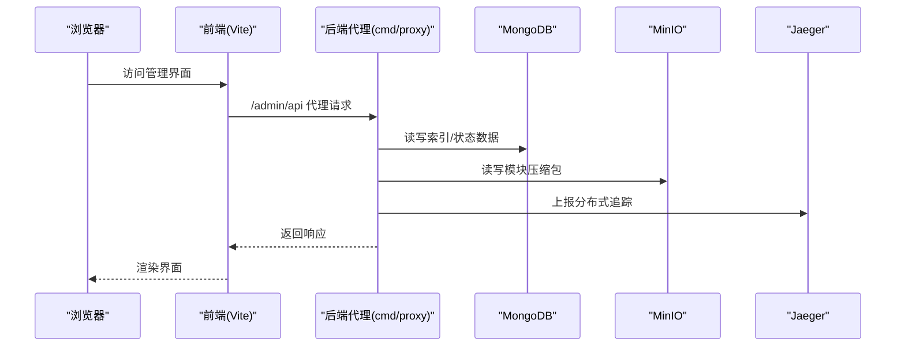
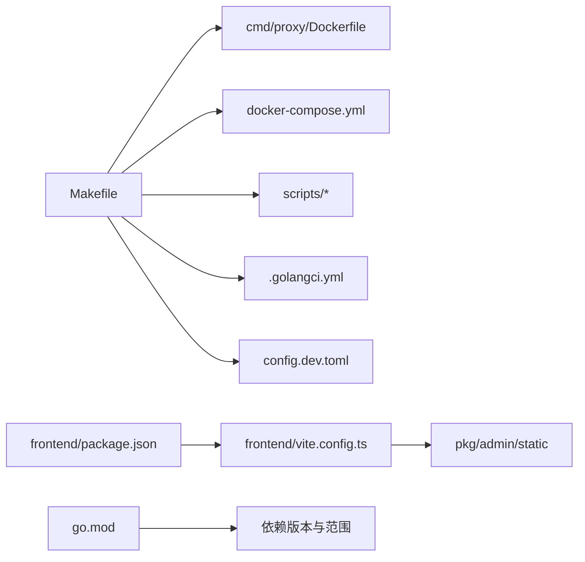

# 开发环境搭建

<cite>
**本文档引用的文件**
- [README.md](file://README.md)
- [DEVELOPMENT.md](file://DEVELOPMENT.md)
- [go.mod](file://go.mod)
- [Makefile](file://Makefile)
- [CONTRIBUTING.md](file://CONTRIBUTING.md)
- [.golangci.yml](file://.golangci.yml)
- [scripts/check_deps.sh](file://scripts/check_deps.sh)
- [scripts/check_conflicts.sh](file://scripts/check_conflicts.sh)
- [scripts/test_unit.sh](file://scripts/test_unit.sh)
- [scripts/test_e2e.sh](file://scripts/test_e2e.sh)
- [config.dev.toml](file://config.dev.toml)
- [docker-compose.yml](file://docker-compose.yml)
- [frontend/package.json](file://frontend/package.json)
- [frontend/vite.config.ts](file://frontend/vite.config.ts)
- [cmd/proxy/Dockerfile](file://cmd/proxy/Dockerfile)
</cite>

## 目录
1. [简介](#简介)
2. [项目结构](#项目结构)
3. [核心组件](#核心组件)
4. [架构总览](#架构总览)
5. [详细组件分析](#详细组件分析)
6. [依赖关系分析](#依赖关系分析)
7. [性能考虑](#性能考虑)
8. [故障排除指南](#故障排除指南)
9. [结论](#结论)
10. [附录](#附录)

## 简介
本指南面向首次参与 Athens 项目的开发者，提供从零开始搭建本地开发环境的完整流程，涵盖 Go 语言版本与模块配置、依赖工具安装、项目构建与运行、测试执行、代码质量检查、前端开发环境以及常见问题排查。文档同时给出推荐的 IDE 配置、调试环境准备、分支管理与提交规范建议，并提供性能调试技巧。

## 项目结构
该仓库采用多模块与多服务并存的组织方式：
- 后端主程序位于 cmd/proxy，使用 Go 模块进行依赖管理
- pkg 下为各功能子模块（存储、索引、下载、中间件等）
- scripts 提供构建、测试、依赖检查等自动化脚本
- docker-compose 定义开发所需的数据库、对象存储、追踪等依赖服务
- frontend 为 Vue3 + TypeScript 的管理界面，通过 Vite 构建并输出到后端静态资源目录

```mermaid
graph TB
subgraph "后端"
Proxy["cmd/proxy<br/>主程序入口"]
Pkg["pkg/*<br/>功能模块"]
Scripts["scripts/*<br/>构建/测试/检查脚本"]
Dockerfile["cmd/proxy/Dockerfile<br/>容器镜像构建"]
DevCfg["config.dev.toml<br/>开发配置"]
end
subgraph "依赖服务"
Mongo["MongoDB"]
Minio["MinIO"]
Jaeger["Jaeger"]
Redis["Redis"]
ETCD["etcd"]
end
subgraph "前端"
FE_Pkg["frontend/package.json<br/>依赖与脚本"]
FE_Vite["frontend/vite.config.ts<br/>开发服务器与代理"]
end
Proxy --> Pkg
Proxy --> DevCfg
Proxy -. 使用 .env .env.local .env.* .env.*.* .env.*.*.* 等环境变量覆盖 .dev.toml .- DevCfg
Proxy -. 依赖 .- Mongo
Proxy -. 依赖 .- Minio
Proxy -. 依赖 .- Jaeger
FE_Vite --> Proxy
FE_Pkg --> FE_Vite
Scripts --> Proxy
Dockerfile --> Proxy
```

图表来源
- [docker-compose.yml](file://docker-compose.yml#L1-L173)
- [config.dev.toml](file://config.dev.toml#L1-L628)
- [frontend/vite.config.ts](file://frontend/vite.config.ts#L1-L25)
- [frontend/package.json](file://frontend/package.json#L1-L30)
- [cmd/proxy/Dockerfile](file://cmd/proxy/Dockerfile#L1-L61)

章节来源
- [README.md](file://README.md#L1-L96)
- [DEVELOPMENT.md](file://DEVELOPMENT.md#L1-L314)
- [docker-compose.yml](file://docker-compose.yml#L1-L173)

## 核心组件
- Go 版本与模块：项目要求 Go 1.11+，当前 go.mod 指定 1.23.5；使用 Go Modules 进行依赖管理
- 构建系统：Makefile 提供构建、运行、测试、文档、依赖服务启动等常用目标
- 开发配置：config.dev.toml 提供默认开发参数（日志级别、存储类型、网络模式、追踪导出器等）
- 依赖服务：docker-compose 定义 MongoDB、MinIO、Jaeger、Redis、etcd 等开发所需服务
- 前端：Vue3 + TypeScript，Vite 开发服务器，代理到后端 3000 端口
- 质量工具：golangci-lint 配置于 .golangci.yml，支持多种格式化与静态分析工具

章节来源
- [go.mod](file://go.mod#L1-L194)
- [Makefile](file://Makefile#L1-L131)
- [config.dev.toml](file://config.dev.toml#L1-L628)
- [docker-compose.yml](file://docker-compose.yml#L1-L173)
- [frontend/package.json](file://frontend/package.json#L1-L30)
- [frontend/vite.config.ts](file://frontend/vite.config.ts#L1-L25)
- [.golangci.yml](file://.golangci.yml#L1-L88)

## 架构总览
下图展示本地开发时的典型交互：浏览器访问前端管理界面，前端通过 Vite 代理请求后端；后端根据 config.dev.toml 选择存储与索引后端，连接 MongoDB、MinIO、Jaeger 等服务；测试阶段可使用 Docker Compose 在隔离环境中运行单元或端到端测试。



图表来源
- [frontend/vite.config.ts](file://frontend/vite.config.ts#L17-L24)
- [config.dev.toml](file://config.dev.toml#L122-L127)
- [docker-compose.yml](file://docker-compose.yml#L47-L58)
- [docker-compose.yml](file://docker-compose.yml#L51-L58)
- [docker-compose.yml](file://docker-compose.yml#L68-L79)

## 详细组件分析

### 1) Go 环境与模块配置
- Go 版本：go.mod 指定 1.23.5；如需切换，请设置 GO_BINARY_PATH 或在 PATH 中优先指向目标二进制
- 模块与 GOPATH：若在 GOPATH 内，确保 GO111MODULE=on；否则默认启用模块
- 代理与缓存：Dockerfile 与 Makefile 中设置了 GOPROXY，便于加速依赖拉取

建议操作
- 安装 Go 1.23.5 并加入 PATH
- 在项目根目录执行 go env 查看模块状态
- 如需自定义 go 命令路径，设置 GO_BINARY_PATH

章节来源
- [go.mod](file://go.mod#L3-L3)
- [DEVELOPMENT.md](file://DEVELOPMENT.md#L17-L26)
- [cmd/proxy/Dockerfile](file://cmd/proxy/Dockerfile#L17-L19)

### 2) 依赖工具安装
- Docker 与 Docker Compose：用于一键启动依赖服务与测试容器
- Make：统一命令入口，提供 run、test、lint、dev 等常用目标
- golangci-lint：静态分析与格式化工具，.golangci.yml 已配置
- 前端：Node.js 与 pnpm（package.json 中声明），Vite 用于开发服务器

建议操作
- 安装 Docker Desktop 与 Docker Compose
- 安装 Node.js LTS 与 pnpm
- 执行 make help 查看可用命令清单

章节来源
- [DEVELOPMENT.md](file://DEVELOPMENT.md#L39-L52)
- [Makefile](file://Makefile#L124-L126)
- [.golangci.yml](file://.golangci.yml#L1-L16)
- [frontend/package.json](file://frontend/package.json#L1-L30)

### 3) 项目构建与运行
- 本地二进制运行：进入 cmd/proxy，go build 后 ./proxy 启动
- Docker 运行：make run-docker 构建并启动 dev 服务，端口 3000
- SystemD 服务：make build-ver 生成二进制，使用 scripts/systemd.sh 安装与管理
- 文档站点：make docs 与 make docs-docker 启动 Hugo 文档服务

建议操作
- 首次运行前执行 make setup-dev-env 或 make dev 启动依赖服务
- 使用 curl localhost:3000 验证服务可用性

章节来源
- [DEVELOPMENT.md](file://DEVELOPMENT.md#L118-L135)
- [DEVELOPMENT.md](file://DEVELOPMENT.md#L39-L82)
- [Makefile](file://Makefile#L27-L46)

### 4) 开发工具链与 IDE 配置
- Go 插件：VS Code 推荐使用 gopls、Delve 调试器
- 前端：VS Code 推荐 Vue Language Features、ESLint、Prettier
- 调试：Delve 支持断点、变量检查、调用栈查看；可在 VS Code 中配置 launch.json
- 格式化：gofmt、gofumpt、goimports；.golangci.yml 已启用

建议操作
- VS Code 安装 Go、Vue 相关插件
- 配置 Go 导入路径与 GOPATH（如在 GOPATH 外则保持模块开启）
- 前端使用 pnpm install 安装依赖后，pnpm run dev 启动

章节来源
- [.golangci.yml](file://.golangci.yml#L5-L15)
- [frontend/package.json](file://frontend/package.json#L6-L10)

### 5) 调试环境准备
- 后端调试：使用 Delve 启动 main.go，设置断点于关键处理逻辑
- 前端调试：Vite 开发服务器支持热更新与源码映射
- 分布式追踪：Jaeger 可视化请求链路，配置见 config.dev.toml 与 docker-compose.yml
- 日志：config.dev.toml 支持 debug 级别与 JSON/plain 输出格式

建议操作
- 启动 make dev 后访问 http://localhost:16686 查看 Jaeger UI
- 在 VS Code 中配置 Go 调试任务，指定工作目录为 cmd/proxy

章节来源
- [config.dev.toml](file://config.dev.toml#L76-L84)
- [config.dev.toml](file://config.dev.toml#L218-L234)
- [docker-compose.yml](file://docker-compose.yml#L68-L79)

### 6) 单元测试、集成测试与端到端测试
- 单元测试（主机）：make test-unit；脚本设置测试环境变量并启用 race 检测与覆盖率
- 单元测试（容器）：make test-unit-docker；在隔离容器中运行
- 集成测试：依赖服务通过 make alldeps 或 make dev 启动
- 端到端测试：make test-e2e 或 make test-e2e-docker；脚本 e2etests 目录下执行
- 依赖检查：make verify 组合 check_deps.sh 与 check_conflicts.sh

建议操作
- 首次运行 e2e 测试前执行 make setup-dev-env
- 使用 -race 与 -covermode=atomic 获取更准确的并发与覆盖率结果

章节来源
- [DEVELOPMENT.md](file://DEVELOPMENT.md#L166-L218)
- [scripts/test_unit.sh](file://scripts/test_unit.sh#L1-L22)
- [scripts/test_e2e.sh](file://scripts/test_e2e.sh#L1-L8)
- [Makefile](file://Makefile#L60-L83)
- [CONTRIBUTING.md](file://CONTRIBUTING.md#L9-L16)

### 7) 代码格式化、静态分析与代码质量
- 格式化工具：gci、gofmt、gofumpt、goimports；gofumpt 启用额外规则
- 静态分析：golangci-lint 默认启用多项 linter，禁用部分复杂度与风格类规则
- 排除规则：针对特定文件与路径的告警例外，如 pprof 自动暴露、thelper、gosec 等
- 依赖冲突检测：check_deps.sh 与 check_conflicts.sh 在 CI 中使用

建议操作
- 本地运行 make lint 或 make lint-docker
- 修改 .golangci.yml 以适配团队风格；避免过度限制影响可读性

章节来源
- [.golangci.yml](file://.golangci.yml#L1-L88)
- [scripts/check_deps.sh](file://scripts/check_deps.sh#L1-L23)
- [scripts/check_conflicts.sh](file://scripts/check_conflicts.sh#L1-L23)

### 8) 开发工作流、分支管理与提交规范
- 分支策略：遵循 Git 主干模型，发布前进行代码冻结与变更集合并
- 提交规范：遵循 SemVer；minor 与 patch 发布分别对应不同分支与标签策略
- PR 流程：先 Issue 认领，再提交 PR；参考 REVIEWS.md 了解评审流程

建议操作
- 使用 feature/* 分支开发，完成后合并到 main
- 发布前确保 make verify、make test-unit、make test-e2e 全部通过

章节来源
- [DEVELOPMENT.md](file://DEVELOPMENT.md#L243-L314)
- [CONTRIBUTING.md](file://CONTRIBUTING.md#L1-L41)

### 9) 环境验证与依赖检查
- 依赖一致性：go.mod 与 go.sum 变更时自动触发 go mod verify
- 合并与冲突：非 Go 文件变更时检测 merge conflict artifacts 并阻断 CI
- 服务连通性：make dev 启动 MongoDB、MinIO、Jaeger；curl 验证端口可达

建议操作
- 在 PR 中确保 go.mod/go.sum 无未声明变更
- 若出现冲突标记，清理后再提交

章节来源
- [scripts/check_deps.sh](file://scripts/check_deps.sh#L1-L23)
- [scripts/check_conflicts.sh](file://scripts/check_conflicts.sh#L1-L23)
- [Makefile](file://Makefile#L99-L118)

### 10) 前端开发环境
- 依赖安装：pnpm install
- 开发服务器：pnpm run dev，默认代理 /admin/api 到后端 3000 端口
- 构建产物：Vite 将打包输出至 pkg/admin/static，供后端静态资源使用

建议操作
- 修改 vite.config.ts 的代理目标以适配不同后端地址
- 构建后确认静态资源已复制到后端目录

章节来源
- [frontend/package.json](file://frontend/package.json#L6-L10)
- [frontend/vite.config.ts](file://frontend/vite.config.ts#L17-L24)

## 依赖关系分析



图表来源
- [Makefile](file://Makefile#L1-L131)
- [cmd/proxy/Dockerfile](file://cmd/proxy/Dockerfile#L1-L61)
- [docker-compose.yml](file://docker-compose.yml#L1-L173)
- [config.dev.toml](file://config.dev.toml#L1-L628)
- [.golangci.yml](file://.golangci.yml#L1-L88)
- [frontend/package.json](file://frontend/package.json#L1-L30)
- [frontend/vite.config.ts](file://frontend/vite.config.ts#L1-L25)
- [go.mod](file://go.mod#L1-L194)

章节来源
- [Makefile](file://Makefile#L1-L131)
- [go.mod](file://go.mod#L1-L194)

## 性能考虑
- 并发与锁：SingleFlight 支持 memory、etcd、redis、redis-sentinel、gcp、azureblob 等机制，避免重复写入
- 网络超时：Timeout 默认较大，适合慢速上游；可根据环境调整
- 存储后端：Mongo、MinIO、S3、AzureBlob 等后端的性能与可用性差异较大，建议在开发中按需选择
- 追踪与指标：Jaeger 与 Prometheus 可帮助定位热点与瓶颈

章节来源
- [config.dev.toml](file://config.dev.toml#L290-L327)
- [config.dev.toml](file://config.dev.toml#L116-L120)
- [config.dev.toml](file://config.dev.toml#L230-L234)

## 故障排除指南
- 无法连接存储（MongoDB/MinIO）：先执行 make dev 或 make alldeps，等待服务就绪
- 端口占用：修改 config.dev.toml 中的 Port 或 docker-compose 映射
- GOPROXY 拉取缓慢：在 Dockerfile 与 Makefile 中已设置 GOPROXY，也可在本地设置环境变量
- 调试失败：确认 Delve 与 Go 版本匹配；在 VS Code 中重新加载调试配置
- 前端代理无效：检查 vite.config.ts 的代理配置与后端端口是否一致

章节来源
- [DEVELOPMENT.md](file://DEVELOPMENT.md#L156-L164)
- [docker-compose.yml](file://docker-compose.yml#L13-L14)
- [cmd/proxy/Dockerfile](file://cmd/proxy/Dockerfile#L19-L19)
- [frontend/vite.config.ts](file://frontend/vite.config.ts#L17-L24)

## 结论
通过本指南，您可以在本地快速搭建 Athens 的开发与测试环境，掌握构建、运行、测试、质量检查与调试的全流程。建议结合 Makefile 与 docker-compose 的自动化能力，配合 golangci-lint 与前端 Vite 工具链，形成高效的日常开发工作流。

## 附录

### A. 常用命令速查
- 构建与运行
  - make build / make run / make run-docker
  - make docs / make docs-docker
- 依赖服务
  - make dev / make alldeps / make down
- 测试
  - make test-unit / make test-unit-docker
  - make test-e2e / make test-e2e-docker
  - make verify
- 质量
  - make lint / make lint-docker

章节来源
- [Makefile](file://Makefile#L10-L131)
- [DEVELOPMENT.md](file://DEVELOPMENT.md#L166-L234)

### B. 环境变量与配置要点
- 后端配置：通过 config.dev.toml 与环境变量组合覆盖（如 ATHENS_STORAGE_TYPE、ATHENS_MONGO_STORAGE_URL 等）
- 前端代理：Vite 代理 /admin/api 到后端 3000 端口
- Go 环境：GO111MODULE、GO_BINARY_PATH、GOPROXY

章节来源
- [config.dev.toml](file://config.dev.toml#L1-L628)
- [frontend/vite.config.ts](file://frontend/vite.config.ts#L17-L24)
- [cmd/proxy/Dockerfile](file://cmd/proxy/Dockerfile#L17-L19)