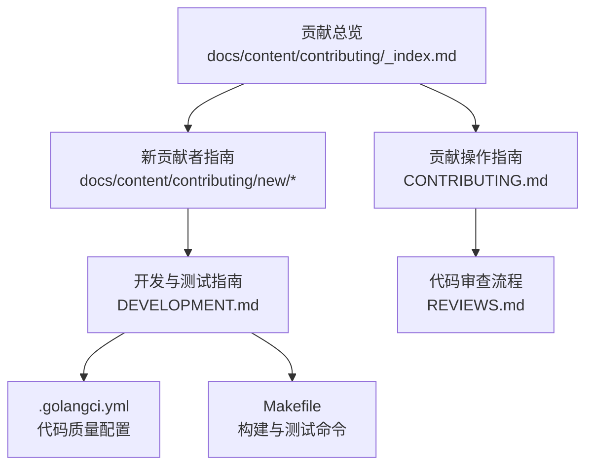
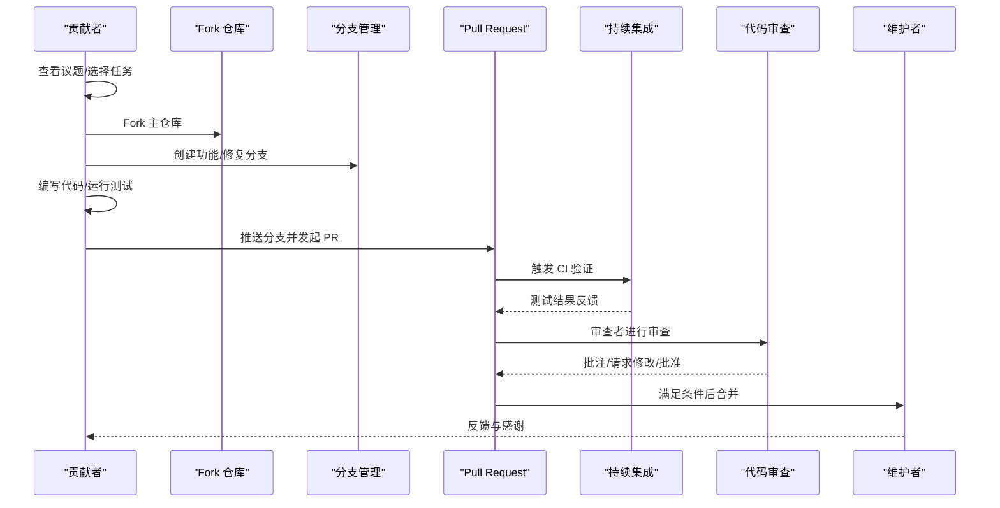
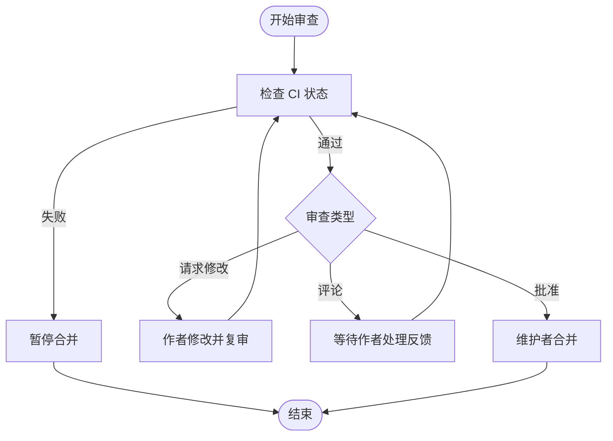
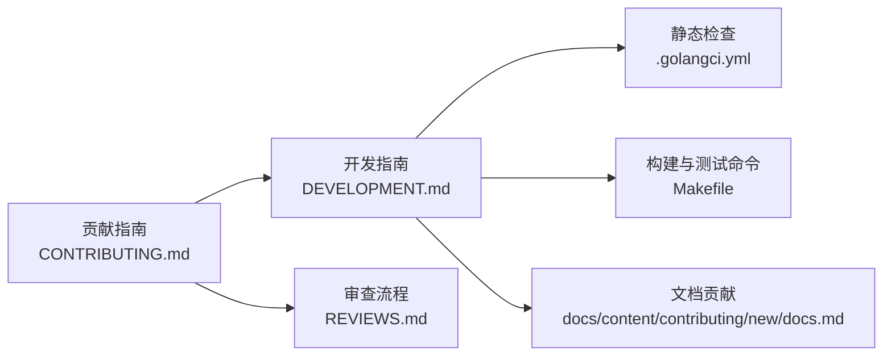

# 代码贡献流程

<cite>
**本文档引用的文件**
- [CONTRIBUTING.md](file://CONTRIBUTING.md)
- [DEVELOPMENT.md](file://DEVELOPMENT.md)
- [REVIEWS.md](file://REVIEWS.md)
- [.golangci.yml](file://.golangci.yml)
- [Makefile](file://Makefile)
- [docs/content/contributing/_index.md](file://docs/content/contributing/_index.md)
- [docs/content/contributing/new/git.md](file://docs/content/contributing/new/git.md)
- [docs/content/contributing/new/github.md](file://docs/content/contributing/new/github.md)
- [docs/content/contributing/new/development.md](file://docs/content/contributing/new/development.md)
- [docs/content/contributing/new/docs.md](file://docs/content/contributing/new/docs.md)
</cite>

## 目录
1. [简介](#简介)
2. [项目结构](#项目结构)
3. [核心组件](#核心组件)
4. [架构总览](#架构总览)
5. [详细组件分析](#详细组件分析)
6. [依赖关系分析](#依赖关系分析)
7. [性能考虑](#性能考虑)
8. [故障排查指南](#故障排查指南)
9. [结论](#结论)
10. [附录](#附录)

## 简介
本文件系统化梳理 Athens 项目的代码贡献流程，覆盖从 Fork 到合并的完整生命周期：分支管理策略、提交规范、代码审查流程、Fork 与分支命名约定、Pull Request 模板使用、代码质量与测试覆盖率要求、文档更新规范、社区参与与问题报告/功能请求流程，以及新贡献者入门与最佳实践建议。内容直接来源于仓库现有文档与配置，并在必要处提供可视化图示帮助理解。

## 项目结构
贡献相关的主要入口与文档分布如下：
- 贡献总览与哲学：docs/content/contributing/_index.md
- 新贡献者指南（Git/GitHub/开发环境/文档）：docs/content/contributing/new/*
- 贡献操作指南与验证：CONTRIBUTING.md
- 开发与测试指南：DEVELOPMENT.md
- 代码审查流程：REVIEWS.md
- 代码质量与静态检查：.golangci.yml
- 构建与测试命令：Makefile

图表来源
- [docs/content/contributing/_index.md](file://docs/content/contributing/_index.md#L1-L29)
- [docs/content/contributing/new/git.md](file://docs/content/contributing/new/git.md#L1-L76)
- [docs/content/contributing/new/github.md](file://docs/content/contributing/new/github.md#L1-L107)
- [docs/content/contributing/new/development.md](file://docs/content/contributing/new/development.md#L1-L93)
- [CONTRIBUTING.md](file://CONTRIBUTING.md#L1-L41)
- [DEVELOPMENT.md](file://DEVELOPMENT.md#L1-L314)
- [.golangci.yml](file://.golangci.yml#L1-L88)
- [Makefile](file://Makefile#L1-L131)

章节来源
- [docs/content/contributing/_index.md](file://docs/content/contributing/_index.md#L1-L29)
- [docs/content/contributing/new/git.md](file://docs/content/contributing/new/git.md#L1-L76)
- [docs/content/contributing/new/github.md](file://docs/content/contributing/new/github.md#L1-L107)
- [docs/content/contributing/new/development.md](file://docs/content/contributing/new/development.md#L1-L93)
- [CONTRIBUTING.md](file://CONTRIBUTING.md#L1-L41)
- [DEVELOPMENT.md](file://DEVELOPMENT.md#L1-L314)
- [.golangci.yml](file://.golangci.yml#L1-L88)
- [Makefile](file://Makefile#L1-L131)

## 核心组件
- 贡献总览与哲学：概述社区价值观与贡献入口，指引到具体指南。
- 新贡献者指南：Git 基础、GitHub 使用、开发环境搭建、文档贡献。
- 贡献操作指南：如何验证工作、设置本地环境、运行单元与端到端测试、提交 PR。
- 开发与测试指南：详细的运行方式、服务依赖、测试方法、文档渲染、代码检查。
- 代码审查流程：审查步骤、类型与使用场景、合并策略。
- 代码质量与静态检查：golangci-lint 配置与规则排除。
- 构建与测试命令：Makefile 提供统一的构建、测试、文档与依赖管理命令。

章节来源
- [docs/content/contributing/_index.md](file://docs/content/contributing/_index.md#L1-L29)
- [docs/content/contributing/new/git.md](file://docs/content/contributing/new/git.md#L1-L76)
- [docs/content/contributing/new/github.md](file://docs/content/contributing/new/github.md#L1-L107)
- [docs/content/contributing/new/development.md](file://docs/content/contributing/new/development.md#L1-L93)
- [CONTRIBUTING.md](file://CONTRIBUTING.md#L1-L41)
- [DEVELOPMENT.md](file://DEVELOPMENT.md#L1-L314)
- [REVIEWS.md](file://REVIEWS.md#L1-L79)
- [.golangci.yml](file://.golangci.yml#L1-L88)
- [Makefile](file://Makefile#L1-L131)

## 架构总览
下图展示从“发现任务”到“PR 合并”的整体贡献流程，映射到仓库中的实际文档与命令：

图表来源
- [docs/content/contributing/new/github.md](file://docs/content/contributing/new/github.md#L37-L107)
- [CONTRIBUTING.md](file://CONTRIBUTING.md#L6-L41)
- [DEVELOPMENT.md](file://DEVELOPMENT.md#L166-L234)
- [REVIEWS.md](file://REVIEWS.md#L10-L79)
- [Makefile](file://Makefile#L60-L83)

## 详细组件分析

### 分支管理策略与命名约定
- Fork 流程
  - 在 GitHub 上 Fork 主仓库，随后在本地克隆并配置上游以同步主分支更新。
  - 建议在 Fork 中按功能或修复创建独立分支，避免在默认分支上直接提交。
- 分支命名约定
  - 建议采用清晰语义的前缀与描述，例如：feature/xxx、fix/xxx、docs/xxx、chore/xxx。
  - 与议题编号关联可提升追踪性（如 feature/issue-123）。
- 同步上游与清理
  - 在开始新任务前，先从上游 main 拉取最新变更，再基于该基线创建分支。
  - 合并后及时删除已合并的分支，保持仓库整洁。

章节来源
- [docs/content/contributing/new/github.md](file://docs/content/contributing/new/github.md#L37-L50)
- [docs/content/contributing/new/git.md](file://docs/content/contributing/new/git.md#L47-L51)

### 提交规范与代码质量
- 提交信息规范
  - 建议采用“类型: 主题”格式，配合简短描述与必要上下文。
  - 小改动可直接提交，复杂变更建议拆分为多个逻辑清晰的小提交。
- 代码风格与静态检查
  - 使用 golangci-lint 进行统一的静态检查，规则在 .golangci.yml 中定义。
  - 包含格式化工具链（gofmt/gofumpt/goimports/gci）与部分规则排除（如特定包的安全/测试规则放宽）。
- 本地验证
  - 运行 make verify 统一执行依赖检查与冲突检测。
  - 运行 make lint 或 make lint-docker 进行静态检查。
  - 运行 make test-unit 与 make test-e2e 验证核心功能。

章节来源
- [.golangci.yml](file://.golangci.yml#L1-L88)
- [Makefile](file://Makefile#L52-L83)
- [CONTRIBUTING.md](file://CONTRIBUTING.md#L9-L16)
- [DEVELOPMENT.md](file://DEVELOPMENT.md#L235-L242)

### 代码审查流程
- 审查步骤
  - 至少一名维护者审查并批准；重要变更建议等待至少 24-36 小时以兼顾不同时区。
  - PR 必须通过 CI 测试；审查者可使用“评论/请求修改/批准”三种状态。
- 审查类型与使用场景
  - 请求修改：对需要作者进一步修改的内容使用，阻止合并直至满足要求。
  - 评论：非阻塞性建议，其他审查者可在该反馈处理后协助合并。
  - 批准：无阻塞性意见时可直接批准，维护者可选择“压缩合并”。
- 合并策略
  - 仅维护者具备合并权限；确保 CI 成功且无“请求修改”未处理。

图表来源
- [REVIEWS.md](file://REVIEWS.md#L10-L79)

章节来源
- [REVIEWS.md](file://REVIEWS.md#L1-L79)

### Fork 流程与 Pull Request 模板使用
- Fork 与 PR 发起
  - Fork 主仓库后，在 Fork 内创建功能分支并推送。
  - 访问主仓库页面通常会提示创建 PR；也可手动前往“Pull Requests”标签页发起。
- PR 模板
  - 仓库提供议题模板用于 Bug 报告与功能请求；PR 本身可使用通用模板或自定义说明。
  - PR 描述中应包含：变更动机、实现方案、测试方法、影响范围与风险评估。
- PR 合并与后续
  - CI 通过后由维护者合并；合并后可删除已合并分支。

章节来源
- [docs/content/contributing/new/github.md](file://docs/content/contributing/new/github.md#L37-L107)

### 测试与覆盖率标准
- 单元测试
  - 支持容器内与主机两种运行方式；推荐使用容器方式以隔离环境。
  - 依赖服务通过 make alldeps 或 make dev 启动；完成后运行 make test-unit。
- 端到端测试
  - 通过 Docker Compose 完整模拟用户视角的 e2e 测试；使用 make test-e2e-docker。
- 覆盖率与验证
  - 仓库未显式声明覆盖率阈值；建议在 PR 中明确测试覆盖范围与新增用例。
  - 使用 make verify 与 make lint 作为前置校验，减少 CI 失败概率。

章节来源
- [DEVELOPMENT.md](file://DEVELOPMENT.md#L166-L234)
- [Makefile](file://Makefile#L65-L83)
- [CONTRIBUTING.md](file://CONTRIBUTING.md#L18-L32)

### 文档更新规范
- 文档贡献入口
  - 文档使用 Hugo 渲染；可通过本地 Hugo 服务器或 Docker 方式启动预览。
- 更新流程
  - 在 docs 目录下修改内容；启动本地服务验证效果；提交 PR 并通过审查后合并。

章节来源
- [docs/content/contributing/new/docs.md](file://docs/content/contributing/new/docs.md#L1-L19)
- [docs/content/contributing/new/development.md](file://docs/content/contributing/new/development.md#L71-L84)
- [DEVELOPMENT.md](file://DEVELOPMENT.md#L220-L234)

### 社区参与与问题报告/功能请求
- 社区参与
  - 遵循社区哲学与行为准则；通过 #athens 频道交流；关注 Office Hours 与 Triaging 活动。
- 问题报告与功能请求
  - 使用 GitHub Issues 的模板填写 Bug 报告与功能请求；描述清晰、提供复现步骤与期望结果。
- 新贡献者支持
  - 提供 Git/GitHub 基础与开发环境搭建指南；欢迎通过视频教程与 Slack 获取帮助。

章节来源
- [docs/content/contributing/_index.md](file://docs/content/contributing/_index.md#L10-L28)
- [docs/content/contributing/new/github.md](file://docs/content/contributing/new/github.md#L19-L36)
- [docs/content/contributing/new/git.md](file://docs/content/contributing/new/git.md#L9-L22)

### 新贡献者入门与最佳实践
- 入门步骤
  - 安装 Git 与 GitHub 账户；阅读 Git 基础与 GitHub 使用指南。
  - 搭建开发环境：Docker/Compose 或本地二进制；运行 make setup-dev-env 或 make dev。
- 最佳实践
  - 先开议题再提交 PR；小步快跑、频繁提交；为每个 PR 准备测试用例。
  - 保持分支简洁、提交信息清晰、PR 描述完整；尊重审查意见并积极沟通。

章节来源
- [docs/content/contributing/new/git.md](file://docs/content/contributing/new/git.md#L23-L76)
- [docs/content/contributing/new/github.md](file://docs/content/contributing/new/github.md#L10-L18)
- [docs/content/contributing/new/development.md](file://docs/content/contributing/new/development.md#L14-L31)
- [CONTRIBUTING.md](file://CONTRIBUTING.md#L13-L25)

## 依赖关系分析
- 贡献流程依赖
  - 贡献指南与开发指南共同定义了验证、测试与文档流程。
  - 代码审查流程约束 PR 合并条件，保障质量与一致性。
  - Makefile 提供统一命令，简化本地与 CI 环境的一致性。
- 工具链依赖
  - golangci-lint 作为静态检查核心；Docker/Compose 用于服务依赖与测试隔离。
  - Hugo 用于文档渲染与预览。

图表来源
- [CONTRIBUTING.md](file://CONTRIBUTING.md#L1-L41)
- [DEVELOPMENT.md](file://DEVELOPMENT.md#L1-L314)
- [.golangci.yml](file://.golangci.yml#L1-L88)
- [Makefile](file://Makefile#L1-L131)
- [REVIEWS.md](file://REVIEWS.md#L1-L79)
- [docs/content/contributing/new/docs.md](file://docs/content/contributing/new/docs.md#L1-L19)

章节来源
- [CONTRIBUTING.md](file://CONTRIBUTING.md#L1-L41)
- [DEVELOPMENT.md](file://DEVELOPMENT.md#L1-L314)
- [.golangci.yml](file://.golangci.yml#L1-L88)
- [Makefile](file://Makefile#L1-L131)
- [REVIEWS.md](file://REVIEWS.md#L1-L79)
- [docs/content/contributing/new/docs.md](file://docs/content/contributing/new/docs.md#L1-L19)

## 性能考虑
- 测试性能
  - 单元测试优先使用容器方式，避免本地环境差异导致的反复调试。
  - e2e 测试在独立容器中运行，确保外部依赖稳定与可重复。
- 构建与验证
  - 使用 Makefile 统一命令，减少手工步骤出错与环境漂移。
  - 通过 golangci-lint 在本地提前发现问题，缩短反馈周期。

## 故障排查指南
- CI 失败
  - 检查本地是否通过 make verify、make lint、make test-unit。
  - 对照 .golangci.yml 的规则与排除项，逐条定位问题。
- 依赖服务连接失败
  - 确认已运行 make dev 或 make alldeps 启动所需服务。
  - 若首次运行 e2e，需先执行 make setup-dev-env。
- 文档无法预览
  - 使用 docs 子目录下的 Hugo 服务或 Docker 方式启动本地预览。

章节来源
- [CONTRIBUTING.md](file://CONTRIBUTING.md#L9-L32)
- [DEVELOPMENT.md](file://DEVELOPMENT.md#L146-L164)
- [docs/content/contributing/new/docs.md](file://docs/content/contributing/new/docs.md#L10-L19)

## 结论
本流程文档将 Athens 的贡献实践标准化：以议题驱动任务、以 Fork/分支管理变更、以严格的验证与审查保障质量、以清晰的 PR 描述与模板促进协作。建议新贡献者遵循上述步骤，逐步深入社区与代码库，共同维护高质量的开源项目生态。

## 附录
- 常用命令速查
  - make setup-dev-env：安装本地开发工具与依赖服务
  - make lint / make lint-docker：静态检查
  - make test-unit / make test-unit-docker：单元测试
  - make test-e2e / make test-e2e-docker：端到端测试
  - make docs / make docs-docker：文档渲染与预览
- 参考文档
  - 贡献总览与哲学：docs/content/contributing/_index.md
  - 新贡献者指南：docs/content/contributing/new/*
  - 贡献操作指南：CONTRIBUTING.md
  - 开发与测试指南：DEVELOPMENT.md
  - 代码审查流程：REVIEWS.md
  - 代码质量配置：.golangci.yml
  - 构建与测试命令：Makefile