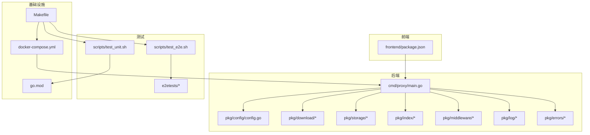
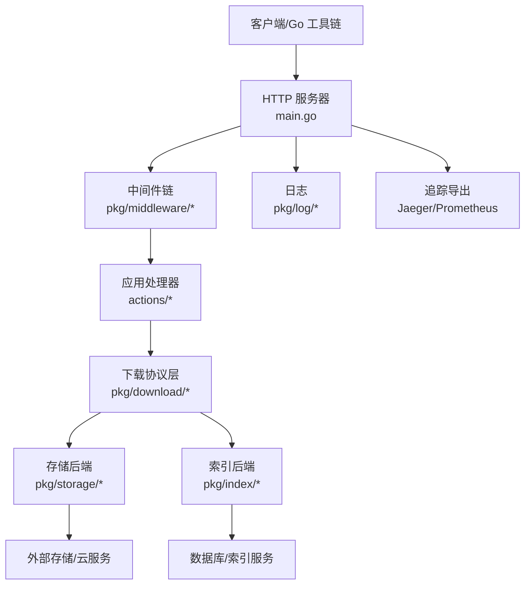
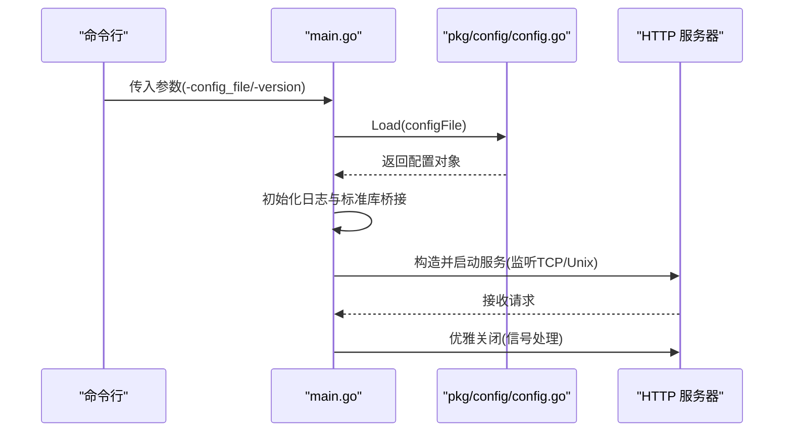
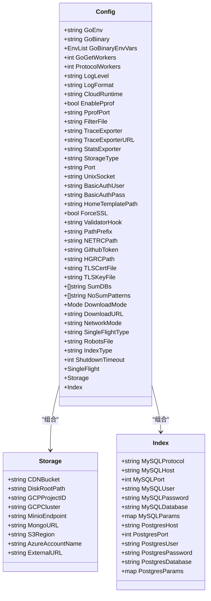
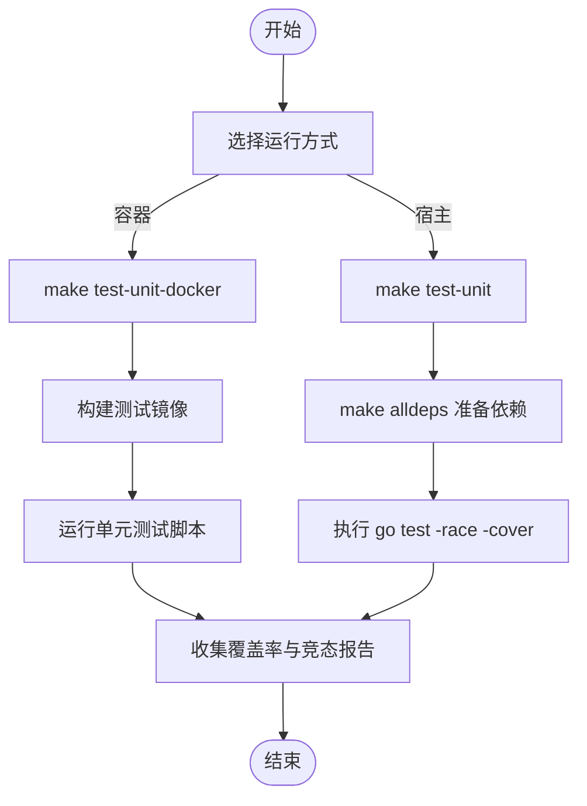
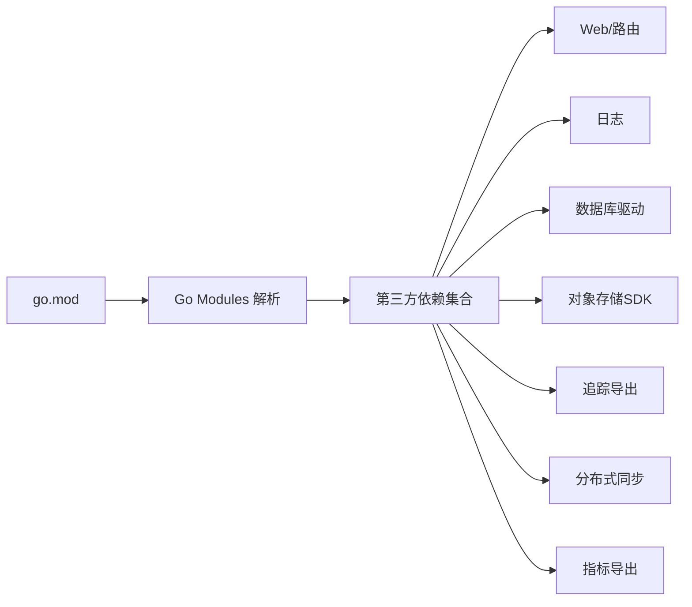

# 开发指南

<cite>
**本文引用的文件**
- [README.md](file://README.md)
- [DEVELOPMENT.md](file://DEVELOPMENT.md)
- [CONTRIBUTING.md](file://CONTRIBUTING.md)
- [Makefile](file://Makefile)
- [go.mod](file://go.mod)
- [docker-compose.yml](file://docker-compose.yml)
- [.golangci.yml](file://.golangci.yml)
- [scripts/test_unit.sh](file://scripts/test_unit.sh)
- [scripts/test_e2e.sh](file://scripts/test_e2e.sh)
- [scripts/check_deps.sh](file://scripts/check_deps.sh)
- [cmd/proxy/main.go](file://cmd/proxy/main.go)
- [pkg/config/config.go](file://pkg/config/config.go)
- [frontend/package.json](file://frontend/package.json)
- [config.dev.toml](file://config.dev.toml)
- [cmd/proxy/Dockerfile](file://cmd/proxy/Dockerfile)
</cite>

## 目录
1. [简介](#简介)
2. [项目结构](#项目结构)
3. [核心组件](#核心组件)
4. [架构总览](#架构总览)
5. [详细组件分析](#详细组件分析)
6. [依赖关系分析](#依赖关系分析)
7. [性能考虑](#性能考虑)
8. [故障排查指南](#故障排查指南)
9. [结论](#结论)
10. [附录](#附录)

## 简介
本开发指南面向希望参与 Athens 项目的开发者，覆盖从环境搭建、依赖安装、工具配置，到代码贡献流程（分支管理、提交规范、代码审查）、测试策略（单元与端到端）、调试与性能分析、发布流程与版本管理、以及持续集成配置等。同时提供新贡献者的入门路径与最佳实践建议。

## 项目结构
- 后端主程序位于 cmd/proxy，入口为 main.go，负责加载配置、初始化日志、构建 HTTP 处理器、启动服务与优雅关闭。
- 配置模块位于 pkg/config，支持从 TOML 文件与环境变量加载配置，并进行字段校验。
- 存储与索引实现位于 pkg/storage 与 pkg/index，支持内存、磁盘、MongoDB、MinIO、GCS、S3、Azure Blob、外部存储等多种后端。
- 下载协议与模块处理逻辑位于 pkg/download，提供版本列表、最新版本、zip 包下载等能力。
- 中间件与通用工具位于 pkg/middleware、pkg/log、pkg/errors 等包。
- 前端管理界面位于 frontend，基于 Vue 3 + TypeScript + Vite 构建。
- 测试分为单元测试与端到端测试：单元测试位于各包内；端到端测试位于 e2etests。
- 文档站点位于 docs，使用 Hugo 构建。
- 工程化脚本与编排位于根目录与 scripts 目录，通过 Makefile 统一入口。

图表来源
- [cmd/proxy/main.go](file://cmd/proxy/main.go#L1-L128)
- [pkg/config/config.go](file://pkg/config/config.go#L1-L376)
- [docker-compose.yml](file://docker-compose.yml#L1-L173)
- [Makefile](file://Makefile#L1-L131)
- [go.mod](file://go.mod#L1-L194)
- [scripts/test_unit.sh](file://scripts/test_unit.sh#L1-L22)
- [scripts/test_e2e.sh](file://scripts/test_e2e.sh#L1-L8)
- [frontend/package.json](file://frontend/package.json#L1-L30)

章节来源
- [README.md](file://README.md#L1-L96)
- [DEVELOPMENT.md](file://DEVELOPMENT.md#L1-L314)
- [Makefile](file://Makefile#L1-L131)
- [docker-compose.yml](file://docker-compose.yml#L1-L173)
- [go.mod](file://go.mod#L1-L194)

## 核心组件
- 应用入口与生命周期
  - main.go 负责解析命令行参数、加载配置、初始化日志、构造 HTTP 处理器、根据配置选择监听方式（TCP 或 Unix Socket）、启动 pprof（可选）、注册信号处理与优雅关闭。
- 配置系统
  - 支持从文件（默认优先级）与环境变量加载，内置默认值与严格校验，涵盖日志级别、存储类型、网络模式、单飞机制、索引类型、导出器、超时等。
- 下载与模块处理
  - 提供版本列表、最新版本、zip 包下载、协议适配、并发控制与池化等能力。
- 存储与索引
  - 多后端抽象，统一接口，便于替换与扩展；支持单飞一致性保障。
- 中间件与日志
  - 提供缓存控制、内容类型、过滤、请求追踪、请求 ID、日志格式化等中间件。
- 前端管理界面
  - 基于 Vue 3 的管理面板，提供仪表盘、下载、仓库与上传等功能。

章节来源
- [cmd/proxy/main.go](file://cmd/proxy/main.go#L29-L127)
- [pkg/config/config.go](file://pkg/config/config.go#L21-L66)
- [pkg/config/config.go](file://pkg/config/config.go#L129-L144)
- [pkg/config/config.go](file://pkg/config/config.go#L282-L297)
- [frontend/package.json](file://frontend/package.json#L1-L30)

## 架构总览
下图展示 Athens 的运行时架构：入口 main.go 加载配置并启动 HTTP 服务；根据配置选择存储与索引后端；下载模块时可能调用上游或本地存储；中间件贯穿请求链路；可观测性通过 Jaeger/Prometheus 等导出器接入。

图表来源
- [cmd/proxy/main.go](file://cmd/proxy/main.go#L59-L77)
- [pkg/config/config.go](file://pkg/config/config.go#L39-L66)
- [pkg/download/handler.go](file://pkg/download/handler.go)
- [pkg/storage/backend.go](file://pkg/storage/backend.go)
- [pkg/index/indexer.go](file://pkg/index/indexer.go)

## 详细组件分析

### 入口与配置加载流程
- 入口解析参数（版本信息、配置文件路径），加载配置并初始化日志。
- 根据配置选择监听方式（TCP/Unix Socket），可选启用 pprof。
- 注册信号处理，优雅关闭 HTTP 服务并等待子进程回收。

图表来源
- [cmd/proxy/main.go](file://cmd/proxy/main.go#L29-L127)
- [pkg/config/config.go](file://pkg/config/config.go#L129-L144)

章节来源
- [cmd/proxy/main.go](file://cmd/proxy/main.go#L29-L127)
- [pkg/config/config.go](file://pkg/config/config.go#L129-L144)

### 配置模型与验证
- 配置结构体包含日志、存储、索引、单飞、下载模式、网络模式、导出器、超时等字段。
- 默认配置提供开发友好值；环境变量覆盖默认值；最终进行结构化校验。
- 存储与索引类型分别进行针对性校验。

图表来源
- [pkg/config/config.go](file://pkg/config/config.go#L22-L66)
- [pkg/config/config.go](file://pkg/config/config.go#L299-L333)

章节来源
- [pkg/config/config.go](file://pkg/config/config.go#L22-L66)
- [pkg/config/config.go](file://pkg/config/config.go#L282-L297)

### 单元测试与端到端测试流程
- 单元测试：通过 Makefile 调用 scripts/test_unit.sh，在容器或宿主上运行，开启竞态检测与覆盖率。
- 端到端测试：通过 Makefile 调用 scripts/test_e2e.sh，在容器中运行 e2etests 包，模拟真实环境。

图表来源
- [Makefile](file://Makefile#L65-L83)
- [scripts/test_unit.sh](file://scripts/test_unit.sh#L1-L22)
- [scripts/test_e2e.sh](file://scripts/test_e2e.sh#L1-L8)

章节来源
- [Makefile](file://Makefile#L65-L83)
- [scripts/test_unit.sh](file://scripts/test_unit.sh#L1-L22)
- [scripts/test_e2e.sh](file://scripts/test_e2e.sh#L1-L8)

### 开发环境搭建与运行
- 使用 Docker Compose 快速启动 Athens 与依赖（MongoDB、MinIO、Jaeger 等），或在宿主直接运行。
- Makefile 提供 run、run-docker、dev、alldeps、down 等常用目标。
- Dockerfile 定义多阶段构建，包含 VCS 工具与 Go 可执行文件，暴露 3000 端口。

章节来源
- [DEVELOPMENT.md](file://DEVELOPMENT.md#L39-L82)
- [Makefile](file://Makefile#L27-L118)
- [docker-compose.yml](file://docker-compose.yml#L3-L173)
- [cmd/proxy/Dockerfile](file://cmd/proxy/Dockerfile#L1-L61)

### 文档站点构建
- Makefile 提供 docs 与 docs-docker 目标，使用 Hugo 镜像渲染 docs 内容，默认监听 1313 端口。

章节来源
- [Makefile](file://Makefile#L40-L46)
- [DEVELOPMENT.md](file://DEVELOPMENT.md#L220-L234)

## 依赖关系分析
- 语言与模块
  - 使用 Go Modules 管理依赖，Go 版本要求见 go.mod。
- 关键外部依赖
  - Web 框架与路由：gorilla/mux
  - 日志：sirupsen/logrus
  - 数据库驱动：go-sql-driver/mysql、lib/pq、go.mongodb.org/mongo-driver
  - 对象存储 SDK：aws/aws-sdk-go-v2、Azure SDK、Google Cloud Storage
  - 分布式追踪：jaeger、opencensus 生态
  - 并发与同步：etcd、redis、prometheus 导出器
- 依赖检查
  - scripts/check_deps.sh 在变更 go.mod/go.sum 时执行 go mod verify，确保版本与摘要一致。

图表来源
- [go.mod](file://go.mod#L1-L194)
- [scripts/check_deps.sh](file://scripts/check_deps.sh#L14-L22)

章节来源
- [go.mod](file://go.mod#L1-L194)
- [scripts/check_deps.sh](file://scripts/check_deps.sh#L1-L23)

## 性能考虑
- 并发与限流
  - 通过 GoGetWorkers 与 ProtocolWorkers 控制并发度，避免资源耗尽。
- 单飞机制
  - 支持 memory、etcd、redis、redis-sentinel、gcp、azureblob 等，防止重复写入。
- 下载模式
  - sync/async/redirect/async_redirect/none 等模式影响延迟与吞吐。
- 观测性
  - pprof 端口独立暴露，Prometheus 导出器采集指标，Jaeger 追踪链路。
- 存储后端
  - 选择合适的后端与连接池参数，结合压缩与缓存策略优化吞吐。

章节来源
- [pkg/config/config.go](file://pkg/config/config.go#L27-L29)
- [pkg/config/config.go](file://pkg/config/config.go#L290-L316)
- [cmd/proxy/main.go](file://cmd/proxy/main.go#L69-L77)

## 故障排查指南
- 常见问题定位
  - 端口占用：确认 Port/UnixSocket 配置与系统占用情况。
  - 存储不可达：检查 ATHENS_MONGO_STORAGE_URL、MinIO 端点、凭证与网络连通性。
  - 认证问题：核对 BasicAuth、GitHub Token、.netrc 路径与权限。
  - 超时与网络：调整 Timeout、NetworkMode、DownloadMode。
- 日志与追踪
  - 日志级别与格式由配置决定；追踪导出器需与 Jaeger/Prometheus 集成。
- 单元测试失败
  - 使用 make test-unit-docker 或宿主模式，开启 -race 并查看覆盖率报告。
- 端到端测试失败
  - 确保已执行 make setup-dev-env 或 make dev，依赖服务已就绪。

章节来源
- [pkg/config/config.go](file://pkg/config/config.go#L24-L66)
- [pkg/config/config.go](file://pkg/config/config.go#L129-L144)
- [Makefile](file://Makefile#L48-L83)
- [docker-compose.yml](file://docker-compose.yml#L47-L83)

## 结论
本指南提供了从环境搭建到贡献发布的全链路指引，结合配置模型、测试策略与可观测性，帮助新老贡献者高效参与项目。建议在提交前完成本地验证（依赖检查、静态检查、单元测试、端到端测试），并遵循分支与评审流程以保证质量与一致性。

## 附录

### 开发环境搭建步骤
- 安装依赖
  - Go 版本满足 go.mod 要求；Docker 与 Docker Compose（用于容器化开发）。
- 获取代码
  - 克隆仓库并在本地检出。
- 启动依赖
  - 使用 make dev 或 make alldeps 启动最小依赖或全部依赖。
- 运行服务
  - make run（宿主）或 make run-docker（容器）。
- 验证
  - curl localhost:3000 检查响应；查看日志与 pprof（如启用）。

章节来源
- [DEVELOPMENT.md](file://DEVELOPMENT.md#L17-L314)
- [Makefile](file://Makefile#L107-L118)
- [docker-compose.yml](file://docker-compose.yml#L107-L118)

### 依赖安装与工具配置
- 依赖管理
  - 使用 go.mod 管理依赖；变更 go.mod/go.sum 时执行 go mod verify。
- 静态检查
  - 使用 golangci-lint，规则与排除项见 .golangci.yml。
- 文档构建
  - 使用 Makefile 的 docs/docs-docker 目标。

章节来源
- [scripts/check_deps.sh](file://scripts/check_deps.sh#L1-L23)
- [.golangci.yml](file://.golangci.yml#L1-L88)
- [Makefile](file://Makefile#L40-L46)

### 代码贡献流程
- 分支管理
  - 建议基于 main 分支创建功能分支；修复类 PR 可直接指向 main。
- 提交规范
  - 提交信息清晰描述变更目的与范围；必要时关联 Issue。
- 代码审查
  - 提交 PR 后按 REVIEWS.md 流程进行审查与修改。
- 本地验证
  - make verify、make lint、make test-unit、make test-e2e。

章节来源
- [CONTRIBUTING.md](file://CONTRIBUTING.md#L6-L41)
- [DEVELOPMENT.md](file://DEVELOPMENT.md#L243-L314)
- [Makefile](file://Makefile#L60-L83)

### 测试策略
- 单元测试
  - 脚本：scripts/test_unit.sh；目标：make test-unit、make test-unit-docker。
  - 覆盖率与竞态检测：-race -coverprofile -covermode。
- 端到端测试
  - 脚本：scripts/test_e2e.sh；目标：make test-e2e、make test-e2e-docker。
  - 依赖：Docker Compose 服务（MongoDB、MinIO、Jaeger）。
- 文档测试
  - 使用 Hugo 镜像渲染文档站点。

章节来源
- [scripts/test_unit.sh](file://scripts/test_unit.sh#L1-L22)
- [scripts/test_e2e.sh](file://scripts/test_e2e.sh#L1-L8)
- [Makefile](file://Makefile#L65-L83)
- [docker-compose.yml](file://docker-compose.yml#L1-L173)

### 调试技巧与性能分析
- pprof
  - 通过配置启用 pprof 端口，独立于业务端口，便于性能分析与阻塞排查。
- 日志
  - 根据 LogLevel 与 LogFormat 输出结构化或纯文本日志，结合 CloudRuntime 选择输出格式。
- 追踪
  - 配置 TraceExporter 与 TraceExporterURL，接入 Jaeger/Prometheus。
- 并发与限流
  - 调整 GoGetWorkers、ProtocolWorkers、单飞类型与锁参数，平衡吞吐与一致性。

章节来源
- [cmd/proxy/main.go](file://cmd/proxy/main.go#L69-L77)
- [pkg/config/config.go](file://pkg/config/config.go#L31-L38)
- [pkg/config/config.go](file://pkg/config/config.go#L314-L316)

### 发布流程与版本管理
- 版本号
  - 遵循语义化版本；小版本更新 x，补丁更新 y。
- 代码冻结
  - 发布前进行代码冻结窗口，仅合并关键修复。
- 分支策略
  - 小版本：从 main 切出 release-v0.x.0；补丁：从最近 release 分支 cherry-pick 修复。
- 发布步骤
  - 在 GitHub 创建 Release 标签与说明；等待 CI 完成并检查镜像发布状态。
- 合并回主干
  - 发布分支合并回 main。

章节来源
- [DEVELOPMENT.md](file://DEVELOPMENT.md#L243-L314)

### 持续集成配置
- CI 工作流
  - 仓库包含 CI 配置文件（例如 GitHub Actions），在 PR 与主分支推送时触发构建、测试与验证。
- 验证任务
  - 依赖检查、静态检查、单元测试、端到端测试、依赖扫描与安全检查。

章节来源
- [README.md](file://README.md#L5-L11)
- [Makefile](file://Makefile#L60-L83)
- [scripts/check_deps.sh](file://scripts/check_deps.sh#L1-L23)
- [.golangci.yml](file://.golangci.yml#L1-L88)

### 新贡献者入门建议
- 从 README 的“开发”与“贡献”入口开始，阅读 DEVELOPMENT.md 与 CONTRIBUTING.md。
- 选择合适的“好起步” Issue，先在本地完成一次完整的开发-测试-提交流程。
- 遵循编码风格与审查流程，保持简洁、可读、可维护。

章节来源
- [README.md](file://README.md#L39-L62)
- [CONTRIBUTING.md](file://CONTRIBUTING.md#L1-L41)