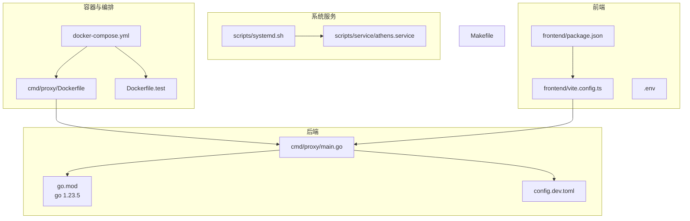
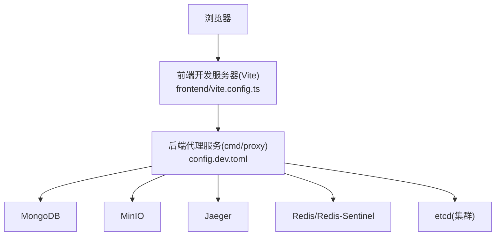
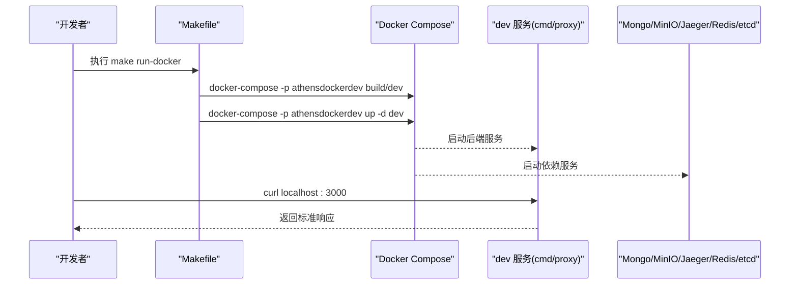
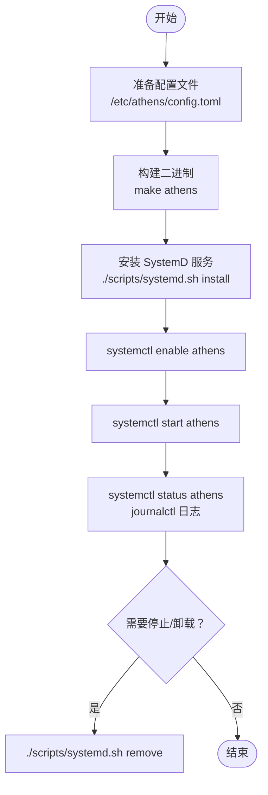
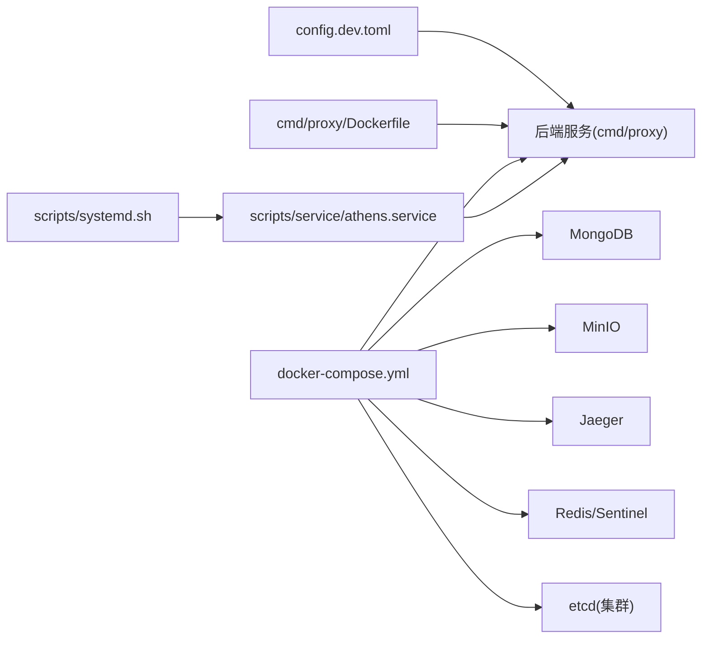

# 开发环境搭建

<cite>
**本文引用的文件**
- [DEVELOPMENT.md](file://DEVELOPMENT.md)
- [go.mod](file://go.mod)
- [Makefile](file://Makefile)
- [docker-compose.yml](file://docker-compose.yml)
- [cmd/proxy/Dockerfile](file://cmd/proxy/Dockerfile)
- [scripts/service/athens.service](file://scripts/service/athens.service)
- [scripts/systemd.sh](file://scripts/systemd.sh)
- [config.dev.toml](file://config.dev.toml)
- [frontend/package.json](file://frontend/package.json)
- [frontend/vite.config.ts](file://frontend/vite.config.ts)
- [frontend/.env](file://frontend/.env)
- [scripts/test_unit.sh](file://scripts/test_unit.sh)
- [scripts/test_e2e.sh](file://scripts/test_e2e.sh)
- [CONTRIBUTING.md](file://CONTRIBUTING.md)
</cite>

## 目录
1. [简介](#简介)
2. [项目结构](#项目结构)
3. [核心组件](#核心组件)
4. [架构总览](#架构总览)
5. [详细组件分析](#详细组件分析)
6. [依赖关系分析](#依赖关系分析)
7. [性能与并发](#性能与并发)
8. [故障排除指南](#故障排除指南)
9. [结论](#结论)
10. [附录](#附录)

## 简介
本指南面向希望在本地搭建 Athens 开发环境的工程师，覆盖以下内容：
- Go 版本要求与环境变量配置
- 四种运行方式：Docker 方式、SystemD 服务方式、本地二进制方式、Sail 方式
- Docker Compose 服务依赖的启动与停止命令
- 开发工具链配置：前端与后端、调试与代理、热重载
- 常见问题与故障排除

## 项目结构
仓库采用多模块与多语言混合结构：
- 后端为 Go 语言，主程序位于 cmd/proxy
- 配置示例位于 config.dev.toml
- Docker 化构建与测试位于 cmd/proxy/Dockerfile 与 Dockerfile.test
- 开发与测试编排位于 docker-compose.yml
- Makefile 提供统一构建、运行、测试与清理命令
- 前端位于 frontend，使用 Vue 3 + Vite

图表来源
- [cmd/proxy/main.go](file://cmd/proxy/main.go)
- [go.mod](file://go.mod#L1-L10)
- [config.dev.toml](file://config.dev.toml#L1-L628)
- [cmd/proxy/Dockerfile](file://cmd/proxy/Dockerfile#L1-L61)
- [Dockerfile.test](file://Dockerfile.test)
- [docker-compose.yml](file://docker-compose.yml#L1-L173)
- [scripts/service/athens.service](file://scripts/service/athens.service#L1-L64)
- [scripts/systemd.sh](file://scripts/systemd.sh#L1-L171)
- [frontend/package.json](file://frontend/package.json#L1-L30)
- [frontend/vite.config.ts](file://frontend/vite.config.ts#L1-L25)
- [frontend/.env](file://frontend/.env#L1-L1)
- [Makefile](file://Makefile#L1-L131)

章节来源
- [Makefile](file://Makefile#L1-L131)
- [docker-compose.yml](file://docker-compose.yml#L1-L173)
- [cmd/proxy/Dockerfile](file://cmd/proxy/Dockerfile#L1-L61)
- [scripts/service/athens.service](file://scripts/service/athens.service#L1-L64)
- [scripts/systemd.sh](file://scripts/systemd.sh#L1-L171)
- [frontend/package.json](file://frontend/package.json#L1-L30)
- [frontend/vite.config.ts](file://frontend/vite.config.ts#L1-L25)
- [frontend/.env](file://frontend/.env#L1-L1)

## 核心组件
- 后端服务：cmd/proxy 提供代理服务，默认监听 3000 端口；可通过配置文件或环境变量调整
- 容器镜像：cmd/proxy/Dockerfile 使用 Alpine 基础镜像，预装 Git、Mercurial、Subversion、Fossil 等版本控制工具，并内置 go 可执行文件
- 编排与依赖：docker-compose.yml 提供 dev、testunit、teste2e 等服务，以及 MongoDB、MinIO、Jaeger、Redis、etcd 等依赖
- 系统服务：scripts/service/athens.service 定义 SystemD 单元；scripts/systemd.sh 提供安装、卸载、状态查询与日志查看
- 前端：frontend 使用 Vite + Vue 3，开发服务器通过代理转发到后端 3000 端口

章节来源
- [config.dev.toml](file://config.dev.toml#L134-L143)
- [cmd/proxy/Dockerfile](file://cmd/proxy/Dockerfile#L30-L61)
- [docker-compose.yml](file://docker-compose.yml#L3-L83)
- [scripts/service/athens.service](file://scripts/service/athens.service#L1-L64)
- [scripts/systemd.sh](file://scripts/systemd.sh#L1-L171)
- [frontend/vite.config.ts](file://frontend/vite.config.ts#L17-L24)

## 架构总览
下图展示开发环境的典型拓扑：浏览器访问前端，前端通过 Vite 代理到后端；后端根据配置选择存储与索引后端；Docker Compose 启动数据库、对象存储、追踪等依赖。

图表来源
- [frontend/vite.config.ts](file://frontend/vite.config.ts#L17-L24)
- [config.dev.toml](file://config.dev.toml#L122-L126)
- [docker-compose.yml](file://docker-compose.yml#L47-L167)

## 详细组件分析

### Go 版本与环境变量
- Go 版本：go.mod 指定 go 1.23.5；DEVELOPMENT.md 要求 v1.11+，建议使用 1.23.5
- 环境变量
  - GO_BINARY_PATH：指定 go 可执行文件路径
  - GO111MODULE=on：启用 Go Modules（在 GOPATH 外默认开启）
  - 其他常用：GOPROXY、GODEBUG 等可通过配置项传递给底层 go 命令

章节来源
- [go.mod](file://go.mod#L3-L3)
- [DEVELOPMENT.md](file://DEVELOPMENT.md#L17-L26)
- [config.dev.toml](file://config.dev.toml#L8-L46)

### 运行方式一：Docker 方式
- 适用场景：模拟真实部署，一键拉起后端与依赖
- 关键命令
  - 启动：make run-docker
  - 停止：make run-docker-teardown
- 依赖服务：MongoDB、MinIO、Jaeger、Redis、Redis-Sentinel、etcd(3 节点)
- 访问：默认映射至宿主机 3000 端口

图表来源
- [Makefile](file://Makefile#L31-L38)
- [docker-compose.yml](file://docker-compose.yml#L3-L18)
- [cmd/proxy/Dockerfile](file://cmd/proxy/Dockerfile#L1-L61)

章节来源
- [DEVELOPMENT.md](file://DEVELOPMENT.md#L39-L82)
- [Makefile](file://Makefile#L31-L38)
- [docker-compose.yml](file://docker-compose.yml#L1-L173)
- [cmd/proxy/Dockerfile](file://cmd/proxy/Dockerfile#L1-L61)

### 运行方式二：SystemD 服务方式
- 适用场景：Linux 上以系统服务形式长期运行
- 步骤
  - 准备配置：复制 config.dev.toml 为 /etc/athens/config.toml
  - 构建二进制：make athens 或直接 go build
  - 安装服务：sudo ./scripts/systemd.sh install
  - 状态与日志：sudo systemctl status athens；sudo journalctl -u athens --since today --follow
  - 卸载：sudo ./scripts/systemd.sh remove
- 安全与权限
  - 默认用户/组：www-data
  - 可选提权：cap_net_bind_service 使非 root 绑定特权端口
  - 读写路径：ReadWritePaths 指向配置中 RootPath

图表来源
- [scripts/systemd.sh](file://scripts/systemd.sh#L76-L81)
- [scripts/systemd.sh](file://scripts/systemd.sh#L84-L102)
- [scripts/service/athens.service](file://scripts/service/athens.service#L1-L64)

章节来源
- [DEVELOPMENT.md](file://DEVELOPMENT.md#L83-L117)
- [scripts/systemd.sh](file://scripts/systemd.sh#L1-L171)
- [scripts/service/athens.service](file://scripts/service/athens.service#L1-L64)
- [config.dev.toml](file://config.dev.toml#L399-L402)

### 运行方式三：本地二进制方式
- 适用场景：快速验证与开发调试
- 步骤
  - 进入 cmd/proxy 目录，go build 生成二进制
  - 使用 -config_file 指向配置文件启动
  - 默认监听 3000 端口，可通过配置修改
- 测试与验证
  - curl localhost:3000 验证响应
  - 可结合 Makefile 的 run 目标进行快速启动

章节来源
- [DEVELOPMENT.md](file://DEVELOPMENT.md#L118-L135)
- [Makefile](file://Makefile#L27-L29)
- [config.dev.toml](file://config.dev.toml#L134-L143)

### 运行方式四：Sail 方式
- 适用场景：云端一体化开发环境，无需本地安装
- 步骤
  - 安装 Sail CLI，执行 sail run gomods/athens
  - 自动克隆仓库并提供可编辑的浏览器开发环境
- 注意：Sail 为第三方工具，具体行为以官方文档为准

章节来源
- [DEVELOPMENT.md](file://DEVELOPMENT.md#L136-L144)

### Docker Compose 服务依赖与生命周期
- 服务定义
  - dev：后端服务，暴露 3000 端口，依赖 mongo、jaeger
  - testunit：单元测试容器，依赖 mongo、minio
  - teste2e：端到端测试容器
  - mongo、minio、jaeger、redis、redis-sentinel、etcd(3 节点)
- 启停命令
  - 启动最小依赖：make dev
  - 启动全部依赖：make alldeps
  - 停止：make down 或 make dev-teardown
  - 单独停止 dev：make run-docker-teardown

章节来源
- [docker-compose.yml](file://docker-compose.yml#L1-L173)
- [Makefile](file://Makefile#L99-L118)

### 开发工具链配置
- 后端
  - Go Modules：go.mod 已声明 go 1.23.5
  - 构建与运行：Makefile 提供 build、run、proxy-docker 等目标
  - 测试：make test-unit、make test-unit-docker、make test-e2e、make test-e2e-docker
- 前端
  - 依赖管理：package.json
  - 开发服务器：vite.config.ts 配置代理到后端 3000 端口
  - API 基础路径：frontend/.env 中的 VITE_API_BASE_URL
- 文档
  - 文档服务：make docs 与 make docs-docker

章节来源
- [go.mod](file://go.mod#L1-L10)
- [Makefile](file://Makefile#L10-L131)
- [frontend/package.json](file://frontend/package.json#L1-L30)
- [frontend/vite.config.ts](file://frontend/vite.config.ts#L1-L25)
- [frontend/.env](file://frontend/.env#L1-L1)

## 依赖关系分析
- 后端对配置的依赖：config.dev.toml 决定存储类型、索引类型、网络模式、单飞机制等
- 容器镜像对构建工具的依赖：cmd/proxy/Dockerfile 在构建阶段使用 go build 并内置 go 可执行文件
- 编排对服务的依赖：dev 服务依赖 mongo、jaeger；testunit 依赖 mongo、minio
- SystemD 对系统能力的依赖：cap_net_bind_service、ReadWritePaths、私有目录与只读系统路径保护

图表来源
- [config.dev.toml](file://config.dev.toml#L122-L126)
- [cmd/proxy/Dockerfile](file://cmd/proxy/Dockerfile#L25-L28)
- [docker-compose.yml](file://docker-compose.yml#L3-L83)
- [scripts/service/athens.service](file://scripts/service/athens.service#L1-L64)
- [scripts/systemd.sh](file://scripts/systemd.sh#L63-L73)

章节来源
- [config.dev.toml](file://config.dev.toml#L1-L628)
- [docker-compose.yml](file://docker-compose.yml#L1-L173)
- [cmd/proxy/Dockerfile](file://cmd/proxy/Dockerfile#L1-L61)
- [scripts/service/athens.service](file://scripts/service/athens.service#L1-L64)
- [scripts/systemd.sh](file://scripts/systemd.sh#L1-L171)

## 性能与并发
- 并发参数
  - GoGetWorkers：并发下载工作数，影响“git clone”并发度
  - ProtocolWorkers：协议层并发请求数
- 存储与索引
  - StorageType 支持 memory、disk、mongo、gcp、minio、s3、azureblob、external
  - IndexType 支持 none、memory、mysql、postgres
- 单飞机制
  - SingleFlightType 支持 memory、etcd、redis、redis-sentinel、gcp、azureblob
  - 针对并发写入同一模块时的互斥控制
- 超时与优雅关闭
  - Timeout：外部网络调用超时
  - ShutdownTimeout：优雅关闭等待时间

章节来源
- [config.dev.toml](file://config.dev.toml#L48-L55)
- [config.dev.toml](file://config.dev.toml#L67-L74)
- [config.dev.toml](file://config.dev.toml#L122-L126)
- [config.dev.toml](file://config.dev.toml#L317-L321)
- [config.dev.toml](file://config.dev.toml#L290-L316)
- [config.dev.toml](file://config.dev.toml#L116-L120)
- [config.dev.toml](file://config.dev.toml#L323-L327)

## 故障排除指南
- 端口占用
  - 确认 3000 端口未被占用；如需变更，修改 config.dev.toml 的 Port 或通过环境变量覆盖
- 依赖未就绪
  - 使用 make dev 或 make alldeps 启动依赖；等待服务健康后再启动后端
- 权限问题（SystemD）
  - 若无法绑定 80/443，请确认是否已赋予 cap_net_bind_service 权限
  - 确认 ReadWritePaths 指向的根路径存在且可写
- 日志定位
  - SystemD：sudo journalctl -u athens --since today --follow
  - Docker：docker-compose logs -f dev
- 单元测试失败
  - 确保依赖已启动：make alldeps
  - 使用脚本设置必要环境变量：scripts/test_unit.sh
- 端到端测试失败
  - 首次运行需先 make setup-dev-env
  - 确认后端与依赖均处于健康状态

章节来源
- [config.dev.toml](file://config.dev.toml#L134-L143)
- [scripts/systemd.sh](file://scripts/systemd.sh#L59-L60)
- [Makefile](file://Makefile#L99-L118)
- [scripts/test_unit.sh](file://scripts/test_unit.sh#L1-L22)
- [CONTRIBUTING.md](file://CONTRIBUTING.md#L13-L32)

## 结论
通过本指南，您可以基于四种方式之一快速搭建 Athens 开发环境：Docker 最贴近生产、SystemD 适合长期运行、本地二进制便于调试、Sail 提供云端一体化体验。配合 docker-compose 的依赖编排与 Makefile 的统一命令，开发与测试流程清晰可控。遇到问题时，优先检查端口、依赖健康状态与权限配置，并结合日志定位根因。

## 附录
- 快速命令清单
  - 启动后端（Docker）：make run-docker
  - 停止后端（Docker）：make run-docker-teardown
  - 启动最小依赖：make dev
  - 启动全部依赖：make alldeps
  - 停止依赖：make down
  - SystemD 安装：sudo ./scripts/systemd.sh install
  - SystemD 状态：sudo systemctl status athens
  - 单元测试（本机）：make test-unit
  - 单元测试（容器）：make test-unit-docker
  - 端到端测试（容器）：make test-e2e-docker
  - 文档服务：make docs 与 make docs-docker
- 前端代理
  - Vite 代理到后端 3000 端口，API 基础路径由 VITE_API_BASE_URL 控制

章节来源
- [Makefile](file://Makefile#L31-L131)
- [frontend/vite.config.ts](file://frontend/vite.config.ts#L17-L24)
- [frontend/.env](file://frontend/.env#L1-L1)