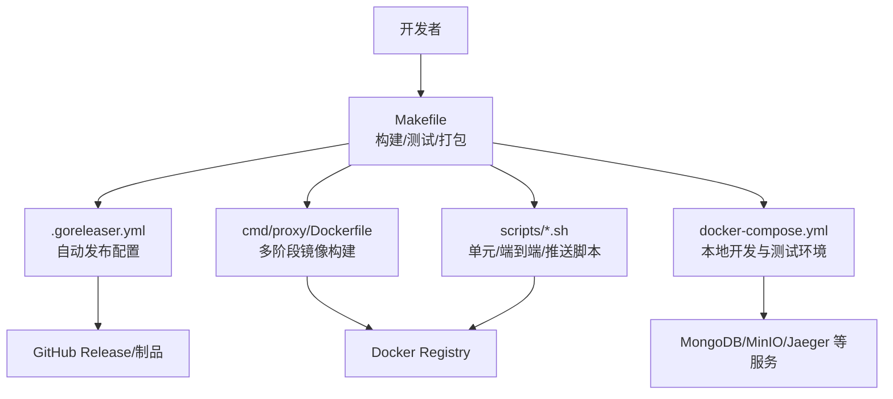
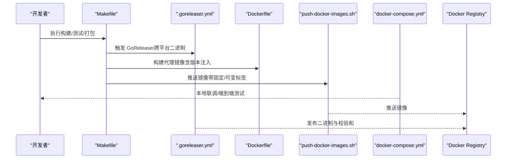
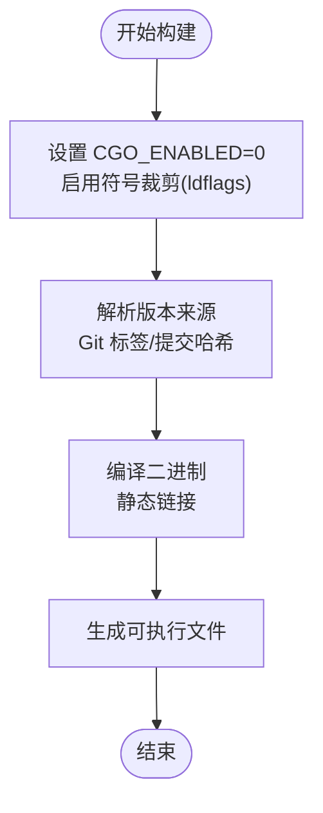
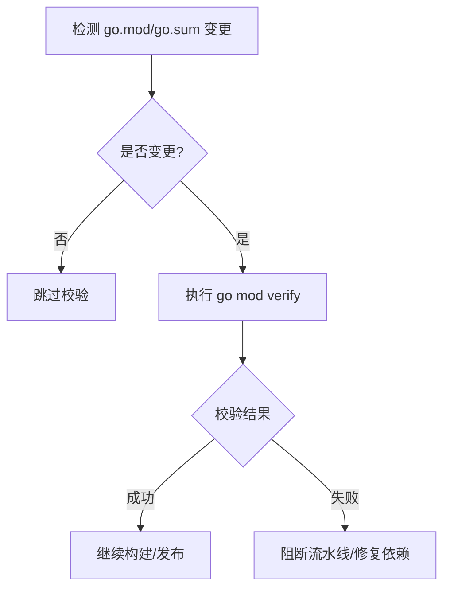
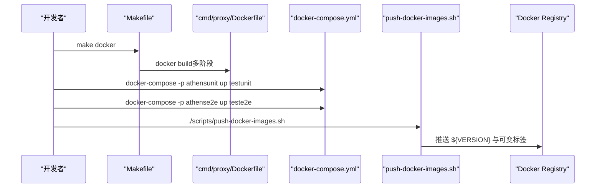
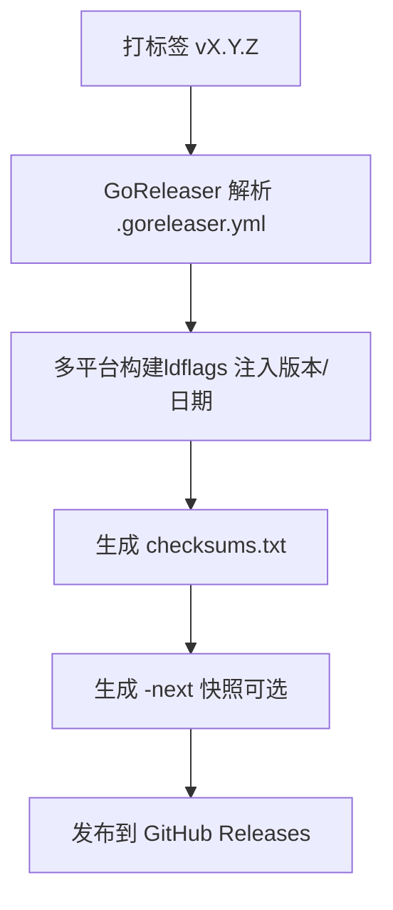
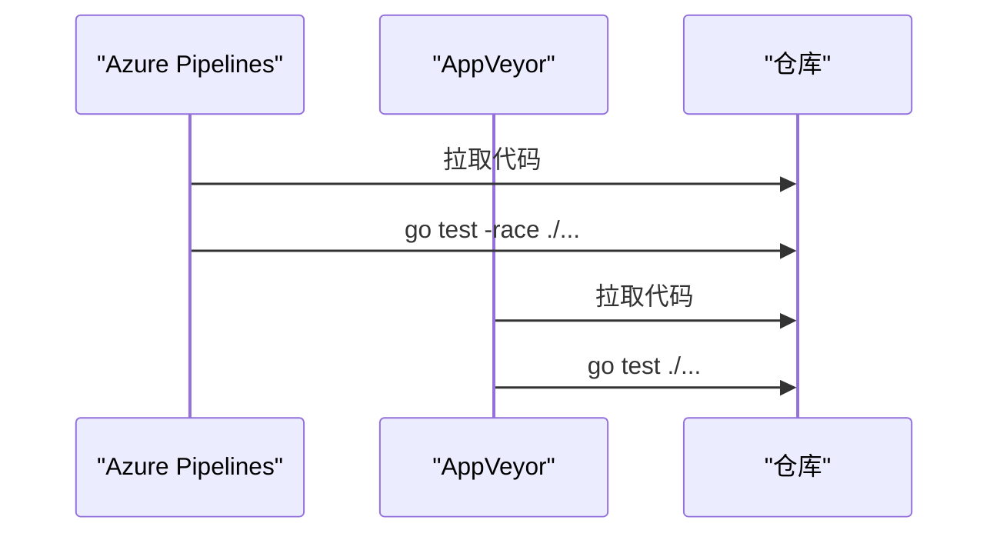
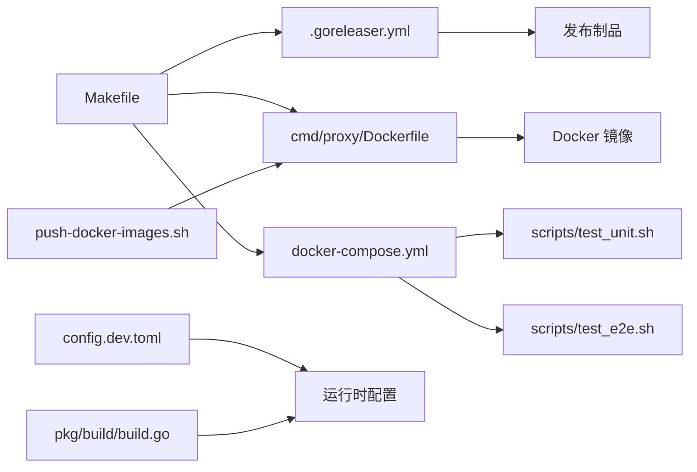

# 构建与发布

<cite>
**本文引用的文件**
- [Makefile](file://Makefile)
- [.goreleaser.yml](file://.goreleaser.yml)
- [go.mod](file://go.mod)
- [cmd/proxy/Dockerfile](file://cmd/proxy/Dockerfile)
- [scripts/build-image/Dockerfile](file://scripts/build-image/Dockerfile)
- [scripts/push-docker-images.sh](file://scripts/push-docker-images.sh)
- [scripts/test_unit.sh](file://scripts/test_unit.sh)
- [scripts/test_e2e.sh](file://scripts/test_e2e.sh)
- [scripts/check_deps.sh](file://scripts/check_deps.sh)
- [pkg/build/build.go](file://pkg/build/build.go)
- [config.dev.toml](file://config.dev.toml)
- [docker-compose.yml](file://docker-compose.yml)
- [azure-pipelines.yml](file://azure-pipelines.yml)
- [appveyor.yml](file://appveyor.yml)
</cite>

## 目录
1. [简介](#简介)
2. [项目结构](#项目结构)
3. [核心组件](#核心组件)
4. [架构总览](#架构总览)
5. [详细组件分析](#详细组件分析)
6. [依赖关系分析](#依赖关系分析)
7. [性能考虑](#性能考虑)
8. [故障排查指南](#故障排查指南)
9. [结论](#结论)
10. [附录](#附录)

## 简介
本文件系统性梳理 Athens 项目的构建与发布流程，覆盖以下主题：
- 构建过程：编译选项、静态链接、版本信息注入、产物生成
- 依赖管理：Go 模块与版本锁定、依赖一致性校验
- 版本管理与语义化版本：版本标签、构建元数据、变更日志
- 发布分支与冻结：分支策略、版本标签创建、冻结窗口
- Docker 镜像：多阶段构建、可复现镜像、推送策略
- 自动化与手动发布：GoReleaser 配置、CI/CD 流水线、手动步骤
- 发布前检查清单、回滚策略、发布后验证
- Helm Chart 维护（概念性说明）

## 项目结构
本项目采用“命令入口 + 多模块库 + 脚本工具”的组织方式：
- 命令入口位于 cmd/proxy，包含主程序与 Dockerfile
- 核心业务逻辑分布在 pkg 下的子包（下载、存储、索引、中间件等）
- 构建与发布通过 Makefile、.goreleaser.yml、脚本与 docker-compose 协同完成
- CI/CD 使用 Azure Pipelines 与 AppVeyor（Windows）进行测试

图表来源
- [Makefile](file://Makefile#L1-L131)
- [.goreleaser.yml](file://.goreleaser.yml#L1-L35)
- [cmd/proxy/Dockerfile](file://cmd/proxy/Dockerfile#L1-L61)
- [docker-compose.yml](file://docker-compose.yml#L1-L173)

章节来源
- [Makefile](file://Makefile#L1-L131)
- [docker-compose.yml](file://docker-compose.yml#L1-L173)

## 核心组件
- 构建与版本注入
  - 通过 ldflags 注入版本号与构建时间，版本来源于 Git 标签或提交哈希
  - 构建产物为单个二进制文件，支持静态链接以提升可移植性
- 依赖与版本管理
  - go.mod 固定 Go 版本与依赖版本；go.sum 锁定校验和
  - 提供依赖一致性校验脚本，仅在 go.mod/go.sum 变更时触发
- Docker 镜像
  - 多阶段构建：builder 阶段拉取依赖并编译，运行时基于 Alpine
  - 预装 VCS 工具与 tini，便于容器内执行 go 命令
- 自动化发布
  - GoReleaser 配置跨平台构建、版本注入、变更日志与快照发布
- CI/CD
  - Azure Pipelines 与 AppVeyor 分别用于 Windows 与通用测试

章节来源
- [Makefile](file://Makefile#L10-L23)
- [.goreleaser.yml](file://.goreleaser.yml#L11-L28)
- [go.mod](file://go.mod#L1-L10)
- [scripts/check_deps.sh](file://scripts/check_deps.sh#L1-L23)
- [cmd/proxy/Dockerfile](file://cmd/proxy/Dockerfile#L11-L61)
- [azure-pipelines.yml](file://azure-pipelines.yml#L1-L28)
- [appveyor.yml](file://appveyor.yml#L1-L19)

## 架构总览
下图展示从源码到发布制品的关键路径与参与者。

图表来源
- [Makefile](file://Makefile#L10-L23)
- [.goreleaser.yml](file://.goreleaser.yml#L11-L28)
- [cmd/proxy/Dockerfile](file://cmd/proxy/Dockerfile#L25-L38)
- [scripts/push-docker-images.sh](file://scripts/push-docker-images.sh#L1-L35)
- [docker-compose.yml](file://docker-compose.yml#L1-L173)

## 详细组件分析

### 构建与编译选项
- 编译器与链接器
  - 启用 CGO 禁用（CGO_ENABLED=0），确保静态链接与可移植性
  - 使用 ldflags 进行符号裁剪（-s -w）与版本注入
- 版本与构建时间注入
  - 通过 -X 将版本与构建时间注入二进制，版本来源优先使用 Git 标签，其次提交哈希
  - 运行时可通过 pkg/build 获取版本信息
- 产物
  - 生成单个二进制文件，便于分发与部署

图表来源
- [Makefile](file://Makefile#L14-L16)
- [pkg/build/build.go](file://pkg/build/build.go#L18-L38)

章节来源
- [Makefile](file://Makefile#L10-L23)
- [pkg/build/build.go](file://pkg/build/build.go#L1-L39)

### 依赖与版本管理
- Go 版本与模块
  - go.mod 固定 Go 版本与依赖版本，go.sum 锁定校验和
- 依赖一致性校验
  - 当 go.mod 或 go.sum 发生变更时，自动执行 go mod verify，避免冲突与不一致
- 依赖打包
  - 构建镜像时使用 GOPROXY 指向国内镜像，加速依赖拉取

图表来源
- [scripts/check_deps.sh](file://scripts/check_deps.sh#L14-L22)
- [go.mod](file://go.mod#L1-L10)

章节来源
- [scripts/check_deps.sh](file://scripts/check_deps.sh#L1-L23)
- [go.mod](file://go.mod#L1-L10)

### Docker 镜像构建、测试与推送
- 多阶段构建
  - builder 阶段：安装 Go、设置 GOPROXY、编译二进制
  - 运行时阶段：Alpine 基础镜像，预装 VCS 工具与 tini，拷贝二进制与默认配置
- 可复现性
  - 通过 ARG 传入 GOLANG_VERSION，确保镜像可复现
- 测试
  - docker-compose 定义了 testunit 与 teste2e 服务，分别运行单元与端到端测试脚本
- 推送
  - push-docker-images.sh 根据分支/标签选择固定或可变标签，统一推送

图表来源
- [Makefile](file://Makefile#L85-L94)
- [cmd/proxy/Dockerfile](file://cmd/proxy/Dockerfile#L11-L61)
- [docker-compose.yml](file://docker-compose.yml#L18-L40)
- [scripts/push-docker-images.sh](file://scripts/push-docker-images.sh#L1-L35)

章节来源
- [cmd/proxy/Dockerfile](file://cmd/proxy/Dockerfile#L1-L61)
- [docker-compose.yml](file://docker-compose.yml#L1-L173)
- [scripts/push-docker-images.sh](file://scripts/push-docker-images.sh#L1-L35)

### 自动化发布流程（GoReleaser）
- 跨平台构建
  - 同时构建 linux/amd64、linux/arm64、darwin/amd64、darwin/arm64
- 版本注入
  - 使用 {{ .Tag }} 作为版本号，{{ .Env.DATE }} 作为构建日期
- 快照与变更日志
  - 生成 checksums.txt
  - snapshot 生成 -next 快照版本
  - 过滤特定类型变更（如 docs:test）进入变更日志

图表来源
- [.goreleaser.yml](file://.goreleaser.yml#L11-L35)

章节来源
- [.goreleaser.yml](file://.goreleaser.yml#L1-L35)

### CI/CD 流水线
- Azure Pipelines（Windows）
  - 设置 GOPATH/GOPROXY，执行 go test -race ./...
- AppVeyor（Windows）
  - 设置 GO111MODULE=on，执行 go test ./...

图表来源
- [azure-pipelines.yml](file://azure-pipelines.yml#L15-L27)
- [appveyor.yml](file://appveyor.yml#L15-L17)

章节来源
- [azure-pipelines.yml](file://azure-pipelines.yml#L1-L28)
- [appveyor.yml](file://appveyor.yml#L1-L19)

### 发布前检查清单
- 代码与依赖
  - 确认 go.mod/go.sum 无未声明变更
  - 依赖一致性校验通过
- 构建与测试
  - 本地构建成功（静态链接、符号裁剪）
  - 单元测试与端到端测试通过
  - docker-compose 本地联调通过
- 版本与标签
  - 正确打上语义化版本标签
  - 版本注入正确（二进制包含版本/日期）
- 镜像与推送
  - 镜像构建成功
  - 推送固定与可变标签
- 文档与变更日志
  - 更新必要的文档与变更日志条目

章节来源
- [scripts/check_deps.sh](file://scripts/check_deps.sh#L1-L23)
- [Makefile](file://Makefile#L65-L83)
- [docker-compose.yml](file://docker-compose.yml#L1-L173)
- [.goreleaser.yml](file://.goreleaser.yml#L25-L35)

### 回滚策略
- 镜像回滚
  - 使用固定版本标签回滚到上一个稳定版本
  - 如需快速回滚，可使用可变标签（如 latest/canary）指向旧版本
- 二进制回滚
  - 从 GitHub Releases 下载上一版本二进制替换当前版本
- 数据与配置
  - 存储后端（MongoDB/MinIO 等）保留历史数据，必要时回退迁移
- 验证
  - 回滚后执行最小化回归测试，确认核心功能正常

章节来源
- [scripts/push-docker-images.sh](file://scripts/push-docker-images.sh#L12-L24)
- [.goreleaser.yml](file://.goreleaser.yml#L25-L35)

### 发布后验证
- 功能验证
  - 通过 docker-compose 启动服务，执行基本请求链路测试
- 性能与稳定性
  - 运行基准脚本（如存在）评估性能回归
- 日志与监控
  - 检查日志级别与导出器配置（Prometheus/Jaeger 等）
- 配置与安全
  - 校验 config.dev.toml 中关键参数（端口、超时、认证等）

章节来源
- [docker-compose.yml](file://docker-compose.yml#L1-L173)
- [config.dev.toml](file://config.dev.toml#L1-L628)

### Helm Chart 维护（概念性说明）
- Chart 结构
  - 包含 Deployment、Service、ConfigMap、Secret 等资源定义
- 版本与依赖
  - 使用 Chart.yaml 管理版本与依赖（requirements.yaml 或 Chart.yaml dependencies）
- 发布流程
  - 本地验证（helm lint/ template/ install）
  - 打标签并发布到 Chart 仓库（如 OCI 仓库或 Helm 仓库）
- 迭代维护
  - 随应用版本升级同步更新 Chart 版本与依赖
  - 保持 values.yaml 与 config.dev.toml 的一致性

[本节为概念性说明，不直接分析具体文件，故无章节来源]

## 依赖关系分析
- 构建与发布
  - Makefile 调用 .goreleaser.yml 与 Dockerfile
  - push-docker-images.sh 依赖 Git 标签/分支推断镜像标签
- 测试与验证
  - docker-compose 串联本地服务与测试脚本
- 版本与配置
  - pkg/build/build.go 读取注入的版本信息
  - config.dev.toml 提供运行时配置

图表来源
- [Makefile](file://Makefile#L10-L23)
- [.goreleaser.yml](file://.goreleaser.yml#L11-L28)
- [cmd/proxy/Dockerfile](file://cmd/proxy/Dockerfile#L25-L38)
- [scripts/push-docker-images.sh](file://scripts/push-docker-images.sh#L7-L24)
- [docker-compose.yml](file://docker-compose.yml#L18-L40)
- [pkg/build/build.go](file://pkg/build/build.go#L18-L38)
- [config.dev.toml](file://config.dev.toml#L1-L628)

章节来源
- [Makefile](file://Makefile#L1-L131)
- [scripts/push-docker-images.sh](file://scripts/push-docker-images.sh#L1-L35)
- [docker-compose.yml](file://docker-compose.yml#L1-L173)

## 性能考虑
- 静态链接与裁剪
  - CGO 禁用与符号裁剪减少二进制体积，提升启动速度
- 依赖拉取优化
  - 使用 GOPROXY 加速依赖下载，缩短构建时间
- 并行测试
  - 单元测试启用 race 检测与覆盖率，有助于发现并发问题
- 镜像层优化
  - 多阶段构建仅包含运行时所需文件，减小镜像体积

[本节提供一般性指导，不直接分析具体文件，故无章节来源]

## 故障排查指南
- 构建失败
  - 检查 CGO_ENABLED、GOPROXY、GOLANG_VERSION 是否正确
  - 确认 ldflags 注入的版本/日期格式正确
- 依赖问题
  - 执行依赖一致性校验，定位冲突或校验和不匹配
- 测试失败
  - 使用 docker-compose 启动测试服务，查看测试输出
- 镜像推送失败
  - 检查 REGISTRY、VERSION/MUTABLE_TAG 推断逻辑
  - 确认 Docker Registry 凭据与网络连通性

章节来源
- [Makefile](file://Makefile#L10-L23)
- [scripts/check_deps.sh](file://scripts/check_deps.sh#L1-L23)
- [docker-compose.yml](file://docker-compose.yml#L1-L173)
- [scripts/push-docker-images.sh](file://scripts/push-docker-images.sh#L6-L34)

## 结论
本文件总结了 Athens 项目的构建与发布实践：通过静态链接、版本注入与多阶段镜像实现可复现构建；借助 GoReleaser 实现跨平台自动化发布；结合依赖校验与 CI/CD 保障质量；并提供回滚与验证建议。遵循本文流程可在保证质量的同时高效交付版本。

[本节为总结性内容，不直接分析具体文件，故无章节来源]

## 附录
- 关键命令与脚本
  - 构建：make build / make build-ver
  - 测试：make test-unit / make test-e2e
  - 镜像：make docker / make proxy-docker
  - 推送：./scripts/push-docker-images.sh
- 配置参考
  - config.dev.toml 提供运行时配置项与默认值
  - docker-compose.yml 定义本地开发与测试环境

章节来源
- [Makefile](file://Makefile#L10-L94)
- [scripts/push-docker-images.sh](file://scripts/push-docker-images.sh#L1-L35)
- [config.dev.toml](file://config.dev.toml#L1-L628)
- [docker-compose.yml](file://docker-compose.yml#L1-L173)