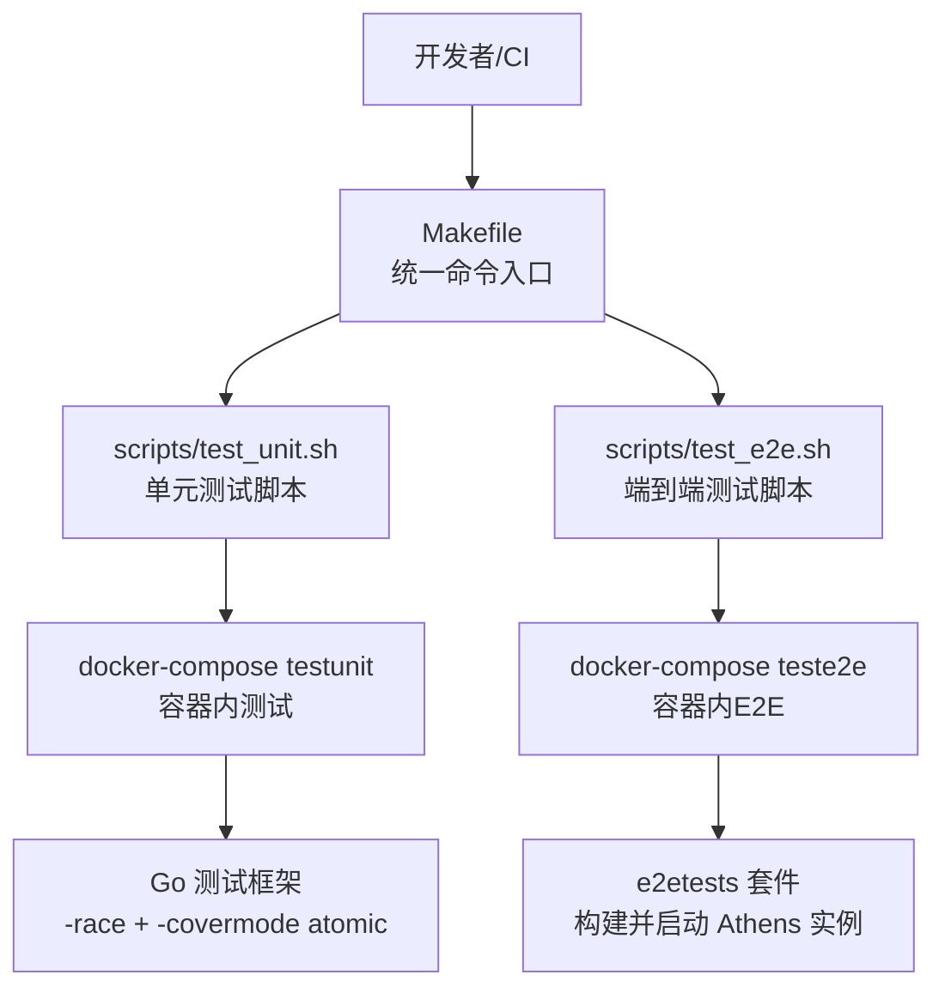
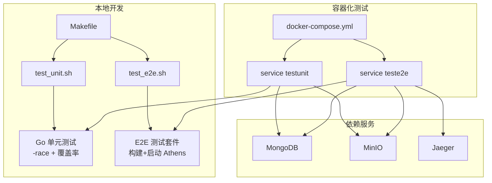
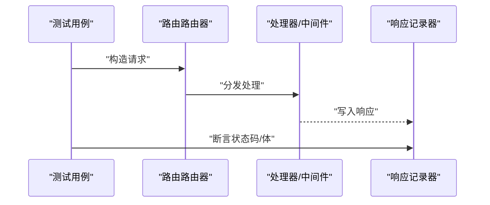
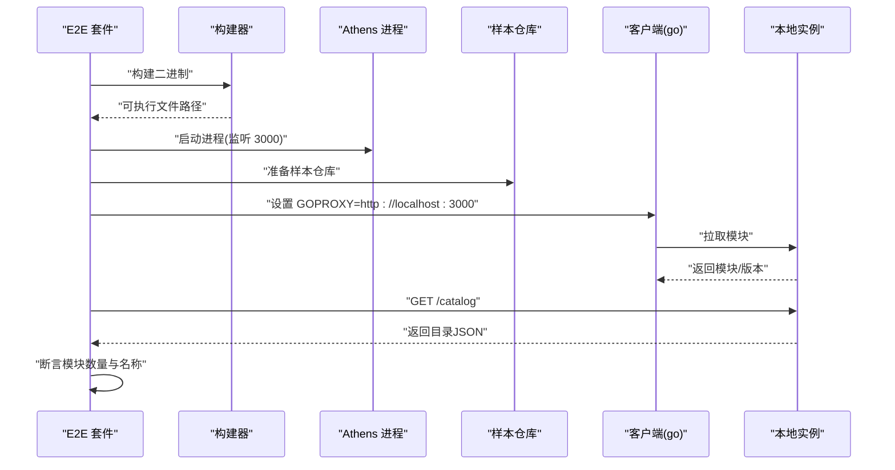
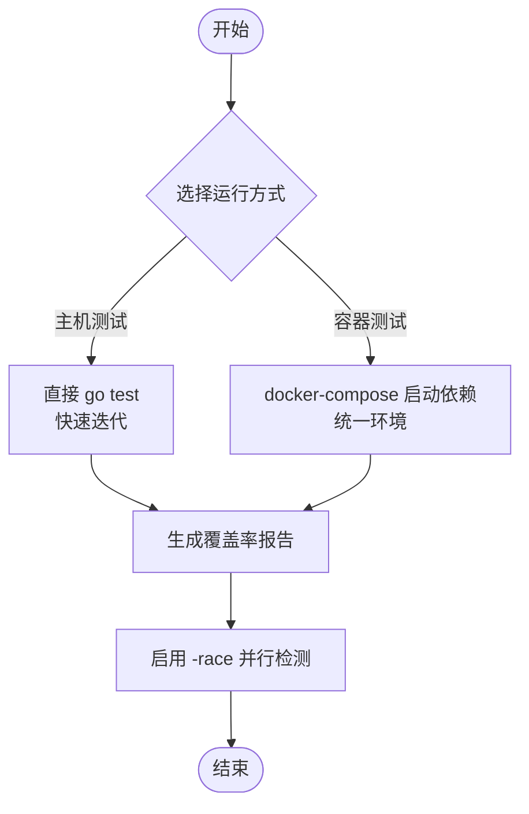
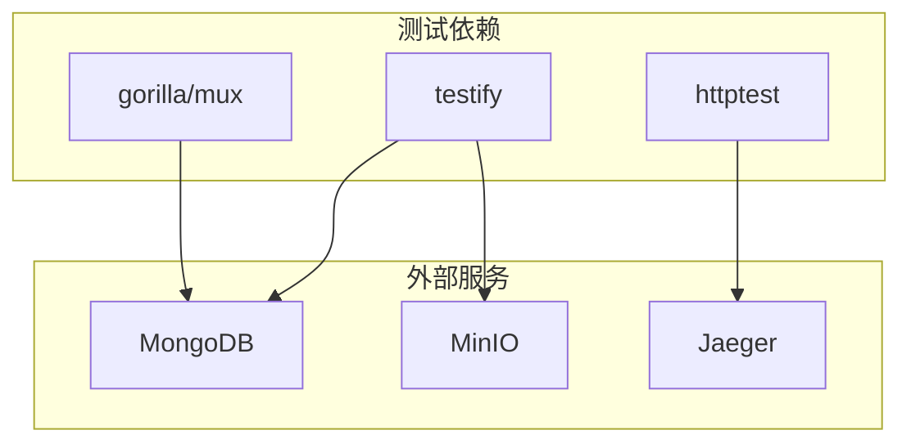

# 测试策略

<cite>
**本文引用的文件**
- [go.mod](file://go.mod)
- [Makefile](file://Makefile)
- [scripts/test_unit.sh](file://scripts/test_unit.sh)
- [scripts/test_e2e.sh](file://scripts/test_e2e.sh)
- [Dockerfile.test](file://Dockerfile.test)
- [docker-compose.yml](file://docker-compose.yml)
- [e2etests/all_test.go](file://e2etests/all_test.go)
- [cmd/proxy/actions/app_proxy_test.go](file://cmd/proxy/actions/app_proxy_test.go)
- [cmd/proxy/actions/basicauth_test.go](file://cmd/proxy/actions/basicauth_test.go)
- [cmd/proxy/actions/index_test.go](file://cmd/proxy/actions/index_test.go)
- [cmd/proxy/actions/sumdb_test.go](file://cmd/proxy/actions/sumdb_test.go)
- [scripts/benchmark.sh](file://scripts/benchmark.sh)
- [scripts/check_deps.sh](file://scripts/check_deps.sh)
- [scripts/check_conflicts.sh](file://scripts/check_conflicts.sh)
- [test/ct.yaml](file://test/ct.yaml)
</cite>

## 目录
1. [引言](#引言)
2. [项目结构](#项目结构)
3. [核心组件](#核心组件)
4. [架构总览](#架构总览)
5. [详细组件分析](#详细组件分析)
6. [依赖分析](#依赖分析)
7. [性能考量](#性能考量)
8. [故障排查指南](#故障排查指南)
9. [结论](#结论)
10. [附录](#附录)

## 引言
本测试策略文档面向 Athens 项目的开发与运维团队，系统化阐述单元测试、集成测试与端到端测试（E2E）的执行方法、最佳实践与落地工具链。重点覆盖两类单元测试运行方式：容器内测试与主机测试的差异与适用场景；端到端测试的配置、执行与结果分析；测试数据准备、模拟服务与环境隔离策略；测试覆盖率要求、性能测试方法与回归测试流程；以及测试调试技巧与常见问题的解决方案。

## 项目结构
- 单元测试：以 Go 原生 testing 包为主，广泛使用 testify 进行断言与 suite 组织，部分模块通过 httptest 模拟 HTTP 请求，或通过内存存储替代真实外部依赖。
- 端到端测试：位于 e2etests 目录，使用构建与启动 Athens 实例的方式，结合外部样本仓库进行真实场景验证。
- 构建与运行：通过 Makefile 提供统一入口，配合 docker-compose 启动数据库、对象存储与追踪等依赖服务；Dockerfile.test 为容器内测试提供基础镜像。
- 覆盖率与并发：脚本默认启用 -race 并生成覆盖率报告；benchmark 脚本提供基准测试入口。

图表来源
- [Makefile](file://Makefile#L65-L83)
- [scripts/test_unit.sh](file://scripts/test_unit.sh#L1-L22)
- [scripts/test_e2e.sh](file://scripts/test_e2e.sh#L1-L8)
- [docker-compose.yml](file://docker-compose.yml#L18-L40)

章节来源
- [Makefile](file://Makefile#L65-L83)
- [docker-compose.yml](file://docker-compose.yml#L1-L173)

## 核心组件
- 单元测试套件
  - 路由与控制器：如代理路由、索引处理器、BasicAuth 中间件、SumDB 代理等，均通过 httptest 模拟请求并断言响应状态码与行为。
  - 配置与日志：通过内存存储与日志器进行隔离测试，避免外部依赖。
- 端到端测试套件
  - 使用临时 GOPATH 与 GOCACHE，构建并启动 Athens 实例，通过 GOPROXY 指向本地实例，拉取样本仓库并校验目录返回。
- 容器内测试与主机测试
  - 主机测试：直接在宿主机运行 go test，适合快速迭代与本地调试。
  - 容器内测试：通过 docker-compose 将测试置于与生产相近的网络与依赖环境中，确保跨平台一致性与可重复性。
- 性能与回归
  - 提供基准测试脚本，定位存储层等热点路径性能瓶颈；check_deps 与 check_conflicts 保障依赖一致性与合并冲突清理。

章节来源
- [cmd/proxy/actions/app_proxy_test.go](file://cmd/proxy/actions/app_proxy_test.go#L1-L113)
- [cmd/proxy/actions/basicauth_test.go](file://cmd/proxy/actions/basicauth_test.go#L1-L93)
- [cmd/proxy/actions/index_test.go](file://cmd/proxy/actions/index_test.go#L1-L124)
- [cmd/proxy/actions/sumdb_test.go](file://cmd/proxy/actions/sumdb_test.go#L1-L111)
- [e2etests/all_test.go](file://e2etests/all_test.go#L1-L145)
- [scripts/benchmark.sh](file://scripts/benchmark.sh#L1-L4)
- [scripts/check_deps.sh](file://scripts/check_deps.sh#L1-L23)
- [scripts/check_conflicts.sh](file://scripts/check_conflicts.sh#L1-L23)

## 架构总览
下图展示测试体系在不同阶段的交互关系与职责边界：

图表来源
- [Makefile](file://Makefile#L65-L83)
- [scripts/test_unit.sh](file://scripts/test_unit.sh#L1-L22)
- [scripts/test_e2e.sh](file://scripts/test_e2e.sh#L1-L8)
- [docker-compose.yml](file://docker-compose.yml#L18-L40)
- [docker-compose.yml](file://docker-compose.yml#L47-L59)
- [docker-compose.yml](file://docker-compose.yml#L51-L58)

## 详细组件分析

### 单元测试：路由与中间件
- 目标与范围
  - 验证代理路由、健康检查、版本信息、SumDB 代理与无签名模式匹配规则。
  - 使用内存存储与日志器，避免外部依赖。
- 关键实现要点
  - 使用 httptest.NewServer 或 NewRecorder 模拟 HTTP 请求与响应。
  - 对路径前缀、错误码、模板渲染与中间件行为进行断言。
- 最佳实践
  - 为每个路由编写正反用例，覆盖 4xx/5xx 场景。
  - 使用表驱动测试组织参数与期望值，提升可读性与可维护性。

图表来源
- [cmd/proxy/actions/app_proxy_test.go](file://cmd/proxy/actions/app_proxy_test.go#L28-L112)
- [cmd/proxy/actions/basicauth_test.go](file://cmd/proxy/actions/basicauth_test.go#L65-L88)
- [cmd/proxy/actions/index_test.go](file://cmd/proxy/actions/index_test.go#L94-L112)
- [cmd/proxy/actions/sumdb_test.go](file://cmd/proxy/actions/sumdb_test.go#L10-L38)

章节来源
- [cmd/proxy/actions/app_proxy_test.go](file://cmd/proxy/actions/app_proxy_test.go#L1-L113)
- [cmd/proxy/actions/basicauth_test.go](file://cmd/proxy/actions/basicauth_test.go#L1-L93)
- [cmd/proxy/actions/index_test.go](file://cmd/proxy/actions/index_test.go#L1-L124)
- [cmd/proxy/actions/sumdb_test.go](file://cmd/proxy/actions/sumdb_test.go#L1-L111)

### 端到端测试：配置、执行与结果分析
- 配置与准备
  - 使用临时 GOPATH 与 GOCACHE，避免污染本地环境。
  - 通过构建函数生成可执行文件，并在上下文中启动 Athens 实例。
  - 准备样本仓库，验证 GOPROXY 指向与目录接口返回。
- 执行流程
  - SetupSuite：创建临时目录、构建二进制、启动服务、初始化样本仓库。
  - SetupTest：清理缓存，保证每次用例独立。
  - 测试用例：验证未设置 GOPROXY 的行为、正确 GOPROXY 行为与错误 GOPROXY 的失败预期。
- 结果分析
  - 通过 HTTP GET /catalog 获取模块列表，断言数量与模块名。
  - 失败时输出明确错误信息，便于定位问题。

图表来源
- [e2etests/all_test.go](file://e2etests/all_test.go#L36-L61)
- [e2etests/all_test.go](file://e2etests/all_test.go#L75-L81)
- [e2etests/all_test.go](file://e2etests/all_test.go#L83-L122)
- [e2etests/all_test.go](file://e2etests/all_test.go#L102-L114)

章节来源
- [e2etests/all_test.go](file://e2etests/all_test.go#L1-L145)

### 容器内测试 vs 主机测试：差异与适用场景
- 差异对比
  - 主机测试：速度快、易调试、适合本地迭代；但可能受宿主机环境影响。
  - 容器内测试：与依赖服务在同一网络中运行，环境一致性强；适合 CI 与发布前验证。
- 适用场景
  - 主机测试：日常开发、小范围回归、快速反馈。
  - 容器内测试：全量单元测试、E2E 测试、多平台一致性验证。

图表来源
- [scripts/test_unit.sh](file://scripts/test_unit.sh#L17-L21)
- [Makefile](file://Makefile#L69-L73)
- [Makefile](file://Makefile#L79-L83)

章节来源
- [scripts/test_unit.sh](file://scripts/test_unit.sh#L1-L22)
- [Makefile](file://Makefile#L65-L83)
- [docker-compose.yml](file://docker-compose.yml#L18-L40)

### 测试数据准备、模拟服务与环境隔离
- 测试数据准备
  - 临时目录与 GOPATH/GOCACHE：确保测试隔离与可重复。
  - 样本仓库：通过 Git 仓库准备真实模块与版本，便于验证下载与索引逻辑。
- 模拟服务
  - 使用 httptest.NewServer 模拟上游 SumDB 与外部接口。
  - 使用内存存储替代真实数据库与对象存储，降低耦合。
- 环境隔离
  - docker-compose 将数据库、对象存储与追踪服务隔离在独立容器中，避免端口冲突。
  - 通过环境变量控制存储类型与连接串，支持多后端切换。

章节来源
- [e2etests/all_test.go](file://e2etests/all_test.go#L36-L61)
- [e2etests/all_test.go](file://e2etests/all_test.go#L124-L144)
- [cmd/proxy/actions/sumdb_test.go](file://cmd/proxy/actions/sumdb_test.go#L10-L38)
- [docker-compose.yml](file://docker-compose.yml#L47-L59)
- [docker-compose.yml](file://docker-compose.yml#L51-L58)

### 覆盖率要求与性能测试
- 覆盖率要求
  - 默认启用 -race 与 -covermode atomic，建议在 CI 中对关键包设定最小覆盖率阈值（例如 80%），并在 PR 中强制检查。
- 性能测试
  - 使用基准测试脚本对存储层等热点路径进行压力测试，识别性能瓶颈。
  - 结合 Jaeger 追踪服务观察调用链耗时，定位慢点。

章节来源
- [scripts/test_unit.sh](file://scripts/test_unit.sh#L20-L21)
- [scripts/benchmark.sh](file://scripts/benchmark.sh#L1-L4)
- [docker-compose.yml](file://docker-compose.yml#L68-L79)

### 回归测试流程
- 触发条件
  - 提交代码后自动触发单元测试与 E2E 测试；合并前再次运行以确保稳定性。
- 关键步骤
  - 依赖一致性检查：当 go.mod/go.sum 变更时执行 go mod verify。
  - 冲突清理检查：扫描非 Go 配置文件中的合并冲突标记，防止误提交。
- Helm Chart 验证
  - 使用 ct.yaml 配置 Helm chart 目录与超时参数，确保部署验证通过。

章节来源
- [scripts/check_deps.sh](file://scripts/check_deps.sh#L1-L23)
- [scripts/check_conflicts.sh](file://scripts/check_conflicts.sh#L1-L23)
- [test/ct.yaml](file://test/ct.yaml#L1-L5)

## 依赖分析
- 外部依赖
  - 数据库：MongoDB（用于索引与统计）、Redis/etcd（用于缓存与分布式锁）。
  - 对象存储：MinIO（兼容 S3 接口）。
  - 追踪与可观测性：Jaeger。
- 测试依赖
  - 单元测试依赖 testify、httptest、gorilla/mux 等。
  - E2E 测试依赖外部 Git 仓库与本地 Athens 实例。

图表来源
- [go.mod](file://go.mod#L5-L53)
- [docker-compose.yml](file://docker-compose.yml#L47-L59)
- [docker-compose.yml](file://docker-compose.yml#L51-L58)
- [docker-compose.yml](file://docker-compose.yml#L68-L79)

章节来源
- [go.mod](file://go.mod#L1-L194)
- [docker-compose.yml](file://docker-compose.yml#L1-L173)

## 性能考量
- 并发与竞态
  - 默认启用 -race，建议在 CI 中保持开启，尽早发现数据竞争问题。
- 覆盖率与性能平衡
  - 在保证关键路径覆盖率的前提下，优先优化热点路径与慢查询。
- 基准测试
  - 使用基准测试脚本对存储层进行压测，关注吞吐与延迟指标。

章节来源
- [scripts/test_unit.sh](file://scripts/test_unit.sh#L20-L21)
- [scripts/benchmark.sh](file://scripts/benchmark.sh#L1-L4)

## 故障排查指南
- 常见问题与解决
  - 端口冲突：确认 MinIO/Mongo/Jaeger 端口映射是否与宿主机占用冲突。
  - GOPROXY 设置：E2E 测试需显式设置 GOPROXY 指向本地实例，否则无法命中代理。
  - 缓存污染：每次测试前清理 GOPATH 与 GOCACHE，避免历史缓存影响。
  - 依赖不一致：当 go.mod/go.sum 变更时，执行 go mod verify；同时使用 check_conflicts 清理合并冲突标记。
- 调试技巧
  - 使用 -v 输出详细日志，结合 -run 指定用例过滤。
  - 在容器内测试时，查看容器日志与依赖服务日志（如 MongoDB/MinIO/Jaeger）。
  - 对于路由与中间件问题，优先使用 httptest 快速复现并断言。

章节来源
- [e2etests/all_test.go](file://e2etests/all_test.go#L75-L81)
- [e2etests/all_test.go](file://e2etests/all_test.go#L124-L144)
- [scripts/check_deps.sh](file://scripts/check_deps.sh#L1-L23)
- [scripts/check_conflicts.sh](file://scripts/check_conflicts.sh#L1-L23)

## 结论
本测试策略以“单元测试为主、容器化保障一致性、E2E 验证真实场景”为核心，辅以覆盖率与性能测试、依赖一致性与冲突清理机制，形成完整的回归与质量保障闭环。建议在 CI 中强制执行单元测试与 E2E 测试，并结合覆盖率阈值与基准测试持续优化性能与稳定性。

## 附录
- 命令速查
  - 单元测试（主机）：make test-unit
  - 单元测试（容器）：make test-unit-docker
  - 端到端测试（主机）：make test-e2e
  - 端到端测试（容器）：make test-e2e-docker
- 关键文件路径
  - 单元测试脚本：scripts/test_unit.sh
  - E2E 测试脚本：scripts/test_e2e.sh
  - 容器测试镜像：Dockerfile.test
  - 依赖服务编排：docker-compose.yml
  - E2E 套件：e2etests/all_test.go
  - 基准测试：scripts/benchmark.sh
  - 依赖检查：scripts/check_deps.sh、scripts/check_conflicts.sh
  - Helm 配置：test/ct.yaml