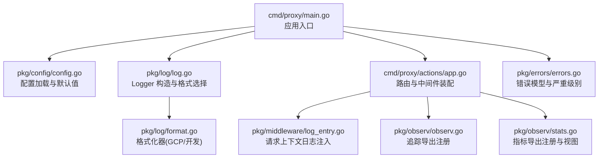
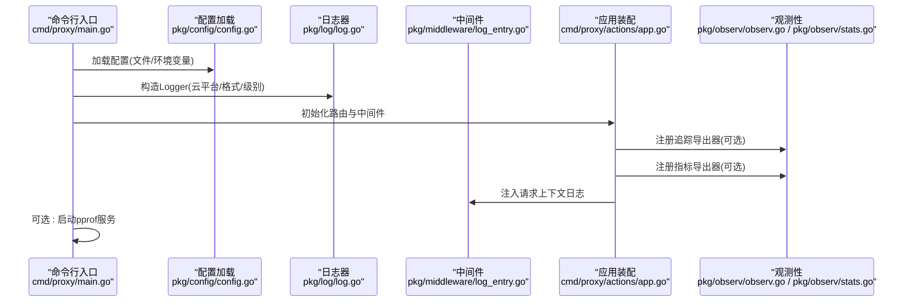
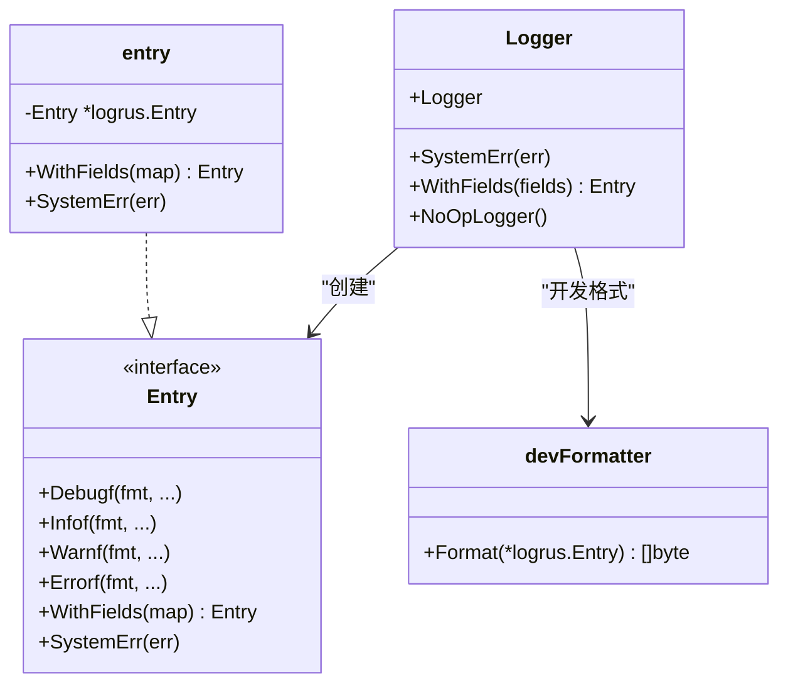
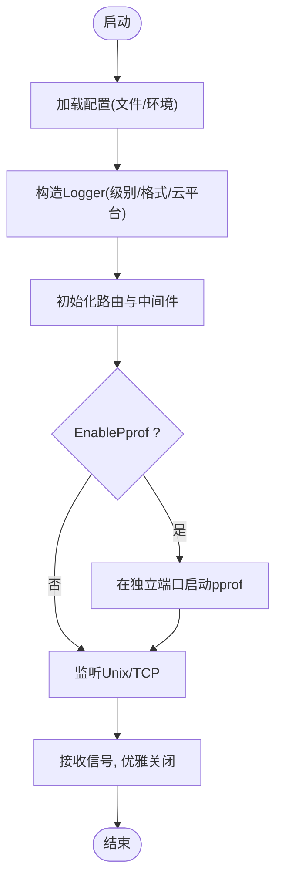
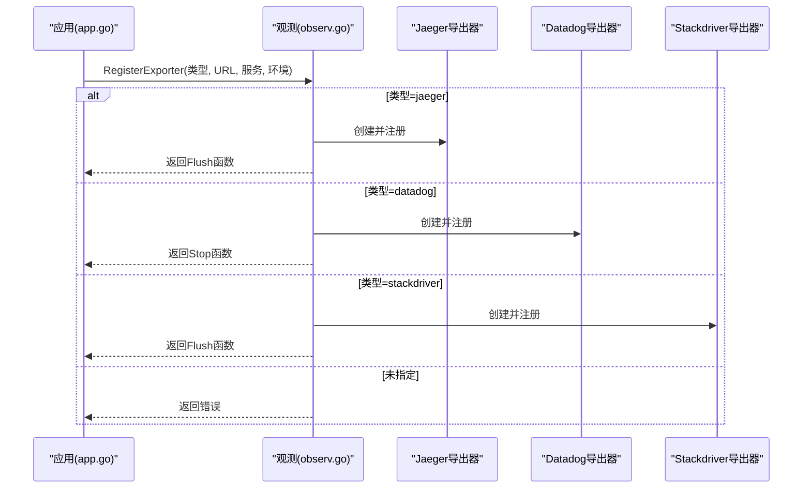
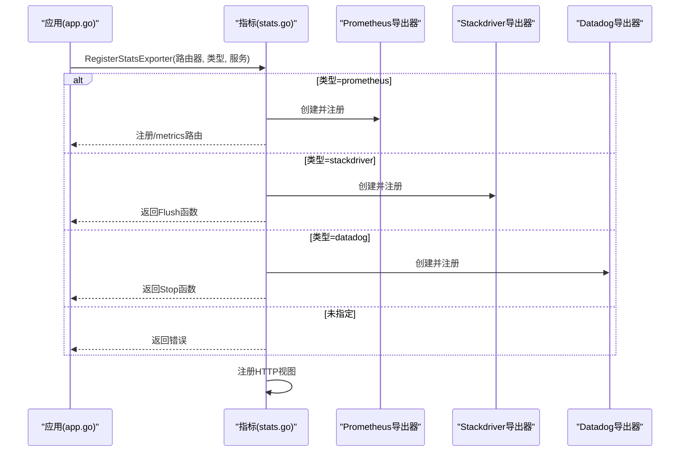
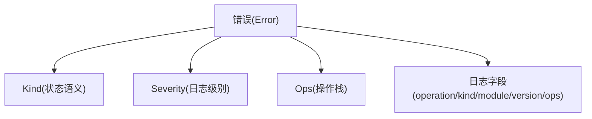
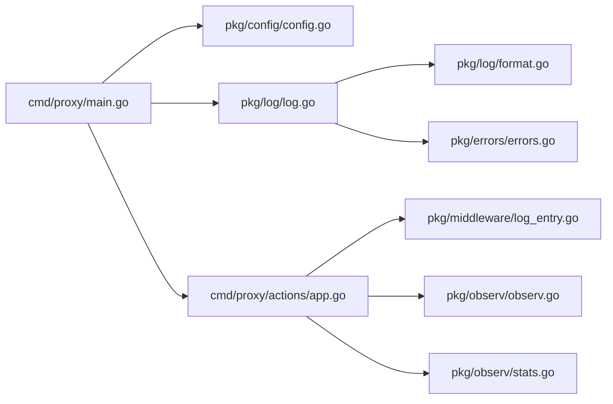

# 调试与性能分析

<cite>
**本文引用的文件**
- [cmd/proxy/main.go](file://cmd/proxy/main.go)
- [pkg/config/config.go](file://pkg/config/config.go)
- [pkg/log/log.go](file://pkg/log/log.go)
- [pkg/log/format.go](file://pkg/log/format.go)
- [pkg/log/entry.go](file://pkg/log/entry.go)
- [pkg/middleware/log_entry.go](file://pkg/middleware/log_entry.go)
- [pkg/observ/observ.go](file://pkg/observ/observ.go)
- [pkg/observ/stats.go](file://pkg/observ/stats.go)
- [cmd/proxy/actions/app.go](file://cmd/proxy/actions/app.go)
- [docs/content/configuration/logging.md](file://docs/content/configuration/logging.md)
- [config.dev.toml](file://config.dev.toml)
- [pkg/errors/errors.go](file://pkg/errors/errors.go)
</cite>

## 目录
1. [简介](#简介)
2. [项目结构](#项目结构)
3. [核心组件](#核心组件)
4. [架构总览](#架构总览)
5. [详细组件分析](#详细组件分析)
6. [依赖关系分析](#依赖关系分析)
7. [性能考量](#性能考量)
8. [故障排查指南](#故障排查指南)
9. [结论](#结论)
10. [附录](#附录)

## 简介
本指南聚焦于 Athens 在开发与生产环境中的调试与性能分析能力，涵盖以下主题：
- 开发环境调试：断点设置、变量检查、调用栈分析的建议流程
- 日志系统：日志级别、输出格式、云平台适配与上下文字段注入
- 性能分析：pprof 的启用与端口配置、CPU/内存/网络性能监控
- 分布式追踪：OpenCensus 集成、Jaeger 导出器、链路追踪
- 统计指标：Prometheus 导出、HTTP 请求/响应统计
- 常见问题诊断与性能瓶颈识别
- 生产环境问题排查工具与方法

## 项目结构
围绕调试与性能分析的关键模块如下：
- 入口与配置：命令行入口、配置加载与运行参数
- 日志子系统：统一 Logger、Entry 抽象、格式化器与云平台适配
- 中间件：请求级日志上下文注入
- 观测性：追踪导出（Jaeger/Datadog/Stackdriver）、指标导出（Prometheus/Stackdriver/Datadog）
- 错误模型：错误种类、严重级别与操作栈聚合

**图表来源**
- [cmd/proxy/main.go](file://cmd/proxy/main.go#L29-L127)
- [pkg/config/config.go](file://pkg/config/config.go#L129-L213)
- [pkg/log/log.go](file://pkg/log/log.go#L17-L27)
- [pkg/log/format.go](file://pkg/log/format.go#L14-L73)
- [cmd/proxy/actions/app.go](file://cmd/proxy/actions/app.go#L23-L138)
- [pkg/middleware/log_entry.go](file://pkg/middleware/log_entry.go#L14-L29)
- [pkg/observ/observ.go](file://pkg/observ/observ.go#L17-L93)
- [pkg/observ/stats.go](file://pkg/observ/stats.go#L19-L110)
- [pkg/errors/errors.go](file://pkg/errors/errors.go#L24-L144)

**章节来源**
- [cmd/proxy/main.go](file://cmd/proxy/main.go#L29-L127)
- [pkg/config/config.go](file://pkg/config/config.go#L129-L213)

## 核心组件
- 日志系统
  - Logger：根据云平台与格式参数构造日志器，支持 GCP 字段映射与开发友好格式
  - Entry：封装 logrus.Entry，提供带上下文字段的日志记录与错误分级
- 中间件
  - LogEntryMiddleware：在请求上下文中注入 HTTP 方法、路径、请求 ID 等字段
- 观测性
  - 追踪导出：支持 Jaeger、Datadog、Stackdriver；开发环境默认全量采样
  - 指标导出：支持 Prometheus、Stackdriver、Datadog，并注册常用 HTTP 视图
- 配置
  - 支持日志级别、日志格式、pprof 开关与端口、追踪导出器与目标、指标导出器等

**章节来源**
- [pkg/log/log.go](file://pkg/log/log.go#L17-L47)
- [pkg/log/format.go](file://pkg/log/format.go#L14-L73)
- [pkg/log/entry.go](file://pkg/log/entry.go#L13-L66)
- [pkg/middleware/log_entry.go](file://pkg/middleware/log_entry.go#L14-L29)
- [pkg/observ/observ.go](file://pkg/observ/observ.go#L17-L93)
- [pkg/observ/stats.go](file://pkg/observ/stats.go#L19-L110)
- [pkg/config/config.go](file://pkg/config/config.go#L30-L66)

## 架构总览
下图展示从启动到请求处理的关键路径，以及调试与性能分析相关组件的交互。

**图表来源**
- [cmd/proxy/main.go](file://cmd/proxy/main.go#L35-L77)
- [pkg/config/config.go](file://pkg/config/config.go#L129-L144)
- [pkg/log/log.go](file://pkg/log/log.go#L17-L27)
- [cmd/proxy/actions/app.go](file://cmd/proxy/actions/app.go#L74-L94)
- [pkg/middleware/log_entry.go](file://pkg/middleware/log_entry.go#L14-L29)
- [pkg/observ/observ.go](file://pkg/observ/observ.go#L17-L31)
- [pkg/observ/stats.go](file://pkg/observ/stats.go#L19-L46)

## 详细组件分析

### 日志系统与调试
- Logger 构造
  - 根据云平台选择格式化器；GCP 使用特定字段映射；否则按配置选择 JSON 或开发友好格式
  - 日志级别由配置解析后设置
- Entry 抽象
  - 提供 Debugf/Infof/Warnf/Errorf 与 WithFields
  - SystemErr 将错误模型转换为带上下文字段的日志，并按严重级别输出
- 开发友好格式
  - 开发格式按级别着色，时间采用易读格式，字段按键排序输出，便于快速定位
- 上下文注入
  - 中间件将请求方法、路径、请求 ID 注入日志上下文，便于串联一次请求的多条日志

**图表来源**
- [pkg/log/log.go](file://pkg/log/log.go#L9-L47)
- [pkg/log/entry.go](file://pkg/log/entry.go#L13-L66)
- [pkg/log/format.go](file://pkg/log/format.go#L24-L56)

**章节来源**
- [pkg/log/log.go](file://pkg/log/log.go#L17-L47)
- [pkg/log/format.go](file://pkg/log/format.go#L14-L73)
- [pkg/log/entry.go](file://pkg/log/entry.go#L13-L66)
- [pkg/middleware/log_entry.go](file://pkg/middleware/log_entry.go#L14-L29)

### 配置与运行参数
- 关键配置项
  - 日志级别与格式、云运行时、pprof 开关与端口、追踪导出器与目标、指标导出器
  - 默认开发配置偏向调试体验（较低日志级别、开发格式、pprof 关闭）
- 环境变量覆盖
  - 多数配置可通过环境变量覆盖，端口支持 PORT 与 ATHENS_PORT 优先级
- 启动流程
  - 解析配置 → 构造日志器 → 初始化处理器 → 可选启动 pprof → 监听 Unix/TCP → 优雅关闭

**图表来源**
- [cmd/proxy/main.go](file://cmd/proxy/main.go#L35-L127)
- [pkg/config/config.go](file://pkg/config/config.go#L129-L213)

**章节来源**
- [pkg/config/config.go](file://pkg/config/config.go#L30-L66)
- [pkg/config/config.go](file://pkg/config/config.go#L129-L213)
- [cmd/proxy/main.go](file://cmd/proxy/main.go#L35-L127)
- [config.dev.toml](file://config.dev.toml#L76-L98)

### 分布式追踪与链路分析
- 导出器注册
  - 支持 jaeger/datadog/stackdriver；未指定则不导出
  - 开发环境默认全量采样，便于调试
- 链路起点
  - 应用装配阶段注册导出器；业务中可在关键操作处开启 Span 并传递 Context
- 链路终点
  - 导出器提供 Flush 函数，应用退出时调用以确保数据落盘

**图表来源**
- [cmd/proxy/actions/app.go](file://cmd/proxy/actions/app.go#L74-L94)
- [pkg/observ/observ.go](file://pkg/observ/observ.go#L17-L65)

**章节来源**
- [pkg/observ/observ.go](file://pkg/observ/observ.go#L17-L93)
- [cmd/proxy/actions/app.go](file://cmd/proxy/actions/app.go#L74-L94)

### 指标与 HTTP 性能监控
- 指标导出器
  - 支持 prometheus、datadog、stackdriver；未指定则不收集
  - Prometheus 会暴露 /metrics 端点
- 视图注册
  - 注册常用 HTTP 指标：请求计数、响应字节、延迟分布、按状态码计数、按方法计数等
- 传输包装
  - 应用使用 ochttp.Transport 包装 HTTP 客户端，便于采集外部请求指标

**图表来源**
- [cmd/proxy/actions/app.go](file://cmd/proxy/actions/app.go#L89-L94)
- [pkg/observ/stats.go](file://pkg/observ/stats.go#L19-L110)

**章节来源**
- [pkg/observ/stats.go](file://pkg/observ/stats.go#L19-L110)
- [cmd/proxy/actions/app.go](file://cmd/proxy/actions/app.go#L109-L113)

### 错误模型与调试辅助
- 错误种类与严重级别
  - 通过 Kind 映射到 HTTP 状态语义；Severity 决定日志级别
  - Ops 聚合错误链路操作，便于构建可查询的调用栈
- 日志中的错误字段
  - 自动附加 operation、kind、module、version、ops 等字段，提升定位效率

**图表来源**
- [pkg/errors/errors.go](file://pkg/errors/errors.go#L24-L201)
- [pkg/log/entry.go](file://pkg/log/entry.go#L57-L66)

**章节来源**
- [pkg/errors/errors.go](file://pkg/errors/errors.go#L24-L201)
- [pkg/log/entry.go](file://pkg/log/entry.go#L37-L66)

## 依赖关系分析
- 入口依赖配置与日志；日志依赖格式化器；应用装配依赖中间件与观测性；观测性依赖第三方导出器；错误模型被日志与错误处理使用。

**图表来源**
- [cmd/proxy/main.go](file://cmd/proxy/main.go#L35-L77)
- [pkg/config/config.go](file://pkg/config/config.go#L129-L144)
- [pkg/log/log.go](file://pkg/log/log.go#L17-L27)
- [pkg/log/format.go](file://pkg/log/format.go#L14-L73)
- [cmd/proxy/actions/app.go](file://cmd/proxy/actions/app.go#L74-L94)
- [pkg/middleware/log_entry.go](file://pkg/middleware/log_entry.go#L14-L29)
- [pkg/observ/observ.go](file://pkg/observ/observ.go#L17-L31)
- [pkg/observ/stats.go](file://pkg/observ/stats.go#L19-L46)
- [pkg/errors/errors.go](file://pkg/errors/errors.go#L24-L41)

**章节来源**
- [cmd/proxy/main.go](file://cmd/proxy/main.go#L35-L77)
- [cmd/proxy/actions/app.go](file://cmd/proxy/actions/app.go#L74-L94)

## 性能考量
- pprof
  - 可在独立端口暴露性能分析接口，注意仅在受控环境下启用，避免信息泄露与 DoS 风险
  - 默认端口与开关由配置控制
- 指标与采样
  - 开发环境默认全量采样，便于调试；生产环境建议按需调整采样策略
- HTTP 指标
  - 注册了延迟、字节数、按状态码/方法计数等视图，结合导出器即可可视化
- 线程与并发
  - 配置中包含 GoGetWorkers 与 ProtocolWorkers，用于控制下载与协议处理并发度，避免资源耗尽

**章节来源**
- [cmd/proxy/main.go](file://cmd/proxy/main.go#L69-L77)
- [pkg/config/config.go](file://pkg/config/config.go#L33-L34)
- [pkg/config/config.go](file://pkg/config/config.go#L48-L56)
- [pkg/observ/observ.go](file://pkg/observ/observ.go#L60-L65)
- [pkg/observ/stats.go](file://pkg/observ/stats.go#L93-L110)

## 故障排查指南
- 日志级别与格式
  - 开发模式建议使用较低日志级别与开发友好格式，便于快速定位
  - 云平台运行时建议使用 GCP 字段映射，确保日志系统正确解析
- 请求上下文串联
  - 通过中间件注入的请求 ID 与路径，可将一次请求的所有日志串联起来
- 错误分级与字段
  - 使用 SystemErr 输出错误，自动携带 operation/kind/module/version/ops 等字段，便于检索
- pprof 快速验证
  - 在配置中启用 pprof 并指定端口，访问相应端点进行 CPU/内存分析
- 指标核对
  - 若启用 Prometheus，访问 /metrics 确认指标是否正常上报；若启用其他导出器，确认目标可达且凭据正确
- 追踪导出
  - 确认导出器类型与 URL 正确；开发环境默认全量采样，生产环境可根据需要调整

**章节来源**
- [docs/content/configuration/logging.md](file://docs/content/configuration/logging.md#L9-L18)
- [pkg/log/entry.go](file://pkg/log/entry.go#L37-L55)
- [cmd/proxy/main.go](file://cmd/proxy/main.go#L69-L77)
- [pkg/observ/stats.go](file://pkg/observ/stats.go#L58-L62)
- [pkg/observ/observ.go](file://pkg/observ/observ.go#L37-L57)

## 结论
- 日志系统提供了统一、可扩展的记录方式，支持开发友好格式与云平台适配
- 中间件与错误模型提升了请求级上下文与错误定位能力
- 观测性模块集成了追踪与指标导出，便于端到端性能分析
- 配置层提供了灵活的开关与参数，满足开发与生产的差异化需求

## 附录
- 配置参考
  - 日志级别与格式、pprof 开关与端口、追踪与指标导出器、端口与 Unix Socket 等
- 文档参考
  - 日志配置说明文档

**章节来源**
- [config.dev.toml](file://config.dev.toml#L76-L98)
- [docs/content/configuration/logging.md](file://docs/content/configuration/logging.md#L9-L18)