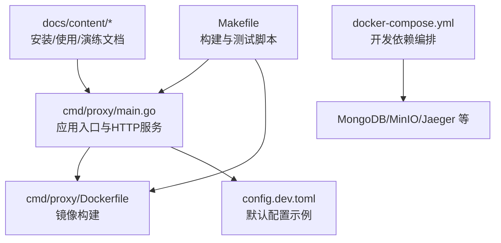
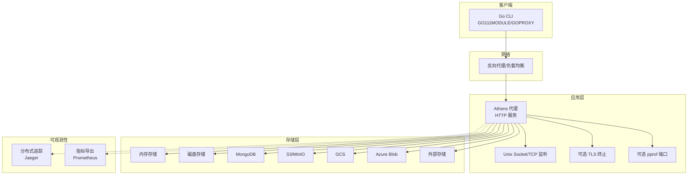
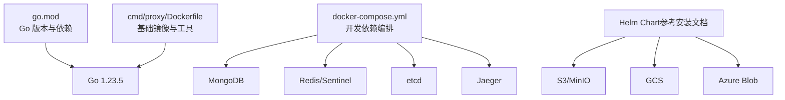

# 快速开始

<cite>
**本文引用的文件**
- [README.md](file://README.md)
- [cmd/proxy/main.go](file://cmd/proxy/main.go)
- [cmd/proxy/Dockerfile](file://cmd/proxy/Dockerfile)
- [docker-compose.yml](file://docker-compose.yml)
- [config.dev.toml](file://config.dev.toml)
- [go.mod](file://go.mod)
- [Makefile](file://Makefile)
- [docs/content/install/_index.md](file://docs/content/install/_index.md)
- [docs/content/install/using-docker.md](file://docs/content/install/using-docker.md)
- [docs/content/install/build-from-source.md](file://docs/content/install/build-from-source.md)
- [docs/content/install/install-on-kubernetes.md](file://docs/content/install/install-on-kubernetes.md)
- [docs/content/walkthrough.md](file://docs/content/walkthrough.md)
- [docs/content/try-out.md](file://docs/content/try-out.md)
- [DEVELOPMENT.md](file://DEVELOPMENT.md)
</cite>

## 目录
1. [简介](#简介)
2. [项目结构](#项目结构)
3. [核心组件](#核心组件)
4. [架构总览](#架构总览)
5. [详细组件分析](#详细组件分析)
6. [依赖分析](#依赖分析)
7. [性能考虑](#性能考虑)
8. [故障排除指南](#故障排除指南)
9. [结论](#结论)
10. [附录](#附录)

## 简介
本指南面向初学者，帮助你从零开始完成 Athens 的安装与首次运行，涵盖以下内容：
- 系统要求与环境准备
- 多种部署方式：Docker、Kubernetes（Helm）、从源码构建
- 基础配置文件与环境变量
- 初始验证步骤与常见使用场景（配置 Go CLI 使用 Athens 代理）
- 故障排除提示与预期输出

## 项目结构
仓库采用多模块与分层组织方式：
- 可执行入口位于 cmd/proxy，包含主程序与 Dockerfile
- 文档位于 docs/content，覆盖安装、使用、演练等内容
- 配置样例在 config.dev.toml
- 开发与测试脚本通过 Makefile 统一管理
- docker-compose.yml 提供开发环境依赖（数据库、追踪等）

图表来源
- [cmd/proxy/main.go](file://cmd/proxy/main.go#L1-L128)
- [cmd/proxy/Dockerfile](file://cmd/proxy/Dockerfile#L1-L61)
- [docker-compose.yml](file://docker-compose.yml#L1-L173)
- [config.dev.toml](file://config.dev.toml#L1-L628)
- [Makefile](file://Makefile#L1-L131)

章节来源
- [README.md](file://README.md#L1-L96)
- [go.mod](file://go.mod#L1-L194)

## 核心组件
- 应用入口与启动逻辑：解析命令行参数、加载配置、初始化日志、创建 HTTP 服务器、监听端口或 Unix Socket，并支持 TLS 与 pprof
- 配置系统：支持 TOML 文件与环境变量覆盖；默认端口、存储类型、日志级别、超时、上游代理、下载模式等
- 镜像与容器化：基于 Alpine 的精简镜像，内置 VCS 工具与非 root 用户
- 开发与测试：提供 Docker Compose 编排、单元测试与端到端测试脚本

章节来源
- [cmd/proxy/main.go](file://cmd/proxy/main.go#L24-L128)
- [config.dev.toml](file://config.dev.toml#L1-L628)
- [cmd/proxy/Dockerfile](file://cmd/proxy/Dockerfile#L1-L61)
- [Makefile](file://Makefile#L27-L131)

## 架构总览
下图展示了 Athens 的典型部署形态与数据流：

图表来源
- [cmd/proxy/main.go](file://cmd/proxy/main.go#L64-L114)
- [config.dev.toml](file://config.dev.toml#L122-L327)
- [docker-compose.yml](file://docker-compose.yml#L47-L79)

## 详细组件分析

### 1) Docker 部署
- 使用官方镜像或自建镜像运行 Athens
- 常见做法：挂载持久化目录、设置存储类型与根路径、映射端口
- 非 root 用户与 .gitconfig 支持便于生产环境安全运行

步骤要点
- 准备持久化目录并赋予权限
- 指定存储类型与根路径环境变量
- 映射端口 3000 并以守护进程方式启动
- 如需 HTTPS，提供证书与密钥文件

预期输出
- 容器健康且服务监听在 3000 端口
- 访问根路径返回标准欢迎信息

章节来源
- [docs/content/install/using-docker.md](file://docs/content/install/using-docker.md#L20-L88)
- [cmd/proxy/Dockerfile](file://cmd/proxy/Dockerfile#L30-L61)

### 2) Kubernetes（Helm）部署
- 通过 Helm Chart 在集群中部署 Athens
- 支持多种存储后端：disk、mongo、s3、minio、gcs、azureblob、external
- 可配置副本数、资源限制、Ingress、上游代理、私有仓库访问凭据等

步骤要点
- 添加并更新 Helm 仓库
- 安装 Chart，默认使用 disk 存储并通过 ClusterIP 暴露
- 如需对外暴露，可改为 NodePort 或 LoadBalancer，或启用 Ingress
- 如需访问私有仓库，提供 GitHub Token 或 .netrc/私有 gitconfig Secret

预期输出
- Deployment/Pod 正常运行，Service 可被集群内访问
- 若启用 Ingress，可通过域名访问

章节来源
- [docs/content/install/install-on-kubernetes.md](file://docs/content/install/install-on-kubernetes.md#L80-L303)

### 3) 从源码构建与本地运行
- 使用 Makefile 提供的构建与运行目标
- 支持直接 go run 或构建二进制运行
- 开发环境可一键拉起依赖（MongoDB、MinIO、Jaeger）

步骤要点
- 克隆仓库并进入目录
- 使用 make build-ver 或 go build 生成二进制
- 运行二进制或使用 make run 启动
- 开发依赖可用 make dev 或 docker-compose 启动

预期输出
- 控制台打印“Starting application at 127.0.0.1:3000”或类似信息
- 访问根路径返回标准响应

章节来源
- [docs/content/install/build-from-source.md](file://docs/content/install/build-from-source.md#L1-L36)
- [Makefile](file://Makefile#L10-L39)
- [DEVELOPMENT.md](file://DEVELOPMENT.md#L28-L164)

### 4) 配置文件与环境变量
- 默认配置文件为 config.dev.toml，支持所有可配置项
- 大多数配置项可通过环境变量覆盖
- 关键字段包括：端口、存储类型、日志级别、超时、上游代理、下载模式、单飞机制、索引类型、Tracing/Stats 导出等

常用配置项（节选）
- 端口与监听：Port、UnixSocket、TLSCertFile、TLSKeyFile
- 日志：LogLevel、LogFormat、CloudRuntime
- 存储：StorageType、各后端连接参数
- 上游与下载：GlobalEndpoint、DownloadMode、DownloadURL
- 单飞与索引：SingleFlightType、IndexType
- 超时与优雅停机：Timeout、ShutdownTimeout

章节来源
- [config.dev.toml](file://config.dev.toml#L134-L327)

### 5) 初始验证步骤
- 本地验证：curl 访问根路径，确认返回标准欢迎信息
- Go CLI 验证：设置 GOPROXY 指向 Athens，运行示例项目，观察日志中对 Athens 的请求与下载行为

预期输出
- curl 返回“Welcome to The Athens Proxy”
- go run 输出包含对 info/mod/zip 的请求与下载信息

章节来源
- [docs/content/walkthrough.md](file://docs/content/walkthrough.md#L66-L161)
- [docs/content/try-out.md](file://docs/content/try-out.md#L24-L67)

### 6) 常见使用场景
- 配置 Go CLI 使用 Athens 代理
  - Bash：设置 GO111MODULE=on 与 GOPROXY=http://127.0.0.1:3000
  - PowerShell：同上，使用 $env:GO111MODULE 与 $env:GOPROXY
- 验证部署成功：访问根路径、查看日志、运行示例项目
- 生产建议：启用 HTTPS、配置上游代理、选择合适的存储后端、开启 Ingress 与 TLS

章节来源
- [docs/content/walkthrough.md](file://docs/content/walkthrough.md#L124-L150)
- [docs/content/install/_index.md](file://docs/content/install/_index.md#L34-L50)

## 依赖分析
- Go 版本：1.23.5（由 go.mod 与 Dockerfile 指定）
- 外部依赖：MongoDB、Redis、Etcd、Jaeger、MinIO、AWS S3、GCS、Azure Blob 等
- 开发工具链：Docker、Docker Compose、Helm、Makefile

图表来源
- [go.mod](file://go.mod#L1-L194)
- [cmd/proxy/Dockerfile](file://cmd/proxy/Dockerfile#L1-L61)
- [docker-compose.yml](file://docker-compose.yml#L47-L167)

章节来源
- [go.mod](file://go.mod#L1-L194)
- [cmd/proxy/Dockerfile](file://cmd/proxy/Dockerfile#L1-L61)
- [docker-compose.yml](file://docker-compose.yml#L1-L173)

## 性能考虑
- 并发与工作线程：GoGetWorkers、ProtocolWorkers 控制并发抓取与协议处理能力
- 超时与优雅停机：Timeout 控制外部调用超时；ShutdownTimeout 控制优雅关闭等待时间
- 存储后端：根据吞吐与延迟需求选择合适后端（内存仅适合短期试用）
- 观测性：启用 pprof、Tracing 与 Stats 导出，便于定位性能瓶颈

章节来源
- [config.dev.toml](file://config.dev.toml#L48-L74)
- [config.dev.toml](file://config.dev.toml#L116-L120)
- [config.dev.toml](file://config.dev.toml#L323-L327)

## 故障排除指南
- Docker 初始化警告：镜像内置 tini，若宿主已启用 init 可能出现告警，属正常现象
- 端口占用：确认 3000 端口未被占用，或修改 Port/UnixSocket
- 存储不可用：检查存储后端连接字符串、凭证与网络连通性
- 上游代理：若启用 GlobalEndpoint，请确保过滤规则与上游地址正确
- 日志级别：适当提高 LogLevel 以获取更详细信息
- 开发依赖：使用 make dev 或 docker-compose 启动依赖后再运行 Athens

章节来源
- [docs/content/install/using-docker.md](file://docs/content/install/using-docker.md#L74-L88)
- [DEVELOPMENT.md](file://DEVELOPMENT.md#L48-L82)

## 结论
通过本指南，你可以快速完成 Athens 的安装与首次运行，掌握 Docker、Kubernetes 与从源码构建三种部署方式，并完成基本配置与验证。建议在生产环境中结合 HTTPS、上游代理与合适的存储后端，同时启用可观测性以保障稳定性。

## 附录

### A. 系统要求与环境准备
- Go 版本：1.23.5（用于构建与运行）
- 容器工具：Docker 与 Docker Compose（推荐）
- Kubernetes：kubectl 与 Helm（可选）
- Git 与 VCS 工具：随镜像内置

章节来源
- [go.mod](file://go.mod#L1-L194)
- [cmd/proxy/Dockerfile](file://cmd/proxy/Dockerfile#L1-L61)
- [docs/content/install/_index.md](file://docs/content/install/_index.md#L34-L50)

### B. 常用命令清单
- Docker 运行（示例）
  - docker run -d -v <本地存储>:/var/lib/athens -e ATHENS_STORAGE_TYPE=disk -e ATHENS_DISK_STORAGE_ROOT=/var/lib/athens --name athens-proxy -p 3000:3000 gomods/athens:latest
- Makefile 目标
  - make build-ver：带版本信息构建
  - make run：使用开发配置运行
  - make run-docker / make run-docker-teardown：一键启动/停止开发环境
  - make test-unit-docker / make test-e2e-docker：容器内运行测试
- Helm 安装（示例）
  - helm repo add gomods https://gomods.github.io/athens-charts && helm repo update
  - helm install athens gomods/athens-proxy --namespace athens

章节来源
- [docs/content/install/using-docker.md](file://docs/content/install/using-docker.md#L24-L54)
- [Makefile](file://Makefile#L10-L95)
- [docs/content/install/install-on-kubernetes.md](file://docs/content/install/install-on-kubernetes.md#L82-L95)

### C. 配置文件与环境变量对照（关键项）
- 端口与监听：Port、UnixSocket、TLSCertFile、TLSKeyFile
- 日志：LogLevel、LogFormat、CloudRuntime
- 存储：StorageType、各后端连接参数
- 上游与下载：GlobalEndpoint、DownloadMode、DownloadURL
- 单飞与索引：SingleFlightType、IndexType
- 超时与优雅停机：Timeout、ShutdownTimeout

章节来源
- [config.dev.toml](file://config.dev.toml#L134-L327)