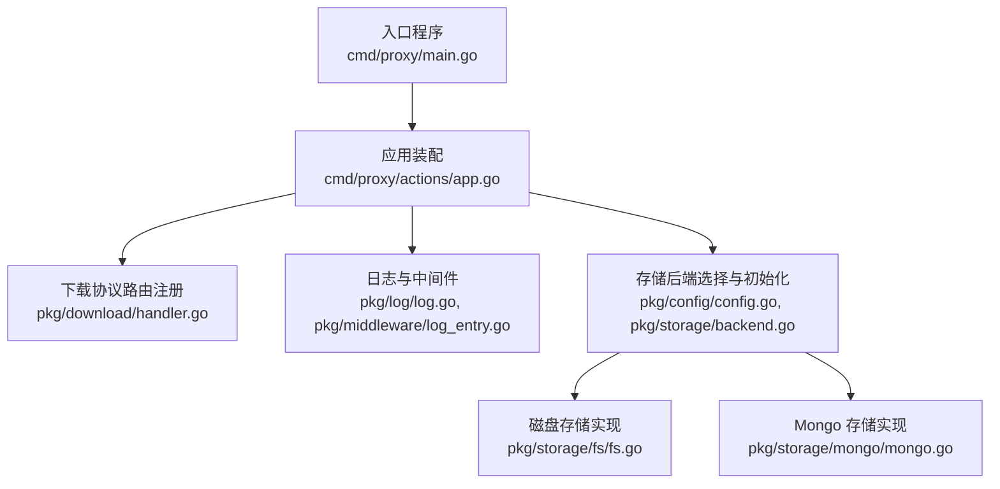
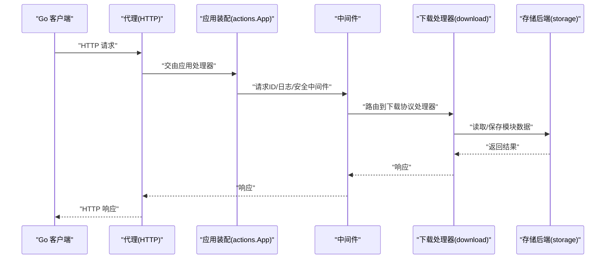
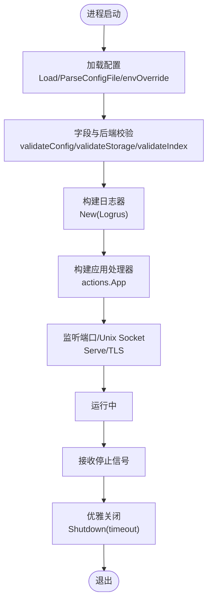
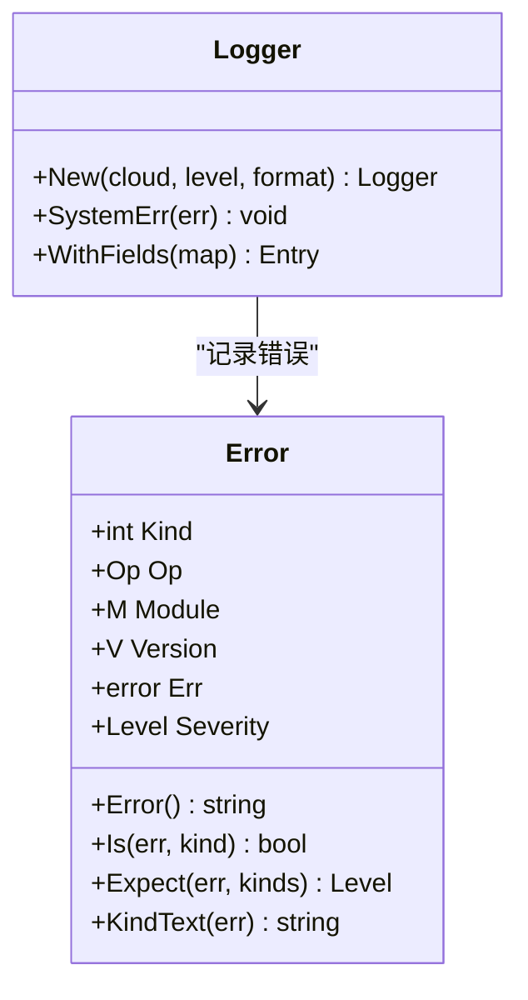
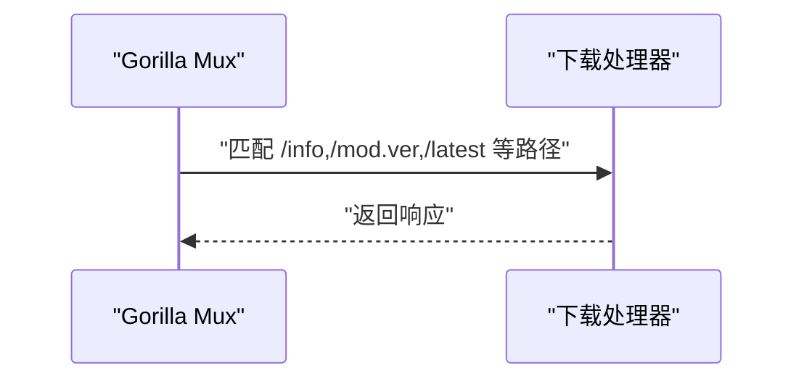
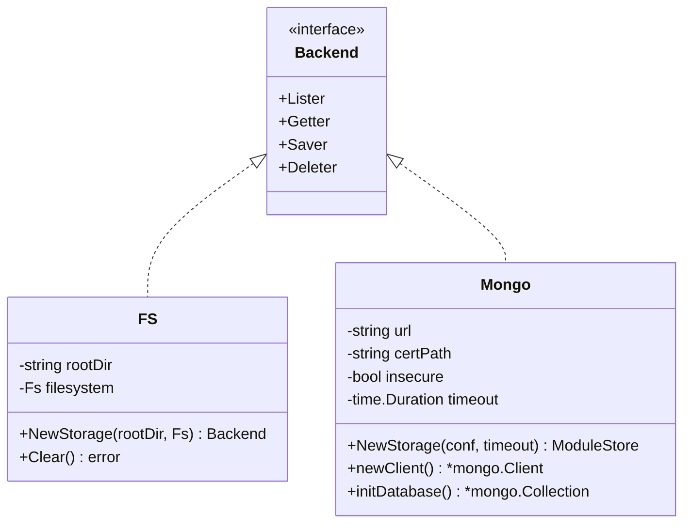
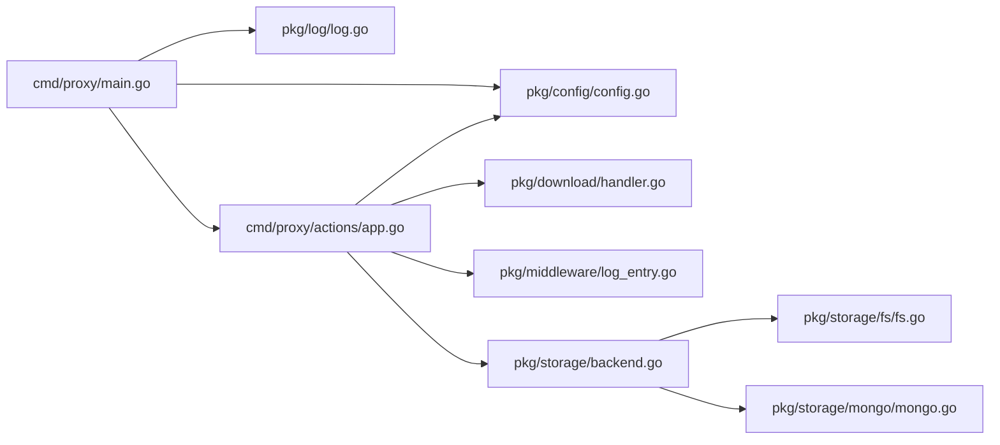

# 故障排除

<cite>
**本文引用的文件**
- [cmd/proxy/main.go](file://cmd/proxy/main.go)
- [pkg/config/config.go](file://pkg/config/config.go)
- [pkg/log/log.go](file://pkg/log/log.go)
- [pkg/errors/errors.go](file://pkg/errors/errors.go)
- [cmd/proxy/actions/app.go](file://cmd/proxy/actions/app.go)
- [pkg/middleware/log_entry.go](file://pkg/middleware/log_entry.go)
- [pkg/download/handler.go](file://pkg/download/handler.go)
- [pkg/storage/backend.go](file://pkg/storage/backend.go)
- [pkg/storage/fs/fs.go](file://pkg/storage/fs/fs.go)
- [pkg/storage/mongo/mongo.go](file://pkg/storage/mongo/mongo.go)
- [docs/content/configuration/logging.md](file://docs/content/configuration/logging.md)
- [docs/content/configuration/storage.md](file://docs/content/configuration/storage.md)
- [docs/content/configuration/authentication.md](file://docs/content/configuration/authentication.md)
</cite>

## 目录
1. [简介](#简介)
2. [项目结构](#项目结构)
3. [核心组件](#核心组件)
4. [架构总览](#架构总览)
5. [详细组件分析](#详细组件分析)
6. [依赖分析](#依赖分析)
7. [性能考虑](#性能考虑)
8. [故障排除指南](#故障排除指南)
9. [结论](#结论)
10. [附录](#附录)

## 简介
本指南面向不同技术背景的用户，系统化地梳理 Athens 代理在部署、配置、性能与集成方面的常见问题与解决路径。内容涵盖：
- 部署与启动失败
- 配置错误（环境变量、端口、证书、路径等）
- 性能瓶颈识别与优化
- 存储后端问题排查
- 网络与上游访问问题
- 日志与错误码分析
- 监控告警与异常处理流程
- 不同技术背景的分层排障策略与求助渠道

## 项目结构
从入口到运行时的关键路径如下：
- 入口程序负责加载配置、初始化日志、构建 HTTP 处理器、监听端口或 Unix 套接字，并优雅关闭
- 应用层组装路由、中间件、认证、过滤、追踪与指标导出
- 下载协议处理器对接 Go 客户端下载 API
- 存储后端抽象统一了多种存储驱动（内存、磁盘、Mongo、S3、GCS、Azure Blob、外部 HTTP）

**图表来源**
- [cmd/proxy/main.go](file://cmd/proxy/main.go#L29-L127)
- [cmd/proxy/actions/app.go](file://cmd/proxy/actions/app.go#L23-L138)
- [pkg/download/handler.go](file://pkg/download/handler.go#L39-L66)
- [pkg/config/config.go](file://pkg/config/config.go#L127-L254)
- [pkg/storage/backend.go](file://pkg/storage/backend.go#L3-L9)
- [pkg/storage/fs/fs.go](file://pkg/storage/fs/fs.go#L26-L39)
- [pkg/storage/mongo/mongo.go](file://pkg/storage/mongo/mongo.go#L30-L50)

**章节来源**
- [cmd/proxy/main.go](file://cmd/proxy/main.go#L29-L127)
- [cmd/proxy/actions/app.go](file://cmd/proxy/actions/app.go#L23-L138)
- [pkg/download/handler.go](file://pkg/download/handler.go#L39-L66)
- [pkg/config/config.go](file://pkg/config/config.go#L127-L254)
- [pkg/storage/backend.go](file://pkg/storage/backend.go#L3-L9)

## 核心组件
- 配置加载与校验：支持 TOML 文件、环境变量覆盖、生产模式权限检查、字段级校验
- 日志系统：基于 Logrus，支持标准格式与云平台格式，可按级别控制输出
- 错误模型：以 Kind 映射 HTTP 状态语义，便于统一处理与日志分级
- 应用装配：路由、中间件、认证、过滤、追踪与指标导出
- 下载协议：对 Go 客户端的模块下载 API 提供实现
- 存储后端：统一接口，多实现适配

**章节来源**
- [pkg/config/config.go](file://pkg/config/config.go#L127-L254)
- [pkg/log/log.go](file://pkg/log/log.go#L13-L27)
- [pkg/errors/errors.go](file://pkg/errors/errors.go#L12-L22)
- [cmd/proxy/actions/app.go](file://cmd/proxy/actions/app.go#L23-L138)
- [pkg/download/handler.go](file://pkg/download/handler.go#L14-L24)
- [pkg/storage/backend.go](file://pkg/storage/backend.go#L3-L9)

## 架构总览
下图展示从客户端请求到存储后端的典型链路，以及关键的可观测性与安全控制点。

**图表来源**
- [cmd/proxy/main.go](file://cmd/proxy/main.go#L64-L114)
- [cmd/proxy/actions/app.go](file://cmd/proxy/actions/app.go#L46-L137)
- [pkg/download/handler.go](file://pkg/download/handler.go#L39-L66)
- [pkg/storage/backend.go](file://pkg/storage/backend.go#L3-L9)

## 详细组件分析

### 组件A：配置与启动
- 加载顺序：命令行指定配置文件 → 当前目录默认文件 → 默认值 + 环境变量覆盖
- 生产模式校验：对配置与过滤文件进行权限检查
- 字段校验：通过结构体校验器对存储与索引类型进行针对性校验
- 启动监听：优先 Unix Socket，否则 TCP；支持 TLS；pprof 可选端口暴露
- 优雅关闭：信号捕获 + 超时关闭

**图表来源**
- [pkg/config/config.go](file://pkg/config/config.go#L127-L254)
- [cmd/proxy/main.go](file://cmd/proxy/main.go#L29-L127)
- [pkg/log/log.go](file://pkg/log/log.go#L13-L27)
- [cmd/proxy/actions/app.go](file://cmd/proxy/actions/app.go#L23-L138)

**章节来源**
- [pkg/config/config.go](file://pkg/config/config.go#L127-L254)
- [cmd/proxy/main.go](file://cmd/proxy/main.go#L29-L127)
- [pkg/log/log.go](file://pkg/log/log.go#L13-L27)
- [cmd/proxy/actions/app.go](file://cmd/proxy/actions/app.go#L23-L138)

### 组件B：日志与错误模型
- 日志：支持 plain/json 格式与云平台格式；级别通过环境变量控制
- 错误：Kind 映射 HTTP 状态，便于统一处理；支持递归查找 Kind 与操作栈聚合

**图表来源**
- [pkg/log/log.go](file://pkg/log/log.go#L13-L27)
- [pkg/errors/errors.go](file://pkg/errors/errors.go#L24-L41)

**章节来源**
- [pkg/log/log.go](file://pkg/log/log.go#L13-L27)
- [pkg/errors/errors.go](file://pkg/errors/errors.go#L12-L22)

### 组件C：下载协议与路由
- 协议处理器：封装下载 API 的 List/Latest/Info/Module/Zip 等路径
- 注册逻辑：无缓存头策略、路径注册、上下文日志注入
- 安全与认证：可选 BasicAuth、过滤中间件、路径前缀支持

**图表来源**
- [pkg/download/handler.go](file://pkg/download/handler.go#L39-L66)
- [cmd/proxy/actions/app.go](file://cmd/proxy/actions/app.go#L109-L131)

**章节来源**
- [pkg/download/handler.go](file://pkg/download/handler.go#L14-L24)
- [pkg/download/handler.go](file://pkg/download/handler.go#L39-L66)
- [cmd/proxy/actions/app.go](file://cmd/proxy/actions/app.go#L109-L131)

### 组件D：存储后端与实现
- 抽象：统一 Lister/Getter/Saver/Deleter 接口
- 实现示例：
  - 磁盘：根目录存在性检查、清空与重建
  - Mongo：连接、TLS 证书、索引初始化、超时配置

**图表来源**
- [pkg/storage/backend.go](file://pkg/storage/backend.go#L3-L9)
- [pkg/storage/fs/fs.go](file://pkg/storage/fs/fs.go#L26-L39)
- [pkg/storage/mongo/mongo.go](file://pkg/storage/mongo/mongo.go#L19-L50)

**章节来源**
- [pkg/storage/backend.go](file://pkg/storage/backend.go#L3-L9)
- [pkg/storage/fs/fs.go](file://pkg/storage/fs/fs.go#L26-L39)
- [pkg/storage/mongo/mongo.go](file://pkg/storage/mongo/mongo.go#L19-L50)

## 依赖分析
- 入口依赖配置与日志；配置依赖验证与环境变量解析
- 应用装配依赖存储后端工厂、下载处理器、中间件、追踪与指标导出
- 下载处理器依赖路由与协议定义
- 存储实现依赖各自 SDK 与配置项

**图表来源**
- [cmd/proxy/main.go](file://cmd/proxy/main.go#L29-L62)
- [cmd/proxy/actions/app.go](file://cmd/proxy/actions/app.go#L23-L138)
- [pkg/download/handler.go](file://pkg/download/handler.go#L39-L66)
- [pkg/storage/backend.go](file://pkg/storage/backend.go#L3-L9)
- [pkg/storage/fs/fs.go](file://pkg/storage/fs/fs.go#L26-L39)
- [pkg/storage/mongo/mongo.go](file://pkg/storage/mongo/mongo.go#L30-L50)

**章节来源**
- [cmd/proxy/main.go](file://cmd/proxy/main.go#L29-L62)
- [cmd/proxy/actions/app.go](file://cmd/proxy/actions/app.go#L23-L138)
- [pkg/download/handler.go](file://pkg/download/handler.go#L39-L66)
- [pkg/storage/backend.go](file://pkg/storage/backend.go#L3-L9)

## 性能考虑
- 并发与工作线程：GoGetWorkers、ProtocolWorkers 控制上游拉取与协议处理并发度
- 超时控制：全局超时配置影响存储与网络请求
- 缓存与单飞：多实例共享存储需启用分布式锁（SingleFlight）避免重复下载
- 指标导出：Prometheus 导出器用于观测吞吐与延迟
- pprof：可选性能剖析端口，仅限内网访问

[本节为通用指导，无需具体文件分析]

## 故障排除指南

### 一、部署与启动问题
- 症状：启动即退出或无法监听
  - 检查端口/Unix Socket 权限与占用
  - 确认 TLS 证书与密钥路径正确
  - 查看 pprof 是否被错误暴露
- 症状：优雅关闭失败或超时
  - 调整 ShutdownTimeout
  - 检查下游存储/网络阻塞导致的请求未完成

排查步骤
- 使用版本标志确认二进制信息
- 检查配置加载是否成功（文件存在、权限、格式）
- 观察启动日志中的监听与 pprof 输出
- 使用信号测试优雅关闭行为

**章节来源**
- [cmd/proxy/main.go](file://cmd/proxy/main.go#L29-L62)
- [cmd/proxy/main.go](file://cmd/proxy/main.go#L80-L98)
- [cmd/proxy/main.go](file://cmd/proxy/main.go#L121-L127)
- [pkg/config/config.go](file://pkg/config/config.go#L127-L144)

### 二、配置错误
- 症状：字段缺失或非法
  - 使用环境变量覆盖时注意格式（如 EnvList 必须为 key=value 形式）
  - 生产模式下配置与过滤文件权限不足会报错
- 症状：存储类型与配置不匹配
  - 根据存储类型调用对应子配置结构体校验
- 症状：端口格式错误
  - 自动补全端口前缀“:”

排查步骤
- 对照配置文档核对必填项
- 使用环境变量时注意分号分隔的长列表语法
- 在生产环境确保配置文件最小权限

**章节来源**
- [pkg/config/config.go](file://pkg/config/config.go#L102-L125)
- [pkg/config/config.go](file://pkg/config/config.go#L249-L297)
- [pkg/config/config.go](file://pkg/config/config.go#L256-L273)
- [docs/content/configuration/storage.md](file://docs/content/configuration/storage.md#L38-L52)

### 三、日志与错误分析
- 日志级别与格式
  - 标准日志可通过 LogFormat 与 LogLevel 控制
  - 云平台运行时可自动调整字段命名
- 错误分类
  - Kind 映射 HTTP 状态，便于统一处理
  - 支持递归查找与操作栈聚合，便于定位根因

排查步骤
- 将 LogLevel 提升至 debug 或 trace 进行复现
- 关注请求上下文中的 request-id 与路径字段
- 结合错误 Kind 判断是否预期（如 404/401/429 等）

**章节来源**
- [docs/content/configuration/logging.md](file://docs/content/configuration/logging.md#L9-L17)
- [pkg/log/log.go](file://pkg/log/log.go#L13-L27)
- [pkg/errors/errors.go](file://pkg/errors/errors.go#L12-L22)
- [pkg/errors/errors.go](file://pkg/errors/errors.go#L158-L180)
- [pkg/middleware/log_entry.go](file://pkg/middleware/log_entry.go#L12-L25)

### 四、存储问题排查
- 症状：磁盘存储根目录不存在
  - 新建目录或修正配置
- 症状：Mongo 连接失败/证书问题
  - 检查 URL、证书路径、InsecureConn 与 TLS 配置
  - 确认数据库与集合初始化成功
- 症状：多实例并发写入冲突
  - 启用分布式锁（SingleFlight），选择 etcd/redis/redis-sentinel/GCP/AzureBlob

排查步骤
- 逐项核对存储子配置
- 使用最小可复现配置先验证连通性
- 对于外部存储，确保其 HTTP 接口符合 Backend 约定

**章节来源**
- [pkg/storage/fs/fs.go](file://pkg/storage/fs/fs.go#L26-L39)
- [pkg/storage/mongo/mongo.go](file://pkg/storage/mongo/mongo.go#L74-L116)
- [docs/content/configuration/storage.md](file://docs/content/configuration/storage.md#L392-L530)

### 五、网络与上游访问问题
- 症状：下载超时或上游不可达
  - 调整全局超时与网络模式（strict/offline/fallback）
  - 检查代理/防火墙/路由
- 症状：私有仓库鉴权失败
  - 使用 .netrc/.hgrc 或 GitHub App 凭据助手
  - Docker 场景挂载认证目录或设置 SSH_AUTH_SOCK

排查步骤
- 在开发环境临时切换为 offline/fallback 验证网络链路
- 使用 curl/浏览器直接访问上游以排除代理问题
- 按认证文档挂载凭据并重启容器

**章节来源**
- [pkg/config/config.go](file://pkg/config/config.go#L58-L58)
- [docs/content/configuration/authentication.md](file://docs/content/configuration/authentication.md#L1-L357)

### 六、性能瓶颈识别与优化
- 并发参数
  - GoGetWorkers、ProtocolWorkers 适度提升并发
- 超时与重试
  - 适当增加超时，结合指数退避
- 指标与剖析
  - 启用 Prometheus 导出器观察延迟分布
  - 仅在内网开启 pprof 进行 CPU/内存剖析

优化建议
- 优先优化热点路径（下载/存储 IO）
- 使用 CDN/边缘缓存减少上游压力
- 对大包采用压缩与分块传输

**章节来源**
- [pkg/config/config.go](file://pkg/config/config.go#L27-L29)
- [cmd/proxy/actions/app.go](file://cmd/proxy/actions/app.go#L86-L94)
- [cmd/proxy/main.go](file://cmd/proxy/main.go#L69-L77)

### 七、监控告警与异常处理流程
- 追踪与指标
  - 可配置 TraceExporter 与 StatsExporter
  - 在应用启动时注册并确保在退出时 flush
- 健康检查
  - 基础健康路由与就绪探针可结合 Ingress/负载均衡使用
- 异常处理
  - 使用错误 Kind 区分严重程度，结合日志级别输出
  - 对可预期错误（如 404/429）降噪，对未知错误提高级别

**章节来源**
- [cmd/proxy/actions/app.go](file://cmd/proxy/actions/app.go#L74-L94)
- [cmd/proxy/actions/app.go](file://cmd/proxy/actions/app.go#L64-L64)

### 八、不同技术背景的排障策略
- 初学者
  - 从默认配置入手，逐步引入自定义项
  - 使用文档示例对比配置差异
- 运维工程师
  - 关注端口/证书/权限/优雅关闭/日志级别
  - 建立 pprof/指标/日志采集流水线
- 开发者
  - 重点排查上游可达性、鉴权与网络模式
  - 使用最小配置快速定位问题

求助渠道
- 文档站点与安装/设计/协议说明
- 社区频道与贡献指南

**章节来源**
- [README.md](file://README.md#L67-L74)

## 结论
通过系统化的配置校验、日志与错误模型、可观测性与存储抽象，Athens 提供了清晰的故障定位路径。建议在生产环境中：
- 严格管理配置与文件权限
- 启用指标与追踪，建立告警
- 使用分布式锁保障多实例一致性
- 按需优化并发与超时，结合剖析工具持续改进

[本节为总结性内容，无需具体文件分析]

## 附录
- 常用环境变量与配置键参考
  - 日志：ATHENS_LOG_LEVEL、ATHENS_LOG_FORMAT、ATHENS_CLOUD_RUNTIME
  - 网络：ATHENS_PORT、ATHENS_UNIX_SOCKET、ATHENS_TLSCERT_FILE、ATHENS_TLSKEY_FILE
  - 存储：ATHENS_STORAGE_TYPE、ATHENS_DISK_STORAGE_ROOT、ATHENS_MONGO_STORAGE_URL 等
  - 并发与超时：ATHENS_GOGET_WORKERS、ATHENS_PROTOCOL_WORKERS、ATHENS_TIMEOUT
  - 认证：ATHENS_GITHUB_TOKEN、ATHENS_NETRC_PATH、ATHENS_HGRC_PATH
  - 其他：ATHENS_ENABLE_PPROF、ATHENS_PPROF_PORT、ATHENS_STATS_EXPORTER

[本节为通用信息，无需具体文件分析]