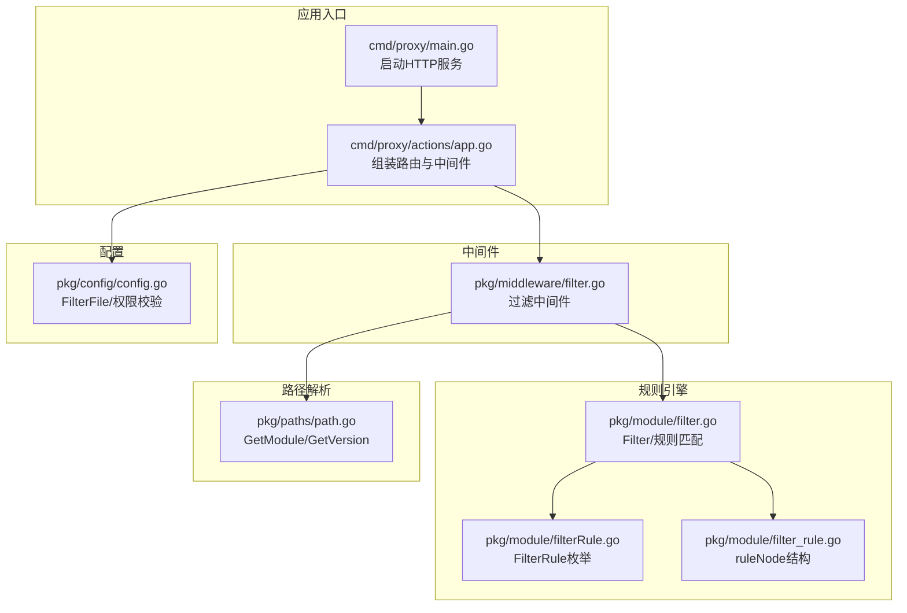
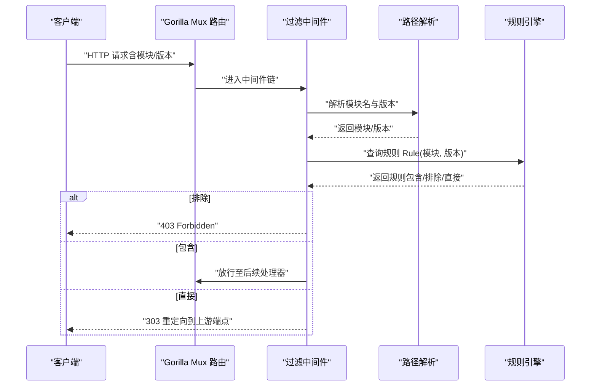
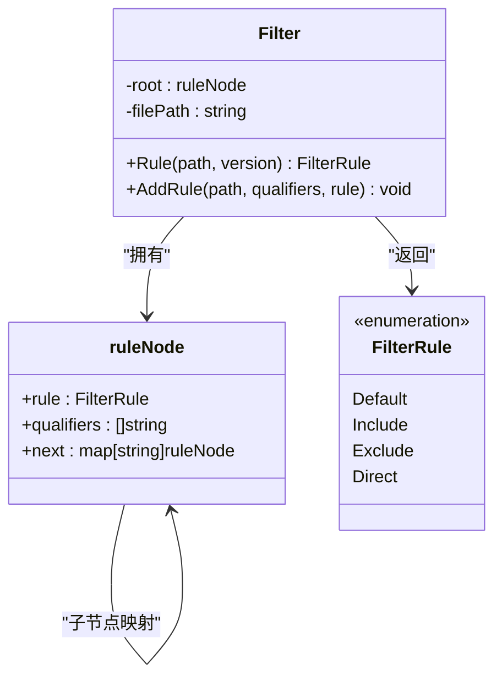
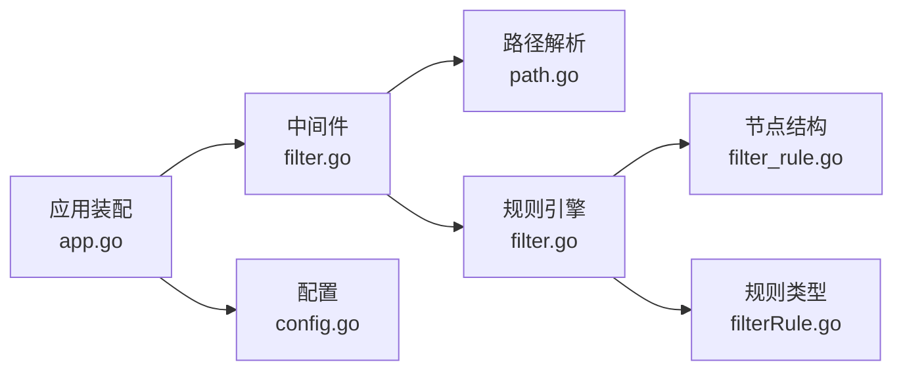

# 内容过滤

<cite>
**本文引用的文件**
- [pkg/middleware/filter.go](file://pkg/middleware/filter.go)
- [pkg/module/filter.go](file://pkg/module/filter.go)
- [pkg/module/filterRule.go](file://pkg/module/filterRule.go)
- [pkg/module/filter_rule.go](file://pkg/module/filter_rule.go)
- [pkg/paths/path.go](file://pkg/paths/path.go)
- [cmd/proxy/actions/app.go](file://cmd/proxy/actions/app.go)
- [cmd/proxy/main.go](file://cmd/proxy/main.go)
- [pkg/config/config.go](file://pkg/config/config.go)
- [docs/content/configuration/filter.md](file://docs/content/configuration/filter.md)
- [docs/content/configuration/download.md](file://docs/content/configuration/download.md)
- [pkg/module/filter_test.go](file://pkg/module/filter_test.go)
</cite>

## 目录
1. [简介](#简介)
2. [项目结构](#项目结构)
3. [核心组件](#核心组件)
4. [架构总览](#架构总览)
5. [组件详解](#组件详解)
6. [依赖关系分析](#依赖关系分析)
7. [性能考量](#性能考量)
8. [故障排除指南](#故障排除指南)
9. [结论](#结论)
10. [附录](#附录)

## 简介
本文件系统化阐述 Athens 的内容过滤机制，重点覆盖以下方面：
- 过滤中间件在请求生命周期中的执行位置与行为
- 黑名单与白名单策略（通过“包含/排除/直接上游”三种规则表达）
- 版本限定与修饰符（前缀匹配、语义化版本范围修饰符）
- 配置语法、优先级与默认行为
- 动态更新能力与限制
- 实战场景：私有模块访问控制、合规性检查
- 调试、测试与故障排除方法

需要特别说明的是：仓库中“旧版过滤文件”已标记为弃用，当前推荐使用“下载模式文件”进行更灵活的模块行为控制。本文仍以现有实现为准进行技术说明。

## 项目结构
围绕内容过滤的相关代码主要分布在如下模块：
- 中间件层：负责拦截模块请求并根据规则放行或重定向
- 规则引擎：解析配置文件，构建树形规则结构，执行匹配与优先级判定
- 路径解析：从请求中提取模块名与版本
- 应用入口：装配中间件与路由
- 配置层：读取过滤文件路径与权限校验
- 文档：提供配置语法与使用示例

**图表来源**
- [cmd/proxy/main.go](file://cmd/proxy/main.go#L29-L127)
- [cmd/proxy/actions/app.go](file://cmd/proxy/actions/app.go#L23-L138)
- [pkg/middleware/filter.go](file://pkg/middleware/filter.go#L13-L48)
- [pkg/module/filter.go](file://pkg/module/filter.go#L18-L82)
- [pkg/module/filterRule.go](file://pkg/module/filterRule.go#L3-L16)
- [pkg/module/filter_rule.go](file://pkg/module/filter_rule.go#L3-L7)
- [pkg/paths/path.go](file://pkg/paths/path.go#L12-L31)
- [pkg/config/config.go](file://pkg/config/config.go#L35-L66)

**章节来源**
- [cmd/proxy/main.go](file://cmd/proxy/main.go#L29-L127)
- [cmd/proxy/actions/app.go](file://cmd/proxy/actions/app.go#L23-L138)
- [pkg/middleware/filter.go](file://pkg/middleware/filter.go#L13-L48)
- [pkg/module/filter.go](file://pkg/module/filter.go#L18-L82)
- [pkg/module/filterRule.go](file://pkg/module/filterRule.go#L3-L16)
- [pkg/module/filter_rule.go](file://pkg/module/filter_rule.go#L3-L7)
- [pkg/paths/path.go](file://pkg/paths/path.go#L12-L31)
- [pkg/config/config.go](file://pkg/config/config.go#L35-L66)

## 核心组件
- 过滤中间件
  - 在 Gorilla Mux 路由链中插入，对模块请求进行拦截
  - 从请求中解析模块名与版本，查询规则并执行相应动作（拒绝/放行/重定向到上游）
- 规则引擎
  - 解析配置文件，构建 ruleNode 树，支持默认规则、路径精确匹配、版本限定与修饰符
  - 规则优先级：子路径覆盖父路径；遇到非默认规则即停止回溯
- 路径解析
  - 从 URL 变量中提取模块名与版本，用于规则匹配
- 配置与权限
  - 支持通过环境变量或配置文件指定过滤文件路径
  - 对过滤文件权限进行严格校验（避免世界可写）

**章节来源**
- [pkg/middleware/filter.go](file://pkg/middleware/filter.go#L13-L48)
- [pkg/module/filter.go](file://pkg/module/filter.go#L24-L82)
- [pkg/module/filter_rule.go](file://pkg/module/filter_rule.go#L3-L16)
- [pkg/paths/path.go](file://pkg/paths/path.go#L12-L31)
- [pkg/config/config.go](file://pkg/config/config.go#L35-L66)

## 架构总览
下图展示一次模块请求从进入应用到被过滤中间件处理的关键步骤：

**图表来源**
- [pkg/middleware/filter.go](file://pkg/middleware/filter.go#L15-L47)
- [pkg/paths/path.go](file://pkg/paths/path.go#L12-L31)
- [pkg/module/filter.go](file://pkg/module/filter.go#L74-L82)

**章节来源**
- [pkg/middleware/filter.go](file://pkg/middleware/filter.go#L15-L47)
- [pkg/paths/path.go](file://pkg/paths/path.go#L12-L31)
- [pkg/module/filter.go](file://pkg/module/filter.go#L74-L82)

## 组件详解

### 过滤中间件（pkg/middleware/filter.go）
- 入口函数构建中间件，接收规则集与上游端点
- 从请求中提取模块名；若无法提取（非模块路径），直接放行
- 提取版本（若无版本则为空字符串）
- 查询规则并按规则执行：
  - 排除：返回 403
  - 包含：正常放行
  - 直接：重定向到上游端点
- 重定向时保留原始路径，拼接到上游端点后返回

**章节来源**
- [pkg/middleware/filter.go](file://pkg/middleware/filter.go#L13-L48)

### 规则引擎（pkg/module/filter.go）
- 数据结构
  - Filter：根节点为 ruleNode，记录规则与子节点映射
  - ruleNode：包含当前节点规则、限定修饰符列表、子节点映射
- 初始化
  - 从配置文件逐行解析，支持注释与空行跳过
  - 支持三类规则符号：+（包含）、-（排除）、D（直接）
  - 默认规则可放在首行，未显式声明时采用包含作为兜底
- 规则匹配
  - 将模块路径拆分为段，沿树向下查找
  - 若存在版本限定修饰符，则对版本进行匹配判断
  - 优先级：自顶向下收集规则，遇到非默认规则即停止回溯，最终选择最近的非默认规则
  - 若无匹配规则，采用根节点规则
- 版本匹配与修饰符
  - 前缀匹配：支持 v1、v1.2、v1.2.* 等
  - 语义化版本修饰符：
    - ~1.2.3：启用 1.2.x 且不低于 1.2.3
    - ^1.2.3：启用 1.x.x 且不低于 1.2.3
    - <1.2.3：启用低于 1.2.3 的所有版本
  - 仅当版本为三位数字形式时生效

**章节来源**
- [pkg/module/filter.go](file://pkg/module/filter.go#L18-L82)
- [pkg/module/filter.go](file://pkg/module/filter.go#L96-L132)
- [pkg/module/filter.go](file://pkg/module/filter.go#L134-L193)
- [pkg/module/filter.go](file://pkg/module/filter.go#L195-L261)

### 规则类型与节点（pkg/module/filterRule.go, pkg/module/filter_rule.go）
- 规则类型：Default、Include、Exclude、Direct
- 节点结构：ruleNode 含规则、限定符列表、子节点映射

**图表来源**
- [pkg/module/filter.go](file://pkg/module/filter.go#L18-L22)
- [pkg/module/filter_rule.go](file://pkg/module/filter_rule.go#L3-L7)
- [pkg/module/filterRule.go](file://pkg/module/filterRule.go#L3-L16)

**章节来源**
- [pkg/module/filterRule.go](file://pkg/module/filterRule.go#L3-L16)
- [pkg/module/filter_rule.go](file://pkg/module/filter_rule.go#L3-L7)
- [pkg/module/filter.go](file://pkg/module/filter.go#L18-L22)

### 路径解析（pkg/paths/path.go）
- 从请求变量中提取模块名与版本
- 若缺失参数，返回错误，供上层中间件决定是否放行或拒绝

**章节来源**
- [pkg/paths/path.go](file://pkg/paths/path.go#L12-L31)

### 应用装配（cmd/proxy/actions/app.go）
- 读取配置，初始化认证与安全中间件
- 当启用过滤且配置了过滤文件时，加载规则并注入过滤中间件
- 将上游端点传递给过滤中间件，用于重定向

**章节来源**
- [cmd/proxy/actions/app.go](file://cmd/proxy/actions/app.go#L100-L107)

### 配置与权限（pkg/config/config.go）
- 支持通过环境变量 ATHENS_FILTER_FILE 或配置项 FilterFile 指定过滤文件
- 对过滤文件权限进行严格校验，避免世界可写
- 注意：当前实现对不存在的过滤文件会静默忽略，建议确保文件存在且权限正确

**章节来源**
- [pkg/config/config.go](file://pkg/config/config.go#L35-L66)
- [pkg/config/config.go](file://pkg/config/config.go#L349-L375)

### 文档参考（docs/content/configuration/filter.md）
- 旧版过滤文件语法与示例
- 默认规则、版本限定与修饰符说明
- 重要提示：该文档对应的过滤文件已被弃用，推荐使用下载模式文件

**章节来源**
- [docs/content/configuration/filter.md](file://docs/content/configuration/filter.md#L1-L96)

### 下载模式文件（docs/content/configuration/download.md）
- 新一代模块行为控制方式，支持基于模块模式的同步/异步/重定向/禁用等行为
- 与过滤中间件不同，下载模式文件面向“存储命中失败”的场景，而过滤中间件面向“模块请求路径”的前置控制

**章节来源**
- [docs/content/configuration/download.md](file://docs/content/configuration/download.md#L1-L103)

## 依赖关系分析
- 过滤中间件依赖路径解析模块提取模块名与版本
- 过滤中间件依赖规则引擎计算规则
- 规则引擎内部使用 ruleNode 树结构组织规则
- 应用入口在装配阶段加载过滤文件并注入中间件
- 配置层提供过滤文件路径与权限校验

**图表来源**
- [pkg/middleware/filter.go](file://pkg/middleware/filter.go#L13-L48)
- [pkg/paths/path.go](file://pkg/paths/path.go#L12-L31)
- [pkg/module/filter.go](file://pkg/module/filter.go#L18-L22)
- [pkg/module/filter_rule.go](file://pkg/module/filter_rule.go#L3-L7)
- [pkg/module/filterRule.go](file://pkg/module/filterRule.go#L3-L16)
- [cmd/proxy/actions/app.go](file://cmd/proxy/actions/app.go#L100-L107)
- [pkg/config/config.go](file://pkg/config/config.go#L35-L66)

**章节来源**
- [pkg/middleware/filter.go](file://pkg/middleware/filter.go#L13-L48)
- [pkg/module/filter.go](file://pkg/module/filter.go#L18-L22)
- [pkg/module/filter_rule.go](file://pkg/module/filter_rule.go#L3-L7)
- [pkg/module/filterRule.go](file://pkg/module/filterRule.go#L3-L16)
- [pkg/paths/path.go](file://pkg/paths/path.go#L12-L31)
- [cmd/proxy/actions/app.go](file://cmd/proxy/actions/app.go#L100-L107)
- [pkg/config/config.go](file://pkg/config/config.go#L35-L66)

## 性能考量
- 中间件开销极低：仅在模块请求路径上执行，非模块路径直接放行
- 规则匹配为树形路径遍历，复杂度与模块路径层级成正比，通常为常数级
- 版本匹配采用前缀与语义化版本比较，整体为常数级
- 建议：
  - 控制规则数量与层级深度，避免过深的路径树
  - 合理使用默认规则与根规则，减少重复配置
  - 使用版本修饰符时保持简洁，避免过多组合导致匹配分支增多

[本节为通用性能讨论，无需列出具体文件来源]

## 故障排除指南
- 过滤文件未生效
  - 确认已启用过滤且配置了正确的过滤文件路径
  - 检查过滤文件权限，避免世界可写
  - 注意：当前实现对不存在的过滤文件会静默忽略，请确保文件存在
- 规则未按预期匹配
  - 检查规则顺序与优先级：子路径规则覆盖父路径
  - 确认版本修饰符书写正确，仅在三位语义化版本下生效
  - 使用测试用例验证规则行为
- 重定向异常
  - 确认上游端点配置正确，路径拼接逻辑会保留原始路径
- 单元测试辅助
  - 参考测试用例覆盖“简单排除/父子继承/仅允许特定/直接上游/版本限定/修饰符”等场景

**章节来源**
- [pkg/config/config.go](file://pkg/config/config.go#L349-L375)
- [pkg/module/filter_test.go](file://pkg/module/filter_test.go#L27-L234)

## 结论
- 过滤中间件提供了轻量、可配置的模块请求前置控制能力
- 通过“包含/排除/直接”三种规则与版本修饰符，可满足大多数访问控制与合规需求
- 由于旧版过滤文件已弃用，建议结合下载模式文件实现更灵活的行为控制
- 在生产环境中应重视过滤文件权限与规则设计，确保安全与性能平衡

[本节为总结性内容，无需列出具体文件来源]

## 附录

### 配置语法与优先级
- 规则符号
  - +：包含（允许存储与缓存）
  - -：排除（禁止访问）
  - D：直接（从上游获取，不存储）
- 默认规则
  - 可在文件首行设置全局默认行为
- 版本限定
  - 支持逗号分隔的多个版本模式，采用前缀匹配
  - 支持 ~、^、< 修饰符，要求三位语义化版本
- 优先级
  - 子路径规则覆盖父路径规则
  - 遇到非默认规则即停止回溯，选择最近的非默认规则
  - 无匹配时采用根规则，默认为包含

**章节来源**
- [docs/content/configuration/filter.md](file://docs/content/configuration/filter.md#L18-L96)
- [pkg/module/filter.go](file://pkg/module/filter.go#L134-L193)
- [pkg/module/filter.go](file://pkg/module/filter.go#L96-L132)

### 实战场景示例
- 私有模块访问控制
  - 使用“排除”规则阻止访问特定组织或仓库
  - 对允许的子模块使用“包含”规则放行
- 合规性检查
  - 仅允许特定版本范围内的模块，通过版本修饰符实现
  - 对高风险模块直接“重定向”，不入库
- 与下载模式文件配合
  - 使用下载模式文件处理“存储未命中”的场景
  - 使用过滤中间件处理“请求路径层面”的前置控制

**章节来源**
- [docs/content/configuration/download.md](file://docs/content/configuration/download.md#L75-L103)
- [docs/content/configuration/filter.md](file://docs/content/configuration/filter.md#L18-L96)

### 调试与测试方法
- 单元测试
  - 参考测试用例覆盖典型规则与版本修饰符场景
- 日志与追踪
  - 应用层已集成日志与追踪导出，便于定位问题
- 权限检查
  - 确保过滤文件权限符合要求，避免被系统忽略

**章节来源**
- [pkg/module/filter_test.go](file://pkg/module/filter_test.go#L27-L234)
- [cmd/proxy/actions/app.go](file://cmd/proxy/actions/app.go#L68-L94)
- [pkg/config/config.go](file://pkg/config/config.go#L349-L375)