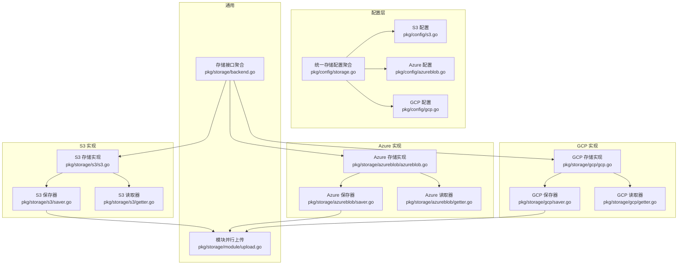
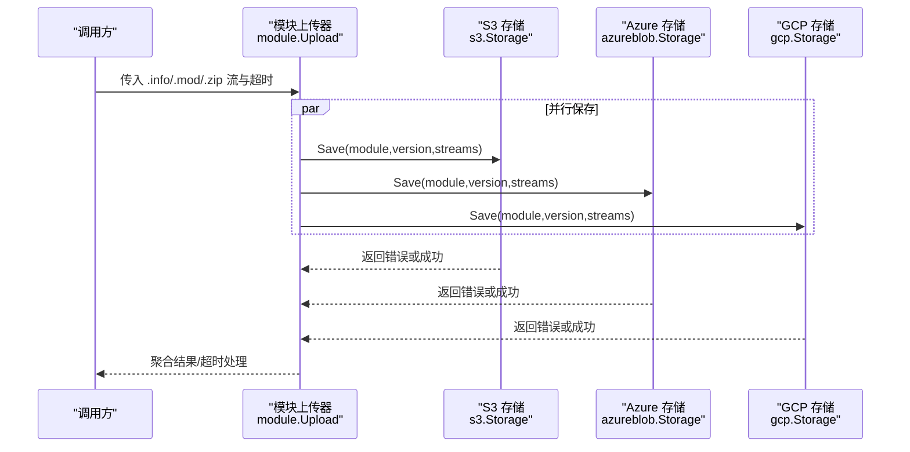
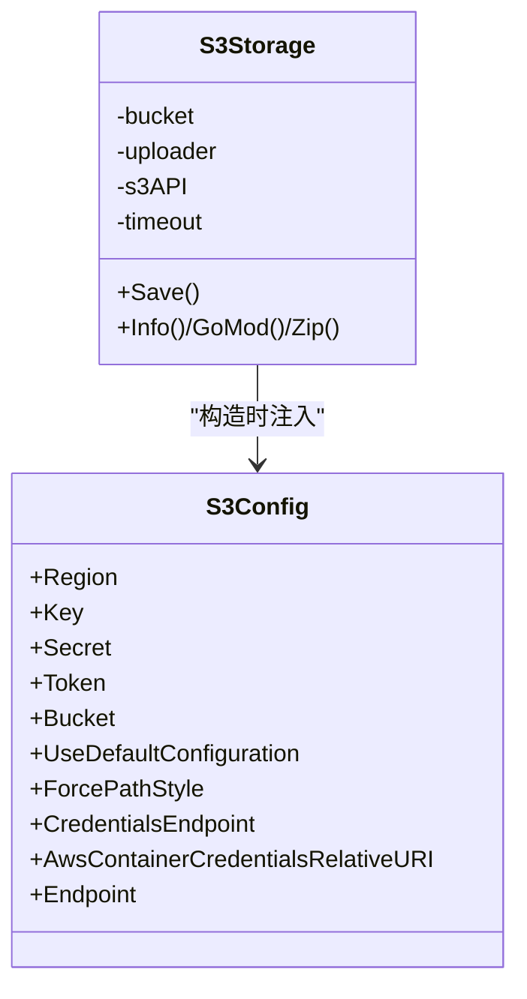
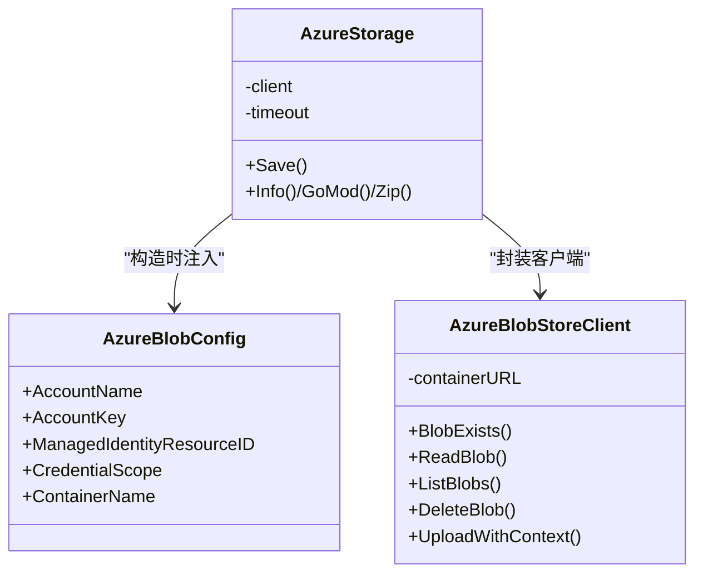
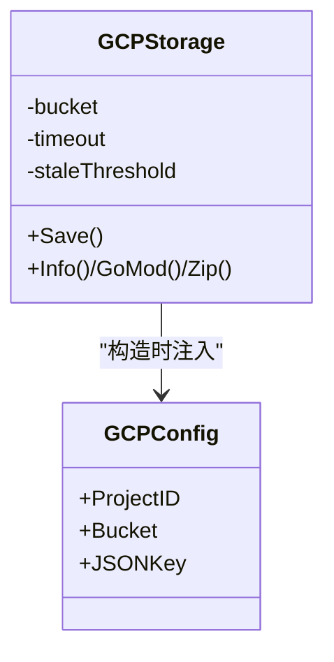
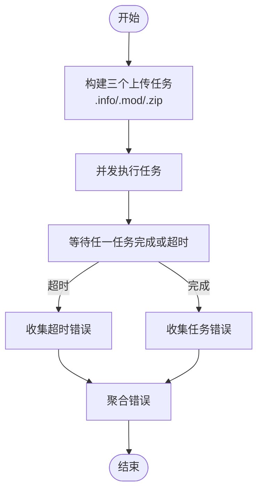
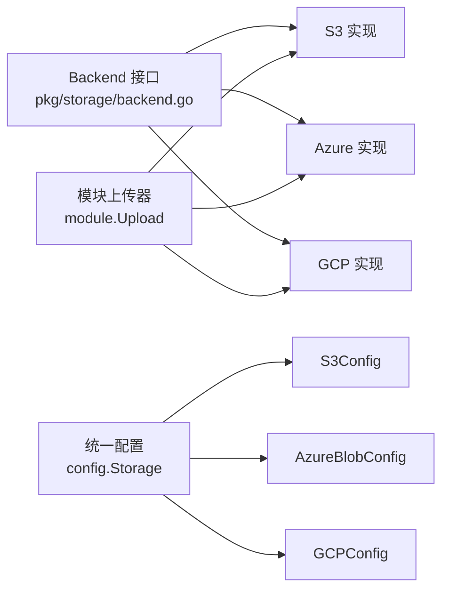

# 云存储

<cite>
**本文引用的文件**
- [pkg/config/s3.go](file://pkg/config/s3.go)
- [pkg/config/azureblob.go](file://pkg/config/azureblob.go)
- [pkg/config/gcp.go](file://pkg/config/gcp.go)
- [pkg/config/storage.go](file://pkg/config/storage.go)
- [pkg/storage/s3/s3.go](file://pkg/storage/s3/s3.go)
- [pkg/storage/s3/saver.go](file://pkg/storage/s3/saver.go)
- [pkg/storage/s3/getter.go](file://pkg/storage/s3/getter.go)
- [pkg/storage/azureblob/azureblob.go](file://pkg/storage/azureblob/azureblob.go)
- [pkg/storage/azureblob/saver.go](file://pkg/storage/azureblob/saver.go)
- [pkg/storage/azureblob/getter.go](file://pkg/storage/azureblob/getter.go)
- [pkg/storage/gcp/gcp.go](file://pkg/storage/gcp/gcp.go)
- [pkg/storage/gcp/saver.go](file://pkg/storage/gcp/saver.go)
- [pkg/storage/gcp/getter.go](file://pkg/storage/gcp/getter.go)
- [pkg/storage/module/upload.go](file://pkg/storage/module/upload.go)
- [pkg/storage/backend.go](file://pkg/storage/backend.go)
- [docs/content/configuration/storage.md](file://docs/content/configuration/storage.md)
</cite>

## 目录
1. [简介](#简介)
2. [项目结构](#项目结构)
3. [核心组件](#核心组件)
4. [架构总览](#架构总览)
5. [详细组件分析](#详细组件分析)
6. [依赖关系分析](#依赖关系分析)
7. [性能考虑](#性能考虑)
8. [故障排查指南](#故障排查指南)
9. [结论](#结论)
10. [附录](#附录)

## 简介
本文件系统化梳理 Athens 在云存储领域的实现与配置，重点覆盖以下三类对象存储后端：
- AWS S3（含兼容端点与凭证链）
- Azure Blob Storage（共享密钥与托管身份）
- Google Cloud Storage（服务账号与默认凭据）

内容包括：
- 认证方式与区域/网络配置
- 数据模型与文件命名约定
- 并行上传与超时控制（非传统分片上传/断点续传）
- 性能优化、成本控制与安全配置
- 跨区域复制、生命周期管理与数据加密建议
- 弹性扩展与高可用性优势与挑战

## 项目结构
围绕云存储的核心代码位于 pkg/storage 下的子目录，分别对应三大云厂商；配置定义集中在 pkg/config；通用接口与并行上传逻辑位于 pkg/storage。

图表来源
- [pkg/config/s3.go](file://pkg/config/s3.go#L1-L16)
- [pkg/config/azureblob.go](file://pkg/config/azureblob.go#L1-L11)
- [pkg/config/gcp.go](file://pkg/config/gcp.go#L1-L9)
- [pkg/config/storage.go](file://pkg/config/storage.go#L1-L13)
- [pkg/storage/s3/s3.go](file://pkg/storage/s3/s3.go#L1-L99)
- [pkg/storage/s3/saver.go](file://pkg/storage/s3/saver.go#L1-L48)
- [pkg/storage/s3/getter.go](file://pkg/storage/s3/getter.go#L1-L105)
- [pkg/storage/azureblob/azureblob.go](file://pkg/storage/azureblob/azureblob.go#L1-L195)
- [pkg/storage/azureblob/saver.go](file://pkg/storage/azureblob/saver.go#L1-L26)
- [pkg/storage/azureblob/getter.go](file://pkg/storage/azureblob/getter.go#L1-L96)
- [pkg/storage/gcp/gcp.go](file://pkg/storage/gcp/gcp.go#L1-L75)
- [pkg/storage/gcp/saver.go](file://pkg/storage/gcp/saver.go#L1-L112)
- [pkg/storage/gcp/getter.go](file://pkg/storage/gcp/getter.go#L1-L68)
- [pkg/storage/module/upload.go](file://pkg/storage/module/upload.go#L1-L64)
- [pkg/storage/backend.go](file://pkg/storage/backend.go#L1-L10)

章节来源
- [pkg/config/s3.go](file://pkg/config/s3.go#L1-L16)
- [pkg/config/azureblob.go](file://pkg/config/azureblob.go#L1-L11)
- [pkg/config/gcp.go](file://pkg/config/gcp.go#L1-L9)
- [pkg/config/storage.go](file://pkg/config/storage.go#L1-L13)
- [pkg/storage/s3/s3.go](file://pkg/storage/s3/s3.go#L1-L99)
- [pkg/storage/azureblob/azureblob.go](file://pkg/storage/azureblob/azureblob.go#L1-L195)
- [pkg/storage/gcp/gcp.go](file://pkg/storage/gcp/gcp.go#L1-L75)
- [pkg/storage/module/upload.go](file://pkg/storage/module/upload.go#L1-L64)
- [pkg/storage/backend.go](file://pkg/storage/backend.go#L1-L10)

## 核心组件
- 统一存储接口：Backend 聚合 Lister、Getter、Saver、Deleter，确保所有后端具备一致能力面。
- 模块并行上传：Upload 将 .info、.mod、.zip 三类文件并发上传，统一超时控制，失败聚合返回。
- 各云后端实现：
  - S3：基于 AWS SDK v2，支持自定义端点、路径风格、容器凭证端点与静态凭证链。
  - Azure：支持共享密钥与托管身份令牌刷新，内置容忍期避免临界过期。
  - GCP：基于官方 SDK，支持服务账号 JSON 解码与默认环境凭据，存在“不存在则不上传”优化。

章节来源
- [pkg/storage/backend.go](file://pkg/storage/backend.go#L1-L10)
- [pkg/storage/module/upload.go](file://pkg/storage/module/upload.go#L1-L64)
- [pkg/storage/s3/s3.go](file://pkg/storage/s3/s3.go#L1-L99)
- [pkg/storage/azureblob/azureblob.go](file://pkg/storage/azureblob/azureblob.go#L1-L195)
- [pkg/storage/gcp/gcp.go](file://pkg/storage/gcp/gcp.go#L1-L75)

## 架构总览
下图展示 Athens 通过统一接口对接三大云存储，并由模块上传器并发写入对象键。

图表来源
- [pkg/storage/module/upload.go](file://pkg/storage/module/upload.go#L1-L64)
- [pkg/storage/s3/saver.go](file://pkg/storage/s3/saver.go#L1-L48)
- [pkg/storage/azureblob/saver.go](file://pkg/storage/azureblob/saver.go#L1-L26)
- [pkg/storage/gcp/saver.go](file://pkg/storage/gcp/saver.go#L1-L112)

## 详细组件分析

### S3 实现机制与配置
- 认证与凭证链
  - 支持使用容器凭证端点与相对 URI，以及静态 Key/Secret/Token 的链式回退。
  - 可选择使用默认配置（环境变量、CLI 凭证、实例角色）。
- 区域与网络
  - 必填 Region；可选 ForcePathStyle；可指定 Endpoint 覆盖默认端点。
- 数据模型与命名
  - 使用统一的版本化命名规则生成对象键（.info/.mod/.zip），由模块上传器并发写入。
- 并发与超时
  - 通过 context 超时控制单次上传；模块上传器对三类文件并发执行，统一聚合错误。
- 断点续传
  - 未实现传统分片上传/断点续传；采用一次性上传策略，配合超时与重试策略保障可靠性。

图表来源
- [pkg/config/s3.go](file://pkg/config/s3.go#L1-L16)
- [pkg/storage/s3/s3.go](file://pkg/storage/s3/s3.go#L1-L99)
- [pkg/storage/s3/saver.go](file://pkg/storage/s3/saver.go#L1-L48)
- [pkg/storage/s3/getter.go](file://pkg/storage/s3/getter.go#L1-L105)

章节来源
- [pkg/config/s3.go](file://pkg/config/s3.go#L1-L16)
- [pkg/storage/s3/s3.go](file://pkg/storage/s3/s3.go#L1-L99)
- [pkg/storage/s3/saver.go](file://pkg/storage/s3/saver.go#L1-L48)
- [pkg/storage/s3/getter.go](file://pkg/storage/s3/getter.go#L1-L105)
- [docs/content/configuration/storage.md](file://docs/content/configuration/storage.md#L129-L209)

### Azure Blob Storage 实现机制与配置
- 认证与令牌刷新
  - 支持共享密钥与托管身份两种方式；托管身份通过 TokenCredential 自动刷新，带容忍期避免临界过期。
- 容器与网络
  - 基于账户名推导服务 URL；容器必须预先存在。
- 数据模型与命名
  - 与 S3/GCS 一致，使用版本化命名规则生成对象键。
- 并发与超时
  - 模块上传器并发保存三类文件；Azure 侧上传采用流式分块缓冲参数。
- 断点续传
  - 未实现传统分片上传/断点续传；采用一次性上传策略。

图表来源
- [pkg/config/azureblob.go](file://pkg/config/azureblob.go#L1-L11)
- [pkg/storage/azureblob/azureblob.go](file://pkg/storage/azureblob/azureblob.go#L1-L195)
- [pkg/storage/azureblob/saver.go](file://pkg/storage/azureblob/saver.go#L1-L26)
- [pkg/storage/azureblob/getter.go](file://pkg/storage/azureblob/getter.go#L1-L96)

章节来源
- [pkg/config/azureblob.go](file://pkg/config/azureblob.go#L1-L11)
- [pkg/storage/azureblob/azureblob.go](file://pkg/storage/azureblob/azureblob.go#L1-L195)
- [pkg/storage/azureblob/saver.go](file://pkg/storage/azureblob/saver.go#L1-L26)
- [pkg/storage/azureblob/getter.go](file://pkg/storage/azureblob/getter.go#L1-L96)
- [docs/content/configuration/storage.md](file://docs/content/configuration/storage.md#L313-L353)

### Google Cloud Storage 实现机制与配置
- 认证与凭据
  - 支持服务账号 JSON（Base64 解码）与默认环境凭据（如 App Engine）。
- 存储桶校验
  - 初始化时检查桶是否存在，不存在则提示手动创建。
- 数据模型与命名
  - 使用版本化命名规则生成对象键。
- 并发与超时
  - 模块上传器并发保存三类文件；GCS 侧在上传前可做“存在性检查”以跳过大文件重复上传。
- 断点续传
  - 未实现传统分片上传/断点续传；采用一次性上传策略。

图表来源
- [pkg/config/gcp.go](file://pkg/config/gcp.go#L1-L9)
- [pkg/storage/gcp/gcp.go](file://pkg/storage/gcp/gcp.go#L1-L75)
- [pkg/storage/gcp/saver.go](file://pkg/storage/gcp/saver.go#L1-L112)
- [pkg/storage/gcp/getter.go](file://pkg/storage/gcp/getter.go#L1-L68)

章节来源
- [pkg/config/gcp.go](file://pkg/config/gcp.go#L1-L9)
- [pkg/storage/gcp/gcp.go](file://pkg/storage/gcp/gcp.go#L1-L75)
- [pkg/storage/gcp/saver.go](file://pkg/storage/gcp/saver.go#L1-L112)
- [pkg/storage/gcp/getter.go](file://pkg/storage/gcp/getter.go#L1-L68)
- [docs/content/configuration/storage.md](file://docs/content/configuration/storage.md#L107-L128)

### 模块并行上传与超时控制
- 并发策略：同时发起 info/mod/zip 三类文件的上传任务，使用通道收集错误。
- 超时控制：为每个上传任务设置独立超时上下文，超时后返回聚合错误。
- 错误聚合：将所有任务的错误合并返回，便于上层统一处理。

图表来源
- [pkg/storage/module/upload.go](file://pkg/storage/module/upload.go#L1-L64)

章节来源
- [pkg/storage/module/upload.go](file://pkg/storage/module/upload.go#L1-L64)

## 依赖关系分析
- 统一接口：Backend 聚合四大能力，保证 S3/Azure/GCS 实现的一致性。
- 模块上传器：作为通用上传编排器，被 S3/Azure/GCS 的 Save 方法复用。
- 配置聚合：Storage 结构体按厂商拆分配置，运行时由上层装配。

图表来源
- [pkg/storage/backend.go](file://pkg/storage/backend.go#L1-L10)
- [pkg/storage/module/upload.go](file://pkg/storage/module/upload.go#L1-L64)
- [pkg/config/storage.go](file://pkg/config/storage.go#L1-L13)
- [pkg/config/s3.go](file://pkg/config/s3.go#L1-L16)
- [pkg/config/azureblob.go](file://pkg/config/azureblob.go#L1-L11)
- [pkg/config/gcp.go](file://pkg/config/gcp.go#L1-L9)

章节来源
- [pkg/storage/backend.go](file://pkg/storage/backend.go#L1-L10)
- [pkg/storage/module/upload.go](file://pkg/storage/module/upload.go#L1-L64)
- [pkg/config/storage.go](file://pkg/config/storage.go#L1-L13)

## 性能考虑
- 并发上传：三类文件并发写入，显著降低整体上传延迟。
- 大文件优化（GCS）：上传前进行存在性检查，避免重复上传大型 .zip 文件。
- 缓冲与分块（Azure）：上传时使用旋转缓冲区与最大缓冲数参数，平衡内存占用与吞吐。
- 超时控制：为每个任务设置超时，防止长时间阻塞影响整体性能。
- 网络与端点：S3 支持自定义 Endpoint 与 ForcePathStyle，可在特定网络环境下优化连接质量。

章节来源
- [pkg/storage/gcp/saver.go](file://pkg/storage/gcp/saver.go#L67-L111)
- [pkg/storage/azureblob/azureblob.go](file://pkg/storage/azureblob/azureblob.go#L173-L194)
- [pkg/storage/s3/saver.go](file://pkg/storage/s3/saver.go#L15-L47)
- [docs/content/configuration/storage.md](file://docs/content/configuration/storage.md#L129-L209)

## 故障排查指南
- S3
  - 凭证问题：优先检查容器凭证端点与相对 URI、静态凭证是否齐全；必要时启用默认配置。
  - 端点与路径：确认 Region 正确，Endpoint 与 ForcePathStyle 设置符合目标兼容端点要求。
  - 错误定位：查看上传/下载返回的错误类型，结合日志与 Span 进行定位。
- Azure
  - 托管身份：确认资源 ID 与作用域正确，令牌刷新容忍期设置合理。
  - 容器存在性：确保容器已创建且名称正确。
- GCP
  - 凭证：确认服务账号 JSON 已正确解码，或运行环境具备默认凭据。
  - 桶存在性：初始化时报错提示需手动创建桶。
- 通用
  - 并发与超时：若出现大量超时，适当延长模块上传器的超时时间或减少并发度。
  - 错误聚合：关注模块上传器返回的聚合错误，逐项排查失败文件。

章节来源
- [pkg/storage/s3/s3.go](file://pkg/storage/s3/s3.go#L34-L98)
- [pkg/storage/azureblob/azureblob.go](file://pkg/storage/azureblob/azureblob.go#L32-L106)
- [pkg/storage/gcp/gcp.go](file://pkg/storage/gcp/gcp.go#L24-L46)
- [pkg/storage/module/upload.go](file://pkg/storage/module/upload.go#L21-L63)

## 结论
- 三大云存储均通过统一接口与模块上传器实现一致的能力面与并发策略。
- 未实现传统分片上传/断点续传，但通过超时控制与存在性检查提升可靠性与效率。
- 配置层面支持多种认证与网络选项，满足多环境部署需求。
- 建议结合业务规模与合规要求，选择合适的认证与网络策略，并配合监控与告警完善运维体系。

## 附录

### 配置要点速查
- S3
  - 必填：Region、Bucket
  - 可选：Key/Secret/Token、UseDefaultConfiguration、ForcePathStyle、CredentialsEndpoint、AwsContainerCredentialsRelativeURI、Endpoint
- Azure Blob
  - 必填：AccountName、ContainerName
  - 可选：AccountKey 或 ManagedIdentityResourceID+CredentialScope
- GCP
  - 必填：ProjectID、Bucket
  - 可选：JSONKey（Base64）

章节来源
- [docs/content/configuration/storage.md](file://docs/content/configuration/storage.md#L107-L128)
- [docs/content/configuration/storage.md](file://docs/content/configuration/storage.md#L129-L209)
- [docs/content/configuration/storage.md](file://docs/content/configuration/storage.md#L313-L353)
- [pkg/config/s3.go](file://pkg/config/s3.go#L1-L16)
- [pkg/config/azureblob.go](file://pkg/config/azureblob.go#L1-L11)
- [pkg/config/gcp.go](file://pkg/config/gcp.go#L1-L9)