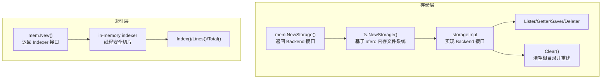
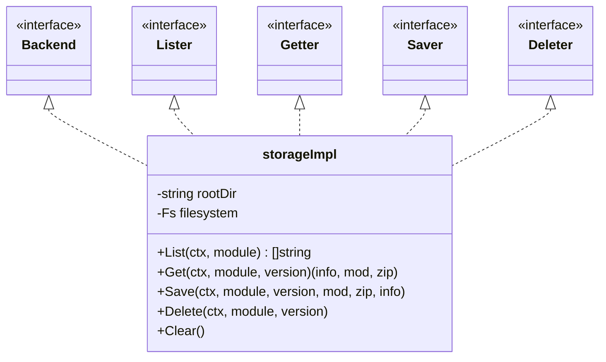
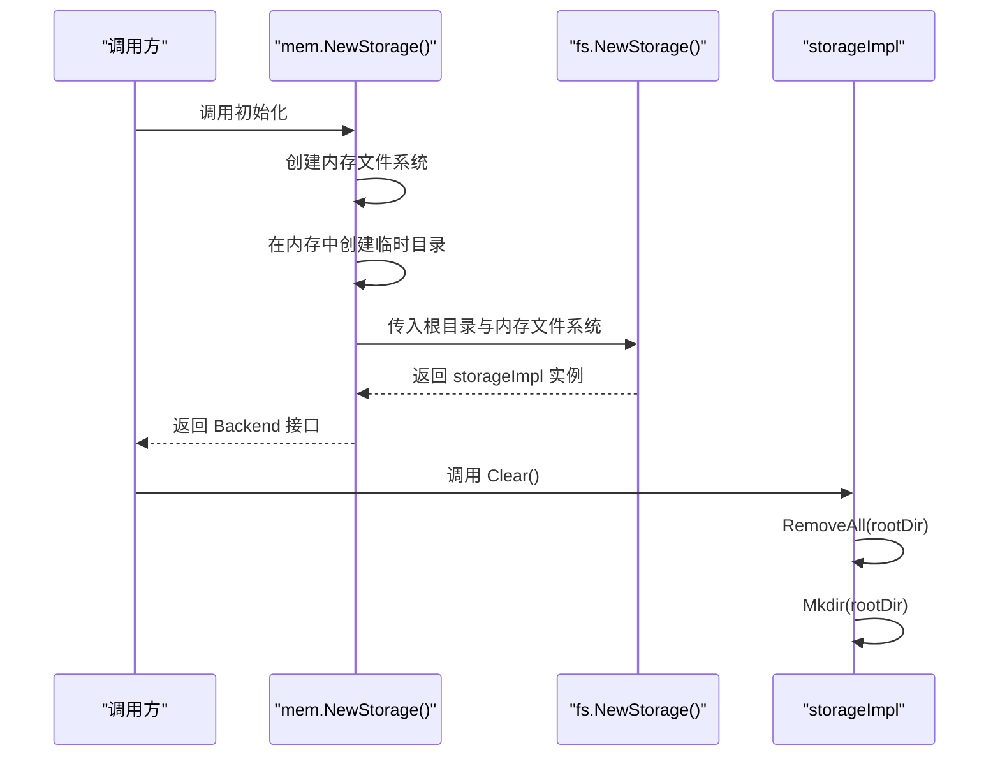
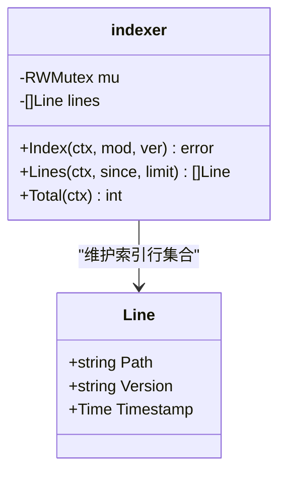
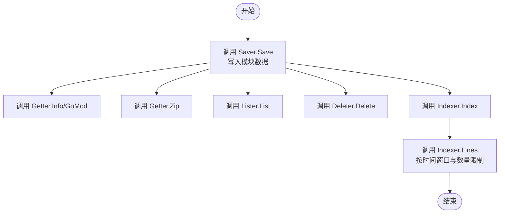
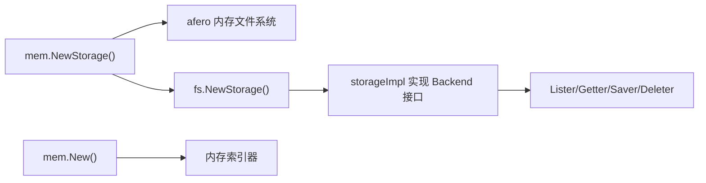

# 内存存储

<cite>
**本文引用的文件**
- [pkg/storage/mem/mem.go](file://pkg/storage/mem/mem.go)
- [pkg/storage/fs/fs.go](file://pkg/storage/fs/fs.go)
- [pkg/storage/backend.go](file://pkg/storage/backend.go)
- [pkg/storage/lister.go](file://pkg/storage/lister.go)
- [pkg/storage/getter.go](file://pkg/storage/getter.go)
- [pkg/storage/saver.go](file://pkg/storage/saver.go)
- [pkg/storage/deleter.go](file://pkg/storage/deleter.go)
- [pkg/index/mem/mem.go](file://pkg/index/mem/mem.go)
- [pkg/index/indexer.go](file://pkg/index/indexer.go)
- [docs/content/configuration/storage.md](file://docs/content/configuration/storage.md)
- [pkg/index/mem/mem_test.go](file://pkg/index/mem/mem_test.go)
- [scripts/benchmark.sh](file://scripts/benchmark.sh)
- [scripts/ps/benchmark.ps1](file://scripts/ps/benchmark.ps1)
</cite>

## 目录
1. [引言](#引言)
2. [项目结构](#项目结构)
3. [核心组件](#核心组件)
4. [架构总览](#架构总览)
5. [组件详解](#组件详解)
6. [依赖关系分析](#依赖关系分析)
7. [性能与内存特性](#性能与内存特性)
8. [故障排查指南](#故障排查指南)
9. [结论](#结论)
10. [附录：配置与最佳实践](#附录配置与最佳实践)

## 引言
本篇文档聚焦于“内存存储”（Memory Storage）的实现与使用，面向开发者与运维人员，系统阐述其数据结构设计、内存管理策略、性能特征、配置方式、容量与适用场景、初始化流程、读写与清理机制，并结合仓库内的基准脚本与测试文件给出优化建议与开发/测试环境的最佳实践。

## 项目结构
内存存储由两部分组成：
- 存储后端（Storage Backend）：通过内存文件系统实现，基于统一的存储接口组合（列表器、读取器、保存器、删除器），并提供清空能力。
- 索引器（Indexer）：内存索引器用于记录模块版本索引行，支持并发安全的索引、查询与统计。

**图表来源**
- [pkg/storage/mem/mem.go](file://pkg/storage/mem/mem.go#L12-L27)
- [pkg/storage/fs/fs.go](file://pkg/storage/fs/fs.go#L26-L39)
- [pkg/storage/backend.go](file://pkg/storage/backend.go#L3-L9)
- [pkg/index/mem/mem.go](file://pkg/index/mem/mem.go#L13-L16)

**章节来源**
- [pkg/storage/mem/mem.go](file://pkg/storage/mem/mem.go#L1-L28)
- [pkg/storage/fs/fs.go](file://pkg/storage/fs/fs.go#L1-L47)
- [pkg/storage/backend.go](file://pkg/storage/backend.go#L1-L10)
- [pkg/index/mem/mem.go](file://pkg/index/mem/mem.go#L1-L63)

## 核心组件
- 内存存储后端
  - 通过 afero 的内存文件系统创建临时目录，再委托 fs 后端实现统一的存储接口组合。
  - 提供 Clear 能力以清空并重建根目录。
- 内存索引器
  - 使用读写锁保护切片，提供去重索引、按时间窗口与数量限制查询、总数统计等能力。

**章节来源**
- [pkg/storage/mem/mem.go](file://pkg/storage/mem/mem.go#L12-L27)
- [pkg/storage/fs/fs.go](file://pkg/storage/fs/fs.go#L26-L46)
- [pkg/index/mem/mem.go](file://pkg/index/mem/mem.go#L13-L62)

## 架构总览
内存存储采用“接口聚合 + 文件系统适配”的架构模式：
- 存储后端通过 Backend 接口聚合 Lister、Getter、Saver、Deleter，统一对外暴露能力。
- 内存存储由 fs 后端承载，底层为 afero 内存文件系统，避免对磁盘 IO 的依赖。
- 索引器独立于存储后端，专注模块版本索引的增删查统计。

**图表来源**
- [pkg/storage/backend.go](file://pkg/storage/backend.go#L3-L9)
- [pkg/storage/lister.go](file://pkg/storage/lister.go#L5-L10)
- [pkg/storage/getter.go](file://pkg/storage/getter.go#L8-L13)
- [pkg/storage/saver.go](file://pkg/storage/saver.go#L8-L11)
- [pkg/storage/deleter.go](file://pkg/storage/deleter.go#L5-L10)
- [pkg/storage/fs/fs.go](file://pkg/storage/fs/fs.go#L13-L39)

## 组件详解

### 内存存储初始化与生命周期
- 初始化
  - 创建 afero 内存文件系统。
  - 在内存中创建临时目录作为根路径。
  - 基于该根路径与内存文件系统构造 fs 后端，返回 Backend 接口实例。
- 清理
  - Clear 将移除根目录并重新创建，达到“清空内存存储”的效果。

**图表来源**
- [pkg/storage/mem/mem.go](file://pkg/storage/mem/mem.go#L12-L27)
- [pkg/storage/fs/fs.go](file://pkg/storage/fs/fs.go#L26-L46)

**章节来源**
- [pkg/storage/mem/mem.go](file://pkg/storage/mem/mem.go#L12-L27)
- [pkg/storage/fs/fs.go](file://pkg/storage/fs/fs.go#L26-L46)

### 数据结构与并发模型
- 存储后端
  - storageImpl 持有根目录与 afero Fs；通过统一接口组合提供能力。
- 内存索引器
  - 使用读写锁保护切片，避免重复索引，支持按时间窗口与数量限制查询，提供总数统计。

**图表来源**
- [pkg/index/mem/mem.go](file://pkg/index/mem/mem.go#L18-L21)
- [pkg/index/mem/mem.go](file://pkg/index/mem/mem.go#L23-L38)
- [pkg/index/mem/mem.go](file://pkg/index/mem/mem.go#L40-L56)
- [pkg/index/mem/mem.go](file://pkg/index/mem/mem.go#L58-L62)
- [pkg/index/indexer.go](file://pkg/index/indexer.go#L8-L13)

**章节来源**
- [pkg/index/mem/mem.go](file://pkg/index/mem/mem.go#L18-L62)
- [pkg/index/indexer.go](file://pkg/index/indexer.go#L8-L29)

### 读写与查询流程
- 写入（保存）
  - 通过 Saver.Save 将模块元数据、go.mod 与压缩包写入内存文件系统。
- 读取（获取）
  - 通过 Getter.Info/GoMod/Zip 获取模块信息、go.mod 与压缩包流。
- 列表（列举）
  - 通过 Lister.List 获取模块的所有版本列表。
- 删除
  - 通过 Deleter.Delete 删除指定模块版本。
- 查询索引
  - 通过 Indexer.Lines 按时间窗口与数量限制查询索引行。

**图表来源**
- [pkg/storage/saver.go](file://pkg/storage/saver.go#L8-L11)
- [pkg/storage/getter.go](file://pkg/storage/getter.go#L8-L13)
- [pkg/storage/lister.go](file://pkg/storage/lister.go#L5-L10)
- [pkg/storage/deleter.go](file://pkg/storage/deleter.go#L5-L10)
- [pkg/index/mem/mem.go](file://pkg/index/mem/mem.go#L23-L38)
- [pkg/index/mem/mem.go](file://pkg/index/mem/mem.go#L40-L56)

**章节来源**
- [pkg/storage/saver.go](file://pkg/storage/saver.go#L8-L11)
- [pkg/storage/getter.go](file://pkg/storage/getter.go#L8-L13)
- [pkg/storage/lister.go](file://pkg/storage/lister.go#L5-L10)
- [pkg/storage/deleter.go](file://pkg/storage/deleter.go#L5-L10)
- [pkg/index/mem/mem.go](file://pkg/index/mem/mem.go#L23-L56)

## 依赖关系分析
- 内存存储依赖 afero 内存文件系统，避免真实磁盘 IO，提高测试与开发效率。
- 存储后端通过 fs 后端实现统一接口组合，便于替换与扩展。
- 索引器与存储后端解耦，可独立演进。

**图表来源**
- [pkg/storage/mem/mem.go](file://pkg/storage/mem/mem.go#L12-L27)
- [pkg/storage/fs/fs.go](file://pkg/storage/fs/fs.go#L26-L39)
- [pkg/storage/backend.go](file://pkg/storage/backend.go#L3-L9)

**章节来源**
- [pkg/storage/mem/mem.go](file://pkg/storage/mem/mem.go#L12-L27)
- [pkg/storage/fs/fs.go](file://pkg/storage/fs/fs.go#L26-L39)
- [pkg/storage/backend.go](file://pkg/storage/backend.go#L3-L9)

## 性能与内存特性
- 内存存储的性能优势
  - 无磁盘 IO，读写延迟低，适合高并发测试与本地开发。
  - 通过 Clear 可快速清空缓存，便于回归测试。
- 内存占用与容量
  - 容量受限于运行时可用内存；适合小规模数据与短期使用。
  - 不具备持久化能力，进程重启或 Clear 后数据丢失。
- 并发与一致性
  - 内存索引器使用读写锁，保证并发安全。
  - 存储后端基于内存文件系统，避免磁盘竞争，但同样受进程内存限制。

**章节来源**
- [pkg/storage/mem/mem.go](file://pkg/storage/mem/mem.go#L12-L27)
- [pkg/index/mem/mem.go](file://pkg/index/mem/mem.go#L18-L21)

## 故障排查指南
- 初始化失败
  - 若无法创建内存临时目录或从内存文件系统构建存储，会返回错误。检查 afero 内存文件系统状态与权限。
- 索引重复
  - 对同一模块版本重复索引会返回已存在错误，需先清理或去重处理。
- 查询为空
  - Lines 查询可能因时间窗口或数量限制导致结果为空，调整 since 与 limit 参数。
- 清理无效
  - Clear 成功后应能重建根目录；若异常，检查文件系统句柄与并发访问。

**章节来源**
- [pkg/storage/mem/mem.go](file://pkg/storage/mem/mem.go#L18-L26)
- [pkg/index/mem/mem.go](file://pkg/index/mem/mem.go#L27-L31)
- [pkg/storage/fs/fs.go](file://pkg/storage/fs/fs.go#L41-L46)

## 结论
内存存储通过 afero 内存文件系统与 fs 后端的组合，提供了高性能、易清理的存储方案，特别适用于开发与测试场景。其并发安全的索引器与统一的存储接口，使其易于集成与扩展。生产环境建议结合持久化存储使用，或仅在短期验证阶段采用。

## 附录：配置与最佳实践
- 配置
  - 文档指出内存存储无需特定配置，默认即可使用，且常用于开发目的。
- 最佳实践
  - 开发/测试：使用内存存储提升迭代速度；通过 Clear 快速重置状态。
  - 压测/基准：结合脚本运行基准测试，评估不同负载下的表现。
  - 生产建议：避免长期依赖内存存储；如需缓存，配合持久化存储与合适的容量规划。

**章节来源**
- [docs/content/configuration/storage.md](file://docs/content/configuration/storage.md#L41-L45)
- [scripts/benchmark.sh](file://scripts/benchmark.sh#L1-L3)
- [scripts/ps/benchmark.ps1](file://scripts/ps/benchmark.ps1#L1-L2)