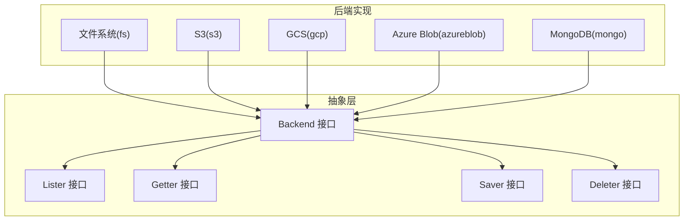
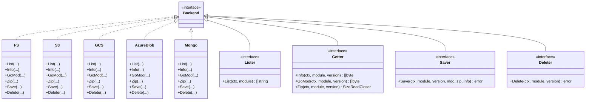
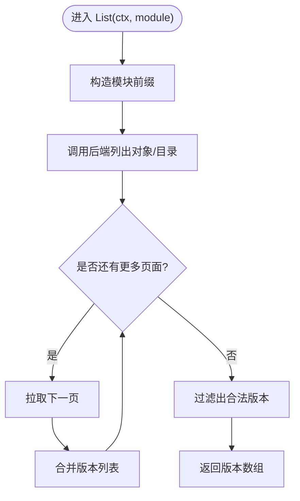
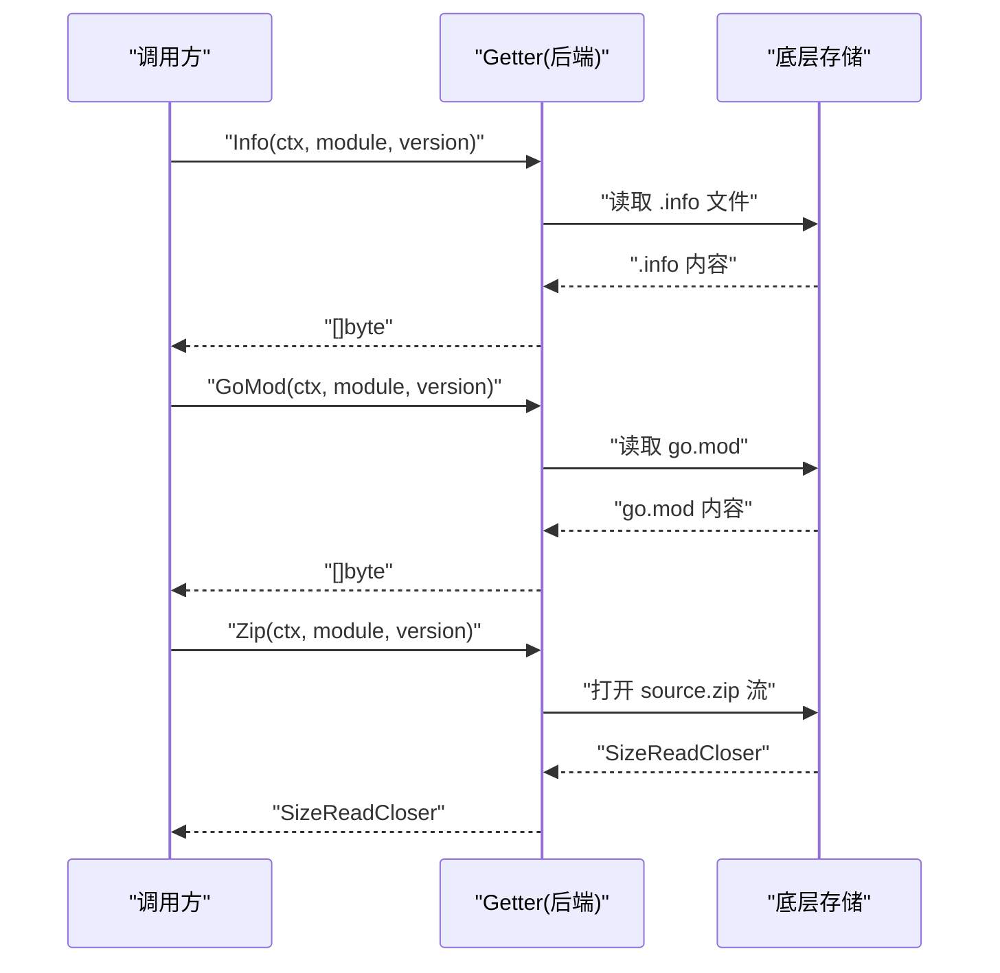
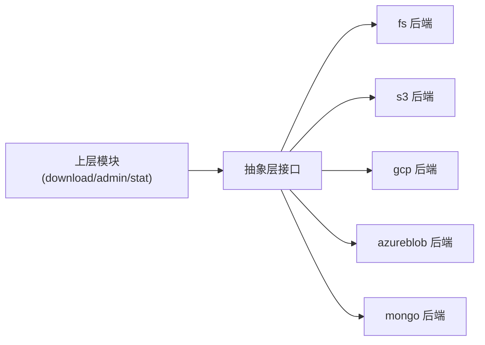

# 存储抽象层

<cite>
**本文引用的文件**
- [pkg/storage/backend.go](file://pkg/storage/backend.go)
- [pkg/storage/lister.go](file://pkg/storage/lister.go)
- [pkg/storage/getter.go](file://pkg/storage/getter.go)
- [pkg/storage/saver.go](file://pkg/storage/saver.go)
- [pkg/storage/deleter.go](file://pkg/storage/deleter.go)
- [pkg/storage/fs/fs.go](file://pkg/storage/fs/fs.go)
- [pkg/storage/fs/lister.go](file://pkg/storage/fs/lister.go)
- [pkg/storage/fs/getter.go](file://pkg/storage/fs/getter.go)
- [pkg/storage/fs/saver.go](file://pkg/storage/fs/saver.go)
- [pkg/storage/fs/deleter.go](file://pkg/storage/fs/deleter.go)
- [pkg/storage/s3/s3.go](file://pkg/storage/s3/s3.go)
- [pkg/storage/s3/lister.go](file://pkg/storage/s3/lister.go)
- [pkg/storage/gcp/gcp.go](file://pkg/storage/gcp/gcp.go)
- [pkg/storage/azureblob/azureblob.go](file://pkg/storage/azureblob/azureblob.go)
- [pkg/storage/mongo/mongo.go](file://pkg/storage/mongo/mongo.go)
</cite>

## 目录
1. [简介](#简介)
2. [项目结构](#项目结构)
3. [核心组件](#核心组件)
4. [架构总览](#架构总览)
5. [详细组件分析](#详细组件分析)
6. [依赖关系分析](#依赖关系分析)
7. [性能考量](#性能考量)
8. [故障排查指南](#故障排查指南)
9. [结论](#结论)
10. [附录：自定义存储后端实现指南](#附录自定义存储后端实现指南)

## 简介
本文件系统化阐述 Athens 的“存储抽象层”。其目标是通过统一的 Backend 接口与四大核心接口（Lister、Getter、Saver、Deleter）屏蔽底层存储差异，使上层业务逻辑无需关心具体后端（如本地文件系统、S3、GCS、Azure Blob、MongoDB 等），从而实现存储后端的统一管理与无缝切换。

该抽象层的关键价值在于：
- 统一能力边界：以模块/版本为粒度，提供列举版本、读取元数据/源码、保存、删除的能力。
- 可插拔后端：任意新增后端只需实现 Backend 或其子接口即可接入。
- 易于测试与合规：通过统一接口便于编写一致性测试与基准测试。

## 项目结构
存储抽象层位于 pkg/storage，并在 pkg/storage/* 下提供多种后端实现（如 fs、s3、gcp、azureblob、mongo 等）。每个后端均实现 Backend 或其子接口，遵循一致的数据模型与错误语义。

图表来源
- [pkg/storage/backend.go](file://pkg/storage/backend.go#L1-L10)
- [pkg/storage/lister.go](file://pkg/storage/lister.go#L1-L11)
- [pkg/storage/getter.go](file://pkg/storage/getter.go#L1-L37)
- [pkg/storage/saver.go](file://pkg/storage/saver.go#L1-L12)
- [pkg/storage/deleter.go](file://pkg/storage/deleter.go#L1-L11)
- [pkg/storage/fs/fs.go](file://pkg/storage/fs/fs.go#L1-L47)
- [pkg/storage/s3/s3.go](file://pkg/storage/s3/s3.go#L1-L99)
- [pkg/storage/gcp/gcp.go](file://pkg/storage/gcp/gcp.go#L1-L75)
- [pkg/storage/azureblob/azureblob.go](file://pkg/storage/azureblob/azureblob.go#L1-L195)
- [pkg/storage/mongo/mongo.go](file://pkg/storage/mongo/mongo.go#L1-L121)

章节来源
- [pkg/storage/backend.go](file://pkg/storage/backend.go#L1-L10)
- [pkg/storage/lister.go](file://pkg/storage/lister.go#L1-L11)
- [pkg/storage/getter.go](file://pkg/storage/getter.go#L1-L37)
- [pkg/storage/saver.go](file://pkg/storage/saver.go#L1-L12)
- [pkg/storage/deleter.go](file://pkg/storage/deleter.go#L1-L11)

## 核心组件
- Backend 接口：聚合 Lister、Getter、Saver、Deleter，代表一个完整的存储后端能力集合。
- Lister 接口：按模块列举可用版本列表；返回未找到时应返回特定错误。
- Getter 接口：按模块/版本读取三类内容：模块信息(.info)、go.mod、源码(zip)，并提供带大小的流式读取器。
- Saver 接口：按模块/版本保存 go.mod、源码(zip)、模块信息(.info)。
- Deleter 接口：按模块/版本删除对应资源；未找到需返回特定错误。

这些接口统一了“模块/版本”维度的操作契约，确保不同后端在相同语义下工作。

章节来源
- [pkg/storage/backend.go](file://pkg/storage/backend.go#L1-L10)
- [pkg/storage/lister.go](file://pkg/storage/lister.go#L1-L11)
- [pkg/storage/getter.go](file://pkg/storage/getter.go#L1-L37)
- [pkg/storage/saver.go](file://pkg/storage/saver.go#L1-L12)
- [pkg/storage/deleter.go](file://pkg/storage/deleter.go#L1-L11)

## 架构总览
下图展示了抽象层与各后端实现之间的关系，以及统一的控制流：上层通过 Backend 调用具体后端，后端内部根据自身存储结构组织数据。

图表来源
- [pkg/storage/backend.go](file://pkg/storage/backend.go#L1-L10)
- [pkg/storage/lister.go](file://pkg/storage/lister.go#L1-L11)
- [pkg/storage/getter.go](file://pkg/storage/getter.go#L1-L37)
- [pkg/storage/saver.go](file://pkg/storage/saver.go#L1-L12)
- [pkg/storage/deleter.go](file://pkg/storage/deleter.go#L1-L11)
- [pkg/storage/fs/fs.go](file://pkg/storage/fs/fs.go#L1-L47)
- [pkg/storage/s3/s3.go](file://pkg/storage/s3/s3.go#L1-L99)
- [pkg/storage/gcp/gcp.go](file://pkg/storage/gcp/gcp.go#L1-L75)
- [pkg/storage/azureblob/azureblob.go](file://pkg/storage/azureblob/azureblob.go#L1-L195)
- [pkg/storage/mongo/mongo.go](file://pkg/storage/mongo/mongo.go#L1-L121)

## 详细组件分析

### Backend 接口与统一抽象
- 设计理念：Backend 是“完整后端”的聚合接口，避免上层同时注入多个子接口，降低耦合与配置复杂度。
- 实现要求：任何具体后端只要实现了 Backend，即具备“列举版本、读取、保存、删除”的完整能力；若某后端不支持某操作（如只读后端），应在相应方法中返回明确的错误类型以表明不支持。
- 权衡考虑：将四类职责合并到单一接口，简化调用；但对“只读后端”或“部分能力后端”，需要在错误语义上清晰表达。

章节来源
- [pkg/storage/backend.go](file://pkg/storage/backend.go#L1-L10)

### Lister 接口
- 职责：按模块返回可用版本列表；未找到模块应返回“未找到”错误。
- 数据模型：版本采用语义化版本字符串，后端需识别并过滤非标准版本。
- 性能要点：分页遍历对象键（如 S3）时，尽量减少网络往返；在内存中合并结果后再返回。
- 错误处理：未找到模块不应报错，而应返回空列表；其他异常需包装为统一错误类型。

图表来源
- [pkg/storage/s3/lister.go](file://pkg/storage/s3/lister.go#L1-L59)

章节来源
- [pkg/storage/lister.go](file://pkg/storage/lister.go#L1-L11)
- [pkg/storage/s3/lister.go](file://pkg/storage/s3/lister.go#L1-L59)

### Getter 接口
- 职责：读取模块信息(.info)、go.mod、源码(zip)；Zip 返回带 Size 的流式读取器。
- 数据模型：三类文件分别对应模块元信息、go.mod 内容、压缩包；Zip 需提供总大小以便上层进行进度与限速控制。
- 实现建议：Zip 使用适配器包装底层读取器，暴露 Size()；避免一次性加载大文件至内存。
- 错误处理：未找到版本或文件时返回“未找到”错误；IO 异常包装为统一错误类型。

图表来源
- [pkg/storage/getter.go](file://pkg/storage/getter.go#L1-L37)

章节来源
- [pkg/storage/getter.go](file://pkg/storage/getter.go#L1-L37)

### Saver 接口
- 职责：保存模块的 go.mod、源码(zip)、模块信息(.info)。
- 数据模型：三类文件必须同时写入，保证原子性与一致性；失败时应回滚或保持幂等。
- 实现建议：先写 go.mod 与 .info，再写 zip，最后校验；对分布式存储可使用多段上传+最终落盘策略。
- 错误处理：IO 失败、权限不足、配额超限等均需包装为统一错误类型。

章节来源
- [pkg/storage/saver.go](file://pkg/storage/saver.go#L1-L12)

### Deleter 接口
- 职责：删除指定模块/版本的所有文件。
- 实现建议：先 Exists 检查，再删除；对对象存储可批量删除；对文件系统可递归删除。
- 错误处理：未找到版本需返回“未找到”错误；删除过程中出现异常需包装为统一错误类型。

章节来源
- [pkg/storage/deleter.go](file://pkg/storage/deleter.go#L1-L11)

### 后端实现对比与最佳实践
- 文件系统(fs)：以目录结构存放模块/版本文件，适合开发与小规模部署。注意权限掩码与跨平台路径分隔符。
- S3：使用分页列举对象键，提取 .info 文件名中的版本号；上传使用分段策略；注意 Region、Endpoint、凭据链配置。
- GCS：通过客户端库访问 Bucket；支持服务账号密钥或自动环境凭据；注意桶存在性检查。
- Azure Blob：支持共享密钥与托管身份两种认证；上传使用旋转缓冲区；注意令牌刷新与过期时间。
- MongoDB：使用 GridFS 存放源码 zip，BSON 文档存储元信息；建立稀疏唯一索引加速查询。

章节来源
- [pkg/storage/fs/fs.go](file://pkg/storage/fs/fs.go#L1-L47)
- [pkg/storage/fs/lister.go](file://pkg/storage/fs/lister.go#L1-L39)
- [pkg/storage/fs/getter.go](file://pkg/storage/fs/getter.go#L1-L56)
- [pkg/storage/fs/saver.go](file://pkg/storage/fs/saver.go#L1-L52)
- [pkg/storage/fs/deleter.go](file://pkg/storage/fs/deleter.go#L1-L25)
- [pkg/storage/s3/s3.go](file://pkg/storage/s3/s3.go#L1-L99)
- [pkg/storage/s3/lister.go](file://pkg/storage/s3/lister.go#L1-L59)
- [pkg/storage/gcp/gcp.go](file://pkg/storage/gcp/gcp.go#L1-L75)
- [pkg/storage/azureblob/azureblob.go](file://pkg/storage/azureblob/azureblob.go#L1-L195)
- [pkg/storage/mongo/mongo.go](file://pkg/storage/mongo/mongo.go#L1-L121)

## 依赖关系分析
- 抽象层与后端：所有后端均实现 Backend 或其子接口，形成松耦合。
- 上层依赖：download、admin、stat 等模块仅依赖抽象层接口，不直接依赖具体后端。
- 错误与可观测：各后端普遍使用统一错误包装与链路追踪 Span，提升可观测性与排障效率。

图表来源
- [pkg/storage/backend.go](file://pkg/storage/backend.go#L1-L10)
- [pkg/storage/lister.go](file://pkg/storage/lister.go#L1-L11)
- [pkg/storage/getter.go](file://pkg/storage/getter.go#L1-L37)
- [pkg/storage/saver.go](file://pkg/storage/saver.go#L1-L12)
- [pkg/storage/deleter.go](file://pkg/storage/deleter.go#L1-L11)

## 性能考量
- 列举性能：S3/GCS/Azure Blob 等对象存储应使用分页与并发拉取，减少网络往返；在内存中合并结果。
- 读写性能：Zip 采用流式读取，避免大文件全量加载；上传使用分段与缓冲池；对磁盘文件系统注意同步策略与权限掩码。
- 并发与限流：在上层或后端实现中加入并发限制与速率控制，防止突发流量压垮后端。
- 缓存与预热：对热点模块/版本可引入缓存层，减少重复 IO。

## 故障排查指南
- 未找到错误：List/Info/GoMod/Zip/Delete 均可能返回“未找到”，需区分是模块不存在还是版本不存在。
- 权限问题：S3/GCS/Azure Blob 需检查凭据、角色与桶/容器权限；MongoDB 需检查连接串与证书。
- 网络与超时：设置合理的超时与重试策略；对分页操作增加最大页数限制，避免无限循环。
- 日志与追踪：启用链路追踪与统一错误包装，定位具体失败步骤与原因。

## 结论
存储抽象层通过 Backend 与四大核心接口，成功将上层与底层存储解耦。它既保证了统一的使用体验，又允许灵活选择与扩展后端。遵循本文的接口设计原则、实现规范与最佳实践，可在不修改上层逻辑的前提下平滑切换或新增存储后端。

## 附录：自定义存储后端实现指南
- 必备接口
  - 至少实现 Backend（即同时实现 Lister、Getter、Saver、Deleter），或按需实现子接口。
  - 对 Getter，Zip 必须返回带 Size 的读取器；对 Deleter，未找到版本需返回“未找到”错误。
- 数据模型
  - 以“模块/版本”为单位组织数据；确保 go.mod、source.zip、模块信息(.info)三者一致。
- 错误与日志
  - 使用统一错误包装；为关键路径添加链路追踪 Span。
- 安全与配置
  - 提供必要的配置项（如 Endpoint、凭据、超时等）；对敏感信息进行最小化授权。
- 示例参考
  - 文件系统实现：参考 [pkg/storage/fs/fs.go](file://pkg/storage/fs/fs.go#L1-L47) 及其子文件 [pkg/storage/fs/lister.go](file://pkg/storage/fs/lister.go#L1-L39)、[pkg/storage/fs/getter.go](file://pkg/storage/fs/getter.go#L1-L56)、[pkg/storage/fs/saver.go](file://pkg/storage/fs/saver.go#L1-L52)、[pkg/storage/fs/deleter.go](file://pkg/storage/fs/deleter.go#L1-L25)。
  - S3 实现：参考 [pkg/storage/s3/s3.go](file://pkg/storage/s3/s3.go#L1-L99)、[pkg/storage/s3/lister.go](file://pkg/storage/s3/lister.go#L1-L59)。
  - GCS 实现：参考 [pkg/storage/gcp/gcp.go](file://pkg/storage/gcp/gcp.go#L1-L75)。
  - Azure Blob 实现：参考 [pkg/storage/azureblob/azureblob.go](file://pkg/storage/azureblob/azureblob.go#L1-L195)。
  - MongoDB 实现：参考 [pkg/storage/mongo/mongo.go](file://pkg/storage/mongo/mongo.go#L1-L121)。

章节来源
- [pkg/storage/backend.go](file://pkg/storage/backend.go#L1-L10)
- [pkg/storage/lister.go](file://pkg/storage/lister.go#L1-L11)
- [pkg/storage/getter.go](file://pkg/storage/getter.go#L1-L37)
- [pkg/storage/saver.go](file://pkg/storage/saver.go#L1-L12)
- [pkg/storage/deleter.go](file://pkg/storage/deleter.go#L1-L11)
- [pkg/storage/fs/fs.go](file://pkg/storage/fs/fs.go#L1-L47)
- [pkg/storage/fs/lister.go](file://pkg/storage/fs/lister.go#L1-L39)
- [pkg/storage/fs/getter.go](file://pkg/storage/fs/getter.go#L1-L56)
- [pkg/storage/fs/saver.go](file://pkg/storage/fs/saver.go#L1-L52)
- [pkg/storage/fs/deleter.go](file://pkg/storage/fs/deleter.go#L1-L25)
- [pkg/storage/s3/s3.go](file://pkg/storage/s3/s3.go#L1-L99)
- [pkg/storage/s3/lister.go](file://pkg/storage/s3/lister.go#L1-L59)
- [pkg/storage/gcp/gcp.go](file://pkg/storage/gcp/gcp.go#L1-L75)
- [pkg/storage/azureblob/azureblob.go](file://pkg/storage/azureblob/azureblob.go#L1-L195)
- [pkg/storage/mongo/mongo.go](file://pkg/storage/mongo/mongo.go#L1-L121)