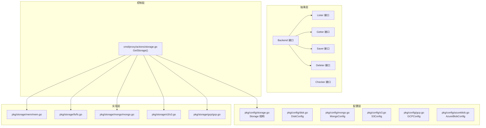
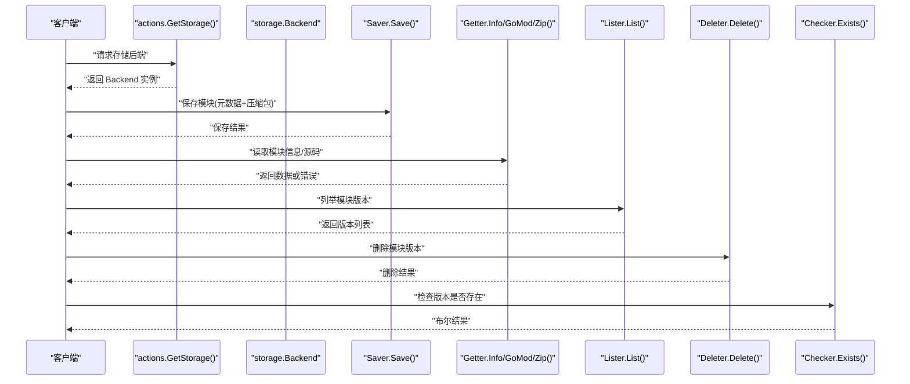
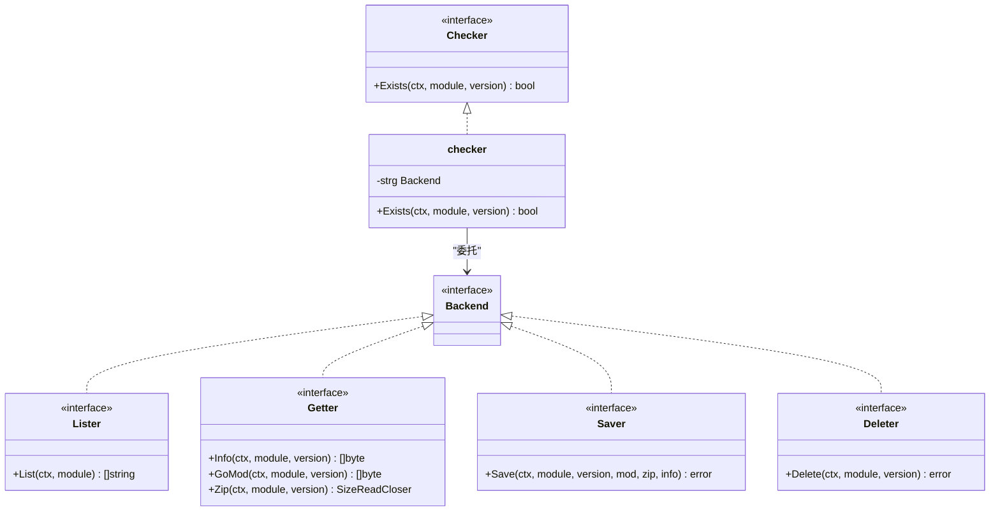
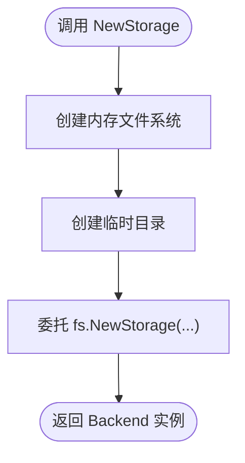
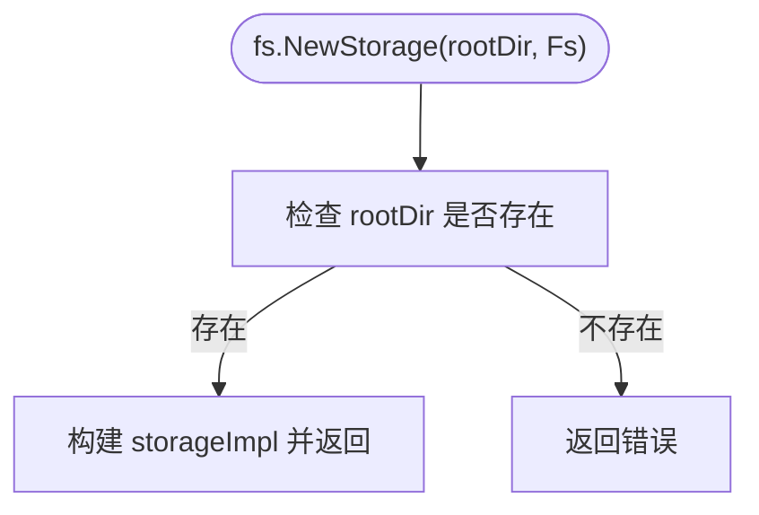
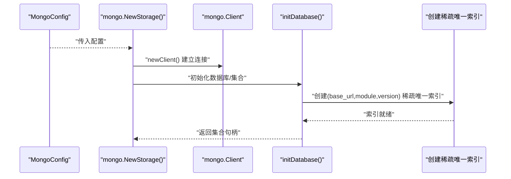
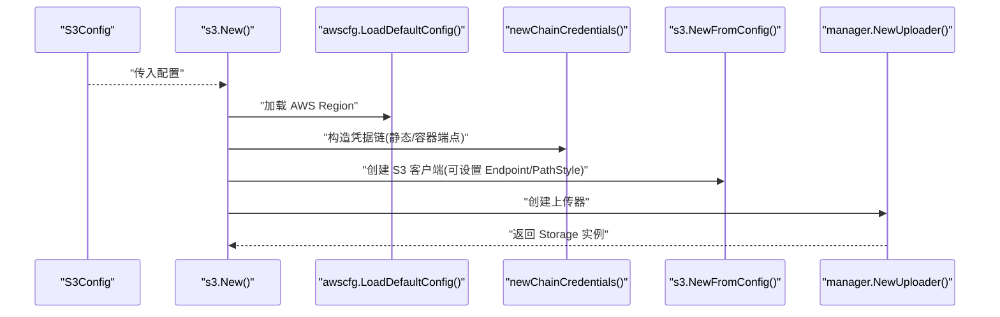
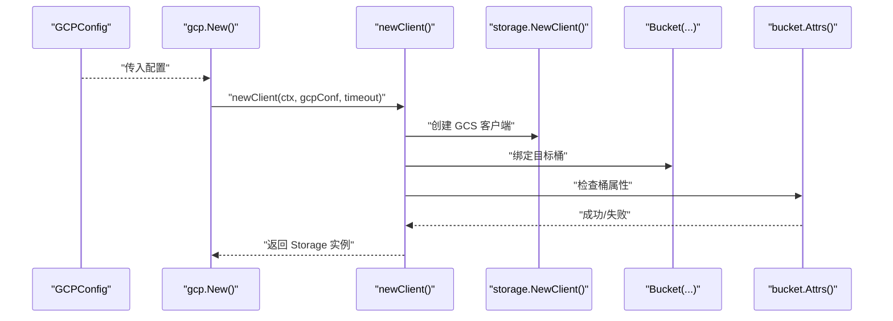
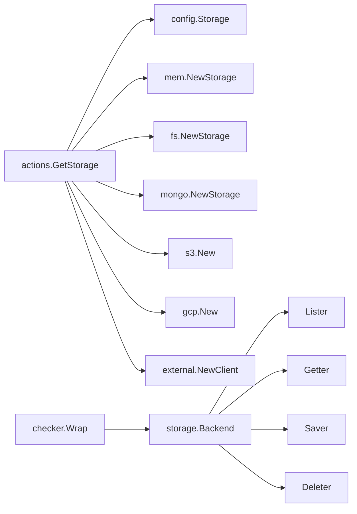

# 存储系统

<cite>
**本文引用的文件**
- [pkg/storage/backend.go](file://pkg/storage/backend.go)
- [pkg/storage/getter.go](file://pkg/storage/getter.go)
- [pkg/storage/saver.go](file://pkg/storage/saver.go)
- [pkg/storage/lister.go](file://pkg/storage/lister.go)
- [pkg/storage/deleter.go](file://pkg/storage/deleter.go)
- [pkg/storage/checker.go](file://pkg/storage/checker.go)
- [pkg/storage/module.go](file://pkg/storage/module.go)
- [cmd/proxy/actions/storage.go](file://cmd/proxy/actions/storage.go)
- [pkg/config/storage.go](file://pkg/config/storage.go)
- [pkg/config/disk.go](file://pkg/config/disk.go)
- [pkg/config/mongo.go](file://pkg/config/mongo.go)
- [pkg/config/s3.go](file://pkg/config/s3.go)
- [pkg/config/gcp.go](file://pkg/config/gcp.go)
- [pkg/config/azureblob.go](file://pkg/config/azureblob.go)
- [pkg/storage/mem/mem.go](file://pkg/storage/mem/mem.go)
- [pkg/storage/fs/fs.go](file://pkg/storage/fs/fs.go)
- [pkg/storage/mongo/mongo.go](file://pkg/storage/mongo/mongo.go)
- [pkg/storage/s3/s3.go](file://pkg/storage/s3/s3.go)
- [pkg/storage/gcp/gcp.go](file://pkg/storage/gcp/gcp.go)
</cite>

## 目录
1. [简介](#简介)
2. [项目结构](#项目结构)
3. [核心组件](#核心组件)
4. [架构总览](#架构总览)
5. [详细组件分析](#详细组件分析)
6. [依赖关系分析](#依赖关系分析)
7. [性能考量](#性能考量)
8. [故障排查指南](#故障排查指南)
9. [结论](#结论)
10. [附录](#附录)

## 简介
本文件系统性梳理 Athens 的存储抽象层与多后端实现，覆盖统一接口设计、内存存储、文件系统存储、数据库（MongoDB）存储、云存储（S3、Google Cloud Storage、Azure Blob）以及外部存储客户端。文档重点阐述：
- 统一接口与组合模式：通过 Backend 接口聚合 Lister、Getter、Saver、Deleter 能力，支持 Checker 包装器进行存在性检查。
- 后端选择与配置：基于环境变量与配置对象的后端实例化流程。
- 数据流与操作：模块的保存、检索、列举与删除在各后端中的实现要点。
- 性能与适用场景：不同后端的特性、延迟、吞吐与扩展性差异。
- 容量规划、备份与故障恢复：最佳实践建议。

## 项目结构
存储子系统采用“接口 + 多后端实现”的分层设计：
- 抽象层：定义统一的存储接口与工具包装器。
- 配置层：集中管理各后端的配置结构体。
- 控制层：根据运行时配置选择具体后端实例。
- 实现层：为每种后端提供具体的 Lister/Getter/Saver/Deleter 实现。

图表来源
- [pkg/storage/backend.go](file://pkg/storage/backend.go#L1-L10)
- [pkg/storage/getter.go](file://pkg/storage/getter.go#L1-L37)
- [pkg/storage/saver.go](file://pkg/storage/saver.go#L1-L12)
- [pkg/storage/lister.go](file://pkg/storage/lister.go#L1-L11)
- [pkg/storage/deleter.go](file://pkg/storage/deleter.go#L1-L11)
- [cmd/proxy/actions/storage.go](file://cmd/proxy/actions/storage.go#L24-L77)
- [pkg/config/storage.go](file://pkg/config/storage.go#L1-L13)
- [pkg/config/disk.go](file://pkg/config/disk.go#L1-L7)
- [pkg/config/mongo.go](file://pkg/config/mongo.go#L1-L11)
- [pkg/config/s3.go](file://pkg/config/s3.go#L1-L16)
- [pkg/config/gcp.go](file://pkg/config/gcp.go#L1-L9)
- [pkg/config/azureblob.go](file://pkg/config/azureblob.go#L1-L11)
- [pkg/storage/mem/mem.go](file://pkg/storage/mem/mem.go#L1-L28)
- [pkg/storage/fs/fs.go](file://pkg/storage/fs/fs.go#L1-L47)
- [pkg/storage/mongo/mongo.go](file://pkg/storage/mongo/mongo.go#L1-L121)
- [pkg/storage/s3/s3.go](file://pkg/storage/s3/s3.go#L1-L99)
- [pkg/storage/gcp/gcp.go](file://pkg/storage/gcp/gcp.go#L1-L75)

章节来源
- [pkg/storage/backend.go](file://pkg/storage/backend.go#L1-L10)
- [cmd/proxy/actions/storage.go](file://cmd/proxy/actions/storage.go#L24-L77)
- [pkg/config/storage.go](file://pkg/config/storage.go#L1-L13)

## 核心组件
- Backend 接口：统一的后端能力集合，包含列举、获取、保存、删除。
- Getter：提供 Info、GoMod、Zip 三类读取能力，并通过 SizeReadCloser 提供大小信息。
- Saver：保存模块元数据与压缩包。
- Lister：按模块列举版本列表。
- Deleter：删除指定模块版本。
- Checker：通过包装 Backend，以存在性检查的方式复用 Getter 能力。
- Module：模块在存储中的通用模型（含 MongoDB 特定字段注释）。

章节来源
- [pkg/storage/backend.go](file://pkg/storage/backend.go#L1-L10)
- [pkg/storage/getter.go](file://pkg/storage/getter.go#L1-L37)
- [pkg/storage/saver.go](file://pkg/storage/saver.go#L1-L12)
- [pkg/storage/lister.go](file://pkg/storage/lister.go#L1-L11)
- [pkg/storage/deleter.go](file://pkg/storage/deleter.go#L1-L11)
- [pkg/storage/checker.go](file://pkg/storage/checker.go#L1-L38)
- [pkg/storage/module.go](file://pkg/storage/module.go#L1-L17)

## 架构总览
下图展示从控制器到后端的调用链与数据流，体现统一接口如何屏蔽后端差异。

图表来源
- [cmd/proxy/actions/storage.go](file://cmd/proxy/actions/storage.go#L24-L77)
- [pkg/storage/backend.go](file://pkg/storage/backend.go#L1-L10)
- [pkg/storage/saver.go](file://pkg/storage/saver.go#L1-L12)
- [pkg/storage/getter.go](file://pkg/storage/getter.go#L1-L37)
- [pkg/storage/lister.go](file://pkg/storage/lister.go#L1-L11)
- [pkg/storage/deleter.go](file://pkg/storage/deleter.go#L1-L11)
- [pkg/storage/checker.go](file://pkg/storage/checker.go#L1-L38)

## 详细组件分析

### 统一接口与 Checker 包装
- Backend 将 Lister、Getter、Saver、Deleter 组合为单一能力面，便于上层以统一方式使用。
- Checker 通过包装 Backend，利用 Info 调用判断存在性；若返回“未找到”则判定不存在，其他错误原样返回。

图表来源
- [pkg/storage/backend.go](file://pkg/storage/backend.go#L1-L10)
- [pkg/storage/lister.go](file://pkg/storage/lister.go#L1-L11)
- [pkg/storage/getter.go](file://pkg/storage/getter.go#L1-L37)
- [pkg/storage/saver.go](file://pkg/storage/saver.go#L1-L12)
- [pkg/storage/deleter.go](file://pkg/storage/deleter.go#L1-L11)
- [pkg/storage/checker.go](file://pkg/storage/checker.go#L1-L38)

章节来源
- [pkg/storage/checker.go](file://pkg/storage/checker.go#L1-L38)

### 内存存储（mem）
- 基于内存文件系统（afero.MemMapFs）创建临时目录，再委托 fs 后端完成实际的文件组织与 IO。
- 适合测试、缓存或短期运行场景，不持久化到磁盘。

图表来源
- [pkg/storage/mem/mem.go](file://pkg/storage/mem/mem.go#L1-L28)
- [pkg/storage/fs/fs.go](file://pkg/storage/fs/fs.go#L1-L47)

章节来源
- [pkg/storage/mem/mem.go](file://pkg/storage/mem/mem.go#L1-L28)

### 文件系统存储（fs）
- 以 rootDir 作为根路径，通过 afero.Fs 抽象访问底层文件系统。
- 提供 Clear 清理能力，用于重建根目录。
- 模块与版本路径采用两级目录结构组织。

图表来源
- [pkg/storage/fs/fs.go](file://pkg/storage/fs/fs.go#L1-L47)

章节来源
- [pkg/storage/fs/fs.go](file://pkg/storage/fs/fs.go#L1-L47)

### 数据库存储（MongoDB）
- 通过配置对象建立连接，支持证书注入与超时设置。
- 默认数据库与集合名可配置，自动创建稀疏唯一索引以加速存在性查询。
- 文件名采用模块名替换斜杠并拼接版本的方式，便于对象存储定位。

图表来源
- [pkg/storage/mongo/mongo.go](file://pkg/storage/mongo/mongo.go#L1-L121)
- [pkg/config/mongo.go](file://pkg/config/mongo.go#L1-L11)

章节来源
- [pkg/storage/mongo/mongo.go](file://pkg/storage/mongo/mongo.go#L1-L121)
- [pkg/config/mongo.go](file://pkg/config/mongo.go#L1-L11)

### 云存储（S3）
- 使用 AWS SDK v2，支持默认凭据链与自定义凭据端点。
- 可强制路径风格访问与自定义 Endpoint，适配兼容 S3 的对象存储服务。
- 上传器基于分段上传优化大文件传输。

图表来源
- [pkg/storage/s3/s3.go](file://pkg/storage/s3/s3.go#L1-L99)
- [pkg/config/s3.go](file://pkg/config/s3.go#L1-L16)

章节来源
- [pkg/storage/s3/s3.go](file://pkg/storage/s3/s3.go#L1-L99)
- [pkg/config/s3.go](file://pkg/config/s3.go#L1-L16)

### 云存储（Google Cloud Storage）
- 支持通过 JSON Key 或默认凭据（如 App Engine）认证。
- 在创建客户端后会校验桶是否存在，确保部署正确。

图表来源
- [pkg/storage/gcp/gcp.go](file://pkg/storage/gcp/gcp.go#L1-L75)
- [pkg/config/gcp.go](file://pkg/config/gcp.go#L1-L9)

章节来源
- [pkg/storage/gcp/gcp.go](file://pkg/storage/gcp/gcp.go#L1-L75)
- [pkg/config/gcp.go](file://pkg/config/gcp.go#L1-L9)

### 外部存储客户端
- 通过 URL 指向外部存储服务，使用 HTTP 客户端发起请求。
- 适用于企业内部自建存储网关或代理场景。

章节来源
- [cmd/proxy/actions/storage.go](file://cmd/proxy/actions/storage.go#L68-L72)

### 存储后端选择与配置
- 控制器根据 storageType 与配置对象选择具体后端：
  - memory → 内存存储
  - disk → 文件系统存储（需 RootPath）
  - mongo → MongoDB（需 URL、可选数据库/集合名、证书路径、是否不安全连接）
  - minio → 兼容 S3 的 MinIO（需桶名与区域等）
  - gcp → Google Cloud Storage（需项目、桶、可选 JSON Key）
  - s3 → Amazon S3（需区域、桶名、可选凭据与 Endpoint）
  - azureblob → Azure Blob（需账户、容器等）
  - external → 外部存储服务（需 URL）

章节来源
- [cmd/proxy/actions/storage.go](file://cmd/proxy/actions/storage.go#L24-L77)
- [pkg/config/storage.go](file://pkg/config/storage.go#L1-L13)
- [pkg/config/disk.go](file://pkg/config/disk.go#L1-L7)
- [pkg/config/mongo.go](file://pkg/config/mongo.go#L1-L11)
- [pkg/config/s3.go](file://pkg/config/s3.go#L1-L16)
- [pkg/config/gcp.go](file://pkg/config/gcp.go#L1-L9)
- [pkg/config/azureblob.go](file://pkg/config/azureblob.go#L1-L11)

## 依赖关系分析
- 控制层依赖配置层与各后端实现，形成“配置驱动”的后端选择。
- 抽象层通过接口隔离实现细节，降低耦合度。
- Checker 对 Backend 进行透明包装，复用 Getter 能力实现存在性检查。

图表来源
- [cmd/proxy/actions/storage.go](file://cmd/proxy/actions/storage.go#L24-L77)
- [pkg/storage/backend.go](file://pkg/storage/backend.go#L1-L10)
- [pkg/storage/checker.go](file://pkg/storage/checker.go#L1-L38)

章节来源
- [cmd/proxy/actions/storage.go](file://cmd/proxy/actions/storage.go#L24-L77)
- [pkg/storage/backend.go](file://pkg/storage/backend.go#L1-L10)
- [pkg/storage/checker.go](file://pkg/storage/checker.go#L1-L38)

## 性能考量
- 内存存储：极低延迟，适合开发测试与短时缓存；无持久化，重启即失。
- 文件系统存储：本地磁盘 IO，延迟较低；受磁盘空间与文件系统性能影响；适合单机部署或本地缓存。
- 数据库存储（MongoDB）：具备索引与事务能力，适合需要强一致与复杂查询的场景；网络与磁盘 IO 成本较高。
- 云存储（S3/GCS/Azure Blob）：高可用、弹性扩展；网络延迟为主要瓶颈；上传/下载带宽与并发度决定吞吐。
- 外部存储：取决于上游服务性能与网络状况；可通过代理/CDN 提升访问速度。

## 故障排查指南
- 配置缺失或无效
  - disk：确认 RootPath 存在且可访问。
  - mongo：确认 URL 可连通、数据库/集合名有效、证书路径正确。
  - s3：确认 Region、Bucket、凭据链或 Endpoint 设置正确。
  - gcp：确认项目、桶名、JSON Key（或默认凭据）有效。
  - azureblob：确认账户、容器、凭据范围设置正确。
- 连接与权限
  - 云存储需验证凭据链与网络可达性；必要时开启调试日志。
- 存在性检查
  - 使用 Checker.Exists 判断模块版本是否存在；若返回 false 且非“未找到”错误，需进一步排查后端状态。
- 删除与清理
  - 确认 Deleter.Delete 返回值；若报“未找到”，需检查模块/版本参数是否正确。

章节来源
- [cmd/proxy/actions/storage.go](file://cmd/proxy/actions/storage.go#L24-L77)
- [pkg/storage/checker.go](file://pkg/storage/checker.go#L1-L38)
- [pkg/storage/fs/fs.go](file://pkg/storage/fs/fs.go#L1-L47)
- [pkg/storage/mongo/mongo.go](file://pkg/storage/mongo/mongo.go#L1-L121)
- [pkg/storage/s3/s3.go](file://pkg/storage/s3/s3.go#L1-L99)
- [pkg/storage/gcp/gcp.go](file://pkg/storage/gcp/gcp.go#L1-L75)

## 结论
Athens 的存储系统通过统一接口与清晰的配置驱动机制，实现了对多种存储后端的一致抽象。开发者可根据部署场景与性能需求选择合适的后端，并结合 Checker、Lister、Getter、Saver、Deleter 的组合能力，构建稳定高效的模块存储与分发体系。

## 附录

### 存储容量规划与备份策略
- 容量规划
  - 评估模块数量、版本密度与压缩包平均大小，估算总占用。
  - 云存储按对象数与带宽峰值规划；文件系统存储预留磁盘冗余与快照空间。
- 备份策略
  - 数据库后端：定期导出/快照；云存储：启用版本化与跨区复制。
  - 文件系统：周期性归档与异地备份。
- 故障恢复
  - 优先验证桶/容器/集合可用性与权限；逐步回滚至最近一次健康备份；监控上传/下载失败率并告警。

### 适用场景建议
- 开发/测试：内存存储或本地文件系统存储。
- 单机/小规模：本地文件系统存储或 MongoDB。
- 生产/大规模：云存储（S3/GCS/Azure Blob），配合 CDN 与缓存层。
- 企业内网：外部存储客户端对接企业自建网关。