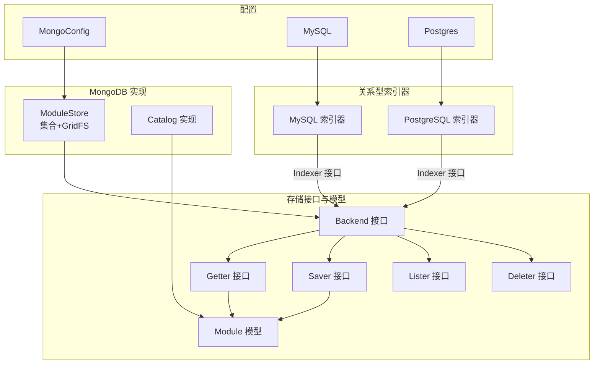
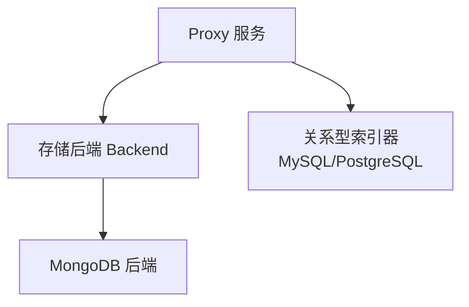
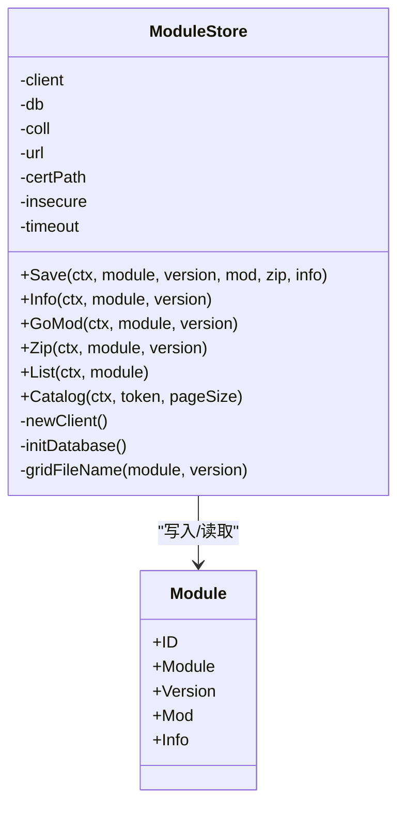
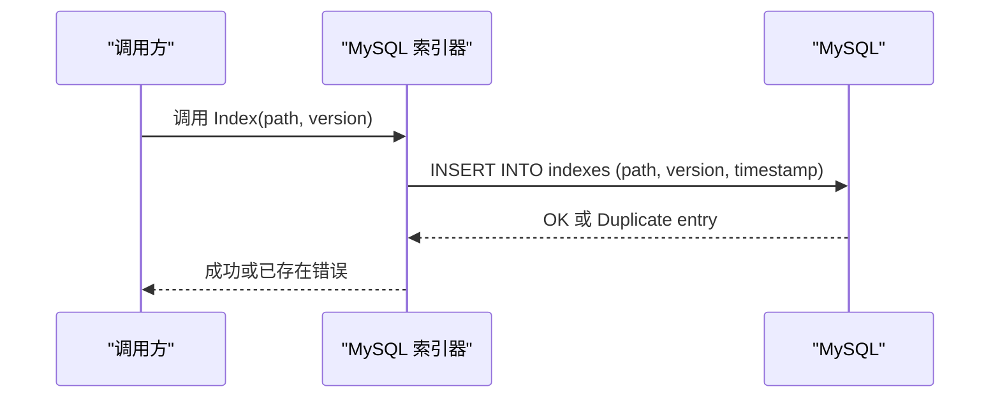
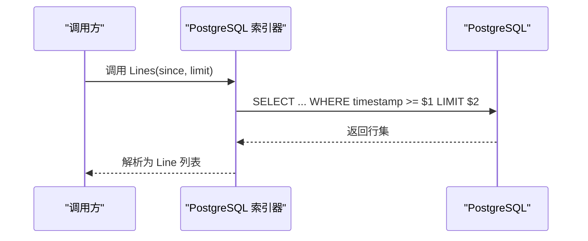
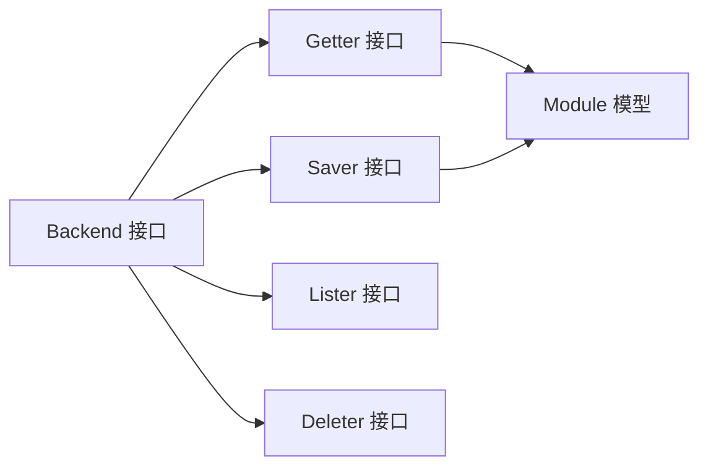
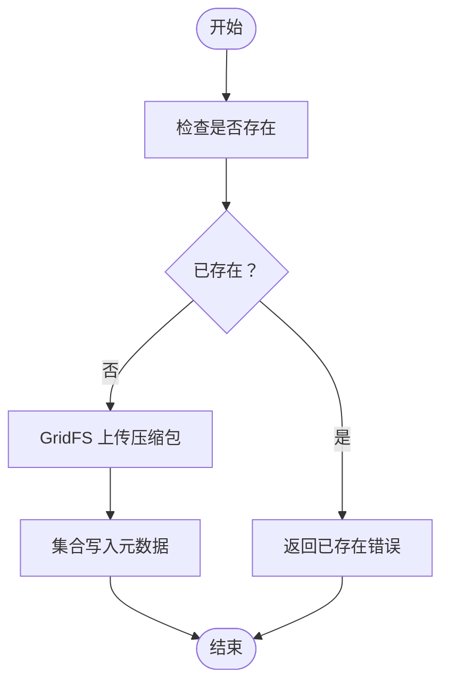

# 数据库存储

<cite>
**本文引用的文件**
- [pkg/config/mongo.go](file://pkg/config/mongo.go)
- [pkg/config/mysql.go](file://pkg/config/mysql.go)
- [pkg/config/postgres.go](file://pkg/config/postgres.go)
- [pkg/storage/mongo/mongo.go](file://pkg/storage/mongo/mongo.go)
- [pkg/storage/mongo/saver.go](file://pkg/storage/mongo/saver.go)
- [pkg/storage/mongo/getter.go](file://pkg/storage/mongo/getter.go)
- [pkg/storage/mongo/cataloger.go](file://pkg/storage/mongo/cataloger.go)
- [pkg/storage/module.go](file://pkg/storage/module.go)
- [pkg/storage/backend.go](file://pkg/storage/backend.go)
- [pkg/storage/getter.go](file://pkg/storage/getter.go)
- [pkg/storage/saver.go](file://pkg/storage/saver.go)
- [pkg/storage/lister.go](file://pkg/storage/lister.go)
- [pkg/storage/deleter.go](file://pkg/storage/deleter.go)
- [pkg/index/mysql/mysql.go](file://pkg/index/mysql/mysql.go)
- [pkg/index/postgres/postgres.go](file://pkg/index/postgres/postgres.go)
</cite>

## 目录
1. [简介](#简介)
2. [项目结构](#项目结构)
3. [核心组件](#核心组件)
4. [架构总览](#架构总览)
5. [详细组件分析](#详细组件分析)
6. [依赖关系分析](#依赖关系分析)
7. [性能与并发](#性能与并发)
8. [故障排查指南](#故障排查指南)
9. [结论](#结论)
10. [附录](#附录)

## 简介
本文件系统化梳理 Athens 的数据库存储实现，重点覆盖以下内容：
- 存储后端接口与职责边界：统一的 Backend/Lister/Getter/Saver/Deleter 接口族
- MongoDB 实现：基于集合与 GridFS 的模块元数据与压缩包存储
- MySQL 与 PostgreSQL 索引器实现：模块路径与版本索引表及时间窗口增量拉取
- 配置模型：Mongo、MySQL、Postgres 的环境变量驱动配置
- 并发与事务：各实现的并发控制与错误分类策略
- 表结构、索引与查询优化建议
- 迁移、备份与灾备思路
- 高并发与扩展性考量

## 项目结构
围绕“存储”与“索引”两大子系统，代码按功能域分层组织：
- 存储接口与通用模型：定义统一的 Backend/Lister/Getter/Saver/Deleter 接口与通用 Module 模型
- 具体存储实现：MongoDB（集合+GridFS）、MySQL、PostgreSQL
- 索引器：MySQL 与 PostgreSQL 的索引表初始化与查询接口
- 配置：Mongo、MySQL、Postgres 的配置结构体

图表来源
- [pkg/storage/backend.go](file://pkg/storage/backend.go#L1-L10)
- [pkg/storage/getter.go](file://pkg/storage/getter.go#L1-L37)
- [pkg/storage/saver.go](file://pkg/storage/saver.go#L1-L12)
- [pkg/storage/lister.go](file://pkg/storage/lister.go#L1-L11)
- [pkg/storage/deleter.go](file://pkg/storage/deleter.go#L1-L11)
- [pkg/storage/module.go](file://pkg/storage/module.go#L1-L17)
- [pkg/storage/mongo/mongo.go](file://pkg/storage/mongo/mongo.go#L1-L121)
- [pkg/storage/mongo/cataloger.go](file://pkg/storage/mongo/cataloger.go#L1-L68)
- [pkg/index/mysql/mysql.go](file://pkg/index/mysql/mysql.go#L1-L137)
- [pkg/index/postgres/postgres.go](file://pkg/index/postgres/postgres.go#L1-L131)
- [pkg/config/mongo.go](file://pkg/config/mongo.go#L1-L11)
- [pkg/config/mysql.go](file://pkg/config/mysql.go#L1-L13)
- [pkg/config/postgres.go](file://pkg/config/postgres.go#L1-L12)

章节来源
- [pkg/storage/backend.go](file://pkg/storage/backend.go#L1-L10)
- [pkg/storage/getter.go](file://pkg/storage/getter.go#L1-L37)
- [pkg/storage/saver.go](file://pkg/storage/saver.go#L1-L12)
- [pkg/storage/lister.go](file://pkg/storage/lister.go#L1-L11)
- [pkg/storage/deleter.go](file://pkg/storage/deleter.go#L1-L11)
- [pkg/storage/module.go](file://pkg/storage/module.go#L1-L17)

## 核心组件
- Backend：聚合 Lister/Getter/Saver/Deleter，作为完整存储后端的统一入口
- Getter：提供 Info/Gomod/Zip 三类读取能力
- Saver：保存模块元数据与源码压缩包
- Lister：列出指定模块的所有版本
- Deleter：删除模块或版本
- Module：跨存储后端的通用模块数据模型（含 MongoDB ObjectId）

章节来源
- [pkg/storage/backend.go](file://pkg/storage/backend.go#L1-L10)
- [pkg/storage/getter.go](file://pkg/storage/getter.go#L1-L37)
- [pkg/storage/saver.go](file://pkg/storage/saver.go#L1-L12)
- [pkg/storage/lister.go](file://pkg/storage/lister.go#L1-L11)
- [pkg/storage/deleter.go](file://pkg/storage/deleter.go#L1-L11)
- [pkg/storage/module.go](file://pkg/storage/module.go#L1-L17)

## 架构总览
下图展示存储后端与索引器的整体交互：Proxy 通过存储后端读写模块，同时通过索引器维护模块路径与版本的时间序列索引。

图表来源
- [pkg/storage/mongo/mongo.go](file://pkg/storage/mongo/mongo.go#L1-L121)
- [pkg/index/mysql/mysql.go](file://pkg/index/mysql/mysql.go#L1-L137)
- [pkg/index/postgres/postgres.go](file://pkg/index/postgres/postgres.go#L1-L131)

## 详细组件分析

### MongoDB 存储实现
- 连接与初始化
  - 基于配置构造客户端，支持 TLS 证书与可选跳过验证（开发用途）
  - 初始化数据库与集合，并创建唯一稀疏索引（base_url/module/version），避免重复入库
- 写入流程（Saver）
  - 先检查是否存在，若存在则返回已存在错误
  - 使用 GridFS 上传压缩包，记录文件名规则
  - 将模块元数据（module/version/mod/info）写入集合
- 读取流程（Getter）
  - Info/GoMod：从集合按 module/version 查询元数据
  - Zip：通过 GridFS 按文件名下载，返回带大小的读取器
- 列表与分页（Cataloger）
  - 基于 _id 投影 module/version，使用游标与 limit 分页，返回下一个 token
- 错误处理
  - 对 GridFS 未找到与集合无文档分别映射为“未找到”
  - 对写入冲突（已存在）进行分类

图表来源
- [pkg/storage/mongo/mongo.go](file://pkg/storage/mongo/mongo.go#L1-L121)
- [pkg/storage/mongo/saver.go](file://pkg/storage/mongo/saver.go#L1-L69)
- [pkg/storage/mongo/getter.go](file://pkg/storage/mongo/getter.go#L1-L115)
- [pkg/storage/mongo/cataloger.go](file://pkg/storage/mongo/cataloger.go#L1-L68)
- [pkg/storage/module.go](file://pkg/storage/module.go#L1-L17)

章节来源
- [pkg/storage/mongo/mongo.go](file://pkg/storage/mongo/mongo.go#L30-L121)
- [pkg/storage/mongo/saver.go](file://pkg/storage/mongo/saver.go#L15-L69)
- [pkg/storage/mongo/getter.go](file://pkg/storage/mongo/getter.go#L15-L115)
- [pkg/storage/mongo/cataloger.go](file://pkg/storage/mongo/cataloger.go#L15-L68)
- [pkg/storage/module.go](file://pkg/storage/module.go#L7-L17)

### MySQL 索引器实现
- 初始化
  - 构造 DSN，连接数据库并执行建表语句（包含时间戳索引与 path+version 唯一索引）
- 写入（Index）
  - 插入模块路径、版本与时间戳；对重复键冲突进行分类
- 查询（Lines/Total）
  - 支持自某个时间点起的增量拉取，限制返回条数
- 错误分类
  - 基于 MySQL 错误码 1062（Duplicate entry）识别“已存在”

图表来源
- [pkg/index/mysql/mysql.go](file://pkg/index/mysql/mysql.go#L19-L77)
- [pkg/index/mysql/mysql.go](file://pkg/index/mysql/mysql.go#L114-L137)

章节来源
- [pkg/index/mysql/mysql.go](file://pkg/index/mysql/mysql.go#L15-L137)

### PostgreSQL 索引器实现
- 初始化
  - 执行多条建表与索引语句（时间戳索引与 path+version 唯一索引）
- 写入/查询/计数
  - 采用参数化 SQL，使用 RFC3339Nano 时间格式
- 错误分类
  - 基于 pq 错误码 “23505”（唯一约束冲突）识别“已存在”

图表来源
- [pkg/index/postgres/postgres.go](file://pkg/index/postgres/postgres.go#L73-L94)

章节来源
- [pkg/index/postgres/postgres.go](file://pkg/index/postgres/postgres.go#L16-L131)

### 配置模型对比
- MongoDB
  - 关键字段：连接 URL、默认数据库名、默认集合名、证书路径、是否允许不安全连接
- MySQL
  - 关键字段：协议、主机、端口、用户、密码、数据库、连接参数字典
- PostgreSQL
  - 关键字段：主机、端口、用户、密码、数据库、连接参数字典

章节来源
- [pkg/config/mongo.go](file://pkg/config/mongo.go#L3-L10)
- [pkg/config/mysql.go](file://pkg/config/mysql.go#L4-L12)
- [pkg/config/postgres.go](file://pkg/config/postgres.go#L4-L11)

## 依赖关系分析
- 接口耦合
  - 所有存储后端均实现 Backend 接口，确保上层调用一致
  - Getter/Saver/Lister/Deleter 以组合方式被 Backend 聚合
- MongoDB 与关系型索引器
  - MongoDB 用于模块二进制与元数据存储
  - MySQL/PostgreSQL 用于模块路径与版本的时间序列索引
- 错误分类
  - 两套索引器均对“重复插入”进行错误分类，便于上层幂等处理

图表来源
- [pkg/storage/backend.go](file://pkg/storage/backend.go#L1-L10)
- [pkg/storage/getter.go](file://pkg/storage/getter.go#L1-L37)
- [pkg/storage/saver.go](file://pkg/storage/saver.go#L1-L12)
- [pkg/storage/lister.go](file://pkg/storage/lister.go#L1-L11)
- [pkg/storage/deleter.go](file://pkg/storage/deleter.go#L1-L11)
- [pkg/storage/module.go](file://pkg/storage/module.go#L1-L17)

章节来源
- [pkg/storage/backend.go](file://pkg/storage/backend.go#L1-L10)
- [pkg/storage/getter.go](file://pkg/storage/getter.go#L1-L37)
- [pkg/storage/saver.go](file://pkg/storage/saver.go#L1-L12)
- [pkg/storage/lister.go](file://pkg/storage/lister.go#L1-L11)
- [pkg/storage/deleter.go](file://pkg/storage/deleter.go#L1-L11)
- [pkg/storage/module.go](file://pkg/storage/module.go#L1-L17)

## 性能与并发
- 并发控制
  - MongoDB：每个操作使用带超时的上下文；GridFS 上传/下载为流式处理
  - MySQL/PostgreSQL：使用 sql.DB 连接池（由驱动管理），索引写入与查询均使用参数化 SQL
- 事务处理
  - MongoDB：未显式开启事务；写入流程先 Exists 检查再 Insert，存在竞态风险，建议在上层或应用层做去重
  - MySQL/PostgreSQL：索引写入为单条 INSERT，冲突通过错误码分类处理
- 索引与查询优化
  - MongoDB：集合上建立唯一稀疏索引（base_url/module/version），查询按 module+version 精准匹配
  - MySQL：时间戳列建立普通索引，path+version 建立唯一索引；Lines 查询使用时间戳范围与 LIMIT
  - PostgreSQL：同 MySQL，但索引创建拆分为多条语句
- 并发建议
  - 在上层引入幂等写入与去重逻辑（如基于版本号的唯一约束）
  - 对高频查询增加缓存层（如 Redis）以降低数据库压力
  - 对大体积压缩包读写使用流式处理，避免内存峰值

章节来源
- [pkg/storage/mongo/mongo.go](file://pkg/storage/mongo/mongo.go#L52-L72)
- [pkg/storage/mongo/saver.go](file://pkg/storage/mongo/saver.go#L15-L69)
- [pkg/storage/mongo/getter.go](file://pkg/storage/mongo/getter.go#L43-L81)
- [pkg/index/mysql/mysql.go](file://pkg/index/mysql/mysql.go#L35-L56)
- [pkg/index/mysql/mysql.go](file://pkg/index/mysql/mysql.go#L79-L101)
- [pkg/index/postgres/postgres.go](file://pkg/index/postgres/postgres.go#L37-L52)
- [pkg/index/postgres/postgres.go](file://pkg/index/postgres/postgres.go#L73-L94)

## 故障排查指南
- 连接失败
  - 检查配置项（URL/主机、端口、用户、密码、数据库、参数）
  - 确认 TLS 证书路径与可选跳过验证设置
- 写入冲突
  - MongoDB：若提示已存在，确认上层是否正确处理幂等
  - MySQL/PostgreSQL：重复键冲突会分类为“已存在”，需在上层重试或去重
- 读取不到数据
  - MongoDB：确认 module+version 是否与索引一致；GridFS 文件名规则是否匹配
  - MySQL/PostgreSQL：确认 Lines 查询的 since 参数与 LIMIT 设置
- 错误分类
  - MySQL：错误码 1062 映射为“已存在”
  - PostgreSQL：错误码 23505 映射为“已存在”

章节来源
- [pkg/storage/mongo/getter.go](file://pkg/storage/mongo/getter.go#L56-L62)
- [pkg/index/mysql/mysql.go](file://pkg/index/mysql/mysql.go#L125-L136)
- [pkg/index/postgres/postgres.go](file://pkg/index/postgres/postgres.go#L119-L130)

## 结论
- MongoDB 适合存储模块二进制与元数据，结合 GridFS 处理大文件；索引能力较弱，建议配合关系型索引器
- MySQL/PostgreSQL 适合作为模块路径与版本的时间序列索引存储，具备完善的索引与查询能力
- 统一的接口抽象使替换与扩展更灵活；在高并发场景下，建议在应用层加强幂等与去重，并结合缓存与限流

## 附录

### 数据模型与表结构
- MongoDB 集合（模块元数据）
  - 字段：module、version、mod、info
  - 索引：唯一稀疏索引（base_url/module/version）
- MySQL 表（indexes）
  - 字段：id（主键）、path（模块路径）、version（版本）、timestamp（时间戳）
  - 索引：timestamp 普通索引；path+version 唯一索引
- PostgreSQL 表（indexes）
  - 字段：id（SERIAL 主键）、path、version、timestamp
  - 索引：timestamp 普通索引；path+version 唯一索引

章节来源
- [pkg/storage/mongo/mongo.go](file://pkg/storage/mongo/mongo.go#L52-L72)
- [pkg/index/mysql/mysql.go](file://pkg/index/mysql/mysql.go#L35-L56)
- [pkg/index/postgres/postgres.go](file://pkg/index/postgres/postgres.go#L37-L52)

### 查询流程示意（MongoDB）

图表来源
- [pkg/storage/mongo/saver.go](file://pkg/storage/mongo/saver.go#L15-L69)

### 配置项一览
- MongoDB
  - ATHENS_MONGO_STORAGE_URL：连接字符串
  - ATHENS_MONGO_DEFAULT_DATABASE：默认数据库名
  - ATHENS_MONGO_DEFAULT_COLLECTION：默认集合名
  - ATHENS_MONGO_CERT_PATH：证书路径
  - ATHENS_MONGO_INSECURE：是否跳过验证
- MySQL
  - ATHENS_INDEX_MYSQL_PROTOCOL：协议
  - ATHENS_INDEX_MYSQL_HOST：主机
  - ATHENS_INDEX_MYSQL_PORT：端口
  - ATHENS_INDEX_MYSQL_USER：用户
  - ATHENS_INDEX_MYSQL_PASSWORD：密码
  - ATHENS_INDEX_MYSQL_DATABASE：数据库
  - ATHENS_INDEX_MYSQL_PARAMS：连接参数
- PostgreSQL
  - ATHENS_INDEX_POSTGRES_HOST：主机
  - ATHENS_INDEX_POSTGRES_PORT：端口
  - ATHENS_INDEX_POSTGRES_USER：用户
  - ATHENS_INDEX_POSTGRES_PASSWORD：密码
  - ATHENS_INDEX_POSTGRES_DATABASE：数据库
  - ATHENS_INDEX_POSTGRES_PARAMS：连接参数

章节来源
- [pkg/config/mongo.go](file://pkg/config/mongo.go#L5-L9)
- [pkg/config/mysql.go](file://pkg/config/mysql.go#L5-L11)
- [pkg/config/postgres.go](file://pkg/config/postgres.go#L5-L10)