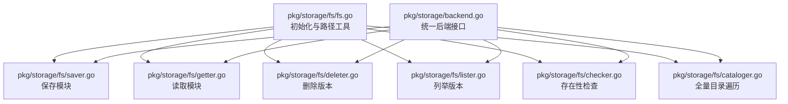
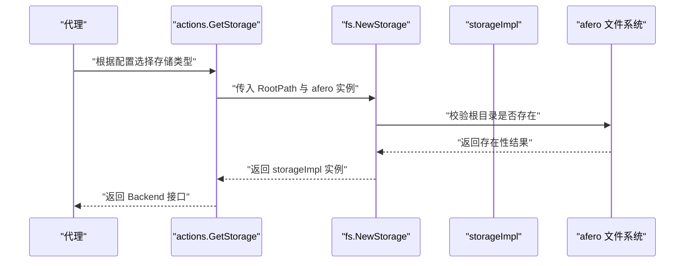
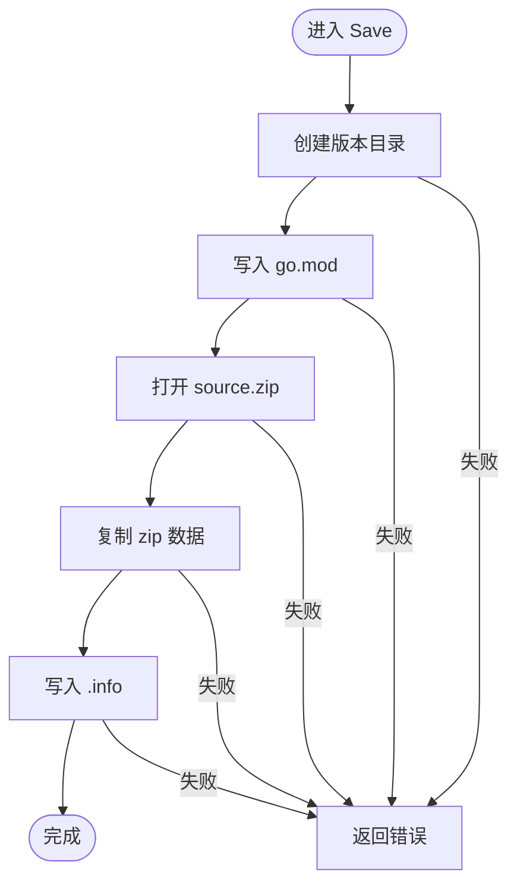
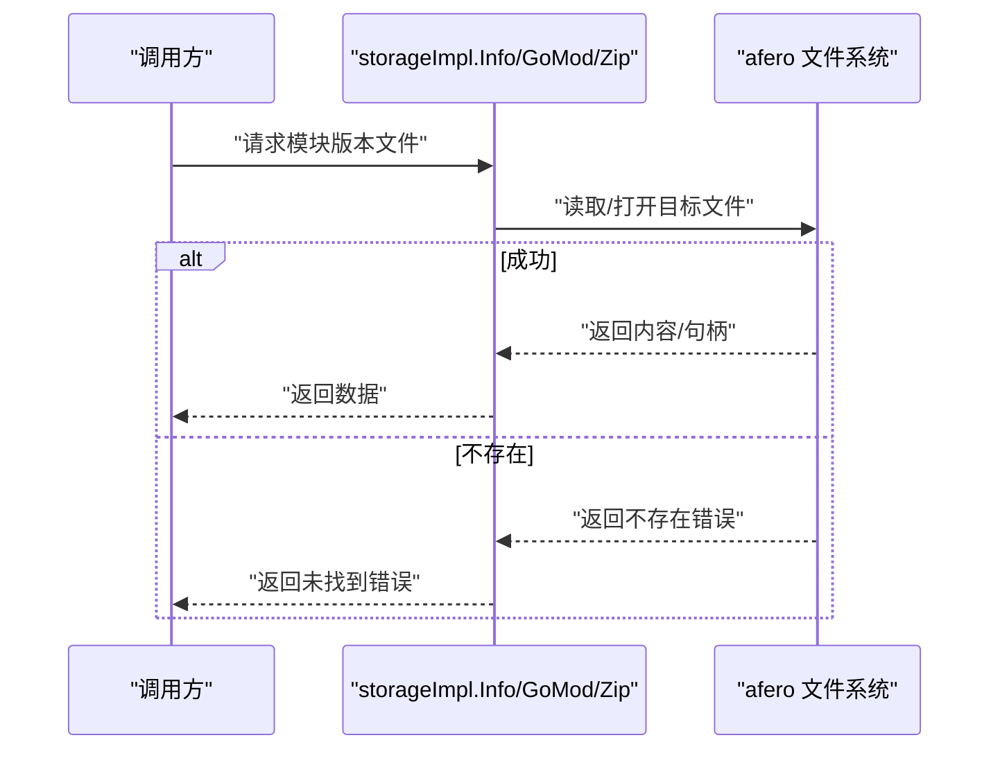
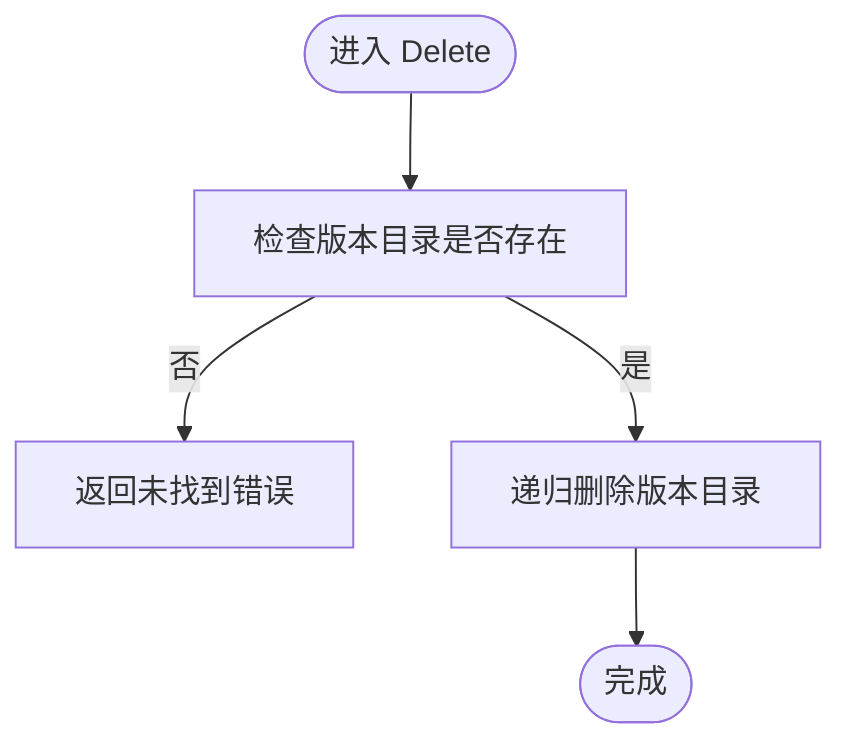
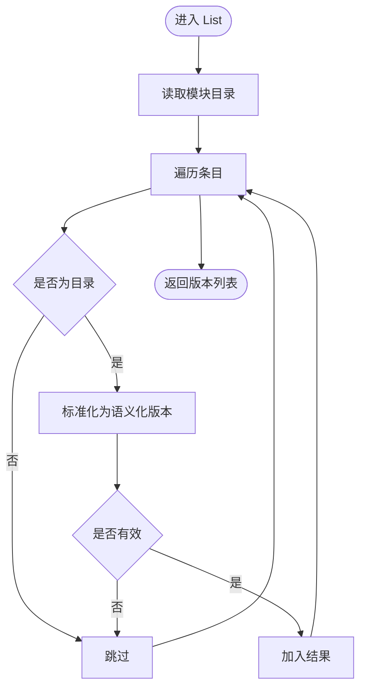
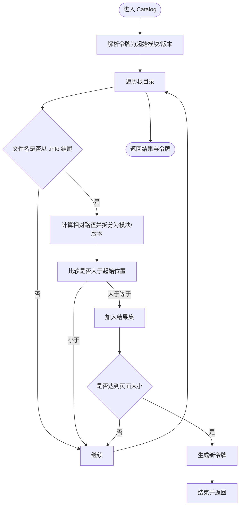
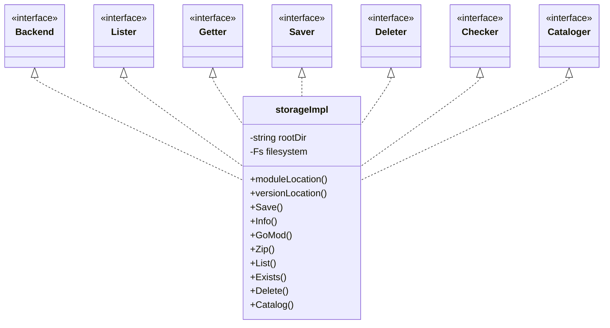

# 文件系统存储

<cite>
**本文引用的文件**
- [pkg/storage/fs/fs.go](file://pkg/storage/fs/fs.go)
- [pkg/storage/fs/saver.go](file://pkg/storage/fs/saver.go)
- [pkg/storage/fs/getter.go](file://pkg/storage/fs/getter.go)
- [pkg/storage/fs/deleter.go](file://pkg/storage/fs/deleter.go)
- [pkg/storage/fs/lister.go](file://pkg/storage/fs/lister.go)
- [pkg/storage/fs/checker.go](file://pkg/storage/fs/checker.go)
- [pkg/storage/fs/cataloger.go](file://pkg/storage/fs/cataloger.go)
- [pkg/storage/backend.go](file://pkg/storage/backend.go)
- [pkg/config/disk.go](file://pkg/config/disk.go)
- [cmd/proxy/actions/storage.go](file://cmd/proxy/actions/storage.go)
- [docs/content/configuration/storage.md](file://docs/content/configuration/storage.md)
- [pkg/storage/fs/fs_test.go](file://pkg/storage/fs/fs_test.go)
- [pkg/paths/path.go](file://pkg/paths/path.go)
</cite>

## 目录
1. [简介](#简介)
2. [项目结构](#项目结构)
3. [核心组件](#核心组件)
4. [架构总览](#架构总览)
5. [组件详解](#组件详解)
6. [依赖关系分析](#依赖关系分析)
7. [性能与优化](#性能与优化)
8. [故障排查指南](#故障排查指南)
9. [结论](#结论)
10. [附录](#附录)

## 简介
本文件系统存储（Disk Storage）实现基于本地文件系统，使用统一根目录存放模块版本数据。它通过 afero 抽象层屏蔽不同平台差异，支持在真实文件系统或内存文件系统上运行。该实现遵循统一的存储接口，提供保存、读取、删除、列举、存在性检查与全量目录遍历（Catalog）能力，并在创建目录与文件时应用合理的权限掩码以避免过度放权。

## 项目结构
文件系统存储位于 pkg/storage/fs 下，采用按职责分层的文件组织方式：
- fs.go：后端初始化与基础路径计算
- saver.go：保存模块（go.mod、source.zip、.info）
- getter.go：读取 info、go.mod、zip
- deleter.go：删除指定版本
- lister.go：列出模块下的版本目录
- checker.go：检查版本目录是否完整
- cataloger.go：遍历所有模块与版本，支持分页令牌

图表来源
- [pkg/storage/fs/fs.go](file://pkg/storage/fs/fs.go#L1-L47)
- [pkg/storage/fs/saver.go](file://pkg/storage/fs/saver.go#L1-L52)
- [pkg/storage/fs/getter.go](file://pkg/storage/fs/getter.go#L1-L56)
- [pkg/storage/fs/deleter.go](file://pkg/storage/fs/deleter.go#L1-L25)
- [pkg/storage/fs/lister.go](file://pkg/storage/fs/lister.go#L1-L39)
- [pkg/storage/fs/checker.go](file://pkg/storage/fs/checker.go#L1-L28)
- [pkg/storage/fs/cataloger.go](file://pkg/storage/fs/cataloger.go#L1-L85)
- [pkg/storage/backend.go](file://pkg/storage/backend.go#L1-L10)

章节来源
- [pkg/storage/fs/fs.go](file://pkg/storage/fs/fs.go#L1-L47)
- [pkg/storage/backend.go](file://pkg/storage/backend.go#L1-L10)

## 核心组件
- 存储实现结构体 storageImpl：持有根目录与 afero 文件系统实例，提供路径拼接与目录清理等能力
- 接口适配：实现 Backend（Lister、Getter、Saver、Deleter），满足统一抽象
- 配置入口：通过 cmd/proxy/actions/storage.go 的 GetStorage 在“disk”类型下创建文件系统存储
- 配置结构：DiskConfig.RootPath 指定根目录，支持环境变量覆盖

章节来源
- [pkg/storage/fs/fs.go](file://pkg/storage/fs/fs.go#L13-L47)
- [pkg/storage/backend.go](file://pkg/storage/backend.go#L3-L9)
- [cmd/proxy/actions/storage.go](file://cmd/proxy/actions/storage.go#L24-L77)
- [pkg/config/disk.go](file://pkg/config/disk.go#L3-L7)

## 架构总览
文件系统存储在运行时由代理根据配置选择并注入到服务中。保存流程涉及创建版本目录、写入 go.mod、写入 source.zip、写入 .info；读取流程分别从版本目录读取对应文件；删除流程校验存在性后移除版本目录；列举与存在性检查基于目录项判断；Catalog 通过遍历根目录收集所有模块与版本。

图表来源
- [cmd/proxy/actions/storage.go](file://cmd/proxy/actions/storage.go#L24-L77)
- [pkg/storage/fs/fs.go](file://pkg/storage/fs/fs.go#L29-L39)

## 组件详解

### 目录结构与命名规则
- 根目录：由配置 DiskConfig.RootPath 指定
- 模块目录：模块名作为子目录名
- 版本目录：模块目录下按版本号为子目录名
- 文件命名：
  - go.mod：模块元数据文件
  - source.zip：源码压缩包
  - {version}.info：版本信息文件
- 路径拼接：使用 filepath.Join 保证跨平台兼容

章节来源
- [pkg/storage/fs/fs.go](file://pkg/storage/fs/fs.go#L18-L24)
- [pkg/storage/fs/saver.go](file://pkg/storage/fs/saver.go#L14-L51)
- [pkg/storage/fs/getter.go](file://pkg/storage/fs/getter.go#L14-L55)
- [pkg/storage/fs/lister.go](file://pkg/storage/fs/lister.go#L14-L38)

### 权限管理与安全
- 创建目录与文件时使用 0777/0666 权限掩码，最终权限受进程 umask 影响
- 说明：注释明确指出 umask 会从上述模式中扣除，从而避免默认开放世界可读写
- 建议：在生产环境中通过系统 umask 控制最小必要权限

章节来源
- [pkg/storage/fs/saver.go](file://pkg/storage/fs/saver.go#L20-L27)
- [pkg/storage/fs/saver.go](file://pkg/storage/fs/saver.go#L30-L32)
- [pkg/storage/fs/saver.go](file://pkg/storage/fs/saver.go#L35-L43)
- [pkg/storage/fs/saver.go](file://pkg/storage/fs/saver.go#L46-L49)

### 保存（Save）
- 步骤：
  1) 计算版本目录路径
  2) 创建版本目录（0777）
  3) 写入 go.mod（0666）
  4) 打开 source.zip 并流式复制 zip Reader（0666）
  5) 写入 {version}.info（0666）
- 错误处理：任何阶段失败均包装错误并附带模块与版本上下文

图表来源
- [pkg/storage/fs/saver.go](file://pkg/storage/fs/saver.go#L14-L51)

章节来源
- [pkg/storage/fs/saver.go](file://pkg/storage/fs/saver.go#L14-L51)

### 读取（Info/GoMod/Zip）
- Info：读取 {version}.info
- GoMod：读取 go.mod
- Zip：打开 source.zip 并返回带大小的读取器
- 错误处理：若文件不存在，返回“未找到”类错误并附带模块与版本

图表来源
- [pkg/storage/fs/getter.go](file://pkg/storage/fs/getter.go#L14-L55)

章节来源
- [pkg/storage/fs/getter.go](file://pkg/storage/fs/getter.go#L14-L55)

### 删除（Delete）
- 先检查版本目录是否存在
- 若不存在则返回“未找到”
- 否则递归删除版本目录

图表来源
- [pkg/storage/fs/deleter.go](file://pkg/storage/fs/deleter.go#L10-L25)

章节来源
- [pkg/storage/fs/deleter.go](file://pkg/storage/fs/deleter.go#L10-L25)

### 列举（List）
- 读取模块目录下的条目
- 过滤出子目录且为语义化版本（semver）规范形式
- 返回版本字符串列表

图表来源
- [pkg/storage/fs/lister.go](file://pkg/storage/fs/lister.go#L14-L38)

章节来源
- [pkg/storage/fs/lister.go](file://pkg/storage/fs/lister.go#L14-L38)

### 存在性检查（Exists）
- 读取版本目录条目数，要求恰好为 3（go.mod、source.zip、.info）
- 若目录不存在或读取失败，按错误处理逻辑返回

章节来源
- [pkg/storage/fs/checker.go](file://pkg/storage/fs/checker.go#L12-L27)

### 目录遍历（Catalog）
- 使用 afero.Walk 遍历根目录
- 仅收集以 .info 结尾的文件，解析其父目录为模块与版本
- 支持分页令牌（token），格式为 “module|version”
- 跳过小于起始位置的模块/版本，达到页面大小后生成新的令牌

图表来源
- [pkg/storage/fs/cataloger.go](file://pkg/storage/fs/cataloger.go#L20-L85)

章节来源
- [pkg/storage/fs/cataloger.go](file://pkg/storage/fs/cataloger.go#L20-L85)

### 配置与集成
- 配置结构：DiskConfig.RootPath 必填，可通过环境变量 ATHENS_DISK_STORAGE_ROOT 设置
- 代理集成：GetStorage 在 storageType 为 "disk" 时，使用 afero.NewOsFs() 创建文件系统存储
- 文档说明：配置文档提供 TOML 与环境变量两种设置方式

章节来源
- [pkg/config/disk.go](file://pkg/config/disk.go#L3-L7)
- [cmd/proxy/actions/storage.go](file://cmd/proxy/actions/storage.go#L35-L45)
- [docs/content/configuration/storage.md](file://docs/content/configuration/storage.md#L53-L70)

## 依赖关系分析
- storageImpl 实现 Backend 接口（Lister、Getter、Saver、Deleter）
- 保存/读取/删除/列举/存在性检查/目录遍历均依赖 afero 文件系统
- Catalog 依赖路径参数结构 AllPathParams（来自 pkg/paths）

图表来源
- [pkg/storage/backend.go](file://pkg/storage/backend.go#L3-L9)
- [pkg/storage/fs/fs.go](file://pkg/storage/fs/fs.go#L13-L24)
- [pkg/storage/fs/saver.go](file://pkg/storage/fs/saver.go#L14-L51)
- [pkg/storage/fs/getter.go](file://pkg/storage/fs/getter.go#L14-L55)
- [pkg/storage/fs/deleter.go](file://pkg/storage/fs/deleter.go#L10-L25)
- [pkg/storage/fs/lister.go](file://pkg/storage/fs/lister.go#L14-L38)
- [pkg/storage/fs/checker.go](file://pkg/storage/fs/checker.go#L12-L27)
- [pkg/storage/fs/cataloger.go](file://pkg/storage/fs/cataloger.go#L18-L20)

## 性能与优化
- 流式写入：保存 zip 时使用 io.Copy，避免一次性加载到内存
- 目录与文件权限：使用较小权限掩码并在 umask 下收敛，减少不必要的开放
- 列表与存在性：通过目录项直接判断，避免额外解析成本
- 测试基准：提供针对 OS 文件系统与内存文件系统的基准测试入口，便于评估性能

章节来源
- [pkg/storage/fs/saver.go](file://pkg/storage/fs/saver.go#L35-L43)
- [pkg/storage/fs/lister.go](file://pkg/storage/fs/lister.go#L14-L38)
- [pkg/storage/fs/checker.go](file://pkg/storage/fs/checker.go#L12-L27)
- [pkg/storage/fs/fs_test.go](file://pkg/storage/fs/fs_test.go#L18-L28)

## 故障排查指南
- 根目录不存在：NewStorage 会在根目录不存在时返回错误，检查配置与挂载
- 文件不存在：Info/GoMod/Zip 在读取失败时返回“未找到”，确认保存流程是否成功
- 删除失败：Delete 会先 Exists 校验，若目录不完整或不存在会返回相应错误
- 列表为空：List 对于不存在的模块目录返回空列表，确认模块是否已保存
- Catalog 分页异常：检查令牌格式（module|version）与起始位置比较逻辑

章节来源
- [pkg/storage/fs/fs.go](file://pkg/storage/fs/fs.go#L30-L38)
- [pkg/storage/fs/getter.go](file://pkg/storage/fs/getter.go#L14-L25)
- [pkg/storage/fs/deleter.go](file://pkg/storage/fs/deleter.go#L10-L25)
- [pkg/storage/fs/lister.go](file://pkg/storage/fs/lister.go#L14-L26)
- [pkg/storage/fs/cataloger.go](file://pkg/storage/fs/cataloger.go#L20-L28)

## 结论
文件系统存储通过清晰的目录结构与稳定的接口抽象，提供了可靠的模块版本持久化能力。其权限控制与流式写入策略兼顾了安全性与性能。配合代理配置与文档，可在多种部署场景中稳定运行。

## 附录

### 配置选项与示例
- 存储类型：disk
- 根路径：DiskConfig.RootPath 或环境变量 ATHENS_DISK_STORAGE_ROOT
- 代理配置入口：GetStorage 在 storageType 为 "disk" 时启用

章节来源
- [docs/content/configuration/storage.md](file://docs/content/configuration/storage.md#L53-L70)
- [pkg/config/disk.go](file://pkg/config/disk.go#L3-L7)
- [cmd/proxy/actions/storage.go](file://cmd/proxy/actions/storage.go#L35-L45)

### 目录结构速查
- 根目录：由配置指定
- 模块目录：{root}/{module}
- 版本目录：{root}/{module}/{version}
- 文件：go.mod、source.zip、{version}.info

章节来源
- [pkg/storage/fs/fs.go](file://pkg/storage/fs/fs.go#L18-L24)
- [pkg/storage/fs/saver.go](file://pkg/storage/fs/saver.go#L14-L51)
- [pkg/storage/fs/getter.go](file://pkg/storage/fs/getter.go#L14-L55)

### 路径参数与令牌
- 路径参数：AllPathParams（module、version）
- Catalog 令牌：module|version

章节来源
- [pkg/paths/path.go](file://pkg/paths/path.go#L33-L54)
- [pkg/storage/fs/cataloger.go](file://pkg/storage/fs/cataloger.go#L70-L84)