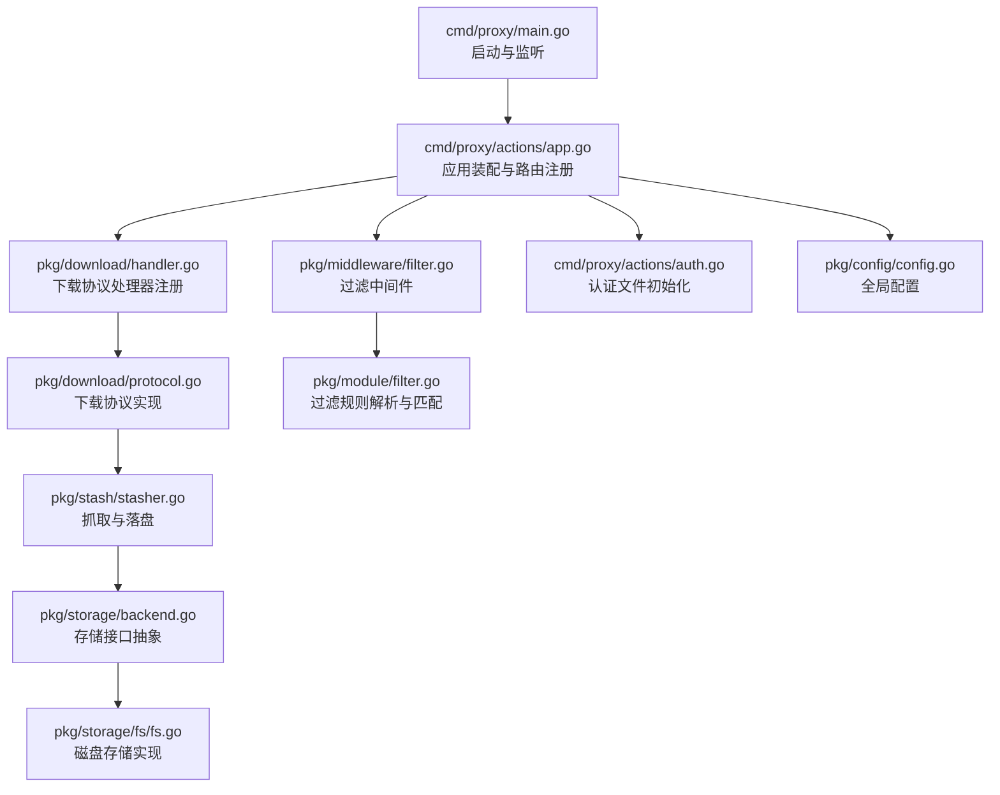
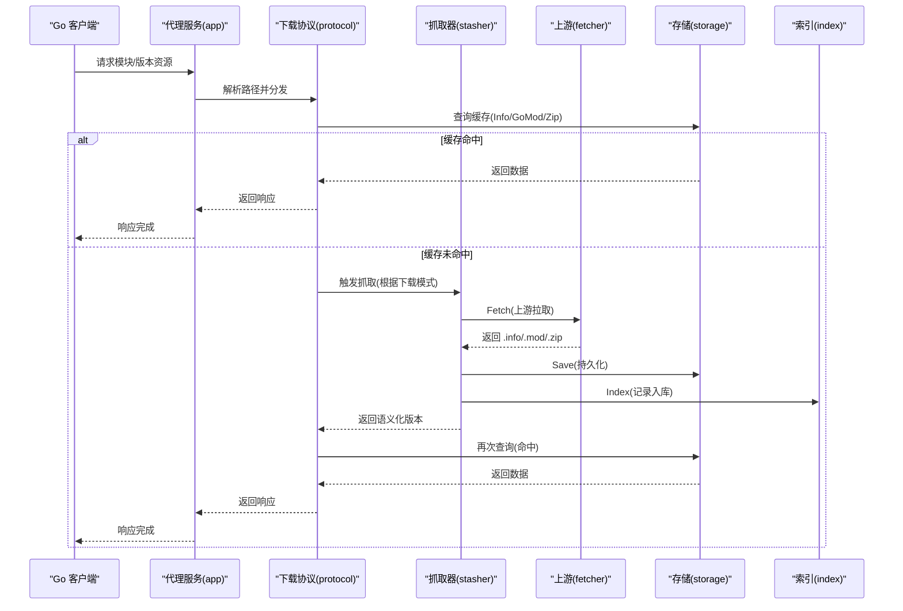
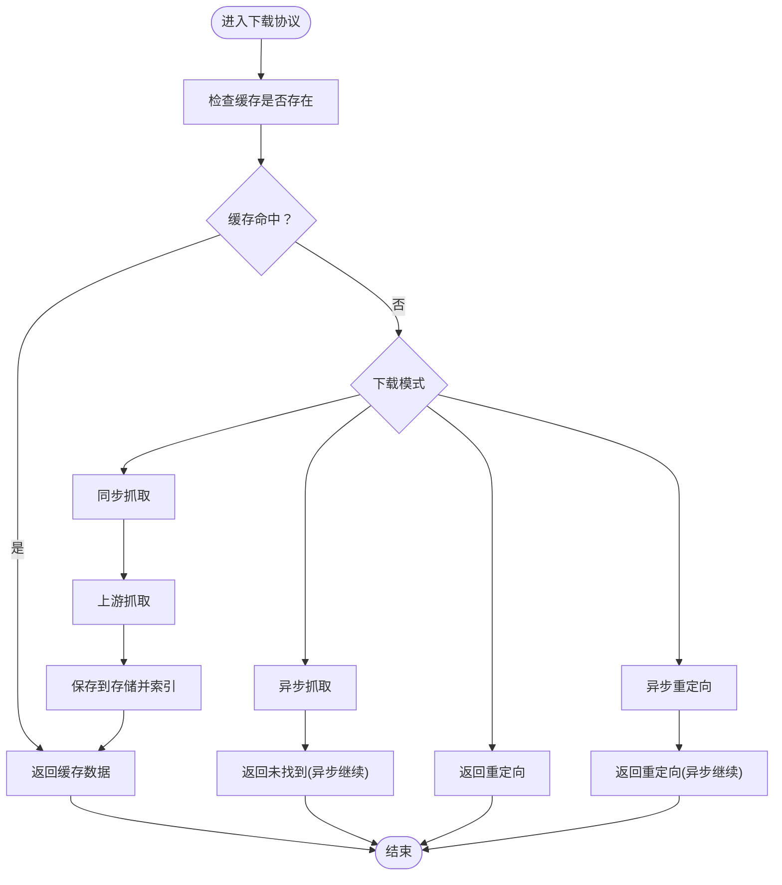
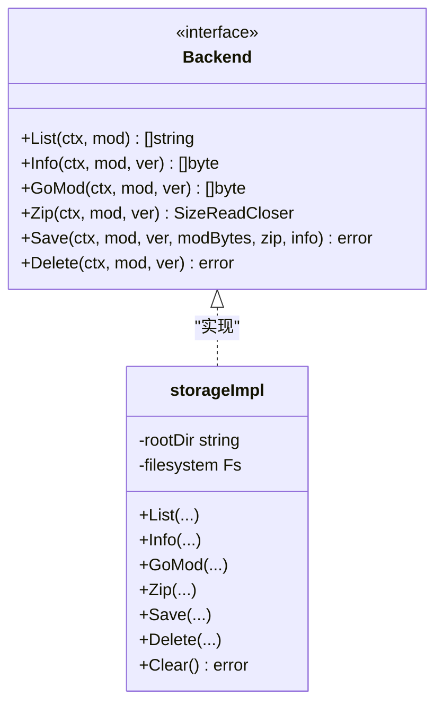
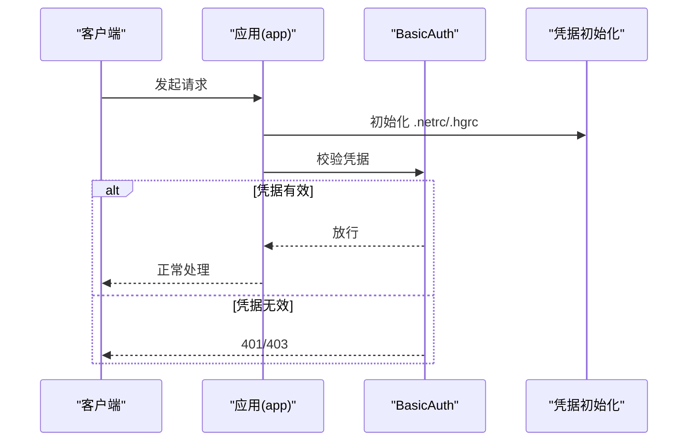
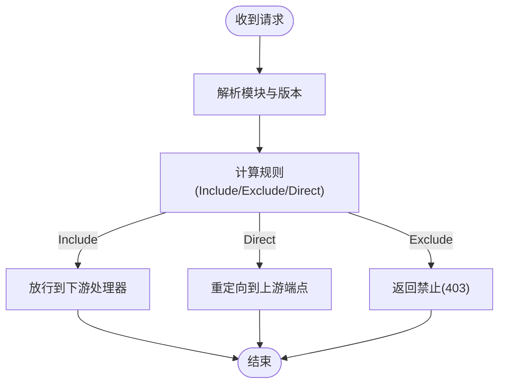
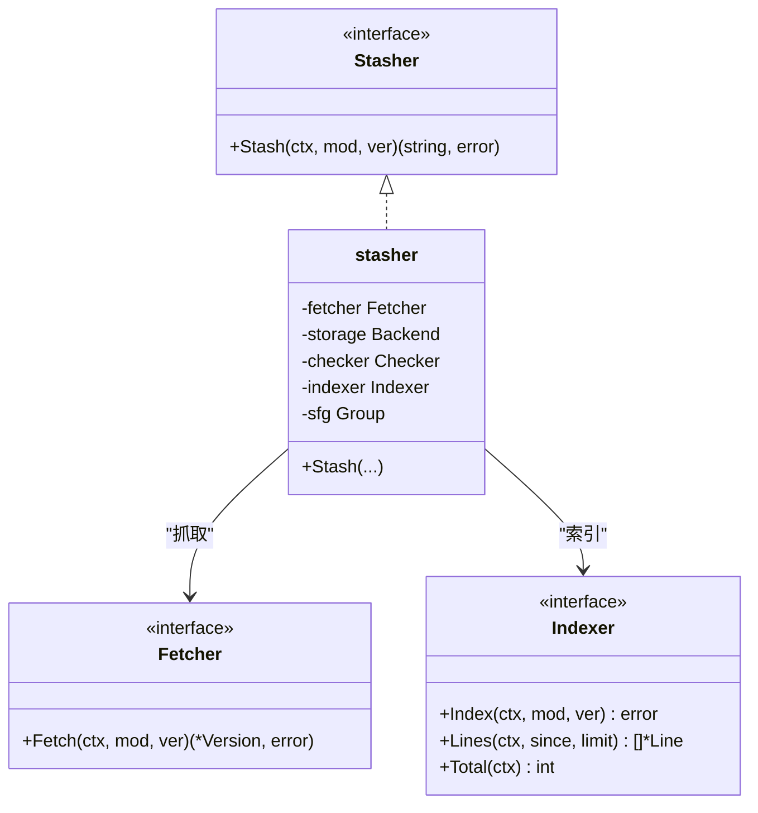
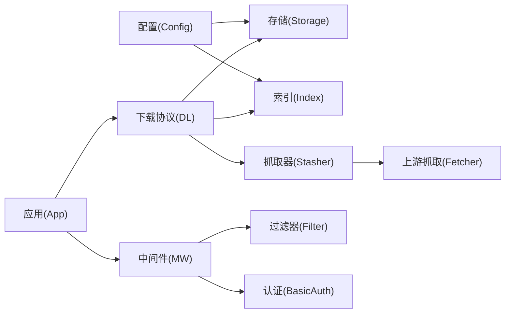

# 核心功能

<cite>
**本文引用的文件**
- [cmd/proxy/main.go](file://cmd/proxy/main.go)
- [cmd/proxy/actions/app.go](file://cmd/proxy/actions/app.go)
- [cmd/proxy/actions/auth.go](file://cmd/proxy/actions/auth.go)
- [pkg/config/config.go](file://pkg/config/config.go)
- [pkg/config/storage.go](file://pkg/config/storage.go)
- [pkg/config/index.go](file://pkg/config/index.go)
- [pkg/download/handler.go](file://pkg/download/handler.go)
- [pkg/download/protocol.go](file://pkg/download/protocol.go)
- [pkg/storage/backend.go](file://pkg/storage/backend.go)
- [pkg/storage/fs/fs.go](file://pkg/storage/fs/fs.go)
- [pkg/module/filter.go](file://pkg/module/filter.go)
- [pkg/middleware/filter.go](file://pkg/middleware/filter.go)
- [pkg/stash/stasher.go](file://pkg/stash/stasher.go)
- [pkg/index/indexer.go](file://pkg/index/indexer.go)
- [pkg/module/fetcher.go](file://pkg/module/fetcher.go)
</cite>

## 目录
1. [简介](#简介)
2. [项目结构](#项目结构)
3. [核心组件](#核心组件)
4. [架构总览](#架构总览)
5. [详细组件分析](#详细组件分析)
6. [依赖分析](#依赖分析)
7. [性能考虑](#性能考虑)
8. [故障排查指南](#故障排查指南)
9. [结论](#结论)
10. [附录](#附录)

## 简介
本文件面向 Athens 的核心功能模块，系统化梳理模块代理服务、存储系统、认证授权与内容过滤等关键子系统的设计原理、实现机制与相互关系。文档同时提供配置项说明、API 使用场景、最佳实践、性能与扩展性建议以及安全机制说明，帮助不同层次的读者快速掌握并高效使用。

## 项目结构
- 入口与启动：命令行入口负责加载配置、初始化日志、构建 HTTP 处理器并启动服务。
- 应用装配：应用层组装路由、中间件（认证、过滤、日志、统计、追踪）、存储与索引后端，并挂载下载协议处理器。
- 协议与下载：下载协议适配 Go 命令的下载流程，支持同步/异步/重定向等模式；通过 Stasher 从上游抓取并落盘，结合存储与索引。
- 存储与索引：统一的存储接口抽象多种后端（内存、磁盘、S3/GCS/Azure/Mongo 等）；索引用于记录模块版本入库信息。
- 过滤与认证：基于规则的模块内容过滤；支持 BasicAuth、.netrc/.hgrc 私有仓库访问与令牌注入。

**图示来源**
- [cmd/proxy/main.go](file://cmd/proxy/main.go#L29-L127)
- [cmd/proxy/actions/app.go](file://cmd/proxy/actions/app.go#L23-L138)
- [pkg/download/handler.go](file://pkg/download/handler.go#L39-L57)
- [pkg/download/protocol.go](file://pkg/download/protocol.go#L58-L73)
- [pkg/stash/stasher.go](file://pkg/stash/stasher.go#L29-L39)
- [pkg/storage/backend.go](file://pkg/storage/backend.go#L3-L9)
- [pkg/storage/fs/fs.go](file://pkg/storage/fs/fs.go#L26-L39)
- [pkg/middleware/filter.go](file://pkg/middleware/filter.go#L13-L48)
- [pkg/module/filter.go](file://pkg/module/filter.go#L24-L46)
- [cmd/proxy/actions/auth.go](file://cmd/proxy/actions/auth.go#L13-L38)
- [pkg/config/config.go](file://pkg/config/config.go#L21-L66)

**章节来源**
- [cmd/proxy/main.go](file://cmd/proxy/main.go#L29-L127)
- [cmd/proxy/actions/app.go](file://cmd/proxy/actions/app.go#L23-L138)

## 核心组件
- 模块代理服务
  - 负责接收来自 Go 工具链的下载请求，按模块/版本返回 .info、go.mod、.zip 等资源。
  - 支持严格/离线/回退三种网络模式，保证行为一致性与可用性。
- 存储系统
  - 统一的 Backend 接口抽象，屏蔽底层实现差异；提供 List/Info/GoMod/Zip/Save/Delete 等能力。
  - 内置磁盘实现，亦可扩展至 S3/GCS/Azure/Mongo 等云存储或数据库。
- 认证授权
  - 支持 BasicAuth；支持通过 .netrc/.hgrc 或 GitHub Token 注入私有仓库凭据。
  - 可强制 HTTPS 重定向，增强传输安全。
- 内容过滤
  - 基于规则文件的模块白/黑名单与直连上游策略；支持按版本限定匹配。
- 索引与统计
  - 记录模块版本入库元数据，配合统计导出器（如 Prometheus）进行可观测性。

**章节来源**
- [pkg/download/protocol.go](file://pkg/download/protocol.go#L20-L37)
- [pkg/storage/backend.go](file://pkg/storage/backend.go#L3-L9)
- [pkg/middleware/filter.go](file://pkg/middleware/filter.go#L13-L48)
- [pkg/config/config.go](file://pkg/config/config.go#L21-L66)

## 架构总览
下图展示从客户端到存储与索引的整体调用链路，突出下载协议、抓取器、存储与索引之间的协作关系。

**图示来源**
- [pkg/download/protocol.go](file://pkg/download/protocol.go#L199-L279)
- [pkg/stash/stasher.go](file://pkg/stash/stasher.go#L49-L93)
- [pkg/module/fetcher.go](file://pkg/module/fetcher.go#L9-L14)
- [pkg/storage/backend.go](file://pkg/storage/backend.go#L3-L9)
- [pkg/index/indexer.go](file://pkg/index/indexer.go#L15-L29)

## 详细组件分析

### 模块代理服务
- 设计要点
  - 下载协议与 HTTP 路由解耦，通过处理器注册统一接入 Gorilla Mux。
  - 支持多种下载模式（同步/异步/重定向），以适配不同网络与性能需求。
  - 严格/离线/回退三种网络模式，保障在上游不可用时的行为稳定性。
- 关键流程
  - 列表/最新/信息/模块/压缩包五类端点分别对应 List/Latest/Info/GoMod/Zip。
  - 未命中缓存时，依据下载模式选择抓取或直接返回重定向。
- 最佳实践
  - 在公网部署时启用 Strict 模式以避免不稳定结果；内网或离线环境可选 Offline/Fallback。
  - 对大体积模块优先采用异步抓取，避免阻塞请求线程。

**图示来源**
- [pkg/download/protocol.go](file://pkg/download/protocol.go#L253-L279)

**章节来源**
- [pkg/download/handler.go](file://pkg/download/handler.go#L39-L57)
- [pkg/download/protocol.go](file://pkg/download/protocol.go#L51-L56)
- [pkg/download/protocol.go](file://pkg/download/protocol.go#L83-L166)
- [pkg/download/protocol.go](file://pkg/download/protocol.go#L182-L197)
- [pkg/download/protocol.go](file://pkg/download/protocol.go#L199-L232)
- [pkg/download/protocol.go](file://pkg/download/protocol.go#L234-L251)

### 存储系统
- 设计要点
  - Backend 接口聚合 Lister/Getter/Saver/Deleter，统一多后端能力。
  - 磁盘实现提供目录结构化存储与清空重建能力。
- 扩展性
  - 通过配置驱动选择存储类型，便于替换为云存储或数据库后端。
- 最佳实践
  - 生产环境建议使用分布式对象存储或数据库存储，结合备份与只读副本提升可靠性。

**图示来源**
- [pkg/storage/backend.go](file://pkg/storage/backend.go#L3-L9)
- [pkg/storage/fs/fs.go](file://pkg/storage/fs/fs.go#L13-L39)

**章节来源**
- [pkg/storage/backend.go](file://pkg/storage/backend.go#L3-L9)
- [pkg/storage/fs/fs.go](file://pkg/storage/fs/fs.go#L26-L39)
- [pkg/config/storage.go](file://pkg/config/storage.go#L3-L12)

### 认证授权
- 设计要点
  - BasicAuth 中间件按配置启用；支持强制 HTTPS。
  - 通过 .netrc/.hgrc 文件或 GitHub Token 自动注入私有仓库访问凭据。
- 安全建议
  - 生产环境务必启用 HTTPS 并限制 BasicAuth 用户范围。
  - 凭据文件权限需严格控制，避免泄露。

**图示来源**
- [cmd/proxy/actions/app.go](file://cmd/proxy/actions/app.go#L95-L99)
- [cmd/proxy/actions/app.go](file://cmd/proxy/actions/app.go#L24-L44)
- [cmd/proxy/actions/auth.go](file://cmd/proxy/actions/auth.go#L13-L38)

**章节来源**
- [cmd/proxy/actions/app.go](file://cmd/proxy/actions/app.go#L95-L99)
- [cmd/proxy/actions/app.go](file://cmd/proxy/actions/app.go#L24-L44)
- [cmd/proxy/actions/auth.go](file://cmd/proxy/actions/auth.go#L13-L38)

### 内容过滤
- 设计要点
  - 基于规则文件的 Include/Exclude/Direct 三态策略；支持按版本限定匹配。
  - 过滤中间件在请求进入路由前生效，未命中的模块按全局上游直连策略处理。
- 配置示例
  - 规则文件中以“+/-/D”开头，支持路径与版本限定表达式。
- 最佳实践
  - 将敏感模块排除在缓存之外，仅允许直连上游；对内部模块开放 Include。

**图示来源**
- [pkg/middleware/filter.go](file://pkg/middleware/filter.go#L13-L48)
- [pkg/module/filter.go](file://pkg/module/filter.go#L24-L46)

**章节来源**
- [pkg/middleware/filter.go](file://pkg/middleware/filter.go#L13-L48)
- [pkg/module/filter.go](file://pkg/module/filter.go#L24-L46)
- [pkg/module/filter.go](file://pkg/module/filter.go#L134-L193)
- [pkg/module/filter.go](file://pkg/module/filter.go#L195-L261)

### 抓取与索引
- 设计要点
  - Stasher 负责从上游 Fetch 模块，去重并发抓取，保存到存储并写入索引。
  - 支持 SingleFlight 避免重复抓取同一模块/版本。
- 与下载协议的协作
  - 下载协议在缓存未命中时触发抓取流程，随后返回语义化版本的数据。

**图示来源**
- [pkg/stash/stasher.go](file://pkg/stash/stasher.go#L17-L39)
- [pkg/stash/stasher.go](file://pkg/stash/stasher.go#L41-L47)
- [pkg/module/fetcher.go](file://pkg/module/fetcher.go#L9-L14)
- [pkg/index/indexer.go](file://pkg/index/indexer.go#L15-L29)

**章节来源**
- [pkg/stash/stasher.go](file://pkg/stash/stasher.go#L49-L93)
- [pkg/download/protocol.go](file://pkg/download/protocol.go#L253-L279)

## 依赖分析
- 组件耦合
  - 下载协议依赖存储与索引；抓取器与上游列表器共同决定数据来源。
  - 应用层通过配置驱动选择存储与索引类型，降低耦合度。
- 外部依赖
  - 日志、追踪与统计导出器通过中间件集成，便于替换与扩展。
- 循环依赖
  - 当前结构清晰，未发现循环依赖迹象。

**图示来源**
- [pkg/config/config.go](file://pkg/config/config.go#L21-L66)
- [cmd/proxy/actions/app.go](file://cmd/proxy/actions/app.go#L119-L131)
- [pkg/download/protocol.go](file://pkg/download/protocol.go#L42-L49)
- [pkg/stash/stasher.go](file://pkg/stash/stasher.go#L32-L39)
- [pkg/module/fetcher.go](file://pkg/module/fetcher.go#L9-L14)
- [pkg/middleware/filter.go](file://pkg/middleware/filter.go#L13-L15)

**章节来源**
- [pkg/config/config.go](file://pkg/config/config.go#L282-L297)
- [pkg/config/config.go](file://pkg/config/config.go#L299-L333)

## 性能考虑
- 并发与去重
  - 使用 SingleFlight 避免对同一模块/版本的重复抓取，显著降低上游压力与存储抖动。
- 异步抓取
  - 异步模式在缓存缺失时立即返回“未找到”，后台继续抓取，提升吞吐量。
- 网络模式
  - Strict 模式在上游异常时失败，保证一致性；Fallback 在上游不可用时回退缓存，提高可用性。
- 缓存与清理
  - 磁盘存储支持清空重建，便于维护与灾备恢复。
- 监控与追踪
  - 集成统计导出器与追踪导出器，便于定位热点与瓶颈。

**章节来源**
- [pkg/stash/stasher.go](file://pkg/stash/stasher.go#L55-L83)
- [pkg/download/protocol.go](file://pkg/download/protocol.go#L267-L279)
- [pkg/storage/fs/fs.go](file://pkg/storage/fs/fs.go#L41-L46)

## 故障排查指南
- 启动与监听
  - 若无法监听端口或 Unix Socket，检查端口占用与权限；确认 TLS 配置正确。
- 配置校验
  - 配置文件与环境变量冲突时以环境变量为准；生产环境需校验文件权限。
- 下载失败
  - 检查网络模式与上游可达性；查看抓取器返回的错误类型（仓库不存在/版本不存在等）。
- 过滤误判
  - 核对规则文件语法与路径匹配；确认版本限定表达式是否符合预期。
- 认证问题
  - 确认 BasicAuth 用户名/密码；检查 .netrc/.hgrc 是否成功写入并具备正确权限。

**章节来源**
- [cmd/proxy/main.go](file://cmd/proxy/main.go#L79-L98)
- [pkg/config/config.go](file://pkg/config/config.go#L242-L253)
- [pkg/config/config.go](file://pkg/config/config.go#L256-L273)
- [pkg/download/protocol.go](file://pkg/download/protocol.go#L130-L149)
- [pkg/middleware/filter.go](file://pkg/middleware/filter.go#L17-L47)
- [cmd/proxy/actions/auth.go](file://cmd/proxy/actions/auth.go#L33-L35)

## 结论
Athens 的核心围绕“下载协议 + 抓取器 + 存储 + 索引 + 中间件”的清晰分层展开。通过可插拔的存储与索引后端、灵活的下载模式与网络策略、完善的认证与过滤机制，既能满足开发与测试场景，也能支撑生产级的高可用与可观测性需求。建议在生产环境中结合监控、限流与备份策略，持续优化性能与稳定性。

## 附录

### 配置选项总览（节选）
- 通用
  - 日志级别与格式、统计导出器、追踪导出器、pprof 开关与端口、优雅停机超时。
- 存储
  - 存储类型与具体后端配置（磁盘/云存储/数据库等）。
- 索引
  - 索引类型与数据库连接参数。
- 下载
  - 下载模式、下载 URL、网络模式（strict/offline/fallback）。
- 认证与过滤
  - BasicAuth 用户/密码、过滤文件路径、全局上游端点、ForceSSL。
- Git 凭据
  - .netrc/.hgrc 路径、GitHub Token 注入。

**章节来源**
- [pkg/config/config.go](file://pkg/config/config.go#L21-L66)
- [pkg/config/storage.go](file://pkg/config/storage.go#L3-L12)
- [pkg/config/index.go](file://pkg/config/index.go#L3-L7)

### API 接口与使用场景
- 列表/最新/信息/模块/压缩包
  - 场景：Go 工具链自动拉取依赖；代理需正确返回版本列表与模块元数据。
  - 注意：严格模式下上游不可用会失败；回退模式下优先返回缓存。
- 抓取与保存
  - 场景：缓存缺失时触发；支持异步抓取避免阻塞。
- 过滤与重定向
  - 场景：对特定模块执行直连上游或拒绝访问；适用于私有模块或合规要求。

**章节来源**
- [pkg/download/handler.go](file://pkg/download/handler.go#L39-L57)
- [pkg/download/protocol.go](file://pkg/download/protocol.go#L83-L166)
- [pkg/download/protocol.go](file://pkg/download/protocol.go#L182-L197)
- [pkg/download/protocol.go](file://pkg/download/protocol.go#L199-L232)
- [pkg/download/protocol.go](file://pkg/download/protocol.go#L234-L251)
- [pkg/middleware/filter.go](file://pkg/middleware/filter.go#L17-L47)