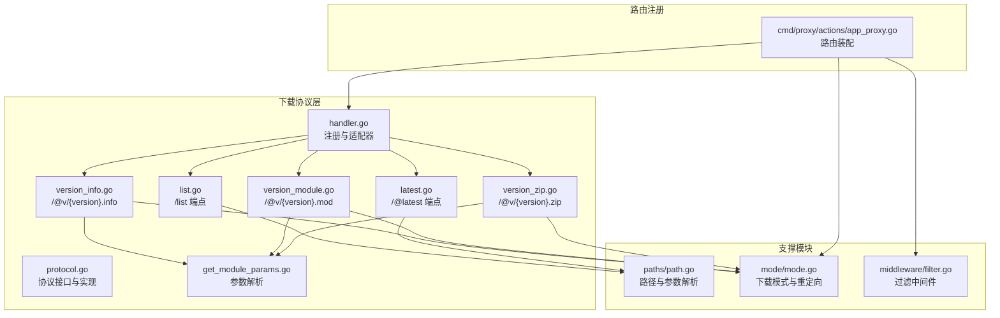
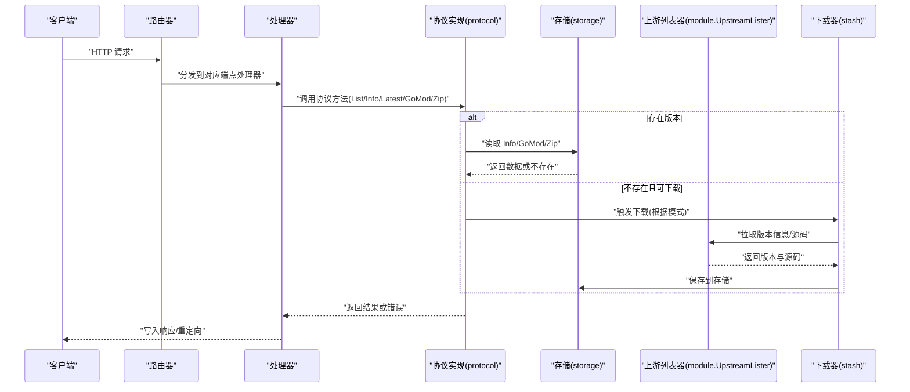
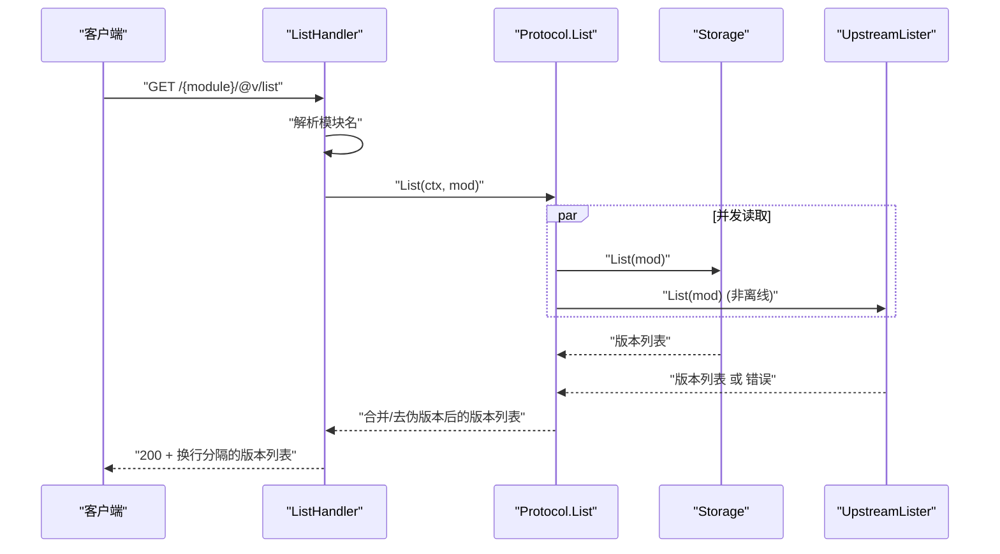
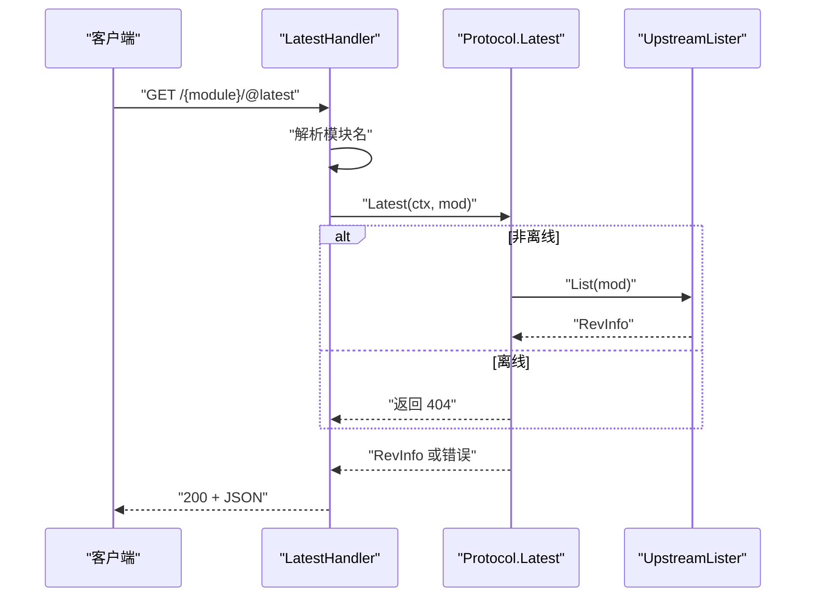
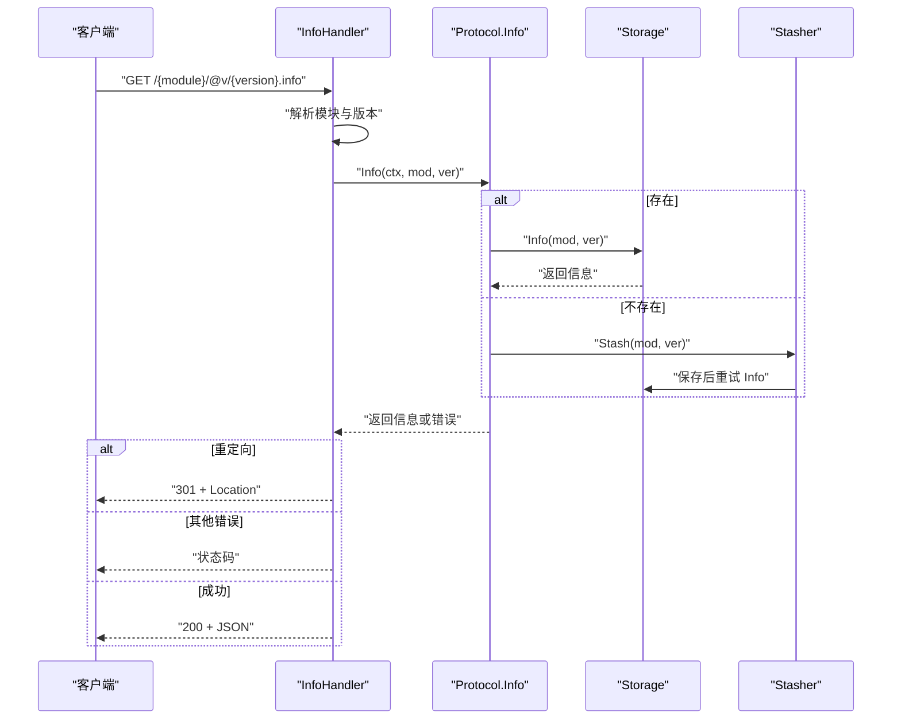
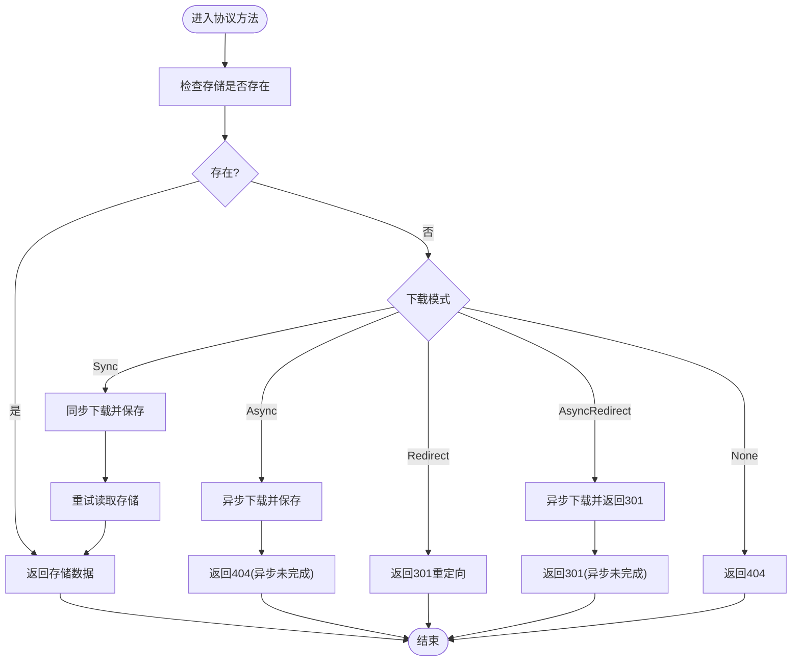
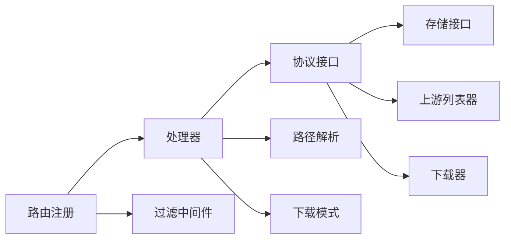

# 下载协议实现

<cite>
**本文引用的文件**
- [pkg/download/handler.go](file://pkg/download/handler.go)
- [pkg/download/protocol.go](file://pkg/download/protocol.go)
- [pkg/download/list.go](file://pkg/download/list.go)
- [pkg/download/latest.go](file://pkg/download/latest.go)
- [pkg/download/version_info.go](file://pkg/download/version_info.go)
- [pkg/download/version_module.go](file://pkg/download/version_module.go)
- [pkg/download/version_zip.go](file://pkg/download/version_zip.go)
- [pkg/download/get_module_params.go](file://pkg/download/get_module_params.go)
- [pkg/paths/path.go](file://pkg/paths/path.go)
- [pkg/download/mode/mode.go](file://pkg/download/mode/mode.go)
- [cmd/proxy/actions/app_proxy.go](file://cmd/proxy/actions/app_proxy.go)
- [pkg/middleware/filter.go](file://pkg/middleware/filter.go)
- [pkg/download/protocol_test.go](file://pkg/download/protocol_test.go)
- [pkg/download/handler_test.go](file://pkg/download/handler_test.go)
- [docs/content/intro/protocol.zh.md](file://docs/content/intro/protocol.zh.md)
</cite>

## 目录
1. [简介](#简介)
2. [项目结构](#项目结构)
3. [核心组件](#核心组件)
4. [架构总览](#架构总览)
5. [详细组件分析](#详细组件分析)
6. [依赖关系分析](#依赖关系分析)
7. [性能考量](#性能考量)
8. [故障排查指南](#故障排查指南)
9. [结论](#结论)
10. [附录](#附录)

## 简介
本文件系统化阐述 Athens 的下载协议实现，重点覆盖 Go Modules 协议规范在 Athens 中的端点映射与实现细节。内容涵盖：
- 协议端点定义与路径匹配规则
- 请求参数解析与 URL 路径处理
- 各端点的请求处理流程与响应格式
- 错误处理与重定向策略
- 与 Go 工具链的兼容性与交互示例
- 性能优化与并发控制要点

## 项目结构
下载协议相关代码主要集中在 pkg/download 目录，配合路径解析、模式配置与路由注册在 cmd/proxy/actions 中完成。

**图表来源**
- [pkg/download/handler.go](file://pkg/download/handler.go#L39-L57)
- [pkg/download/protocol.go](file://pkg/download/protocol.go#L20-L37)
- [pkg/download/list.go](file://pkg/download/list.go#L14-L15)
- [pkg/download/latest.go](file://pkg/download/latest.go#L13-L14)
- [pkg/download/version_info.go](file://pkg/download/version_info.go#L11-L12)
- [pkg/download/version_module.go](file://pkg/download/version_module.go#L11-L12)
- [pkg/download/version_zip.go](file://pkg/download/version_zip.go#L13-L14)
- [pkg/download/get_module_params.go](file://pkg/download/get_module_params.go#L10-L17)
- [pkg/paths/path.go](file://pkg/paths/path.go#L12-L31)
- [pkg/download/mode/mode.go](file://pkg/download/mode/mode.go#L34-L46)
- [cmd/proxy/actions/app_proxy.go](file://cmd/proxy/actions/app_proxy.go#L139-L151)
- [pkg/middleware/filter.go](file://pkg/middleware/filter.go#L13-L48)

**章节来源**
- [pkg/download/handler.go](file://pkg/download/handler.go#L39-L57)
- [cmd/proxy/actions/app_proxy.go](file://cmd/proxy/actions/app_proxy.go#L139-L151)

## 核心组件
- 协议接口与实现
  - 协议接口定义了四个核心方法：List、Info、Latest、GoMod、Zip，分别对应 /list、/@v/{version}.info、/@latest、/@v/{version}.mod、/@v/{version}.zip。
  - 实现类 protocol 组合了存储、上游列表器与下载器，支持严格/离线/回退三种网络模式，并在缺失版本时触发异步或同步下载。
- 路由处理器
  - RegisterHandlers 将各端点注册到路由器，统一设置缓存控制与日志上下文。
  - 各端点处理器负责参数提取、调用协议接口、错误处理与响应写入。
- 参数解析与路径处理
  - GetModule/GetVersion/GetAllParams 提供模块名与版本的解析；DecodePath 支持路径解码。
- 下载模式与重定向
  - DownloadFile 定义 sync/async/redirect/async_redirect/none 五种模式，支持按模块模式匹配与重定向 URL。

**章节来源**
- [pkg/download/protocol.go](file://pkg/download/protocol.go#L20-L37)
- [pkg/download/handler.go](file://pkg/download/handler.go#L39-L57)
- [pkg/paths/path.go](file://pkg/paths/path.go#L12-L31)
- [pkg/download/mode/mode.go](file://pkg/download/mode/mode.go#L16-L29)

## 架构总览
下图展示从 HTTP 请求到协议处理再到存储与上游的完整链路，以及并发与重试策略。

**图表来源**
- [pkg/download/protocol.go](file://pkg/download/protocol.go#L83-L166)
- [pkg/download/protocol.go](file://pkg/download/protocol.go#L199-L251)
- [pkg/download/handler.go](file://pkg/download/handler.go#L39-L57)

## 详细组件分析

### 端点：/list 与 /@v/list
- 路径定义与注册
  - 路径常量 PathList 定义为 "/{module:.+}/@v/list"。
  - RegisterHandlers 注册该路径并应用缓存控制中间件。
- 参数解析与处理
  - 使用 GetModule 解析模块名；若失败返回 500。
  - 调用协议 List，返回版本列表；若为空则返回 404。
- 响应格式
  - 文本换行分隔的版本列表。

**图表来源**
- [pkg/download/list.go](file://pkg/download/list.go#L14-L15)
- [pkg/download/handler.go](file://pkg/download/handler.go#L39-L49)
- [pkg/download/protocol.go](file://pkg/download/protocol.go#L83-L166)

**章节来源**
- [pkg/download/list.go](file://pkg/download/list.go#L14-L42)
- [pkg/download/protocol.go](file://pkg/download/protocol.go#L83-L166)

### 端点：/@latest
- 路径定义与注册
  - 路径常量 PathLatest 定义为 "/{module:.+}/@latest"。
  - RegisterHandlers 注册该路径并限定为 GET。
- 参数解析与处理
  - 使用 GetModule 解析模块名；若失败返回 500。
  - 调用协议 Latest；在离线模式下直接返回 404。
- 响应格式
  - JSON 编码的 RevInfo 结构。

**图表来源**
- [pkg/download/latest.go](file://pkg/download/latest.go#L13-L14)
- [pkg/download/protocol.go](file://pkg/download/protocol.go#L182-L197)

**章节来源**
- [pkg/download/latest.go](file://pkg/download/latest.go#L17-L43)
- [pkg/download/protocol.go](file://pkg/download/protocol.go#L182-L197)

### 端点：/@v/{version}.info
- 路径定义与注册
  - 路径常量 PathVersionInfo 定义为 "/{module:.+}/@v/{version}.info"。
  - RegisterHandlers 注册该路径并限定为 GET。
- 参数解析与处理
  - 使用 getModuleParams 解析模块与版本；若失败返回 400。
  - 调用协议 Info；若存储不存在，触发下载流程。
- 错误与重定向
  - 若模式为 Redirect/AsyncRedirect，返回 301 并设置 Location。
  - 其他错误按 Kind 写入状态码。
- 响应格式
  - JSON 格式的版本信息。

**图表来源**
- [pkg/download/version_info.go](file://pkg/download/version_info.go#L11-L12)
- [pkg/download/get_module_params.go](file://pkg/download/get_module_params.go#L10-L17)
- [pkg/download/protocol.go](file://pkg/download/protocol.go#L199-L215)
- [pkg/download/protocol.go](file://pkg/download/protocol.go#L253-L279)

**章节来源**
- [pkg/download/version_info.go](file://pkg/download/version_info.go#L14-L47)
- [pkg/download/protocol.go](file://pkg/download/protocol.go#L199-L215)
- [pkg/download/protocol.go](file://pkg/download/protocol.go#L253-L279)

### 端点：/@v/{version}.mod
- 路径定义与注册
  - 路径常量 PathVersionModule 定义为 "/{module:.+}/@v/{version}.mod"。
  - RegisterHandlers 注册该路径并限定为 GET。
- 参数解析与处理
  - 使用 getModuleParams 解析模块与版本；若失败返回 400。
  - 调用协议 GoMod；若存储不存在，触发下载流程。
- 错误与重定向
  - 若模式为 Redirect/AsyncRedirect，返回 301 并设置 Location。
  - 其他错误按 Kind 写入状态码。
- 响应格式
  - 文本形式的 go.mod 内容。

**章节来源**
- [pkg/download/version_module.go](file://pkg/download/version_module.go#L14-L49)
- [pkg/download/protocol.go](file://pkg/download/protocol.go#L217-L232)
- [pkg/download/protocol.go](file://pkg/download/protocol.go#L253-L279)

### 端点：/@v/{version}.zip
- 路径定义与注册
  - 路径常量 PathVersionZip 定义为 "/{module:.+}/@v/{version}.zip"。
  - RegisterHandlers 注册该路径并允许 GET/HEAD。
- 参数解析与处理
  - 使用 getModuleParams 解析模块与版本；若失败返回 400。
  - 调用协议 Zip；若存储不存在，触发下载流程。
- 错误与重定向
  - 若模式为 Redirect/AsyncRedirect，返回 301 并设置 Location。
  - 其他错误按 Kind 写入状态码。
- 响应格式
  - ZIP 流；HEAD 不输出正文；若存在大小则设置 Content-Length。

**章节来源**
- [pkg/download/version_zip.go](file://pkg/download/version_zip.go#L16-L61)
- [pkg/download/protocol.go](file://pkg/download/protocol.go#L234-L251)
- [pkg/download/protocol.go](file://pkg/download/protocol.go#L253-L279)

### 参数解析与路径处理
- 模块与版本解析
  - GetModule/GetVersion 从 gorilla/mux 的路径变量中提取并解码。
  - GetAllParams 统一获取模块与版本，用于 .info/.mod/.zip 端点。
- 模式匹配与重定向
  - DownloadFile.Match 根据模块匹配优先路径模式，否则使用默认模式。
  - DownloadFile.URL 返回针对模块的重定向目标 URL。

**章节来源**
- [pkg/paths/path.go](file://pkg/paths/path.go#L12-L31)
- [pkg/download/get_module_params.go](file://pkg/download/get_module_params.go#L10-L17)
- [pkg/download/mode/mode.go](file://pkg/download/mode/mode.go#L115-L141)

### 协议实现细节
- 网络模式
  - Strict：严格模式，上游错误导致失败。
  - Fallback：回退模式，上游不可用时返回本地存储版本。
  - Offline：离线模式，仅使用本地存储，/@latest 直接返回 404。
- 并发与一致性
  - List 并发读取存储与上游，合并去重；伪版本过滤。
  - processDownload 根据下载模式执行同步/异步/重定向/无处理，并在超时后继续后台下载。
- 错误处理
  - 使用 errors.Expect 与 Kind 映射 HTTP 状态码。
  - 重定向场景返回 301 并设置 Location。

**图表来源**
- [pkg/download/protocol.go](file://pkg/download/protocol.go#L253-L279)
- [pkg/download/mode/mode.go](file://pkg/download/mode/mode.go#L16-L29)

**章节来源**
- [pkg/download/protocol.go](file://pkg/download/protocol.go#L51-L56)
- [pkg/download/protocol.go](file://pkg/download/protocol.go#L83-L166)
- [pkg/download/protocol.go](file://pkg/download/protocol.go#L253-L279)

### 路由注册与中间件
- 路由注册
  - addProxyRoutes 构建下载协议处理器并注册到根路由。
- 中间件
  - 过滤中间件根据模块/版本规则决定放行、拒绝或重定向至上游。
  - 缓存控制中间件为 /list 等端点设置 no-cache。

**章节来源**
- [cmd/proxy/actions/app_proxy.go](file://cmd/proxy/actions/app_proxy.go#L139-L151)
- [pkg/middleware/filter.go](file://pkg/middleware/filter.go#L13-L48)
- [pkg/download/handler.go](file://pkg/download/handler.go#L46-L56)

## 依赖关系分析
- 组件耦合
  - 处理器依赖协议接口，协议实现依赖存储、上游列表器与下载器。
  - 路径解析与模式配置被多处复用，保持低耦合高内聚。
- 外部依赖
  - gorilla/mux 用于路由与路径变量。
  - 日志、错误与可观测性工具贯穿各层。

**图表来源**
- [pkg/download/handler.go](file://pkg/download/handler.go#L39-L57)
- [pkg/download/protocol.go](file://pkg/download/protocol.go#L20-L37)
- [cmd/proxy/actions/app_proxy.go](file://cmd/proxy/actions/app_proxy.go#L139-L151)
- [pkg/middleware/filter.go](file://pkg/middleware/filter.go#L13-L48)

**章节来源**
- [pkg/download/handler.go](file://pkg/download/handler.go#L39-L57)
- [pkg/download/protocol.go](file://pkg/download/protocol.go#L20-L37)
- [cmd/proxy/actions/app_proxy.go](file://cmd/proxy/actions/app_proxy.go#L139-L151)

## 性能考量
- 并发与去重
  - List 并发访问存储与上游，使用 WaitGroup 与去重集合提升吞吐。
- 超时与后台任务
  - processDownload 为下载过程设置独立超时上下文，确保请求完成后仍可继续后台下载。
- 缓存控制
  - 对 /list 等端点设置 no-cache，避免代理层缓存过期版本列表。
- 伪版本过滤
  - 移除伪版本以减少下游误用，提高稳定性。

**章节来源**
- [pkg/download/protocol.go](file://pkg/download/protocol.go#L83-L166)
- [pkg/download/protocol.go](file://pkg/download/protocol.go#L253-L279)
- [pkg/download/handler.go](file://pkg/download/handler.go#L46-L49)

## 故障排查指南
- 常见错误与状态码
  - 404：模块不存在或版本不存在（取决于具体端点与模式）。
  - 301：重定向模式触发，检查 DownloadURL 与模块匹配规则。
  - 400：路径参数缺失或非法。
  - 500：服务器内部错误，通常来自路径解析失败。
- 重定向验证
  - 使用 handler_test 的测试用例验证重定向行为与 Location 设置。
- 单元测试参考
  - protocol_test 展示了不同网络模式下的行为差异与并发场景。

**章节来源**
- [pkg/download/handler_test.go](file://pkg/download/handler_test.go#L16-L45)
- [pkg/download/protocol_test.go](file://pkg/download/protocol_test.go#L101-L182)

## 结论
Athens 的下载协议实现遵循 Go Modules 规范，通过清晰的接口抽象与中间件化的组合，实现了对版本列表、版本信息、go.mod 与源码压缩包的完整支持。结合网络模式、并发控制与重定向策略，既保证了与 Go 工具链的兼容性，又提供了灵活的部署与运维能力。

## 附录
- 协议端点一览
  - /{module}/@v/list → 版本列表（文本换行）
  - /{module}/@latest → 最新版本（JSON）
  - /{module}/@v/{version}.info → 版本信息（JSON）
  - /{module}/@v/{version}.mod → go.mod（文本）
  - /{module}/@v/{version}.zip → 源码压缩包（ZIP）

**章节来源**
- [docs/content/intro/protocol.zh.md](file://docs/content/intro/protocol.zh.md#L17-L69)