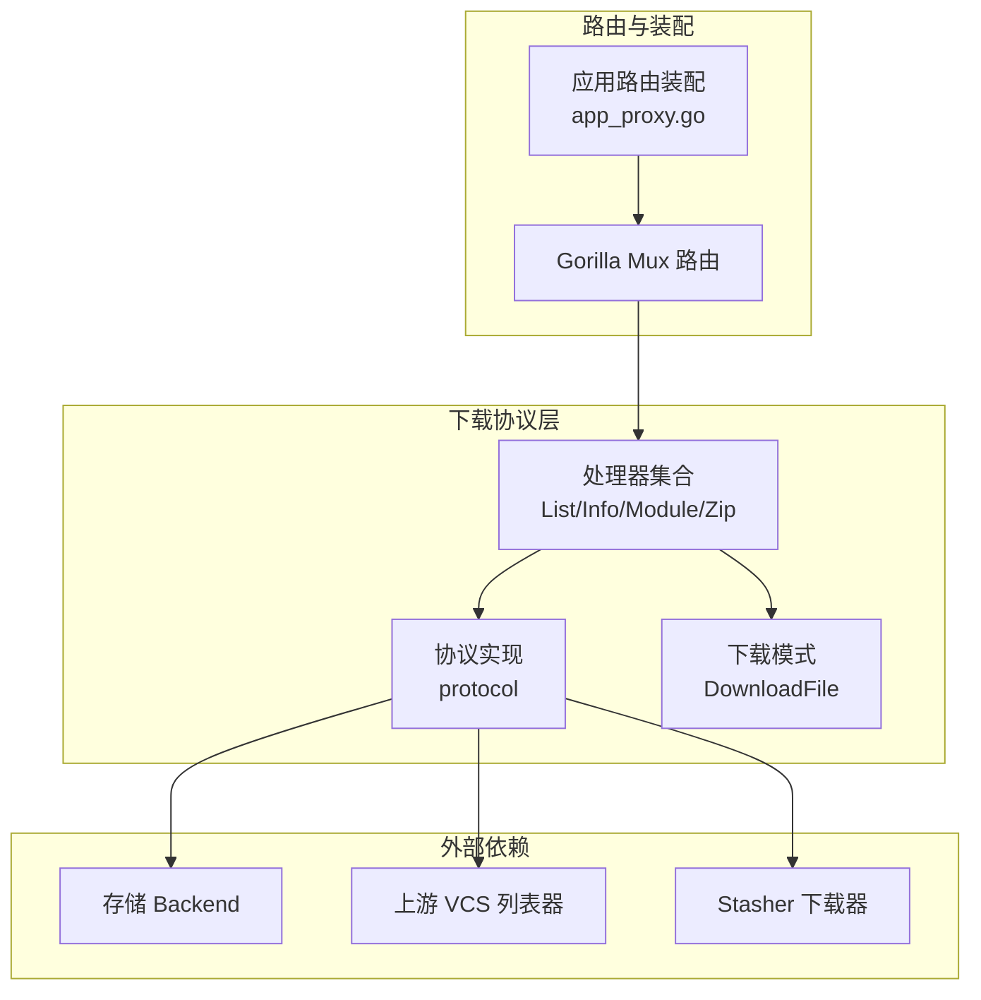
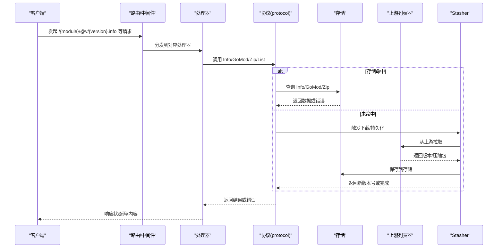
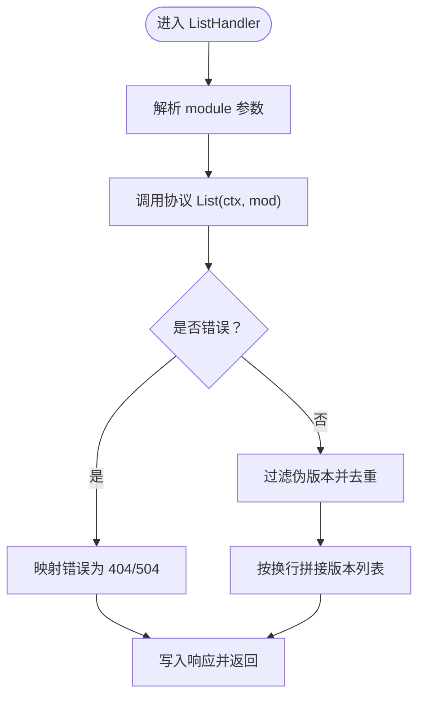
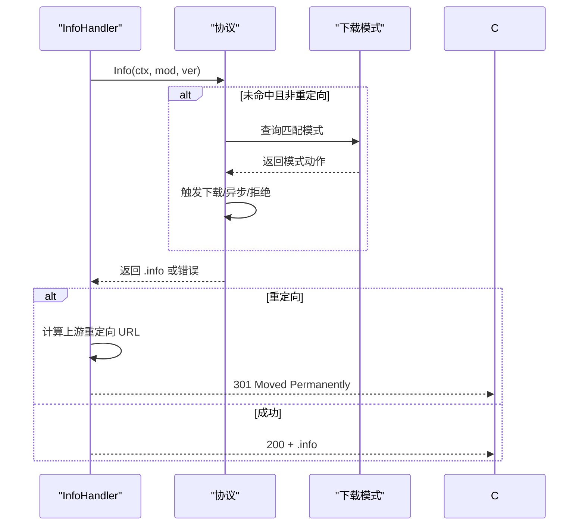
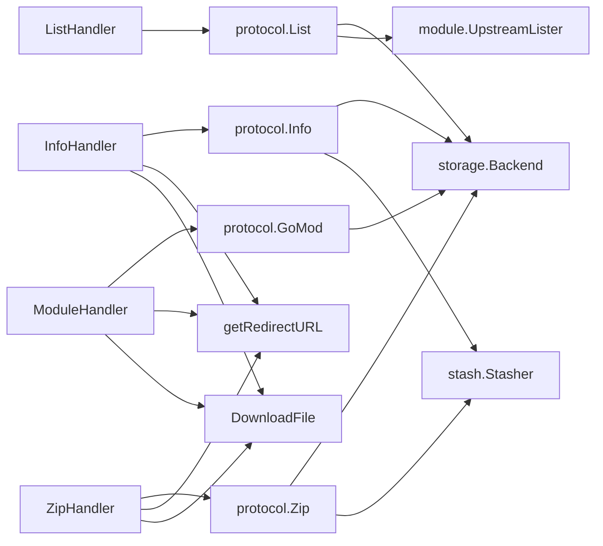

# 下载处理器

<cite>
**本文引用的文件**
- [pkg/download/handler.go](file://pkg/download/handler.go)
- [pkg/download/list.go](file://pkg/download/list.go)
- [pkg/download/version_info.go](file://pkg/download/version_info.go)
- [pkg/download/version_module.go](file://pkg/download/version_module.go)
- [pkg/download/version_zip.go](file://pkg/download/version_zip.go)
- [pkg/download/get_module_params.go](file://pkg/download/get_module_params.go)
- [pkg/download/protocol.go](file://pkg/download/protocol.go)
- [pkg/download/mode/mode.go](file://pkg/download/mode/mode.go)
- [cmd/proxy/actions/app_proxy.go](file://cmd/proxy/actions/app_proxy.go)
- [pkg/download/handler_test.go](file://pkg/download/handler_test.go)
- [docs/content/configuration/download.md](file://docs/content/configuration/download.md)
- [pkg/errors/kinds.go](file://pkg/errors/kinds.go)
</cite>

## 目录
1. [简介](#简介)
2. [项目结构](#项目结构)
3. [核心组件](#核心组件)
4. [架构总览](#架构总览)
5. [详细组件分析](#详细组件分析)
6. [依赖分析](#依赖分析)
7. [性能考虑](#性能考虑)
8. [故障排查指南](#故障排查指南)
9. [结论](#结论)
10. [附录](#附录)

## 简介
本文件系统化梳理 Athens 下载协议的处理器体系，围绕 ListHandler、InfoHandler、ModuleHandler、ZipHandler 四类核心处理器，逐项说明其输入参数、处理逻辑、输出格式与错误处理策略；阐述处理器与协议层、下载模式配置、以及路由注册之间的协作关系；并提供性能调优建议、使用示例与调试技巧，帮助开发者理解与扩展下载功能。

## 项目结构
下载处理器位于 pkg/download 目录，配合 mode 子包的下载模式配置、app_proxy 路由装配、以及文档与测试，形成从路由到协议再到存储与上游的完整链路。

图表来源
- [pkg/download/handler.go](file://pkg/download/handler.go#L41-L57)
- [pkg/download/protocol.go](file://pkg/download/protocol.go#L58-L73)
- [cmd/proxy/actions/app_proxy.go](file://cmd/proxy/actions/app_proxy.go#L134-L151)

章节来源
- [pkg/download/handler.go](file://pkg/download/handler.go#L1-L67)
- [cmd/proxy/actions/app_proxy.go](file://cmd/proxy/actions/app_proxy.go#L134-L151)

## 核心组件
- 协议接口与实现
  - 协议接口定义了 List、Info、Latest、GoMod、Zip 五类方法，对应 cmd/go 的下载协议端点。
  - 协议实现通过存储查询与上游 VCS 列表器结合，支持严格/离线/回退三种网络模式。
- 处理器
  - ListHandler：返回版本列表（按换行分隔）。
  - InfoHandler：返回 .info JSON 内容，必要时重定向至上游代理。
  - ModuleHandler：返回 .mod 文本内容，必要时重定向至上游代理。
  - ZipHandler：返回 .zip 流，支持 HEAD 获取元信息，必要时重定向至上游代理。
- 下载模式
  - 支持全局或基于模块模式的 sync/async/none/redirect/async_redirect 行为，可指定默认 downloadURL 或针对路径块覆盖。
- 路由注册
  - 统一在 RegisterHandlers 中注册各处理器，附加 no-cache 中间件与方法约束。

章节来源
- [pkg/download/protocol.go](file://pkg/download/protocol.go#L20-L37)
- [pkg/download/list.go](file://pkg/download/list.go#L14-L42)
- [pkg/download/version_info.go](file://pkg/download/version_info.go#L11-L47)
- [pkg/download/version_module.go](file://pkg/download/version_module.go#L11-L49)
- [pkg/download/version_zip.go](file://pkg/download/version_zip.go#L13-L61)
- [pkg/download/mode/mode.go](file://pkg/download/mode/mode.go#L16-L29)
- [pkg/download/handler.go](file://pkg/download/handler.go#L39-L57)

## 架构总览
下图展示从 HTTP 请求到协议处理、存储与上游交互的整体流程，以及处理器与下载模式的协作。

图表来源
- [pkg/download/handler.go](file://pkg/download/handler.go#L30-L36)
- [pkg/download/protocol.go](file://pkg/download/protocol.go#L199-L251)
- [pkg/download/version_info.go](file://pkg/download/version_info.go#L14-L46)
- [pkg/download/version_module.go](file://pkg/download/version_module.go#L14-L48)
- [pkg/download/version_zip.go](file://pkg/download/version_zip.go#L16-L60)

## 详细组件分析

### ListHandler（版本列表）
- 输入参数
  - 路径参数：module（通过路径解析）
  - 上下文：用于取消/超时控制
- 处理逻辑
  - 解析 module
  - 调用协议 List(ctx, mod)
  - 合并/过滤伪版本，去重后返回
- 输出格式
  - Content-Type: application/json; charset=utf-8
  - 响应体：多行文本，每行一个版本号
- 错误处理
  - NotFound/GatewayTimeout 映射为 404/504 并返回“not found”提示
  - 其他错误记录系统日志并返回对应状态码

图表来源
- [pkg/download/list.go](file://pkg/download/list.go#L17-L42)
- [pkg/download/protocol.go](file://pkg/download/protocol.go#L83-L166)

章节来源
- [pkg/download/list.go](file://pkg/download/list.go#L14-L42)
- [pkg/download/protocol.go](file://pkg/download/protocol.go#L83-L166)

### InfoHandler（版本信息 .info）
- 输入参数
  - 路径参数：module、version（统一解析）
  - 上下文：用于取消/超时控制
- 处理逻辑
  - 解析 module、version
  - 调用协议 Info(ctx, mod, ver)
  - 若存储未命中，依据下载模式触发下载/异步下载/重定向/拒绝
- 输出格式
  - Content-Type: application/json; charset=utf-8
  - 响应体：.info JSON 字节流
- 错误处理
  - NotFound/Redirect 等根据严重级别处理
  - KindRedirect 时计算上游重定向 URL 并返回 301

图表来源
- [pkg/download/version_info.go](file://pkg/download/version_info.go#L14-L46)
- [pkg/download/get_module_params.go](file://pkg/download/get_module_params.go#L10-L17)
- [pkg/download/mode/mode.go](file://pkg/download/mode/mode.go#L115-L141)

章节来源
- [pkg/download/version_info.go](file://pkg/download/version_info.go#L11-L47)
- [pkg/download/get_module_params.go](file://pkg/download/get_module_params.go#L10-L17)
- [pkg/download/mode/mode.go](file://pkg/download/mode/mode.go#L115-L141)

### ModuleHandler（模块文件 .mod）
- 输入参数
  - 路径参数：module、version（统一解析）
- 处理逻辑
  - 解析 module、version
  - 调用协议 GoMod(ctx, mod, ver)
  - 未命中时按下载模式处理
- 输出格式
  - Content-Type: text/plain; charset=utf-8
  - 响应体：.mod 文本内容
- 错误处理
  - Redirect 时重定向至上游
  - 其他错误返回对应状态码

章节来源
- [pkg/download/version_module.go](file://pkg/download/version_module.go#L11-L49)
- [pkg/download/get_module_params.go](file://pkg/download/get_module_params.go#L10-L17)
- [pkg/download/mode/mode.go](file://pkg/download/mode/mode.go#L115-L141)

### ZipHandler（压缩包 .zip）
- 输入参数
  - 路径参数：module、version（统一解析）
  - 方法：GET/HEAD
- 处理逻辑
  - 解析 module、version
  - 调用协议 Zip(ctx, mod, ver)
  - 未命中时按下载模式处理
  - HEAD 仅返回元信息；GET 则复制流到响应
- 输出格式
  - Content-Type: application/zip
  - Content-Length: 当可用时设置
  - 响应体：zip 流
- 错误处理
  - Redirect 时重定向至上游
  - 其他错误返回对应状态码

章节来源
- [pkg/download/version_zip.go](file://pkg/download/version_zip.go#L13-L61)
- [pkg/download/get_module_params.go](file://pkg/download/get_module_params.go#L10-L17)
- [pkg/download/mode/mode.go](file://pkg/download/mode/mode.go#L115-L141)

### 协议实现（protocol）
- 关键职责
  - List：并发读取存储与上游，合并/去重并按网络模式处理异常
  - Info/GoMod/Zip：优先存储，未命中则触发下载流程（同步/异步/重定向/拒绝）
  - processDownload：根据下载模式执行具体动作，并为后台任务设置独立超时上下文
- 网络模式
  - Strict：严格模式，上游异常直接失败
  - Offline：仅使用存储
  - Fallback：上游异常时回退到存储（若存储为空则报错）

章节来源
- [pkg/download/protocol.go](file://pkg/download/protocol.go#L58-L73)
- [pkg/download/protocol.go](file://pkg/download/protocol.go#L83-L166)
- [pkg/download/protocol.go](file://pkg/download/protocol.go#L199-L251)
- [pkg/download/protocol.go](file://pkg/download/protocol.go#L253-L279)

### 下载模式（DownloadFile）
- 配置能力
  - 全局模式：sync/async/none/redirect/async_redirect
  - 路径块：对特定模块前缀设置不同模式与可选 downloadURL
  - 支持 file: 路径或 custom: base64 的 HCL 文件注入
- 匹配规则
  - 按路径块声明顺序优先匹配，否则采用全局模式
  - URL 优先使用路径块覆盖，否则使用顶层 downloadURL

章节来源
- [pkg/download/mode/mode.go](file://pkg/download/mode/mode.go#L31-L46)
- [pkg/download/mode/mode.go](file://pkg/download/mode/mode.go#L115-L141)
- [docs/content/configuration/download.md](file://docs/content/configuration/download.md#L16-L23)

### 路由注册与装配
- 路由注册
  - RegisterHandlers 统一注册 /list、/@latest、/@v/{version}.info、/@v/{version}.mod、/@v/{version}.zip
  - 对部分端点附加 no-cache 中间件与方法约束
- 应用装配
  - app_proxy.go 中构建 Storage/Stasher/Lister/DownloadFile/NetworkMode
  - 通过 download.New 生成协议实例，并注入 addons.WithPool
  - 使用 HandlerOpts 注入到处理器

章节来源
- [pkg/download/handler.go](file://pkg/download/handler.go#L39-L57)
- [cmd/proxy/actions/app_proxy.go](file://cmd/proxy/actions/app_proxy.go#L134-L151)

## 依赖分析
- 处理器依赖
  - ListHandler 依赖路径解析与协议 List
  - Info/Module/Zip 依赖统一参数解析与协议相应方法
  - 三者均可能触发重定向（getRedirectURL + DownloadFile.URL）
- 协议依赖
  - 依赖存储 Backend、上游 List、Stasher、网络模式、日志与可观测
  - processDownload 为异步/重定向/拒绝提供统一入口
- 下载模式依赖
  - 通过正则与路径匹配决定行为与上游 URL

图表来源
- [pkg/download/list.go](file://pkg/download/list.go#L17-L42)
- [pkg/download/version_info.go](file://pkg/download/version_info.go#L14-L46)
- [pkg/download/version_module.go](file://pkg/download/version_module.go#L14-L48)
- [pkg/download/version_zip.go](file://pkg/download/version_zip.go#L16-L60)
- [pkg/download/protocol.go](file://pkg/download/protocol.go#L199-L251)
- [pkg/download/mode/mode.go](file://pkg/download/mode/mode.go#L115-L141)

章节来源
- [pkg/download/protocol.go](file://pkg/download/protocol.go#L199-L251)
- [pkg/download/mode/mode.go](file://pkg/download/mode/mode.go#L115-L141)

## 性能考虑
- 并发与去重
  - List 并发访问存储与上游，使用 WaitGroup 同步，union 去重，减少重复版本
- 异步下载
  - async/async_redirect 模式下，后台继续下载，避免阻塞请求响应
- 超时与上下文
  - processDownload 为后台任务创建带超时的新上下文，确保即使请求结束也能继续处理
- 缓存控制
  - 注册时对下载端点启用 no-cache 中间件，避免代理缓存导致的陈旧内容
- 连接池与限流
  - 通过 addons.WithPool 与 stash 层的单飞/锁机制降低重复请求与并发压力

章节来源
- [pkg/download/protocol.go](file://pkg/download/protocol.go#L83-L166)
- [pkg/download/protocol.go](file://pkg/download/protocol.go#L253-L279)
- [pkg/download/handler.go](file://pkg/download/handler.go#L46-L49)
- [cmd/proxy/actions/app_proxy.go](file://cmd/proxy/actions/app_proxy.go#L147-L147)

## 故障排查指南
- 常见错误与定位
  - NotFound：通常表示模块未在存储中，检查下载模式与存储配置
  - Redirect：确认 DownloadFile.downloadURL 是否正确，以及上游代理可达
  - GatewayTimeout/网络异常：检查上游 VCS 可达性与网络模式配置
- 日志与追踪
  - 处理器与协议均使用 log.Entry 记录系统错误，便于定位
- 行为验证
  - 使用测试用例思路验证重定向行为（如 handler_test 中对 Redirect 的断言）
- 配置核对
  - 下载模式文件语法与路径匹配是否正确
  - 网络模式（Strict/Offline/Fallback）与预期一致

章节来源
- [pkg/download/version_info.go](file://pkg/download/version_info.go#L28-L42)
- [pkg/download/version_module.go](file://pkg/download/version_module.go#L26-L43)
- [pkg/download/version_zip.go](file://pkg/download/version_zip.go#L27-L43)
- [pkg/errors/kinds.go](file://pkg/errors/kinds.go#L3-L6)
- [pkg/download/handler_test.go](file://pkg/download/handler_test.go#L16-L44)

## 结论
下载处理器通过清晰的协议接口与统一的处理器封装，实现了对 cmd/go 下载协议的完整支持。配合灵活的下载模式与严谨的并发/重定向/错误处理策略，既能满足企业内网安全与合规需求，又能在性能与可靠性之间取得平衡。建议在生产环境中结合网络模式、连接池与单飞/锁策略进行综合调优，并通过下载模式文件精细化控制不同模块组的行为。

## 附录

### 处理器一览与调用流程
- 路由注册
  - /{module}/@v/list → ListHandler
  - /{module}/@latest → LatestHandler
  - /{module}/@v/{version}.info → InfoHandler
  - /{module}/@v/{version}.mod → ModuleHandler
  - /{module}/@v/{version}.zip → ZipHandler（GET/HEAD）
- 调用流程
  - LogEntryHandler 从请求上下文提取日志条目，注入处理器
  - 处理器解析参数，调用协议相应方法
  - 协议优先查询存储，未命中则按下载模式处理
  - 必要时重定向至上游代理

章节来源
- [pkg/download/handler.go](file://pkg/download/handler.go#L39-L57)
- [cmd/proxy/actions/app_proxy.go](file://cmd/proxy/actions/app_proxy.go#L149-L151)

### 使用示例与调试技巧
- 示例场景
  - 全局 async_redirect：请求未命中时立即 301 至上游，后台继续下载
  - 路径块 sync：特定前缀强制从上游拉取并入库
  - 路径块 none：禁止某些模块入库与服务
- 调试技巧
  - 通过测试用例思路构造请求，断言状态码与 Location 头
  - 检查日志中系统错误与重定向目标 URL
  - 核对下载模式文件的 HCL 语法与路径匹配

章节来源
- [pkg/download/handler_test.go](file://pkg/download/handler_test.go#L16-L44)
- [docs/content/configuration/download.md](file://docs/content/configuration/download.md#L25-L74)