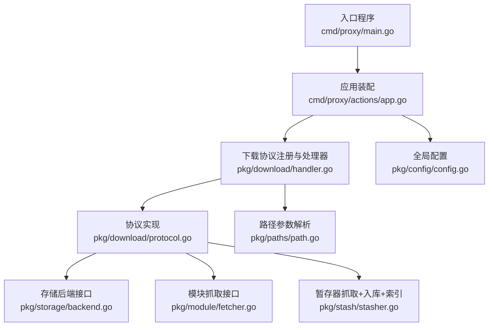
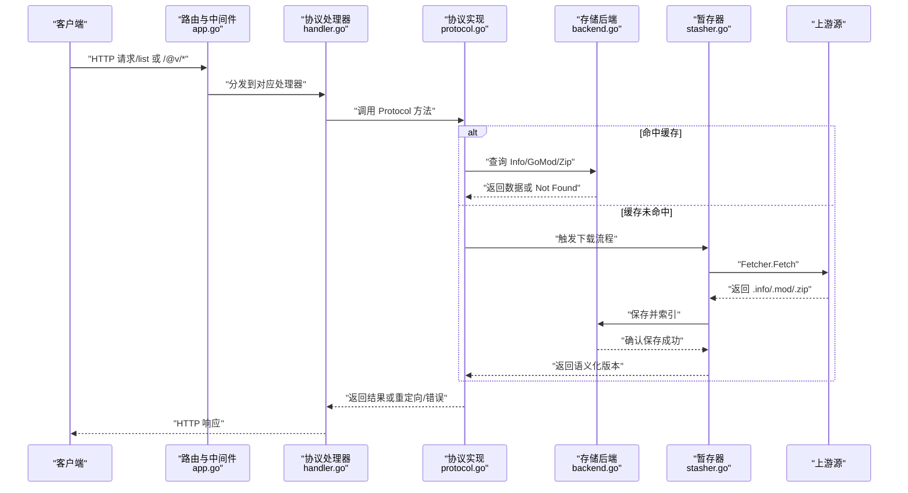
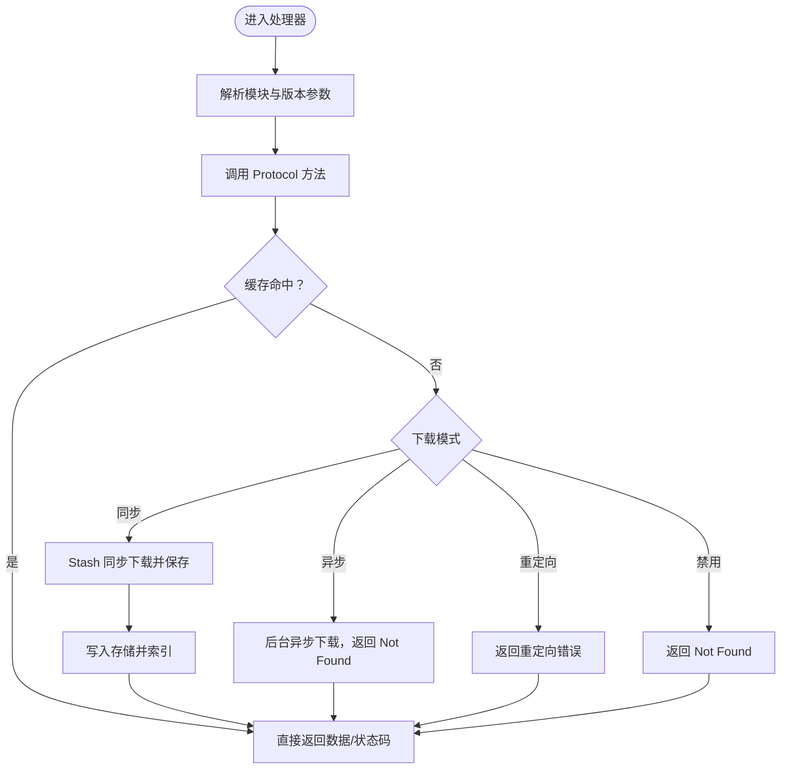
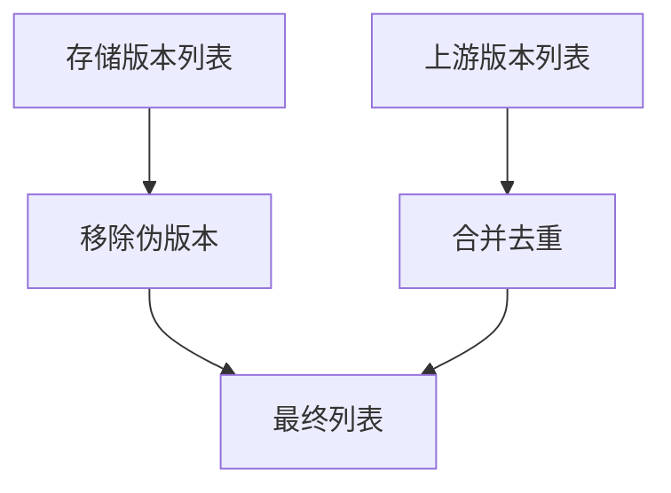
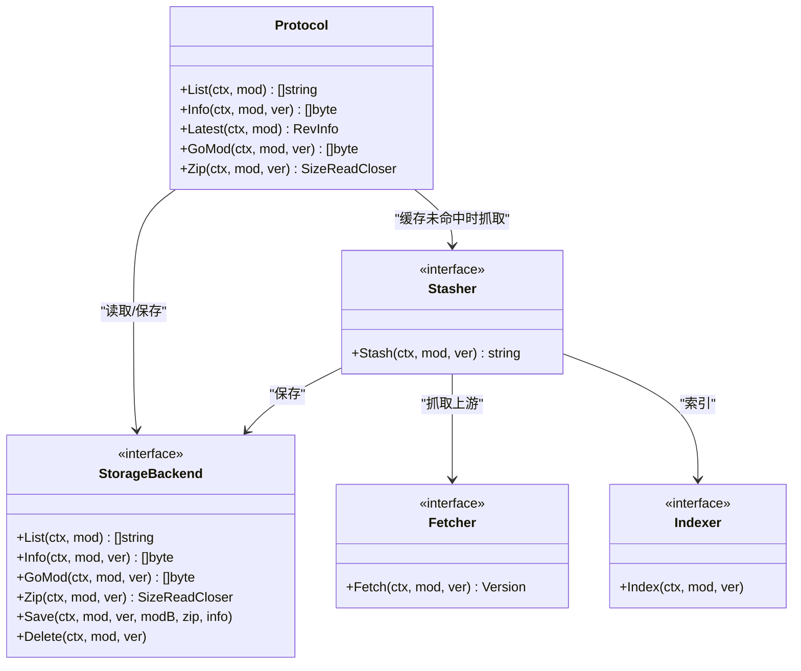

# 模块代理服务

<cite>
**本文引用的文件**
- [cmd/proxy/main.go](file://cmd/proxy/main.go)
- [cmd/proxy/actions/app.go](file://cmd/proxy/actions/app.go)
- [pkg/config/config.go](file://pkg/config/config.go)
- [pkg/download/handler.go](file://pkg/download/handler.go)
- [pkg/download/protocol.go](file://pkg/download/protocol.go)
- [pkg/download/list.go](file://pkg/download/list.go)
- [pkg/download/latest.go](file://pkg/download/latest.go)
- [pkg/download/version_info.go](file://pkg/download/version_info.go)
- [pkg/download/version_module.go](file://pkg/download/version_module.go)
- [pkg/download/version_zip.go](file://pkg/download/version_zip.go)
- [pkg/download/get_module_params.go](file://pkg/download/get_module_params.go)
- [pkg/paths/path.go](file://pkg/paths/path.go)
- [pkg/storage/backend.go](file://pkg/storage/backend.go)
- [pkg/module/fetcher.go](file://pkg/module/fetcher.go)
- [pkg/stash/stasher.go](file://pkg/stash/stasher.go)
</cite>

## 目录
1. [简介](#简介)
2. [项目结构](#项目结构)
3. [核心组件](#核心组件)
4. [架构总览](#架构总览)
5. [详细组件分析](#详细组件分析)
6. [依赖关系分析](#依赖关系分析)
7. [性能考量](#性能考量)
8. [故障排除指南](#故障排除指南)
9. [结论](#结论)
10. [附录](#附录)

## 简介
本文件面向 Athens 模块代理服务，系统性阐述其如何实现 Go Modules 协议（/list、/info、/mod、/zip、/@latest），以及下载处理流程、版本管理与 ZIP 文件处理、缓存策略、上游代理机制与错误处理逻辑。文档同时提供配置要点、使用示例与性能优化建议，帮助读者从理论到实践全面掌握。

## 项目结构
- 入口程序负责加载配置、初始化日志、构建 HTTP 处理器并启动服务。
- 应用层组装路由与中间件，挂载代理相关路由。
- 下载协议层定义并实现 Go 模块代理协议的各端点。
- 存储与索引层抽象后端能力，支持多种存储与索引实现。
- 模块抓取与暂存层负责从上游拉取模块并写入存储与索引。
- 路径解析与参数提取层统一从 URL 中解析模块名与版本。

图表来源
- [cmd/proxy/main.go](file://cmd/proxy/main.go#L29-L127)
- [cmd/proxy/actions/app.go](file://cmd/proxy/actions/app.go#L23-L138)
- [pkg/download/handler.go](file://pkg/download/handler.go#L39-L57)
- [pkg/download/protocol.go](file://pkg/download/protocol.go#L58-L73)
- [pkg/storage/backend.go](file://pkg/storage/backend.go#L3-L9)
- [pkg/module/fetcher.go](file://pkg/module/fetcher.go#L9-L14)
- [pkg/stash/stasher.go](file://pkg/stash/stasher.go#L29-L39)
- [pkg/paths/path.go](file://pkg/paths/path.go#L12-L54)
- [pkg/config/config.go](file://pkg/config/config.go#L127-L144)

章节来源
- [cmd/proxy/main.go](file://cmd/proxy/main.go#L29-L127)
- [cmd/proxy/actions/app.go](file://cmd/proxy/actions/app.go#L23-L138)
- [pkg/config/config.go](file://pkg/config/config.go#L127-L144)

## 核心组件
- 配置系统：集中管理运行参数（日志级别、端口、存储类型、网络模式、下载模式、索引类型等），并支持环境变量覆盖与 TOML 文件加载。
- 应用装配：注册安全中间件、统计导出器、追踪导出器、过滤器、认证等；根据配置选择存储与索引实现，并挂载代理路由。
- 下载协议层：定义 Protocol 接口及其实现，提供 /list、/@latest、/@v/{version}.info、/@v/{version}.mod、/@v/{version}.zip 端点处理逻辑。
- 存储与索引：通过 Backend 统一抽象读写、删除、列举能力；索引器负责索引更新。
- 模块抓取与暂存：Fetcher 抓取上游模块，Stasher 将模块写入存储并更新索引，内置 Singleflight 避免重复抓取。
- 路径解析：统一从 URL 提取模块名与版本，支持解码。

章节来源
- [pkg/config/config.go](file://pkg/config/config.go#L22-L66)
- [cmd/proxy/actions/app.go](file://cmd/proxy/actions/app.go#L109-L131)
- [pkg/download/handler.go](file://pkg/download/handler.go#L14-L24)
- [pkg/download/protocol.go](file://pkg/download/protocol.go#L20-L37)
- [pkg/storage/backend.go](file://pkg/storage/backend.go#L3-L9)
- [pkg/module/fetcher.go](file://pkg/module/fetcher.go#L9-L14)
- [pkg/stash/stasher.go](file://pkg/stash/stasher.go#L17-L24)
- [pkg/paths/path.go](file://pkg/paths/path.go#L12-L54)

## 架构总览
下图展示从客户端请求到最终响应的完整链路，涵盖路由注册、协议处理、存储访问、索引更新与错误处理。

图表来源
- [cmd/proxy/actions/app.go](file://cmd/proxy/actions/app.go#L109-L131)
- [pkg/download/handler.go](file://pkg/download/handler.go#L39-L57)
- [pkg/download/protocol.go](file://pkg/download/protocol.go#L199-L251)
- [pkg/stash/stasher.go](file://pkg/stash/stasher.go#L49-L93)
- [pkg/storage/backend.go](file://pkg/storage/backend.go#L3-L9)

## 详细组件分析

### 协议端点与处理流程
- /list（版本列表）
  - 解析模块名，调用 Protocol.List 并合并存储与上游版本，过滤伪版本，去重后返回。
  - 错误处理：根据网络模式（strict/offline/fallback）决定是否返回错误或回退策略。
- /@latest（最新版本）
  - 在非离线模式下，调用上游 Lister 获取最新 RevInfo；离线模式直接报错。
- /@v/{version}.info
  - 返回模块版本的 .info JSON；若缓存缺失则触发下载流程；支持重定向到外部下载地址。
- /@v/{version}.mod
  - 返回 go.mod 文本；缓存缺失时触发下载；支持重定向。
- /@v/{version}.zip
  - 返回模块源码压缩包；HEAD 方法仅返回元信息；支持重定向。

图表来源
- [pkg/download/list.go](file://pkg/download/list.go#L18-L42)
- [pkg/download/latest.go](file://pkg/download/latest.go#L18-L43)
- [pkg/download/version_info.go](file://pkg/download/version_info.go#L15-L47)
- [pkg/download/version_module.go](file://pkg/download/version_module.go#L15-L49)
- [pkg/download/version_zip.go](file://pkg/download/version_zip.go#L17-L61)
- [pkg/download/protocol.go](file://pkg/download/protocol.go#L253-L279)

章节来源
- [pkg/download/list.go](file://pkg/download/list.go#L18-L42)
- [pkg/download/latest.go](file://pkg/download/latest.go#L18-L43)
- [pkg/download/version_info.go](file://pkg/download/version_info.go#L15-L47)
- [pkg/download/version_module.go](file://pkg/download/version_module.go#L15-L49)
- [pkg/download/version_zip.go](file://pkg/download/version_zip.go#L17-L61)
- [pkg/download/protocol.go](file://pkg/download/protocol.go#L199-L279)

### 版本管理与伪版本过滤
- 列表合并：并发查询存储与上游，合并后移除伪版本，避免将不可解析的伪版本暴露给 Go 客户端。
- 伪版本识别：基于正则匹配伪版本格式，仅保留语义化版本。
- 上游不可用策略：
  - strict：上游失败即报错，保证行为稳定。
  - fallback：上游失败返回现有存储版本，不删除伪版本。
  - offline：仅返回存储版本。

图表来源
- [pkg/download/protocol.go](file://pkg/download/protocol.go#L83-L166)
- [pkg/download/protocol.go](file://pkg/download/protocol.go#L168-L180)

章节来源
- [pkg/download/protocol.go](file://pkg/download/protocol.go#L83-L180)

### ZIP 文件处理与 HEAD 支持
- 内容类型与长度：根据 SizeReadCloser 设置 Content-Type 与 Content-Length。
- HEAD 请求：仅返回头部信息，不传输体。
- 流式复制：使用 io.Copy 将存储中的 ZIP 流式写入响应。

章节来源
- [pkg/download/version_zip.go](file://pkg/download/version_zip.go#L17-L61)

### 路由注册与中间件
- 注册所有协议端点，统一设置 no-cache 控制头。
- 日志中间件：从请求上下文提取日志条目，注入到每个处理器。
- 安全中间件：可选强制 HTTPS 与 X-Forwarded-Proto 处理。
- 认证中间件：BasicAuth 用户名密码校验。
- 过滤中间件：基于规则文件拦截特定模块请求。
- 统计与追踪：注册 Prometheus 统计导出器与 OpenCensus 追踪导出器。

章节来源
- [pkg/download/handler.go](file://pkg/download/handler.go#L39-L57)
- [cmd/proxy/actions/app.go](file://cmd/proxy/actions/app.go#L46-L118)

### 配置项与使用示例
- 关键配置
  - 网络模式：strict/offline/fallback，影响 /list 与 /@latest 的行为。
  - 下载模式：sync/async/redirect/async_redirect/none，控制缓存未命中时的处理策略。
  - 存储类型：memory/disk/mongo/s3/azureblob/gcp/minio/external。
  - 索引类型：none/memory/mysql/postgres。
  - 认证：BasicAuth 用户名/密码或 .netrc/.hgrc 私有仓库凭据。
  - 日志与导出：日志级别、格式、pprof 开关、追踪与统计导出器。
- 使用示例（概念性）
  - 启动服务：加载配置文件或默认配置，监听端口或 Unix Socket。
  - 访问端点：客户端按 Go Modules 协议访问 /list、/@latest、/@v/{version}.{info,mod,zip}。
  - 配置存储：选择合适的存储后端（如 S3、GCS、Mongo）并配置连接参数。
  - 配置网络模式：在严格模式下确保上游可用以获得一致行为；在离线模式下仅使用缓存。

章节来源
- [pkg/config/config.go](file://pkg/config/config.go#L22-L66)
- [pkg/config/config.go](file://pkg/config/config.go#L146-L213)
- [cmd/proxy/main.go](file://cmd/proxy/main.go#L29-L98)

## 依赖关系分析
- 组件耦合
  - 下载协议层依赖存储后端与索引器；在缓存未命中时依赖暂存器完成抓取与入库。
  - 暂存器依赖模块抓取器与存储后端，并通过 Singleflight 避免重复抓取。
  - 应用层通过配置选择具体存储与索引实现，并挂载路由与中间件。
- 外部依赖
  - 追踪与统计：OpenCensus 插件与 Prometheus 导出器。
  - 安全中间件：统一安全策略（HTTPS 强制、代理头处理）。
  - 路由：Gorilla Mux 路由与参数提取。

图表来源
- [pkg/download/protocol.go](file://pkg/download/protocol.go#L20-L37)
- [pkg/storage/backend.go](file://pkg/storage/backend.go#L3-L9)
- [pkg/stash/stasher.go](file://pkg/stash/stasher.go#L17-L24)
- [pkg/module/fetcher.go](file://pkg/module/fetcher.go#L9-L14)

章节来源
- [pkg/download/protocol.go](file://pkg/download/protocol.go#L58-L73)
- [pkg/stash/stasher.go](file://pkg/stash/stasher.go#L29-L39)
- [pkg/storage/backend.go](file://pkg/storage/backend.go#L3-L9)

## 性能考量
- 并发与超时
  - /list 并发查询存储与上游，减少整体延迟；为异步下载创建独立上下文并设置较长超时，确保下载在请求完成后仍继续进行。
- 缓存优先
  - 优先命中存储后端，避免不必要的上游往返；仅在缓存缺失时触发下载。
- 去重与伪版本过滤
  - 合并版本列表并移除伪版本，降低客户端解析负担。
- 下载模式选择
  - sync：保证一致性但可能阻塞首次请求。
  - async：快速返回，后台补货，适合高并发场景。
  - redirect/async_redirect：将下载重定向至外部地址，减轻代理压力。
- Singleflight
  - 对同一模块版本的并发请求进行合并，避免重复抓取。
- I/O 优化
  - ZIP 流式复制，避免一次性加载到内存。

章节来源
- [pkg/download/protocol.go](file://pkg/download/protocol.go#L83-L166)
- [pkg/download/protocol.go](file://pkg/download/protocol.go#L253-L279)
- [pkg/stash/stasher.go](file://pkg/stash/stasher.go#L49-L93)

## 故障排除指南
- 常见错误与处理
  - Not Found：当模块或版本不存在时返回相应状态码；在 strict 模式下上游失败会直接报错；在 fallback 模式下若上游不可用则返回现有存储版本。
  - Redirect：当下载模式为 redirect/async_redirect 时，处理器返回重定向错误，客户端应转向外部下载地址。
  - Gateway Timeout：上游或存储异常导致超时，需检查网络与后端可用性。
- 日志与追踪
  - 使用日志中间件记录请求 ID 与上下文信息；开启追踪导出器便于定位问题。
- 配置核对
  - 确认网络模式与下载模式符合预期；检查存储与索引配置正确；验证认证与过滤规则未误拦截合法请求。
- 端点验证
  - 先访问 /list 确认版本列表；再访问 /@latest 获取最新版本；最后按需获取 .info/.mod/.zip。

章节来源
- [pkg/download/protocol.go](file://pkg/download/protocol.go#L130-L149)
- [pkg/download/version_info.go](file://pkg/download/version_info.go#L27-L42)
- [pkg/download/version_module.go](file://pkg/download/version_module.go#L26-L43)
- [pkg/download/version_zip.go](file://pkg/download/version_zip.go#L27-L44)
- [cmd/proxy/actions/app.go](file://cmd/proxy/actions/app.go#L67-L94)

## 结论
Athens 通过清晰的协议层、可插拔的存储与索引、完善的错误处理与下载模式，实现了对 Go Modules 协议的完整支持。结合并发与缓存策略，可在保证一致性的同时提升吞吐与稳定性。合理配置网络模式与下载模式，配合监控与日志，可满足从开发到生产的多样化需求。

## 附录
- 端点一览
  - /{module}/@v/list：返回版本列表（JSON，每行一个版本）
  - /{module}/@latest：返回最新版本信息（RevInfo）
  - /{module}/@v/{version}.info：返回 .info JSON
  - /{module}/@v/{version}.mod：返回 go.mod 文本
  - /{module}/@v/{version}.zip：返回源码 ZIP（支持 HEAD）

章节来源
- [pkg/download/handler.go](file://pkg/download/handler.go#L14-L24)
- [pkg/download/list.go](file://pkg/download/list.go#L14-L15)
- [pkg/download/latest.go](file://pkg/download/latest.go#L13-L14)
- [pkg/download/version_info.go](file://pkg/download/version_info.go#L11-L12)
- [pkg/download/version_module.go](file://pkg/download/version_module.go#L11-L12)
- [pkg/download/version_zip.go](file://pkg/download/version_zip.go#L13-L14)