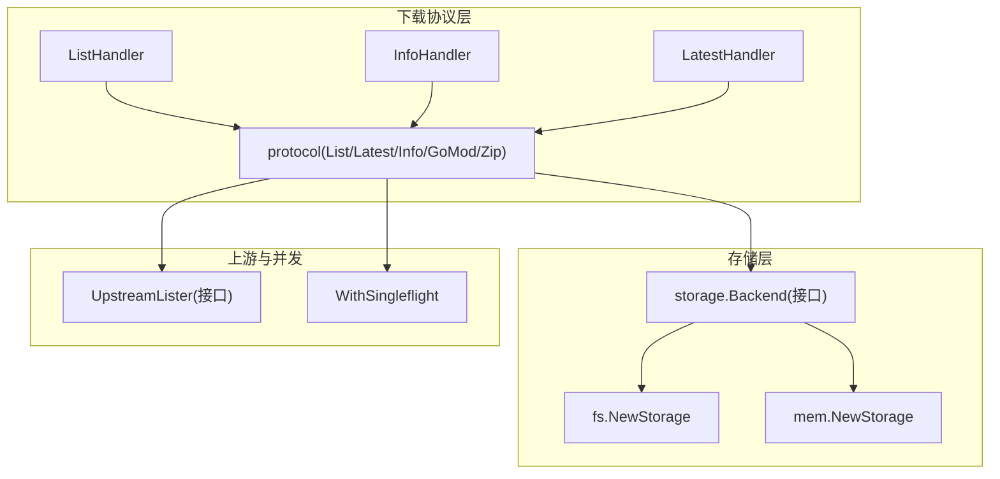
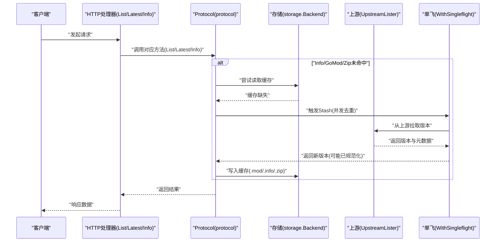
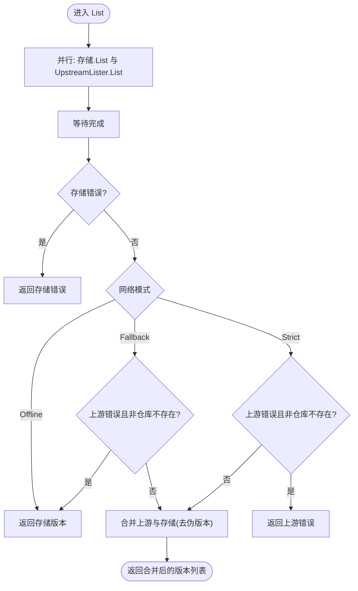
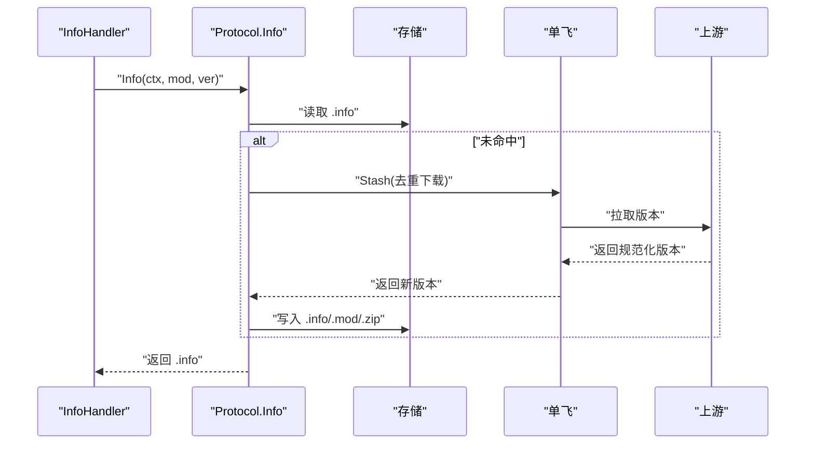
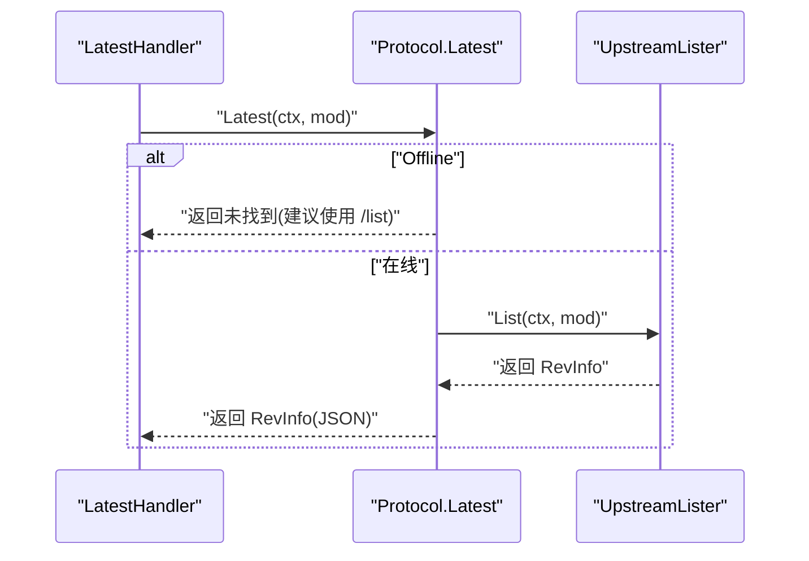
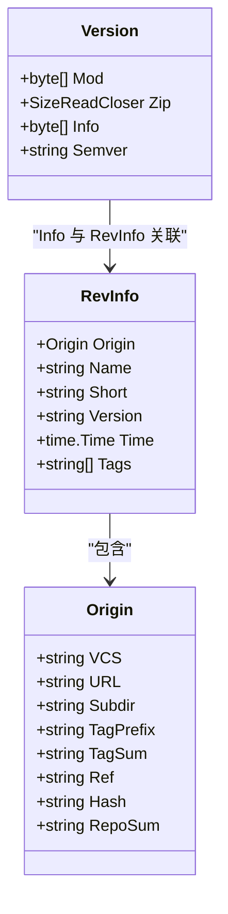
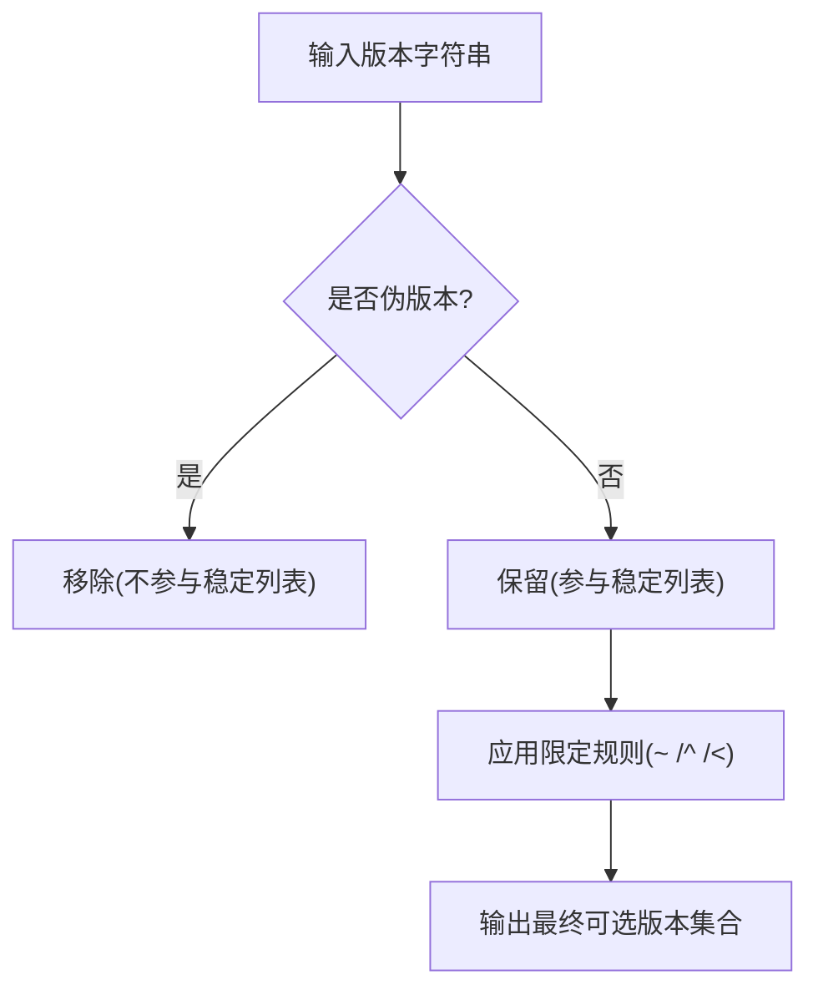
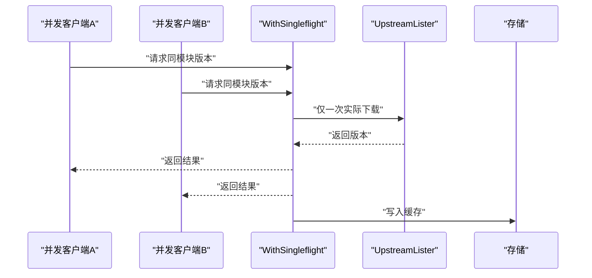
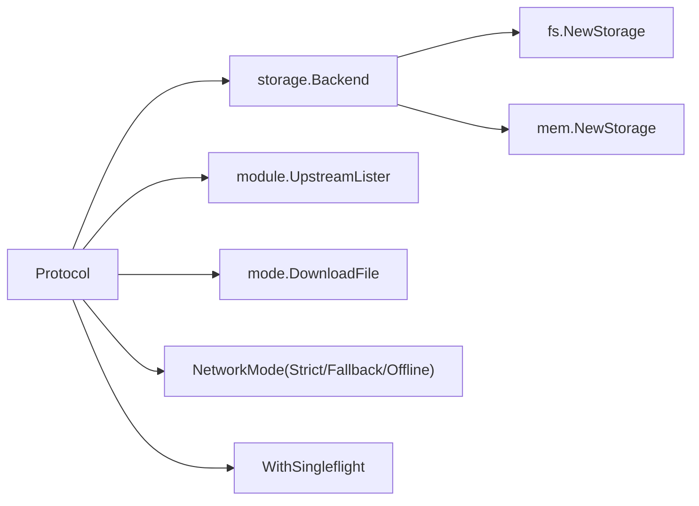

# 版本管理

<cite>
**本文引用的文件**
- [pkg/download/protocol.go](file://pkg/download/protocol.go)
- [pkg/download/list.go](file://pkg/download/list.go)
- [pkg/download/latest.go](file://pkg/download/latest.go)
- [pkg/download/version_info.go](file://pkg/download/version_info.go)
- [pkg/storage/version.go](file://pkg/storage/version.go)
- [pkg/storage/rev_info.go](file://pkg/storage/rev_info.go)
- [pkg/module/upstream_lister.go](file://pkg/module/upstream_lister.go)
- [pkg/stash/with_singleflight.go](file://pkg/stash/with_singleflight.go)
- [pkg/config/module.go](file://pkg/config/module.go)
- [docs/content/configuration/prefill-disk-cache.md](file://docs/content/configuration/prefill-disk-cache.md)
- [pkg/middleware/cache_control.go](file://pkg/middleware/cache_control.go)
- [pkg/config/timeout.go](file://pkg/config/timeout.go)
- [pkg/module/filter.go](file://pkg/module/filter.go)
- [pkg/download/list_merge_test.go](file://pkg/download/list_merge_test.go)
- [pkg/storage/fs/fs.go](file://pkg/storage/fs/fs.go)
- [pkg/storage/mem/mem.go](file://pkg/storage/mem/mem.go)
- [pkg/storage/backend.go](file://pkg/storage/backend.go)
- [pkg/storage/module.go](file://pkg/storage/module.go)
- [pkg/storage/compliance/benchmarks.go](file://pkg/storage/compliance/benchmarks.go)
</cite>

## 目录
1. [简介](#简介)
2. [项目结构](#项目结构)
3. [核心组件](#核心组件)
4. [架构总览](#架构总览)
5. [组件详解](#组件详解)
6. [依赖关系分析](#依赖关系分析)
7. [性能考量](#性能考量)
8. [故障排查指南](#故障排查指南)
9. [结论](#结论)
10. [附录](#附录)

## 简介
本文系统化阐述 Athens 的版本管理能力，覆盖以下关键主题：
- 版本列表获取：如何从存储与上游（VCS）合并版本列表，并过滤伪版本。
- 版本详情查询：.info 元数据的来源、结构与缓存命中逻辑。
- 最新版本确定：在不同网络模式下的行为差异与回退策略。
- 版本元数据存储格式：.mod/.info/.zip 的组织方式与 RevInfo 结构。
- 版本号解析与兼容性：伪版本识别、语义化版本筛选与版本限定规则。
- 缓存策略与失效：单飞机制、异步下载、重定向与离线模式。
- 最佳实践与性能优化：预填充磁盘缓存、并发控制、超时配置与缓存头设置。

## 项目结构
围绕版本管理的关键代码分布在如下模块：
- 下载协议层：定义并实现 /list、/@latest、/@v/{version}.info、/@v/{version}.mod、/@v/{version}.zip 的处理流程。
- 存储层：统一的 Backend 接口及具体实现（文件系统、内存、云存储等），承载 .mod/.info/.zip 的读写与版本枚举。
- 上游列举器：从 VCS 或外部服务获取可用版本列表与 RevInfo。
- 缓存与并发：SingleFlight 避免重复下载；异步/重定向模式减少请求阻塞。
- 配置与工具：版本路径格式化、超时配置、过滤规则等。

**图表来源**
- [pkg/download/protocol.go](file://pkg/download/protocol.go#L20-L37)
- [pkg/download/list.go](file://pkg/download/list.go#L17-L42)
- [pkg/download/version_info.go](file://pkg/download/version_info.go#L14-L47)
- [pkg/download/latest.go](file://pkg/download/latest.go#L16-L43)
- [pkg/storage/backend.go](file://pkg/storage/backend.go#L3-L9)
- [pkg/storage/fs/fs.go](file://pkg/storage/fs/fs.go#L26-L39)
- [pkg/storage/mem/mem.go](file://pkg/storage/mem/mem.go#L12-L27)
- [pkg/module/upstream_lister.go](file://pkg/module/upstream_lister.go#L9-L13)
- [pkg/stash/with_singleflight.go](file://pkg/stash/with_singleflight.go#L12-L23)

**章节来源**
- [pkg/download/protocol.go](file://pkg/download/protocol.go#L20-L37)
- [pkg/storage/backend.go](file://pkg/storage/backend.go#L3-L9)
- [pkg/module/upstream_lister.go](file://pkg/module/upstream_lister.go#L9-L13)
- [pkg/stash/with_singleflight.go](file://pkg/stash/with_singleflight.go#L12-L23)

## 核心组件
- 协议接口与实现
  - Protocol 定义了 List/Info/Latest/GoMod/Zip 的统一入口，供 HTTP 处理器调用。
  - protocol 实现中包含网络模式（Strict/Fallback/Offline）、伪版本过滤、列表合并与下载触发逻辑。
- 版本数据模型
  - storage.Version：封装 .mod/.info/.zip 以及 Semver 字段。
  - storage.RevInfo：承载版本的完整元信息（含 Origin、Name、Short、Version、Time、Tags）。
- 上游列举器
  - UpstreamLister 提供从上游（如 VCS）获取版本列表与 RevInfo 的能力。
- 并发与缓存
  - WithSingleflight 将同一模块版本的多次请求合并为一次实际下载，显著降低资源消耗。
- 路径与命名
  - 包含版本路径格式化工具，用于生成存储键名与模块版本拼接格式。

**章节来源**
- [pkg/download/protocol.go](file://pkg/download/protocol.go#L20-L37)
- [pkg/storage/version.go](file://pkg/storage/version.go#L5-L11)
- [pkg/storage/rev_info.go](file://pkg/storage/rev_info.go#L37-L48)
- [pkg/module/upstream_lister.go](file://pkg/module/upstream_lister.go#L9-L13)
- [pkg/stash/with_singleflight.go](file://pkg/stash/with_singleflight.go#L12-L23)
- [pkg/config/module.go](file://pkg/config/module.go#L9-L19)

## 架构总览
下图展示了版本管理的端到端流程：客户端通过 HTTP 请求访问 /list、/@latest、/@v/{version}.info 等端点，协议层根据网络模式与存储状态决定是否触发上游拉取或直接返回缓存数据。

**图表来源**
- [pkg/download/list.go](file://pkg/download/list.go#L17-L42)
- [pkg/download/latest.go](file://pkg/download/latest.go#L16-L43)
- [pkg/download/version_info.go](file://pkg/download/version_info.go#L14-L47)
- [pkg/download/protocol.go](file://pkg/download/protocol.go#L199-L279)
- [pkg/module/upstream_lister.go](file://pkg/module/upstream_lister.go#L9-L13)
- [pkg/stash/with_singleflight.go](file://pkg/stash/with_singleflight.go#L37-L67)

## 组件详解

### 版本列表获取（/list）
- 并行策略
  - 同时从存储与上游并行拉取版本列表，等待两个 goroutine 完成。
  - 若存储发生意外错误则直接失败；若上游不可用且处于 Strict 模式也失败。
- 列表合并与伪版本过滤
  - 将存储侧的版本与上游版本合并，并移除伪版本，确保返回稳定的语义化版本集合。
  - 当仓库不存在且存储为空时，明确返回未找到；当仅保存伪版本时，仍可返回以保证 go get 的可用性。
- 网络模式影响
  - Offline：仅返回存储侧版本。
  - Fallback：上游不可用时返回存储侧版本（不剔除伪版本）。
  - Strict：上游不可用时失败，保证行为稳定一致。

**图表来源**
- [pkg/download/protocol.go](file://pkg/download/protocol.go#L83-L166)

**章节来源**
- [pkg/download/protocol.go](file://pkg/download/protocol.go#L83-L166)
- [pkg/download/list.go](file://pkg/download/list.go#L17-L42)
- [pkg/download/list_merge_test.go](file://pkg/download/list_merge_test.go#L82-L103)

### 版本详情查询（/@v/{version}.info）
- 命中优先策略
  - 首先从存储读取 .info；若未命中，则触发下载流程，将新版本规范化后写入缓存再返回。
- 下载触发与模式
  - 根据 DownloadFile 模式决定同步/异步/重定向/异步重定向/禁用等行为。
  - 异步模式会立即返回“未找到”，但后台继续下载；重定向模式返回重定向错误以便客户端跳转。
- 错误处理
  - 对 NotFound、Redirect 等进行分级处理与日志记录，确保对外输出一致的错误码。

**图表来源**
- [pkg/download/version_info.go](file://pkg/download/version_info.go#L14-L47)
- [pkg/download/protocol.go](file://pkg/download/protocol.go#L199-L215)
- [pkg/stash/with_singleflight.go](file://pkg/stash/with_singleflight.go#L37-L67)

**章节来源**
- [pkg/download/version_info.go](file://pkg/download/version_info.go#L14-L47)
- [pkg/download/protocol.go](file://pkg/download/protocol.go#L199-L215)

### 最新版本确定（/@latest）
- 行为差异
  - Offline 模式下明确提示使用 /list；否则从上游获取最新版本的 RevInfo。
- 返回内容
  - RevInfo 包含版本标识、提交时间、标签、短哈希、完整哈希与来源信息等，用于 go 工具链解析。

**图表来源**
- [pkg/download/latest.go](file://pkg/download/latest.go#L16-L43)
- [pkg/download/protocol.go](file://pkg/download/protocol.go#L182-L197)
- [pkg/module/upstream_lister.go](file://pkg/module/upstream_lister.go#L9-L13)

**章节来源**
- [pkg/download/latest.go](file://pkg/download/latest.go#L16-L43)
- [pkg/download/protocol.go](file://pkg/download/protocol.go#L182-L197)

### 版本元数据存储格式
- 存储单元
  - storage.Version：包含 .mod、.zip、.info 与 Semver 字段，作为一次版本下载的完整载体。
- 元数据结构
  - storage.RevInfo：JSON 可编码，包含 Origin（VCS、URL、子目录、Tag 前缀与校验、Ref 与 Hash、RepoSum）、Name、Short、Version、Time、Tags 等字段。
- 文件系统布局
  - 文件系统存储通过根目录与模块路径组织，版本目录下存放 .mod/.info/.zip 等文件；内存存储基于内存文件系统实现。

**图表来源**
- [pkg/storage/version.go](file://pkg/storage/version.go#L5-L11)
- [pkg/storage/rev_info.go](file://pkg/storage/rev_info.go#L37-L48)

**章节来源**
- [pkg/storage/version.go](file://pkg/storage/version.go#L5-L11)
- [pkg/storage/rev_info.go](file://pkg/storage/rev_info.go#L5-L48)
- [pkg/storage/fs/fs.go](file://pkg/storage/fs/fs.go#L18-L24)
- [pkg/storage/mem/mem.go](file://pkg/storage/mem/mem.go#L12-L27)

### 版本号解析与兼容性检查
- 伪版本识别
  - 使用正则表达式识别伪版本格式，避免将其作为稳定版本返回。
- 语义化版本筛选
  - 在合并版本列表时移除伪版本，确保返回符合语义化版本规范的列表。
- 版本限定规则
  - 支持 v1.2.3、~v1.2.3、^v1.2.3、<v2.3.40 等限定符，按主/次/补丁位进行匹配与过滤。

**图表来源**
- [pkg/download/protocol.go](file://pkg/download/protocol.go#L168-L180)
- [pkg/module/filter.go](file://pkg/module/filter.go#L195-L261)

**章节来源**
- [pkg/download/protocol.go](file://pkg/download/protocol.go#L168-L180)
- [pkg/module/filter.go](file://pkg/module/filter.go#L195-L261)

### 缓存策略、失效与更新
- 单飞机制（SingleFlight）
  - 避免对同一模块版本的重复下载，多个并发请求合并为一次实际下载，完成后广播给所有订阅者。
- 异步与重定向
  - 异步模式在缓存缺失时立即返回“未找到”，后台继续下载；重定向模式返回重定向错误以便客户端自行处理。
- 离线模式
  - 仅使用本地存储，不访问上游；/@latest 在此模式下不可用，需改用 /list。
- 预填充缓存
  - 文档提供了离线部署场景下的磁盘缓存预填充流程，确保首次请求即命中本地存储。

**图表来源**
- [pkg/stash/with_singleflight.go](file://pkg/stash/with_singleflight.go#L37-L67)
- [pkg/download/protocol.go](file://pkg/download/protocol.go#L253-L279)

**章节来源**
- [pkg/stash/with_singleflight.go](file://pkg/stash/with_singleflight.go#L12-L67)
- [pkg/download/protocol.go](file://pkg/download/protocol.go#L253-L279)
- [docs/content/configuration/prefill-disk-cache.md](file://docs/content/configuration/prefill-disk-cache.md#L1-L112)

## 依赖关系分析
- 协议层依赖
  - Protocol 依赖存储 Backend、上游 UpstreamLister、下载模式 DownloadFile 与网络模式常量。
- 存储层抽象
  - Backend 统一了 Lister/Getter/Saver/Deleter 能力，具体实现（FS/Mem/GCS/S3/Mongo/AzureBlob/External）遵循该接口。
- 并发与可观测
  - WithSingleflight 通过互斥锁与通道实现订阅/广播；协议层在关键路径开启链路追踪。

**图表来源**
- [pkg/download/protocol.go](file://pkg/download/protocol.go#L42-L73)
- [pkg/storage/backend.go](file://pkg/storage/backend.go#L3-L9)
- [pkg/storage/fs/fs.go](file://pkg/storage/fs/fs.go#L26-L39)
- [pkg/storage/mem/mem.go](file://pkg/storage/mem/mem.go#L12-L27)
- [pkg/stash/with_singleflight.go](file://pkg/stash/with_singleflight.go#L12-L23)

**章节来源**
- [pkg/download/protocol.go](file://pkg/download/protocol.go#L42-L73)
- [pkg/storage/backend.go](file://pkg/storage/backend.go#L3-L9)

## 性能考量
- 并发去重
  - 使用 SingleFlight 显著降低重复下载带来的带宽与 CPU 开销。
- 并行拉取
  - /list 同时从存储与上游拉取，缩短整体延迟。
- 异步下载
  - 在高并发场景下采用异步模式可提升吞吐，但需关注客户端重试与缓存一致性。
- 缓存头设置
  - 通过中间件设置 Cache-Control，合理控制代理层缓存行为。
- 超时配置
  - 下载过程使用固定超时（例如 15 分钟），确保长时间任务不会阻塞请求生命周期。
- 存储基准
  - 提供存储后端的基准测试样例，便于评估不同后端的性能表现。

**章节来源**
- [pkg/stash/with_singleflight.go](file://pkg/stash/with_singleflight.go#L12-L67)
- [pkg/download/protocol.go](file://pkg/download/protocol.go#L103-L115)
- [pkg/middleware/cache_control.go](file://pkg/middleware/cache_control.go#L9-L20)
- [pkg/config/timeout.go](file://pkg/config/timeout.go#L5-L18)
- [pkg/storage/compliance/benchmarks.go](file://pkg/storage/compliance/benchmarks.go#L53-L117)

## 故障排查指南
- /list 返回空列表
  - 检查网络模式：Strict 模式下上游不可用会失败；Fallback 模式下会返回存储侧版本。
  - 若仓库被删除且存储为空，将返回未找到；若仅保存伪版本，仍可返回以保证 go get 可用。
- /@latest 不可用
  - Offline 模式下明确不可用；请改用 /list。
- .info 未命中
  - 触发下载流程；检查异步模式是否导致立即返回“未找到”。
  - 检查上游可达性与认证配置。
- 缓存污染
  - 单飞机制确保并发安全；若出现部分文件上传失败，应验证后端幂等性与清理策略。
- 预填充失败
  - 确认磁盘缓存目录存在且权限正确；参考预填充文档步骤逐项核对。

**章节来源**
- [pkg/download/protocol.go](file://pkg/download/protocol.go#L125-L166)
- [pkg/download/protocol.go](file://pkg/download/protocol.go#L186-L197)
- [pkg/download/protocol.go](file://pkg/download/protocol.go#L204-L214)
- [docs/content/configuration/prefill-disk-cache.md](file://docs/content/configuration/prefill-disk-cache.md#L1-L112)

## 结论
Athens 的版本管理以 Protocol 为核心，结合存储、上游与并发控制，实现了稳定、高效且可扩展的 Go 模块版本分发体系。通过伪版本过滤、版本限定规则与多种网络模式，既能满足严格一致性需求，也能在离线或受限环境下保持可用性。配合预填充缓存与合理的中间件配置，可在生产环境中获得优异的性能与可靠性。

## 附录
- 版本路径与命名
  - 使用工具函数生成模块版本文件名与模块@版本拼接格式，便于跨后端一致化处理。
- 存储模型
  - Module 结构体用于特定后端（如 Mongo）持久化模块元信息，便于统计与管理。

**章节来源**
- [pkg/config/module.go](file://pkg/config/module.go#L9-L31)
- [pkg/storage/module.go](file://pkg/storage/module.go#L7-L16)