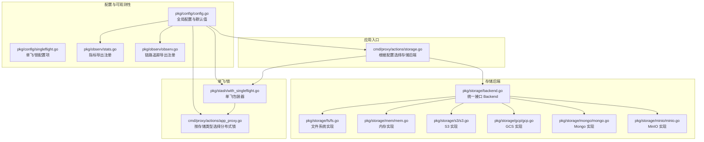
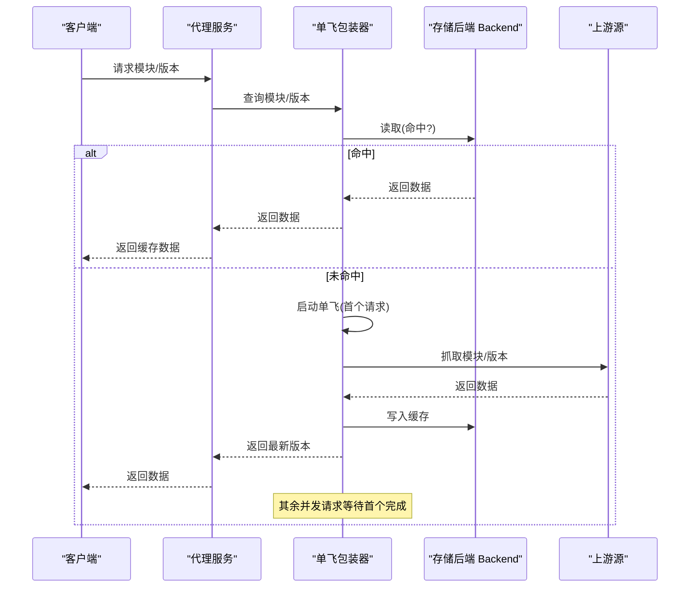
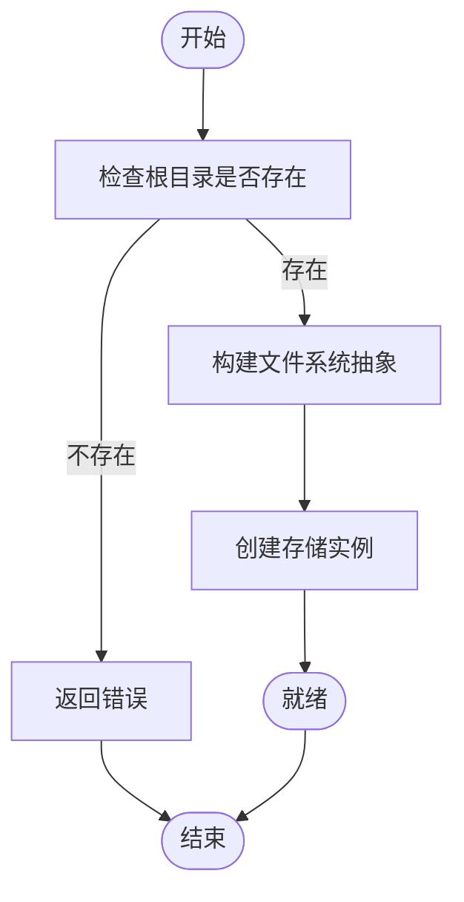
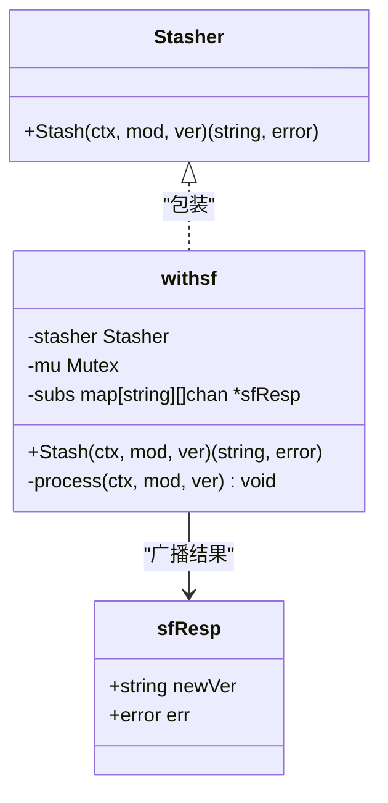
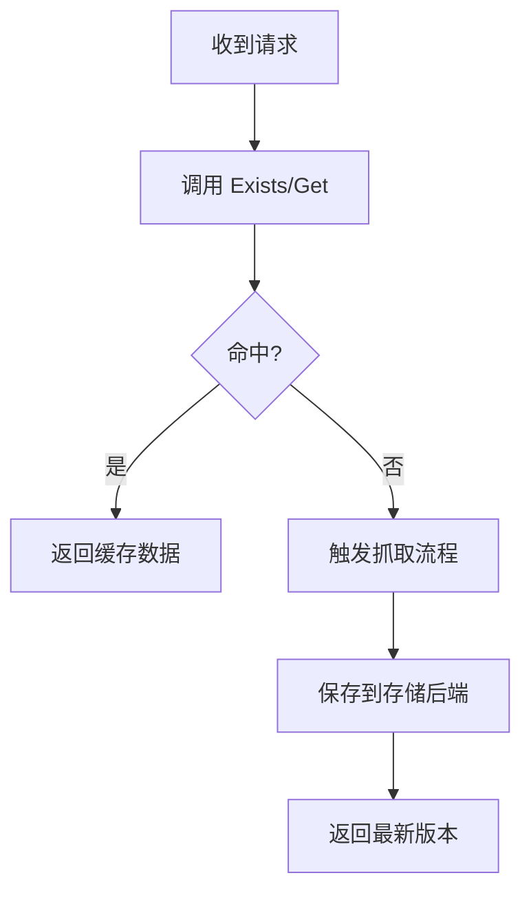
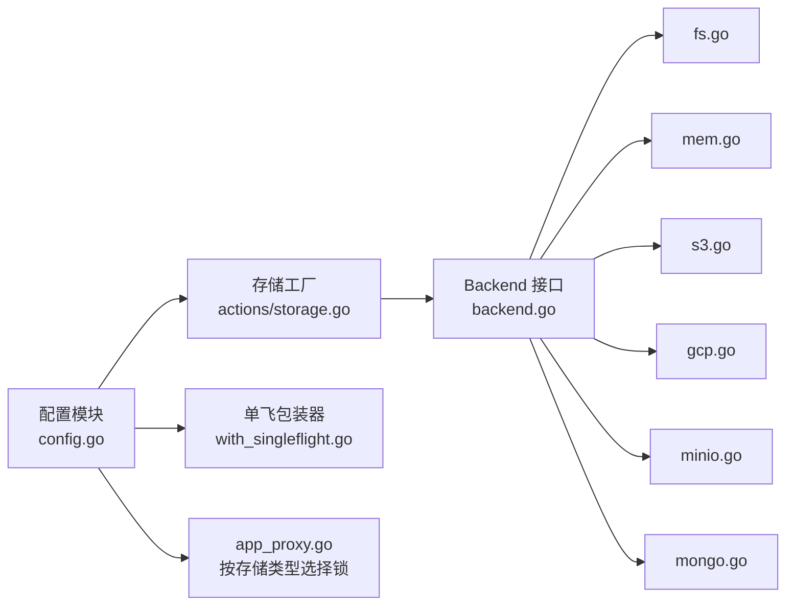

# 缓存策略

<cite>
**本文引用的文件**
- [cmd/proxy/actions/storage.go](file://cmd/proxy/actions/storage.go)
- [pkg/storage/backend.go](file://pkg/storage/backend.go)
- [pkg/storage/fs/fs.go](file://pkg/storage/fs/fs.go)
- [pkg/storage/mem/mem.go](file://pkg/storage/mem/mem.go)
- [pkg/storage/s3/s3.go](file://pkg/storage/s3/s3.go)
- [pkg/storage/gcp/gcp.go](file://pkg/storage/gcp/gcp.go)
- [pkg/storage/mongo/mongo.go](file://pkg/storage/mongo/mongo.go)
- [pkg/storage/minio/minio.go](file://pkg/storage/minio/minio.go)
- [pkg/storage/compliance/tests.go](file://pkg/storage/compliance/tests.go)
- [pkg/config/config.go](file://pkg/config/config.go)
- [pkg/config/singleflight.go](file://pkg/config/singleflight.go)
- [pkg/stash/with_singleflight.go](file://pkg/stash/with_singleflight.go)
- [cmd/proxy/actions/app_proxy.go](file://cmd/proxy/actions/app_proxy.go)
- [pkg/middleware/cache_control.go](file://pkg/middleware/cache_control.go)
- [pkg/observ/stats.go](file://pkg/observ/stats.go)
- [pkg/observ/observ.go](file://pkg/observ/observ.go)
- [docs/content/configuration/storage.md](file://docs/content/configuration/storage.md)
- [docs/content/configuration/prefill-disk-cache.md](file://docs/content/configuration/prefill-disk-cache.md)
</cite>

## 目录
1. [引言](#引言)
2. [项目结构](#项目结构)
3. [核心组件](#核心组件)
4. [架构总览](#架构总览)
5. [详细组件分析](#详细组件分析)
6. [依赖关系分析](#依赖关系分析)
7. [性能考量](#性能考量)
8. [故障排除指南](#故障排除指南)
9. [结论](#结论)
10. [附录](#附录)

## 引言
本文件系统性阐述 Athens 的多层缓存与一致性保障机制，覆盖内存缓存、磁盘缓存与远程对象存储（S3/GCS/Azure Blob/Mongo/MinIO 等）的协同工作方式；解释缓存命中/失效/更新策略；并发访问控制与单飞（SingleFlight）机制；缓存一致性与可用性保障；以及可观测性与性能优化建议。目标是帮助运维与开发者在不同部署场景下正确配置与调优缓存。

## 项目结构
围绕“存储后端”与“单飞/锁”两大维度组织：
- 存储后端：统一接口 Backend，具体实现包括内存、磁盘、S3、GCS、Azure Blob、Mongo、MinIO 等
- 单飞/锁：通过分布式锁或单飞包装器避免对上游重复抓取
- 配置：集中于配置模块，支持环境变量覆盖与默认值
- 可观测性：Prometheus/Stackdriver/Datadog 指标导出，Jaeger/Stackdriver/Datadog 链路追踪

图表来源
- [cmd/proxy/actions/storage.go](file://cmd/proxy/actions/storage.go#L24-L76)
- [pkg/storage/backend.go](file://pkg/storage/backend.go#L1-L10)
- [pkg/storage/fs/fs.go](file://pkg/storage/fs/fs.go#L1-L47)
- [pkg/storage/mem/mem.go](file://pkg/storage/mem/mem.go#L1-L27)
- [pkg/storage/s3/s3.go](file://pkg/storage/s3/s3.go#L1-L99)
- [pkg/storage/gcp/gcp.go](file://pkg/storage/gcp/gcp.go#L1-L75)
- [pkg/storage/mongo/mongo.go](file://pkg/storage/mongo/mongo.go#L1-L121)
- [pkg/storage/minio/minio.go](file://pkg/storage/minio/minio.go#L1-L66)
- [pkg/stash/with_singleflight.go](file://pkg/stash/with_singleflight.go#L1-L68)
- [cmd/proxy/actions/app_proxy.go](file://cmd/proxy/actions/app_proxy.go#L203-L220)
- [pkg/config/config.go](file://pkg/config/config.go#L1-L376)
- [pkg/config/singleflight.go](file://pkg/config/singleflight.go#L1-L66)
- [pkg/observ/stats.go](file://pkg/observ/stats.go#L1-L110)
- [pkg/observ/observ.go](file://pkg/observ/observ.go#L1-L94)

章节来源
- [cmd/proxy/actions/storage.go](file://cmd/proxy/actions/storage.go#L24-L76)
- [pkg/config/config.go](file://pkg/config/config.go#L146-L213)

## 核心组件
- 统一存储接口 Backend：聚合 Lister、Getter、Saver、Deleter 能力，屏蔽底层差异
- 多后端实现：
  - 内存：基于内存文件系统，适合开发/测试
  - 磁盘：基于 afero 文件系统，持久化到本地目录
  - 对象存储：S3、GCS、Azure Blob、MinIO
  - 数据库：Mongo
- 单飞/锁：WithSingleflight 包装器，结合 Redis/Etcd/GCS/Azure Blob 等实现分布式锁，避免并发重复抓取
- 配置：集中于 Config 结构体，支持默认值、环境变量覆盖、校验与存储/索引类型验证

章节来源
- [pkg/storage/backend.go](file://pkg/storage/backend.go#L1-L10)
- [pkg/storage/fs/fs.go](file://pkg/storage/fs/fs.go#L26-L39)
- [pkg/storage/mem/mem.go](file://pkg/storage/mem/mem.go#L12-L27)
- [pkg/storage/s3/s3.go](file://pkg/storage/s3/s3.go#L27-L74)
- [pkg/storage/gcp/gcp.go](file://pkg/storage/gcp/gcp.go#L16-L47)
- [pkg/storage/mongo/mongo.go](file://pkg/storage/mongo/mongo.go#L19-L50)
- [pkg/storage/minio/minio.go](file://pkg/storage/minio/minio.go#L14-L56)
- [pkg/stash/with_singleflight.go](file://pkg/stash/with_singleflight.go#L12-L68)
- [pkg/config/config.go](file://pkg/config/config.go#L22-L66)

## 架构总览
Athens 的缓存由三层构成：
- 应用层：下载处理器根据模块/版本请求，先查存储后端，未命中则触发抓取流程
- 存储层：Backend 抽象下的任意后端（内存/磁盘/S3/GCS/Azure Blob/Mongo/MinIO）
- 协同层：单飞/锁确保同一模块版本在同一时间仅抓取一次，其余并发请求等待结果

图表来源
- [pkg/stash/with_singleflight.go](file://pkg/stash/with_singleflight.go#L37-L67)
- [cmd/proxy/actions/storage.go](file://cmd/proxy/actions/storage.go#L24-L76)
- [pkg/storage/backend.go](file://pkg/storage/backend.go#L1-L10)

## 详细组件分析

### 存储后端与路径布局
- 文件系统布局：模块根目录下按版本子目录存放，便于快速定位与清理
- 磁盘/内存后端均基于 afero 抽象，可替换为 OS 或内存文件系统
- 对象存储后端以桶/容器为单位，键名通常采用模块/版本路径

图表来源
- [pkg/storage/fs/fs.go](file://pkg/storage/fs/fs.go#L26-L39)

章节来源
- [pkg/storage/fs/fs.go](file://pkg/storage/fs/fs.go#L13-L39)
- [pkg/storage/mem/mem.go](file://pkg/storage/mem/mem.go#L12-L27)

### 单飞/锁与并发控制
- WithSingleflight：同一模块版本在同一时刻仅执行一次抓取，其他请求阻塞等待首个结果
- 分布式锁：根据存储类型选择 Redis/Etcd/GCS/Azure Blob 等作为锁后端，确保跨节点一致性
- 锁配置：TTL/超时/最大重试等参数可调，默认值见配置模块

图表来源
- [pkg/stash/with_singleflight.go](file://pkg/stash/with_singleflight.go#L12-L68)

章节来源
- [pkg/stash/with_singleflight.go](file://pkg/stash/with_singleflight.go#L12-L68)
- [cmd/proxy/actions/app_proxy.go](file://cmd/proxy/actions/app_proxy.go#L203-L220)
- [pkg/config/singleflight.go](file://pkg/config/singleflight.go#L1-L66)

### 缓存命中/失效/更新策略
- 命中：优先从存储后端读取 Info/GoMod/Zip；若存在直接返回
- 失效：删除操作后，后续 Exists/Get 应返回不存在
- 更新：新版本抓取成功后写入存储，旧版本可保留或按策略清理

图表来源
- [pkg/storage/compliance/tests.go](file://pkg/storage/compliance/tests.go#L16-L28)
- [pkg/storage/compliance/tests.go](file://pkg/storage/compliance/tests.go#L131-L155)
- [pkg/storage/compliance/tests.go](file://pkg/storage/compliance/tests.go#L190-L208)

章节来源
- [pkg/storage/compliance/tests.go](file://pkg/storage/compliance/tests.go#L16-L28)
- [pkg/storage/compliance/tests.go](file://pkg/storage/compliance/tests.go#L102-L129)
- [pkg/storage/compliance/tests.go](file://pkg/storage/compliance/tests.go#L131-L155)
- [pkg/storage/compliance/tests.go](file://pkg/storage/compliance/tests.go#L190-L208)

### 远程存储后端（S3/GCS/Azure Blob/MinIO/Mongo）
- S3：支持自定义 Endpoint、凭据链、路径风格等
- GCS：支持服务账号密钥、自动凭据探测
- Azure Blob：支持账户密钥/托管身份/资源标识符
- MinIO：兼容 S3 接口，支持 TrimHTTP 去除协议前缀
- Mongo：GridFS 文件命名规则，数据库/集合初始化与索引

章节来源
- [pkg/storage/s3/s3.go](file://pkg/storage/s3/s3.go#L18-L74)
- [pkg/storage/gcp/gcp.go](file://pkg/storage/gcp/gcp.go#L16-L47)
- [pkg/storage/mongo/mongo.go](file://pkg/storage/mongo/mongo.go#L19-L72)
- [pkg/storage/minio/minio.go](file://pkg/storage/minio/minio.go#L14-L56)

### 缓存配置参数
- 存储类型与后端配置：StorageType、各后端配置项（如磁盘 RootPath、S3/Bucket/Region、GCS/Bucket、AzureBlob/Account/Container 等）
- 单飞/锁配置：SingleFlightType、Redis/Etcd/GCP/AzureBlob 等后端配置及 TTL/超时/重试
- 默认值与环境变量覆盖：参见默认配置与 envOverride 流程

章节来源
- [pkg/config/config.go](file://pkg/config/config.go#L146-L213)
- [pkg/config/config.go](file://pkg/config/config.go#L256-L273)
- [pkg/config/singleflight.go](file://pkg/config/singleflight.go#L1-L66)
- [docs/content/configuration/storage.md](file://docs/content/configuration/storage.md#L41-L69)
- [docs/content/configuration/storage.md](file://docs/content/configuration/storage.md#L313-L353)
- [docs/content/configuration/prefill-disk-cache.md](file://docs/content/configuration/prefill-disk-cache.md#L1-L112)

### 缓存一致性与可用性
- 单飞/锁：避免同时向上游抓取同一模块版本，降低上游压力与数据不一致风险
- 分布式锁后端选择：根据部署环境选择 Redis/Etcd/GCS/Azure Blob，确保跨节点可见
- 存储后端幂等：保存/删除/列举等操作需满足幂等与边界条件（合规测试覆盖）

章节来源
- [pkg/stash/with_singleflight.go](file://pkg/stash/with_singleflight.go#L12-L68)
- [cmd/proxy/actions/app_proxy.go](file://cmd/proxy/actions/app_proxy.go#L203-L220)
- [pkg/storage/compliance/tests.go](file://pkg/storage/compliance/tests.go#L16-L28)

### 缓存监控与可观测性
- 指标导出：Prometheus/Stackdriver/Datadog，注册标准 HTTP 观察视图
- 链路追踪：Jaeger/Datadog/Stackdriver，StartSpan 包裹关键路径
- 指标端点：/metrics（Prometheus）

章节来源
- [pkg/observ/stats.go](file://pkg/observ/stats.go#L17-L46)
- [pkg/observ/stats.go](file://pkg/observ/stats.go#L92-L110)
- [pkg/observ/observ.go](file://pkg/observ/observ.go#L14-L31)
- [pkg/observ/observ.go](file://pkg/observ/observ.go#L89-L94)

## 依赖关系分析
- 存储后端统一实现 Backend 接口，具体实现由配置驱动
- 单飞包装器与分布式锁后端解耦，按存储类型动态选择
- 配置模块贯穿加载、校验、默认值与环境变量覆盖

图表来源
- [pkg/config/config.go](file://pkg/config/config.go#L1-L376)
- [cmd/proxy/actions/storage.go](file://cmd/proxy/actions/storage.go#L24-L76)
- [pkg/storage/backend.go](file://pkg/storage/backend.go#L1-L10)
- [pkg/storage/fs/fs.go](file://pkg/storage/fs/fs.go#L1-L47)
- [pkg/storage/mem/mem.go](file://pkg/storage/mem/mem.go#L1-L27)
- [pkg/storage/s3/s3.go](file://pkg/storage/s3/s3.go#L1-L99)
- [pkg/storage/gcp/gcp.go](file://pkg/storage/gcp/gcp.go#L1-L75)
- [pkg/storage/minio/minio.go](file://pkg/storage/minio/minio.go#L1-L66)
- [pkg/storage/mongo/mongo.go](file://pkg/storage/mongo/mongo.go#L1-L121)
- [pkg/stash/with_singleflight.go](file://pkg/stash/with_singleflight.go#L1-L68)
- [cmd/proxy/actions/app_proxy.go](file://cmd/proxy/actions/app_proxy.go#L203-L220)

章节来源
- [pkg/config/config.go](file://pkg/config/config.go#L1-L376)
- [cmd/proxy/actions/storage.go](file://cmd/proxy/actions/storage.go#L24-L76)

## 性能考量
- 并发抓取控制：启用单飞/锁，显著降低上游负载与网络抖动影响
- 存储后端选择：
  - 低延迟场景优先本地磁盘或内存（开发/测试）
  - 生产推荐就近的对象存储（S3/GCS/Azure Blob），具备高可用与扩展性
  - 数据库后端适合需要复杂查询或审计的场景
- 索引与列表：合理使用 List/Catalog 能力，避免全量扫描
- 指标与采样：开启 Prometheus 指标导出，关注延迟分布与错误率

## 故障排除指南
- 存储根目录不存在：磁盘后端在 NewStorage 时会校验根目录存在性并报错
- 配置校验失败：StorageType 未知或对应后端配置缺失会导致校验失败
- 单飞/锁不可用：确认 SingleFlightType 与对应后端配置匹配，并检查网络连通性
- 缓存未命中：确认模块/版本键是否正确，检查存储后端是否已保存
- 指标无输出：确认 StatsExporter 配置与 /metrics 端点注册

章节来源
- [pkg/storage/fs/fs.go](file://pkg/storage/fs/fs.go#L26-L39)
- [pkg/config/config.go](file://pkg/config/config.go#L282-L333)
- [cmd/proxy/actions/app_proxy.go](file://cmd/proxy/actions/app_proxy.go#L203-L220)
- [pkg/observ/stats.go](file://pkg/observ/stats.go#L17-L46)

## 结论
Athens 的缓存体系通过统一的 Backend 接口与多后端实现，结合单飞/锁机制，在保证一致性的同时有效降低上游压力。合理的配置与可观测性设置是稳定运行的关键。生产部署建议优先使用就近的对象存储后端，并配合单飞/锁与指标监控进行持续优化。

## 附录
- 预填充磁盘缓存：离线环境下可通过预填充磁盘缓存提升首次命中率
- 缓存控制中间件：可设置 HTTP Cache-Control 头，辅助边缘缓存与浏览器缓存策略

章节来源
- [docs/content/configuration/prefill-disk-cache.md](file://docs/content/configuration/prefill-disk-cache.md#L1-L112)
- [pkg/middleware/cache_control.go](file://pkg/middleware/cache_control.go#L1-L23)