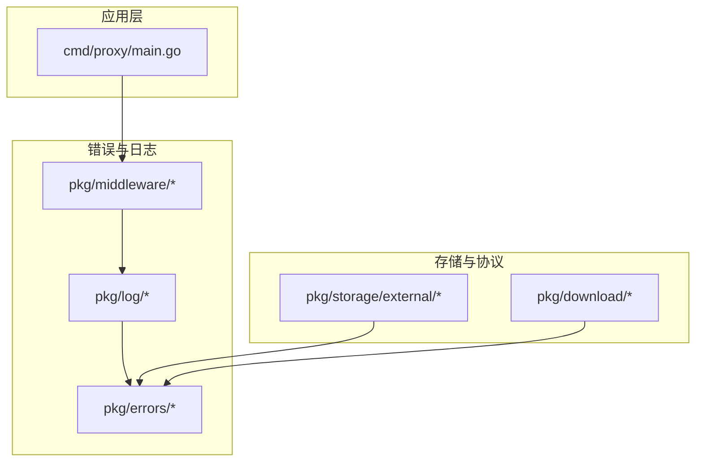
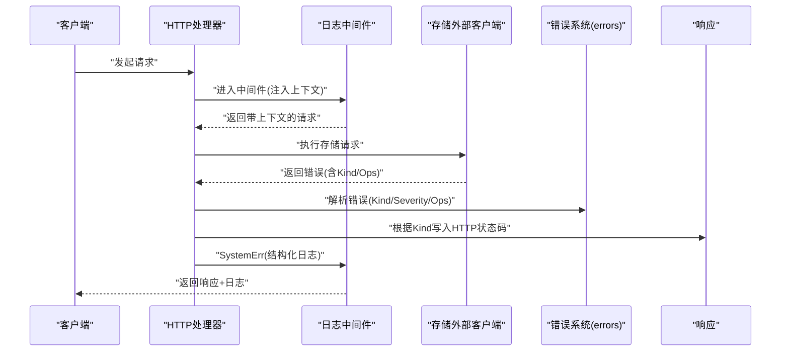
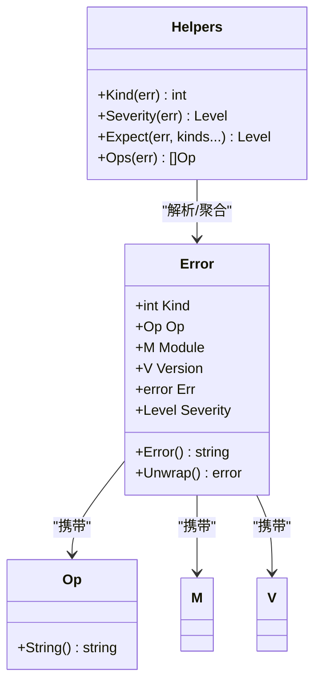
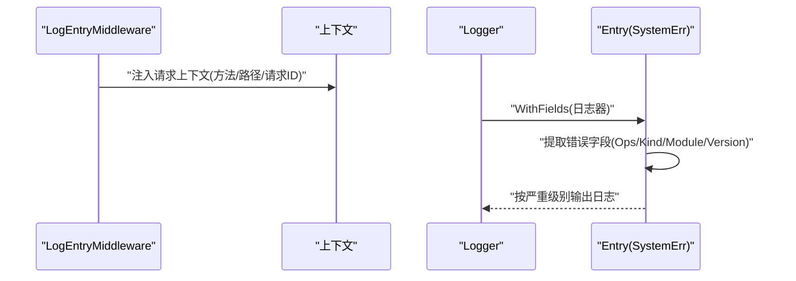
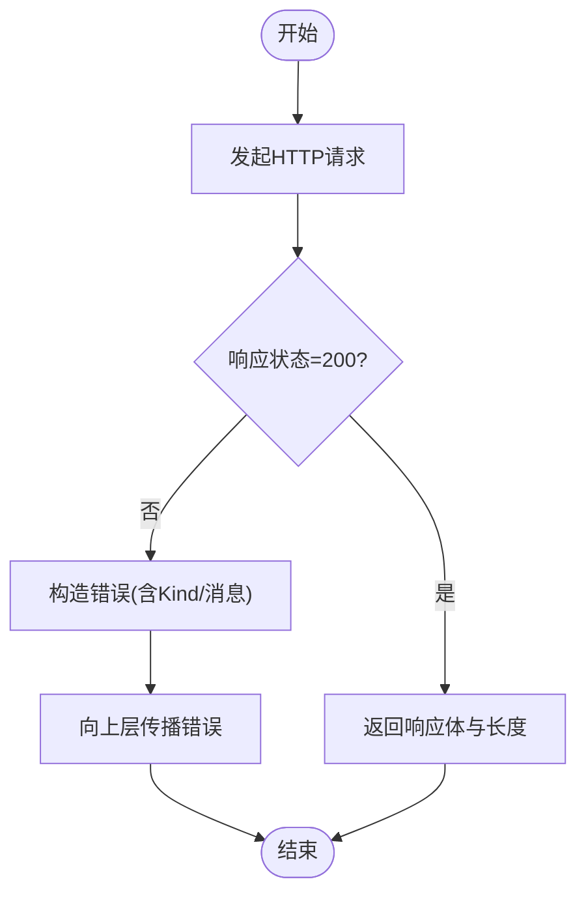
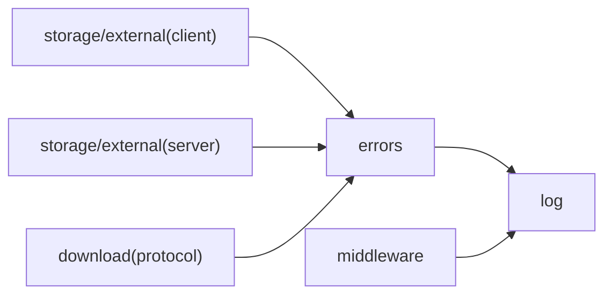
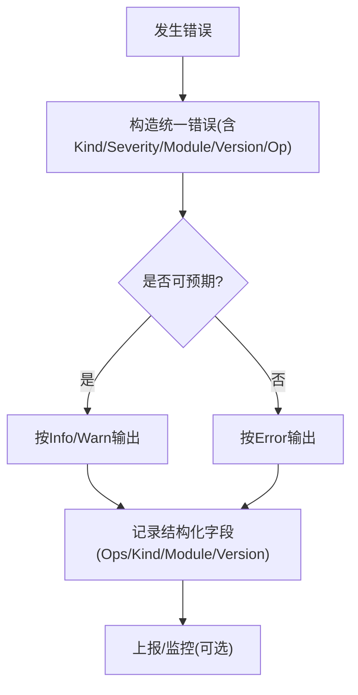

# 错误处理

<cite>
**本文引用的文件**
- [pkg/errors/errors.go](file://pkg/errors/errors.go)
- [pkg/errors/kinds.go](file://pkg/errors/kinds.go)
- [pkg/errors/command.go](file://pkg/errors/command.go)
- [pkg/errors/gocmd.go](file://pkg/errors/gocmd.go)
- [pkg/log/log.go](file://pkg/log/log.go)
- [pkg/log/entry.go](file://pkg/log/entry.go)
- [pkg/log/format.go](file://pkg/log/format.go)
- [pkg/middleware/log_entry.go](file://pkg/middleware/log_entry.go)
- [pkg/middleware/request.go](file://pkg/middleware/request.go)
- [cmd/proxy/main.go](file://cmd/proxy/main.go)
- [pkg/storage/external/client.go](file://pkg/storage/external/client.go)
- [pkg/storage/external/server.go](file://pkg/storage/external/server.go)
- [pkg/download/protocol_test.go](file://pkg/download/protocol_test.go)
- [pkg/config/timeout.go](file://pkg/config/timeout.go)
</cite>

## 目录
1. [简介](#简介)
2. [项目结构](#项目结构)
3. [核心组件](#核心组件)
4. [架构总览](#架构总览)
5. [详细组件分析](#详细组件分析)
6. [依赖分析](#依赖分析)
7. [性能考虑](#性能考虑)
8. [故障排除指南](#故障排除指南)
9. [结论](#结论)
10. [附录](#附录)

## 简介
本文件系统化梳理 Athens 的错误处理与异常管理机制，覆盖错误分类、传播、恢复与日志记录、上报与监控的关键路径。重点解释网络错误、存储错误、协议错误与超时错误的处理流程；给出错误代码参考、常见问题定位方法与最佳实践，并分析性能影响。

## 项目结构
围绕错误处理的相关代码主要分布在以下模块：
- 错误模型与工具：pkg/errors
- 日志与上下文：pkg/log、pkg/middleware
- 应用入口与信号处理：cmd/proxy/main.go
- 外部存储交互：pkg/storage/external
- 下载协议与测试：pkg/download

图表来源
- [pkg/errors/errors.go](file://pkg/errors/errors.go#L1-L201)
- [pkg/log/log.go](file://pkg/log/log.go#L1-L48)
- [pkg/middleware/log_entry.go](file://pkg/middleware/log_entry.go#L1-L29)
- [cmd/proxy/main.go](file://cmd/proxy/main.go#L1-L128)
- [pkg/storage/external/client.go](file://pkg/storage/external/client.go#L158-L190)
- [pkg/storage/external/server.go](file://pkg/storage/external/server.go#L1-L57)

章节来源
- [pkg/errors/errors.go](file://pkg/errors/errors.go#L1-L201)
- [pkg/log/log.go](file://pkg/log/log.go#L1-L48)
- [pkg/middleware/log_entry.go](file://pkg/middleware/log_entry.go#L1-L29)
- [cmd/proxy/main.go](file://cmd/proxy/main.go#L1-L128)
- [pkg/storage/external/client.go](file://pkg/storage/external/client.go#L158-L190)
- [pkg/storage/external/server.go](file://pkg/storage/external/server.go#L1-L57)

## 核心组件
- 错误类型与分类
  - 使用 HTTP 状态码作为错误种类枚举，便于与 HTTP 层语义一致。
  - 支持错误嵌套与递归解析，便于追踪调用链。
- 错误构造器
  - 统一通过构造函数创建带操作名、模块、版本、严重级别与种类的错误对象。
- 日志系统
  - 基于 logrus，支持多云格式适配与上下文字段注入。
  - 提供 SystemErr 方法，自动提取错误字段并按严重级别输出。
- 中间件
  - 请求级日志上下文注入，统一记录请求方法、路径与请求 ID。
  - 开发期请求日志输出，辅助调试。

章节来源
- [pkg/errors/errors.go](file://pkg/errors/errors.go#L12-L22)
- [pkg/errors/errors.go](file://pkg/errors/errors.go#L88-L124)
- [pkg/errors/errors.go](file://pkg/errors/errors.go#L158-L180)
- [pkg/log/log.go](file://pkg/log/log.go#L17-L27)
- [pkg/log/entry.go](file://pkg/log/entry.go#L37-L55)
- [pkg/middleware/log_entry.go](file://pkg/middleware/log_entry.go#L14-L28)

## 架构总览
Athens 的错误处理遵循“统一建模 + 分类传播 + 结构化日志”的设计。错误在各层以统一的 Error 类型承载，通过 Kind 与 Ops 进行分类与栈追踪；日志系统在中间件注入上下文后，由 Logger/SystemErr 将错误映射为结构化字段并按严重级别输出。

图表来源
- [pkg/middleware/log_entry.go](file://pkg/middleware/log_entry.go#L14-L28)
- [pkg/storage/external/client.go](file://pkg/storage/external/client.go#L158-L190)
- [pkg/errors/errors.go](file://pkg/errors/errors.go#L158-L180)
- [pkg/log/entry.go](file://pkg/log/entry.go#L37-L55)

## 详细组件分析

### 错误模型与分类
- 错误种类
  - 基于 HTTP 状态码定义常见错误类别，如未找到、请求错误、内部错误、冲突、限流、未实现、重定向、网关超时等。
- 错误构造
  - 构造函数接收操作名与可选参数（错误、字符串、模块、版本、严重级别、种类），若未显式提供底层错误则以种类文本作为默认消息。
- 严重级别与期望值
  - 严重级别可递归继承自嵌套错误；提供 Expect 辅助函数用于区分“预期错误”与“非预期错误”，以便选择 Info/Warn 等较低级别日志。
- 栈追踪
  - Ops 聚合当前错误与其嵌套错误的操作序列，形成可查询的调用链。

图表来源
- [pkg/errors/errors.go](file://pkg/errors/errors.go#L24-L41)
- [pkg/errors/errors.go](file://pkg/errors/errors.go#L88-L124)
- [pkg/errors/errors.go](file://pkg/errors/errors.go#L126-L180)

章节来源
- [pkg/errors/errors.go](file://pkg/errors/errors.go#L12-L22)
- [pkg/errors/errors.go](file://pkg/errors/errors.go#L88-L124)
- [pkg/errors/errors.go](file://pkg/errors/errors.go#L126-L180)

### 日志与上下文
- 日志器
  - 支持按云平台选择格式化器（如 GCP JSON 字段映射），并按配置设置日志级别。
- 上下文注入
  - 中间件在请求进入时注入 HTTP 方法、路径与请求 ID 等字段，便于后续日志关联。
- 结构化错误日志
  - SystemErr 自动提取 operation、kind、module、version、ops 等字段，并依据 Severity 输出对应级别的日志。

图表来源
- [pkg/middleware/log_entry.go](file://pkg/middleware/log_entry.go#L14-L28)
- [pkg/log/log.go](file://pkg/log/log.go#L17-L27)
- [pkg/log/entry.go](file://pkg/log/entry.go#L37-L55)

章节来源
- [pkg/log/log.go](file://pkg/log/log.go#L17-L27)
- [pkg/log/entry.go](file://pkg/log/entry.go#L37-L55)
- [pkg/middleware/log_entry.go](file://pkg/middleware/log_entry.go#L14-L28)

### 错误传播与恢复

#### 网络错误
- 客户端侧
  - 外部存储客户端在请求失败或状态码非 200 时，构造错误并携带状态码，便于上层按 Kind 决策。
- 服务端侧
  - 外部存储服务端将错误转换为 HTTP 状态码返回，确保客户端能正确识别错误类型。

图表来源
- [pkg/storage/external/client.go](file://pkg/storage/external/client.go#L158-L190)
- [pkg/storage/external/server.go](file://pkg/storage/external/server.go#L23-L57)

章节来源
- [pkg/storage/external/client.go](file://pkg/storage/external/client.go#L158-L190)
- [pkg/storage/external/server.go](file://pkg/storage/external/server.go#L23-L57)

#### 存储错误
- 存储层错误通常由具体后端抛出，错误系统将其包装为统一错误类型，保留底层错误以便诊断。
- 日志系统在 SystemErr 中自动附加模块、版本与操作链，便于定位问题。

章节来源
- [pkg/log/entry.go](file://pkg/log/entry.go#L37-L55)

#### 协议错误
- 下载协议在不同模式（同步、异步、重定向等）下对错误的处理存在差异。测试用例验证了当上游获取失败时，协议仍能返回合理结果或按模式行为处理。
- 对于“异步重定向”模式，错误会被强制映射为未找到，以避免泄露内部状态。

章节来源
- [pkg/download/protocol_test.go](file://pkg/download/protocol_test.go#L446-L467)

#### 超时错误
- 配置层提供通用超时配置结构，便于在各组件中统一设置超时。
- 实际使用中可在关键调用处设置 context 超时，结合错误系统的 KindGatewayTimeout 等分类进行处理。

章节来源
- [pkg/config/timeout.go](file://pkg/config/timeout.go#L5-L18)

### 错误代码参考
- 未找到：KindNotFound
- 请求错误：KindBadRequest
- 内部错误：KindUnexpected
- 已存在：KindAlreadyExists
- 限流：KindRateLimit
- 未实现：KindNotImplemented
- 重定向：KindRedirect
- 网关超时：KindGatewayTimeout

章节来源
- [pkg/errors/errors.go](file://pkg/errors/errors.go#L12-L22)

### 特定场景辅助判断
- 无子进程等待错误（可安全忽略）
  - 用于 Go 命令运行时的特定系统错误提示，可作为“预期低风险”错误处理。
- Go 仓库不存在错误
  - 用于识别上游仓库不存在的场景，便于快速区分网络错误与资源不存在。

章节来源
- [pkg/errors/command.go](file://pkg/errors/command.go#L5-L15)
- [pkg/errors/gocmd.go](file://pkg/errors/gocmd.go#L7-L11)

## 依赖分析
- 错误系统与日志系统耦合紧密：日志器在 SystemErr 中直接消费错误的 Kind、Severity、Ops 等字段，形成结构化输出。
- 中间件在请求生命周期早期注入上下文，使后续日志具备统一的请求维度信息。
- 外部存储客户端/服务端在错误传播中承担“桥接”角色，将底层网络错误转换为统一错误类型并映射为 HTTP 状态码。

图表来源
- [pkg/errors/errors.go](file://pkg/errors/errors.go#L1-L201)
- [pkg/log/entry.go](file://pkg/log/entry.go#L37-L55)
- [pkg/middleware/log_entry.go](file://pkg/middleware/log_entry.go#L14-L28)
- [pkg/storage/external/client.go](file://pkg/storage/external/client.go#L158-L190)
- [pkg/storage/external/server.go](file://pkg/storage/external/server.go#L23-L57)

章节来源
- [pkg/errors/errors.go](file://pkg/errors/errors.go#L1-L201)
- [pkg/log/entry.go](file://pkg/log/entry.go#L37-L55)
- [pkg/middleware/log_entry.go](file://pkg/middleware/log_entry.go#L14-L28)
- [pkg/storage/external/client.go](file://pkg/storage/external/client.go#L158-L190)
- [pkg/storage/external/server.go](file://pkg/storage/external/server.go#L23-L57)

## 性能考虑
- 错误构造与日志输出
  - 错误构造为轻量操作，主要成本在于日志格式化与字段拼装。建议在高并发场景下避免在热路径中频繁构造复杂错误对象。
- 严重级别判定
  - Severity 递归查找嵌套错误的严重级别，深度过深时会增加少量开销。建议保持错误嵌套层级合理。
- 日志级别与输出
  - 生产环境建议使用 JSON 格式与合适的日志级别，减少控制台格式化开销；开发环境可使用彩色格式提升可读性。
- 超时与重试
  - 合理设置超时与重试策略，避免长时间阻塞导致资源占用上升；对可预期的超时错误使用 KindGatewayTimeout 进行分类处理。

## 故障排除指南
- 如何识别错误类型
  - 使用错误系统的 Kind 与 KindText 获取人类可读的错误描述；结合 Ops 查看调用链。
- 如何降低噪音
  - 对预期错误使用 Expect 判断，将 Info/Warn 级别用于非异常场景，Error 级别用于真正异常。
- 如何定位请求
  - 通过中间件注入的请求 ID 与路径字段，在日志中快速关联请求与错误。
- 常见问题排查步骤
  - 网络错误：检查外部存储服务端可达性与状态码映射；确认客户端是否正确处理非 200 响应。
  - 存储错误：查看存储后端日志与权限；确认模块/版本路径是否正确。
  - 协议错误：核对下载模式配置与行为；对异步/重定向模式下的 404 行为进行验证。
  - 超时错误：检查超时配置与上下文超时设置；评估上游响应时间与重试策略。

章节来源
- [pkg/errors/errors.go](file://pkg/errors/errors.go#L126-L180)
- [pkg/middleware/log_entry.go](file://pkg/middleware/log_entry.go#L14-L28)
- [pkg/storage/external/client.go](file://pkg/storage/external/client.go#L158-L190)
- [pkg/storage/external/server.go](file://pkg/storage/external/server.go#L23-L57)
- [pkg/download/protocol_test.go](file://pkg/download/protocol_test.go#L446-L467)

## 结论
Athens 的错误处理体系以统一的错误模型为核心，结合结构化日志与中间件上下文，实现了可追踪、可分类、可监控的错误管理能力。通过合理的错误分类与严重级别判定，配合清晰的调用链追踪，能够在复杂分布式环境中快速定位问题并采取针对性恢复措施。

## 附录

### 最佳实践
- 在所有错误路径使用统一构造器创建错误，明确操作名与模块/版本信息。
- 对可预期错误使用 Expect 与 Info/Warn 级别，避免污染错误日志。
- 在关键调用处设置超时并结合错误分类进行降级处理。
- 使用中间件统一注入请求上下文，确保日志具备一致的请求维度。

### 错误处理流程图（概念）
