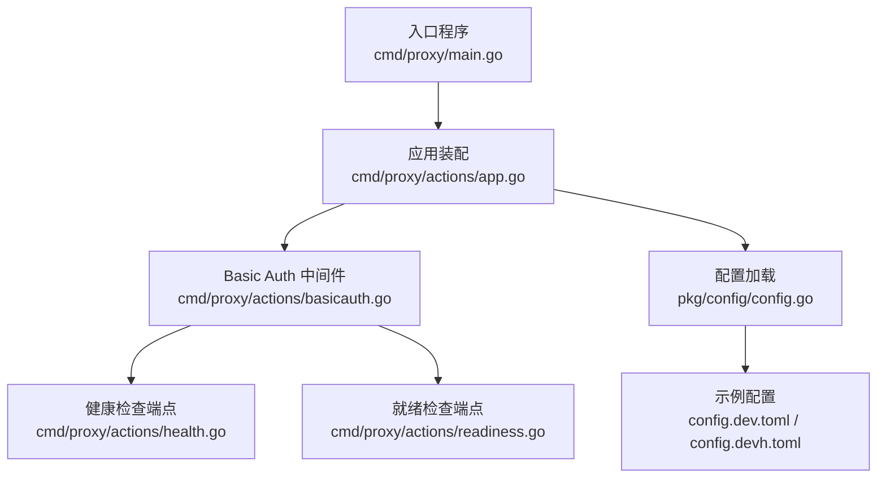
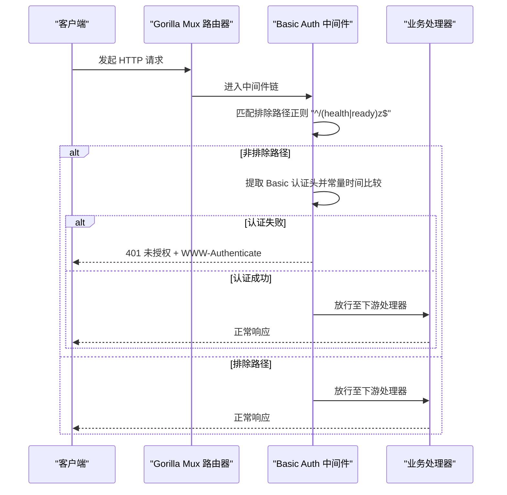
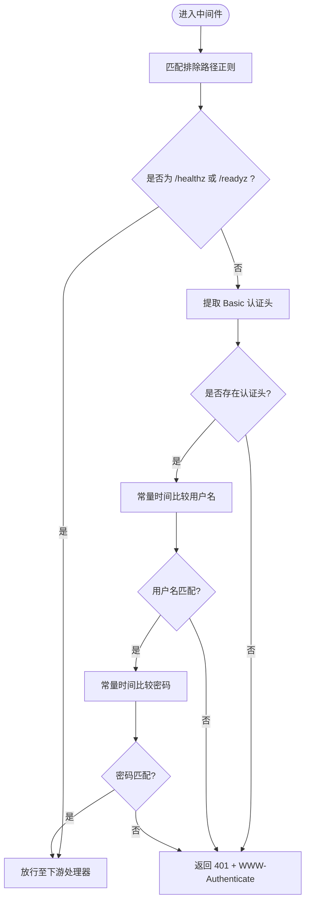
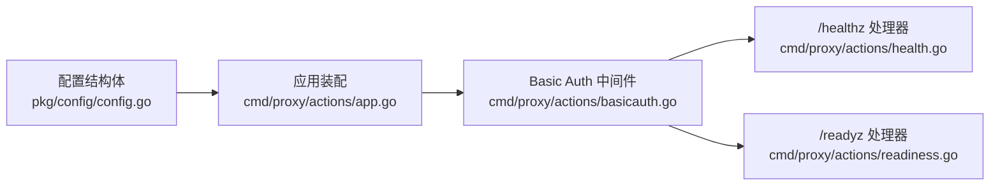

# Basic Auth 认证

<cite>
**本文引用的文件**
- [cmd/proxy/actions/basicauth.go](file://cmd/proxy/actions/basicauth.go)
- [cmd/proxy/actions/basicauth_test.go](file://cmd/proxy/actions/basicauth_test.go)
- [cmd/proxy/actions/app.go](file://cmd/proxy/actions/app.go)
- [pkg/config/config.go](file://pkg/config/config.go)
- [cmd/proxy/main.go](file://cmd/proxy/main.go)
- [config.dev.toml](file://config.dev.toml)
- [config.devh.toml](file://config.devh.toml)
- [cmd/proxy/actions/health.go](file://cmd/proxy/actions/health.go)
- [cmd/proxy/actions/readiness.go](file://cmd/proxy/actions/readiness.go)
</cite>

## 目录
1. [简介](#简介)
2. [项目结构](#项目结构)
3. [核心组件](#核心组件)
4. [架构总览](#架构总览)
5. [组件详解](#组件详解)
6. [依赖关系分析](#依赖关系分析)
7. [性能考量](#性能考量)
8. [故障排查指南](#故障排查指南)
9. [结论](#结论)
10. [附录](#附录)

## 简介
本文件系统性阐述 Athens 中 HTTP Basic Authentication 的实现与使用，涵盖以下要点：
- 用户名/密码验证算法与常量时间比较（防时序攻击）
- 认证中间件工作流（路径排除规则、认证头处理、错误响应）
- 配置方式（配置文件与环境变量）
- 不同部署环境下的启用与配置建议
- 安全最佳实践、常见问题排查与性能优化建议

## 项目结构
Basic Auth 相关代码集中在代理入口的动作层与配置层，核心文件如下：
- 动作层中间件：cmd/proxy/actions/basicauth.go
- 应用装配：cmd/proxy/actions/app.go
- 配置解析与环境变量覆盖：pkg/config/config.go
- 入口程序加载配置并启动服务：cmd/proxy/main.go
- 示例配置文件：config.dev.toml、config.devh.toml
- 健康检查与就绪检查端点：cmd/proxy/actions/health.go、cmd/proxy/actions/readiness.go

图表来源
- [cmd/proxy/main.go](file://cmd/proxy/main.go#L29-L128)
- [cmd/proxy/actions/app.go](file://cmd/proxy/actions/app.go#L23-L139)
- [cmd/proxy/actions/basicauth.go](file://cmd/proxy/actions/basicauth.go#L14-L27)
- [pkg/config/config.go](file://pkg/config/config.go#L215-L222)
- [cmd/proxy/actions/health.go](file://cmd/proxy/actions/health.go#L7-L10)
- [cmd/proxy/actions/readiness.go](file://cmd/proxy/actions/readiness.go#L9-L16)
- [config.dev.toml](file://config.dev.toml#L155-L171)
- [config.devh.toml](file://config.devh.toml#L139-L152)

章节来源
- [cmd/proxy/main.go](file://cmd/proxy/main.go#L29-L128)
- [cmd/proxy/actions/app.go](file://cmd/proxy/actions/app.go#L23-L139)
- [cmd/proxy/actions/basicauth.go](file://cmd/proxy/actions/basicauth.go#L14-L27)
- [pkg/config/config.go](file://pkg/config/config.go#L215-L222)
- [config.dev.toml](file://config.dev.toml#L155-L171)
- [config.devh.toml](file://config.devh.toml#L139-L152)

## 核心组件
- Basic Auth 中间件：负责拦截请求，判断路径是否需要认证、提取并校验 Basic 认证头，返回 401 未授权或放行。
- 配置解析：从配置文件与环境变量读取 BasicAuthUser/BasicAuthPass，并在应用装配阶段决定是否启用中间件。
- 应用装配：在路由构建完成后，按需将 Basic Auth 中间件注入到全局路由器。

章节来源
- [cmd/proxy/actions/basicauth.go](file://cmd/proxy/actions/basicauth.go#L14-L27)
- [pkg/config/config.go](file://pkg/config/config.go#L215-L222)
- [cmd/proxy/actions/app.go](file://cmd/proxy/actions/app.go#L95-L99)

## 架构总览
Basic Auth 在 Athens 中以 Gorilla Mux 中间件形式接入，遵循“先匹配排除路径，再进行认证”的策略；认证失败时设置 WWW-Authenticate 头并返回 401。

图表来源
- [cmd/proxy/actions/basicauth.go](file://cmd/proxy/actions/basicauth.go#L11-L27)
- [cmd/proxy/actions/basicauth.go](file://cmd/proxy/actions/basicauth.go#L29-L42)
- [cmd/proxy/actions/health.go](file://cmd/proxy/actions/health.go#L7-L10)
- [cmd/proxy/actions/readiness.go](file://cmd/proxy/actions/readiness.go#L9-L16)

## 组件详解

### Basic Auth 中间件实现
- 路径排除规则：使用正则 "^/(health|ready)z$" 排除 /healthz 与 /readyz，避免健康检查被阻断。
- 认证头处理：通过请求对象的 BasicAuth 方法提取用户名与密码；若无认证头则直接判定失败。
- 常量时间比较：使用 crypto/subtle 的 ConstantTimeCompare 对用户名与密码进行常量时间比较，降低时序侧信道风险。
- 错误响应：当认证失败时设置 WWW-Authenticate 头并返回 401 状态码。

图表来源
- [cmd/proxy/actions/basicauth.go](file://cmd/proxy/actions/basicauth.go#L11-L27)
- [cmd/proxy/actions/basicauth.go](file://cmd/proxy/actions/basicauth.go#L29-L42)

章节来源
- [cmd/proxy/actions/basicauth.go](file://cmd/proxy/actions/basicauth.go#L11-L27)
- [cmd/proxy/actions/basicauth.go](file://cmd/proxy/actions/basicauth.go#L29-L42)

### 认证中间件工作流程
- 路由装配阶段：应用装配函数根据配置决定是否启用 Basic Auth 中间件。
- 请求到达阶段：中间件先做路径排除判断，再执行认证逻辑。
- 错误响应：统一设置 WWW-Authenticate 头与 401 状态码，便于客户端弹出认证对话框。

章节来源
- [cmd/proxy/actions/app.go](file://cmd/proxy/actions/app.go#L95-L99)
- [cmd/proxy/actions/basicauth.go](file://cmd/proxy/actions/basicauth.go#L17-L21)

### 配置与启用方式
- 配置文件字段：
  - BasicAuthUser：Basic 认证用户名
  - BasicAuthPass：Basic 认证密码
- 环境变量覆盖：
  - BASIC_AUTH_USER
  - BASIC_AUTH_PASS
- 启用条件：当 BasicAuthUser 与 BasicAuthPass 均非空时，应用装配阶段会将 Basic Auth 中间件加入全局路由器。

章节来源
- [pkg/config/config.go](file://pkg/config/config.go#L43-L44)
- [pkg/config/config.go](file://pkg/config/config.go#L215-L222)
- [cmd/proxy/actions/app.go](file://cmd/proxy/actions/app.go#L95-L99)
- [config.dev.toml](file://config.dev.toml#L155-L171)
- [config.devh.toml](file://config.devh.toml#L139-L152)

### 测试用例与行为验证
- 测试场景覆盖：
  - 正确凭据：应返回 200
  - 错误用户名/密码：应返回 401
  - 排除路径 /healthz 与 /readyz：无论凭据正确与否均返回 200
- 测试工具：使用 httptest 构造请求并设置 BasicAuth，结合日志上下文验证行为。

章节来源
- [cmd/proxy/actions/basicauth_test.go](file://cmd/proxy/actions/basicauth_test.go#L15-L63)
- [cmd/proxy/actions/basicauth_test.go](file://cmd/proxy/actions/basicauth_test.go#L65-L88)

## 依赖关系分析
Basic Auth 的依赖关系清晰，主要涉及配置解析与应用装配两个环节：

图表来源
- [pkg/config/config.go](file://pkg/config/config.go#L215-L222)
- [cmd/proxy/actions/app.go](file://cmd/proxy/actions/app.go#L95-L99)
- [cmd/proxy/actions/basicauth.go](file://cmd/proxy/actions/basicauth.go#L14-L27)
- [cmd/proxy/actions/health.go](file://cmd/proxy/actions/health.go#L7-L10)
- [cmd/proxy/actions/readiness.go](file://cmd/proxy/actions/readiness.go#L9-L16)

章节来源
- [pkg/config/config.go](file://pkg/config/config.go#L215-L222)
- [cmd/proxy/actions/app.go](file://cmd/proxy/actions/app.go#L95-L99)
- [cmd/proxy/actions/basicauth.go](file://cmd/proxy/actions/basicauth.go#L14-L27)

## 性能考量
- 中间件开销极低：仅进行一次正则匹配与两次常量时间比较，CPU 开销可忽略。
- 常量时间比较：避免分支导致的微架构侧信道，提升安全性但对性能影响微乎其微。
- 排除路径：/healthz 与 /readyz 不受保护，减少不必要的认证开销。
- 建议：
  - 将 Basic Auth 与 TLS 结合使用，避免明文传输。
  - 在反向代理层（如 Nginx/Traefik）统一终止 TLS，减少后端压力。
  - 控制日志级别，避免记录敏感认证信息。

## 故障排查指南
- 401 未授权但凭据正确
  - 检查是否在排除路径（/healthz、/readyz）之外触发了认证。
  - 确认 BasicAuthUser/BasicAuthPass 是否正确写入配置且生效。
  - 确认客户端是否正确发送 Authorization 头（浏览器通常会自动弹窗）。
- 排除路径仍被认证
  - 检查路径是否符合正则 "^/(health|ready)z$"，注意大小写与末尾字符。
- 配置未生效
  - 确认环境变量 BASIC_AUTH_USER/BASIC_AUTH_PASS 是否覆盖了配置文件。
  - 确认应用装配阶段 BasicAuth 条件满足（用户与密码均非空）。
- 健康检查异常
  - /healthz 与 /readyz 应返回 200，不受 Basic Auth 影响。
  - 若返回 500，检查存储后端可用性与权限。

章节来源
- [cmd/proxy/actions/basicauth.go](file://cmd/proxy/actions/basicauth.go#L11-L27)
- [cmd/proxy/actions/basicauth.go](file://cmd/proxy/actions/basicauth.go#L29-L42)
- [cmd/proxy/actions/app.go](file://cmd/proxy/actions/app.go#L95-L99)
- [cmd/proxy/actions/health.go](file://cmd/proxy/actions/health.go#L7-L10)
- [cmd/proxy/actions/readiness.go](file://cmd/proxy/actions/readiness.go#L9-L16)

## 结论
Athens 的 Basic Auth 实现简洁可靠：通过路径排除、严格的常量时间比较与标准的 401 响应，既满足基本安全需求，又不影响健康检查与可观测性。结合配置文件与环境变量的灵活覆盖，可在多种部署环境中快速启用与调整。

## 附录

### 配置示例与使用方法
- 使用配置文件
  - 在配置文件中设置 BasicAuthUser 与 BasicAuthPass 字段。
  - 示例参考：config.dev.toml 与 config.devh.toml 中的 BasicAuth 相关段落。
- 使用环境变量
  - 设置 BASIC_AUTH_USER 与 BASIC_AUTH_PASS，优先级高于配置文件。
- 启用与验证
  - 应用启动后，所有非排除路径请求将要求 Basic 认证。
  - /healthz 与 /readyz 保持开放，便于健康检查与就绪探测。

章节来源
- [config.dev.toml](file://config.dev.toml#L155-L171)
- [config.devh.toml](file://config.devh.toml#L139-L152)
- [pkg/config/config.go](file://pkg/config/config.go#L215-L222)
- [cmd/proxy/actions/app.go](file://cmd/proxy/actions/app.go#L95-L99)