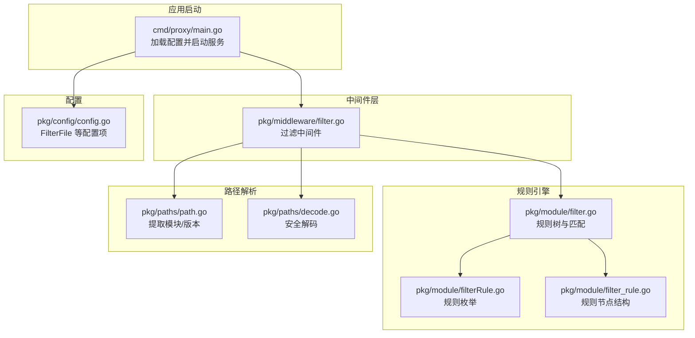
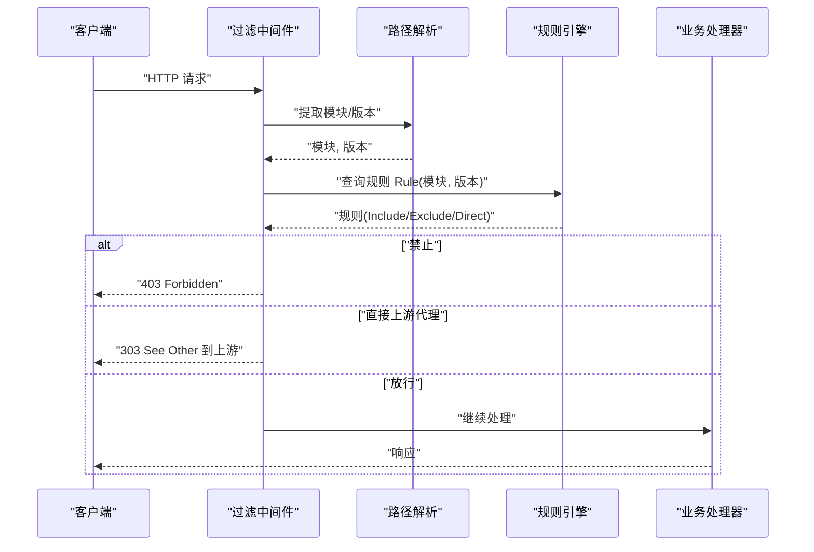
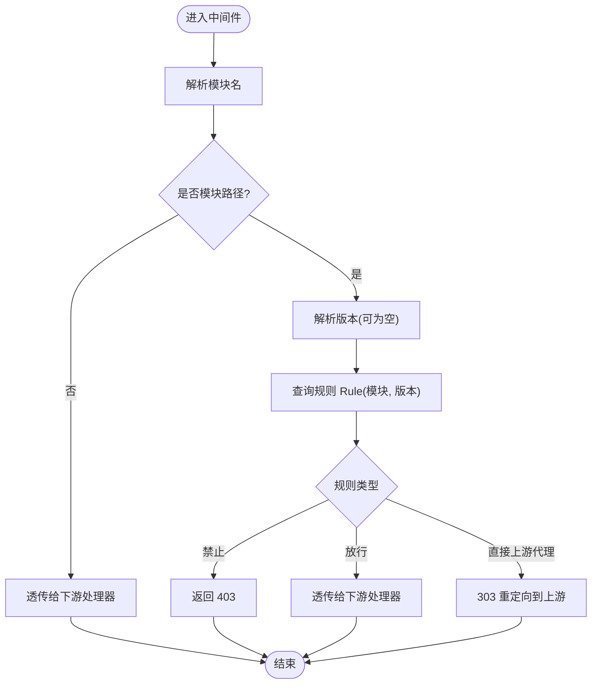
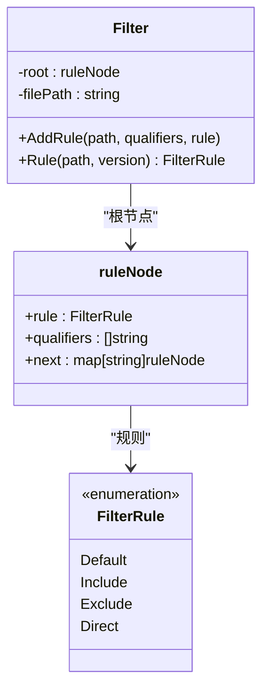
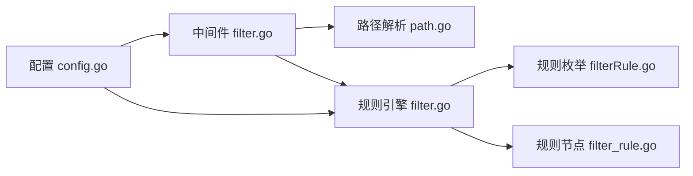

# 内容过滤机制

<cite>
**本文引用的文件**
- [pkg/middleware/filter.go](file://pkg/middleware/filter.go)
- [pkg/module/filter.go](file://pkg/module/filter.go)
- [pkg/module/filterRule.go](file://pkg/module/filterRule.go)
- [pkg/module/filter_rule.go](file://pkg/module/filter_rule.go)
- [pkg/paths/path.go](file://pkg/paths/path.go)
- [pkg/paths/decode.go](file://pkg/paths/decode.go)
- [pkg/config/config.go](file://pkg/config/config.go)
- [cmd/proxy/main.go](file://cmd/proxy/main.go)
- [docs/content/configuration/filter.md](file://docs/content/configuration/filter.md)
- [docs/content/configuration/download.md](file://docs/content/configuration/download.md)
- [pkg/module/filter_test.go](file://pkg/module/filter_test.go)
- [pkg/download/mode/mode.go](file://pkg/download/mode/mode.go)
</cite>

## 目录
1. [简介](#简介)
2. [项目结构](#项目结构)
3. [核心组件](#核心组件)
4. [架构总览](#架构总览)
5. [详细组件分析](#详细组件分析)
6. [依赖关系分析](#依赖关系分析)
7. [性能考量](#性能考量)
8. [故障排除指南](#故障排除指南)
9. [结论](#结论)
10. [附录](#附录)

## 简介
本文件系统性阐述 Athens 内容过滤机制的设计与实现，重点覆盖：
- 模块访问控制的实现原理：过滤规则定义、匹配算法与执行流程
- 过滤规则类型：允许列表、拒绝列表、直接上游代理、版本限定与语义化版本修饰符
- 配置方法与使用场景：模块名匹配、版本范围控制、路径过滤
- 过滤中间件在请求处理流程中的作用与性能影响
- 最佳实践与常见问题排查

需要特别说明的是：仓库中“过滤文件”已标记为弃用，当前推荐使用“下载模式文件”进行更灵活的模块行为控制；本文仍以现有实现为准进行技术解析。

## 项目结构
围绕内容过滤的关键目录与文件：
- 中间件层：pkg/middleware/filter.go 提供过滤中间件
- 规则引擎：pkg/module/filter.go 定义规则树、匹配逻辑与版本限定
- 路径解析：pkg/paths/path.go、pkg/paths/decode.go 解析模块与版本参数
- 配置入口：pkg/config/config.go 读取 FilterFile 并注入全局配置
- 应用启动：cmd/proxy/main.go 加载配置并构建应用处理器
- 文档参考：docs/content/configuration/filter.md（弃用说明）、docs/content/configuration/download.md（新方案）

图表来源
- [cmd/proxy/main.go](file://cmd/proxy/main.go#L59-L62)
- [pkg/middleware/filter.go](file://pkg/middleware/filter.go#L15-L47)
- [pkg/module/filter.go](file://pkg/module/filter.go#L18-L82)
- [pkg/module/filterRule.go](file://pkg/module/filterRule.go#L3-L16)
- [pkg/module/filter_rule.go](file://pkg/module/filter_rule.go#L3-L7)
- [pkg/paths/path.go](file://pkg/paths/path.go#L12-L31)
- [pkg/paths/decode.go](file://pkg/paths/decode.go#L10-L20)
- [pkg/config/config.go](file://pkg/config/config.go#L35-L66)

章节来源
- [cmd/proxy/main.go](file://cmd/proxy/main.go#L59-L62)
- [pkg/config/config.go](file://pkg/config/config.go#L35-L66)

## 核心组件
- 过滤中间件 NewFilterMiddleware：拦截模块请求，根据规则决定返回 403、正常处理或重定向到上游
- 规则引擎 Filter：基于前缀树（Trie）存储规则，支持模块路径与版本限定匹配
- 路径解析器：从请求中提取模块名与版本，必要时进行安全解码
- 配置：通过 FilterFile 指定规则文件；若为空则禁用过滤

章节来源
- [pkg/middleware/filter.go](file://pkg/middleware/filter.go#L13-L47)
- [pkg/module/filter.go](file://pkg/module/filter.go#L18-L82)
- [pkg/paths/path.go](file://pkg/paths/path.go#L12-L31)
- [pkg/config/config.go](file://pkg/config/config.go#L35-L66)

## 架构总览
过滤中间件在请求进入业务处理器之前执行，其职责链如下：
- 从 URL 变量中提取模块与版本
- 查询规则树，计算最终规则
- 根据规则执行：禁止、放行、直接上游代理
- 若未命中模块路径，则透传给下游处理器

图表来源
- [pkg/middleware/filter.go](file://pkg/middleware/filter.go#L17-L44)
- [pkg/paths/path.go](file://pkg/paths/path.go#L12-L31)
- [pkg/module/filter.go](file://pkg/module/filter.go#L74-L82)

## 详细组件分析

### 组件一：过滤中间件（NewFilterMiddleware）
- 功能要点
  - 仅对模块相关路径生效；非模块路径直接透传
  - 无法解析版本时，按空版本处理
  - 基于规则执行三种动作：禁止（403）、放行（透传）、直接上游代理（303）
- 性能特征
  - 单次请求仅做一次模块/版本解析与一次规则查询
  - 无额外 IO，CPU 开销主要来自字符串匹配与规则树遍历

图表来源
- [pkg/middleware/filter.go](file://pkg/middleware/filter.go#L17-L44)

章节来源
- [pkg/middleware/filter.go](file://pkg/middleware/filter.go#L13-L47)

### 组件二：规则引擎（Filter）
- 数据结构
  - 规则节点 ruleNode：包含规则、子节点映射、版本限定列表
  - 规则枚举 FilterRule：Default、Include、Exclude、Direct
- 匹配算法
  - 将模块路径按分隔符拆分为段，沿规则树向下匹配
  - 对每个命中的节点，检查版本限定（支持通配与语义化版本修饰符）
  - 优先级：越深的路径规则优先；遇到非默认规则即停止回溯
  - 默认规则：未命中时回退到根规则；若根亦为默认则视为放行
- 版本限定与修饰符
  - 支持 v1.2.* 前缀匹配
  - 支持 ~1.2.3（补丁及以上兼容）、^1.2.3（主次及以上兼容）、<1.2.3（低于指定版本）
  - 仅当版本为三段式语义化版本时生效

图表来源
- [pkg/module/filter.go](file://pkg/module/filter.go#L18-L82)
- [pkg/module/filter_rule.go](file://pkg/module/filter_rule.go#L3-L7)
- [pkg/module/filterRule.go](file://pkg/module/filterRule.go#L3-L16)

章节来源
- [pkg/module/filter.go](file://pkg/module/filter.go#L74-L132)
- [pkg/module/filter.go](file://pkg/module/filter.go#L195-L261)
- [pkg/module/filterRule.go](file://pkg/module/filterRule.go#L3-L16)
- [pkg/module/filter_rule.go](file://pkg/module/filter_rule.go#L3-L7)

### 组件三：路径解析（GetModule/GetVersion）
- 从 Gorilla Mux 的路由变量中提取模块与版本
- 对编码后的路径进行安全解码，失败时返回错误
- 未找到版本时返回空串，交由规则引擎按无版本处理

章节来源
- [pkg/paths/path.go](file://pkg/paths/path.go#L12-L31)
- [pkg/paths/decode.go](file://pkg/paths/decode.go#L10-L20)

### 组件四：配置与应用集成
- 配置项
  - FilterFile：指向过滤规则文件；为空则禁用过滤
  - GlobalEndpoint：上游代理端点，用于 Direct 规则重定向
- 应用启动
  - 加载配置后，若 FilterFile 非空则构建过滤中间件并挂载到路由

章节来源
- [pkg/config/config.go](file://pkg/config/config.go#L35-L66)
- [cmd/proxy/main.go](file://cmd/proxy/main.go#L59-L62)

### 组件五：下载模式文件（替代方案）
- 新版推荐：通过下载模式文件（HCL）控制模块缺失时的行为（同步/异步/重定向等）
- 与过滤文件不同，下载模式文件更侧重“未命中存储”的处理策略，而非细粒度的模块白黑名单
- 两者可配合使用：先用过滤文件限制模块访问，再用下载模式文件统一处理未命中情况

章节来源
- [docs/content/configuration/download.md](file://docs/content/configuration/download.md#L1-L103)
- [pkg/download/mode/mode.go](file://pkg/download/mode/mode.go#L16-L142)

## 依赖关系分析
- 过滤中间件依赖路径解析与规则引擎
- 规则引擎内部维护规则树，查询时按路径段与版本限定进行判定
- 配置层提供 FilterFile 与 GlobalEndpoint，驱动中间件与规则引擎

图表来源
- [pkg/middleware/filter.go](file://pkg/middleware/filter.go#L15-L47)
- [pkg/module/filter.go](file://pkg/module/filter.go#L18-L82)
- [pkg/module/filterRule.go](file://pkg/module/filterRule.go#L3-L16)
- [pkg/module/filter_rule.go](file://pkg/module/filter_rule.go#L3-L7)
- [pkg/config/config.go](file://pkg/config/config.go#L35-L66)

章节来源
- [pkg/middleware/filter.go](file://pkg/middleware/filter.go#L15-L47)
- [pkg/module/filter.go](file://pkg/module/filter.go#L18-L82)
- [pkg/config/config.go](file://pkg/config/config.go#L35-L66)

## 性能考量
- 时间复杂度
  - 规则查询：O(L)，L 为模块路径段数；版本限定匹配为常数开销
- 空间复杂度
  - 规则树按路径前缀压缩存储，内存占用与规则数量及路径深度成正比
- 影响因素
  - 规则数量与路径层级深度
  - 版本限定列表长度与修饰符解析成本
- 优化建议
  - 合理组织规则层级，避免过深路径
  - 使用前缀匹配（如 v1.2.*）减少修饰符数量
  - 将高频规则置于较浅层级，提升命中率

## 故障排除指南
- 常见问题与定位
  - 403 禁止：确认模块是否被 Exclude 或未命中 Include 回退
  - 无限重定向：检查 Direct 规则与上游端点配置
  - 规则不生效：核对规则文件语法、注释与空行处理
  - 版本未匹配：确认修饰符格式与三段式语义化版本要求
- 测试用例参考
  - 规则回退、父子继承、Direct 行为、版本限定与修饰符等均有单元测试覆盖

章节来源
- [pkg/module/filter_test.go](file://pkg/module/filter_test.go#L45-L200)
- [pkg/middleware/filter.go](file://pkg/middleware/filter.go#L28-L44)

## 结论
- 当前过滤机制以“过滤文件”为核心，采用前缀树与版本限定实现高效匹配
- 过滤中间件在请求早期介入，具备低开销与高可读性
- 建议结合“下载模式文件”统一处理未命中存储的场景，形成“准入控制 + 存储行为”的完整策略
- 在生产环境应关注规则数量与路径深度，确保性能与可维护性平衡

## 附录

### 过滤规则类型与配置方法
- 类型
  - Include：放行模块（默认）
  - Exclude：拒绝模块及其子模块
  - Direct：直接从上游代理拉取，不入库
- 文件语法
  - 每行以 +、-、D 开头，分别对应 Include、Exclude、Direct
  - 支持注释（#），空行忽略
  - 可选版本限定：第三列逗号分隔的版本模式（支持 v1.* 前缀匹配）
- 使用场景
  - 允许列表：仅允许特定模块或组织
  - 拒绝列表：屏蔽特定模块或公司内部私有模块
  - 直接上游代理：对大体积模块或外部依赖直接透传
  - 版本范围控制：限定允许的补丁/小版本范围

章节来源
- [docs/content/configuration/filter.md](file://docs/content/configuration/filter.md#L18-L96)
- [pkg/module/filter.go](file://pkg/module/filter.go#L134-L193)

### 过滤中间件在请求处理流程中的作用
- 位置：在路由匹配之后、业务处理器之前
- 作用：快速决策模块请求的准入与处理方式
- 性能：单次解析 + 单次规则查询，开销极低

章节来源
- [pkg/middleware/filter.go](file://pkg/middleware/filter.go#L13-L47)

### 版本修饰符与匹配规则
- 修饰符
  - ~1.2.3：补丁及以上兼容（1.2.x，x≥3）
  - ^1.2.3：主次及以上兼容（1.x.y，x≥2 且 y≥3）
  - <1.2.3：低于指定版本
- 适用条件
  - 仅当版本为三段式语义化版本时生效
  - 修饰符必须符合规范，否则视为不匹配

章节来源
- [docs/content/configuration/filter.md](file://docs/content/configuration/filter.md#L74-L96)
- [pkg/module/filter.go](file://pkg/module/filter.go#L195-L261)

### 配置示例（路径与模块名匹配）
- 模块名匹配
  - 允许特定组织：+ github.com/yourorg/*
  - 拒绝特定模块：- github.com/blacklist/pkg
  - 直接上游代理：D golang.org/x/tools
- 版本范围控制
  - 仅允许 v0.1、v0.2 与 v0.4.1：+ github.com/yourorg/pkg v0.1,v0.2,v0.4.1
  - 使用修饰符：+ github.com/yourorg/pkg ~v1.2.3
- 路径过滤
  - 使用通配：+ github.com/yourorg/*

章节来源
- [docs/content/configuration/filter.md](file://docs/content/configuration/filter.md#L28-L96)

### 最佳实践
- 规则层级
  - 将通用规则置于根节点，细化规则置于子节点
- 版本管理
  - 优先使用 v1.* 前缀匹配，减少修饰符数量
  - 对关键依赖使用精确版本或修饰符组合
- 上游代理
  - Direct 规则需配合 GlobalEndpoint 正确配置
- 可观测性
  - 记录命中规则与版本匹配结果，便于审计与排错