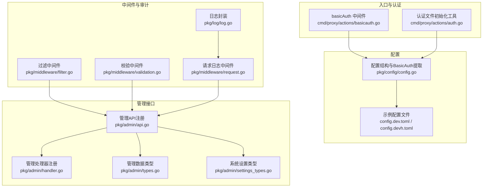
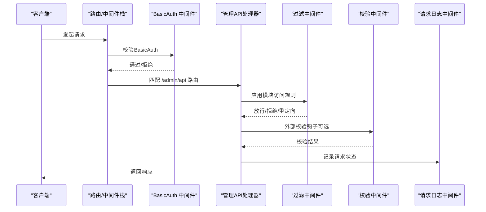
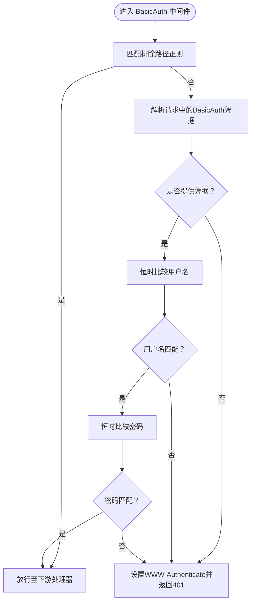
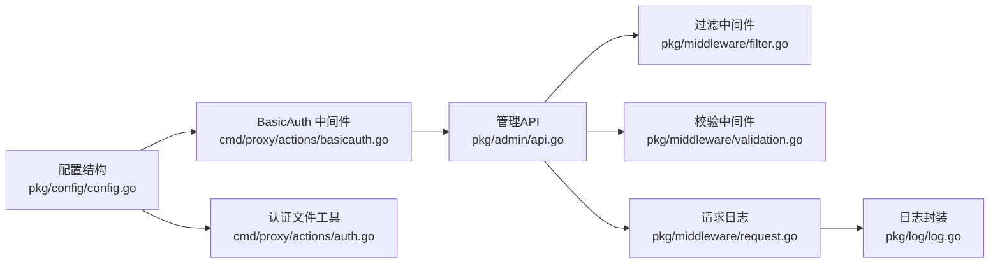
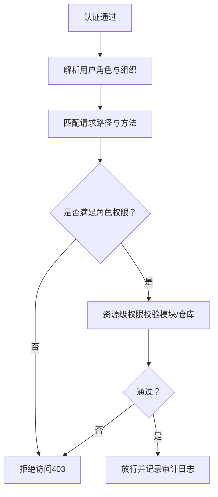

# 权限控制策略

<cite>
**本文引用的文件**
- [cmd/proxy/actions/basicauth.go](file://cmd/proxy/actions/basicauth.go)
- [cmd/proxy/actions/auth.go](file://cmd/proxy/actions/auth.go)
- [pkg/config/config.go](file://pkg/config/config.go)
- [config.dev.toml](file://config.dev.toml)
- [config.devh.toml](file://config.devh.toml)
- [pkg/admin/api.go](file://pkg/admin/api.go)
- [pkg/admin/handler.go](file://pkg/admin/handler.go)
- [pkg/admin/types.go](file://pkg/admin/types.go)
- [pkg/admin/settings_types.go](file://pkg/admin/settings_types.go)
- [pkg/middleware/filter.go](file://pkg/middleware/filter.go)
- [pkg/middleware/validation.go](file://pkg/middleware/validation.go)
- [pkg/middleware/request.go](file://pkg/middleware/request.go)
- [pkg/log/log.go](file://pkg/log/log.go)
- [docs/content/configuration/authentication.md](file://docs/content/configuration/authentication.md)
</cite>

## 目录
1. [简介](#简介)
2. [项目结构](#项目结构)
3. [核心组件](#核心组件)
4. [架构总览](#架构总览)
5. [详细组件分析](#详细组件分析)
6. [依赖关系分析](#依赖关系分析)
7. [性能考量](#性能考量)
8. [故障排查指南](#故障排查指南)
9. [结论](#结论)
10. [附录](#附录)

## 简介
本文件系统性梳理 Athens 的权限控制策略与实现，重点覆盖以下方面：
- 基于角色的访问控制（RBAC）与资源级权限控制现状与扩展建议
- 认证后的权限验证流程：模块访问权限与操作权限的判定逻辑
- 权限配置最佳实践：最小权限原则、权限继承与组合策略
- 与外部身份认证系统的集成：LDAP、OAuth 等
- 权限审计、日志记录与安全监控的实现方案

说明：当前代码库未实现内置 RBAC 与细粒度资源权限模型。本文在现有基础之上，提出可落地的扩展方案与最佳实践。

## 项目结构
围绕权限控制的关键目录与文件：
- 认证与基本保护：cmd/proxy/actions 下的 basicAuth 与 auth 工具
- 配置与运行时：pkg/config 提供配置加载与 BasicAuth 用户/密码提取
- 管理接口与权限边界：pkg/admin 提供受控的管理 API（/admin/api）
- 请求链路与中间件：pkg/middleware 提供过滤、校验与请求日志
- 日志与审计：pkg/log 提供日志封装与格式化

图表来源
- [cmd/proxy/actions/basicauth.go](file://cmd/proxy/actions/basicauth.go#L1-L43)
- [cmd/proxy/actions/auth.go](file://cmd/proxy/actions/auth.go#L1-L68)
- [pkg/config/config.go](file://pkg/config/config.go#L21-L66)
- [config.dev.toml](file://config.dev.toml#L155-L171)
- [config.devh.toml](file://config.devh.toml#L139-L153)
- [pkg/admin/api.go](file://pkg/admin/api.go#L15-L48)
- [pkg/admin/handler.go](file://pkg/admin/handler.go#L9-L21)
- [pkg/admin/types.go](file://pkg/admin/types.go#L4-L39)
- [pkg/admin/settings_types.go](file://pkg/admin/settings_types.go#L4-L11)
- [pkg/middleware/filter.go](file://pkg/middleware/filter.go#L13-L48)
- [pkg/middleware/validation.go](file://pkg/middleware/validation.go#L16-L49)
- [pkg/middleware/request.go](file://pkg/middleware/request.go#L22-L33)
- [pkg/log/log.go](file://pkg/log/log.go#L17-L27)

章节来源
- [cmd/proxy/actions/basicauth.go](file://cmd/proxy/actions/basicauth.go#L1-L43)
- [cmd/proxy/actions/auth.go](file://cmd/proxy/actions/auth.go#L1-L68)
- [pkg/config/config.go](file://pkg/config/config.go#L21-L66)
- [config.dev.toml](file://config.dev.toml#L155-L171)
- [config.devh.toml](file://config.devh.toml#L139-L153)
- [pkg/admin/api.go](file://pkg/admin/api.go#L15-L48)
- [pkg/admin/handler.go](file://pkg/admin/handler.go#L9-L21)
- [pkg/admin/types.go](file://pkg/admin/types.go#L4-L39)
- [pkg/admin/settings_types.go](file://pkg/admin/settings_types.go#L4-L11)
- [pkg/middleware/filter.go](file://pkg/middleware/filter.go#L13-L48)
- [pkg/middleware/validation.go](file://pkg/middleware/validation.go#L16-L49)
- [pkg/middleware/request.go](file://pkg/middleware/request.go#L22-L33)
- [pkg/log/log.go](file://pkg/log/log.go#L17-L27)

## 核心组件
- 基本认证中间件：对非健康检查路径进行 BasicAuth 校验，防止未授权访问
- 认证文件初始化：支持从外部路径初始化 .netrc/.hgrc，便于访问私有仓库
- 配置驱动的 BasicAuth：从配置中读取用户名/密码，支持环境变量覆盖
- 管理 API 边界：/admin/api 下的路由集中注册，形成统一的管理入口
- 过滤与校验中间件：基于规则的模块访问控制与外部校验钩子
- 请求日志与审计：统一记录请求状态码与上下文，便于审计与排障

章节来源
- [cmd/proxy/actions/basicauth.go](file://cmd/proxy/actions/basicauth.go#L11-L27)
- [cmd/proxy/actions/auth.go](file://cmd/proxy/actions/auth.go#L13-L38)
- [pkg/config/config.go](file://pkg/config/config.go#L215-L222)
- [pkg/admin/api.go](file://pkg/admin/api.go#L15-L48)
- [pkg/middleware/filter.go](file://pkg/middleware/filter.go#L13-L48)
- [pkg/middleware/validation.go](file://pkg/middleware/validation.go#L16-L49)
- [pkg/middleware/request.go](file://pkg/middleware/request.go#L22-L33)

## 架构总览
下图展示权限控制在请求链路中的关键节点与职责分工：

图表来源
- [cmd/proxy/actions/basicauth.go](file://cmd/proxy/actions/basicauth.go#L14-L27)
- [pkg/admin/api.go](file://pkg/admin/api.go#L15-L48)
- [pkg/middleware/filter.go](file://pkg/middleware/filter.go#L15-L47)
- [pkg/middleware/validation.go](file://pkg/middleware/validation.go#L18-L49)
- [pkg/middleware/request.go](file://pkg/middleware/request.go#L24-L33)

## 详细组件分析

### 组件A：基本认证中间件（BasicAuth）
- 功能要点
  - 排除健康检查路径（/healthz、/readyz），避免误拦截
  - 使用恒时比较函数进行用户名与密码比对，降低时序侧信道风险
  - 未通过认证时返回 401 并提示 Basic realm
- 执行流程

图表来源
- [cmd/proxy/actions/basicauth.go](file://cmd/proxy/actions/basicauth.go#L11-L27)
- [cmd/proxy/actions/basicauth.go](file://cmd/proxy/actions/basicauth.go#L29-L42)

章节来源
- [cmd/proxy/actions/basicauth.go](file://cmd/proxy/actions/basicauth.go#L11-L27)
- [cmd/proxy/actions/basicauth.go](file://cmd/proxy/actions/basicauth.go#L29-L42)

### 组件B：认证文件初始化与令牌注入
- 功能要点
  - 将外部认证文件（.netrc/.hgrc）复制到用户家目录，覆盖已有同名文件
  - 支持从 GitHub Token 生成 .netrc 文件，简化私有仓库访问配置
  - 跨平台适配：Windows 使用 _netrc，类 Unix 使用 .netrc
- 实施建议
  - 生产环境严格控制文件权限（建议 0600）
  - 令牌注入应配合最小权限原则，仅授予必要仓库访问范围

章节来源
- [cmd/proxy/actions/auth.go](file://cmd/proxy/actions/auth.go#L13-L38)
- [cmd/proxy/actions/auth.go](file://cmd/proxy/actions/auth.go#L40-L53)
- [cmd/proxy/actions/auth.go](file://cmd/proxy/actions/auth.go#L55-L67)

### 组件C：配置驱动的 BasicAuth 与运行参数
- 功能要点
  - 从配置结构中提取 BasicAuthUser/BasicAuthPass
  - 支持环境变量覆盖，端口格式化与默认值处理
  - 配置文件示例中明确 BasicAuth 的使用注意事项与风险提示
- 安全建议
  - 生产环境务必启用 BasicAuth，并定期轮换凭据
  - 避免在日志中打印明文凭据；当前注释提示 BasicAuth 凭据可能泄露

章节来源
- [pkg/config/config.go](file://pkg/config/config.go#L215-L222)
- [pkg/config/config.go](file://pkg/config/config.go#L256-L273)
- [config.dev.toml](file://config.dev.toml#L155-L171)
- [config.devh.toml](file://config.devh.toml#L139-L153)

### 组件D：管理 API 的权限边界与数据模型
- 功能要点
  - /admin/api 下的路由集中注册，形成统一的管理入口
  - 提供系统状态、仪表盘、活动、设置、下载与上传等 API
  - 数据模型定义清晰，便于前端与后端协作
- 权限建议
  - 管理 API 应与 BasicAuth 强绑定，仅允许授权人员访问
  - 对敏感操作（如批量删除、设置变更）增加二次确认或审计日志

章节来源
- [pkg/admin/api.go](file://pkg/admin/api.go#L15-L48)
- [pkg/admin/handler.go](file://pkg/admin/handler.go#L13-L19)
- [pkg/admin/types.go](file://pkg/admin/types.go#L4-L39)
- [pkg/admin/settings_types.go](file://pkg/admin/settings_types.go#L4-L11)

### 组件E：模块访问控制与外部校验
- 过滤中间件
  - 基于模块路径与版本规则，决定放行、拒绝或直接重定向到上游
  - 适用于合规与合规例外场景
- 校验中间件
  - 调用外部校验钩子，对模块与版本进行合法性校验
  - 校验失败返回 403，成功则放行
- 审计建议
  - 对拒绝与重定向行为进行日志记录，便于追踪

章节来源
- [pkg/middleware/filter.go](file://pkg/middleware/filter.go#L13-L48)
- [pkg/middleware/validation.go](file://pkg/middleware/validation.go#L16-L49)

### 组件F：请求日志与审计
- 功能要点
  - 统一记录请求状态码与上下文字段
  - 支持不同日志格式（plain/json），并针对云平台进行字段适配
- 审计建议
  - 开启生产环境日志，保留至少 90 天
  - 对 4xx/5xx 与敏感操作进行告警

章节来源
- [pkg/middleware/request.go](file://pkg/middleware/request.go#L22-L33)
- [pkg/log/log.go](file://pkg/log/log.go#L17-L27)

## 依赖关系分析
- 组件耦合
  - BasicAuth 依赖配置结构提供的 BasicAuthUser/BasicAuthPass
  - 管理 API 依赖路由注册与处理器选项
  - 过滤与校验中间件依赖路径解析与外部服务
- 外部依赖
  - gorilla/mux 用于路由与中间件栈
  - logrus 用于日志格式化与输出
- 潜在风险
  - BasicAuth 仅提供基础防护，建议结合 TLS 与更强的身份认证
  - 缺少细粒度 RBAC 与资源权限模型，需通过扩展中间件或网关实现

图表来源
- [pkg/config/config.go](file://pkg/config/config.go#L215-L222)
- [cmd/proxy/actions/basicauth.go](file://cmd/proxy/actions/basicauth.go#L14-L27)
- [cmd/proxy/actions/auth.go](file://cmd/proxy/actions/auth.go#L13-L38)
- [pkg/admin/api.go](file://pkg/admin/api.go#L15-L48)
- [pkg/middleware/filter.go](file://pkg/middleware/filter.go#L13-L48)
- [pkg/middleware/validation.go](file://pkg/middleware/validation.go#L16-L49)
- [pkg/middleware/request.go](file://pkg/middleware/request.go#L22-L33)
- [pkg/log/log.go](file://pkg/log/log.go#L17-L27)

章节来源
- [pkg/config/config.go](file://pkg/config/config.go#L215-L222)
- [cmd/proxy/actions/basicauth.go](file://cmd/proxy/actions/basicauth.go#L14-L27)
- [cmd/proxy/actions/auth.go](file://cmd/proxy/actions/auth.go#L13-L38)
- [pkg/admin/api.go](file://pkg/admin/api.go#L15-L48)
- [pkg/middleware/filter.go](file://pkg/middleware/filter.go#L13-L48)
- [pkg/middleware/validation.go](file://pkg/middleware/validation.go#L16-L49)
- [pkg/middleware/request.go](file://pkg/middleware/request.go#L22-L33)
- [pkg/log/log.go](file://pkg/log/log.go#L17-L27)

## 性能考量
- BasicAuth 恒时比较避免了时序攻击，但增加了少量 CPU 开销，通常可忽略
- 过滤与校验中间件在高并发场景下应关注外部服务延迟与超时配置
- 日志输出在高吞吐下可能成为瓶颈，建议使用异步日志或采样策略

## 故障排查指南
- 401 未授权
  - 检查 BasicAuthUser/BasicAuthPass 是否正确配置
  - 确认请求头中包含正确的 Authorization 字段
- 403 拒绝访问
  - 检查过滤规则与校验钩子返回结果
  - 查看请求日志中的状态码与上下文
- 认证文件问题
  - 确认 .netrc/.hgrc 权限为 0600
  - 检查令牌注入是否成功生成 .netrc
- 日志与审计
  - 开启详细日志，定位异常请求
  - 对敏感操作建立告警与回溯机制

章节来源
- [cmd/proxy/actions/basicauth.go](file://cmd/proxy/actions/basicauth.go#L17-L21)
- [pkg/middleware/filter.go](file://pkg/middleware/filter.go#L28-L44)
- [pkg/middleware/validation.go](file://pkg/middleware/validation.go#L32-L46)
- [cmd/proxy/actions/auth.go](file://cmd/proxy/actions/auth.go#L33-L37)
- [pkg/middleware/request.go](file://pkg/middleware/request.go#L24-L33)

## 结论
- 现状总结
  - Athens 提供基础的 BasicAuth 保护与管理 API 边界，但未实现 RBAC 与资源级细粒度权限
  - 过滤与校验中间件为模块访问控制提供了扩展点
- 建议
  - 在管理 API 层面强制 BasicAuth，并结合 TLS 与网关实现更强的身份认证
  - 逐步引入 RBAC 与资源权限模型，结合中间件实现模块与操作级别的权限判定
  - 完善审计与告警体系，确保可追溯与可监控

## 附录

### RBAC 与资源级权限设计（扩展建议）
- 角色定义
  - 管理员：拥有 /admin/api 下的所有操作权限
  - 下载者：仅允许模块下载相关 API
  - 上传者：允许模块上传相关 API，但受限于仓库白名单
- 权限判定流程
  - 认证通过后，解析用户角色与所属组织
  - 根据请求路径与方法，匹配角色权限矩阵
  - 对资源级权限（如特定模块路径）进行细粒度校验
- 权限继承与组合
  - 子组织继承父组织权限，新增权限叠加
  - 角色组合用于复杂场景（如“上传者+审核者”）

[本图为概念性流程示意，无需图表来源]

### 权限配置最佳实践
- 最小权限原则
  - 为每个角色分配完成任务所需的最小权限集合
  - 定期审查与回收不再需要的权限
- 权限继承与组合
  - 明确父子组织权限继承规则
  - 通过角色组合实现灵活的权限编排
- 配置与运维
  - 使用配置文件与环境变量分离静态与动态配置
  - 对敏感配置（BasicAuth、令牌）进行加密存储与轮换

[本节为通用指导，无需章节来源]

### 与外部身份认证系统集成
- GitHub/GitLab/Bitbucket
  - 使用 Git 凭据助手与 .netrc，结合 BasicAuth 保护管理 API
  - 参考官方文档中的配置示例
- LDAP/OAuth
  - 在反向代理层（如 Nginx/Caddy/Istio）实现 OAuth/LDAP 鉴权
  - Athens 仅负责 BasicAuth 保护管理 API 与模块访问控制
- 企业 SSO
  - 通过网关或 API 网关对接企业 SSO，颁发短期访问令牌
  - 管理 API 仅接受来自可信网关的请求

章节来源
- [docs/content/configuration/authentication.md](file://docs/content/configuration/authentication.md#L1-L357)