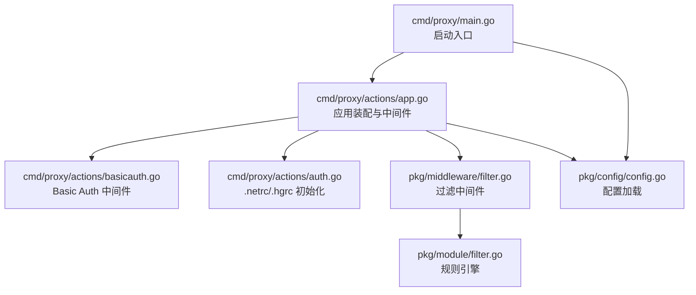
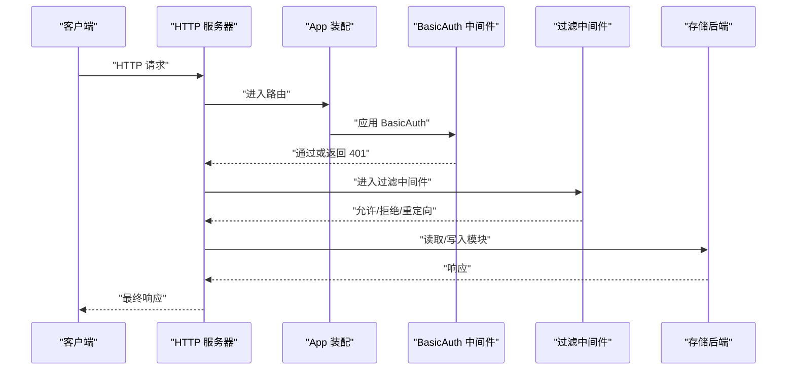
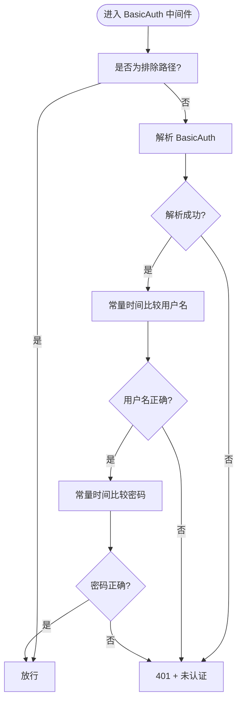
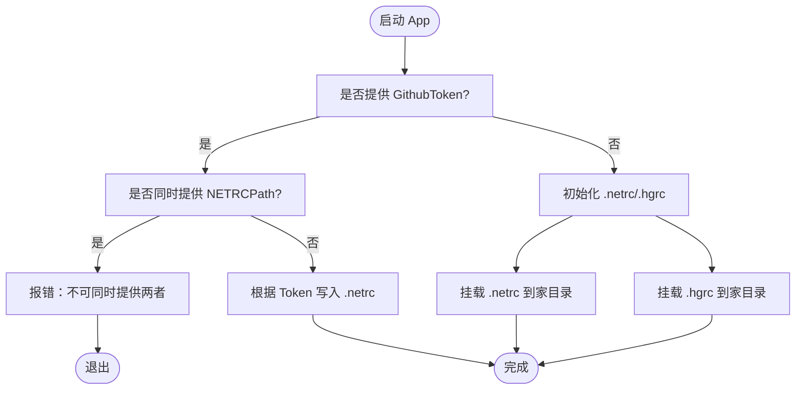
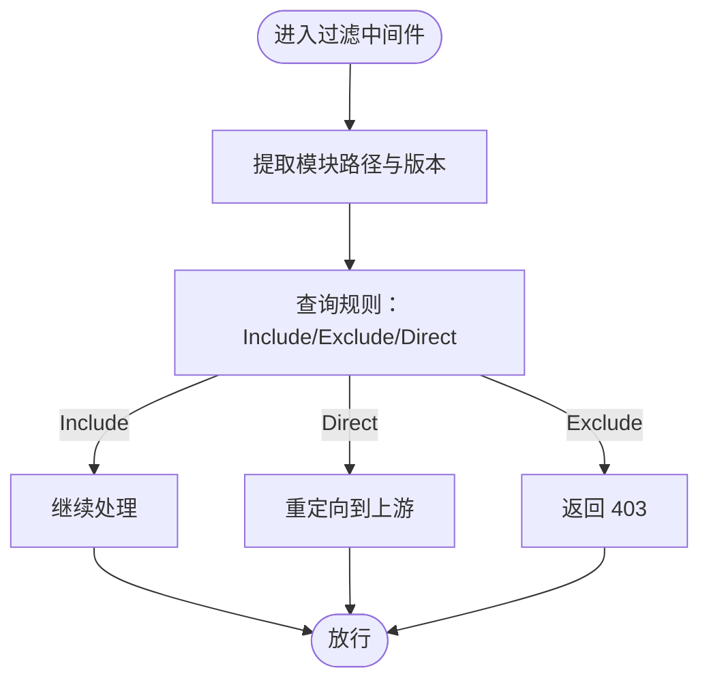
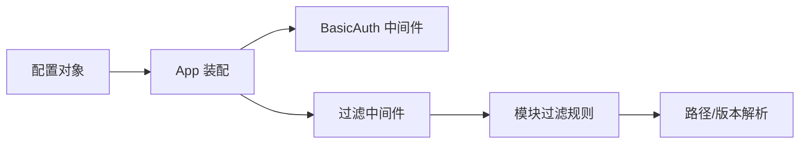

# 认证与授权

<cite>
**本文引用的文件**
- [cmd/proxy/actions/app.go](file://cmd/proxy/actions/app.go)
- [cmd/proxy/actions/auth.go](file://cmd/proxy/actions/auth.go)
- [cmd/proxy/actions/basicauth.go](file://cmd/proxy/actions/basicauth.go)
- [cmd/proxy/main.go](file://cmd/proxy/main.go)
- [pkg/config/config.go](file://pkg/config/config.go)
- [pkg/middleware/filter.go](file://pkg/middleware/filter.go)
- [pkg/module/filter.go](file://pkg/module/filter.go)
- [docs/content/configuration/authentication.md](file://docs/content/configuration/authentication.md)
- [config.dev.toml](file://config.dev.toml)
</cite>

## 目录
1. [简介](#简介)
2. [项目结构](#项目结构)
3. [核心组件](#核心组件)
4. [架构总览](#架构总览)
5. [详细组件分析](#详细组件分析)
6. [依赖关系分析](#依赖关系分析)
7. [性能考量](#性能考量)
8. [故障排查指南](#故障排查指南)
9. [结论](#结论)
10. [附录](#附录)

## 简介
本文件系统性阐述 Athens 的认证与授权体系，覆盖以下主题：
- 支持的认证机制：Basic Auth、GitHub Token、.netrc 文件处理、.hgrc 文件挂载
- 权限控制策略：路径白/黑名单、版本限定、直连上游代理
- 内容过滤与访问控制列表（ACL）实现
- 配置示例与最佳实践
- 认证中间件工作原理与安全注意事项
- 常见问题排查与安全加固建议

## 项目结构
与认证授权直接相关的代码主要分布在如下模块：
- 启动与入口：cmd/proxy/main.go
- 应用装配与中间件：cmd/proxy/actions/app.go
- Basic Auth 中间件：cmd/proxy/actions/basicauth.go
- .netrc/.hgrc 初始化与生成：cmd/proxy/actions/auth.go
- 配置加载与环境变量解析：pkg/config/config.go
- 过滤中间件与规则引擎：pkg/middleware/filter.go、pkg/module/filter.go
- 文档与示例：docs/content/configuration/authentication.md、config.dev.toml

图表来源
- [cmd/proxy/main.go](file://cmd/proxy/main.go#L29-L128)
- [cmd/proxy/actions/app.go](file://cmd/proxy/actions/app.go#L23-L139)
- [cmd/proxy/actions/basicauth.go](file://cmd/proxy/actions/basicauth.go#L14-L43)
- [cmd/proxy/actions/auth.go](file://cmd/proxy/actions/auth.go#L16-L67)
- [pkg/middleware/filter.go](file://pkg/middleware/filter.go#L15-L48)
- [pkg/module/filter.go](file://pkg/module/filter.go#L38-L193)
- [pkg/config/config.go](file://pkg/config/config.go#L129-L254)

章节来源
- [cmd/proxy/main.go](file://cmd/proxy/main.go#L29-L128)
- [cmd/proxy/actions/app.go](file://cmd/proxy/actions/app.go#L23-L139)

## 核心组件
- Basic Auth 中间件：对非健康检查路径进行用户名/密码校验，采用常量时间比较防止时序攻击。
- .netrc/.hgrc 初始化：支持从配置或 GitHub Token 自动生成 .netrc；支持挂载外部 .netrc/.hgrc 到用户家目录。
- 过滤中间件：基于规则文件对模块路径与版本进行 Include/Exclude/Direct 控制，支持版本范围匹配。
- 配置系统：统一加载 TOML 配置与环境变量，提供默认值与校验。

章节来源
- [cmd/proxy/actions/basicauth.go](file://cmd/proxy/actions/basicauth.go#L14-L43)
- [cmd/proxy/actions/auth.go](file://cmd/proxy/actions/auth.go#L16-L67)
- [pkg/middleware/filter.go](file://pkg/middleware/filter.go#L15-L48)
- [pkg/module/filter.go](file://pkg/module/filter.go#L38-L193)
- [pkg/config/config.go](file://pkg/config/config.go#L129-L254)

## 架构总览
下图展示认证与授权在请求生命周期中的位置与交互：

图表来源
- [cmd/proxy/actions/app.go](file://cmd/proxy/actions/app.go#L46-L107)
- [cmd/proxy/actions/basicauth.go](file://cmd/proxy/actions/basicauth.go#L14-L27)
- [pkg/middleware/filter.go](file://pkg/middleware/filter.go#L15-L48)

## 详细组件分析

### Basic Auth 中间件
- 功能要点
  - 排除路径：/healthz、/readyz 不强制认证
  - 认证失败：设置 WWW-Authenticate 头并返回 401
  - 安全细节：使用常量时间比较避免时序侧信道
- 关键行为
  - 对每个请求解析 Authorization 头
  - 比较用户名与密码，均通过则放行
- 可配置项
  - 用户名/密码来源于配置对象的 BasicAuthUser/BasicAuthPass

图表来源
- [cmd/proxy/actions/basicauth.go](file://cmd/proxy/actions/basicauth.go#L14-L43)

章节来源
- [cmd/proxy/actions/basicauth.go](file://cmd/proxy/actions/basicauth.go#L11-L43)
- [pkg/config/config.go](file://pkg/config/config.go#L215-L222)

### .netrc 与 .hgrc 文件处理
- 功能要点
  - 支持从配置中指定 NETRCPath/HGRCPath 并挂载到用户家目录
  - 支持通过 GitHub Token 自动写入 .netrc（Windows/Linux 名称不同）
  - 互斥限制：若设置了 GithubToken，则不能同时提供 NETRCPath
- 安全要点
  - 写入文件权限为 0600
  - Windows 使用 _netrc，类 Unix 使用 .netrc

图表来源
- [cmd/proxy/actions/app.go](file://cmd/proxy/actions/app.go#L24-L44)
- [cmd/proxy/actions/auth.go](file://cmd/proxy/actions/auth.go#L16-L67)

章节来源
- [cmd/proxy/actions/app.go](file://cmd/proxy/actions/app.go#L24-L44)
- [cmd/proxy/actions/auth.go](file://cmd/proxy/actions/auth.go#L16-L67)

### 过滤中间件与规则引擎
- 规则类型
  - Include：允许模块处理
  - Exclude：拒绝模块处理
  - Direct：不缓存，直接重定向到上游代理
- 版本限定
  - 支持 v1.2.3、~v1.2.3、^v1.2.3、<v2.3.4 等语义化版本限定
- 规则优先级
  - 更具体的路径规则优先于父路径规则
  - Default 规则回退为 Include
- 全局上游直连
  - 当启用 GlobalEndpoint 且规则为 Direct 时，中间件会将请求重定向至上游

图表来源
- [pkg/middleware/filter.go](file://pkg/middleware/filter.go#L15-L48)
- [pkg/module/filter.go](file://pkg/module/filter.go#L74-L132)

章节来源
- [pkg/middleware/filter.go](file://pkg/middleware/filter.go#L15-L48)
- [pkg/module/filter.go](file://pkg/module/filter.go#L38-L193)

### 配置系统与环境变量
- 配置来源
  - 默认配置 → TOML 文件 → 环境变量（后者覆盖前者）
- 关键认证相关字段
  - BASIC_AUTH_USER/PASS：BasicAuth 凭据
  - ATHENS_NETRC_PATH：.netrc 文件路径（挂载）
  - ATHENS_GITHUB_TOKEN：GitHub Token（自动生成 .netrc）
  - ATHENS_HGRC_PATH：.hgrc 文件路径（挂载）
  - PROXY_FORCE_SSL：强制 HTTPS 重定向
  - ATHENS_FILTER_FILE：过滤规则文件
  - ATHENS_PROXY_VALIDATOR：模块验证钩子
  - ATHENS_PATH_PREFIX：路径前缀（影响健康检查路由）
- 安全校验
  - 生产模式下对配置文件与过滤文件权限进行检查（掩码校验）

章节来源
- [pkg/config/config.go](file://pkg/config/config.go#L21-L66)
- [pkg/config/config.go](file://pkg/config/config.go#L129-L254)
- [pkg/config/config.go](file://pkg/config/config.go#L349-L376)
- [config.dev.toml](file://config.dev.toml#L155-L217)

## 依赖关系分析
- App 装配阶段
  - 解析配置并决定是否启用 BasicAuth 与过滤中间件
  - 将 .netrc/.hgrc 挂载到用户家目录，供 Git/Hg 使用
- 中间件链
  - 请求先经 BasicAuth，再经过滤中间件，最后到达业务路由
- 规则引擎
  - 过滤中间件依赖路径解析模块获取模块名与版本
  - 规则文件由模块层解析并维护树形规则结构

图表来源
- [cmd/proxy/actions/app.go](file://cmd/proxy/actions/app.go#L96-L107)
- [pkg/middleware/filter.go](file://pkg/middleware/filter.go#L15-L48)
- [pkg/module/filter.go](file://pkg/module/filter.go#L74-L132)

章节来源
- [cmd/proxy/actions/app.go](file://cmd/proxy/actions/app.go#L96-L107)
- [pkg/middleware/filter.go](file://pkg/middleware/filter.go#L15-L48)
- [pkg/module/filter.go](file://pkg/module/filter.go#L74-L132)

## 性能考量
- BasicAuth
  - 常量时间比较避免时序攻击，开销极低
- 过滤中间件
  - 规则树查询为路径分段遍历，复杂度与模块路径层级线性相关
  - 版本限定匹配为常数次比较，整体可忽略
- .netrc/.hgrc
  - 仅在启动时一次性写入，运行期无额外 IO

[本节为通用指导，无需列出具体文件来源]

## 故障排查指南
- BasicAuth 401 但路径应放行
  - 检查路径是否命中 /healthz 或 /readyz 排除规则
  - 确认请求头 Authorization 是否正确设置
- 无法访问私有仓库
  - 若使用 GithubToken，请确认未同时设置 NETRCPath
  - 检查 .netrc/.hgrc 是否已挂载到家目录且权限为 0600
  - Windows 与类 Unix 的 .netrc 名称不同（_netrc vs .netrc）
- 过滤规则不生效
  - 确认 FilterFile 路径正确且可读
  - 检查规则语法与注释行是否被误识别
  - 版本限定需符合语义化版本格式
- 生产模式权限告警
  - 检查配置文件与过滤文件权限掩码，确保不超过 rwx,-,-（077）限制

章节来源
- [cmd/proxy/actions/basicauth.go](file://cmd/proxy/actions/basicauth.go#L11-L27)
- [cmd/proxy/actions/auth.go](file://cmd/proxy/actions/auth.go#L16-L67)
- [pkg/middleware/filter.go](file://pkg/middleware/filter.go#L15-L48)
- [pkg/module/filter.go](file://pkg/module/filter.go#L134-L193)
- [pkg/config/config.go](file://pkg/config/config.go#L349-L376)

## 结论
Athens 的认证与授权体系以“配置驱动 + 中间件链”为核心：
- BasicAuth 提供轻量级访问控制
- .netrc/.hgrc 挂载与自动生成保障私有仓库访问
- 过滤中间件与规则引擎实现灵活的内容控制与 ACL
- 配置系统支持多源覆盖与生产安全校验

通过合理配置与遵循最佳实践，可在保证安全的前提下实现高可用的模块代理服务。

[本节为总结性内容，无需列出具体文件来源]

## 附录

### 配置示例与最佳实践
- BasicAuth
  - 在配置中设置 BASIC_AUTH_USER/PASS 即可启用
  - 建议仅在受控网络或 TLS 终止后启用
- GitHub Token
  - 设置 ATHENS_GITHUB_TOKEN，自动写入 .netrc
  - 不要与 NETRCPath 同时使用
- .netrc/.hgrc 挂载
  - 使用 ATHENS_NETRC_PATH/ATHENS_HGRC_PATH 指定宿主机路径
  - 容器内权限设为 0600
- 过滤规则
  - Include/Exclude/Direct 三类规则按需组合
  - 版本限定用于灰度或兼容性控制
- 安全加固
  - 强制 HTTPS（PROXY_FORCE_SSL）
  - 生产模式下严格校验配置文件权限
  - 限制 BasicAuth 凭据最小暴露面

章节来源
- [docs/content/configuration/authentication.md](file://docs/content/configuration/authentication.md#L1-L357)
- [config.dev.toml](file://config.dev.toml#L155-L217)
- [pkg/config/config.go](file://pkg/config/config.go#L349-L376)