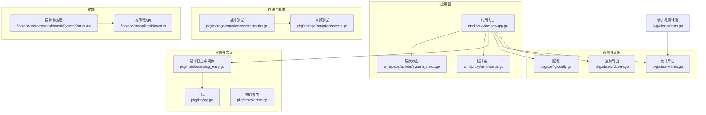
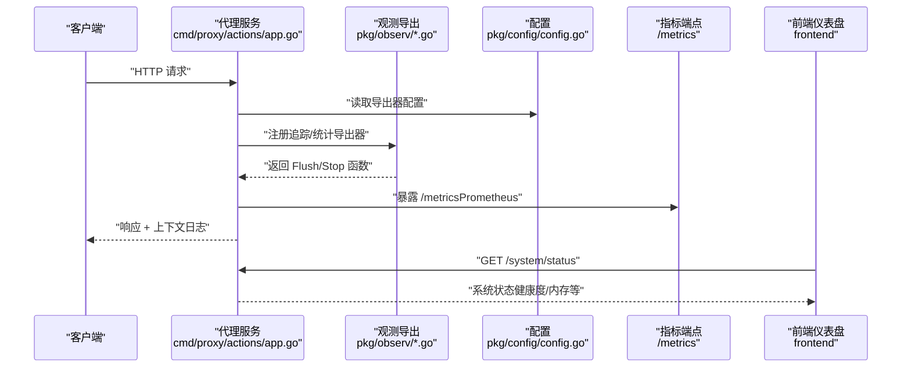
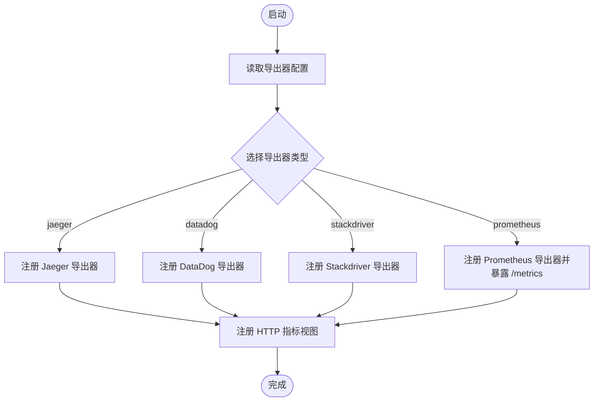
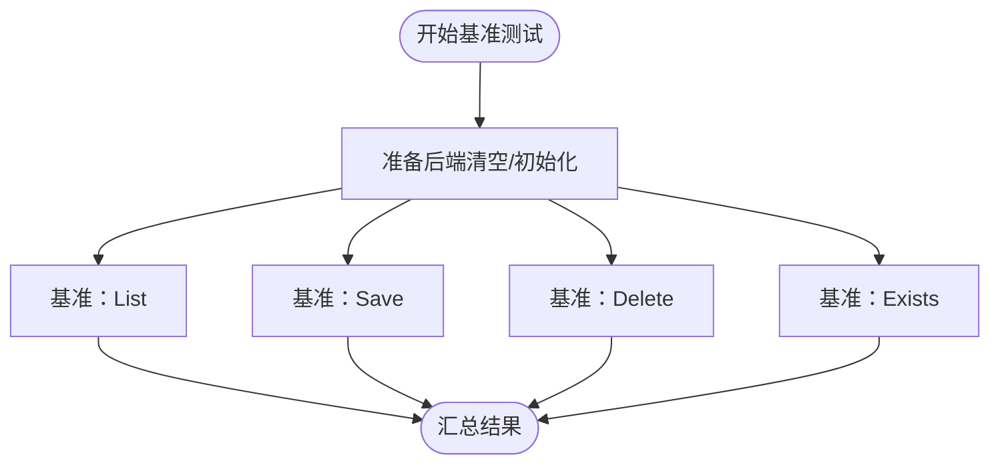
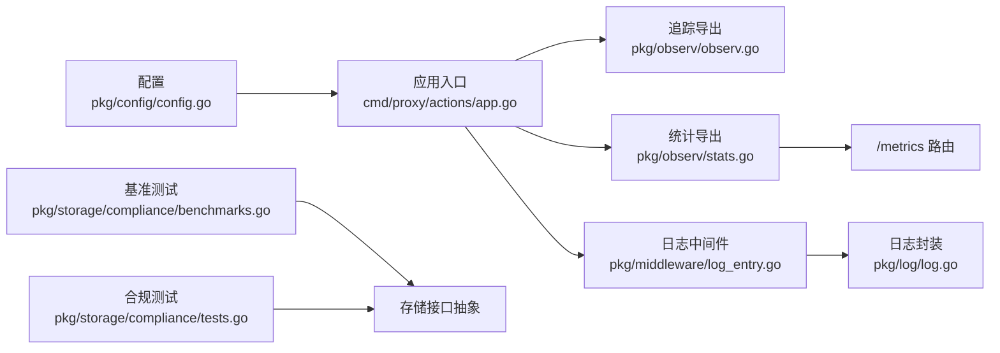
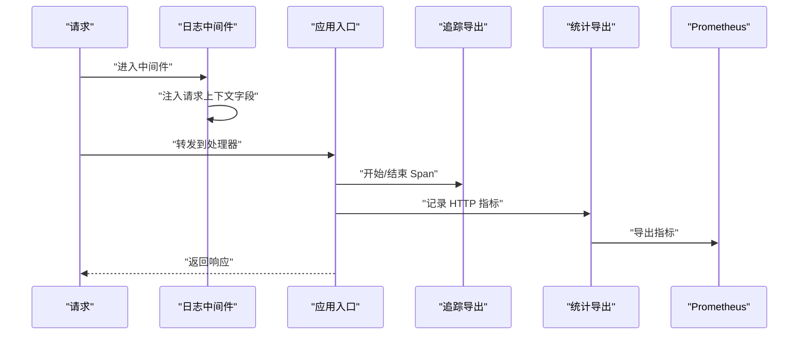

# 性能监控

<cite>
**本文引用的文件**
- [observ.go](file://pkg/observ/observ.go)
- [stats.go](file://pkg/observ/stats.go)
- [config.go](file://pkg/config/config.go)
- [app.go](file://cmd/proxy/actions/app.go)
- [log_entry.go](file://pkg/middleware/log_entry.go)
- [log.go](file://pkg/log/log.go)
- [errors.go](file://pkg/errors/errors.go)
- [benchmarks.go](file://pkg/storage/compliance/benchmarks.go)
- [tests.go](file://pkg/storage/compliance/tests.go)
- [benchmark.sh](file://scripts/benchmark.sh)
- [benchmark.ps1](file://scripts/ps/benchmark.ps1)
- [stat.go](file://cmd/proxy/actions/stat.go)
- [stat.go](file://pkg/stat/stat.go)
- [system_status.go](file://cmd/proxy/actions/system_status.go)
- [SystemStatus.vue](file://frontend/src/views/dashboard/SystemStatus.vue)
- [dashboard.ts](file://frontend/src/api/dashboard.ts)
</cite>

## 目录
1. [简介](#简介)
2. [项目结构](#项目结构)
3. [核心组件](#核心组件)
4. [架构总览](#架构总览)
5. [组件详解](#组件详解)
6. [依赖关系分析](#依赖关系分析)
7. [性能考量与优化建议](#性能考量与优化建议)
8. [故障排查指南](#故障排查指南)
9. [结论](#结论)
10. [附录](#附录)

## 简介
本文件面向运维与开发团队，系统性梳理 Athens 代理在性能监控方面的指标定义、数据采集与导出、基准测试与容量规划、瓶颈识别与优化策略，并给出可落地的告警与异常检测建议。内容覆盖下载性能监控、存储性能分析与系统资源使用跟踪，帮助读者建立从指标到可观测性的完整闭环。

## 项目结构
围绕性能监控的关键目录与文件：
- 观测与导出：pkg/observ（追踪与统计导出）
- 配置：pkg/config（导出器类型、采样与端口等）
- 应用入口：cmd/proxy/actions（注册导出器、路由与中间件）
- 日志与错误：pkg/log、pkg/errors（统一日志与错误分类）
- 存储合规与基准：pkg/storage/compliance（基准测试框架）
- 前端仪表盘：frontend（系统状态展示）

图表来源
- [app.go](file://cmd/proxy/actions/app.go#L46-L84)
- [observ.go](file://pkg/observ/observ.go#L14-L31)
- [stats.go](file://pkg/observ/stats.go#L17-L46)
- [config.go](file://pkg/config/config.go#L22-L66)
- [log_entry.go](file://pkg/middleware/log_entry.go#L12-L29)
- [log.go](file://pkg/log/log.go#L13-L27)
- [errors.go](file://pkg/errors/errors.go#L12-L22)
- [benchmarks.go](file://pkg/storage/compliance/benchmarks.go#L14-L22)
- [tests.go](file://pkg/storage/compliance/tests.go#L16-L28)
- [SystemStatus.vue](file://frontend/src/views/dashboard/SystemStatus.vue#L1-L146)
- [dashboard.ts](file://frontend/src/api/dashboard.ts#L37-L71)

章节来源
- [app.go](file://cmd/proxy/actions/app.go#L46-L84)
- [observ.go](file://pkg/observ/observ.go#L14-L31)
- [stats.go](file://pkg/observ/stats.go#L17-L46)
- [config.go](file://pkg/config/config.go#L22-L66)

## 核心组件
- 追踪导出器注册：支持 Jaeger、DataDog、Stackdriver；按环境动态采样策略。
- 统计导出器注册：支持 Prometheus、DataDog、Stackdriver；内置 HTTP 指标视图。
- 配置项：导出器类型与地址、统计导出器、pprof 开关与端口、工作线程数等。
- 请求日志中间件：统一注入请求上下文字段，便于关联追踪与指标。
- 错误与日志：统一错误分类与日志封装，便于定位性能问题根因。
- 基准测试框架：对 List/Save/Delete/Exists 等操作进行基准评估。
- 系统状态与仪表盘：后端提供系统状态接口，前端展示健康度、运行时与内存使用。

章节来源
- [observ.go](file://pkg/observ/observ.go#L14-L31)
- [stats.go](file://pkg/observ/stats.go#L17-L46)
- [config.go](file://pkg/config/config.go#L22-L66)
- [log_entry.go](file://pkg/middleware/log_entry.go#L12-L29)
- [errors.go](file://pkg/errors/errors.go#L12-L22)
- [benchmarks.go](file://pkg/storage/compliance/benchmarks.go#L14-L22)
- [system_status.go](file://cmd/proxy/actions/system_status.go#L52-L105)
- [SystemStatus.vue](file://frontend/src/views/dashboard/SystemStatus.vue#L1-L146)

## 架构总览
下图展示了从应用启动到指标与追踪导出的整体流程，以及与前端仪表盘的交互。

图表来源
- [app.go](file://cmd/proxy/actions/app.go#L46-L84)
- [observ.go](file://pkg/observ/observ.go#L14-L31)
- [stats.go](file://pkg/observ/stats.go#L17-L46)
- [config.go](file://pkg/config/config.go#L22-L66)

## 组件详解

### 追踪与统计导出器
- 追踪导出器
  - 支持类型：jaeger、datadog、stackdriver；未指定或不支持时返回错误。
  - 开发环境默认全量采样，生产环境按配置采样。
  - 返回 Flush/Stop 函数用于优雅关闭。
- 统计导出器
  - 支持类型：prometheus、datadog、stackdriver。
  - 注册内置 HTTP 指标视图：请求计数、字节数、延迟分布、状态码分布、方法分布等。
  - Prometheus 导出器同时注册 /metrics 路由。

图表来源
- [observ.go](file://pkg/observ/observ.go#L14-L31)
- [stats.go](file://pkg/observ/stats.go#L17-L46)
- [stats.go](file://pkg/observ/stats.go#L92-L110)

章节来源
- [observ.go](file://pkg/observ/observ.go#L14-L31)
- [observ.go](file://pkg/observ/observ.go#L33-L77)
- [observ.go](file://pkg/observ/observ.go#L79-L87)
- [stats.go](file://pkg/observ/stats.go#L17-L46)
- [stats.go](file://pkg/observ/stats.go#L48-L63)
- [stats.go](file://pkg/observ/stats.go#L65-L74)
- [stats.go](file://pkg/observ/stats.go#L76-L90)
- [stats.go](file://pkg/observ/stats.go#L92-L110)

### 配置与运行参数
- 关键配置项
  - 导出器类型与地址：ATHENS_TRACE_EXPORTER、ATHENS_TRACE_EXPORTER_URL、ATHENS_STATS_EXPORTER
  - 工作线程：ATHENS_GOGET_WORKERS、ATHENS_PROTOCOL_WORKERS
  - 日志级别与格式：ATHENS_LOG_LEVEL、ATHENS_LOG_FORMAT
  - pprof：ATHENS_ENABLE_PPROF、ATHENS_PPROF_PORT
  - 其他：端口、路径前缀、网络模式、超时等
- 默认值与环境覆盖：默认配置与环境变量覆盖逻辑，确保开发与生产差异可控。

章节来源
- [config.go](file://pkg/config/config.go#L22-L66)
- [config.go](file://pkg/config/config.go#L146-L213)
- [config.go](file://pkg/config/config.go#L256-L273)

### 请求日志与上下文
- 中间件在请求进入时构建日志条目，注入 HTTP 方法、路径与请求 ID，写入上下文供后续处理链使用。
- 日志构造器支持不同云平台格式与级别控制，便于集中化日志收集与检索。

章节来源
- [log_entry.go](file://pkg/middleware/log_entry.go#L12-L29)
- [log.go](file://pkg/log/log.go#L13-L27)

### 错误与异常分类
- 错误类别：未找到、坏请求、意外错误、已存在、限流、未实现、重定向、网关超时等。
- 统一错误包装与栈追踪，便于结合追踪与指标定位问题。

章节来源
- [errors.go](file://pkg/errors/errors.go#L12-L22)
- [errors.go](file://pkg/errors/errors.go#L24-L51)

### 基准测试与合规测试
- 基准测试
  - 对 List/Save/Delete/Exists 四类操作进行基准评估，支持多后端对比。
  - 提供脚本一键执行所有存储相关基准测试。
- 合规测试
  - 覆盖不存在、前缀列表隔离、Get/Exists/Delete 等行为验证，保证存储一致性。

图表来源
- [benchmarks.go](file://pkg/storage/compliance/benchmarks.go#L14-L22)
- [benchmarks.go](file://pkg/storage/compliance/benchmarks.go#L24-L46)
- [benchmarks.go](file://pkg/storage/compliance/benchmarks.go#L48-L74)
- [benchmarks.go](file://pkg/storage/compliance/benchmarks.go#L76-L96)
- [benchmarks.go](file://pkg/storage/compliance/benchmarks.go#L98-L117)

章节来源
- [benchmarks.go](file://pkg/storage/compliance/benchmarks.go#L14-L22)
- [tests.go](file://pkg/storage/compliance/tests.go#L16-L28)
- [benchmark.sh](file://scripts/benchmark.sh#L1-L4)
- [benchmark.ps1](file://scripts/ps/benchmark.ps1#L1-L2)

### 系统状态与前端展示
- 后端接口提供健康度、运行时、版本、Go 版本、内存使用等信息。
- 前端页面展示系统状态卡片，支持刷新与响应式布局。

章节来源
- [system_status.go](file://cmd/proxy/actions/system_status.go#L52-L105)
- [SystemStatus.vue](file://frontend/src/views/dashboard/SystemStatus.vue#L1-L146)
- [dashboard.ts](file://frontend/src/api/dashboard.ts#L37-L71)

## 依赖关系分析
- 应用入口依赖配置模块以决定导出器类型与端口；注册追踪与统计导出器后，导出器负责将数据发送至外部系统。
- 日志中间件与日志模块贯穿请求生命周期，为性能分析提供上下文与可追溯性。
- 基准测试与合规测试通过统一的存储接口抽象，确保不同后端的可比性。

图表来源
- [config.go](file://pkg/config/config.go#L22-L66)
- [app.go](file://cmd/proxy/actions/app.go#L46-L84)
- [observ.go](file://pkg/observ/observ.go#L14-L31)
- [stats.go](file://pkg/observ/stats.go#L17-L46)
- [log_entry.go](file://pkg/middleware/log_entry.go#L12-L29)
- [log.go](file://pkg/log/log.go#L13-L27)
- [benchmarks.go](file://pkg/storage/compliance/benchmarks.go#L14-L22)
- [tests.go](file://pkg/storage/compliance/tests.go#L16-L28)

章节来源
- [config.go](file://pkg/config/config.go#L22-L66)
- [app.go](file://cmd/proxy/actions/app.go#L46-L84)
- [observ.go](file://pkg/observ/observ.go#L14-L31)
- [stats.go](file://pkg/observ/stats.go#L17-L46)
- [log_entry.go](file://pkg/middleware/log_entry.go#L12-L29)
- [log.go](file://pkg/log/log.go#L13-L27)
- [benchmarks.go](file://pkg/storage/compliance/benchmarks.go#L14-L22)
- [tests.go](file://pkg/storage/compliance/tests.go#L16-L28)

## 性能考量与优化建议

### 性能指标定义
- 下载性能
  - 延迟分布（P50/P90/P99）、吞吐（字节/秒）、错误率（按状态码分类）
  - 客户端维度：完成次数、往返延迟分布
- 存储性能
  - List/Save/Delete/Exists 的平均耗时与 P95/P99
  - 并发场景下的吞吐与锁竞争表现
- 系统资源
  - CPU 使用率、内存占用、GC 活动、goroutine 数量
  - pprof 支持：启用 ATHENS_ENABLE_PPROF 并配置端口

章节来源
- [stats.go](file://pkg/observ/stats.go#L92-L110)
- [config.go](file://pkg/config/config.go#L33-L34)
- [config.go](file://pkg/config/config.go#L156-L158)

### 数据采集与导出
- 追踪：按环境自动采样策略，开发环境全采样，生产环境按需采样。
- 统计：Prometheus 导出器自动暴露 /metrics；其他导出器按需配置。
- 日志：统一字段（方法、路径、请求 ID），便于关联指标与追踪。

章节来源
- [observ.go](file://pkg/observ/observ.go#L60-L65)
- [stats.go](file://pkg/observ/stats.go#L48-L63)
- [log_entry.go](file://pkg/middleware/log_entry.go#L12-L29)

### 基准测试与容量规划
- 使用基准脚本对存储后端进行批量基准评估，识别热点操作与瓶颈。
- 结合合规测试确保功能正确性，避免“伪性能”。
- 建议：以 QPS 为目标进行压力测试，逐步提升并发与数据规模，记录 P95/P99 延迟与资源占用。

章节来源
- [benchmarks.go](file://pkg/storage/compliance/benchmarks.go#L14-L22)
- [benchmark.sh](file://scripts/benchmark.sh#L1-L4)
- [benchmark.ps1](file://scripts/ps/benchmark.ps1#L1-L2)
- [tests.go](file://pkg/storage/compliance/tests.go#L16-L28)

### 瓶颈识别方法
- 通过追踪与指标联合定位：先看延迟分布与错误率，再结合日志上下文与请求 ID 追溯调用链。
- 使用 pprof 分析 CPU/内存热点，识别阻塞点与 GC 压力。
- 存储层面：对比 List/Save/Delete/Exists 的耗时曲线，判断索引/IO/锁问题。

章节来源
- [observ.go](file://pkg/observ/observ.go#L60-L65)
- [config.go](file://pkg/config/config.go#L33-L34)
- [log_entry.go](file://pkg/middleware/log_entry.go#L12-L29)

### 负载测试策略
- 渐进式压测：从低并发到目标 QPS，观察延迟与错误率拐点。
- 场景覆盖：同步/异步下载、大包/小包、热/冷命中、并发删除与存在性检查。
- 多后端对比：在 S3/GCS/Mongo/MinIO 等后端上重复压测，形成基线。

章节来源
- [benchmarks.go](file://pkg/storage/compliance/benchmarks.go#L14-L22)

### 扩展与容量规划
- 计算机资源：根据 P99 延迟与 CPU/内存使用率确定扩容阈值。
- 存储扩展：分片/分区、缓存层（如 Redis）前置、对象存储分桶策略。
- 网络与上游：合理设置超时与并发，避免上游限流导致尾延迟。

章节来源
- [config.go](file://pkg/config/config.go#L27-L29)
- [config.go](file://pkg/config/config.go#L56-L58)

### 性能优化建议
- 调整工作线程：ATHENS_GOGET_WORKERS、ATHENS_PROTOCOL_WORKERS，结合 CPU 核心数与 IO 特性。
- 启用/优化 pprof：定位热点函数与内存分配，减少逃逸与锁竞争。
- 存储优化：预热索引、批量写入、压缩传输、合理的版本清理策略。

章节来源
- [config.go](file://pkg/config/config.go#L27-L29)
- [config.go](file://pkg/config/config.go#L33-L34)

### 资源配置调整
- 端口与路径前缀：ATHENS_PORT、ATHENS_PATH_PREFIX，适配反向代理与 Ingress。
- 日志级别与格式：ATHENS_LOG_LEVEL、ATHENS_LOG_FORMAT，平衡可观测性与开销。
- 导出器：ATHENS_STATS_EXPORTER、ATHENS_TRACE_EXPORTER、ATHENS_TRACE_EXPORTER_URL，确保监控系统可达。

章节来源
- [config.go](file://pkg/config/config.go#L38-L39)
- [config.go](file://pkg/config/config.go#L41-L42)
- [config.go](file://pkg/config/config.go#L36-L37)

## 故障排查指南

### 常见问题定位步骤
- 检查导出器配置是否正确，确认 /metrics 是否可用。
- 查看日志上下文中的请求 ID，结合追踪 ID 定位具体请求。
- 使用 pprof 分析 CPU/内存，识别异常热点。
- 对照基准测试结果，判断当前性能是否偏离基线。

章节来源
- [stats.go](file://pkg/observ/stats.go#L48-L63)
- [log_entry.go](file://pkg/middleware/log_entry.go#L12-L29)
- [config.go](file://pkg/config/config.go#L33-L34)
- [benchmarks.go](file://pkg/storage/compliance/benchmarks.go#L14-L22)

### 异常检测与告警
- 指标阈值：延迟 P99、错误率、内存使用率、CPU 利用率、GC 次数/暂停时间。
- 告警联动：结合日志与追踪，触发自动扩缩容或降级策略。
- 前端可视化：利用系统状态页与仪表盘，快速发现异常。

章节来源
- [errors.go](file://pkg/errors/errors.go#L12-L22)
- [system_status.go](file://cmd/proxy/actions/system_status.go#L52-L105)
- [SystemStatus.vue](file://frontend/src/views/dashboard/SystemStatus.vue#L1-L146)

## 结论
通过统一的追踪与统计导出、完善的日志与错误体系、可复现的基准与合规测试，以及前端可视化面板，Athens 形成了覆盖下载性能、存储性能与系统资源的完整性能监控闭环。建议在生产中启用合适的导出器与采样策略，持续进行基准回归与容量规划，配合 pprof 与日志上下文，快速定位并解决性能瓶颈。

## 附录

### 关键流程时序：指标采集与导出

图表来源
- [log_entry.go](file://pkg/middleware/log_entry.go#L12-L29)
- [app.go](file://cmd/proxy/actions/app.go#L46-L84)
- [observ.go](file://pkg/observ/observ.go#L89-L93)
- [stats.go](file://pkg/observ/stats.go#L92-L110)