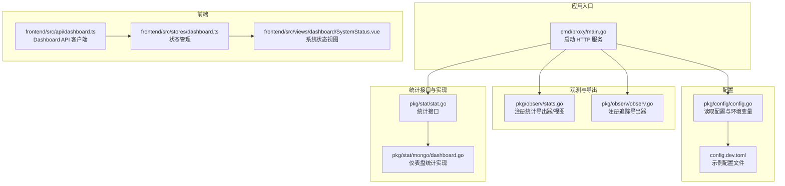
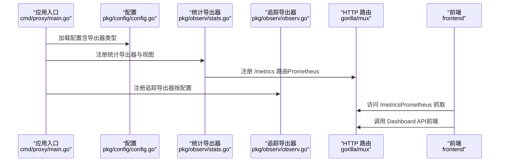
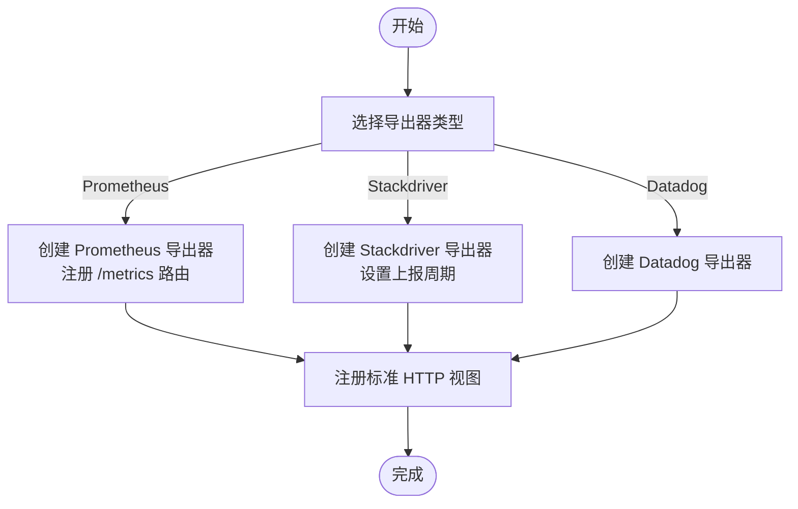
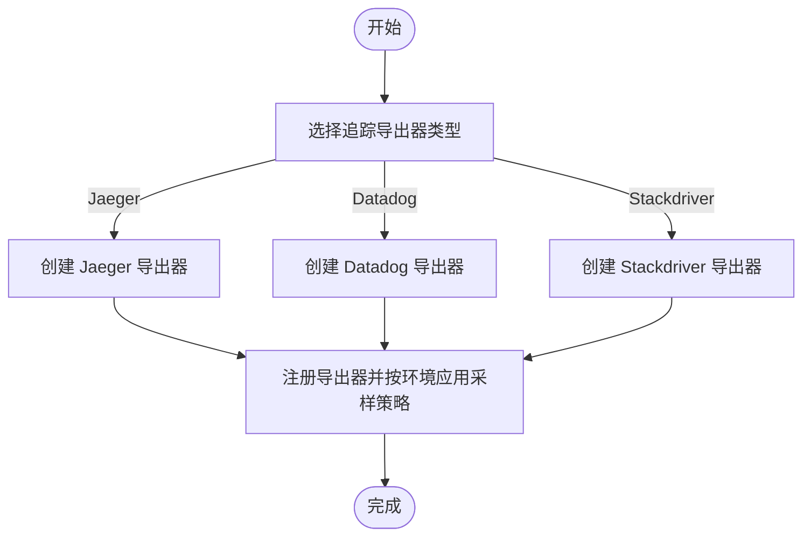
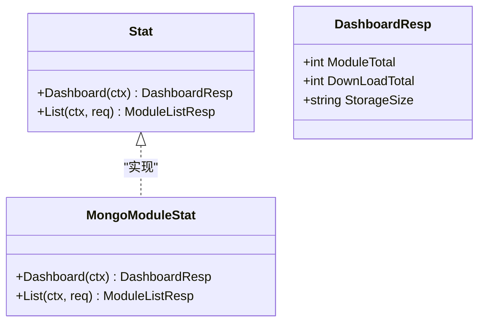
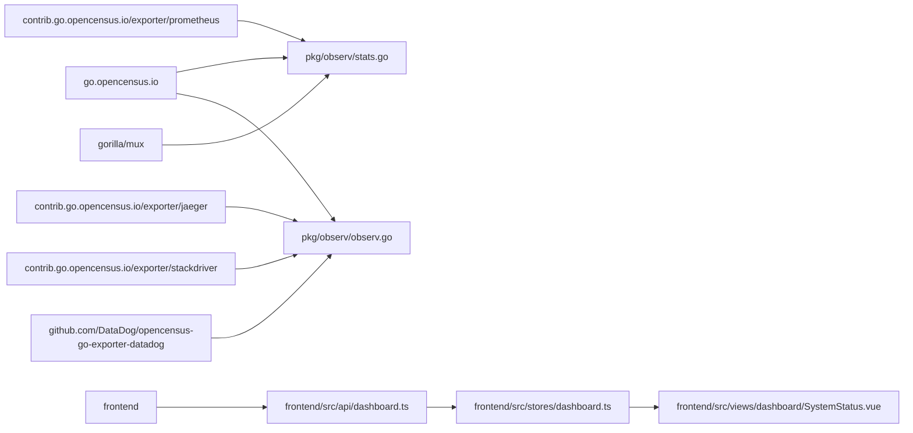

# 指标收集

<cite>
**本文引用的文件**
- [pkg/observ/observ.go](file://pkg/observ/observ.go)
- [pkg/observ/stats.go](file://pkg/observ/stats.go)
- [cmd/proxy/main.go](file://cmd/proxy/main.go)
- [pkg/config/config.go](file://pkg/config/config.go)
- [config.dev.toml](file://config.dev.toml)
- [pkg/stat/stat.go](file://pkg/stat/stat.go)
- [pkg/stat/types.go](file://pkg/stat/types.go)
- [pkg/stat/mongo/dashboard.go](file://pkg/stat/mongo/dashboard.go)
- [pkg/admin/api.go](file://pkg/admin/api.go)
- [frontend/src/api/dashboard.ts](file://frontend/src/api/dashboard.ts)
- [frontend/src/stores/dashboard.ts](file://frontend/src/stores/dashboard.ts)
- [frontend/src/views/dashboard/SystemStatus.vue](file://frontend/src/views/dashboard/SystemStatus.vue)
- [go.mod](file://go.mod)
</cite>

## 目录
1. [简介](#简介)
2. [项目结构](#项目结构)
3. [核心组件](#核心组件)
4. [架构总览](#架构总览)
5. [组件详解](#组件详解)
6. [依赖关系分析](#依赖关系分析)
7. [性能与可观测性特性](#性能与可观测性特性)
8. [故障排查指南](#故障排查指南)
9. [结论](#结论)
10. [附录](#附录)

## 简介
本文件面向运维与开发人员，系统化阐述 Athens 的指标收集体系：基于 OpenCensus 的指标与追踪集成、指标类型与采集机制、系统状态与业务指标的采集方式、Prometheus 暴露与监控仪表板配置、自定义指标开发与聚合策略，以及告警与最佳实践建议。文档以仓库中实际实现为依据，避免臆测，确保可操作性。

## 项目结构
围绕指标与可观测性的关键目录与文件：
- 观测与导出层：pkg/observ（OpenCensus 导出器注册与视图）
- 配置层：pkg/config（导出器类型、端口等配置项）
- 统计接口与实现：pkg/stat（接口）、pkg/stat/mongo（MongoDB 仪表盘统计）
- 前端仪表板：frontend（Dashboard API、Store、视图）
- 应用入口：cmd/proxy/main.go（HTTP 服务启动）

图表来源
- [cmd/proxy/main.go](file://cmd/proxy/main.go#L29-L127)
- [pkg/config/config.go](file://pkg/config/config.go#L21-L66)
- [pkg/observ/stats.go](file://pkg/observ/stats.go#L17-L46)
- [pkg/observ/observ.go](file://pkg/observ/observ.go#L14-L31)
- [pkg/stat/stat.go](file://pkg/stat/stat.go#L5-L8)
- [pkg/stat/mongo/dashboard.go](file://pkg/stat/mongo/dashboard.go#L13-L51)
- [frontend/src/api/dashboard.ts](file://frontend/src/api/dashboard.ts#L47-L71)
- [frontend/src/stores/dashboard.ts](file://frontend/src/stores/dashboard.ts#L44-L85)
- [frontend/src/views/dashboard/SystemStatus.vue](file://frontend/src/views/dashboard/SystemStatus.vue#L77-L92)

章节来源
- [cmd/proxy/main.go](file://cmd/proxy/main.go#L29-L127)
- [pkg/config/config.go](file://pkg/config/config.go#L21-L66)
- [pkg/observ/stats.go](file://pkg/observ/stats.go#L17-L46)
- [pkg/observ/observ.go](file://pkg/observ/observ.go#L14-L31)
- [pkg/stat/stat.go](file://pkg/stat/stat.go#L5-L8)
- [pkg/stat/mongo/dashboard.go](file://pkg/stat/mongo/dashboard.go#L13-L51)
- [frontend/src/api/dashboard.ts](file://frontend/src/api/dashboard.ts#L47-L71)
- [frontend/src/stores/dashboard.ts](file://frontend/src/stores/dashboard.ts#L44-L85)
- [frontend/src/views/dashboard/SystemStatus.vue](file://frontend/src/views/dashboard/SystemStatus.vue#L77-L92)

## 核心组件
- 统计导出器注册与视图
  - 支持导出器：Prometheus、Stackdriver、Datadog
  - 自动注册 HTTP 路由 /metrics（Prometheus）
  - 注册标准 HTTP 指标视图（请参见“注册视图”部分）
- 追踪导出器注册
  - 支持 Jaeger、Datadog、Stackdriver
  - 开发环境默认 AlwaysSample
- 配置驱动
  - 通过环境变量或配置文件控制导出器类型与目标
- 业务指标与仪表盘
  - 统一统计接口 Stat，Mongo 实现提供模块总数、存储大小等
  - 前端 Dashboard API 与 Store 协同展示系统状态

章节来源
- [pkg/observ/stats.go](file://pkg/observ/stats.go#L17-L46)
- [pkg/observ/observ.go](file://pkg/observ/observ.go#L14-L31)
- [pkg/config/config.go](file://pkg/config/config.go#L36-L38)
- [pkg/stat/stat.go](file://pkg/stat/stat.go#L5-L8)
- [pkg/stat/mongo/dashboard.go](file://pkg/stat/mongo/dashboard.go#L13-L51)

## 架构总览
下图展示了指标与追踪在应用中的集成路径：配置加载后，应用在路由上注册 Prometheus 导出器与视图；同时根据配置选择性启用追踪导出器；业务统计通过统一接口实现并可被前端调用。

图表来源
- [cmd/proxy/main.go](file://cmd/proxy/main.go#L59-L62)
- [pkg/config/config.go](file://pkg/config/config.go#L36-L38)
- [pkg/observ/stats.go](file://pkg/observ/stats.go#L17-L46)
- [pkg/observ/observ.go](file://pkg/observ/observ.go#L14-L31)

## 组件详解

### 统计导出器与视图注册
- 导出器类型
  - Prometheus：自动注册 /metrics 路由，命名空间为服务名
  - Stackdriver：设置上报周期为 60 秒
  - Datadog：初始化并返回 Stop 函数
- 注册视图
  - 自动注册标准 HTTP 指标：请求计数、响应字节数、延迟、按状态码/方法的计数、客户端接收字节分布、往返延迟分布、完成计数等

图表来源
- [pkg/observ/stats.go](file://pkg/observ/stats.go#L17-L46)
- [pkg/observ/stats.go](file://pkg/observ/stats.go#L92-L110)

章节来源
- [pkg/observ/stats.go](file://pkg/observ/stats.go#L17-L46)
- [pkg/observ/stats.go](file://pkg/observ/stats.go#L92-L110)

### 追踪导出器注册
- 支持 Jaeger、Datadog、Stackdriver
- 开发环境默认 AlwaysSample
- 提供 StartSpan 工具函数用于业务埋点

图表来源
- [pkg/observ/observ.go](file://pkg/observ/observ.go#L14-L31)
- [pkg/observ/observ.go](file://pkg/observ/observ.go#L60-L65)

章节来源
- [pkg/observ/observ.go](file://pkg/observ/observ.go#L14-L31)
- [pkg/observ/observ.go](file://pkg/observ/observ.go#L60-L65)

### 配置与环境变量
- 关键配置项
  - StatsExporter：统计导出器类型（如 prometheus）
  - TraceExporter、TraceExporterURL：追踪导出器类型与目标
  - Port、UnixSocket：监听端口或 Unix Socket
- 默认行为
  - 开发模式默认 StatsExporter 为 prometheus
  - TraceExporter 默认未指定

章节来源
- [pkg/config/config.go](file://pkg/config/config.go#L36-L38)
- [pkg/config/config.go](file://pkg/config/config.go#L158-L167)
- [config.dev.toml](file://config.dev.toml#L230-L234)
- [config.dev.toml](file://config.dev.toml#L220-L228)

### 业务指标与仪表盘
- 统一接口 Stat
  - Dashboard(ctx)：返回模块总数、下载次数、存储大小等
  - List(ctx, req)：分页列出模块版本
- MongoDB 实现
  - 通过 CountDocuments 获取模块总数
  - 通过 dbStats 获取存储大小并格式化为 GB 字符串
  - 基于 observ.StartSpan 进行追踪埋点
- 前端集成
  - Dashboard API 客户端封装 /dashboard 与 /system/status
  - Pinia Store 管理状态与刷新逻辑
  - Vue 视图渲染系统状态卡片与刷新按钮

图表来源
- [pkg/stat/stat.go](file://pkg/stat/stat.go#L5-L8)
- [pkg/stat/types.go](file://pkg/stat/types.go#L19-L23)
- [pkg/stat/mongo/dashboard.go](file://pkg/stat/mongo/dashboard.go#L13-L51)

章节来源
- [pkg/stat/stat.go](file://pkg/stat/stat.go#L5-L8)
- [pkg/stat/types.go](file://pkg/stat/types.go#L1-L23)
- [pkg/stat/mongo/dashboard.go](file://pkg/stat/mongo/dashboard.go#L13-L51)
- [frontend/src/api/dashboard.ts](file://frontend/src/api/dashboard.ts#L47-L71)
- [frontend/src/stores/dashboard.ts](file://frontend/src/stores/dashboard.ts#L44-L85)
- [frontend/src/views/dashboard/SystemStatus.vue](file://frontend/src/views/dashboard/SystemStatus.vue#L77-L92)

### 指标类型与使用场景
- 计数器（Counter）
  - 用途：累计请求总量、错误次数、下载次数
  - 来源：HTTP ServerRequestCountView、ServerResponseCountByStatusCode、ClientCompletedCount 等
- 直方图（Histogram/Distribution）
  - 用途：延迟分布、传输字节分布
  - 来源：ServerLatencyView、ClientRoundtripLatencyDistribution、ServerResponseBytesView、ClientReceivedBytesDistribution 等
- 仪表板（Dashboard）
  - 用途：系统状态概览（模块总数、存储大小、运行时信息）
  - 来源：Mongo 实现的 Dashboard 接口与前端 Store/View

章节来源
- [pkg/observ/stats.go](file://pkg/observ/stats.go#L92-L110)
- [pkg/stat/mongo/dashboard.go](file://pkg/stat/mongo/dashboard.go#L13-L51)

### Prometheus 集成指南
- 启用与暴露
  - 设置 StatsExporter 为 prometheus
  - 应用启动后在 /metrics 暴露指标
- 抓取配置
  - 在 Prometheus 中添加 job，抓取 /metrics 路由
- 指标命名与标签
  - Prometheus 导出器使用服务名作为命名空间，便于多实例区分

章节来源
- [pkg/observ/stats.go](file://pkg/observ/stats.go#L48-L63)
- [pkg/config/config.go](file://pkg/config/config.go#L36-L38)
- [config.dev.toml](file://config.dev.toml#L230-L234)

### 追踪与分布式链路
- 追踪导出器
  - 支持 Jaeger、Datadog、Stackdriver
  - 开发环境默认 AlwaysSample
- 业务埋点
  - 使用 StartSpan(ctx, op) 开启 Span，结合 defer span.End() 结束
  - 在统计实现中已示范如何包裹业务逻辑

章节来源
- [pkg/observ/observ.go](file://pkg/observ/observ.go#L14-L31)
- [pkg/observ/observ.go](file://pkg/observ/observ.go#L60-L65)
- [pkg/stat/mongo/dashboard.go](file://pkg/stat/mongo/dashboard.go#L15-L16)

### 自定义指标开发与聚合
- 新增指标
  - 参考注册视图的方式，扩展 view.Register 以纳入新的指标
  - 在业务代码中使用 OpenCensus API 记录数据
- 指标聚合
  - Prometheus 支持在服务端进行聚合与降采样
  - 建议在查询侧使用 PromQL 进行聚合，避免在应用侧重复计算

章节来源
- [pkg/observ/stats.go](file://pkg/observ/stats.go#L92-L110)

### 存储策略
- 指标存储
  - Prometheus：本地存储或远端写入（取决于部署）
  - Stackdriver/Datadog：云端平台存储
- 业务统计存储
  - 仪表盘数据来自 MongoDB，建议开启副本集与备份策略

章节来源
- [pkg/observ/stats.go](file://pkg/observ/stats.go#L23-L40)
- [pkg/stat/mongo/dashboard.go](file://pkg/stat/mongo/dashboard.go#L13-L51)

## 依赖关系分析
- OpenCensus 生态
  - 导出器：prometheus、jaeger、stackdriver、datadog
  - 插件：ochttp（自动采集 HTTP 指标）
- 前端与后端交互
  - 前端通过 /dashboard 与 /system/status 获取数据
  - Store 统一管理加载状态与刷新

图表来源
- [go.mod](file://go.mod#L5-L48)
- [pkg/observ/stats.go](file://pkg/observ/stats.go#L17-L46)
- [pkg/observ/observ.go](file://pkg/observ/observ.go#L14-L31)
- [frontend/src/api/dashboard.ts](file://frontend/src/api/dashboard.ts#L47-L71)
- [frontend/src/stores/dashboard.ts](file://frontend/src/stores/dashboard.ts#L44-L85)
- [frontend/src/views/dashboard/SystemStatus.vue](file://frontend/src/views/dashboard/SystemStatus.vue#L77-L92)

章节来源
- [go.mod](file://go.mod#L5-L48)
- [pkg/observ/stats.go](file://pkg/observ/stats.go#L17-L46)
- [pkg/observ/observ.go](file://pkg/observ/observ.go#L14-L31)
- [frontend/src/api/dashboard.ts](file://frontend/src/api/dashboard.ts#L47-L71)
- [frontend/src/stores/dashboard.ts](file://frontend/src/stores/dashboard.ts#L44-L85)
- [frontend/src/views/dashboard/SystemStatus.vue](file://frontend/src/views/dashboard/SystemStatus.vue#L77-L92)

## 性能与可观测性特性
- HTTP 指标覆盖
  - 请求量、延迟、字节数、按状态码/方法的分布
- 上报周期
  - Stackdriver 导出器设置 60 秒上报周期
- 开发体验
  - 开发环境 AlwaysSample，便于调试链路
- 前端仪表板
  - 展示系统状态、运行时信息与刷新能力

章节来源
- [pkg/observ/stats.go](file://pkg/observ/stats.go#L76-L89)
- [pkg/observ/observ.go](file://pkg/observ/observ.go#L60-L65)
- [frontend/src/views/dashboard/SystemStatus.vue](file://frontend/src/views/dashboard/SystemStatus.vue#L60-L79)

## 故障排查指南
- 导出器未配置
  - 若 StatsExporter 为空，将返回错误提示“StatsExporter not specified”
- 不支持的导出器类型
  - 当导出器类型不在支持列表时，会返回错误提示
- 追踪导出器 URL 为空
  - Jaeger 导出器要求 URL 非空，否则返回错误
- Prometheus 暴露端口冲突
  - 确认 Port 或 UnixSocket 配置正确，避免端口占用
- 仪表盘数据为空
  - 检查 MongoDB 连接与权限，确认集合存在且有数据

章节来源
- [pkg/observ/stats.go](file://pkg/observ/stats.go#L36-L40)
- [pkg/observ/observ.go](file://pkg/observ/observ.go#L36-L40)
- [pkg/config/config.go](file://pkg/config/config.go#L36-L38)
- [config.dev.toml](file://config.dev.toml#L230-L234)

## 结论
Athens 的指标与可观测性体系以 OpenCensus 为核心，通过配置驱动灵活选择导出器，并自动注册标准 HTTP 指标视图。统计接口与前端仪表板协同，形成从采集、暴露到可视化的完整闭环。生产部署建议优先采用 Prometheus 暴露指标，结合 Grafana/Alertmanager 构建监控与告警方案；追踪方面可根据团队技术栈选择 Jaeger/Stackdriver/Datadog。

## 附录

### 指标类型与典型用途对照
- 计数器
  - 全局请求总量、按状态码的错误计数、下载完成次数
- 直方图
  - 服务端延迟分布、客户端往返延迟分布、网络字节分布
- 仪表板
  - 模块总数、存储使用量、系统健康状态

章节来源
- [pkg/observ/stats.go](file://pkg/observ/stats.go#L92-L110)
- [pkg/stat/mongo/dashboard.go](file://pkg/stat/mongo/dashboard.go#L13-L51)